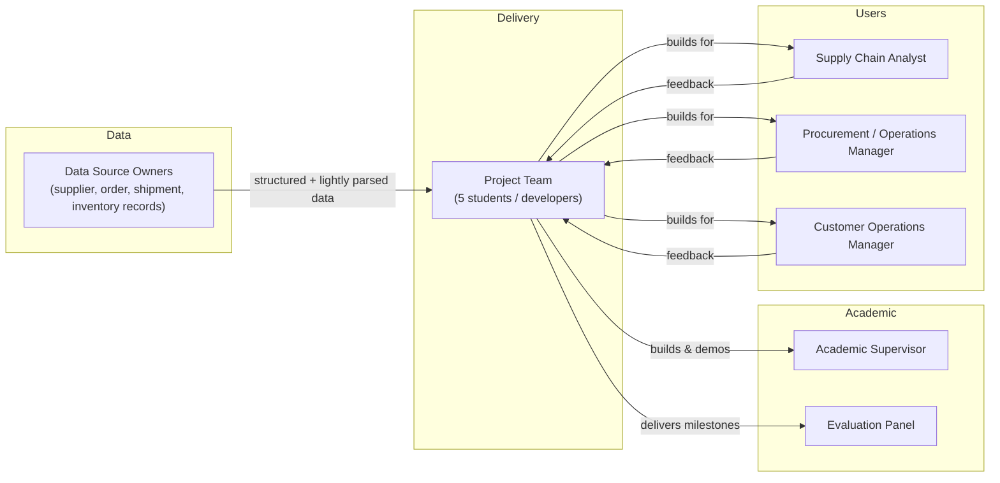
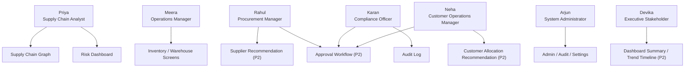

# Document 1 — Product Requirement Document (PRD)

## Graph Neural Network and Generative AI-Based Supply Chain Risk Prediction System

**Six-Layer Architecture with Retrieval-Augmented Reasoning, Autonomous Execution, an Interactive Chatbot, and Extended Decision-Support Features**

Version: 1.0
Status: Baseline
Source of Truth: `docs/problem_statement.md`

---

## 1. Purpose

This Product Requirement Document defines what the Graph Neural Network (GNN) and Generative AI-based Supply Chain Risk Prediction System must do, for whom, and to what standard, across its two delivery phases. It translates the problem statement's six-layer architecture and six extended decision-support features into functional requirements, non-functional requirements, user personas, user stories, and success metrics that all downstream documents (Technical Specification, UI/UX, Database Design, API Documentation, AI/ML Documentation, etc.) must remain consistent with.

This document is the product-level contract between the project's stakeholders (evaluators, end users, and the five-person development team implementing the system) and the system being built. No requirement in this document introduces a feature beyond what is described in `docs/problem_statement.md`; every requirement is a direct, implementation-level expansion of an existing statement in that document.

## 2. Scope

### 2.1 In Scope — Phase 1 (Compressed Delivery, Target: 2026-11-15)

**Superseded framing note:** the original 15-week/2026-11-01 window described below has been compressed and rebalanced per `updates/Other_Tools.md` Section 10.5 — the target date is now **2026-11-15**, and this section's item list has been reconciled against that rebalancing (not just re-dated). Phase 1 still proves the core hypothesis of the project: that representing a supply chain as a heterogeneous graph and scoring it with a GNN-Transformer hybrid produces more useful risk predictions than row-by-row models — plus a thin, working slice of the explanation/interaction story, with a usable dashboard around all of it.

| # | Capability | Problem Statement / Update Reference |
|---|---|---|
| 1 | Authentication (login, session management, RBAC foundation) | Layer 6, Document scope list |
| 2 | PostgreSQL structured data store | Section 9 (Technologies), Layer 1 |
| 3 | Graph construction from structured records | Layer 1 |
| 4 | Heterogeneous supply chain graph (suppliers, components, products, factories, warehouses, shipments, orders) | Layer 1, Section 4 |
| 5 | GNN + Transformer risk prediction (delay probability, shortage risk, disruption impact) | Layer 2 |
| 6 | Simple explainability (explanation subgraph via GNNExplainer, basic highlighting) | Layer 2, Section 5.3 (backend output only) |
| 7 | REST APIs exposing graph, prediction, and auth operations | Layer 6, Section 9 |
| 8 | React dashboard shell (core screens only — see Document 3) | Layer 6 |
| 9 | Graph visualization (D3-based, risk-colored) | Layer 6, Section 9 |
| 10 | Architecture ablation (GraphSAGE → GAT → HGT) with a documented research rationale per stage, each logged under a distinct `model_version` — **the project's protected core research contribution; see `updates/Other_Tools.md` Section 10.3** | Layer 2, Section 4 |
| 11 | Risk Intelligence Layer: confidence estimation, business aggregation (weighted formula as alternative to GNN-native score), threshold evaluation, risk categorization, `scoring_method`/`confidence`/`risk_category` recorded per row | Risk Intelligence Layer, Section 4 |
| 12 | Persisted evaluation metrics (classification + regression) and model-governance metadata (dataset, timestamp, experiment ID, git commit, hyperparameters, status) per training run, exposed via REST | Layer 2, Section 4 |
| 13 | `customers` table as a first-class entity, replacing free-text `orders.customer_name` | Section 5.8 — schema only; allocation optimization logic is Phase 2 |
| 14 | Decision Intelligence Layer foundation: business-rule/policy validation hooks, decision-trace schema | Decision Intelligence Layer, Section 4 — full recommendation-path routing is Phase 2 |
| 15 | Single-point-of-failure (SPOF) analysis — supplier reachability traversal, no ML model (FR-SPOF-01/02) | `updates/New_Features.md` F-01 |
| 16 | Supplier segmentation — k-means clustering over existing supplier embeddings (FR-SEG-01/02) | `updates/New_Features.md` F-02 |
| 17 | Geographic concentration analysis — supplier/factory exposure by country/location, pure SQL (FR-GEO-01) | `updates/New_Features.md` F-03 |
| 18 | Spend and dependency concentration analysis — sole-source exposure by component type, pure SQL (FR-SPEND-01) | `updates/New_Features.md` F-04 |
| 19 | New-supplier onboarding risk — demo only, reuses the trained model on a prospective supplier's own attributes, no new head (FR-ONBOARD-01) | `updates/New_Features.md` F-07 |
| 20 | A **thin RAG + LLM + Chatbot vertical slice** — one supplier, one grounded explanation, one-turn Q&A — preserving the closed-loop narrative without the full production pipeline; multi-turn history, in-chat approval, and hybrid-search tuning are deferred to Phase 2 | `updates/Other_Tools.md` Section 10.5 |

### 2.2 Out of Scope — Phase 1 (Deferred to Phase 2, or Not Committed)

The following are explicitly **not** built in Phase 1:

- Full production RAG pipeline (multi-collection hybrid search tuning, re-indexing at scale) — item 20 above ships only a thin single-supplier slice in Phase 1
- Full chatbot production features (multi-turn history, in-chat approval, hybrid search tuning) — item 20 above ships only one-turn Q&A in Phase 1
- Model Context Protocol (MCP) execution layer
- ERP / procurement system integration
- Alternative-supplier recommendation
- What-if scenario simulator
- Risk trend timeline
- Proactive MCP-based alerts
- **The Layer 2 architecture upgrade** (HGT 4-layer intermediate-output retention, Transformer 1 depth attention, Transformer 2 type-constrained global attention, Markov Claims A and B, the fourth ablation stage) — **Not committed — Phase 2 (early April 2027) or later; stretch-only before then, and only after RG-01 is solid.** Full specification: `updates/Supplier_Risk_Prediction.md`.
- **Demand forecasting** — **Not in scope — documented as a future extension idea only, no committed delivery phase.** See Section 15 and `updates/New_Features.md` F-12.

### 2.3 In Scope — Phase 2 (Target: early April 2027)

Phase 2 **extends** Phase 1 without redesigning it, per the rebalancing in `updates/Other_Tools.md` Section 10.5.

| # | Capability | Problem Statement / Update Reference |
|---|---|---|
| 1 | RAG — full production pipeline (vector database, multi-collection hybrid search tuning, re-indexing at scale); a thin single-supplier slice already ships in Phase 1 (§2.1 item 20) | Layer 3 |
| 2 | LLM plain-language explanation generation — full production scope | Layer 4 |
| 3 | Interactive chatbot — full production scope (multi-turn history, in-chat approval); one-turn Q&A already ships in Phase 1 (§2.1 item 20) | Section 5.1 |
| 4 | Full visual explainability overlay on graph view (color-by-risk, chatbot sync) | Section 5.3 |
| 5 | Alternative-supplier recommendation | Section 5.4 |
| 6 | What-if scenario simulator | Section 5.2 |
| 7 | Risk trend timeline | Section 5.5 |
| 8 | MCP execution layer (sandbox/mock ERP target only — never live production ERP write access, per `updates/Other_Tools.md` Section 10.4) | Layer 5 |
| 9 | Human-in-the-loop approval workflow | Layer 5, Section 4 |
| 10 | ERP / procurement integration (sandbox/mock only) | Layer 5 |
| 11 | Notifications (Slack / email) | Section 5.6 |
| 12 | Proactive alerts | Section 5.6 |
| 13 | OR-Tools optimization engine (safety-stock sizing, PO splitting, customer allocation), using CP-SAT (not the LP solver) since allocation units are discrete integers — see FR-CUST-02 and `updates/Supplier_Risk_Prediction.md` Section 6.5 | Section 5.7 |
| 14 | Customer allocation under shortage, solved as a constrained optimization problem via the OR-Tools engine, approval integration | Section 5.8 |
| 15 | Decision Intelligence Layer: recommendation-path routing (optimizer vs. LLM), full policy validation, decision-trace population | Decision Intelligence Layer, Section 4 |
| 16 | Order-at-Risk Readout Head (second readout on Order/Customer nodes from the existing forward pass) | `updates/Other_Tools.md` NP-02 |

### 2.3a Explicitly Not Committed to Any Phase

Listed here so they are neither silently forgotten nor silently smuggled into a sprint plan later, per `updates/Other_Tools.md` Section 7 and Section 10.5:

- **The Layer 2 architecture upgrade** (Section 8.23 below; `updates/Supplier_Risk_Prediction.md`) — **Not committed — Phase 2 (early April 2027) or later; stretch-only before then, and only after RG-01 is solid.**
- **Demand forecasting** (`updates/New_Features.md` F-12) — **Not in scope — documented as a future extension idea only, no committed delivery phase.**
- Candidate additions evaluated but not committed to either phase (survival-analysis prediction head, external risk feeds, Monte Carlo simulation, percolation/structural fragility analysis) — see `updates/Other_Tools.md` Section 7.

### 2.4 Delivery Phase Tagging

Every functional requirement and user story in this document, and in every subsequent document in this documentation set, carries a **Delivery Phase** field with an allowed value of `Phase 1` or `Phase 2`. No requirement may omit this field.

## 3. Vision

Build a closed-loop supply chain intelligence system that does not stop at producing a risk score. The system senses disruption risk across a connected network of suppliers, products, factories, warehouses, shipments, and orders; explains that risk in language a non-technical operations user can act on; lets that user interrogate and simulate the prediction; and — once a human approves — carries out the recommended action inside the business systems that matter, closing the loop between prediction and outcome.

Phase 1 proves the sensing half of that loop (graph + GNN prediction). Phase 2 completes it (explanation, interaction, and action).

## 4. Objectives

Directly sourced from `docs/problem_statement.md`, Section 3, mapped to delivery phase:

| Objective | Delivery Phase |
|---|---|
| Represent the supply chain as a heterogeneous graph of suppliers, components, products, factories, warehouses, shipments, and orders | Phase 1 |
| Normalize the small unstructured portion of source documents (occasional invoices/POs) into structured fields feeding the graph | Phase 1 |
| Predict supplier and shipment delay probability and inventory shortage risk using a GNN-Transformer hybrid model | Phase 1 |
| Identify the products and customer orders affected by a predicted disruption | Phase 1 |
| Ground risk explanations in real historical evidence using RAG | Phase 2 |
| Generate plain-language explanations and recommended actions using an LLM | Phase 2 |
| Provide an interactive chatbot for querying risk scores, explanations, and evidence in natural language | Phase 2 |
| Let users run what-if scenarios against the trained model without retraining | Phase 2 |
| Visually surface which entities drove a given prediction directly on the graph view | Phase 2 (basic subgraph output is Phase 1; full overlay wiring is Phase 2) |
| Recommend alternative suppliers using the GNN's own embeddings | Phase 2 |
| Track and display risk trends over time | Phase 2 |
| Proactively notify relevant stakeholders when risk crosses a threshold | Phase 2 |
| Execute approved recommendations directly in ERP/procurement systems via MCP, with human-in-the-loop approval | Phase 2 |
| Demonstrate the final GNN architecture through a progressive, evidence-based ablation (GraphSAGE → GAT → HGT), each stage justified by a documented limitation of the prior one, with persisted, comparable metrics | Phase 1 |
| Persist standard classification/regression evaluation metrics and model-governance metadata (dataset, timestamp, experiment ID, git commit, hyperparameters, status) per training run, exposed via REST | Phase 1 |
| Transform raw GNN output into business-ready intelligence via a Risk Intelligence Layer: confidence estimation, business aggregation (weighted formula as an inspectable alternative to the GNN-native score), threshold evaluation, risk categorization | Phase 1 |
| Route flagged entities through a Decision Intelligence Layer that applies business rules/policy checks and selects between optimizer-solvable and LLM-explained recommendation paths | Phase 1 (foundation/schema), Phase 2 (full routing) |
| Generate optimal safety-stock, PO-split, and customer-allocation decisions using a constraint solver (OR-Tools), never delegating numeric optimization to the LLM | Phase 2 |
| Solve customer allocation under shortage as a constrained optimization problem maximizing protected customer value subject to inventory/capacity/lead-time constraints | Phase 1 (schema), Phase 2 (optimization logic) |
| Expose confidence, architecture, model version, scoring method, and decision provenance across predictions, recommendations, and audit records | Phase 1 (prediction-level), Phase 2 (decision/chatbot-level) |
| Provide an interactive dashboard tying all of the above together | Phase 1 (shell + graph view), extended in Phase 2 |

## 5. Business Goals

| Goal | Description | Delivery Phase |
|---|---|---|
| BG-1 | Demonstrate that graph-based, relationship-aware modeling outperforms row-by-row risk scoring for supply chain disruption prediction | Phase 1 |
| BG-2 | Produce a defensible, demoable final-year project artifact with a working end-to-end pipeline (data → graph → prediction → dashboard) | Phase 1 |
| BG-3 | Establish an architecture that can be extended to a full closed-loop decision-support system without rework | Phase 1 (enabling), Phase 2 (realized) |
| BG-4 | Prove that generative AI can ground technical predictions in evidence and plain language, reducing the expertise required to interpret risk scores | Phase 2 |
| BG-5 | Demonstrate a safe, human-gated path from prediction to real-world action (agentic execution with approval) | Phase 2 |
| BG-6 | Reduce the time between a disruption first becoming visible in the data and a stakeholder being made aware of it | Phase 2 |

## 6. Stakeholders

| Stakeholder | Role in Project | Primary Interest |
|---|---|---|
| Project Team (5 students / developers) | Joint implementers across all layers (architecture, ML, backend, frontend, DevOps, security), one owner per layer per `docs/team_plan.md` | Deliver a working, well-documented, evaluable system on schedule |
| Academic Supervisor / Guide | Oversees project direction, evaluates milestones | Technical soundness, novelty, adherence to scope, demonstrable results |
| Evaluation Panel / Examiners | Assesses the final deliverable at project review | Correctness, completeness of Phase 1 MVP, quality of explanation and demo |
| End User — Supply Chain Analyst (simulated/prototype user) | Primary user of the dashboard and (Phase 2) chatbot | Fast, trustworthy risk visibility and explanations |
| End User — Procurement / Operations Manager (simulated/prototype user) | Consumer of recommendations and approver of actions (Phase 2) | Actionable, low-friction recommendations with clear evidence |
| End User — Customer Operations Manager (simulated/prototype user) | Owns outbound fulfillment commitments; decides allocation when supply can't cover all open orders (Phase 2) | Defensible, evidence-backed allocation decisions during shortages |
| Data Source Owners (simulated via datasets) | Represent supplier, order, shipment, inventory record sources | Data integrity flowing into the graph |

## 7. User Personas

### 7.1 Priya — Supply Chain Analyst (Primary User)

- **Role:** Monitors supplier and shipment health day-to-day; first responder to disruption signals.
- **Technical proficiency:** Comfortable with dashboards and spreadsheets; not a data scientist.
- **Goals:** Spot at-risk suppliers/orders early; understand *why* something is flagged without asking a data science team; get a clear next action.
- **Pain points today:** Existing tools show siloed metrics per supplier/order with no view of cascading impact; investigating a flag means manually cross-referencing multiple systems.
- **Relevant features:** Risk Dashboard, Supply Chain Graph, Explainability Overlay (Phase 2), Chatbot (Phase 2), Risk Trend Timeline (Phase 2).

### 7.2 Rahul — Procurement Manager

- **Role:** Owns supplier relationships and purchase decisions; acts on recommendations.
- **Technical proficiency:** Business user; needs recommendations in business terms (cost, lead time, risk), not model internals.
- **Goals:** Get a ranked, justified alternative when a supplier is flagged; approve or reject agent-proposed actions with confidence.
- **Pain points today:** Switching suppliers is a manual, evidence-gathering-heavy process; no systematic way to compare alternatives against the failing supplier.
- **Relevant features:** Alternative-Supplier Recommendation (Phase 2), Approval Workflow (Phase 2), Orders/Suppliers screens.

### 7.3 Meera — Operations / Warehouse Manager

- **Role:** Manages inventory levels and warehouse operations; reacts to shortage risk.
- **Technical proficiency:** Business/operational user.
- **Goals:** Early warning on shortage risk tied to specific warehouses/products; clarity on which orders are impacted.
- **Pain points today:** Shortage is discovered only when it happens, not predicted in advance.
- **Relevant features:** Inventory, Warehouse, Shipments screens, Risk Dashboard, Proactive Alerts (Phase 2).

### 7.4 Arjun — System Administrator

- **Role:** Manages users, roles, and system configuration; owns audit and compliance visibility.
- **Technical proficiency:** Technical, but not necessarily an ML specialist.
- **Goals:** Control access, review audit logs, configure alert thresholds, oversee integration health.
- **Pain points today:** N/A (new system) — driven by need for governance over an increasingly autonomous system.
- **Relevant features:** Admin, Audit, Settings screens, RBAC, Security & Approval Workflow (Phase 2).

### 7.5 Devika — Executive / Business Stakeholder

- **Role:** Consumes summarized risk posture for decision-making; not a daily hands-on user.
- **Technical proficiency:** Low-to-moderate; wants summaries, not raw data.
- **Goals:** Understand overall supply chain risk exposure at a glance; trust that flagged issues are being handled.
- **Pain points today:** Risk visibility is reactive and fragmented across teams.
- **Relevant features:** Dashboard summary views, Risk Trend Timeline (Phase 2).

### 7.6 Karan — Compliance / Approval Officer

- **Role:** Reviews and authorizes agent-proposed actions before they execute in ERP/procurement systems.
- **Technical proficiency:** Business/process-oriented, security-conscious.
- **Goals:** Ensure no action is taken without a clear evidentiary trail and human sign-off; maintain an auditable record.
- **Pain points today:** N/A (new system) — driven by the risk of ungoverned automation.
- **Relevant features:** Approval Workflow (Phase 2), Audit screen, Security Documentation controls.

### 7.7 Neha — Customer Operations Manager

- **Role:** Owns customer-facing fulfillment commitments; decides who gets served first when supply can't cover all open orders for a product.
- **Technical proficiency:** Business/operational user; needs allocation reasoning in business terms (contract tier, order value, penalty exposure), not model internals — same proficiency profile as Rahul and Meera.
- **Goals:** Protect strategic-tier customer relationships and contractual SLAs during a shortage; make defensible, evidence-backed allocation calls instead of ad hoc judgment calls under time pressure; avoid unnecessary penalty exposure from breached contracts.
- **Pain points today:** Allocation decisions during a shortage are currently made manually and inconsistently, without a systematic view of which orders carry the most contractual or relationship risk if under-served; a decision made for one order is not checked against the full set of orders competing for the same constrained stock.
- **Relevant features:** Customer Allocation Recommendation (Phase 2), Approval Workflow (Phase 2), Orders/Customers screens.

## 8. Functional Requirements

Each requirement has a unique ID, description, and mandatory **Delivery Phase** field.

### 8.1 Authentication & Authorization

| ID | Requirement | Delivery Phase |
|---|---|---|
| FR-AUTH-01 | The system shall allow a user to log in using email and password credentials. | Phase 1 |
| FR-AUTH-02 | The system shall issue a signed JWT access token and refresh token upon successful login. | Phase 1 |
| FR-AUTH-03 | The system shall enforce role-based access control (RBAC) with at minimum Admin, Analyst, and Approver roles. | Phase 1 (roles defined), Phase 2 (Approver role enforced on approval endpoints) |
| FR-AUTH-04 | The system shall allow an authenticated user to log out and invalidate their session. | Phase 1 |
| FR-AUTH-05 | The system shall lock an account after a configurable number of failed login attempts. | Phase 1 |
| FR-AUTH-06 | The system shall allow an Admin to create, update, and deactivate user accounts. | Phase 1 |
| FR-AUTH-07 | The system shall record every authentication event (login, logout, failed attempt) in an audit log. | Phase 1 |

### 8.2 Graph Construction (Layer 1)

| ID | Requirement | Delivery Phase |
|---|---|---|
| FR-GC-01 | The system shall ingest structured supplier, shipment, order, and inventory records from PostgreSQL into a graph construction pipeline. | Phase 1 |
| FR-GC-02 | The system shall define node types for Supplier, Component, Product, Factory, Warehouse, Shipment, and Order. | Phase 1 |
| FR-GC-03 | The system shall define edge types including SUPPLIES, USED_IN, SHIPS_TO, and other relationships needed to connect the node types above. | Phase 1 |
| FR-GC-04 | The system shall clean and normalize ingested records (deduplication, type coercion, missing-value handling) before graph assembly. | Phase 1 |
| FR-GC-05 | The system shall provide a lightweight document-parsing step that extracts structured fields from occasional invoice/purchase-order PDFs via a single extraction call (not a standing agent). | Phase 1 |
| FR-GC-06 | The system shall assemble cleaned records and parsed document fields into a heterogeneous graph (PyTorch Geometric `HeteroData` or equivalent). | Phase 1 |
| FR-GC-07 | The system shall support incremental graph updates as new records arrive, without requiring a full rebuild. | Phase 1 |
| FR-GC-08 | The system shall persist the assembled graph in a form queryable for both training and inference. | Phase 1 |

### 8.3 GNN × Transformer Risk Prediction (Layer 2)

| ID | Requirement | Delivery Phase |
|---|---|---|
| FR-GNN-01 | The system shall train a GNN-Transformer hybrid model on the heterogeneous supply chain graph to predict supplier/shipment delay probability. | Phase 1 |
| FR-GNN-02 | The system shall predict inventory shortage risk per product/warehouse combination. | Phase 1 |
| FR-GNN-03 | The system shall compute an overall disruption impact score combining delay and shortage signals. | Phase 1 |
| FR-GNN-04 | The system shall identify which products and customer orders are affected by a given predicted disruption. | Phase 1 |
| FR-GNN-05 | The system shall produce an explanation subgraph (via GNNExplainer or equivalent) identifying the entities driving a given prediction. | Phase 1 |
| FR-GNN-06 | The system shall learn and expose entity embeddings usable for downstream similarity search. | Phase 1 (learned/stored), Phase 2 (consumed by recommender) |
| FR-GNN-07 | The system shall expose a scoring/inference endpoint callable by the backend without requiring retraining. | Phase 1 |
| FR-GNN-08 | The system shall re-score a temporarily edited copy of the graph on demand without mutating the persisted graph. | Phase 2 (What-If Simulator) |

### 8.4 RAG — Evidence Retrieval (Layer 3)

| ID | Requirement | Delivery Phase |
|---|---|---|
| FR-RAG-01 | The system shall embed and index historical incident reports, contract clauses, and supplier history documents in a vector database. | Phase 2 |
| FR-RAG-02 | The system shall retrieve the top-k most relevant evidence documents for a given risk prediction or user query. | Phase 2 |
| FR-RAG-03 | The system shall support hybrid (keyword + vector) search with metadata filtering (e.g., by supplier, date range). | Phase 2 |
| FR-RAG-04 | The system shall re-index new evidence documents as they are added without downtime. | Phase 2 |

### 8.5 LLM Explanation (Layer 4)

| ID | Requirement | Delivery Phase |
|---|---|---|
| FR-LLM-01 | The system shall combine the risk score, explanation subgraph, and retrieved evidence into a plain-language explanation. | Phase 2 |
| FR-LLM-02 | The system shall generate a qualitative recommended action alongside every explanation for which the Decision Intelligence Layer (FR-DEC-01) determines no closed-form optimizer path applies; the LLM shall never compute the numeric decision itself for optimizer-eligible cases. | Phase 2 |
| FR-LLM-03 | The system shall validate LLM-proposed actions against business rules before surfacing them for approval, as part of the Decision Intelligence Layer's validation (FR-DEC-02). | Phase 2 |
| FR-LLM-04 | The system shall cite the retrieved evidence supporting each explanation, so claims are traceable to source records. | Phase 2 |

### 8.6 Interactive Chatbot

| ID | Requirement | Delivery Phase |
|---|---|---|
| FR-CHAT-01 | The system shall accept natural-language questions from a user about a supplier, order, or shipment's risk status. | Phase 2 |
| FR-CHAT-02 | The system shall classify the intent of a chatbot query (score lookup, explanation, general query, action request). | Phase 2 |
| FR-CHAT-03 | The system shall compose a plain-language answer using a retrieve-then-generate pipeline (record + evidence + explanation → prompt template → LLM). | Phase 2 |
| FR-CHAT-04 | The system shall allow a user to approve a recommended action directly from the chat interface, routing it into the Layer 5 execution pipeline with its approval gate. | Phase 2 |
| FR-CHAT-05 | The system shall persist chat history per user session for continuity and audit. | Phase 2 |

### 8.7 What-If Scenario Simulator

| ID | Requirement | Delivery Phase |
|---|---|---|
| FR-SIM-01 | The system shall let a user select a graph entity and perturb one or more of its features (e.g., lead time). | Phase 2 |
| FR-SIM-02 | The system shall re-run inference on the trained GNN against the perturbed graph copy without retraining. | Phase 2 |
| FR-SIM-03 | The system shall display which downstream products/orders shift into higher or lower risk as a result of the simulated change. | Phase 2 |
| FR-SIM-04 | The system shall discard simulation edits after the session ends, leaving the persisted graph unchanged. | Phase 2 |

### 8.8 Visual Explainability Overlay

| ID | Requirement | Delivery Phase |
|---|---|---|
| FR-EXP-01 | The system shall highlight the nodes/edges in the graph view that belong to a prediction's explanation subgraph. | Phase 1 (basic highlight), Phase 2 (full overlay: color-by-risk-level, synchronized with chatbot answers) |
| FR-EXP-02 | The system shall color explanation-subgraph nodes/edges according to the risk level of the associated prediction. | Phase 2 |
| FR-EXP-03 | The system shall synchronize the explainability overlay with chatbot answers, so asking "why" highlights the relevant subgraph simultaneously with the text answer. | Phase 2 |

### 8.9 Alternative-Supplier Recommendation

| ID | Requirement | Delivery Phase |
|---|---|---|
| FR-REC-01 | The system shall rank plausible replacement suppliers for a flagged supplier using similarity over GNN entity embeddings. | Phase 2 |
| FR-REC-02 | The system shall filter recommended suppliers by matching component type. | Phase 2 |
| FR-REC-03 | The system shall surface a similarity score and lower-risk justification alongside each recommended supplier. | Phase 2 |
| FR-REC-04 | The system shall integrate recommended suppliers into the approval workflow (e.g., "approve: raise PO with Supplier Y"). | Phase 2 |

### 8.10 Risk Trend Timeline

| ID | Requirement | Delivery Phase |
|---|---|---|
| FR-TREND-01 | The system shall log the risk score for each entity at every model run. | Phase 2 |
| FR-TREND-02 | The system shall display a time-series chart of a supplier or product's risk score over a selected historical period. | Phase 2 |
| FR-TREND-03 | The system shall allow a user to compare risk trends across multiple entities on the same chart. | Phase 2 |

### 8.11 MCP Execution & Proactive Alerts (Layer 5)

| ID | Requirement | Delivery Phase |
|---|---|---|
| FR-MCP-01 | The system shall execute a human-approved recommended action against a connected ERP/procurement system via an MCP server. | Phase 2 |
| FR-MCP-02 | The system shall log the result of every executed action, including success/failure status. | Phase 2 |
| FR-MCP-03 | The system shall require explicit human approval before any action is executed; no action shall execute automatically. | Phase 2 |
| FR-MCP-04 | The system shall allow an Approver to reject a proposed action with a recorded reason. | Phase 2 |
| FR-MCP-05 | The system shall send a proactive notification (Slack or email, routed through MCP) when a risk score crosses a configurable threshold. | Phase 2 |
| FR-MCP-06 | The system shall allow an Admin to configure alert thresholds per entity type. | Phase 2 |

### 8.12 Frontend Dashboard (Layer 6)

| ID | Requirement | Delivery Phase |
|---|---|---|
| FR-DASH-01 | The system shall display an interactive graph view of the supply chain colored by risk level. | Phase 1 |
| FR-DASH-02 | The system shall display a table of at-risk suppliers and orders with sortable/filterable columns. | Phase 1 |
| FR-DASH-03 | The system shall provide dedicated screens for Suppliers, Warehouses, Orders, Shipments, Products, and Inventory. | Phase 1 |
| FR-DASH-04 | The system shall provide a chatbot panel accessible from the dashboard. | Phase 2 |
| FR-DASH-05 | The system shall provide what-if simulation controls accessible from the graph view. | Phase 2 |
| FR-DASH-06 | The system shall provide approve/reject controls for pending agent actions. | Phase 2 |
| FR-DASH-07 | The system shall provide an Admin screen for user, role, and threshold management. | Phase 1 (user/role management), Phase 2 (threshold management) |
| FR-DASH-08 | The system shall provide an Audit screen listing authentication events, approvals, and executed actions. | Phase 1 (authentication events), Phase 2 (approvals and executed actions) |

### 8.13 Architecture Ablation (Layer 2)

| ID | Requirement | Delivery Phase |
|---|---|---|
| FR-ABL-01 | The system shall train and evaluate GraphSAGE, GAT, and the Heterogeneous Graph Transformer on the same held-out test set, logging each under a distinct `model_version`. | Phase 1 |
| FR-ABL-02 | The system shall present a side-by-side comparison of the three architectures' metrics (Section 8.15) to justify the final architecture selection. | Phase 1 |

### 8.14 Transparent Weighted Risk Formula (Layer 2)

| ID | Requirement | Delivery Phase |
|---|---|---|
| FR-RISK-01 | The system shall compute `impact_score` using a documented, fixed-weight formula over component risk signals (0.30 Supplier Risk + 0.25 Shipment Delay + 0.20 Inventory Risk + 0.15 Demand Spike + 0.10 Financial Risk), as an alternative to an opaque model output. | Phase 1 |
| FR-RISK-02 | The system shall record which computation method (`gnn_native` or `weighted_formula`) produced a given `impact_score` row, so the two are never conflated. | Phase 1 |

### 8.15 Model Evaluation Persistence

| ID | Requirement | Delivery Phase |
|---|---|---|
| FR-EVAL-01 | The system shall persist evaluation metrics (classification: Precision, Recall, F1, ROC-AUC; regression: MAE, RMSE, MAPE, if applicable) for every training run, keyed by model version and architecture. | Phase 1 |
| FR-EVAL-02 | The system shall expose evaluation history via the REST API for dashboard/report consumption, supporting the architecture comparison in FR-ABL-02. | Phase 1 |

### 8.16 Optimization Engine (Layer 5)

| ID | Requirement | Delivery Phase |
|---|---|---|
| FR-OPT-01 | The system shall generate an optimal action decision (PO split, safety-stock adjustment, or customer allocation) using a constraint solver (OR-Tools), given the constraint set assembled by the Decision Intelligence Layer from current inventory, lead time, demand, and capacity signals. | Phase 2 |
| FR-OPT-02 | The system shall route optimizer-generated decisions through the same approval workflow as LLM-generated ones (FR-MCP-03), tagged `action_requests.source = 'optimizer'`. | Phase 2 |
| FR-OPT-03 | The system shall never delegate numeric optimization to the LLM; the LLM's role is limited to explaining an optimizer-generated decision in plain language (FR-DEC-01). | Phase 2 |

### 8.17 Customer Allocation Under Shortage

| ID | Requirement | Delivery Phase |
|---|---|---|
| FR-CUST-01 | The system shall model customers as first-class entities with priority tier and contract attributes, replacing the free-text `customer_name` field. | Phase 1 (schema), Phase 2 (allocation logic) |
| FR-CUST-02 | Given a shortage-flagged product with insufficient stock to fulfill all competing orders, the system shall solve customer allocation as a constrained optimization problem via the OR-Tools engine (FR-OPT-01), maximizing protected customer value (strategic importance, SLA compliance, revenue protection, penalty avoidance) subject to inventory, supplier capacity, warehouse capacity, lead time, and production capacity constraints. | Phase 2 |
| FR-CUST-03 | The system shall route allocation decisions through the same approval workflow as other recommended actions (FR-MCP-03). | Phase 2 |

### 8.18 Risk Intelligence Layer

| ID | Requirement | Delivery Phase |
|---|---|---|
| FR-RISKINT-01 | The system shall compute and persist a confidence score for every GNN prediction, alongside `impact_score`. | Phase 1 |
| FR-RISKINT-02 | The system shall categorize every scored entity into a `risk_category` (`low`/`medium`/`high`/`critical`) derived from `impact_score` against configurable thresholds. | Phase 1 |
| FR-RISKINT-03 | The system shall expose `scoring_method`, `confidence`, `risk_category`, `model_version`, and `architecture` together as a single business-ready risk-intelligence record on every prediction response. | Phase 1 |

### 8.19 Decision Intelligence Layer

| ID | Requirement | Delivery Phase |
|---|---|---|
| FR-DEC-01 | The system shall determine, for a flagged entity, whether its response is a closed-form decision type (safety-stock, PO-split, customer allocation) eligible for the OR-Tools optimizer (FR-OPT-01), or requires an LLM-generated qualitative recommendation (FR-LLM-02), and route accordingly. | Phase 2 |
| FR-DEC-02 | The system shall validate every candidate recommendation — LLM-generated or optimizer-generated — against business rules and policy constraints before it becomes eligible for the approval workflow, extending the validation already required of LLM proposals (FR-LLM-03) to optimizer output. | Phase 2 |
| FR-DEC-03 | The system shall record a decision trace identifying which layer(s) (Risk Intelligence, Decision Intelligence, Optimization, LLM) contributed to a given recommendation, retrievable alongside the approval detail. | Phase 2 |

### 8.20 Confidence & Model Metadata

| ID | Requirement | Delivery Phase |
|---|---|---|
| FR-CONF-01 | The system shall expose confidence, architecture, model version, and scoring method on every prediction API response and dashboard view. | Phase 1 |
| FR-CONF-02 | The system shall expose evidence source (RAG citation) and explanation source (GNNExplainer-derived vs. LLM-generated) alongside every chatbot/LLM-generated explanation. | Phase 2 |

### 8.21 Model Governance

| ID | Requirement | Delivery Phase |
|---|---|---|
| FR-GOV-01 | The system shall persist, per trained model, its `model_version`, architecture, training dataset reference, training timestamp, experiment identifier, git commit, hyperparameters, and parameter count. | Phase 1 |
| FR-GOV-02 | The system shall track a lifecycle `status` (`training`/`evaluating`/`candidate`/`active`/`archived`) per model version, and expose the currently `active` model via the REST API. | Phase 1 |

### 8.22 Analytical Readouts and Supplementary Model Tasks

New FR IDs for the Phase 1 Tier 1/Tier 2 items added in `updates/New_Features.md` Section 2.1 (items 15–19). None requires a new model architecture; see the referenced feature for implementation detail.

| ID | Requirement | Delivery Phase |
|---|---|---|
| FR-SPOF-01 | The system shall compute, for each supplier, the count of reachable downstream products/orders and the share of total order value they represent, via graph traversal — no ML model. | Phase 1 |
| FR-SPOF-02 | The system shall surface single-point-of-failure findings on the dashboard, explicitly labeled as graph/SQL analysis, never presented as a model output. | Phase 1 |
| FR-SEG-01 | The system shall cluster supplier embeddings (already produced by FR-GNN-06) via k-means into behaviorally similar segments. | Phase 1 |
| FR-SEG-02 | The system shall persist each supplier's segment assignment tagged by the embedding `model_version` it was computed from. | Phase 1 |
| FR-GEO-01 | The system shall compute geographic concentration of supplier/factory exposure by country/location, persisted as a time-series snapshot. | Phase 1 |
| FR-SPEND-01 | The system shall compute, per component type, the spend/order-volume share attributable to a single top vendor, persisted as a time-series snapshot. | Phase 1 |
| FR-ONBOARD-01 | The system shall allow scoring a prospective supplier's risk using only its own reported attributes and prospective edges, prior to any shipment/order history, reusing the existing trained model with zero retraining (an inductive-capability demonstration). | Phase 1 (demo only); Phase 2 (formal inductive-generalization evaluation) |

### 8.23 Layer 2 Architecture Upgrade — Not Committed

FR IDs for the proposed Layer 2 upgrade fully specified in `updates/Supplier_Risk_Prediction.md`, Section 6. **None of these is committed to Phase 1.** Tagged component-by-component to match that document's Section 2 exactly.

| ID | Requirement | Delivery Phase |
|---|---|---|
| FR-HGT-01 | The system shall retain all 4 intermediate HGT layer outputs per node rather than discarding all but the last. | Not committed — Phase 2 (early April 2027) or later; stretch-only before then, and only after RG-01 is solid |
| FR-HGT-02 | The system shall use per-node-type, per-edge-type Q/K/V parameters across all 4 message-passing layers. | Not committed — Phase 2 (early April 2027) or later; stretch-only before then, and only after RG-01 is solid |
| FR-JKT-01 | The system shall fuse a node's 4 retained layer outputs into one embedding via learned, per-node depth attention (Jumping Knowledge style). | Not committed — Phase 2 (early April 2027) or later; stretch-only before then, and only after RG-01 is solid |
| FR-JKT-02 | The system shall persist per-node depth attention weights, tagged by `run_type` and cross-validation fold. | Not committed — Phase 2 (early April 2027) or later; stretch-only before then, and only after RG-01 is solid |
| FR-JKT-03 | The system shall train an unbiased-initialization run (reported as the Markov Claim A experimental result) and a separate shallow-regularized run (deployed to production), never conflating the two. | Not committed — Phase 2 (early April 2027) or later; stretch-only before then, and only after RG-01 is solid |
| FR-JKT-04 | The system shall gate any Markov Claim A finding on a cross-validation stability check, reporting "inconclusive" below threshold. | Not committed — Phase 2 (early April 2027) or later; stretch-only before then, and only after RG-01 is solid |
| FR-XGA-01 | The system shall compute embedding-based global attention among same-type nodes, including frontier (`is_frontier=true`) nodes with no recorded upstream edge. | Not committed — Phase 2 (early April 2027) or later; stretch-only before then, and only after RG-01 is solid |
| FR-XGA-02 | The system shall constrain this global attention to same-type pairs only (Supplier↔Supplier), never across node types. | Not committed — Phase 2 (early April 2027) or later; stretch-only before then, and only after RG-01 is solid |
| FR-XGA-03 | The system shall persist and expose discovered hidden-dependency attention weights for explainability review. | Not committed — Phase 2 (early April 2027) or later; stretch-only before then, and only after RG-01 is solid (computation + persistence); Phase 2 (dashboard surfacing) |
| FR-MKV-01 | The system shall report the aggregate, stability-checked depth-attention profile as the empirical test of Markov Claim A (depth sufficiency), never asserting it unproven. | Not committed — Phase 2 (early April 2027) or later; stretch-only before then, and only after RG-01 is solid |
| FR-MKV-02 | The system shall reweight a supplier's global risk score into a dyadic (supplier, focal-firm) score in the Risk Intelligence Layer, using order-volume share, contract priority, and fulfilment preference, never overriding the global score. | Phase 2 (gated on `customers`/`contract_terms` consumption, already Phase-2-scoped per Document 5, Section 6.24) |

## 9. Non-Functional Requirements

| ID | Category | Requirement | Delivery Phase |
|---|---|---|---|
| NFR-01 | Performance | Risk prediction inference for a single entity shall return within 2 seconds (p95) under prototype-scale data volumes. | Phase 1 |
| NFR-02 | Performance | Dashboard graph view shall render supply chain graphs of up to 5,000 nodes without perceptible lag (<500ms interaction response). | Phase 1 |
| NFR-03 | Performance | Chatbot response latency shall not exceed 5 seconds (p95) for a retrieve-then-generate query. | Phase 2 |
| NFR-04 | Scalability | The graph construction pipeline shall support incremental updates without a full graph rebuild. | Phase 1 |
| NFR-05 | Scalability | The vector database shall support re-indexing new evidence without downtime. | Phase 2 |
| NFR-06 | Availability | The prototype shall target 95% uptime during evaluation/demo windows. | Phase 1 |
| NFR-07 | Security | All API endpoints except login shall require a valid JWT. | Phase 1 |
| NFR-08 | Security | Passwords shall be stored using a salted, industry-standard hash (e.g., bcrypt/argon2), never in plaintext. | Phase 1 |
| NFR-09 | Security | All action-executing MCP calls shall require a prior human approval record. | Phase 2 |
| NFR-10 | Security | Secrets (API keys, DB credentials) shall not be committed to source control and shall be sourced from environment configuration. | Phase 1 |
| NFR-11 | Usability | Every dashboard screen shall define explicit loading, error, and empty states. | Phase 1 |
| NFR-12 | Usability | The system shall be usable by a non-technical operations user without ML/graph expertise, per persona definitions in Section 7. | Phase 1 (dashboard), Phase 2 (chatbot) |
| NFR-13 | Reliability | LLM-generated explanations shall be grounded by RAG evidence to reduce hallucination risk. | Phase 2 |
| NFR-14 | Maintainability | Backend services shall be organized into clearly separated modules (services, repositories, controllers) to support independent evolution of Phase 2 features. | Phase 1 |
| NFR-15 | Auditability | Every authentication event, approval decision, and executed action shall be recorded with timestamp and actor identity. | Phase 1 (auth events), Phase 2 (approvals/actions) |
| NFR-16 | Portability | The system shall be deployable via containerized services (Docker) to support consistent environments across development and demo. | Phase 1 |
| NFR-17 | Data Quality | Prediction accuracy is dependent on completeness of source records; the system shall surface data-quality warnings rather than silently degrading. | Phase 1 |
| NFR-18 | Alert Quality | Proactive alert thresholds shall be tunable to avoid alert fatigue from false positives. | Phase 2 |
| NFR-19 | Auditability | `model_evaluation_runs` rows shall be immutable and append-only, so architecture comparisons (FR-ABL-02) are never retroactively altered. | Phase 1 |
| NFR-20 | Reliability | Optimizer-generated recommendations (FR-OPT-01) shall only be surfaced for approval if the solver returns a feasible solution; an infeasible result shall not be forced into a recommendation. | Phase 2 |
| NFR-21 | Data Quality | Customer allocation optimization (FR-CUST-02) shall degrade to a documented default (e.g., FIFO by order date) if priority/contract data is missing for a given customer, rather than failing the allocation. | Phase 2 |
| NFR-22 | Transparency | Every prediction API response and dashboard risk view shall include a confidence score; no risk score shall be displayed without it (FR-RISKINT-01, FR-CONF-01). | Phase 1 |
| NFR-23 | Auditability | Every approved or rejected `action_requests` row shall carry a non-empty decision trace (FR-DEC-03) identifying the layer(s) that produced the recommendation. | Phase 2 |
| NFR-24 | Governance | `model_registry` rows shall be immutable once a model's `status` reaches `active`; only `status` transitions (e.g., `active` → `archived`) may be updated thereafter. | Phase 1 |

## 10. User Stories

Format: `US-<area>-<seq>` — *As a [persona], I want [capability], so that [benefit].* Each story includes acceptance criteria and Delivery Phase.

### 10.1 Authentication & Access (Persona: Arjun, all users)

| ID | Story | Acceptance Criteria | Delivery Phase |
|---|---|---|---|
| US-AUTH-01 | As any user, I want to log in with email and password, so that I can access the dashboard securely. | Valid credentials issue a JWT; invalid credentials return a clear error without revealing which field was wrong. | Phase 1 |
| US-AUTH-02 | As any user, I want my session to expire after inactivity, so that an unattended device doesn't stay logged in. | Access token expires per configured TTL; refresh flow re-authenticates or forces re-login. | Phase 1 |
| US-AUTH-03 | As Arjun (Admin), I want to create new user accounts with an assigned role, so that I can onboard analysts and approvers. | Admin-only endpoint; new user receives correct role; action is audit-logged. | Phase 1 |
| US-AUTH-04 | As Arjun (Admin), I want to deactivate a user account, so that former employees lose access immediately. | Deactivated user's existing tokens are rejected on next request. | Phase 1 |
| US-AUTH-05 | As any user, I want my account locked after repeated failed logins, so that brute-force attempts are mitigated. | Account locks after configurable threshold; unlock requires admin action or timeout. | Phase 1 |
| US-AUTH-06 | As Karan (Compliance Officer), I want every login attempt logged, so that I can audit access history. | Audit log entry created for every login attempt, success or failure. | Phase 1 |

### 10.2 Graph Construction & Data (Persona: Priya, Meera)

| ID | Story | Acceptance Criteria | Delivery Phase |
|---|---|---|---|
| US-GC-01 | As Priya, I want the system to automatically build a graph from supplier, order, shipment, and inventory records, so that I don't have to manually cross-reference systems. | Graph construction pipeline runs on ingested records and produces a queryable heterogeneous graph. | Phase 1 |
| US-GC-02 | As Priya, I want occasional PDF invoices/POs to be automatically parsed into structured fields, so that isolated unstructured documents don't create blind spots in the graph. | PDF upload triggers a single extraction call; extracted fields populate the correct structured record. | Phase 1 |
| US-GC-03 | As Meera, I want the graph to update incrementally as new shipment/order data arrives, so that risk predictions reflect near-current state. | New records trigger incremental graph update without full rebuild. | Phase 1 |
| US-GC-04 | As Arjun, I want data-quality issues in ingested records surfaced, so that I know when predictions may be unreliable. | Missing/malformed fields generate a visible warning rather than silently corrupting the graph. | Phase 1 |

### 10.3 Risk Prediction (Persona: Priya, Meera)

| ID | Story | Acceptance Criteria | Delivery Phase |
|---|---|---|---|
| US-PRED-01 | As Priya, I want to see a delay probability for each supplier, so that I can prioritize which relationships to monitor. | Dashboard shows per-supplier delay probability sourced from the GNN inference endpoint. | Phase 1 |
| US-PRED-02 | As Meera, I want to see shortage risk per product/warehouse, so that I can plan stock proactively. | Dashboard shows shortage risk score per product-warehouse pair. | Phase 1 |
| US-PRED-03 | As Priya, I want to see which orders are affected by a predicted disruption, so that I know the downstream blast radius. | Selecting a flagged entity lists affected products and orders. | Phase 1 |
| US-PRED-04 | As Priya, I want an overall disruption impact score, so that I can triage across many flagged entities quickly. | Each flagged entity displays a single combined impact score alongside its component scores. | Phase 1 |
| US-PRED-05 | As Arjun, I want the model's inference endpoint decoupled from training, so that predictions stay fast without needing to retrain on every request. | Inference endpoint returns scores using the currently trained model artifact, independent of training jobs. | Phase 1 |

### 10.4 Explainability (Persona: Priya)

| ID | Story | Acceptance Criteria | Delivery Phase |
|---|---|---|---|
| US-EXP-01 | As Priya, I want to see which entities drove a given risk prediction, so that I don't have to trust a black-box score. | Selecting a prediction shows its explanation subgraph (entities/edges). | Phase 1 |
| US-EXP-02 | As Priya, I want the explanation subgraph highlighted directly on the graph view, colored by risk level, so that I can see the "why" visually, not just as a list. | Graph view highlights explanation-subgraph nodes/edges in the color matching the prediction's risk level. | Phase 2 |
| US-EXP-03 | As Priya, I want the explainability overlay to sync with chatbot answers, so that asking "why is this risky" shows text and graph highlighting together. | Chatbot explanation response triggers matching graph highlight in the same view. | Phase 2 |

### 10.5 Chatbot (Persona: Priya, Rahul)

| ID | Story | Acceptance Criteria | Delivery Phase |
|---|---|---|---|
| US-CHAT-01 | As Priya, I want to ask "why is Supplier X flagged as high risk?" in plain language, so that I get an answer without navigating multiple screens. | Chatbot returns a plain-language answer citing the driving factors and supporting evidence. | Phase 2 |
| US-CHAT-02 | As Priya, I want the chatbot to distinguish between a score lookup, an explanation request, and a general question, so that I get a relevant answer type. | Intent classification routes to the correct retrieval/response path. | Phase 2 |
| US-CHAT-03 | As Rahul, I want to ask the chatbot "what should we do" about a flagged supplier, so that I get a recommended action without leaving the chat. | Chatbot surfaces the recommended action tied to the flagged entity. | Phase 2 |
| US-CHAT-04 | As Rahul, I want to approve a recommended action directly in the chat, so that I don't have to switch to a separate approval screen. | Approving in chat creates an approval record and routes into the Layer 5 execution pipeline. | Phase 2 |
| US-CHAT-05 | As Priya, I want my chat history retained within a session, so that I can ask follow-up questions with context. | Chat session preserves prior turns for context within the session. | Phase 2 |

### 10.6 What-If Simulator (Persona: Priya, Devika)

| ID | Story | Acceptance Criteria | Delivery Phase |
|---|---|---|---|
| US-SIM-01 | As Priya, I want to simulate "what if Supplier X's lead time doubles," so that I can see downstream impact before it happens. | User can edit a numeric feature on a selected entity and trigger re-scoring. | Phase 2 |
| US-SIM-02 | As Priya, I want to see which products/orders shift into higher risk after a simulated change, so that I can assess exposure. | Simulation results display entities whose risk classification changed, with before/after scores. | Phase 2 |
| US-SIM-03 | As Devika, I want simulated changes to never affect the real persisted graph, so that exploratory "what if" analysis carries no operational risk. | Simulation operates on a temporary copy; persisted graph is verified unchanged after the session. | Phase 2 |

### 10.7 Alternative-Supplier Recommendation (Persona: Rahul)

| ID | Story | Acceptance Criteria | Delivery Phase |
|---|---|---|---|
| US-REC-01 | As Rahul, I want to see ranked alternative suppliers when one is flagged, so that I have a concrete next step instead of only an alert. | Flagged supplier view shows a ranked list of alternatives with similarity scores. | Phase 2 |
| US-REC-02 | As Rahul, I want recommended alternatives filtered to the same component type, so that suggestions are actually usable. | Recommendation list excludes suppliers not matching the required component type. | Phase 2 |
| US-REC-03 | As Rahul, I want to approve "raise PO with Supplier Y" directly from a recommendation, so that acting on a good alternative is one step. | Approving a recommendation creates an action request pre-filled with the recommended supplier. | Phase 2 |

### 10.8 Risk Trend Timeline (Persona: Devika, Priya)

| ID | Story | Acceptance Criteria | Delivery Phase |
|---|---|---|---|
| US-TREND-01 | As Devika, I want to see how a supplier's risk score has moved over the past weeks, so that I can distinguish a slow-building problem from a one-off blip. | Timeline chart shows historical risk scores for a selected entity over a chosen date range. | Phase 2 |
| US-TREND-02 | As Priya, I want to compare risk trends of two suppliers on the same chart, so that I can prioritize which one needs attention first. | Timeline view supports selecting multiple entities for overlay comparison. | Phase 2 |

### 10.9 MCP Execution, Approval & Alerts (Persona: Karan, Rahul, Arjun)

| ID | Story | Acceptance Criteria | Delivery Phase |
|---|---|---|---|
| US-MCP-01 | As Karan, I want to review a recommended action with its supporting evidence before approving it, so that I only authorize well-justified actions. | Approval screen shows the action, its evidence, and the requesting context before allowing approve/reject. | Phase 2 |
| US-MCP-02 | As Karan, I want to reject a proposed action with a reason, so that there is a record of why it was declined. | Rejection requires a reason field and is stored in the audit log. | Phase 2 |
| US-MCP-03 | As Rahul, I want an approved action to actually execute in the connected ERP/procurement system, so that approval isn't just a formality. | Approved action triggers MCP execution and result is logged. | Phase 2 |
| US-MCP-04 | As Arjun, I want every executed action logged with success/failure status, so that I can troubleshoot integration issues. | Action log entry includes timestamp, actor, action type, target system, and outcome. | Phase 2 |
| US-MCP-05 | As Meera, I want to be proactively notified when a risk score crosses a threshold, so that I don't have to keep checking the dashboard manually. | Threshold breach triggers a Slack/email notification routed through MCP. | Phase 2 |
| US-MCP-06 | As Arjun, I want to configure alert thresholds per entity type, so that alert sensitivity matches business needs. | Admin settings screen allows threshold configuration per entity type, persisted and applied on next evaluation. | Phase 2 |

### 10.10 Dashboard & Navigation (Persona: All)

| ID | Story | Acceptance Criteria | Delivery Phase |
|---|---|---|---|
| US-DASH-01 | As Priya, I want a graph view of the whole supply chain colored by risk, so that I can spot problem areas at a glance. | Graph view renders all node types with color encoding tied to risk level. | Phase 1 |
| US-DASH-02 | As Priya, I want a sortable/filterable table of at-risk suppliers and orders, so that I can work through a prioritized list. | Table supports sorting and filtering by risk score, entity type, and status. | Phase 1 |
| US-DASH-03 | As Meera, I want dedicated screens for Suppliers, Warehouses, Orders, Shipments, Products, and Inventory, so that I can drill into operational detail. | Each entity type has a working list/detail screen. | Phase 1 |
| US-DASH-04 | As Devika, I want a summarized risk view suitable for a quick executive check, so that I don't need to parse operational detail. | Dashboard home shows aggregate risk counts/severity breakdown. | Phase 1 |
| US-DASH-05 | As Karan, I want an audit screen listing key system events, so that I can review activity without database access. | Audit screen lists authentication events (Phase 1), plus approvals and executed actions (Phase 2). | Phase 1 (partial), Phase 2 (complete) |
| US-DASH-06 | As any user, I want clear loading, error, and empty states on every screen, so that I always understand what the system is doing. | Every screen defines and displays all three states per Document 3 (UI/UX). | Phase 1 |
| US-DASH-07 | As any user, I want the dashboard to work on a standard laptop screen and scale reasonably to smaller windows, so that it's usable in a demo or office setting. | Layout responds without breaking down to at least tablet-width viewports. | Phase 1 |

### 10.11 Architecture Ablation, Evaluation & Risk Formula (Persona: Devika, Priya, Arjun)

| ID | Story | Acceptance Criteria | Delivery Phase |
|---|---|---|---|
| US-ABL-01 | As Devika, I want to see a side-by-side comparison of GraphSAGE, GAT, and the final Heterogeneous Graph Transformer, so that I trust the final architecture was chosen on evidence, not assertion. | Comparison view/report shows each architecture's persisted metrics (Precision, Recall, F1, ROC-AUC) on the same held-out test set. | Phase 1 |
| US-EVAL-01 | As Arjun, I want every training run's evaluation metrics persisted and queryable, so that model performance is auditable over time rather than only visible in training logs. | `model_evaluation_runs` rows are created per run and retrievable via the REST API, keyed by `model_version` and `architecture`. | Phase 1 |
| US-RISK-01 | As Priya, I want to see whether a risk score came from the GNN or from the documented weighted formula, so that I know how to interpret and explain it. | Risk Dashboard/Supplier detail displays `scoring_method` alongside `impact_score`; formula-derived scores show the component breakdown. | Phase 1 |

### 10.12 Optimization Engine (Persona: Rahul, Meera)

| ID | Story | Acceptance Criteria | Delivery Phase |
|---|---|---|---|
| US-OPT-01 | As Meera, I want a safety-stock recommendation that is guaranteed feasible under current lead time and demand constraints, so that I'm not acting on a plausible-sounding but impractical suggestion. | Optimizer returns a recommendation only when the constraint solver finds a feasible solution; infeasible cases are surfaced as such, not forced. | Phase 2 |
| US-OPT-02 | As Rahul, I want a purchase-order split across suppliers proposed by a constraint solver, so that I can act on a recommendation with a stated feasibility guarantee rather than only an LLM's free-text suggestion. | PO-split recommendation is created as an `action_request` with `source='optimizer'` and routes through the standard approval workflow. | Phase 2 |

### 10.13 Customer Allocation Under Shortage (Persona: Neha)

| ID | Story | Acceptance Criteria | Delivery Phase |
|---|---|---|---|
| US-CUST-01 | As Neha, I want to see a ranked allocation recommendation across all orders competing for the same shortage-affected product, so that I can make one consistent decision instead of handling orders one at a time. | Allocation view shows all competing orders for a flagged product, ranked by priority tier, order value, and SLA penalty, with a proposed quantity split. | Phase 2 |
| US-CUST-02 | As Neha, I want to approve or adjust a proposed allocation before it's finalized, so that I retain judgment over edge cases the formula doesn't capture. | Approval screen allows editing allocated quantities per order before submission; adjusted decision is recorded distinctly from the system's original proposal. | Phase 2 |
| US-CUST-03 | As Neha, I want every allocation decision logged with its rationale, so that I can explain to an under-served customer why they weren't prioritized. | `action_requests` entry for an allocation decision includes the ranking inputs (priority tier, order value, SLA penalty) and the OR-Tools objective/constraint values in `action_payload`. | Phase 2 |

### 10.14 Risk & Decision Intelligence (Persona: Priya, Arjun, Rahul)

| ID | Story | Acceptance Criteria | Delivery Phase |
|---|---|---|---|
| US-RISKINT-01 | As Priya, I want to see a confidence score next to every risk prediction, so that I can tell a well-supported flag apart from a borderline one. | Every prediction shown on the Risk Dashboard/Supplier detail displays a confidence value alongside `impact_score`. | Phase 1 |
| US-RISKINT-02 | As Priya, I want flagged entities categorized as low/medium/high/critical, so that I can triage without reading raw scores. | Risk Dashboard filters and sorts by `risk_category`, derived from configurable thresholds. | Phase 1 |
| US-DEC-01 | As Arjun, I want to see which layer (Risk Intelligence, Decision Intelligence, Optimizer, or LLM) actually produced a given recommendation, so that I can audit automated decisions instead of trusting a single opaque output. | Approval detail view shows a decision trace naming each contributing layer. | Phase 2 |
| US-DEC-02 | As Rahul, I want the system to use the OR-Tools optimizer instead of the LLM whenever a decision type has a closed-form solution, so that I'm approving a provably optimal number, not a plausible-sounding guess. | Safety-stock, PO-split, and customer-allocation recommendations are always tagged `source='optimizer'`, never LLM-generated free text. | Phase 2 |

**Total user stories: 67**, spanning all in-scope Phase 1 and Phase 2 capabilities.

## 11. Success Metrics

| Metric | Target | Delivery Phase |
|---|---|---|
| Model discrimination (AUC-ROC) for delay/shortage prediction | ≥ 0.80 on held-out test set | Phase 1 |
| Inference latency (p95, single-entity scoring) | ≤ 2 seconds | Phase 1 |
| Dashboard graph render time (≤5,000 nodes) | ≤ 500 ms interaction response | Phase 1 |
| Working end-to-end demo (login → graph → prediction → dashboard) | 100% of Phase 1 functional requirements demonstrable | Phase 1 |
| Explanation subgraph availability | Available for 100% of high-risk predictions | Phase 1 |
| Chatbot answer relevance (manual eval on sample questions) | ≥ 90% judged relevant/correct by evaluator | Phase 2 |
| RAG evidence grounding | ≥ 90% of LLM explanations cite at least one retrieved evidence source | Phase 2 |
| Approval-gate integrity | 0 actions executed without a recorded human approval | Phase 2 |
| Alert precision (post threshold tuning) | ≤ 10% false-positive rate on proactive alerts in test scenarios | Phase 2 |
| Recommendation usefulness (manual eval) | ≥ 80% of alternative-supplier recommendations judged plausible by evaluator | Phase 2 |
| Ablation comparability | Persisted evaluation metrics available for 100% of GraphSAGE/GAT/HGT runs on the same held-out split | Phase 1 |
| Optimizer feasibility | 100% of surfaced optimizer recommendations are feasible/optimal-solver outputs (0 forced/infeasible recommendations) | Phase 2 |
| Allocation defensibility (manual eval) | ≥ 80% of customer allocation decisions judged defensible (objective/constraints correctly applied) by evaluator | Phase 2 |
| Confidence coverage | 100% of prediction API responses and dashboard risk views include a confidence score | Phase 1 |
| Decision trace coverage | 100% of approved/rejected `action_requests` rows carry a non-empty decision trace | Phase 2 |
| Numeric-optimization delegation | 0 optimizer-eligible decisions (safety-stock, PO-split, allocation) ever surfaced as LLM-generated free text | Phase 2 |

## 12. Assumptions

- The volume and structure of source datasets (supplier, order, shipment, inventory) used for Phase 1 will be sufficient in scale and quality to train a GNN with meaningful discriminative power, per problem statement Section 8 (Limitations).
- Unstructured documents (invoices, POs) will remain a small share of total data throughout Phase 1, consistent with the problem statement's framing; the lightweight parsing step is not designed to scale to bulk unstructured ingestion.
- A five-person team will implement the system, one owner per architectural layer (`docs/team_plan.md` Section 2); scope and timeline are set accordingly (15 weeks for Phase 1).
- ERP/procurement system integration in Phase 2 will be against either a sandbox/test instance or a mocked interface satisfying the same contract, since production ERP access is not guaranteed for an academic project.
- LLM and embedding model access (API-based) will be available and budgeted for during Phase 2 development and evaluation.
- Evaluation and demo environments are single-tenant; multi-tenant SaaS concerns are out of scope for both phases.
- "Prototype-scale" data volumes (referenced in NFR-01, NFR-02) means dataset and graph sizes appropriate for an academic MVP, not enterprise production scale.
- The weighted risk formula's illustrative starting weights (FR-RISK-01) will be tuned against validation data before being finalized, not shipped as a permanently fixed set.
- Customer priority, order value, and SLA penalty data (FR-CUST-02) either exist in the project's dataset or can be credibly synthesized; if not, `contract_terms` is scoped down to the fields actually available rather than left aspirational.
- Supplier/warehouse/factory capacity fields already in the Phase 1 schema (`capacity_score`, `capacity_units`, `capacity_units_per_day`) are sufficient as OR-Tools constraint inputs for customer allocation (FR-CUST-02); no additional capacity data collection is required.
- Model governance (FR-GOV-01/02) is intentionally lightweight — a version, dataset reference, experiment ID, git commit, and hyperparameters per run — not a full MLOps model registry with automated promotion/rollback.
- Confidence scores (FR-RISKINT-01) are a relative, comparative signal for triage, not a calibrated probability of ground-truth correctness.

## 13. Dependencies

| Dependency | Needed For | Delivery Phase |
|---|---|---|
| PostgreSQL instance | Structured data storage, auth, audit | Phase 1 |
| PyTorch / PyTorch Geometric | GNN-Transformer model | Phase 1 |
| GNNExplainer (or equivalent) | Explanation subgraph generation | Phase 1 |
| React frontend toolchain | Dashboard | Phase 1 |
| D3.js | Graph visualization | Phase 1 |
| FastAPI (or equivalent Python service framework) | REST APIs, ML serving | Phase 1 |
| Vector database (pgvector / Weaviate) | RAG evidence store | Phase 2 |
| LLM API access | Explanation generation, chatbot | Phase 2 |
| LangGraph (or equivalent orchestration) | RAG retriever, MCP agent loop | Phase 2 |
| MCP server implementations | Action execution, alerts | Phase 2 |
| ERP/procurement sandbox or mock | Action execution target | Phase 2 |
| Slack/email API access | Proactive notifications | Phase 2 |
| Google OR-Tools | Constraint-based safety-stock/PO-split optimization (FR-OPT-01) | Phase 2 |

## 14. Risks

| ID | Risk | Likelihood | Impact | Mitigation | Delivery Phase |
|---|---|---|---|---|---|
| R-01 | Insufficient historical data volume/quality limits GNN accuracy | Medium | High | Use synthetic/augmented data where real data is thin; set realistic success-metric targets (Section 11) | Phase 1 |
| R-02 | 15-week timeline is tight even split across a five-person team covering ML + backend + frontend, given cross-team handoff dependencies | High | Medium | Strict Phase 1/Phase 2 scope discipline (Section 2.2); no Phase 2 feature work until Phase 1 MVP is stable | Phase 1 |
| R-03 | LLM hallucination undermines trust in explanations | Medium | High | Mandatory RAG grounding (FR-LLM-01/04); evidence citation required | Phase 2 |
| R-04 | Ungoverned agentic execution causes unintended ERP/procurement changes | Low | Critical | Hard approval gate (FR-MCP-03); no auto-execution path exists in the design | Phase 2 |
| R-05 | Real ERP/procurement integration unavailable for an academic project | Medium | Medium | Design MCP execution against a documented sandbox/mock contract (Section 12 assumption) | Phase 2 |
| R-06 | Alert threshold misconfiguration causes alert fatigue | Medium | Medium | Configurable, admin-tunable thresholds (FR-MCP-06); tuning during test scenarios before demo | Phase 2 |
| R-07 | Graph size growth degrades dashboard render performance | Low | Medium | Performance target capped at prototype scale (NFR-02); revisit if scale grows in Phase 2 | Phase 1 |
| R-08 | Scope creep — Phase 2 features pulled forward before Phase 1 is complete | Medium | High | Explicit Delivery Phase tagging enforced on every requirement (Section 2.4) | Both |
| R-09 | `impact_score` computation method (FR-RISK-02) gets conflated in downstream code that assumes a single source | `scoring_method` column enforced as NOT NULL from day one; API responses surface it explicitly | Phase 1 |
| R-10 | Customer priority/SLA data (FR-CUST-02) does not exist in the available dataset | Confirm data availability before implementation; scope `contract_terms` to only fields actually present | Phase 2 |
| R-11 | `orders.customer_name` drop (Document 5 migration step 6) breaks a code path that wasn't updated | Sequence as a separate, later migration; grep codebase for direct `customer_name` reads before dropping | Phase 1/2 |
| R-12 | Optimization engine (FR-OPT-01) scope expands beyond PO-splitting/safety-stock/allocation into general solver territory | Explicit "out of scope" list (routing, scheduling, vehicle routing, general multi-objective optimization); revisit only after Phase 2 core is stable | Phase 2 |
| R-13 | Decision Intelligence Layer's optimizer-vs-LLM routing (FR-DEC-01) misclassifies a decision type, sending an optimizer-eligible case to the LLM (or vice versa) | Routing rules are explicit and reviewed against the closed "three decision types" list (safety-stock, PO-split, allocation); anything not on that list always routes to the LLM by default | Phase 2 |
| R-14 | Model governance metadata (FR-GOV-01) becomes stale or incomplete if a training run is not run through the standard pipeline | Governance fields are written by the same training pipeline that produces `model_evaluation_runs`, not entered manually | Phase 1 |

## 15. Future Scope (Beyond Phase 2)

The following are not committed for either phase but are natural extensions consistent with the architecture, noted here only to establish that the Phase 1/Phase 2 design does not preclude them:

- Multi-tenant deployment for use across multiple organizations.
- Real-time streaming ingestion (vs. batch/incremental updates) for shipment tracking data.
- Expanded document ingestion pipeline if unstructured document volume grows materially beyond the "small portion" assumption (per problem statement Section 8).
- Model retraining automation / MLOps pipeline for continuous model refresh.
- Mobile-optimized dashboard client.
- **Demand forecasting** (spatio-temporal HGT extension over periodic graph snapshots) — **Not in scope — documented as a future extension idea only, no committed delivery phase.** See `updates/New_Features.md`, F-12, for the full framing rationale (why raw OEM-demand forecasting is a weak claim, and the three defensible reframings considered).
- External risk feeds (GDELT, geographic/seismic data) as the only real mitigation for exogenous-shock prediction — a documented future upgrade, not committed to any phase. See `updates/Other_Tools.md`, CA-02.

---

## Document Control

- **Purpose:** See Section 1.
- **Scope:** See Section 2.
- **Assumptions:** See Section 12.
- **Dependencies:** See Section 13.
- **Risks:** See Section 14.
- **Future Extension:** See Section 15.

This document is the baseline for Document 2 (Technical Requirement Specification) and all subsequent documents. Any change to scope, personas, or requirements must be reflected here first, then propagated downstream to maintain consistency.
