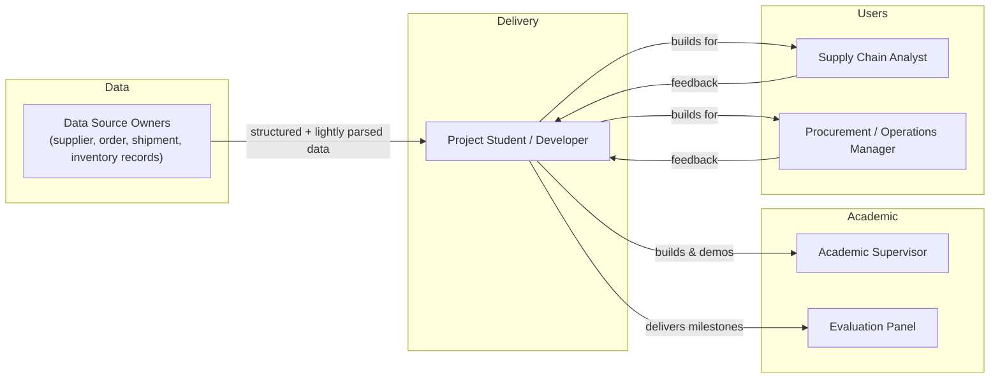
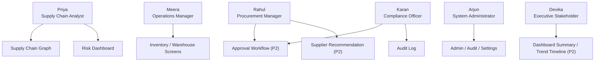

# Document 1 — Product Requirement Document (PRD)

## Graph Neural Network and Generative AI-Based Supply Chain Risk Prediction System

**Six-Layer Architecture with Retrieval-Augmented Reasoning, Autonomous Execution, an Interactive Chatbot, and Extended Decision-Support Features**

Version: 1.0
Status: Baseline
Source of Truth: `docs/problem_statement.md`

---

## 1. Purpose

This Product Requirement Document defines what the Graph Neural Network (GNN) and Generative AI-based Supply Chain Risk Prediction System must do, for whom, and to what standard, across its two delivery phases. It translates the problem statement's six-layer architecture and six extended decision-support features into functional requirements, non-functional requirements, user personas, user stories, and success metrics that all downstream documents (Technical Specification, UI/UX, Database Design, API Documentation, AI/ML Documentation, etc.) must remain consistent with.

This document is the product-level contract between the project's stakeholders (evaluators, end users, and the development team acting as sole implementer) and the system being built. No requirement in this document introduces a feature beyond what is described in `docs/problem_statement.md`; every requirement is a direct, implementation-level expansion of an existing statement in that document.

## 2. Scope

### 2.1 In Scope — Phase 1 (15 Weeks, Research Prototype / MVP)

Phase 1 delivers a fully working research prototype that proves the core hypothesis of the project: that representing a supply chain as a heterogeneous graph and scoring it with a GNN-Transformer hybrid produces more useful risk predictions than row-by-row models, with a usable dashboard around it.

| # | Capability | Problem Statement Reference |
|---|---|---|
| 1 | Authentication (login, session management, RBAC foundation) | Layer 6, Document scope list |
| 2 | PostgreSQL structured data store | Section 9 (Technologies), Layer 1 |
| 3 | Graph construction from structured records | Layer 1 |
| 4 | Heterogeneous supply chain graph (suppliers, components, products, factories, warehouses, shipments, orders) | Layer 1, Section 4 |
| 5 | GNN + Transformer risk prediction (delay probability, shortage risk, disruption impact) | Layer 2 |
| 6 | Simple explainability (explanation subgraph via GNNExplainer, basic highlighting) | Layer 2, Section 5.3 (backend output only) |
| 7 | REST APIs exposing graph, prediction, and auth operations | Layer 6, Section 9 |
| 8 | React dashboard shell | Layer 6 |
| 9 | Graph visualization (D3-based, risk-colored) | Layer 6, Section 9 |

### 2.2 Out of Scope — Phase 1 (Deferred to Phase 2)

The following are explicitly **not** built in Phase 1, per the problem statement and delivery strategy:

- Retrieval-Augmented Generation (RAG)
- LLM-powered chatbot
- Model Context Protocol (MCP) execution layer
- ERP / procurement system integration
- Alternative-supplier recommendation
- What-if scenario simulator
- Risk trend timeline
- Proactive MCP-based alerts

### 2.3 In Scope — Phase 2 (Target: March 2027)

Phase 2 **extends** Phase 1 without redesigning it. It adds Layers 3, 4, and 5 of the six-layer architecture in full, plus all six extended decision-support features described in Section 5 of the problem statement.

| # | Capability | Problem Statement Reference |
|---|---|---|
| 1 | RAG (vector database, retrieval pipeline) | Layer 3 |
| 2 | LLM plain-language explanation generation | Layer 4 |
| 3 | Interactive chatbot (retrieve-then-generate) | Section 5.1 |
| 4 | Full visual explainability overlay on graph view | Section 5.3 |
| 5 | Alternative-supplier recommendation | Section 5.4 |
| 6 | What-if scenario simulator | Section 5.2 |
| 7 | Risk trend timeline | Section 5.5 |
| 8 | MCP execution layer | Layer 5 |
| 9 | Human-in-the-loop approval workflow | Layer 5, Section 4 |
| 10 | ERP / procurement integration | Layer 5 |
| 11 | Notifications (Slack / email) | Section 5.6 |
| 12 | Proactive alerts | Section 5.6 |

### 2.4 Delivery Phase Tagging

Every functional requirement and user story in this document, and in every subsequent document in this documentation set, carries a **Delivery Phase** field with an allowed value of `Phase 1` or `Phase 2`. No requirement may omit this field.

## 3. Vision

Build a closed-loop supply chain intelligence system that does not stop at producing a risk score. The system senses disruption risk across a connected network of suppliers, products, factories, warehouses, shipments, and orders; explains that risk in language a non-technical operations user can act on; lets that user interrogate and simulate the prediction; and — once a human approves — carries out the recommended action inside the business systems that matter, closing the loop between prediction and outcome.

Phase 1 proves the sensing half of that loop (graph + GNN prediction). Phase 2 completes it (explanation, interaction, and action).

## 4. Objectives

Directly sourced from `docs/problem_statement.md`, Section 3, mapped to delivery phase:

| Objective | Delivery Phase |
|---|---|
| Represent the supply chain as a heterogeneous graph of suppliers, components, products, factories, warehouses, shipments, and orders | Phase 1 |
| Normalize the small unstructured portion of source documents (occasional invoices/POs) into structured fields feeding the graph | Phase 1 |
| Predict supplier and shipment delay probability and inventory shortage risk using a GNN-Transformer hybrid model | Phase 1 |
| Identify the products and customer orders affected by a predicted disruption | Phase 1 |
| Ground risk explanations in real historical evidence using RAG | Phase 2 |
| Generate plain-language explanations and recommended actions using an LLM | Phase 2 |
| Provide an interactive chatbot for querying risk scores, explanations, and evidence in natural language | Phase 2 |
| Let users run what-if scenarios against the trained model without retraining | Phase 2 |
| Visually surface which entities drove a given prediction directly on the graph view | Phase 2 (basic subgraph output is Phase 1; full overlay wiring is Phase 2) |
| Recommend alternative suppliers using the GNN's own embeddings | Phase 2 |
| Track and display risk trends over time | Phase 2 |
| Proactively notify relevant stakeholders when risk crosses a threshold | Phase 2 |
| Execute approved recommendations directly in ERP/procurement systems via MCP, with human-in-the-loop approval | Phase 2 |
| Provide an interactive dashboard tying all of the above together | Phase 1 (shell + graph view), extended in Phase 2 |

## 5. Business Goals

| Goal | Description | Delivery Phase |
|---|---|---|
| BG-1 | Demonstrate that graph-based, relationship-aware modeling outperforms row-by-row risk scoring for supply chain disruption prediction | Phase 1 |
| BG-2 | Produce a defensible, demoable final-year project artifact with a working end-to-end pipeline (data → graph → prediction → dashboard) | Phase 1 |
| BG-3 | Establish an architecture that can be extended to a full closed-loop decision-support system without rework | Phase 1 (enabling), Phase 2 (realized) |
| BG-4 | Prove that generative AI can ground technical predictions in evidence and plain language, reducing the expertise required to interpret risk scores | Phase 2 |
| BG-5 | Demonstrate a safe, human-gated path from prediction to real-world action (agentic execution with approval) | Phase 2 |
| BG-6 | Reduce the time between a disruption first becoming visible in the data and a stakeholder being made aware of it | Phase 2 |

## 6. Stakeholders

| Stakeholder | Role in Project | Primary Interest |
|---|---|---|
| Project Student / Developer | Sole implementer across all layers (architecture, ML, backend, frontend, DevOps, security) | Deliver a working, well-documented, evaluable system on schedule |
| Academic Supervisor / Guide | Oversees project direction, evaluates milestones | Technical soundness, novelty, adherence to scope, demonstrable results |
| Evaluation Panel / Examiners | Assesses the final deliverable at project review | Correctness, completeness of Phase 1 MVP, quality of explanation and demo |
| End User — Supply Chain Analyst (simulated/prototype user) | Primary user of the dashboard and (Phase 2) chatbot | Fast, trustworthy risk visibility and explanations |
| End User — Procurement / Operations Manager (simulated/prototype user) | Consumer of recommendations and approver of actions (Phase 2) | Actionable, low-friction recommendations with clear evidence |
| Data Source Owners (simulated via datasets) | Represent supplier, order, shipment, inventory record sources | Data integrity flowing into the graph |

## 7. User Personas

### 7.1 Priya — Supply Chain Analyst (Primary User)

- **Role:** Monitors supplier and shipment health day-to-day; first responder to disruption signals.
- **Technical proficiency:** Comfortable with dashboards and spreadsheets; not a data scientist.
- **Goals:** Spot at-risk suppliers/orders early; understand *why* something is flagged without asking a data science team; get a clear next action.
- **Pain points today:** Existing tools show siloed metrics per supplier/order with no view of cascading impact; investigating a flag means manually cross-referencing multiple systems.
- **Relevant features:** Risk Dashboard, Supply Chain Graph, Explainability Overlay (Phase 2), Chatbot (Phase 2), Risk Trend Timeline (Phase 2).

### 7.2 Rahul — Procurement Manager

- **Role:** Owns supplier relationships and purchase decisions; acts on recommendations.
- **Technical proficiency:** Business user; needs recommendations in business terms (cost, lead time, risk), not model internals.
- **Goals:** Get a ranked, justified alternative when a supplier is flagged; approve or reject agent-proposed actions with confidence.
- **Pain points today:** Switching suppliers is a manual, evidence-gathering-heavy process; no systematic way to compare alternatives against the failing supplier.
- **Relevant features:** Alternative-Supplier Recommendation (Phase 2), Approval Workflow (Phase 2), Orders/Suppliers screens.

### 7.3 Meera — Operations / Warehouse Manager

- **Role:** Manages inventory levels and warehouse operations; reacts to shortage risk.
- **Technical proficiency:** Business/operational user.
- **Goals:** Early warning on shortage risk tied to specific warehouses/products; clarity on which orders are impacted.
- **Pain points today:** Shortage is discovered only when it happens, not predicted in advance.
- **Relevant features:** Inventory, Warehouse, Shipments screens, Risk Dashboard, Proactive Alerts (Phase 2).

### 7.4 Arjun — System Administrator

- **Role:** Manages users, roles, and system configuration; owns audit and compliance visibility.
- **Technical proficiency:** Technical, but not necessarily an ML specialist.
- **Goals:** Control access, review audit logs, configure alert thresholds, oversee integration health.
- **Pain points today:** N/A (new system) — driven by need for governance over an increasingly autonomous system.
- **Relevant features:** Admin, Audit, Settings screens, RBAC, Security & Approval Workflow (Phase 2).

### 7.5 Devika — Executive / Business Stakeholder

- **Role:** Consumes summarized risk posture for decision-making; not a daily hands-on user.
- **Technical proficiency:** Low-to-moderate; wants summaries, not raw data.
- **Goals:** Understand overall supply chain risk exposure at a glance; trust that flagged issues are being handled.
- **Pain points today:** Risk visibility is reactive and fragmented across teams.
- **Relevant features:** Dashboard summary views, Risk Trend Timeline (Phase 2).

### 7.6 Karan — Compliance / Approval Officer

- **Role:** Reviews and authorizes agent-proposed actions before they execute in ERP/procurement systems.
- **Technical proficiency:** Business/process-oriented, security-conscious.
- **Goals:** Ensure no action is taken without a clear evidentiary trail and human sign-off; maintain an auditable record.
- **Pain points today:** N/A (new system) — driven by the risk of ungoverned automation.
- **Relevant features:** Approval Workflow (Phase 2), Audit screen, Security Documentation controls.

## 8. Functional Requirements

Each requirement has a unique ID, description, and mandatory **Delivery Phase** field.

### 8.1 Authentication & Authorization

| ID | Requirement | Delivery Phase |
|---|---|---|
| FR-AUTH-01 | The system shall allow a user to log in using email and password credentials. | Phase 1 |
| FR-AUTH-02 | The system shall issue a signed JWT access token and refresh token upon successful login. | Phase 1 |
| FR-AUTH-03 | The system shall enforce role-based access control (RBAC) with at minimum Admin, Analyst, and Approver roles. | Phase 1 (roles defined), Phase 2 (Approver role enforced on approval endpoints) |
| FR-AUTH-04 | The system shall allow an authenticated user to log out and invalidate their session. | Phase 1 |
| FR-AUTH-05 | The system shall lock an account after a configurable number of failed login attempts. | Phase 1 |
| FR-AUTH-06 | The system shall allow an Admin to create, update, and deactivate user accounts. | Phase 1 |
| FR-AUTH-07 | The system shall record every authentication event (login, logout, failed attempt) in an audit log. | Phase 1 |

### 8.2 Graph Construction (Layer 1)

| ID | Requirement | Delivery Phase |
|---|---|---|
| FR-GC-01 | The system shall ingest structured supplier, shipment, order, and inventory records from PostgreSQL into a graph construction pipeline. | Phase 1 |
| FR-GC-02 | The system shall define node types for Supplier, Component, Product, Factory, Warehouse, Shipment, and Order. | Phase 1 |
| FR-GC-03 | The system shall define edge types including SUPPLIES, USED_IN, SHIPS_TO, and other relationships needed to connect the node types above. | Phase 1 |
| FR-GC-04 | The system shall clean and normalize ingested records (deduplication, type coercion, missing-value handling) before graph assembly. | Phase 1 |
| FR-GC-05 | The system shall provide a lightweight document-parsing step that extracts structured fields from occasional invoice/purchase-order PDFs via a single extraction call (not a standing agent). | Phase 1 |
| FR-GC-06 | The system shall assemble cleaned records and parsed document fields into a heterogeneous graph (PyTorch Geometric `HeteroData` or equivalent). | Phase 1 |
| FR-GC-07 | The system shall support incremental graph updates as new records arrive, without requiring a full rebuild. | Phase 1 |
| FR-GC-08 | The system shall persist the assembled graph in a form queryable for both training and inference. | Phase 1 |

### 8.3 GNN × Transformer Risk Prediction (Layer 2)

| ID | Requirement | Delivery Phase |
|---|---|---|
| FR-GNN-01 | The system shall train a GNN-Transformer hybrid model on the heterogeneous supply chain graph to predict supplier/shipment delay probability. | Phase 1 |
| FR-GNN-02 | The system shall predict inventory shortage risk per product/warehouse combination. | Phase 1 |
| FR-GNN-03 | The system shall compute an overall disruption impact score combining delay and shortage signals. | Phase 1 |
| FR-GNN-04 | The system shall identify which products and customer orders are affected by a given predicted disruption. | Phase 1 |
| FR-GNN-05 | The system shall produce an explanation subgraph (via GNNExplainer or equivalent) identifying the entities driving a given prediction. | Phase 1 |
| FR-GNN-06 | The system shall learn and expose entity embeddings usable for downstream similarity search. | Phase 1 (learned/stored), Phase 2 (consumed by recommender) |
| FR-GNN-07 | The system shall expose a scoring/inference endpoint callable by the backend without requiring retraining. | Phase 1 |
| FR-GNN-08 | The system shall re-score a temporarily edited copy of the graph on demand without mutating the persisted graph. | Phase 2 (What-If Simulator) |

### 8.4 RAG — Evidence Retrieval (Layer 3)

| ID | Requirement | Delivery Phase |
|---|---|---|
| FR-RAG-01 | The system shall embed and index historical incident reports, contract clauses, and supplier history documents in a vector database. | Phase 2 |
| FR-RAG-02 | The system shall retrieve the top-k most relevant evidence documents for a given risk prediction or user query. | Phase 2 |
| FR-RAG-03 | The system shall support hybrid (keyword + vector) search with metadata filtering (e.g., by supplier, date range). | Phase 2 |
| FR-RAG-04 | The system shall re-index new evidence documents as they are added without downtime. | Phase 2 |

### 8.5 LLM Explanation (Layer 4)

| ID | Requirement | Delivery Phase |
|---|---|---|
| FR-LLM-01 | The system shall combine the risk score, explanation subgraph, and retrieved evidence into a plain-language explanation. | Phase 2 |
| FR-LLM-02 | The system shall generate a recommended action alongside every explanation. | Phase 2 |
| FR-LLM-03 | The system shall validate LLM-proposed actions against business rules before surfacing them for approval. | Phase 2 |
| FR-LLM-04 | The system shall cite the retrieved evidence supporting each explanation, so claims are traceable to source records. | Phase 2 |

### 8.6 Interactive Chatbot

| ID | Requirement | Delivery Phase |
|---|---|---|
| FR-CHAT-01 | The system shall accept natural-language questions from a user about a supplier, order, or shipment's risk status. | Phase 2 |
| FR-CHAT-02 | The system shall classify the intent of a chatbot query (score lookup, explanation, general query, action request). | Phase 2 |
| FR-CHAT-03 | The system shall compose a plain-language answer using a retrieve-then-generate pipeline (record + evidence + explanation → prompt template → LLM). | Phase 2 |
| FR-CHAT-04 | The system shall allow a user to approve a recommended action directly from the chat interface, routing it into the Layer 5 execution pipeline with its approval gate. | Phase 2 |
| FR-CHAT-05 | The system shall persist chat history per user session for continuity and audit. | Phase 2 |

### 8.7 What-If Scenario Simulator

| ID | Requirement | Delivery Phase |
|---|---|---|
| FR-SIM-01 | The system shall let a user select a graph entity and perturb one or more of its features (e.g., lead time). | Phase 2 |
| FR-SIM-02 | The system shall re-run inference on the trained GNN against the perturbed graph copy without retraining. | Phase 2 |
| FR-SIM-03 | The system shall display which downstream products/orders shift into higher or lower risk as a result of the simulated change. | Phase 2 |
| FR-SIM-04 | The system shall discard simulation edits after the session ends, leaving the persisted graph unchanged. | Phase 2 |

### 8.8 Visual Explainability Overlay

| ID | Requirement | Delivery Phase |
|---|---|---|
| FR-EXP-01 | The system shall highlight the nodes/edges in the graph view that belong to a prediction's explanation subgraph. | Phase 1 (basic highlight), Phase 2 (full overlay: color-by-risk-level, synchronized with chatbot answers) |
| FR-EXP-02 | The system shall color explanation-subgraph nodes/edges according to the risk level of the associated prediction. | Phase 2 |
| FR-EXP-03 | The system shall synchronize the explainability overlay with chatbot answers, so asking "why" highlights the relevant subgraph simultaneously with the text answer. | Phase 2 |

### 8.9 Alternative-Supplier Recommendation

| ID | Requirement | Delivery Phase |
|---|---|---|
| FR-REC-01 | The system shall rank plausible replacement suppliers for a flagged supplier using similarity over GNN entity embeddings. | Phase 2 |
| FR-REC-02 | The system shall filter recommended suppliers by matching component type. | Phase 2 |
| FR-REC-03 | The system shall surface a similarity score and lower-risk justification alongside each recommended supplier. | Phase 2 |
| FR-REC-04 | The system shall integrate recommended suppliers into the approval workflow (e.g., "approve: raise PO with Supplier Y"). | Phase 2 |

### 8.10 Risk Trend Timeline

| ID | Requirement | Delivery Phase |
|---|---|---|
| FR-TREND-01 | The system shall log the risk score for each entity at every model run. | Phase 2 |
| FR-TREND-02 | The system shall display a time-series chart of a supplier or product's risk score over a selected historical period. | Phase 2 |
| FR-TREND-03 | The system shall allow a user to compare risk trends across multiple entities on the same chart. | Phase 2 |

### 8.11 MCP Execution & Proactive Alerts (Layer 5)

| ID | Requirement | Delivery Phase |
|---|---|---|
| FR-MCP-01 | The system shall execute a human-approved recommended action against a connected ERP/procurement system via an MCP server. | Phase 2 |
| FR-MCP-02 | The system shall log the result of every executed action, including success/failure status. | Phase 2 |
| FR-MCP-03 | The system shall require explicit human approval before any action is executed; no action shall execute automatically. | Phase 2 |
| FR-MCP-04 | The system shall allow an Approver to reject a proposed action with a recorded reason. | Phase 2 |
| FR-MCP-05 | The system shall send a proactive notification (Slack or email, routed through MCP) when a risk score crosses a configurable threshold. | Phase 2 |
| FR-MCP-06 | The system shall allow an Admin to configure alert thresholds per entity type. | Phase 2 |

### 8.12 Frontend Dashboard (Layer 6)

| ID | Requirement | Delivery Phase |
|---|---|---|
| FR-DASH-01 | The system shall display an interactive graph view of the supply chain colored by risk level. | Phase 1 |
| FR-DASH-02 | The system shall display a table of at-risk suppliers and orders with sortable/filterable columns. | Phase 1 |
| FR-DASH-03 | The system shall provide dedicated screens for Suppliers, Warehouses, Orders, Shipments, Products, and Inventory. | Phase 1 |
| FR-DASH-04 | The system shall provide a chatbot panel accessible from the dashboard. | Phase 2 |
| FR-DASH-05 | The system shall provide what-if simulation controls accessible from the graph view. | Phase 2 |
| FR-DASH-06 | The system shall provide approve/reject controls for pending agent actions. | Phase 2 |
| FR-DASH-07 | The system shall provide an Admin screen for user, role, and threshold management. | Phase 1 (user/role management), Phase 2 (threshold management) |
| FR-DASH-08 | The system shall provide an Audit screen listing authentication events, approvals, and executed actions. | Phase 1 (authentication events), Phase 2 (approvals and executed actions) |

## 9. Non-Functional Requirements

| ID | Category | Requirement | Delivery Phase |
|---|---|---|---|
| NFR-01 | Performance | Risk prediction inference for a single entity shall return within 2 seconds (p95) under prototype-scale data volumes. | Phase 1 |
| NFR-02 | Performance | Dashboard graph view shall render supply chain graphs of up to 5,000 nodes without perceptible lag (<500ms interaction response). | Phase 1 |
| NFR-03 | Performance | Chatbot response latency shall not exceed 5 seconds (p95) for a retrieve-then-generate query. | Phase 2 |
| NFR-04 | Scalability | The graph construction pipeline shall support incremental updates without a full graph rebuild. | Phase 1 |
| NFR-05 | Scalability | The vector database shall support re-indexing new evidence without downtime. | Phase 2 |
| NFR-06 | Availability | The prototype shall target 95% uptime during evaluation/demo windows. | Phase 1 |
| NFR-07 | Security | All API endpoints except login shall require a valid JWT. | Phase 1 |
| NFR-08 | Security | Passwords shall be stored using a salted, industry-standard hash (e.g., bcrypt/argon2), never in plaintext. | Phase 1 |
| NFR-09 | Security | All action-executing MCP calls shall require a prior human approval record. | Phase 2 |
| NFR-10 | Security | Secrets (API keys, DB credentials) shall not be committed to source control and shall be sourced from environment configuration. | Phase 1 |
| NFR-11 | Usability | Every dashboard screen shall define explicit loading, error, and empty states. | Phase 1 |
| NFR-12 | Usability | The system shall be usable by a non-technical operations user without ML/graph expertise, per persona definitions in Section 7. | Phase 1 (dashboard), Phase 2 (chatbot) |
| NFR-13 | Reliability | LLM-generated explanations shall be grounded by RAG evidence to reduce hallucination risk. | Phase 2 |
| NFR-14 | Maintainability | Backend services shall be organized into clearly separated modules (services, repositories, controllers) to support independent evolution of Phase 2 features. | Phase 1 |
| NFR-15 | Auditability | Every authentication event, approval decision, and executed action shall be recorded with timestamp and actor identity. | Phase 1 (auth events), Phase 2 (approvals/actions) |
| NFR-16 | Portability | The system shall be deployable via containerized services (Docker) to support consistent environments across development and demo. | Phase 1 |
| NFR-17 | Data Quality | Prediction accuracy is dependent on completeness of source records; the system shall surface data-quality warnings rather than silently degrading. | Phase 1 |
| NFR-18 | Alert Quality | Proactive alert thresholds shall be tunable to avoid alert fatigue from false positives. | Phase 2 |

## 10. User Stories

Format: `US-<area>-<seq>` — *As a [persona], I want [capability], so that [benefit].* Each story includes acceptance criteria and Delivery Phase.

### 10.1 Authentication & Access (Persona: Arjun, all users)

| ID | Story | Acceptance Criteria | Delivery Phase |
|---|---|---|---|
| US-AUTH-01 | As any user, I want to log in with email and password, so that I can access the dashboard securely. | Valid credentials issue a JWT; invalid credentials return a clear error without revealing which field was wrong. | Phase 1 |
| US-AUTH-02 | As any user, I want my session to expire after inactivity, so that an unattended device doesn't stay logged in. | Access token expires per configured TTL; refresh flow re-authenticates or forces re-login. | Phase 1 |
| US-AUTH-03 | As Arjun (Admin), I want to create new user accounts with an assigned role, so that I can onboard analysts and approvers. | Admin-only endpoint; new user receives correct role; action is audit-logged. | Phase 1 |
| US-AUTH-04 | As Arjun (Admin), I want to deactivate a user account, so that former employees lose access immediately. | Deactivated user's existing tokens are rejected on next request. | Phase 1 |
| US-AUTH-05 | As any user, I want my account locked after repeated failed logins, so that brute-force attempts are mitigated. | Account locks after configurable threshold; unlock requires admin action or timeout. | Phase 1 |
| US-AUTH-06 | As Karan (Compliance Officer), I want every login attempt logged, so that I can audit access history. | Audit log entry created for every login attempt, success or failure. | Phase 1 |

### 10.2 Graph Construction & Data (Persona: Priya, Meera)

| ID | Story | Acceptance Criteria | Delivery Phase |
|---|---|---|---|
| US-GC-01 | As Priya, I want the system to automatically build a graph from supplier, order, shipment, and inventory records, so that I don't have to manually cross-reference systems. | Graph construction pipeline runs on ingested records and produces a queryable heterogeneous graph. | Phase 1 |
| US-GC-02 | As Priya, I want occasional PDF invoices/POs to be automatically parsed into structured fields, so that isolated unstructured documents don't create blind spots in the graph. | PDF upload triggers a single extraction call; extracted fields populate the correct structured record. | Phase 1 |
| US-GC-03 | As Meera, I want the graph to update incrementally as new shipment/order data arrives, so that risk predictions reflect near-current state. | New records trigger incremental graph update without full rebuild. | Phase 1 |
| US-GC-04 | As Arjun, I want data-quality issues in ingested records surfaced, so that I know when predictions may be unreliable. | Missing/malformed fields generate a visible warning rather than silently corrupting the graph. | Phase 1 |

### 10.3 Risk Prediction (Persona: Priya, Meera)

| ID | Story | Acceptance Criteria | Delivery Phase |
|---|---|---|---|
| US-PRED-01 | As Priya, I want to see a delay probability for each supplier, so that I can prioritize which relationships to monitor. | Dashboard shows per-supplier delay probability sourced from the GNN inference endpoint. | Phase 1 |
| US-PRED-02 | As Meera, I want to see shortage risk per product/warehouse, so that I can plan stock proactively. | Dashboard shows shortage risk score per product-warehouse pair. | Phase 1 |
| US-PRED-03 | As Priya, I want to see which orders are affected by a predicted disruption, so that I know the downstream blast radius. | Selecting a flagged entity lists affected products and orders. | Phase 1 |
| US-PRED-04 | As Priya, I want an overall disruption impact score, so that I can triage across many flagged entities quickly. | Each flagged entity displays a single combined impact score alongside its component scores. | Phase 1 |
| US-PRED-05 | As Arjun, I want the model's inference endpoint decoupled from training, so that predictions stay fast without needing to retrain on every request. | Inference endpoint returns scores using the currently trained model artifact, independent of training jobs. | Phase 1 |

### 10.4 Explainability (Persona: Priya)

| ID | Story | Acceptance Criteria | Delivery Phase |
|---|---|---|---|
| US-EXP-01 | As Priya, I want to see which entities drove a given risk prediction, so that I don't have to trust a black-box score. | Selecting a prediction shows its explanation subgraph (entities/edges). | Phase 1 |
| US-EXP-02 | As Priya, I want the explanation subgraph highlighted directly on the graph view, colored by risk level, so that I can see the "why" visually, not just as a list. | Graph view highlights explanation-subgraph nodes/edges in the color matching the prediction's risk level. | Phase 2 |
| US-EXP-03 | As Priya, I want the explainability overlay to sync with chatbot answers, so that asking "why is this risky" shows text and graph highlighting together. | Chatbot explanation response triggers matching graph highlight in the same view. | Phase 2 |

### 10.5 Chatbot (Persona: Priya, Rahul)

| ID | Story | Acceptance Criteria | Delivery Phase |
|---|---|---|---|
| US-CHAT-01 | As Priya, I want to ask "why is Supplier X flagged as high risk?" in plain language, so that I get an answer without navigating multiple screens. | Chatbot returns a plain-language answer citing the driving factors and supporting evidence. | Phase 2 |
| US-CHAT-02 | As Priya, I want the chatbot to distinguish between a score lookup, an explanation request, and a general question, so that I get a relevant answer type. | Intent classification routes to the correct retrieval/response path. | Phase 2 |
| US-CHAT-03 | As Rahul, I want to ask the chatbot "what should we do" about a flagged supplier, so that I get a recommended action without leaving the chat. | Chatbot surfaces the recommended action tied to the flagged entity. | Phase 2 |
| US-CHAT-04 | As Rahul, I want to approve a recommended action directly in the chat, so that I don't have to switch to a separate approval screen. | Approving in chat creates an approval record and routes into the Layer 5 execution pipeline. | Phase 2 |
| US-CHAT-05 | As Priya, I want my chat history retained within a session, so that I can ask follow-up questions with context. | Chat session preserves prior turns for context within the session. | Phase 2 |

### 10.6 What-If Simulator (Persona: Priya, Devika)

| ID | Story | Acceptance Criteria | Delivery Phase |
|---|---|---|---|
| US-SIM-01 | As Priya, I want to simulate "what if Supplier X's lead time doubles," so that I can see downstream impact before it happens. | User can edit a numeric feature on a selected entity and trigger re-scoring. | Phase 2 |
| US-SIM-02 | As Priya, I want to see which products/orders shift into higher risk after a simulated change, so that I can assess exposure. | Simulation results display entities whose risk classification changed, with before/after scores. | Phase 2 |
| US-SIM-03 | As Devika, I want simulated changes to never affect the real persisted graph, so that exploratory "what if" analysis carries no operational risk. | Simulation operates on a temporary copy; persisted graph is verified unchanged after the session. | Phase 2 |

### 10.7 Alternative-Supplier Recommendation (Persona: Rahul)

| ID | Story | Acceptance Criteria | Delivery Phase |
|---|---|---|---|
| US-REC-01 | As Rahul, I want to see ranked alternative suppliers when one is flagged, so that I have a concrete next step instead of only an alert. | Flagged supplier view shows a ranked list of alternatives with similarity scores. | Phase 2 |
| US-REC-02 | As Rahul, I want recommended alternatives filtered to the same component type, so that suggestions are actually usable. | Recommendation list excludes suppliers not matching the required component type. | Phase 2 |
| US-REC-03 | As Rahul, I want to approve "raise PO with Supplier Y" directly from a recommendation, so that acting on a good alternative is one step. | Approving a recommendation creates an action request pre-filled with the recommended supplier. | Phase 2 |

### 10.8 Risk Trend Timeline (Persona: Devika, Priya)

| ID | Story | Acceptance Criteria | Delivery Phase |
|---|---|---|---|
| US-TREND-01 | As Devika, I want to see how a supplier's risk score has moved over the past weeks, so that I can distinguish a slow-building problem from a one-off blip. | Timeline chart shows historical risk scores for a selected entity over a chosen date range. | Phase 2 |
| US-TREND-02 | As Priya, I want to compare risk trends of two suppliers on the same chart, so that I can prioritize which one needs attention first. | Timeline view supports selecting multiple entities for overlay comparison. | Phase 2 |

### 10.9 MCP Execution, Approval & Alerts (Persona: Karan, Rahul, Arjun)

| ID | Story | Acceptance Criteria | Delivery Phase |
|---|---|---|---|
| US-MCP-01 | As Karan, I want to review a recommended action with its supporting evidence before approving it, so that I only authorize well-justified actions. | Approval screen shows the action, its evidence, and the requesting context before allowing approve/reject. | Phase 2 |
| US-MCP-02 | As Karan, I want to reject a proposed action with a reason, so that there is a record of why it was declined. | Rejection requires a reason field and is stored in the audit log. | Phase 2 |
| US-MCP-03 | As Rahul, I want an approved action to actually execute in the connected ERP/procurement system, so that approval isn't just a formality. | Approved action triggers MCP execution and result is logged. | Phase 2 |
| US-MCP-04 | As Arjun, I want every executed action logged with success/failure status, so that I can troubleshoot integration issues. | Action log entry includes timestamp, actor, action type, target system, and outcome. | Phase 2 |
| US-MCP-05 | As Meera, I want to be proactively notified when a risk score crosses a threshold, so that I don't have to keep checking the dashboard manually. | Threshold breach triggers a Slack/email notification routed through MCP. | Phase 2 |
| US-MCP-06 | As Arjun, I want to configure alert thresholds per entity type, so that alert sensitivity matches business needs. | Admin settings screen allows threshold configuration per entity type, persisted and applied on next evaluation. | Phase 2 |

### 10.10 Dashboard & Navigation (Persona: All)

| ID | Story | Acceptance Criteria | Delivery Phase |
|---|---|---|---|
| US-DASH-01 | As Priya, I want a graph view of the whole supply chain colored by risk, so that I can spot problem areas at a glance. | Graph view renders all node types with color encoding tied to risk level. | Phase 1 |
| US-DASH-02 | As Priya, I want a sortable/filterable table of at-risk suppliers and orders, so that I can work through a prioritized list. | Table supports sorting and filtering by risk score, entity type, and status. | Phase 1 |
| US-DASH-03 | As Meera, I want dedicated screens for Suppliers, Warehouses, Orders, Shipments, Products, and Inventory, so that I can drill into operational detail. | Each entity type has a working list/detail screen. | Phase 1 |
| US-DASH-04 | As Devika, I want a summarized risk view suitable for a quick executive check, so that I don't need to parse operational detail. | Dashboard home shows aggregate risk counts/severity breakdown. | Phase 1 |
| US-DASH-05 | As Karan, I want an audit screen listing key system events, so that I can review activity without database access. | Audit screen lists authentication events (Phase 1), plus approvals and executed actions (Phase 2). | Phase 1 (partial), Phase 2 (complete) |
| US-DASH-06 | As any user, I want clear loading, error, and empty states on every screen, so that I always understand what the system is doing. | Every screen defines and displays all three states per Document 3 (UI/UX). | Phase 1 |
| US-DASH-07 | As any user, I want the dashboard to work on a standard laptop screen and scale reasonably to smaller windows, so that it's usable in a demo or office setting. | Layout responds without breaking down to at least tablet-width viewports. | Phase 1 |

**Total user stories: 55**, spanning all in-scope Phase 1 and Phase 2 capabilities.

## 11. Success Metrics

| Metric | Target | Delivery Phase |
|---|---|---|
| Model discrimination (AUC-ROC) for delay/shortage prediction | ≥ 0.80 on held-out test set | Phase 1 |
| Inference latency (p95, single-entity scoring) | ≤ 2 seconds | Phase 1 |
| Dashboard graph render time (≤5,000 nodes) | ≤ 500 ms interaction response | Phase 1 |
| Working end-to-end demo (login → graph → prediction → dashboard) | 100% of Phase 1 functional requirements demonstrable | Phase 1 |
| Explanation subgraph availability | Available for 100% of high-risk predictions | Phase 1 |
| Chatbot answer relevance (manual eval on sample questions) | ≥ 90% judged relevant/correct by evaluator | Phase 2 |
| RAG evidence grounding | ≥ 90% of LLM explanations cite at least one retrieved evidence source | Phase 2 |
| Approval-gate integrity | 0 actions executed without a recorded human approval | Phase 2 |
| Alert precision (post threshold tuning) | ≤ 10% false-positive rate on proactive alerts in test scenarios | Phase 2 |
| Recommendation usefulness (manual eval) | ≥ 80% of alternative-supplier recommendations judged plausible by evaluator | Phase 2 |

## 12. Assumptions

- The volume and structure of source datasets (supplier, order, shipment, inventory) used for Phase 1 will be sufficient in scale and quality to train a GNN with meaningful discriminative power, per problem statement Section 8 (Limitations).
- Unstructured documents (invoices, POs) will remain a small share of total data throughout Phase 1, consistent with the problem statement's framing; the lightweight parsing step is not designed to scale to bulk unstructured ingestion.
- A single developer will implement all layers; scope and timeline are set accordingly (15 weeks for Phase 1).
- ERP/procurement system integration in Phase 2 will be against either a sandbox/test instance or a mocked interface satisfying the same contract, since production ERP access is not guaranteed for an academic project.
- LLM and embedding model access (API-based) will be available and budgeted for during Phase 2 development and evaluation.
- Evaluation and demo environments are single-tenant; multi-tenant SaaS concerns are out of scope for both phases.
- "Prototype-scale" data volumes (referenced in NFR-01, NFR-02) means dataset and graph sizes appropriate for an academic MVP, not enterprise production scale.

## 13. Dependencies

| Dependency | Needed For | Delivery Phase |
|---|---|---|
| PostgreSQL instance | Structured data storage, auth, audit | Phase 1 |
| PyTorch / PyTorch Geometric | GNN-Transformer model | Phase 1 |
| GNNExplainer (or equivalent) | Explanation subgraph generation | Phase 1 |
| React frontend toolchain | Dashboard | Phase 1 |
| D3.js | Graph visualization | Phase 1 |
| FastAPI (or equivalent Python service framework) | REST APIs, ML serving | Phase 1 |
| Vector database (pgvector / Weaviate) | RAG evidence store | Phase 2 |
| LLM API access | Explanation generation, chatbot | Phase 2 |
| LangGraph (or equivalent orchestration) | RAG retriever, MCP agent loop | Phase 2 |
| MCP server implementations | Action execution, alerts | Phase 2 |
| ERP/procurement sandbox or mock | Action execution target | Phase 2 |
| Slack/email API access | Proactive notifications | Phase 2 |

## 14. Risks

| ID | Risk | Likelihood | Impact | Mitigation | Delivery Phase |
|---|---|---|---|---|---|
| R-01 | Insufficient historical data volume/quality limits GNN accuracy | Medium | High | Use synthetic/augmented data where real data is thin; set realistic success-metric targets (Section 11) | Phase 1 |
| R-02 | 15-week timeline is tight for a solo developer covering ML + backend + frontend | High | Medium | Strict Phase 1/Phase 2 scope discipline (Section 2.2); no Phase 2 feature work until Phase 1 MVP is stable | Phase 1 |
| R-03 | LLM hallucination undermines trust in explanations | Medium | High | Mandatory RAG grounding (FR-LLM-01/04); evidence citation required | Phase 2 |
| R-04 | Ungoverned agentic execution causes unintended ERP/procurement changes | Low | Critical | Hard approval gate (FR-MCP-03); no auto-execution path exists in the design | Phase 2 |
| R-05 | Real ERP/procurement integration unavailable for an academic project | Medium | Medium | Design MCP execution against a documented sandbox/mock contract (Section 12 assumption) | Phase 2 |
| R-06 | Alert threshold misconfiguration causes alert fatigue | Medium | Medium | Configurable, admin-tunable thresholds (FR-MCP-06); tuning during test scenarios before demo | Phase 2 |
| R-07 | Graph size growth degrades dashboard render performance | Low | Medium | Performance target capped at prototype scale (NFR-02); revisit if scale grows in Phase 2 | Phase 1 |
| R-08 | Scope creep — Phase 2 features pulled forward before Phase 1 is complete | Medium | High | Explicit Delivery Phase tagging enforced on every requirement (Section 2.4) | Both |

## 15. Future Scope (Beyond Phase 2)

The following are not committed for either phase but are natural extensions consistent with the architecture, noted here only to establish that the Phase 1/Phase 2 design does not preclude them:

- Multi-tenant deployment for use across multiple organizations.
- Real-time streaming ingestion (vs. batch/incremental updates) for shipment tracking data.
- Expanded document ingestion pipeline if unstructured document volume grows materially beyond the "small portion" assumption (per problem statement Section 8).
- Model retraining automation / MLOps pipeline for continuous model refresh.
- Mobile-optimized dashboard client.

---

## Document Control

- **Purpose:** See Section 1.
- **Scope:** See Section 2.
- **Assumptions:** See Section 12.
- **Dependencies:** See Section 13.
- **Risks:** See Section 14.
- **Future Extension:** See Section 15.

This document is the baseline for Document 2 (Technical Requirement Specification) and all subsequent documents. Any change to scope, personas, or requirements must be reflected here first, then propagated downstream to maintain consistency.
