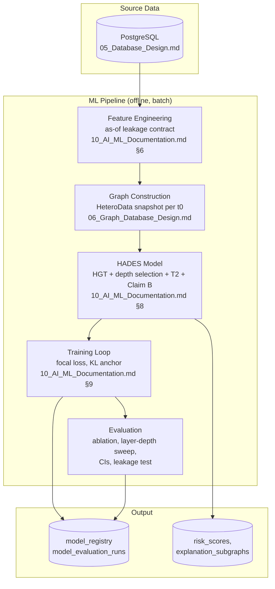

# Document 2 — Technical Requirement Specification

## HADES Model-Development Prototype

Version: 2.0 — rescoped to the ML pipeline only (services, gateway, frontend, deployment stack removed)
Status: Baseline
Consistent with: `01_Product_Requirement_Document.md`

---

## 1. Purpose

This document defines the technical shape of the ML pipeline: its stages, the technology stack, the compute/environment assumptions, and the pipeline-level risks. There is no service architecture, no API gateway, no deployment topology, and no security posture to specify, because there is no served application — see Section 2.

## 2. Scope

- **In scope:** the pipeline from source data to a trained, evaluated model — data/leakage contract, graph construction, the HADES architecture, training, evaluation.
- **Out of scope:** everything a served, multi-user product would need — API gateway, authentication, containerized service deployment, monitoring/alerting infrastructure, external system integration (ERP, Slack, LLM API, vector DB). `03_UI_UX_Documentation.md`, `07_Vector_Database_Design.md`, `08_Backend_Design.md`, `09_REST_API_Documentation.md`, and `12_Security_Documentation.md` are each a short out-of-scope notice, not specifications — do not read them as a promise this content is coming later in this project.

## 3. Pipeline Architecture

### 3.1 Style

A linear, offline batch pipeline, not a service architecture: source data → leakage-safe feature/label extraction → graph construction → model training → evaluation. Each stage is a Python module invoked by a script or notebook, not a network service. There is no gateway, no request/response cycle, and no runtime coupling between stages beyond one writing what the next reads.

### 3.2 Pipeline Diagram

### 3.3 Component-to-Document Mapping

| Pipeline Stage | Specified in |
|---|---|
| Source schema, leakage-safe history tables | `05_Database_Design.md` |
| Graph construction, meta-relations, tensor encoding | `06_Graph_Database_Design.md` |
| Feature engineering, leakage contract | `10_AI_ML_Documentation.md` §6 |
| HADES architecture | `10_AI_ML_Documentation.md` §8, `project_HADES.md` |
| Training/evaluation protocol | `10_AI_ML_Documentation.md` §9 |
| Build order | `14_Model_Development_Roadmap.md` |

## 4. Technology Stack

| Layer | Technology |
|---|---|
| Relational database | PostgreSQL 15+ |
| Graph representation | PyTorch Geometric `HeteroData`; Neo4j strictly optional, developer-inspection only |
| Data processing | Pandas, NumPy |
| ML framework | PyTorch, PyTorch Geometric |
| GNN architectures | GraphSAGE / GAT baseline, `HGTConv` (Heterogeneous Graph Transformer) |
| Explainability | GNNExplainer |
| Evaluation metrics | Scikit-learn (precision/recall/F1/ROC-AUC), bootstrap/DeLong confidence intervals |
| Synthetic dataset generation | Pure Python (`db/generate_dataset.py`), seeded/deterministic |
| Version control | Git |

**Deliberately absent from this stack**, all present in the earlier product-scoped version of this document: React/D3 (no frontend), FastAPI (no API), Docker/Docker Compose (no service deployment), pgvector/Weaviate (no RAG), an LLM API (no explanation generation), LangGraph (no agent orchestration), MCP servers (no execution layer), Google OR-Tools (no optimization engine), Slack/email APIs (no alerting), JWT/RBAC (no auth).

## 5. Compute and Environment

| Aspect | Detail |
|---|---|
| Training environment | A single machine — a consumer GPU if available, CPU is workable given the model's size (Section 6) |
| Model size | `d=64`, `L=4`: ~773K parameters, ~1.4 GFLOP full-graph forward pass at the full architecture (`project_HADES.md` Part 7) — small by modern standards; the constraint is label volume, not compute |
| Graph scale | **Measured** (`reports/step5_result_v3.md`, Step 2): 22,155–66,973 nodes and 122,594–388,242 directed edges (20 meta-relations, with reverse relations), growing snapshot to snapshot across the 15-month simulated timeline; 800 suppliers. Superseded the original ~5,000/~40,000/~600 planning figures — real scale turned out an order of magnitude larger |
| Reproducibility | Seeded RNG throughout (dataset generation, train/val/test assignment where applicable, model initialization); every run's dataset snapshot, git commit, and hyperparameters recorded in `model_registry` |
| No distributed training | Not required at this scale; not planned |

## 6. Dependencies

PostgreSQL, PyTorch, PyTorch Geometric, GNNExplainer, Pandas, Scikit-learn. That is the complete external dependency list for this project as currently scoped.

## 7. Risks

| ID | Risk | Mitigation |
|---|---|---|
| TR-01 | Label volume is too small to make architecture/component comparisons statistically meaningful | Confidence intervals reported on every comparison (`10_AI_ML_Documentation.md` §9.3); a "not distinguishable" result is reported honestly |
| TR-02 | Graph/model scale estimates (Section 5) drift once the real dataset and graph exist | `project_HADES.md` Appendix flags all current figures as analytical estimates pending a real graph; recompute rather than assume |
| TR-03 | Reintroducing service/product infrastructure mid-project without a deliberate scope decision | `01_Product_Requirement_Document.md` §2.2 names the out-of-scope list explicitly |

## 8. Future Extension

If the product-scoped build is resumed, the service architecture, deployment topology, and technology stack additions (frontend, API gateway, vector DB, LLM API, MCP, OR-Tools) previously specified in this document are recoverable from git history and from `architecture.md`. This document does not attempt to keep them current in the meantime.

---

## Document Control

- **Purpose:** Section 1. **Scope:** Section 2. **Pipeline Architecture:** Section 3. **Risks:** Section 7. **Future Extension:** Section 8.
- Baseline for `05_Database_Design.md`, `06_Graph_Database_Design.md`, `10_AI_ML_Documentation.md`.
