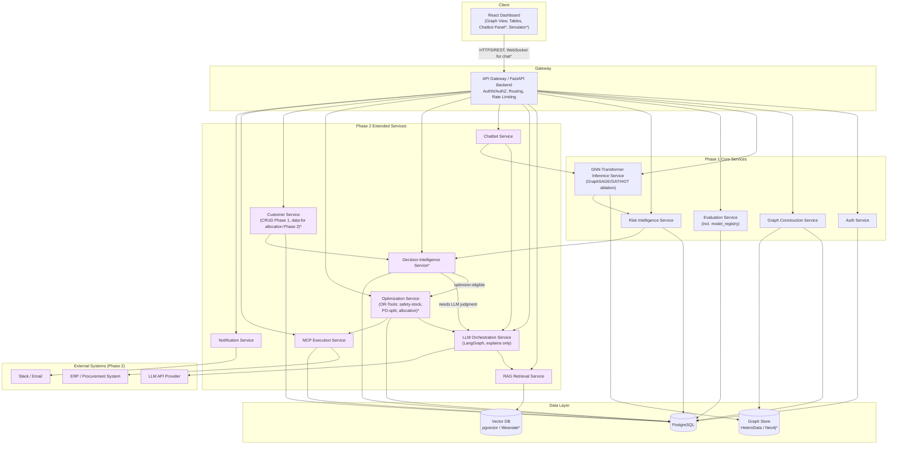
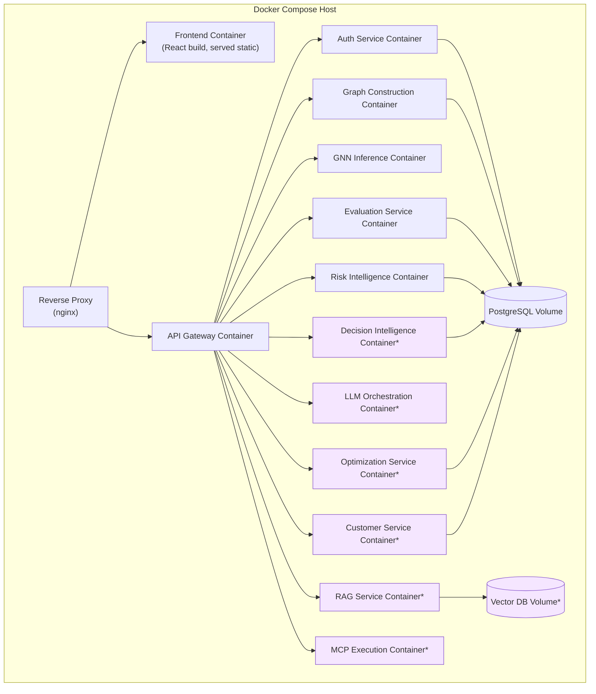

# Document 2 — Technical Requirement Specification

## Graph Neural Network and Generative AI-Based Supply Chain Risk Prediction System

Version: 1.0
Status: Baseline
Consistent with: `docs/01_Product_Requirement_Document.md`

---

## 1. Purpose

This document defines the technical architecture, components, technology stack, deployment model, communication protocols, security posture, logging/monitoring approach, and scalability/availability targets required to implement the functional and non-functional requirements set out in Document 1. It is the architectural contract that Documents 5–13 (database, backend, API, AI/ML, security, testing) must conform to.

## 2. Scope

Covers the technical architecture for both delivery phases:

- **Phase 1:** Auth service, PostgreSQL, graph construction pipeline, GNN-Transformer inference service (trained via architecture ablation, GraphSAGE → GAT → HGT), evaluation service (persisted metrics, architecture comparison, model governance/registry), risk intelligence service (confidence, business aggregation, categorization), REST API layer, React dashboard, D3 graph visualization.
- **Phase 2:** Adds RAG service (vector database + retriever), LLM orchestration service, chatbot service, decision intelligence service (rule/policy validation, optimizer-vs-LLM routing, decision trace), optimization service (OR-Tools: safety-stock, PO-split, customer allocation), customer service, MCP execution layer, ERP/procurement integration adapters, notification service.

Out of scope: infrastructure for multi-tenant SaaS operation, mobile clients, real-time streaming ingestion (see Document 1, Section 15, Future Scope).

## 3. Architecture

### 3.1 Architectural Style

A layered, service-oriented architecture matching the problem statement's six logical layers plus its two intelligence stages (Risk Intelligence, Decision Intelligence, Document 1 Sections 8.18–8.19), implemented as a set of backend services behind a single API gateway, a Python ML/AI subsystem, and a React single-page frontend. Phase 1 ships five backend services; Phase 2 adds eight more without altering Phase 1 service boundaries — services are additive, not replaced. Risk Intelligence sits immediately downstream of GNN Inference in every prediction path; Decision Intelligence sits between risk intelligence and the Optimization/LLM Orchestration services, deciding which one handles a given flagged entity — the LLM never performs numeric optimization.

### 3.2 High-Level Component Diagram

*Nodes and edges marked with `*` or shaded purple are Phase 2. Unshaded nodes are Phase 1. The Decision Intelligence Service routes each flagged entity to either the Optimization Service (closed-form decision types) or the LLM Orchestration Service (qualitative recommendation); the Optimization Service's output is always then explained by the LLM Orchestration Service — the LLM never computes the optimizer's numbers itself.*

### 3.3 Layer-to-Component Mapping

| Problem Statement Layer | Component(s) | Delivery Phase |
|---|---|---|
| Layer 1 — Graph Construction | Graph Construction Service, PostgreSQL, Graph Store | Phase 1 |
| Layer 2 — GNN × Transformer (Graph Intelligence) | GNN-Transformer Inference Service, Evaluation Service | Phase 1 |
| Risk Intelligence Layer | Risk Intelligence Service | Phase 1 |
| Decision Intelligence Layer | Decision Intelligence Service | Phase 2 |
| Layer 3 — RAG | RAG Retrieval Service, Vector DB | Phase 2 |
| Layer 4 — LLM | LLM Orchestration Service | Phase 2 |
| Layer 5 — MCP Servers | MCP Execution Service, Notification Service, Optimization Service, Customer Service (allocation data) | Phase 2 |
| Layer 6 — Frontend Dashboard | React Dashboard, API Gateway | Phase 1 (shell), Phase 2 (chatbot/simulator/approval panels) |

## 4. Components

| Component | Responsibility | Delivery Phase |
|---|---|---|
| API Gateway / Backend | Central FastAPI application: request routing, authentication/authorization enforcement, rate limiting, request validation | Phase 1 |
| Auth Service | Credential verification, JWT issuance/refresh, user/role management | Phase 1 |
| Graph Construction Service | Ingests structured records, runs cleaning/normalization, light document parsing, assembles heterogeneous graph | Phase 1 |
| GNN-Transformer Inference Service | Loads trained model artifact (GraphSAGE, GAT, or HGT per `model_version`), serves scoring requests, computes `impact_score` via GNN-native or weighted-formula method, produces explanation subgraphs and embeddings | Phase 1 |
| Evaluation Service | Persists classification/regression metrics and model-governance metadata (`model_registry`: dataset, timestamp, experiment ID, git commit, hyperparameters, status) per training run; serves architecture comparison and active-model queries (FR-ABL-02, FR-EVAL-02, FR-GOV-01/02) | Phase 1 |
| Risk Intelligence Service | Computes confidence, aggregates `impact_score` via `gnn_native` or `weighted_formula` method, evaluates thresholds, assigns `risk_category` (FR-RISKINT-01/02/03) | Phase 1 |
| RAG Retrieval Service | Embeds and indexes evidence documents, serves hybrid search queries | Phase 2 |
| LLM Orchestration Service | Coordinates prompt assembly, RAG retrieval calls, LLM API calls; explains risk scores and Decision Intelligence/Optimization decisions in plain language — never computes a numeric optimization itself (FR-OPT-03) | Phase 2 |
| Chatbot Service | Intent classification, conversation state, routes to retrieval/generation/action pipelines | Phase 2 |
| Decision Intelligence Service | Validates candidate recommendations against business rules/policy (FR-DEC-02), routes each flagged entity to the Optimization Service or the LLM Orchestration Service (FR-DEC-01), assembles OR-Tools constraint sets, records the decision trace (FR-DEC-03) | Phase 2 |
| Optimization Service | Runs OR-Tools constraint solver for safety-stock sizing, PO splitting, and customer allocation, given the constraint set the Decision Intelligence Service assembles; returns optimal action decisions to the approval workflow (FR-OPT-01/02) | Phase 2 |
| Customer Service | Customer CRUD and priority-tier management; supplies priority tier, order value, and SLA/contract data as inputs to the Decision Intelligence/Optimization services for FR-CUST-02 | Phase 1 (CRUD), Phase 2 (data feed to optimizer) |
| MCP Execution Service | Executes approved actions against ERP/procurement via MCP servers, logs outcomes | Phase 2 |
| Notification Service | Sends threshold-triggered alerts via Slack/email through MCP | Phase 2 |
| React Dashboard | All UI screens per Document 3 | Phase 1 (core screens), Phase 2 (chatbot, simulator, approval, alerts panels) |

## 5. Technology Stack

| Layer | Technology | Delivery Phase |
|---|---|---|
| Frontend framework | React (with TypeScript) | Phase 1 |
| Graph visualization | D3.js | Phase 1 |
| Charting (trend timeline) | Recharts / D3 | Phase 2 |
| Backend framework | FastAPI (Python) | Phase 1 |
| Relational database | PostgreSQL | Phase 1 |
| Graph representation | PyTorch Geometric `HeteroData`; Neo4j optional for query/visualization convenience | Phase 1 |
| Data processing | Pandas, Scikit-learn, NetworkX | Phase 1 |
| ML framework | PyTorch, PyTorch Geometric | Phase 1 |
| GNN architectures | GraphSAGE / GAT baseline, Heterogeneous Graph Transformer, trained and evaluated as a progressive ablation | Phase 1 |
| Evaluation metrics | Scikit-learn (Precision/Recall/F1/ROC-AUC, MAE/RMSE/MAPE) | Phase 1 |
| Explainability | GNNExplainer | Phase 1 |
| What-if support | Monte Carlo simulation utilities over trained model | Phase 2 |
| Optimization | Google OR-Tools (constraint solver) | Phase 2 |
| Vector database | pgvector (co-located with PostgreSQL) or Weaviate | Phase 2 |
| Embedding model | Embedding model via LLM API provider | Phase 2 |
| LLM | LLM API (chat/completion) | Phase 2 |
| Orchestration | LangGraph | Phase 2 |
| Text-to-SQL / Text-to-Cypher | LangGraph retriever node | Phase 2 |
| Agentic execution protocol | Model Context Protocol (MCP) servers | Phase 2 |
| Notifications | Slack API, Email (SMTP/API) | Phase 2 |
| Containerization | Docker, Docker Compose | Phase 1 |
| CI/CD | GitHub Actions | Phase 1 |
| Authentication | JWT (access + refresh tokens) | Phase 1 |

## 6. Deployment

### 6.1 Deployment Model

Containerized services orchestrated via Docker Compose for development and demo environments. Each backend service (Auth, Graph Construction, GNN Inference, and in Phase 2: RAG, LLM Orchestration, Chatbot, MCP Execution, Notification) runs as an independently deployable container behind the API Gateway container. PostgreSQL and the vector database (Phase 2) run as managed containers with persisted volumes.

### 6.2 Environments

| Environment | Purpose | Delivery Phase |
|---|---|---|
| Local Development | Individual development, Docker Compose | Phase 1 |
| Staging / Demo | Evaluator/panel demonstrations, mirrors production configuration at prototype scale | Phase 1 |
| Production-equivalent (Phase 2 extension) | Adds sandbox ERP integration, external LLM/vector DB endpoints | Phase 2 |

## 7. Communication

| Interaction | Protocol | Delivery Phase |
|---|---|---|
| Frontend ↔ API Gateway | HTTPS / REST (JSON) | Phase 1 |
| Chatbot streaming responses | WebSocket or Server-Sent Events over HTTPS | Phase 2 |
| API Gateway ↔ internal services | Internal HTTP/REST (service-to-service, within Docker network) | Phase 1 |
| GNN Inference ↔ Graph Store | Direct in-process / internal RPC | Phase 1 |
| LLM Orchestration ↔ LLM API Provider | HTTPS/REST (external) | Phase 2 |
| MCP Execution ↔ ERP/Procurement | Model Context Protocol over stdio/HTTP transport | Phase 2 |
| Notification Service ↔ Slack/Email | HTTPS/REST (external) | Phase 2 |

## 8. APIs

Full endpoint-level documentation is provided in Document 9 (REST API Documentation). At the architecture level:

- All client-facing APIs are exposed as versioned REST endpoints under `/api/v1/` through the API Gateway.
- All endpoints except `/api/v1/auth/login` require a valid JWT bearer token (NFR-07).
- Internal service-to-service calls are not exposed externally and are network-isolated within the Docker Compose network / deployment VPC.

## 9. Security

Summarized here; full detail in Document 12 (Security Documentation).

| Control | Mechanism | Delivery Phase |
|---|---|---|
| Authentication | JWT access + refresh tokens | Phase 1 |
| Authorization | RBAC (Admin, Analyst, Approver) enforced at the API Gateway | Phase 1 |
| Password storage | bcrypt/argon2 salted hashing | Phase 1 |
| Transport security | HTTPS/TLS for all external traffic | Phase 1 |
| Secrets management | Environment-variable/`.env`-based configuration, excluded from source control | Phase 1 |
| Action authorization | Mandatory human-approval record before any MCP execution (applies uniformly to LLM-, recommender-, optimizer-, and allocation-sourced actions) | Phase 2 |
| Evaluation integrity | `model_evaluation_runs` immutable, append-only (NFR-19); `model_registry` immutable once `status='active'` (NFR-24) | Phase 1 |
| Decision audit | Every `action_requests` row carries a non-empty `decision_trace` (NFR-23), naming the layer(s) that produced it | Phase 2 |
| Prompt injection protection | Input sanitization and instruction-isolation on chatbot/LLM prompts (Document 12) | Phase 2 |
| Audit logging | Immutable audit log for auth events, approvals, and executed actions | Phase 1 (auth), Phase 2 (approvals/actions) |

## 10. Logging

| Aspect | Approach | Delivery Phase |
|---|---|---|
| Application logs | Structured JSON logs per service, correlation ID propagated across service calls | Phase 1 |
| Audit logs | Dedicated `audit_log` table (Document 5) for auth, approval, and action events | Phase 1 (auth), Phase 2 (approval/action) |
| ML pipeline logs | Training run metadata, evaluation metrics logged per run | Phase 1 |
| LLM/RAG interaction logs | Prompt, retrieved evidence references, and response logged for traceability (not raw PII where avoidable) | Phase 2 |
| Log retention | Configurable retention policy; audit logs retained for the life of the demo/evaluation environment at minimum | Phase 1 |

## 11. Monitoring

| Aspect | Approach | Delivery Phase |
|---|---|---|
| Service health | Health-check endpoints (`/healthz`) per service | Phase 1 |
| Model performance | Periodic evaluation against a held-out set; metrics tracked per training run (Document 10) | Phase 1 |
| API performance | Request latency and error-rate tracking against NFR-01/NFR-03 targets | Phase 1 (latency), Phase 2 (chatbot latency) |
| Alert threshold monitoring | Scheduled/triggered evaluation of risk scores against configured thresholds | Phase 2 |
| Integration health | MCP/ERP connection health checks, execution success/failure rate | Phase 2 |

## 12. Scalability

| Concern | Approach | Delivery Phase |
|---|---|---|
| Graph growth | Incremental graph updates instead of full rebuilds (FR-GC-07) | Phase 1 |
| Inference throughput | Stateless inference service, horizontally scalable behind the gateway if needed | Phase 1 |
| Vector index growth | Re-indexing without downtime (FR-RAG-04) | Phase 2 |
| Chatbot concurrency | Stateless chatbot service instances with session state externalized (e.g., in PostgreSQL/cache) | Phase 2 |

Scalability targets are bounded by prototype scale per Document 1, NFR-01/NFR-02; production-scale horizontal scaling is noted as Future Scope (Document 1, Section 15) rather than a current requirement.

## 13. Availability

| Concern | Approach | Delivery Phase |
|---|---|---|
| Target uptime | 95% during evaluation/demo windows (NFR-06) | Phase 1 |
| Service isolation | Independent containers so a failure in one Phase 2 service (e.g., MCP execution) does not take down Phase 1 core prediction/dashboard functionality | Phase 1 (design), Phase 2 (realized) |
| Graceful degradation | If RAG/LLM services are unavailable, chatbot surfaces a clear error state rather than a silent failure (Document 3, Error States) | Phase 2 |
| Backup | Scheduled PostgreSQL backups sufficient for demo-environment recovery | Phase 1 |

## 14. Assumptions

- Docker Compose is sufficient for the project's deployment needs; container orchestration platforms (Kubernetes) are not required at prototype scale.
- A single-region, single-environment demo deployment is sufficient; no multi-region/HA requirement exists for an academic project.
- External LLM and vector database providers offer sufficient availability SLAs for Phase 2 demo purposes.

## 15. Dependencies

Same as Document 1, Section 13, at the infrastructure level: PostgreSQL, PyTorch/PyTorch Geometric, GNNExplainer, React, D3.js, FastAPI, pgvector/Weaviate, LLM API, LangGraph, MCP servers, ERP sandbox/mock, Slack/email API, Google OR-Tools.

## 16. Risks

| ID | Risk | Mitigation | Delivery Phase |
|---|---|---|---|
| TR-01 | Service sprawl (7+ containers by Phase 2) increases operational complexity across the team | Docker Compose with clear per-service README; health checks surface failures early | Phase 2 |
| TR-02 | Internal service-to-service coupling makes independent scaling harder later | Keep service boundaries aligned to the six-layer architecture so each maps to one bounded context | Phase 1 |
| TR-03 | External LLM/vector DB provider outages block Phase 2 demo | Graceful degradation (Section 13) and cached/mock fallback for demo rehearsal | Phase 2 |
| TR-04 | Optimization Service scope creeps beyond safety-stock/PO-splitting/allocation into a general solver | Explicit "in scope"/"out of scope" boundary documented (Document 1, Section 8.16); reviewed before any solver extension | Phase 2 |
| TR-05 | Decision Intelligence Service becomes a hidden bottleneck/single point of routing failure between Risk Intelligence and Optimization/LLM | Stateless service design consistent with GNN Inference (Section 12); routing rules are explicit and testable (Document 13), not implicit control flow | Phase 2 |

## 17. Future Extension

The layered, additive architecture (Section 3.1) is designed so that features noted in Document 1, Section 15 (multi-tenancy, streaming ingestion, MLOps retraining pipeline, mobile client) can be introduced as new services or gateway routes without restructuring the Phase 1/Phase 2 service boundaries already defined here.

---

## Document Control

- **Purpose:** Section 1. **Scope:** Section 2. **Assumptions:** Section 14. **Dependencies:** Section 15. **Risks:** Section 16. **Future Extension:** Section 17.
- Baseline for Documents 5 (Database Design), 6 (Graph Database Design), 7 (Vector Database Design), 8 (Backend Design), 9 (REST API Documentation), and 12 (Security Documentation).
