# Document 3 — UI / UX Documentation

## Graph Neural Network and Generative AI-Based Supply Chain Risk Prediction System

Version: 1.0
Status: Baseline
Consistent with: Documents 1–2

---

## 1. Purpose

This document specifies every screen in the React dashboard: its purpose, components, layout, navigation, validation rules, and the loading/error/empty states and permissions that govern it, per Document 1's Functional Requirements (Section 8.12) and personas (Section 7). It is the contract the frontend implementation must satisfy.

## 2. Scope

21 screens are specified: Login, Dashboard, Supply Chain Graph, Risk Dashboard, Supplier, Warehouse, Orders, Shipments, Products, Inventory, Model Comparison, Customers, Chatbot, What-if Simulator, Recommendation, Allocation, Alerts, Admin, Audit, Profile, Settings. Each is tagged with a Delivery Phase; Phase 2 screens are stubbed but hidden behind feature flags in the Phase 1 build to avoid dead UI surface. Three cross-cutting components — a **Confidence Panel**, a **Model Metadata Panel**, and a **Decision Trace Panel** — are not separate screens; they are embedded wherever their underlying data appears (Risk Dashboard, Supplier/Supply-Chain-Graph detail, Model Comparison, and the Alerts/Approval detail view respectively), per Document 1's confidence/governance/decision-audit requirements (FR-CONF-01/02, FR-GOV-01/02, FR-DEC-03).

## 3. Assumptions

- All screens sit behind the authenticated shell (post-login); only Login is unauthenticated.
- Role-based visibility (Section 9, Document 1 RBAC) hides/disables UI elements a role cannot use, in addition to backend enforcement.
- Design system: a single component library (e.g., a Tailwind/Radix-based kit) is used consistently across all screens; screen-specific specs below assume shared header, sidebar navigation, and toast/notification primitives.

## 4. Dependencies

- Document 2 (API Gateway routes, WebSocket for chat).
- Document 9 (REST API Documentation) for exact request/response contracts each screen consumes.
- Document 1, Section 7 (Personas) and Section 8 (Functional Requirements) for permission and behavior source-of-truth.

## 5. Global Navigation Shell

```mermaid
flowchart LR
    LOGIN["Login"] -->|authenticated| SHELL

    subgraph SHELL["Authenticated Shell"]
        direction TB
        NAV["Sidebar Navigation"]
        NAV --> DASH["Dashboard"]
        NAV --> GRAPH["Supply Chain Graph"]
        NAV --> RISK["Risk Dashboard"]
        NAV --> SUPP["Supplier"]
        NAV --> WARE["Warehouse"]
        NAV --> ORD["Orders"]
        NAV --> SHIP["Shipments"]
        NAV --> PROD["Products"]
        NAV --> INV["Inventory"]
        NAV --> MODCMP["Model Comparison"]
        NAV --> CUST["Customers"]
        NAV --> CHAT["Chatbot*"]
        NAV --> SIM["What-if Simulator*"]
        NAV --> REC["Recommendation*"]
        NAV --> ALLOC["Allocation*"]
        NAV --> ALERT["Alerts*"]
        NAV --> ADMIN["Admin"]
        NAV --> AUDIT["Audit"]
        NAV --> PROF["Profile"]
        NAV --> SET["Settings"]
    end
```

*Starred screens are Phase 2; hidden behind a feature flag until Phase 2 ships.*

## 6. Screen Specifications

Each screen is documented with: Purpose, Components, Layout, Navigation, Validation, Loading State, Error State, Empty State, Permissions, Responsive Behaviour, Delivery Phase.

### 6.1 Login

| Attribute | Specification |
|---|---|
| Purpose | Authenticate a user and establish a session. |
| Components | Email field, password field, "Sign in" button, error banner, "forgot password" link (Phase 1, non-functional stub if out of scope for reset flow). |
| Layout | Centered single-column card on a neutral background; logo/title above form. |
| Navigation | On success → Dashboard. No sidebar present on this screen. |
| Validation | Email format validated client-side; both fields required; password field masked. |
| Loading State | Submit button shows spinner and disables while auth request is in flight. |
| Error State | Invalid credentials show a generic "Invalid email or password" banner (no field-level disclosure, per NFR-08 security posture); account-locked state shows a distinct message (FR-AUTH-05). |
| Empty State | N/A (form screen). |
| Permissions | Public (unauthenticated). |
| Responsive Behaviour | Card scales to full width with margin on mobile/tablet widths; no layout reflow needed. |
| Delivery Phase | Phase 1 |

### 6.2 Dashboard (Home)

| Attribute | Specification |
|---|---|
| Purpose | Executive-style summary of overall supply chain risk posture (US-DASH-04). |
| Components | Aggregate risk-severity tiles (High/Medium/Low counts), top-N at-risk entities widget, quick links to Graph and Risk Dashboard, recent activity feed. |
| Layout | Grid of summary tiles at top; two-column widget row below (top-risk list + activity feed). |
| Navigation | Entry point after login; sidebar links to all other screens. |
| Validation | N/A (read-only). |
| Loading State | Skeleton tiles/placeholders while summary data loads. |
| Error State | Tile-level error message with retry action if summary endpoint fails; rest of shell remains usable. |
| Empty State | "No risk data available yet" message shown if graph/prediction pipeline has not yet run. |
| Permissions | All authenticated roles (Analyst, Approver, Admin). |
| Responsive Behaviour | Tile grid collapses from 4 → 2 → 1 columns by viewport width. |
| Delivery Phase | Phase 1 |

### 6.3 Supply Chain Graph

| Attribute | Specification |
|---|---|
| Purpose | Interactive, risk-colored visualization of the full heterogeneous supply chain graph (FR-DASH-01). |
| Components | D3 force-directed/graph canvas, node-type legend, risk-color legend, zoom/pan controls, node detail side panel on selection, explainability overlay toggle* (Phase 2), what-if entry point* (Phase 2). |
| Layout | Full-width canvas with a collapsible right-hand detail panel. |
| Navigation | Selecting a node opens its detail panel; "view full record" links to the corresponding entity screen (Supplier/Warehouse/Order/etc.). |
| Validation | N/A (visualization screen); simulator input validation is specified under 6.11. |
| Loading State | Canvas shows a centered spinner with "Building graph view" while graph data loads; large graphs show incremental render progress. |
| Error State | If graph data fails to load, canvas shows an error panel with retry; does not crash the shell. |
| Empty State | "No graph data available" if no entities exist yet. |
| Permissions | All authenticated roles (view); simulation controls restricted per Section 6.11. |
| Responsive Behaviour | Detail panel collapses to a bottom sheet below tablet width; canvas remains pan/zoomable via touch. |
| Delivery Phase | Phase 1 (graph view); explainability overlay and simulator entry points Phase 2 |

### 6.4 Risk Dashboard

| Attribute | Specification |
|---|---|
| Purpose | Sortable/filterable table of at-risk suppliers and orders (FR-DASH-02, US-DASH-02). |
| Components | Filter bar (entity type, risk level, date range, risk category), sortable data table (entity, risk score, confidence, risk category badge (`low`/`medium`/`high`/`critical`), delay probability, shortage risk, impact score, scoring method badge (`gnn_native`/`weighted_formula`), affected orders count), row-level "view detail" action, **Confidence Panel** (confidence value + architecture/model_version, expandable on row hover/click, FR-CONF-01) formula breakdown popover (component risk weights, FR-RISK-01) when `scoring_method='weighted_formula'`, risk trend sparkline column* (Phase 2). |
| Layout | Filter bar above a full-width data table with pagination. |
| Navigation | Row click → entity detail screen (Supplier/Product/etc.); "view explanation" → Supply Chain Graph with explainability overlay* (Phase 2) or explanation subgraph panel (Phase 1). |
| Validation | Filter inputs constrained to valid enum values/date ranges; invalid ranges show inline validation message. |
| Loading State | Table shows skeleton rows while data loads. |
| Error State | Table area shows error banner with retry; filters remain usable to retry with different parameters. |
| Empty State | "No entities currently at risk" message when filtered results are empty, distinct from load error. |
| Permissions | All authenticated roles (view); export/action controls restricted to Analyst/Approver/Admin. |
| Responsive Behaviour | Table converts to stacked card rows below tablet width. |
| Delivery Phase | Phase 1 (core table); trend sparkline column Phase 2 |

### 6.5 Supplier

| Attribute | Specification |
|---|---|
| Purpose | List and detail view of suppliers, their risk status, and (Phase 2) recommended alternatives. |
| Components | Supplier list (searchable), supplier detail (profile fields, risk score, Confidence Panel, delay probability, linked components/orders, explanation subgraph panel, "recommend alternative" action*). |
| Layout | Master-detail: list on the left/top, detail panel on selection. |
| Navigation | From Risk Dashboard, Graph view, or direct sidebar entry; detail links to related Orders/Shipments. |
| Validation | Search/filter fields validated against expected formats (e.g., supplier ID pattern). |
| Loading State | List and detail panel each show independent skeleton loaders. |
| Error State | Detail panel shows retry-capable error if a specific supplier record fails to load. |
| Empty State | "No suppliers found" for empty search results; distinct from initial load. |
| Permissions | View: all roles. Recommendation/approval actions: Procurement Manager-equivalent (Analyst+) and Approver roles per Document 1 persona mapping. |
| Responsive Behaviour | Master-detail stacks vertically (list → detail as a pushed view) on mobile widths. |
| Delivery Phase | Phase 1 (list/detail/risk); recommendation action Phase 2 |

### 6.6 Warehouse

| Attribute | Specification |
|---|---|
| Purpose | List and detail view of warehouses and their associated shortage risk (US-PRED-02). |
| Components | Warehouse list, detail view (capacity, linked products/inventory, shortage risk score, affected orders). |
| Layout | Master-detail, consistent with Supplier screen. |
| Navigation | Links to Inventory and Products for the selected warehouse. |
| Validation | N/A beyond search/filter input constraints. |
| Loading State | Skeleton list/detail loaders. |
| Error State | Retry-capable error banner on load failure. |
| Empty State | "No warehouses found." |
| Permissions | All authenticated roles (view). |
| Responsive Behaviour | Same stacking behavior as Supplier screen. |
| Delivery Phase | Phase 1 |

### 6.7 Orders

| Attribute | Specification |
|---|---|
| Purpose | List and detail view of customer orders, including which are affected by predicted disruptions (US-PRED-03). |
| Components | Order list (filter by status/risk), detail view (line items, linked products, shipment status, disruption flag with linked explanation). |
| Layout | Master-detail list/table. |
| Navigation | Detail links to Shipments and Products; disruption flag links to Risk Dashboard entry. |
| Validation | Filter constraints on status/date. |
| Loading State | Skeleton table rows. |
| Error State | Retry-capable banner. |
| Empty State | "No orders found" for empty filter results. |
| Permissions | All authenticated roles (view). |
| Responsive Behaviour | Table → stacked cards below tablet width. |
| Delivery Phase | Phase 1 |

### 6.8 Shipments

| Attribute | Specification |
|---|---|
| Purpose | List and detail view of shipments, including delay probability. |
| Components | Shipment list (filter by route/status/risk), detail view (origin/destination, carrier, ETA, delay probability, linked order). |
| Layout | Master-detail list/table. |
| Navigation | Detail links to Orders and Suppliers. |
| Validation | Filter/date constraints. |
| Loading State | Skeleton loaders. |
| Error State | Retry-capable banner. |
| Empty State | "No shipments found." |
| Permissions | All authenticated roles (view). |
| Responsive Behaviour | Table → stacked cards. |
| Delivery Phase | Phase 1 |

### 6.9 Products

| Attribute | Specification |
|---|---|
| Purpose | List and detail view of products, their component composition, and shortage risk. |
| Components | Product list, detail view (bill-of-components, linked warehouses/inventory, shortage risk, affected orders). |
| Layout | Master-detail. |
| Navigation | Detail links to Inventory, Warehouse, and Orders. |
| Validation | Search/filter constraints. |
| Loading State | Skeleton loaders. |
| Error State | Retry-capable banner. |
| Empty State | "No products found." |
| Permissions | All authenticated roles (view). |
| Responsive Behaviour | Stacked on mobile. |
| Delivery Phase | Phase 1 |

### 6.10 Inventory

| Attribute | Specification |
|---|---|
| Purpose | Stock-level view per product/warehouse with shortage risk overlay (US-PRED-02). |
| Components | Inventory table (product, warehouse, stock level, reorder threshold, shortage risk), filter bar. |
| Layout | Full-width filterable table. |
| Navigation | Row links to Product and Warehouse detail. |
| Validation | Filter constraints on stock-level ranges. |
| Loading State | Skeleton rows. |
| Error State | Retry-capable banner. |
| Empty State | "No inventory records found." |
| Permissions | All authenticated roles (view); threshold configuration reserved for Admin (Settings screen, not here). |
| Responsive Behaviour | Table → stacked cards. |
| Delivery Phase | Phase 1 |

### 6.11 Chatbot

| Attribute | Specification |
|---|---|
| Purpose | Natural-language Q&A over risk, explanations, and evidence; front door to action approval (Section 5.1, Document `problem_statement.md`). |
| Components | Chat panel (message thread, input box, send button), suggested-question chips, inline citation links to evidence, inline "approve action" card when a recommendation is surfaced. |
| Layout | Slide-over panel or dedicated full-height screen with persistent input bar at bottom. |
| Navigation | Citation links open the relevant Supplier/Order/Evidence detail; "approve" routes into the approval flow (Section 6.14/Document 4). |
| Validation | Input box enforces a max message length; empty submissions blocked. |
| Loading State | Typing/streaming indicator while the LLM response streams in. |
| Error State | If RAG/LLM service is unavailable, an inline error message explains the chatbot is temporarily unavailable, distinct from a "no answer found" response. |
| Empty State | Placeholder greeting with example questions when no conversation has started. |
| Permissions | Analyst, Approver, Admin. Action-approval card only interactive for Approver/Admin roles. |
| Responsive Behaviour | Full-screen takeover on mobile widths instead of a side panel. |
| Delivery Phase | Phase 2 |

### 6.12 What-if Simulator

| Attribute | Specification |
|---|---|
| Purpose | Let a user perturb a graph entity's features and re-score without retraining (Section 5.2, `problem_statement.md`). |
| Components | Entity selector, editable feature form (e.g., lead time), "run simulation" button, before/after risk comparison view, affected-entities list. |
| Layout | Two-pane: controls on the left, results (graph delta + list) on the right. |
| Navigation | Launched from Supply Chain Graph or Supplier/Product detail; results link back to affected entities. |
| Validation | Perturbation inputs constrained to sane ranges (e.g., non-negative lead time); out-of-range input blocked with inline message before "run simulation" is enabled. |
| Loading State | "Run simulation" button shows spinner; results pane shows skeleton while re-scoring runs. |
| Error State | Inline error if re-scoring fails; original (unmodified) state remains visible. |
| Empty State | Prompt to "select an entity to begin" before any simulation has been run. |
| Permissions | Analyst, Approver, Admin. |
| Responsive Behaviour | Two-pane stacks vertically below tablet width. |
| Delivery Phase | Phase 2 |

### 6.13 Recommendation

| Attribute | Specification |
|---|---|
| Purpose | Show ranked alternative-supplier recommendations for a flagged supplier (Section 5.4, `problem_statement.md`), and OR-Tools-generated safety-stock/PO-split decisions (Section 5.7). |
| Components | Ranked list of candidate suppliers (similarity score, component-type match, risk comparison), "approve: raise PO" action per candidate; a separate **Optimizer Results** panel showing safety-stock/PO-split decisions with an optimal/infeasible badge and objective value, sourced from `POST /api/v1/optimize/*` (Document 9, Section 12.2) — every item here was routed here by the Decision Intelligence Layer (Document 1, Section 8.19), never computed by the LLM. |
| Layout | List/card layout, one card per candidate, sorted by similarity score descending. |
| Navigation | Launched from Supplier detail; approving routes into the approval workflow. |
| Validation | N/A (read-only selection); approval action requires confirmation dialog. |
| Loading State | Skeleton cards while recommendations compute. |
| Error State | Retry-capable error banner if recommendation service fails. |
| Empty State | "No suitable alternatives found for this component type" when the candidate list is empty. |
| Permissions | View: Analyst, Approver, Admin. Approve action: Approver, Admin only. |
| Responsive Behaviour | Card grid collapses to single column on mobile. |
| Delivery Phase | Phase 2 |

### 6.14 Alerts

| Attribute | Specification |
|---|---|
| Purpose | Show proactive alerts triggered by threshold-crossing risk scores and pending approvals (Section 5.6, `problem_statement.md`). |
| Components | Alert feed (entity, triggered threshold, timestamp, status), pending-approval queue with approve/reject controls and an expandable **Decision Trace Panel** per queued item (which of Risk Intelligence/Decision Intelligence/Optimization/LLM produced the recommendation, FR-DEC-03, sourced from `GET /api/v1/approvals/{id}/decision-trace`), filter by status/severity. |
| Layout | Two-tab layout: "Alerts" feed and "Pending Approvals" queue. |
| Navigation | Alert entries link to the relevant entity/prediction; approval entries link to Recommendation or chatbot-originated action detail. |
| Validation | Reject action requires a non-empty reason field (FR-MCP-04). |
| Loading State | Skeleton feed rows. |
| Error State | Retry-capable banner on feed load failure; approve/reject actions show inline error toast on failure without losing queue state. |
| Empty State | "No active alerts" / "No pending approvals" shown independently per tab. |
| Permissions | View: Analyst, Approver, Admin. Approve/reject: Approver, Admin only. |
| Responsive Behaviour | Tabs and queue stack full-width on mobile. |
| Delivery Phase | Phase 2 |

### 6.15 Admin

| Attribute | Specification |
|---|---|
| Purpose | User, role, and (Phase 2) alert-threshold management (FR-AUTH-06, FR-MCP-06). |
| Components | User table (create/deactivate/edit role), role assignment control, alert threshold configuration form*. |
| Layout | Tabbed: "Users" and "Thresholds*". |
| Navigation | Sidebar entry, Admin-only. |
| Validation | New-user form validates email format and required role selection; threshold form validates numeric ranges. |
| Loading State | Skeleton table/form while data loads. |
| Error State | Inline error toast on failed create/update/deactivate action; form retains entered values. |
| Empty State | "No users found" only possible in a misconfigured environment; not expected in normal operation. |
| Permissions | Admin only; other roles receive an access-denied state if navigated directly. |
| Responsive Behaviour | Table → stacked cards; forms remain single-column at all widths. |
| Delivery Phase | Phase 1 (user management); threshold configuration Phase 2 |

### 6.16 Audit

| Attribute | Specification |
|---|---|
| Purpose | Read-only log of authentication events (Phase 1) and approval/action events (Phase 2) for compliance review (US-DASH-05). |
| Components | Filterable, paginated audit table (timestamp, actor, event type, target, outcome). |
| Layout | Full-width filterable table. |
| Navigation | Sidebar entry; row detail expands inline for full event payload. |
| Validation | Filter date-range validation. |
| Loading State | Skeleton rows. |
| Error State | Retry-capable banner. |
| Empty State | "No audit events in the selected range." |
| Permissions | Admin, Approver (Compliance Officer persona). |
| Responsive Behaviour | Table → stacked cards. |
| Delivery Phase | Phase 1 (auth events); Phase 2 (approval/action events) |

### 6.17 Profile

| Attribute | Specification |
|---|---|
| Purpose | Let a user view and update their own account details. |
| Components | Name/email display, password-change form, session info (last login). |
| Layout | Single-column form card. |
| Navigation | Accessible from the user menu in the header, any authenticated screen. |
| Validation | Password-change form enforces minimum complexity and confirmation match. |
| Loading State | Form fields show skeleton while profile loads. |
| Error State | Inline error on failed update, e.g., wrong current password. |
| Empty State | N/A (always populated for an authenticated user). |
| Permissions | Any authenticated user, own profile only. |
| Responsive Behaviour | Full-width single column on mobile, no layout change needed. |
| Delivery Phase | Phase 1 |

### 6.18 Settings

| Attribute | Specification |
|---|---|
| Purpose | Application-level preferences (e.g., default dashboard filters, notification preferences*). |
| Components | Preference form (default risk-table filters, theme toggle), notification channel preferences*. |
| Layout | Single-column grouped form sections. |
| Navigation | Accessible from the user menu. |
| Validation | Preference values constrained to valid options; invalid combinations blocked before save. |
| Loading State | Skeleton form while preferences load. |
| Error State | Inline error toast on save failure; unsaved changes preserved in the form. |
| Empty State | Defaults are always pre-populated; no empty state applicable. |
| Permissions | Any authenticated user (personal settings); alert threshold settings covered under Admin, not here. |
| Responsive Behaviour | Single column at all widths. |
| Delivery Phase | Phase 1 (basic preferences); notification channel preferences Phase 2 |

### 6.19 Model Comparison

| Attribute | Specification |
|---|---|
| Purpose | Side-by-side comparison of the GraphSAGE, GAT, and Heterogeneous Graph Transformer architectures, with the documented research rationale for each stage (Document 10, Section 8.4), justifying the final architecture selection (FR-ABL-02) and surfacing persisted evaluation history (FR-EVAL-02) and model governance (FR-GOV-01/02). |
| Components | Architecture comparison table/cards (Precision, Recall, F1, ROC-AUC, inference time per architecture) each annotated with its "why this stage / documented limitation" rationale, evaluation-run history list filterable by `model_version`/`metric_name`, regression metrics (MAE/RMSE/MAPE) shown if applicable, and a **Model Metadata Panel** (training dataset, timestamp, experiment ID, git commit, hyperparameters, parameter count, lifecycle `status`) sourced from `GET /api/v1/models/registry` / `/active` (Document 9, Section 9.5). |
| Layout | Three-column comparison card row (one per architecture, each with its rationale) above a filterable evaluation-run history table and a Model Metadata Panel for the currently active model. |
| Navigation | Sidebar entry; links to Risk Dashboard for the currently active `model_version`. |
| Validation | Filter inputs constrained to known `architecture`/`metric_name` enum values. |
| Loading State | Skeleton cards and table rows while `GET /api/v1/models/comparison`, `/evaluation-runs`, and `/registry` load. |
| Error State | Retry-capable error banner if evaluation/registry data fails to load. |
| Empty State | "No evaluation runs recorded yet" if no training run has completed. |
| Permissions | All authenticated roles (view). |
| Responsive Behaviour | Comparison cards stack to one column below tablet width. |
| Delivery Phase | Phase 1 |

### 6.20 Customers

| Attribute | Specification |
|---|---|
| Purpose | List, detail, and management view of customers, their priority tier, and contract terms (FR-CUST-01), replacing the free-text `customer_name` field on Orders. |
| Components | Customer list (searchable, filter by priority tier), customer detail (profile fields, priority tier, contract terms, linked orders), create/edit form (Admin/Analyst). |
| Layout | Master-detail: list on the left/top, detail panel on selection. |
| Navigation | From Orders screen (linked customer) or direct sidebar entry. |
| Validation | Priority tier constrained to enum values; contract terms fields validated against expected types (numeric SLA days, percentage penalty). |
| Loading State | Skeleton list/detail loaders. |
| Error State | Retry-capable error banner; inline error toast on failed create/update. |
| Empty State | "No customers found" for empty search results. |
| Permissions | View: all roles. Create/edit: Analyst, Admin. |
| Responsive Behaviour | Master-detail stacks vertically on mobile widths. |
| Delivery Phase | Phase 1 |

### 6.21 Allocation

| Attribute | Specification |
|---|---|
| Purpose | Optimal allocation decision across all orders competing for the same shortage-affected product, solved by the OR-Tools optimizer (Section 5.7–5.8, `problem_statement.md`; US-CUST-01–03), not a simple ranking. |
| Components | Shortage-flagged product selector, an optimal/infeasible badge with objective value and the applied constraint set (inventory, supplier/warehouse/production capacity, lead time), ranked competing-orders table (customer, priority tier, order value, SLA penalty, proposed allocated quantity), editable quantity fields per order, "approve allocation" action with rationale summary and Decision Trace Panel link. |
| Layout | Product selector above a full-width ranked table with inline edit controls. |
| Navigation | Launched from Products/Orders detail when shortage-flagged, or direct sidebar entry; approving routes into the Approval Workflow. |
| Validation | Edited allocated quantities must sum to ≤ available stock; over-allocation blocked with inline message before submission (US-CUST-02). |
| Loading State | Skeleton table while `GET /api/v1/customers/allocations/{product_id}` loads. |
| Error State | Retry-capable error banner if allocation computation fails. |
| Empty State | "No shortage-flagged product selected" prompt before a product is chosen. |
| Permissions | View: Analyst, Approver, Admin. Approve/adjust: Approver, Admin only. |
| Responsive Behaviour | Table converts to stacked card rows below tablet width. |
| Delivery Phase | Phase 2 |

## 7. Cross-Cutting UX Rules

- **Loading:** every data-bound screen must show a skeleton or spinner within 100ms of navigation; no blank screens.
- **Error:** every network-bound action must distinguish a retryable error (banner + retry button) from a permission error (access-denied state, no retry offered).
- **Empty:** every list/table screen must distinguish "no data yet" from "no results for current filter."
- **Permissions:** UI-level role checks are a UX convenience only; the API Gateway is the authoritative enforcement point (Document 2, Section 9; Document 12).

## 8. Risks

| ID | Risk | Mitigation | Delivery Phase |
|---|---|---|---|
| UX-01 | Phase 2 feature-flagged screens (Chatbot, Simulator, Recommendation, Alerts) leave dead navigation entries visible in Phase 1 | Sidebar entries for Phase 2 screens are hidden, not disabled, until Phase 2 ships | Phase 1 |
| UX-02 | Large graphs (Supply Chain Graph screen) may degrade render performance | Bounded by NFR-02 (Document 1); pagination/clustering considered if exceeded | Phase 1 |
| UX-03 | Chatbot streaming UX adds complexity not present in Phase 1 screens | Isolated to Chatbot screen only; does not affect Phase 1 screen patterns | Phase 2 |
| UX-04 | Allocation screen's inline quantity editing (US-CUST-02) could let a user submit an over-allocation without noticing | Client-side sum validation blocks submission before it reaches the API; server-side validation is the authoritative backstop | Phase 2 |
| UX-05 | Confidence Panel and Decision Trace Panel add cognitive load to screens that were previously simple score displays | Both render collapsed by default (expand-on-demand), so the default view stays as simple as Phase 1's; users who don't need the detail never see it | Phase 1 (Confidence Panel), Phase 2 (Decision Trace Panel) |

## 9. Future Extension

Additional screens (e.g., a dedicated Notifications preference center, mobile-optimized layouts) are Future Scope per Document 1, Section 15, and would follow the same Purpose/Components/Layout/.../Responsive Behaviour template established here.

---

## Document Control

- **Purpose:** Section 1. **Scope:** Section 2. **Assumptions:** Section 3. **Dependencies:** Section 4. **Risks:** Section 8. **Future Extension:** Section 9.
- Baseline for Document 4 (Application Flow) and frontend implementation work under Document 11.
