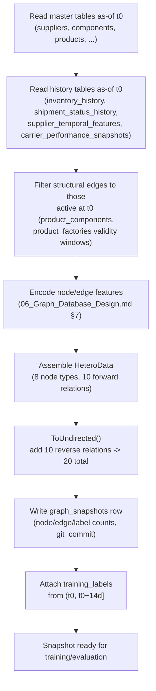
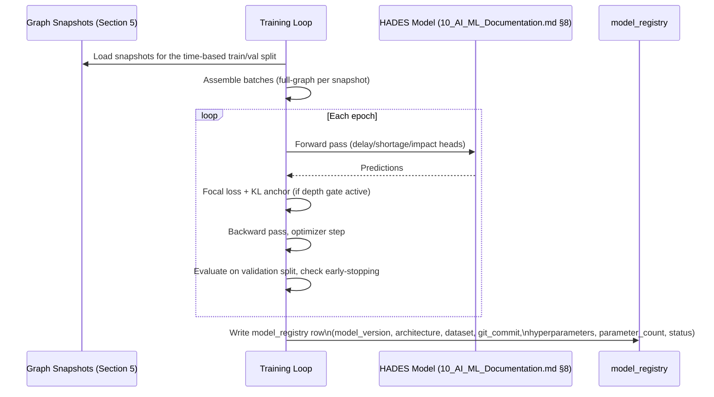
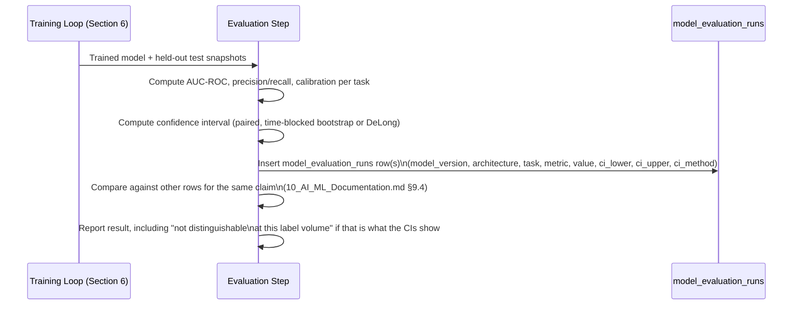
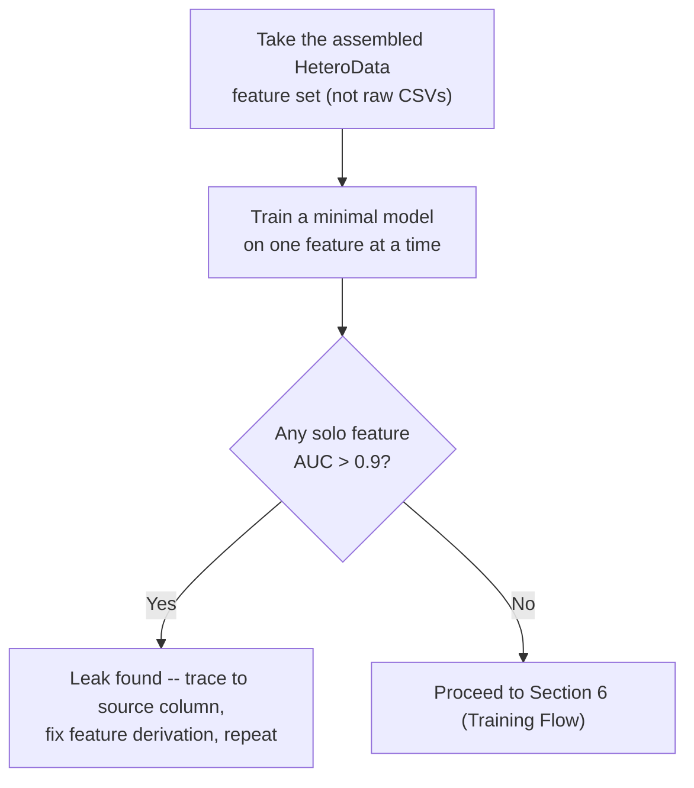

# Document 4 — Application Flow

## HADES Model-Development Prototype

Version: 2.0 — rescoped to the ML pipeline only
Status: Baseline

---

## 1. Purpose

This document describes the three flows that make up this project's entire runtime behavior: building a graph snapshot, training a model, and evaluating it. There is no user-facing application, so there are no auth, dashboard, chat, approval, alert, or execution flows — those existed only in the earlier product-scoped version of this document.

## 2. Scope

- **In scope:** Graph Snapshot Construction Flow (Section 5), Training Flow (Section 6), Evaluation Flow (Section 7), the Leakage Test (Section 8).
- **Out of scope:** every flow that only a served application would need — see `01_Product_Requirement_Document.md` §2.2/§2.3.

## 3. Assumptions

Same as `01_Product_Requirement_Document.md` §8: a single researcher runs each flow as an offline script against the database in `05_Database_Design.md`; nothing here is triggered by a user action or a schedule.

## 4. Dependencies

`05_Database_Design.md` (source tables), `06_Graph_Database_Design.md` (graph assembly), `10_AI_ML_Documentation.md` (feature engineering, model, training/evaluation protocol).

## 5. Graph Snapshot Construction Flow

**Trigger:** A researcher runs the snapshot-building script for a given `t₀` (or the full snapshot schedule).

- **Steps:** read master + history tables as-of `t₀` → filter structural edges by validity window → encode features → assemble `HeteroData` → add reverse relations → register the snapshot → attach labels.
- **Failure handling:** a snapshot whose `t₀` predates the trustworthy-from date of any history table (`05_Database_Design.md` §8, DB-05) is refused rather than built from approximated history.
- **Repeats once per `t₀`** in the snapshot schedule — this is a batch process over the dataset's history, not a single live graph kept up to date.

## 6. Training Flow

**Trigger:** A researcher runs the training script for a given architecture/configuration.

- **Steps:** load the time-based split → train with early stopping on validation AUC → write governance metadata directly from the pipeline, never by hand (`01_Product_Requirement_Document.md` FR-EVAL-05).
- **Split discipline:** train/validation/test are split by `t₀`, never randomly — the same entity appears across many snapshots, and a random split would leak across them.
- **Applies identically** to every architecture in the ablation (GraphSAGE, GAT, HGT, matched-parameter arm) and to every `L` in the layer-depth sweep — only the model definition and `L` change; the flow itself does not.

## 7. Evaluation Flow

**Trigger:** A training run completes.

- **Steps:** compute metrics on the held-out split → compute and persist confidence intervals → compare against the relevant claim's other runs → report honestly.
- **Never skips the interval.** A `model_evaluation_runs` row with no `ci_lower`/`ci_upper` is treated as incomplete, not as a valid point estimate to compare on its own — this is the schema decision from `05_Database_Design.md` §6.21 enforced at the process level.
- **Repeats** for every run in `10_AI_ML_Documentation.md` §9.2's run inventory (layer-depth sweep, ablation, matched-parameter arm, and — as built — depth-gate on/off, Transformer 2 on/off, Claim B double-counting test).

## 8. The Leakage Test

**Trigger:** Run once before trusting any other result (`10_AI_ML_Documentation.md` §9.5), and again after any change to feature engineering.

- **Why this flow exists separately:** `db/README.md`'s realism audit already ran a version of this over the raw synthetic CSVs (max solo-feature AUC ≈ 0.63). This flow re-runs it against the actual *assembled* graph features, since the failure mode that matters is in feature assembly (e.g., accidentally joining a post-`t₀` row), not only in the source columns.

## 9. Risks

| ID | Risk | Mitigation |
|---|---|---|
| AF-01 | A snapshot is built with a `t₀` earlier than a history table's trustworthy-from date | Refused at construction time (Section 5), not caught later at training time |
| AF-02 | An evaluation run is compared against another without checking both have confidence intervals attached | `model_evaluation_runs` rows without CI columns populated are treated as incomplete (Section 7) |
| AF-03 | The leakage test (Section 8) is skipped after a feature-engineering change because "it already passed once" | Re-run required by process after any feature change, not only once at project start |

---

## Document Control

- **Purpose:** Section 1. **Scope:** Section 2. **Assumptions:** Section 3. **Dependencies:** Section 4. **Risks:** Section 9.
