# Document 4 — Application Flow

## Graph Neural Network and Generative AI-Based Supply Chain Risk Prediction System

Version: 1.0
Status: Baseline
Consistent with: Documents 1–3

---

## 1. Purpose

This document specifies the end-to-end operational flows that tie the components defined in Document 2 to the screens defined in Document 3: Authentication, Graph Construction, Prediction, RAG, Chatbot, Approval, Alert, MCP, ERP, and Notification flows. Each flow is expressed as a sequence or flowchart diagram plus a description of triggers, steps, and failure handling.

## 2. Scope

Eighteen flows, tagged by Delivery Phase:

| Flow | Delivery Phase |
|---|---|
| Authentication Flow | Phase 1 |
| Graph Construction Flow | Phase 1 |
| Prediction Flow | Phase 1 |
| RAG Flow | Phase 2 (a thin single-supplier slice ships Phase 1, per Document 1 Section 2.1 item 20 — same flow, reduced scope) |
| Chatbot Flow | Phase 2 (one-turn Q&A slice ships Phase 1, per Document 1 Section 2.1 item 20) |
| Approval Flow | Phase 2 |
| Alert Flow | Phase 2 |
| MCP Flow | Phase 2 |
| ERP Flow | Phase 2 |
| Notification Flow | Phase 2 |
| Evaluation Flow (Section 18) | Phase 1 |
| Optimizer Flow (Section 19) | Phase 2 |
| Customer Allocation Flow (Section 20) | Phase 2 |
| Decision Intelligence Flow (Section 21) | Phase 2 |
| SPOF Analysis Flow (Section 22) | Phase 1 |
| Supplier Segmentation Flow (Section 23) | Phase 1 |
| What-If Simulator Flow (Section 24) | Phase 2 |
| Alternative-Supplier Recommender Flow (Section 25) | Phase 2 |

Risk Intelligence (confidence, business aggregation, categorization) is not a separate flow — it is an explicit step inside the Prediction Flow (Section 7), since it runs synchronously on every prediction request rather than being independently triggered.

## 3. Assumptions

- Flows assume the architecture and components defined in Document 2, Section 3–4.
- Flows assume the screens defined in Document 3.
- Phase 2 flows (RAG, Chatbot, Approval, Alert, MCP, ERP, Notification) are designed now so Phase 1 services expose the extension points they need (e.g., the GNN Inference Service already returns embeddings and explanation subgraphs in Phase 1, ready for Phase 2 consumption), without requiring Phase 1 rework.

## 4. Dependencies

Document 2 (components, communication protocols), Document 3 (screens), Document 5/6/7 (data stores referenced in flows), Document 9 (exact API contracts).

## 5. Authentication Flow

**Trigger:** User submits credentials on the Login screen (Document 3, Section 6.1).

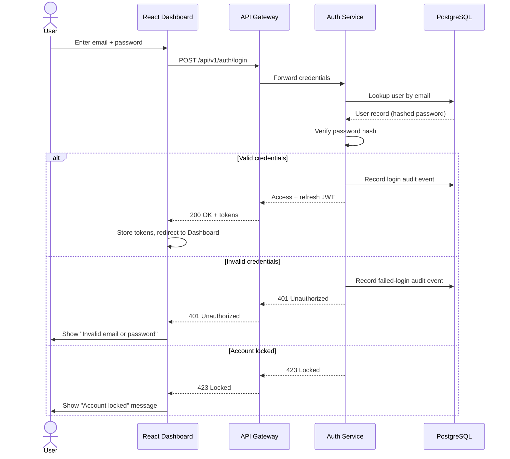

- **Steps:** credential submission → lookup → hash verification → token issuance or rejection → audit log write (FR-AUTH-07) → redirect.
- **Failure handling:** repeated failures trigger account lock (FR-AUTH-05); generic error message avoids revealing which field was incorrect (NFR-08-aligned).
- **Session refresh:** access token expiry triggers a silent refresh using the refresh token; refresh failure forces re-login (US-AUTH-02).
- **Delivery Phase:** Phase 1

## 6. Graph Construction Flow

**Trigger:** New/updated structured records land in PostgreSQL, or a document (invoice/PO) is uploaded.

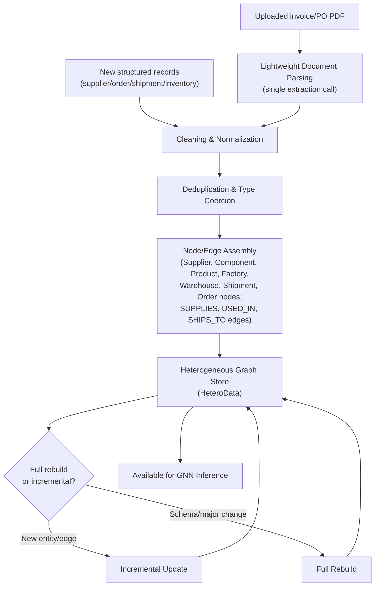

- **Steps:** ingest → clean/normalize → (if applicable) parse document → deduplicate → assemble typed nodes/edges → persist to graph store → mark available for inference.
- **Failure handling:** malformed records surface a data-quality warning (NFR-17) rather than silently corrupting the graph; the record is quarantined for review rather than dropped.
- **Delivery Phase:** Phase 1

## 7. Prediction Flow

**Trigger:** Dashboard requests risk scores (on load, on filter change, or on schedule).

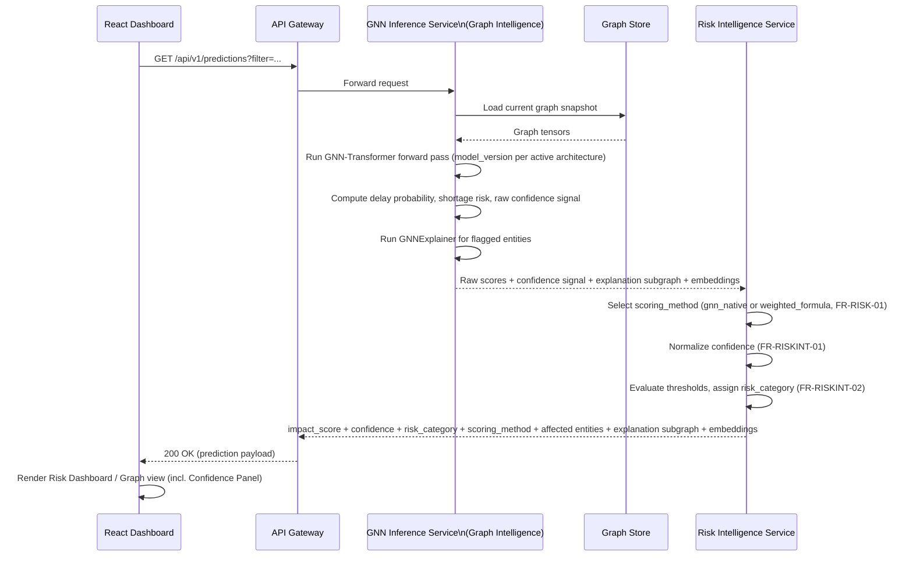

- **Steps:** request → load graph snapshot → forward pass (under the active `model_version`, per the architecture ablation, Section 18) → GNN produces raw delay/shortage/confidence-signal/explanation/embeddings → **Risk Intelligence Service** takes over: computes `impact_score` via the selected `scoring_method` (FR-RISK-01/02), normalizes confidence (FR-RISKINT-01), evaluates thresholds and assigns `risk_category` (FR-RISKINT-02) → identify affected products/orders (FR-GNN-04) → return embeddings for downstream reuse (FR-GNN-06).
- **Failure handling:** inference failure returns a retryable error consumed by the Risk Dashboard's error state (Document 3, Section 6.4).
- **Delivery Phase:** Phase 1

## 8. RAG Flow

**Trigger:** LLM Orchestration Service needs evidence for an explanation, or a chatbot query requires grounding.

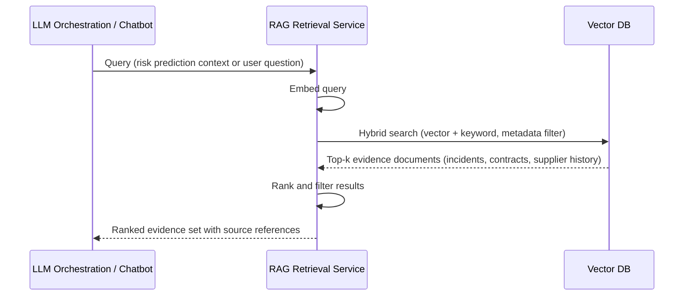

- **Steps:** embed query → hybrid vector+keyword search with metadata filters (FR-RAG-03) → rank → return evidence with source references for citation (FR-LLM-04).
- **Failure handling:** empty or low-confidence results are passed through as "no strong evidence found" rather than fabricated; LLM Orchestration must reflect this in the generated explanation.
- **Delivery Phase:** Phase 2

## 9. Chatbot Flow

**Trigger:** User submits a question in the Chatbot panel (Document 3, Section 6.11).

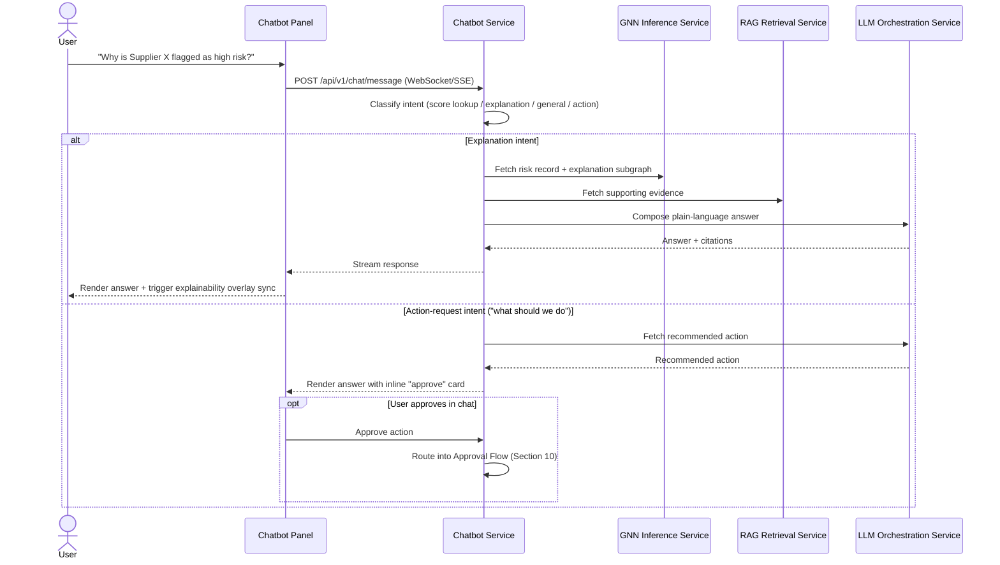

- **Steps:** intent classification (FR-CHAT-02) → retrieval (record + evidence) → LLM composition (FR-CHAT-03) → streamed response → optional in-chat approval routing (FR-CHAT-04) → session persistence (FR-CHAT-05).
- **Failure handling:** if RAG/LLM is unavailable, Chatbot Service returns a distinct "temporarily unavailable" response consumed by the Chatbot screen's error state.
- **Delivery Phase:** Phase 2

## 10. Approval Flow

**Trigger:** A recommended or optimized action is generated — always via the Decision Intelligence Flow (Section 21), which routes to either the Optimizer Flow (Section 19)/Customer Allocation Flow (Section 20) or the LLM explanation path — and requires human sign-off before execution (FR-MCP-03).

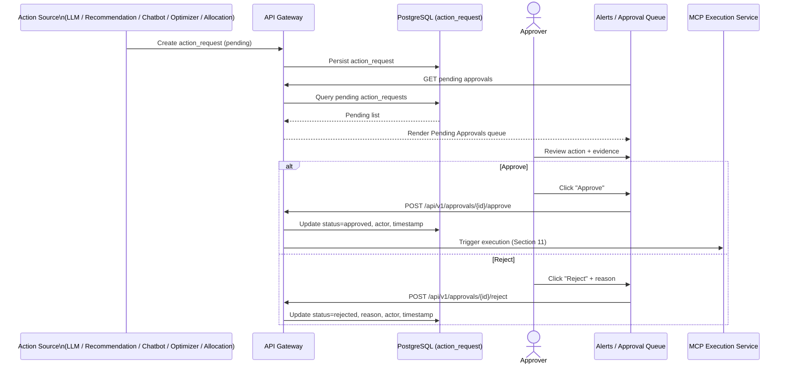

- **Steps:** action proposed → persisted as `pending` → surfaced in Alerts/Pending Approvals queue (Document 3, Section 6.14) → Approver reviews evidence → approve (triggers MCP Flow) or reject (requires reason, FR-MCP-04).
- **Failure handling:** no action reaches `approved` status without an explicit Approver identity and timestamp recorded (NFR-09); this is enforced at the database constraint level (Document 5).
- **Delivery Phase:** Phase 2

## 11. Alert Flow

**Trigger:** A risk score from the Prediction Flow crosses a configured threshold (FR-MCP-05).

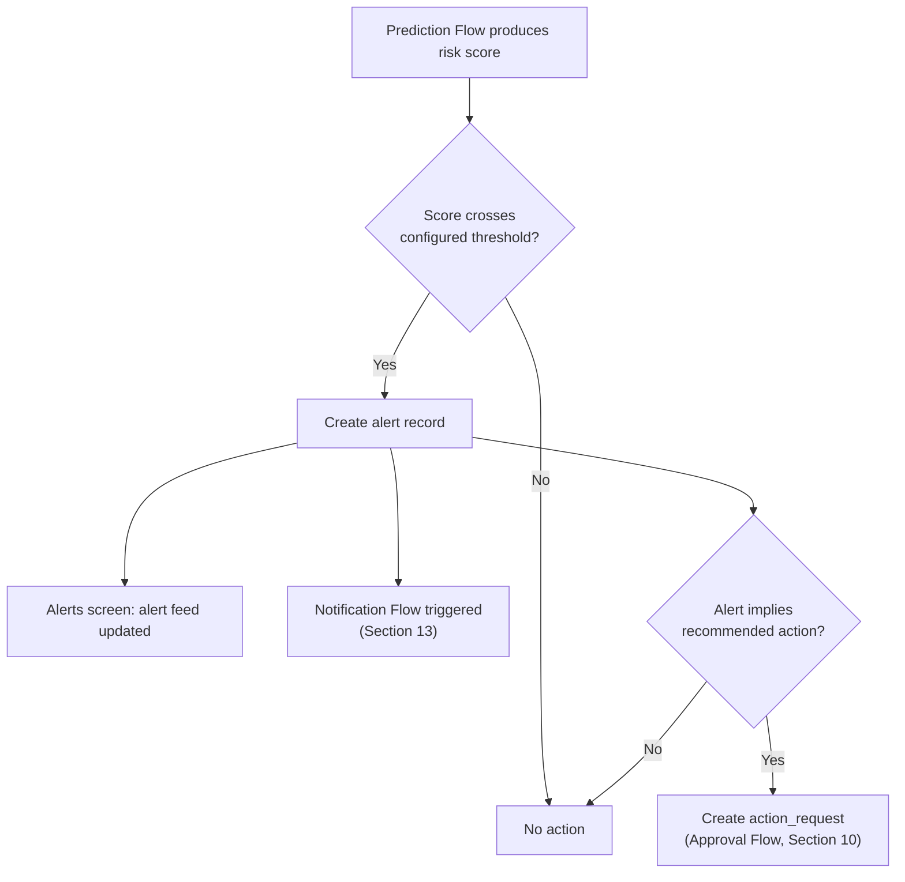

- **Steps:** every prediction run's scores are evaluated against Admin-configured thresholds (FR-MCP-06) → threshold breach creates an alert record → alert surfaces in the Alerts screen and triggers the Notification Flow → if the alert implies an action (e.g., a supplier's delay probability crossing critical), an action request is created and enters the Approval Flow.
- **Failure handling:** threshold evaluation failures are logged but do not block the underlying Prediction Flow from completing.
- **Delivery Phase:** Phase 2

## 12. MCP Flow

**Trigger:** An action request is approved (Approval Flow, Section 10).

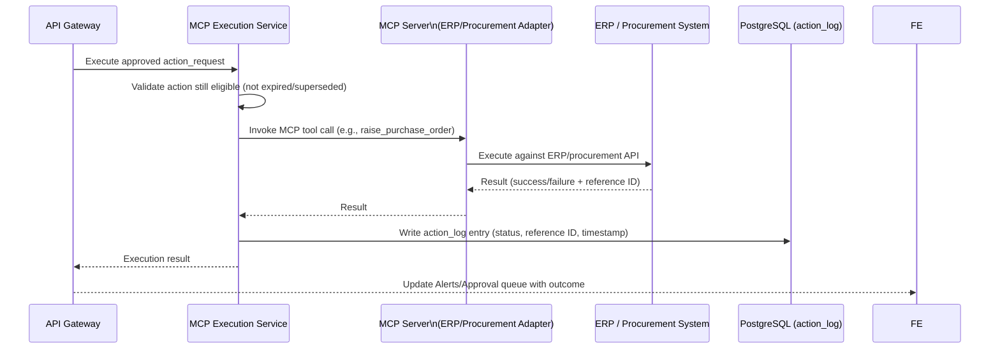

- **Steps:** validate the approval is still eligible → invoke the appropriate MCP server tool → ERP Flow executes (Section 13) → result logged (FR-MCP-02) → outcome surfaced back to the dashboard.
- **Failure handling:** ERP-side failure is captured as a failed `action_log` entry with reason; no retry is automatic — a failed action re-enters the queue for human review rather than silently retrying against a live business system.
- **Delivery Phase:** Phase 2

## 13. ERP Flow

**Trigger:** MCP Execution Service invokes an MCP server tool call targeting the ERP/procurement system (Section 12).

```mermaid
flowchart TD
    A["MCP Execution Service"] --> B["MCP Server\n(ERP/Procurement Adapter)"]
    B --> C{"Adapter target"}
    C -->|Sandbox/mock ERP\n(academic project default)| D["Sandbox ERP API"]
    C -->|Production-equivalent ERP\n(if available)| E["Real ERP/Procurement API"]
    D --> F["Result: PO raised / route updated"]
    E --> F
    F --> G["Result returned to MCP Execution Service"]
```

- **Steps:** the MCP server adapter translates a validated action (e.g., "raise PO with Supplier Y") into the target system's API calls; per Document 1's assumption (Section 12), this targets a sandbox/mock ERP for the academic project unless a production-equivalent system is made available.
- **Failure handling:** adapter-level errors (auth failure, invalid PO fields) are returned structured, not swallowed, so the MCP Flow's `action_log` entry captures a specific failure reason.
- **Delivery Phase:** Phase 2

## 14. Notification Flow

**Trigger:** Alert Flow (Section 11) creates an alert requiring stakeholder notification.

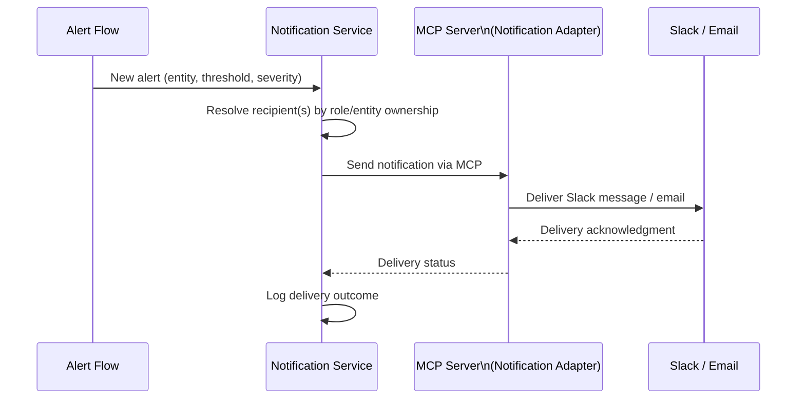

- **Steps:** resolve recipients → send via MCP-routed Slack/email adapter → log delivery outcome for audit/troubleshooting (Document 2, Section 10).
- **Failure handling:** delivery failure is logged and surfaced in the Alerts screen as "notification not delivered," without blocking the underlying alert/approval flow.
- **Delivery Phase:** Phase 2

## 15. Cross-Flow Summary

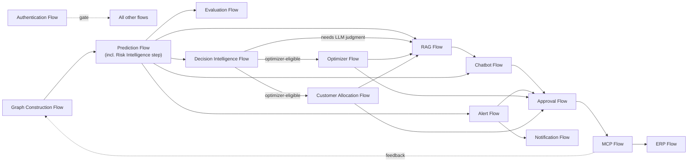

## 16. Risks

| ID | Risk | Mitigation | Delivery Phase |
|---|---|---|---|
| AF-01 | Chatbot and Alert flows both depend on Prediction Flow output; a slow inference run delays both | Prediction results are cached per graph snapshot rather than recomputed per request | Phase 2 |
| AF-02 | MCP/ERP Flow failure could leave an action_request stuck in an ambiguous state | Explicit terminal states (`approved`, `executed`, `failed`, `rejected`) enforced in schema (Document 5) | Phase 2 |
| AF-03 | Notification delivery failures could silently suppress an important alert | Delivery outcome logged and surfaced in-app (Section 14) so absence of a Slack/email is not the only signal | Phase 2 |
| AF-04 | Decision Intelligence Flow (Section 21) routes an ambiguous decision type incorrectly between the optimizer and LLM paths | Routing table is a closed, three-item list (FR-DEC-01); anything not clearly matching defaults to the LLM path, consistent with Document 1, Risk R-13 | Phase 2 |

## 17. Future Extension

Streaming/event-driven variants of the Graph Construction and Prediction flows (vs. today's request/incremental-update model) are noted as Future Scope per Document 1, Section 15, and would replace the trigger mechanism in Sections 6–7 without changing downstream flow steps.

## 18. Evaluation Flow

**Trigger:** A training run completes for any architecture in the ablation (GraphSAGE, GAT, or HGT).

```mermaid
sequenceDiagram
    participant TRAIN as Training Pipeline (Document 10 §8)
    participant EVAL as Evaluation Service
    participant PG as PostgreSQL (model_evaluation_runs)
    participant FE as Model Comparison Screen

    TRAIN->>TRAIN: Train architecture under this run's model_version
    TRAIN->>TRAIN: Compute metrics on held-out test set (Precision, Recall, F1, ROC-AUC; MAE/RMSE/MAPE if applicable)
    TRAIN->>EVAL: Submit metrics (model_version, architecture, metric_name, metric_value, dataset_split)
    EVAL->>PG: Insert model_evaluation_runs row(s) (append-only)
    FE->>EVAL: GET /api/v1/models/comparison
    EVAL->>PG: Query latest test-split metrics per architecture
    PG-->>EVAL: Rows
    EVAL-->>FE: Side-by-side architecture comparison (FR-ABL-02)
```

- **Steps:** training run completes → metrics computed on the held-out split → persisted as one row per (`model_version`, `metric_name`, `dataset_split`) (FR-EVAL-01) → Model Comparison screen queries the comparison endpoint to justify the final architecture choice (FR-ABL-02).
- **Failure handling:** a failed metric submission does not block the training pipeline from completing; the run is flagged incomplete in the Model Comparison view rather than silently missing.
- **Delivery Phase:** Phase 1

## 19. Optimizer Flow

**Trigger:** The Decision Intelligence Flow (Section 21) determines a flagged entity's response is safety-stock or PO-splitting (FR-DEC-01) and invokes this flow with an assembled constraint set; the Recommendation screen (Document 3, Section 6.13) then renders the result. This flow is never triggered directly by free-text LLM output.

```mermaid
sequenceDiagram
    participant DECISION as Decision Intelligence Service
    participant GW as API Gateway
    participant OPT as Optimization Service
    participant PG as PostgreSQL (inventory, shipments, orders)
    participant FE as Recommendation Screen

    DECISION->>GW: POST /api/v1/optimize/safety-stock or /po-split (constraint_set)
    GW->>OPT: Forward request
    OPT->>PG: Load inventory, lead-time, demand constraints (as assembled by Decision Intelligence)
    OPT->>OPT: Run OR-Tools constraint solver
    alt Optimal solution found
        OPT-->>GW: { optimal: true, recommendation, objective_value, rationale }
        GW-->>DECISION: Optimal decision
        DECISION->>DECISION: Record decision_trace (FR-DEC-03), route to Approval Flow
        GW-->>FE: Render decision with optimal badge
    else No feasible solution
        OPT-->>GW: { optimal: false, reason }
        GW-->>FE: Render "no feasible decision" state (NFR-20)
    end
```

- **Steps:** Decision Intelligence assembles the constraint set and invokes this flow → solve (FR-OPT-01) → if optimal, surface for approval, tagged `source='optimizer'` with a populated `decision_trace` (FR-OPT-02, FR-DEC-03); if infeasible, surface explicitly rather than forcing a recommendation (NFR-20).
- **Failure handling:** an infeasible result is a valid, expected outcome (not an error) and is rendered as a distinct UI state, not conflated with a service failure.
- **Delivery Phase:** Phase 2

## 20. Customer Allocation Flow

**Trigger:** A product is flagged as shortage-risk (Prediction Flow, Section 7) with multiple open orders competing for insufficient stock; the Decision Intelligence Flow (Section 21) routes this to the Optimization Service as one of its three closed-form decision types (FR-DEC-01).

```mermaid
sequenceDiagram
    actor N as Neha (Customer Operations Manager)
    participant FE as Allocation Screen
    participant GW as API Gateway
    participant CUST as Customer Service
    participant DECISION as Decision Intelligence Service
    participant OPT as Optimization Service
    participant PG as PostgreSQL (customers, orders, inventory, suppliers, warehouses, factories)

    FE->>GW: GET /api/v1/customers/allocations/{product_id}
    GW->>CUST: Fetch competing open orders + customer priority/contract data
    CUST->>PG: Load orders, customers
    PG-->>CUST: Order/customer data
    CUST-->>GW: Order/customer inputs
    GW->>DECISION: Assemble constraint set for this product
    DECISION->>PG: Load inventory, supplier/warehouse/factory capacity, lead time
    PG-->>DECISION: Constraint values
    DECISION->>OPT: POST /api/v1/optimize/customer-allocation (constraint_set)
    OPT->>OPT: Maximize protected customer value (priority tier, SLA compliance,\norder value, penalty avoidance) subject to inventory/capacity/lead-time constraints
    OPT-->>DECISION: Optimal allocation + objective_value
    DECISION->>DECISION: Record decision_trace (FR-DEC-03)
    DECISION-->>GW: Allocation decision
    GW-->>FE: Render ranked table with proposed quantities + objective value
    N->>FE: Review, optionally adjust quantities (US-CUST-02)
    N->>FE: Approve allocation
    FE->>GW: Create action_request (entity_type='order', source='optimizer', action_payload + decision_trace)
    GW->>GW: Route into Approval Flow (Section 10)
```

- **Steps:** shortage flag on a product → Customer Service supplies competing orders + customer priority/contract data → Decision Intelligence assembles the constraint set (inventory, supplier/warehouse/production capacity, lead time) → Optimization Service solves the allocation as a constrained maximization problem (FR-CUST-02) → proposed optimal split surfaced for review → Neha may adjust before approving (US-CUST-02) → approved allocation is created as an `action_requests` row with the objective/constraint values and decision trace recorded for rationale (US-CUST-03) → routes into the standard Approval Flow.
- **Failure handling:** if priority/contract data is missing for a competing customer, the constraint set falls back to a documented default (e.g., FIFO by order date, NFR-21) rather than failing the whole allocation.
- **Delivery Phase:** Phase 2

## 21. Decision Intelligence Flow

**Trigger:** A risk-intelligence record (Prediction Flow, Section 7) for a flagged entity needs a response, and no response yet exists.

```mermaid
sequenceDiagram
    participant RISKINT as Risk Intelligence Service
    participant DECISION as Decision Intelligence Service
    participant OPT as Optimization Service
    participant LLM as LLM Orchestration Service
    participant PG as PostgreSQL (action_requests)

    RISKINT->>DECISION: Risk-intelligence record (impact_score, confidence, risk_category)
    DECISION->>DECISION: Is this a closed-form decision type?\n(safety-stock, PO-split, customer allocation — FR-DEC-01)
    alt Closed-form decision type
        DECISION->>OPT: Assembled constraint set (Optimizer Flow §19 / Allocation Flow §20)
        OPT-->>DECISION: Optimal decision
        DECISION->>LLM: Explain this decision in plain language
    else Not closed-form
        DECISION->>LLM: Generate qualitative recommendation (FR-LLM-02)
    end
    LLM-->>DECISION: Plain-language explanation (+ recommendation, if qualitative)
    DECISION->>DECISION: Validate against business rules/policy (FR-DEC-02)
    DECISION->>DECISION: Compose decision_trace (FR-DEC-03)
    DECISION->>PG: Create action_request (decision_trace populated)
    DECISION->>DECISION: Route into Approval Flow (Section 10)
```

- **Steps:** risk-intelligence record arrives → Decision Intelligence checks it against the closed, three-item routing table (FR-DEC-01) → routes to Optimization (Sections 19–20) or directly to the LLM for a qualitative recommendation → LLM always explains the outcome, regardless of path, but never computes it for the optimizer-routed case (FR-OPT-03) → every candidate is validated against business rules/policy before proceeding (FR-DEC-02) → a decision trace is composed recording which layers contributed (FR-DEC-03) → the resulting `action_requests` row enters the standard Approval Flow.
- **Failure handling:** an ambiguous decision type that doesn't clearly match one of the three closed-form types defaults to the LLM path rather than being forced into the optimizer (Document 1, Risk R-13); a missing `decision_trace` blocks the row from being marked ready for approval (NFR-23).
- **Delivery Phase:** Phase 2

## 22. SPOF Analysis Flow

**Trigger:** Scheduled batch job (or on-demand refresh from the Analytics screen, Document 3 Section 6.22).

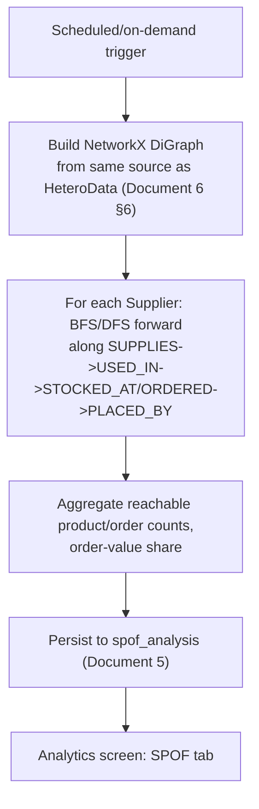

- **Steps:** trigger → build traversal graph from the same structured source Graph Construction uses → per-supplier reachability computation (no ML) → aggregate and persist → surface on the Analytics screen (FR-SPOF-01/02).
- **Failure handling:** a failed traversal run leaves the prior `spof_analysis` snapshot visible with a "stale as of" indicator, rather than blanking the tab.
- **Delivery Phase:** Phase 1

## 23. Supplier Segmentation Flow

**Trigger:** Scheduled batch job, run after any new model becomes `active` (Document 5, Section 6.25) so segmentation reflects current embeddings.

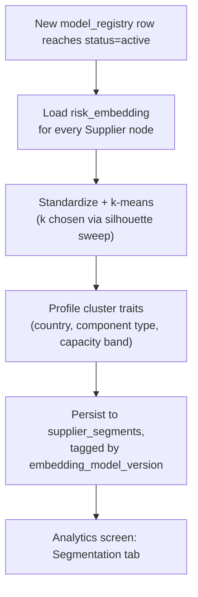

- **Steps:** new active model → load embeddings only, no re-inference → cluster → qualitative trait profiling → persist tagged by `embedding_model_version` → surface on the Analytics screen (FR-SEG-01/02).
- **Failure handling:** clustering failure (e.g., degenerate embedding set) leaves the prior segmentation visible rather than an empty tab; logged for review.
- **Delivery Phase:** Phase 1

## 24. What-If Simulator Flow

**Trigger:** User selects an entity and perturbs a feature on the What-if Simulator screen (Document 3, Section 6.12). *(This flow was previously undocumented — Document 3's screen spec and Document 1's FR-SIM-01–04 existed without a corresponding Document 4 flow; added here to close that gap, not as new scope from this merge.)*

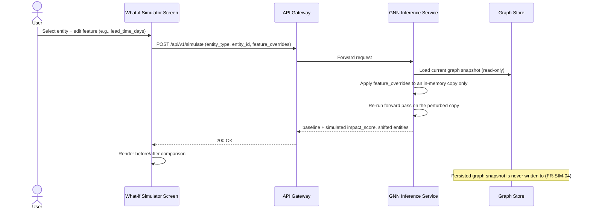

- **Steps:** select entity → edit feature within validated bounds (FR-SIM-01) → re-run inference on a temporary in-memory copy, no retraining (FR-SIM-02) → return baseline vs. simulated scores and shifted downstream entities (FR-SIM-03) → discard the copy at session end, persisted graph unchanged (FR-SIM-04).
- **Failure handling:** an out-of-range feature value is rejected client-side and server-side (`422 VALIDATION_ERROR`, Document 9 Section 11.1) before any re-scoring is attempted.
- **Delivery Phase:** Phase 2

## 25. Alternative-Supplier Recommender Flow

**Trigger:** User requests alternatives for a flagged supplier from the Supplier detail screen or Recommendation screen (Document 3, Sections 6.5, 6.13). *(Previously undocumented — Document 3's screen spec and Document 1's FR-REC-01–04 existed without a corresponding Document 4 flow; added here to close that gap, not as new scope from this merge.)*

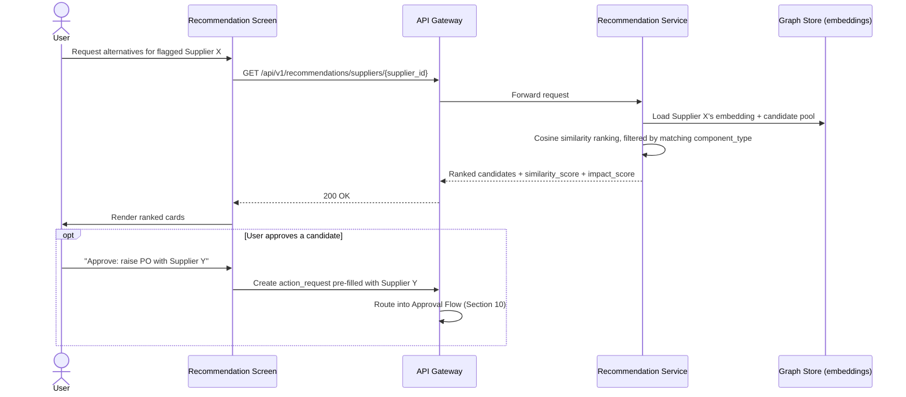

- **Steps:** request alternatives → load Supplier X's embedding (no re-inference, reuses Layer 2's existing output, FR-GNN-06) → rank candidates by cosine similarity, filtered by component-type match (FR-REC-01/02) → return similarity score and risk comparison (FR-REC-03) → optional one-step approval pre-filled with the recommended supplier (FR-REC-04), routing into the standard Approval Flow.
- **Failure handling:** no candidate matches the required component type → `404 NOT_FOUND` / `422 VALIDATION_ERROR` (Document 9, Section 12.1), rendered as the Recommendation screen's "no suitable alternatives found" empty state (Document 3, Section 6.13).
- **Delivery Phase:** Phase 2

---

## Document Control

- **Purpose:** Section 1. **Scope:** Section 2. **Assumptions:** Section 3. **Dependencies:** Section 4. **Risks:** Section 16. **Future Extension:** Section 17. **Evaluation Flow:** Section 18. **Optimizer Flow:** Section 19. **Customer Allocation Flow:** Section 20. **Decision Intelligence Flow:** Section 21. **SPOF Analysis Flow:** Section 22. **Supplier Segmentation Flow:** Section 23. **What-If Simulator Flow:** Section 24. **Alternative-Supplier Recommender Flow:** Section 25.
- Baseline for Document 8 (Backend Design) and Document 9 (REST API Documentation).
