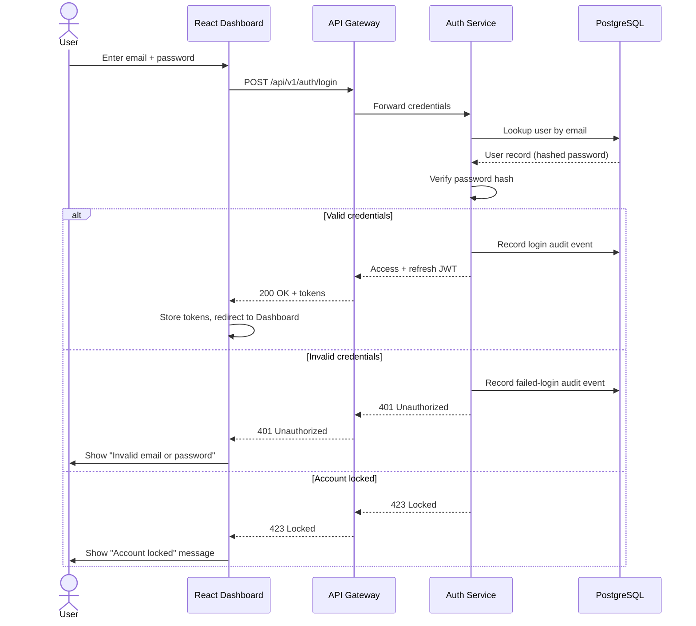
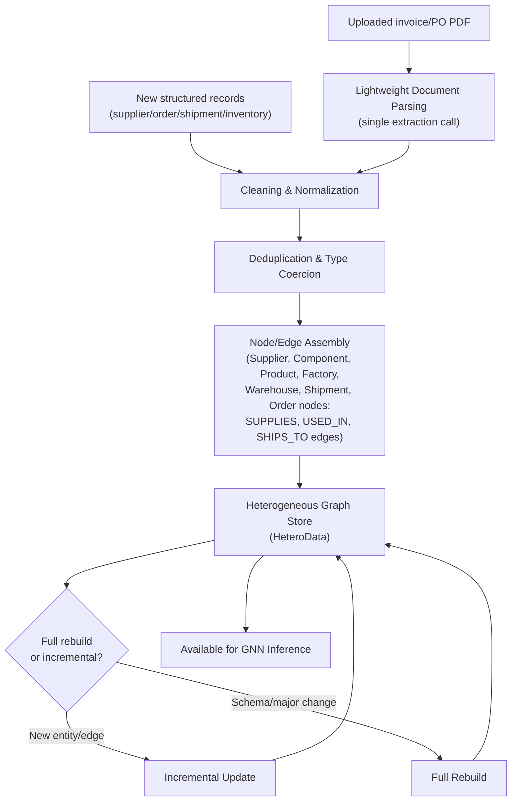
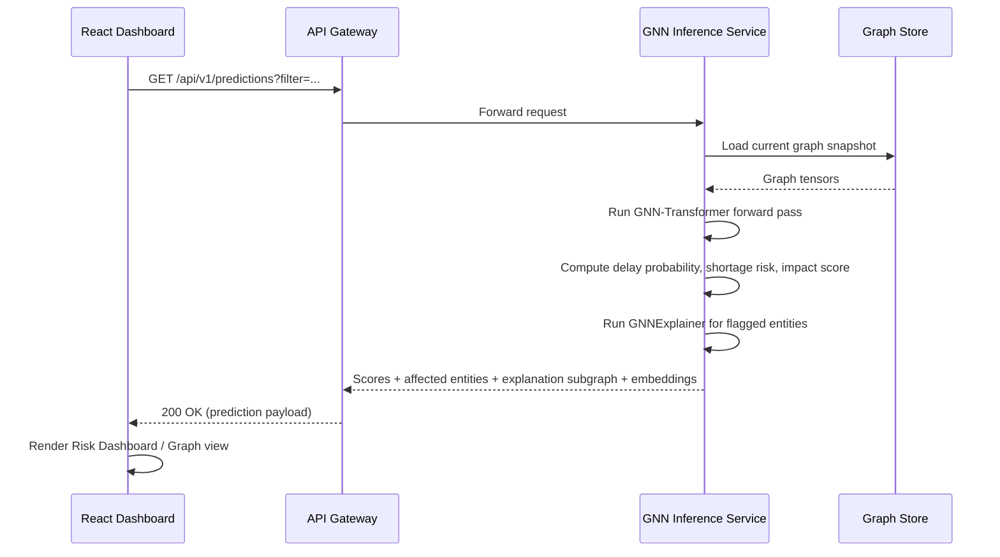
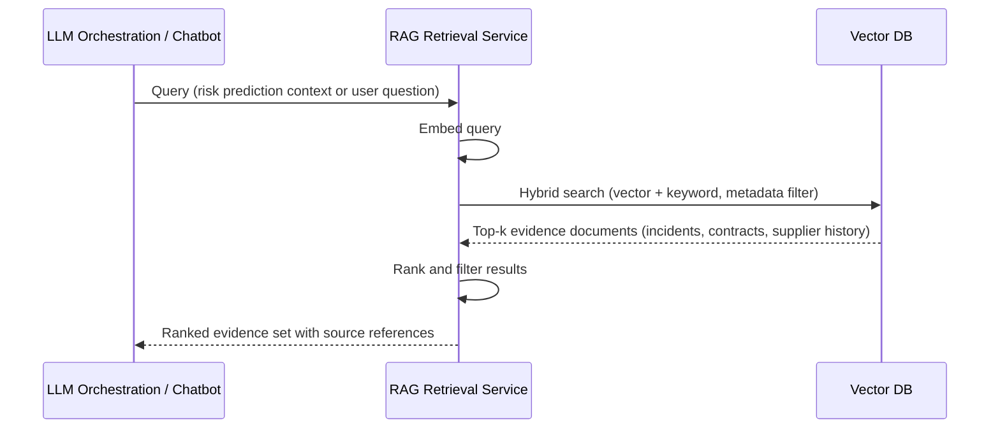
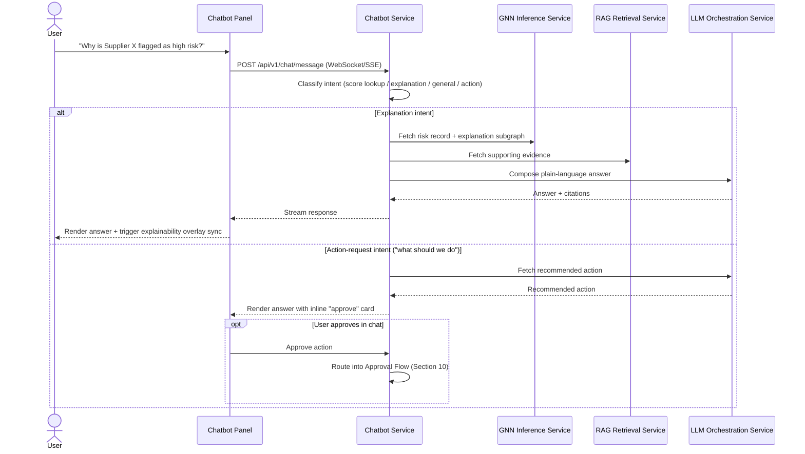
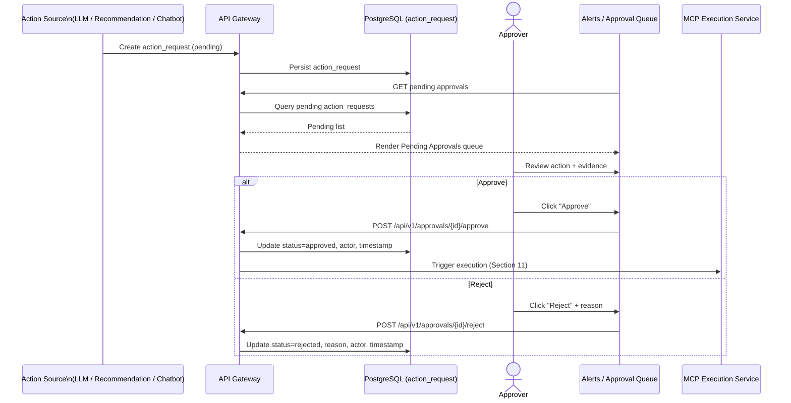
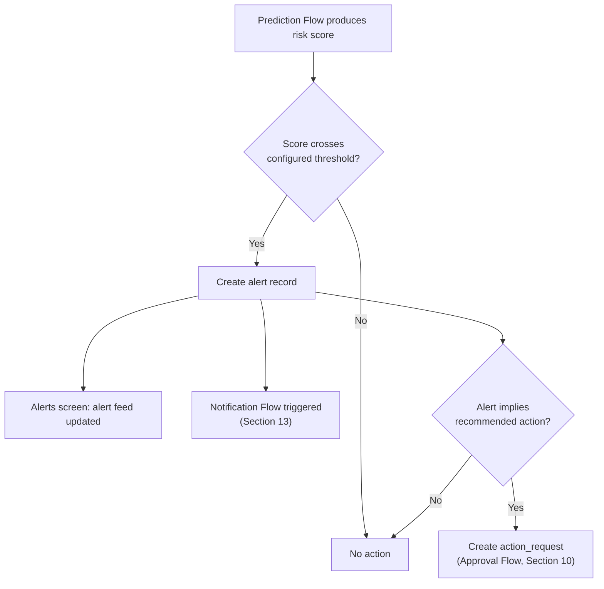
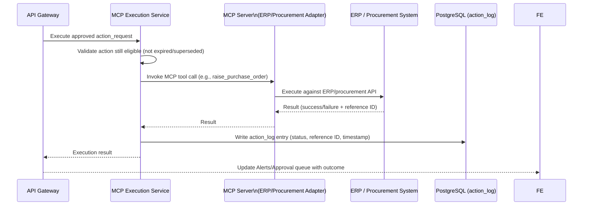
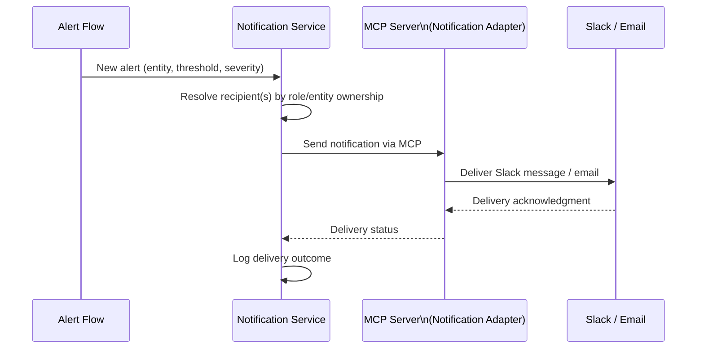
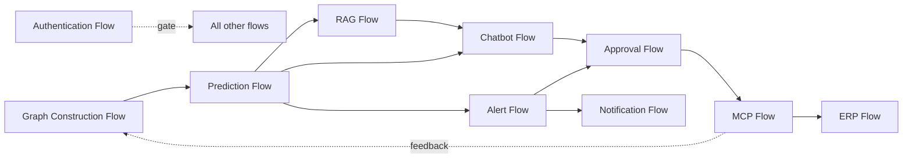

# Document 4 — Application Flow

## Graph Neural Network and Generative AI-Based Supply Chain Risk Prediction System

Version: 1.0
Status: Baseline
Consistent with: Documents 1–3

---

## 1. Purpose

This document specifies the end-to-end operational flows that tie the components defined in Document 2 to the screens defined in Document 3: Authentication, Graph Construction, Prediction, RAG, Chatbot, Approval, Alert, MCP, ERP, and Notification flows. Each flow is expressed as a sequence or flowchart diagram plus a description of triggers, steps, and failure handling.

## 2. Scope

Ten flows, tagged by Delivery Phase:

| Flow | Delivery Phase |
|---|---|
| Authentication Flow | Phase 1 |
| Graph Construction Flow | Phase 1 |
| Prediction Flow | Phase 1 |
| RAG Flow | Phase 2 |
| Chatbot Flow | Phase 2 |
| Approval Flow | Phase 2 |
| Alert Flow | Phase 2 |
| MCP Flow | Phase 2 |
| ERP Flow | Phase 2 |
| Notification Flow | Phase 2 |

## 3. Assumptions

- Flows assume the architecture and components defined in Document 2, Section 3–4.
- Flows assume the screens defined in Document 3.
- Phase 2 flows (RAG, Chatbot, Approval, Alert, MCP, ERP, Notification) are designed now so Phase 1 services expose the extension points they need (e.g., the GNN Inference Service already returns embeddings and explanation subgraphs in Phase 1, ready for Phase 2 consumption), without requiring Phase 1 rework.

## 4. Dependencies

Document 2 (components, communication protocols), Document 3 (screens), Document 5/6/7 (data stores referenced in flows), Document 9 (exact API contracts).

## 5. Authentication Flow

**Trigger:** User submits credentials on the Login screen (Document 3, Section 6.1).



- **Steps:** credential submission → lookup → hash verification → token issuance or rejection → audit log write (FR-AUTH-07) → redirect.
- **Failure handling:** repeated failures trigger account lock (FR-AUTH-05); generic error message avoids revealing which field was incorrect (NFR-08-aligned).
- **Session refresh:** access token expiry triggers a silent refresh using the refresh token; refresh failure forces re-login (US-AUTH-02).
- **Delivery Phase:** Phase 1

## 6. Graph Construction Flow

**Trigger:** New/updated structured records land in PostgreSQL, or a document (invoice/PO) is uploaded.



- **Steps:** ingest → clean/normalize → (if applicable) parse document → deduplicate → assemble typed nodes/edges → persist to graph store → mark available for inference.
- **Failure handling:** malformed records surface a data-quality warning (NFR-17) rather than silently corrupting the graph; the record is quarantined for review rather than dropped.
- **Delivery Phase:** Phase 1

## 7. Prediction Flow

**Trigger:** Dashboard requests risk scores (on load, on filter change, or on schedule).



- **Steps:** request → load graph snapshot → forward pass → derive delay/shortage/impact scores → identify affected products/orders (FR-GNN-04) → generate explanation subgraph (FR-GNN-05) → return embeddings for downstream reuse (FR-GNN-06).
- **Failure handling:** inference failure returns a retryable error consumed by the Risk Dashboard's error state (Document 3, Section 6.4).
- **Delivery Phase:** Phase 1

## 8. RAG Flow

**Trigger:** LLM Orchestration Service needs evidence for an explanation, or a chatbot query requires grounding.



- **Steps:** embed query → hybrid vector+keyword search with metadata filters (FR-RAG-03) → rank → return evidence with source references for citation (FR-LLM-04).
- **Failure handling:** empty or low-confidence results are passed through as "no strong evidence found" rather than fabricated; LLM Orchestration must reflect this in the generated explanation.
- **Delivery Phase:** Phase 2

## 9. Chatbot Flow

**Trigger:** User submits a question in the Chatbot panel (Document 3, Section 6.11).



- **Steps:** intent classification (FR-CHAT-02) → retrieval (record + evidence) → LLM composition (FR-CHAT-03) → streamed response → optional in-chat approval routing (FR-CHAT-04) → session persistence (FR-CHAT-05).
- **Failure handling:** if RAG/LLM is unavailable, Chatbot Service returns a distinct "temporarily unavailable" response consumed by the Chatbot screen's error state.
- **Delivery Phase:** Phase 2

## 10. Approval Flow

**Trigger:** A recommended action is generated (from LLM explanation, Recommendation screen, or Chatbot) and requires human sign-off before execution (FR-MCP-03).



- **Steps:** action proposed → persisted as `pending` → surfaced in Alerts/Pending Approvals queue (Document 3, Section 6.14) → Approver reviews evidence → approve (triggers MCP Flow) or reject (requires reason, FR-MCP-04).
- **Failure handling:** no action reaches `approved` status without an explicit Approver identity and timestamp recorded (NFR-09); this is enforced at the database constraint level (Document 5).
- **Delivery Phase:** Phase 2

## 11. Alert Flow

**Trigger:** A risk score from the Prediction Flow crosses a configured threshold (FR-MCP-05).



- **Steps:** every prediction run's scores are evaluated against Admin-configured thresholds (FR-MCP-06) → threshold breach creates an alert record → alert surfaces in the Alerts screen and triggers the Notification Flow → if the alert implies an action (e.g., a supplier's delay probability crossing critical), an action request is created and enters the Approval Flow.
- **Failure handling:** threshold evaluation failures are logged but do not block the underlying Prediction Flow from completing.
- **Delivery Phase:** Phase 2

## 12. MCP Flow

**Trigger:** An action request is approved (Approval Flow, Section 10).



- **Steps:** validate the approval is still eligible → invoke the appropriate MCP server tool → ERP Flow executes (Section 13) → result logged (FR-MCP-02) → outcome surfaced back to the dashboard.
- **Failure handling:** ERP-side failure is captured as a failed `action_log` entry with reason; no retry is automatic — a failed action re-enters the queue for human review rather than silently retrying against a live business system.
- **Delivery Phase:** Phase 2

## 13. ERP Flow

**Trigger:** MCP Execution Service invokes an MCP server tool call targeting the ERP/procurement system (Section 12).

```mermaid
flowchart TD
    A["MCP Execution Service"] --> B["MCP Server\n(ERP/Procurement Adapter)"]
    B --> C{"Adapter target"}
    C -->|Sandbox/mock ERP\n(academic project default)| D["Sandbox ERP API"]
    C -->|Production-equivalent ERP\n(if available)| E["Real ERP/Procurement API"]
    D --> F["Result: PO raised / route updated"]
    E --> F
    F --> G["Result returned to MCP Execution Service"]
```

- **Steps:** the MCP server adapter translates a validated action (e.g., "raise PO with Supplier Y") into the target system's API calls; per Document 1's assumption (Section 12), this targets a sandbox/mock ERP for the academic project unless a production-equivalent system is made available.
- **Failure handling:** adapter-level errors (auth failure, invalid PO fields) are returned structured, not swallowed, so the MCP Flow's `action_log` entry captures a specific failure reason.
- **Delivery Phase:** Phase 2

## 14. Notification Flow

**Trigger:** Alert Flow (Section 11) creates an alert requiring stakeholder notification.



- **Steps:** resolve recipients → send via MCP-routed Slack/email adapter → log delivery outcome for audit/troubleshooting (Document 2, Section 10).
- **Failure handling:** delivery failure is logged and surfaced in the Alerts screen as "notification not delivered," without blocking the underlying alert/approval flow.
- **Delivery Phase:** Phase 2

## 15. Cross-Flow Summary



## 16. Risks

| ID | Risk | Mitigation | Delivery Phase |
|---|---|---|---|
| AF-01 | Chatbot and Alert flows both depend on Prediction Flow output; a slow inference run delays both | Prediction results are cached per graph snapshot rather than recomputed per request | Phase 2 |
| AF-02 | MCP/ERP Flow failure could leave an action_request stuck in an ambiguous state | Explicit terminal states (`approved`, `executed`, `failed`, `rejected`) enforced in schema (Document 5) | Phase 2 |
| AF-03 | Notification delivery failures could silently suppress an important alert | Delivery outcome logged and surfaced in-app (Section 14) so absence of a Slack/email is not the only signal | Phase 2 |

## 17. Future Extension

Streaming/event-driven variants of the Graph Construction and Prediction flows (vs. today's request/incremental-update model) are noted as Future Scope per Document 1, Section 15, and would replace the trigger mechanism in Sections 6–7 without changing downstream flow steps.

---

## Document Control

- **Purpose:** Section 1. **Scope:** Section 2. **Assumptions:** Section 3. **Dependencies:** Section 4. **Risks:** Section 16. **Future Extension:** Section 17.
- Baseline for Document 8 (Backend Design) and Document 9 (REST API Documentation).
