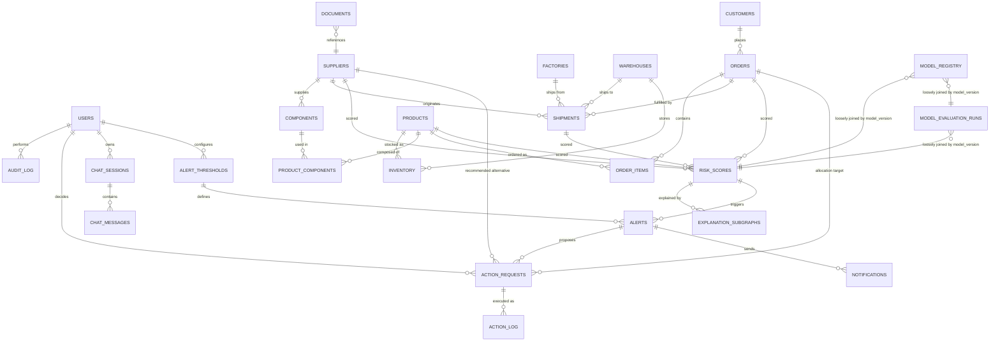

# Document 5 — Database Design

## Graph Neural Network and Generative AI-Based Supply Chain Risk Prediction System

Version: 1.0
Status: Baseline
Consistent with: Documents 1–4

---

## 1. Purpose

This document defines the complete PostgreSQL schema backing the system: every table's purpose, columns, datatypes, constraints, indexes, relationships, and audit behavior, plus the full entity-relationship diagram. It is the schema that the Backend Design (Document 8) and REST API Documentation (Document 9) must implement against.

## 2. Scope

PostgreSQL is the system of record for structured supply chain entities (Section 8.2, Document 1), authentication/authorization, risk-score history, and — in Phase 2 — approvals, executed actions, chat sessions, alerts, and notifications. The heterogeneous graph *representation* used for GNN training/inference is covered in Document 6; the vector store for RAG evidence is covered in Document 7. This document covers only the relational schema.

## 3. Assumptions

- PostgreSQL 15+ is used, enabling native `gen_random_uuid()`, `JSONB`, and partial indexes.
- All primary keys are UUIDs (`gen_random_uuid()`) to avoid exposing sequential IDs and to simplify future multi-source data merges.
- `created_at`/`updated_at` timestamps are present on every table for auditability, in addition to the dedicated `audit_log` table for security-relevant events.
- Soft deletion is not used; entities are deactivated (e.g., `is_active`) rather than deleted, to preserve graph and audit history.

## 4. Dependencies

Document 2 (PostgreSQL as the chosen relational store), Document 6 (graph store consumes these tables as its source), Document 8 (repository layer implements against this schema), Document 9 (API request/response shapes map to these tables).

## 5. Entity-Relationship Diagram

## 6. Table Specifications

Format per table: Purpose, Columns/Datatype/Constraints, Indexes, Relationships, Audit, Delivery Phase.

### 6.1 `users`

**Purpose:** Authenticated principals and their RBAC role (FR-AUTH-01–06).

| Column | Datatype | Constraints |
|---|---|---|
| id | UUID | PK, default `gen_random_uuid()` |
| email | VARCHAR(255) | NOT NULL, UNIQUE |
| password_hash | VARCHAR(255) | NOT NULL |
| full_name | VARCHAR(255) | NOT NULL |
| role | user_role ENUM(`admin`,`analyst`,`approver`) | NOT NULL, default `analyst` |
| is_active | BOOLEAN | NOT NULL, default `true` |
| failed_login_attempts | INTEGER | NOT NULL, default `0` |
| locked_until | TIMESTAMPTZ | NULL |
| last_login_at | TIMESTAMPTZ | NULL |
| created_at | TIMESTAMPTZ | NOT NULL, default `now()` |
| updated_at | TIMESTAMPTZ | NOT NULL, default `now()` |

- **Indexes:** UNIQUE index on `email`; index on `role` for admin filtering.
- **Relationships:** referenced by `audit_log.actor_id`, `action_requests.decided_by`, `chat_sessions.user_id`, `alert_thresholds.configured_by`.
- **Audit:** every login/logout/lock event recorded in `audit_log`, not on this table directly.
- **Delivery Phase:** Phase 1

### 6.2 `suppliers`

**Purpose:** Supplier master data — a core graph node type (FR-GC-02).

| Column | Datatype | Constraints |
|---|---|---|
| id | UUID | PK, default `gen_random_uuid()` |
| name | VARCHAR(255) | NOT NULL |
| country | VARCHAR(100) | NULL |
| capacity_score | NUMERIC(6,2) | NULL |
| lead_time_days | INTEGER | NOT NULL, default `0`, CHECK (`lead_time_days >= 0`) |
| reliability_history | NUMERIC(5,4) | NULL, CHECK (0 <= reliability_history <= 1) |
| is_active | BOOLEAN | NOT NULL, default `true` |
| created_at | TIMESTAMPTZ | NOT NULL, default `now()` |
| updated_at | TIMESTAMPTZ | NOT NULL, default `now()` |

- **Indexes:** index on `name`; index on `is_active`.
- **Relationships:** parent of `components.supplier_id`, `shipments.supplier_id`; referenced by `risk_scores` (entity_type='supplier'), `action_requests.recommended_supplier_id`.
- **Audit:** row-level changes captured via `updated_at`; material changes (e.g., deactivation) also written to `audit_log`.
- **Delivery Phase:** Phase 1

### 6.3 `components`

**Purpose:** Component/part master data supplied by suppliers, used in products.

| Column | Datatype | Constraints |
|---|---|---|
| id | UUID | PK, default `gen_random_uuid()` |
| supplier_id | UUID | NOT NULL, FK → `suppliers(id)` |
| name | VARCHAR(255) | NOT NULL |
| component_type | VARCHAR(100) | NOT NULL |
| unit_cost | NUMERIC(12,2) | NULL |
| created_at | TIMESTAMPTZ | NOT NULL, default `now()` |
| updated_at | TIMESTAMPTZ | NOT NULL, default `now()` |

- **Indexes:** index on `supplier_id`; index on `component_type` (used by Recommender's component-type filter, FR-REC-02).
- **Relationships:** child of `suppliers`; parent of `product_components.component_id`.
- **Audit:** `updated_at` tracked; deletions disallowed (deactivate via a linked supplier instead).
- **Delivery Phase:** Phase 1

### 6.4 `products`

**Purpose:** Finished-product master data — a core graph node type.

| Column | Datatype | Constraints |
|---|---|---|
| id | UUID | PK, default `gen_random_uuid()` |
| sku | VARCHAR(100) | NOT NULL, UNIQUE |
| name | VARCHAR(255) | NOT NULL |
| category | VARCHAR(100) | NULL |
| is_active | BOOLEAN | NOT NULL, default `true` |
| created_at | TIMESTAMPTZ | NOT NULL, default `now()` |
| updated_at | TIMESTAMPTZ | NOT NULL, default `now()` |

- **Indexes:** UNIQUE index on `sku`; index on `category`.
- **Relationships:** parent of `product_components.product_id`, `inventory.product_id`, `order_items.product_id`; referenced by `risk_scores` (entity_type='product').
- **Audit:** `updated_at` tracked.
- **Delivery Phase:** Phase 1

### 6.5 `product_components` (junction)

**Purpose:** Bill-of-materials — many-to-many between products and components (Layer 1 `USED_IN` edge).

| Column | Datatype | Constraints |
|---|---|---|
| id | UUID | PK, default `gen_random_uuid()` |
| product_id | UUID | NOT NULL, FK → `products(id)` |
| component_id | UUID | NOT NULL, FK → `components(id)` |
| quantity_required | INTEGER | NOT NULL, default `1`, CHECK (`quantity_required > 0`) |

- **Indexes:** UNIQUE composite index on (`product_id`, `component_id`); index on `component_id`.
- **Relationships:** links `products` and `components`; source of the `USED_IN` graph edge (Document 6).
- **Audit:** structural table; changes tracked via row insert/delete only.
- **Delivery Phase:** Phase 1

### 6.6 `factories`

**Purpose:** Manufacturing site master data — a core graph node type.

| Column | Datatype | Constraints |
|---|---|---|
| id | UUID | PK, default `gen_random_uuid()` |
| name | VARCHAR(255) | NOT NULL |
| location | VARCHAR(255) | NULL |
| capacity_units_per_day | INTEGER | NULL |
| is_active | BOOLEAN | NOT NULL, default `true` |
| created_at | TIMESTAMPTZ | NOT NULL, default `now()` |
| updated_at | TIMESTAMPTZ | NOT NULL, default `now()` |

- **Indexes:** index on `location`.
- **Relationships:** referenced by `shipments.factory_id`.
- **Audit:** `updated_at` tracked.
- **Delivery Phase:** Phase 1

### 6.7 `warehouses`

**Purpose:** Warehouse master data — a core graph node type.

| Column | Datatype | Constraints |
|---|---|---|
| id | UUID | PK, default `gen_random_uuid()` |
| name | VARCHAR(255) | NOT NULL |
| location | VARCHAR(255) | NULL |
| capacity_units | INTEGER | NULL |
| is_active | BOOLEAN | NOT NULL, default `true` |
| created_at | TIMESTAMPTZ | NOT NULL, default `now()` |
| updated_at | TIMESTAMPTZ | NOT NULL, default `now()` |

- **Indexes:** index on `location`.
- **Relationships:** parent of `inventory.warehouse_id`; referenced by `shipments.warehouse_id`.
- **Audit:** `updated_at` tracked.
- **Delivery Phase:** Phase 1

### 6.8 `inventory`

**Purpose:** Stock level per product/warehouse — drives shortage-risk prediction (FR-GNN-02).

| Column | Datatype | Constraints |
|---|---|---|
| id | UUID | PK, default `gen_random_uuid()` |
| product_id | UUID | NOT NULL, FK → `products(id)` |
| warehouse_id | UUID | NOT NULL, FK → `warehouses(id)` |
| stock_level | INTEGER | NOT NULL, default `0`, CHECK (`stock_level >= 0`) |
| reorder_threshold | INTEGER | NOT NULL, default `0`, CHECK (`reorder_threshold >= 0`) |
| updated_at | TIMESTAMPTZ | NOT NULL, default `now()` |

- **Indexes:** UNIQUE composite index on (`product_id`, `warehouse_id`); index on `warehouse_id`.
- **Relationships:** links `products` and `warehouses`.
- **Audit:** `updated_at` tracked; stock-level changes are high-frequency and not individually audit-logged, only current state retained.
- **Delivery Phase:** Phase 1

### 6.9 `orders`

**Purpose:** Customer order master data — a core graph node type.

| Column | Datatype | Constraints |
|---|---|---|
| id | UUID | PK, default `gen_random_uuid()` |
| order_number | VARCHAR(100) | NOT NULL, UNIQUE |
| customer_id | UUID | NOT NULL, FK → `customers(id)` (Section 6.24) |
| customer_name | VARCHAR(255) | DEPRECATED — retained temporarily as a denormalized display fallback during migration; dropped in a follow-up migration once `customer_id` is backfilled (Section 7) |
| status | order_status ENUM(`open`,`fulfilled`,`cancelled`,`at_risk`) | NOT NULL, default `open` |
| placed_at | TIMESTAMPTZ | NOT NULL, default `now()` |
| due_at | TIMESTAMPTZ | NULL |
| order_value | NUMERIC(14,2) | NULL — used as a ranking input for shortage allocation (FR-CUST-02) |
| created_at | TIMESTAMPTZ | NOT NULL, default `now()` |
| updated_at | TIMESTAMPTZ | NOT NULL, default `now()` |

- **Indexes:** UNIQUE index on `order_number`; index on `status`; index on `due_at`; index on `customer_id`.
- **Relationships:** parent of `order_items.order_id`; child of `customers`; referenced by `shipments.order_id`, `risk_scores` (entity_type='order'), `action_requests` (allocation target, entity_type='order').
- **Audit:** status transitions tracked via `updated_at`; `at_risk` transitions also written to `audit_log` for traceability back to a `risk_scores` row.
- **Delivery Phase:** Phase 1 (table); `customer_id` added and backfilled Phase 1, `customer_name` dropped in a deferred follow-up migration (Section 7)

### 6.10 `order_items`

**Purpose:** Line items linking orders to products.

| Column | Datatype | Constraints |
|---|---|---|
| id | UUID | PK, default `gen_random_uuid()` |
| order_id | UUID | NOT NULL, FK → `orders(id)` |
| product_id | UUID | NOT NULL, FK → `products(id)` |
| quantity | INTEGER | NOT NULL, CHECK (`quantity > 0`) |

- **Indexes:** index on `order_id`; index on `product_id`.
- **Relationships:** links `orders` and `products`.
- **Audit:** structural table; insert/delete only.
- **Delivery Phase:** Phase 1

### 6.11 `shipments`

**Purpose:** Shipment master data — a core graph node type; drives delay-probability prediction (FR-GNN-01).

| Column | Datatype | Constraints |
|---|---|---|
| id | UUID | PK, default `gen_random_uuid()` |
| supplier_id | UUID | NULL, FK → `suppliers(id)` |
| factory_id | UUID | NULL, FK → `factories(id)` |
| warehouse_id | UUID | NULL, FK → `warehouses(id)` |
| order_id | UUID | NULL, FK → `orders(id)` |
| carrier | VARCHAR(255) | NULL |
| status | shipment_status ENUM(`scheduled`,`in_transit`,`delivered`,`delayed`) | NOT NULL, default `scheduled` |
| eta | TIMESTAMPTZ | NULL |
| delivered_at | TIMESTAMPTZ | NULL |
| created_at | TIMESTAMPTZ | NOT NULL, default `now()` |
| updated_at | TIMESTAMPTZ | NOT NULL, default `now()` |

- **Indexes:** index on `supplier_id`; index on `warehouse_id`; index on `order_id`; index on `status`.
- **Relationships:** links `suppliers`, `factories`, `warehouses`, `orders`; referenced by `risk_scores` (entity_type='shipment'); source of `SHIPS_TO` graph edge (Document 6).
- **Audit:** status transitions (esp. to `delayed`) written to `audit_log`.
- **Delivery Phase:** Phase 1

### 6.12 `documents`

**Purpose:** Metadata for uploaded unstructured documents (invoices/POs) processed by the lightweight parsing step (FR-GC-05).

| Column | Datatype | Constraints |
|---|---|---|
| id | UUID | PK, default `gen_random_uuid()` |
| supplier_id | UUID | NULL, FK → `suppliers(id)` |
| document_type | document_type ENUM(`invoice`,`purchase_order`) | NOT NULL |
| file_reference | VARCHAR(500) | NOT NULL |
| parse_status | parse_status ENUM(`pending`,`parsed`,`failed`) | NOT NULL, default `pending` |
| extracted_fields | JSONB | NULL |
| uploaded_by | UUID | NOT NULL, FK → `users(id)` |
| created_at | TIMESTAMPTZ | NOT NULL, default `now()` |
| updated_at | TIMESTAMPTZ | NOT NULL, default `now()` |

- **Indexes:** index on `parse_status`; index on `supplier_id`.
- **Relationships:** optionally linked to `suppliers`; `uploaded_by` FK to `users`.
- **Audit:** parse success/failure written to `audit_log` for data-quality traceability (NFR-17).
- **Delivery Phase:** Phase 1

### 6.13 `risk_scores`

**Purpose:** Logged output of every GNN inference run per entity — the source of the Risk Dashboard (FR-DASH-02) and, in Phase 2, the Risk Trend Timeline (FR-TREND-01).

| Column | Datatype | Constraints |
|---|---|---|
| id | UUID | PK, default `gen_random_uuid()` |
| entity_type | entity_type ENUM(`supplier`,`product`,`order`,`shipment`) | NOT NULL |
| entity_id | UUID | NOT NULL |
| delay_probability | NUMERIC(5,4) | NULL, CHECK (0 <= delay_probability <= 1) |
| shortage_risk | NUMERIC(5,4) | NULL, CHECK (0 <= shortage_risk <= 1) |
| impact_score | NUMERIC(5,4) | NOT NULL, CHECK (0 <= impact_score <= 1) |
| confidence | NUMERIC(5,4) | NULL, CHECK (0 <= confidence <= 1) — Risk Intelligence Layer output (FR-RISKINT-01) |
| risk_category | risk_category ENUM(`low`,`medium`,`high`,`critical`) | NOT NULL, default `low` — Risk Intelligence Layer categorization (FR-RISKINT-02) |
| scoring_method | scoring_method ENUM(`gnn_native`,`weighted_formula`) | NOT NULL, default `weighted_formula` |
| model_version | VARCHAR(50) | NOT NULL — e.g. `graphsage-v1`, `gat-v1`, `hgt-v1` per the architecture ablation (FR-ABL-01) |
| scored_at | TIMESTAMPTZ | NOT NULL, default `now()` |

- **Indexes:** composite index on (`entity_type`, `entity_id`, `scored_at` DESC) — primary access pattern for both current score and trend timeline; index on `impact_score` for Risk Dashboard sorting; index on `model_version` (architecture comparison, FR-ABL-02); index on `risk_category` (Risk Dashboard triage filtering, FR-RISKINT-02).
- **Relationships:** polymorphic reference to `suppliers`/`products`/`orders`/`shipments` via (`entity_type`,`entity_id`); parent of `explanation_subgraphs.risk_score_id`, `alerts.risk_score_id`; loosely joined to `model_evaluation_runs.model_version` and `model_registry.model_version` (Sections 6.23, 6.25, not a hard FK).
- **Audit:** immutable — rows are append-only, forming the trend history by construction; never updated in place.
- **Delivery Phase:** Phase 1 (table + scoring, incl. `scoring_method`, `confidence`, `risk_category` — the Risk Intelligence Layer's output columns); Phase 2 (trend timeline consumption)
- **Migration:** `scoring_method`, `confidence`, and `risk_category` are additive columns with defaults; no backfill risk for existing rows (Enhancement Addendum §4.3).

### 6.14 `explanation_subgraphs`

**Purpose:** Persisted GNNExplainer output per prediction (FR-GNN-05), consumed by the explainability overlay (FR-EXP-01/02).

| Column | Datatype | Constraints |
|---|---|---|
| id | UUID | PK, default `gen_random_uuid()` |
| risk_score_id | UUID | NOT NULL, FK → `risk_scores(id)` |
| nodes | JSONB | NOT NULL — array of `{entity_type, entity_id, contribution_weight}` |
| edges | JSONB | NOT NULL — array of `{source, target, edge_type, contribution_weight}` |
| created_at | TIMESTAMPTZ | NOT NULL, default `now()` |

- **Indexes:** UNIQUE index on `risk_score_id` (one explanation per scored prediction); GIN index on `nodes` for entity-membership queries.
- **Relationships:** child of `risk_scores`.
- **Audit:** immutable, tied 1:1 to its parent `risk_scores` row.
- **Delivery Phase:** Phase 1

### 6.15 `alert_thresholds`

**Purpose:** Admin-configured thresholds per entity type/metric (FR-MCP-06).

| Column | Datatype | Constraints |
|---|---|---|
| id | UUID | PK, default `gen_random_uuid()` |
| entity_type | entity_type ENUM(`supplier`,`product`,`order`,`shipment`) | NOT NULL |
| metric | alert_metric ENUM(`delay_probability`,`shortage_risk`,`impact_score`) | NOT NULL |
| threshold_value | NUMERIC(5,4) | NOT NULL, CHECK (0 <= threshold_value <= 1) |
| configured_by | UUID | NOT NULL, FK → `users(id)` |
| updated_at | TIMESTAMPTZ | NOT NULL, default `now()` |

- **Indexes:** UNIQUE composite index on (`entity_type`, `metric`).
- **Relationships:** `configured_by` FK to `users`; referenced by `alerts.threshold_id`.
- **Audit:** every change written to `audit_log` (threshold changes directly affect alert sensitivity, NFR-18).
- **Delivery Phase:** Phase 2

### 6.16 `alerts`

**Purpose:** Threshold-crossing events (FR-MCP-05), surfaced on the Alerts screen.

| Column | Datatype | Constraints |
|---|---|---|
| id | UUID | PK, default `gen_random_uuid()` |
| risk_score_id | UUID | NOT NULL, FK → `risk_scores(id)` |
| threshold_id | UUID | NOT NULL, FK → `alert_thresholds(id)` |
| severity | alert_severity ENUM(`low`,`medium`,`high`,`critical`) | NOT NULL |
| status | alert_status ENUM(`active`,`acknowledged`,`resolved`) | NOT NULL, default `active` |
| created_at | TIMESTAMPTZ | NOT NULL, default `now()` |

- **Indexes:** index on `status`; index on `created_at` DESC.
- **Relationships:** child of `risk_scores` and `alert_thresholds`; parent of `notifications.alert_id`, optionally `action_requests.alert_id`.
- **Audit:** status transitions (`acknowledged`/`resolved`) written to `audit_log`.
- **Delivery Phase:** Phase 2

### 6.17 `action_requests`

**Purpose:** Human-in-the-loop approval records for recommended actions (FR-MCP-03/04, Approval Flow, Document 4 Section 10).

| Column | Datatype | Constraints |
|---|---|---|
| id | UUID | PK, default `gen_random_uuid()` |
| alert_id | UUID | NULL, FK → `alerts(id)` |
| source | action_source ENUM(`llm_explanation`,`recommendation`,`chatbot`,`optimizer`) | NOT NULL |
| entity_type | entity_type ENUM(`supplier`,`product`,`order`,`shipment`) | NOT NULL |
| entity_id | UUID | NOT NULL |
| recommended_supplier_id | UUID | NULL, FK → `suppliers(id)` |
| action_payload | JSONB | NOT NULL — structured description of the proposed action (e.g. optimizer PO-split/safety-stock/allocation output, incl. objective and constraint values) |
| decision_trace | JSONB | NULL — records which layer(s) (Risk Intelligence, Decision Intelligence, Optimization, LLM) contributed to this recommendation (FR-DEC-03) |
| status | action_status ENUM(`pending`,`approved`,`rejected`,`executed`,`failed`) | NOT NULL, default `pending` |
| rejection_reason | TEXT | NULL, required when `status='rejected'` (enforced at application layer) |
| decided_by | UUID | NULL, FK → `users(id)` |
| decided_at | TIMESTAMPTZ | NULL |
| created_at | TIMESTAMPTZ | NOT NULL, default `now()` |

- **Indexes:** index on `status`; index on (`entity_type`, `entity_id`).
- **Relationships:** optional child of `alerts`; optional reference to `suppliers` (recommender integration, FR-REC-04); `decided_by` FK to `users`; parent of `action_log.action_request_id`. Customer allocation decisions (FR-CUST-02/03) reuse this table with `entity_type='order'` and `source='optimizer'` — no dedicated allocation table is introduced.
- **Audit:** every status transition, and the deciding user, is authoritative audit data in this table itself, additionally mirrored into `audit_log` for a unified cross-entity audit view (NFR-15).
- **Delivery Phase:** Phase 2. **Migration:** `ALTER TYPE action_source ADD VALUE 'optimizer';` and `ADD COLUMN decision_trace JSONB` — both additive, non-breaking.

### 6.18 `action_log`

**Purpose:** Execution outcome of an approved action against ERP/procurement via MCP (FR-MCP-02, MCP Flow, Document 4 Section 12).

| Column | Datatype | Constraints |
|---|---|---|
| id | UUID | PK, default `gen_random_uuid()` |
| action_request_id | UUID | NOT NULL, FK → `action_requests(id)` |
| mcp_server | VARCHAR(100) | NOT NULL |
| target_system | VARCHAR(100) | NOT NULL |
| status | execution_status ENUM(`success`,`failure`) | NOT NULL |
| reference_id | VARCHAR(255) | NULL — external system's reference (e.g., new PO number) |
| error_detail | TEXT | NULL |
| executed_at | TIMESTAMPTZ | NOT NULL, default `now()` |

- **Indexes:** index on `action_request_id`; index on `status`.
- **Relationships:** child of `action_requests`.
- **Audit:** immutable, append-only execution record.
- **Delivery Phase:** Phase 2

### 6.19 `chat_sessions`

**Purpose:** Chatbot conversation container per user (FR-CHAT-05).

| Column | Datatype | Constraints |
|---|---|---|
| id | UUID | PK, default `gen_random_uuid()` |
| user_id | UUID | NOT NULL, FK → `users(id)` |
| started_at | TIMESTAMPTZ | NOT NULL, default `now()` |
| last_activity_at | TIMESTAMPTZ | NOT NULL, default `now()` |

- **Indexes:** index on `user_id`.
- **Relationships:** child of `users`; parent of `chat_messages.session_id`.
- **Audit:** not separately audited; message-level detail is in `chat_messages`.
- **Delivery Phase:** Phase 2

### 6.20 `chat_messages`

**Purpose:** Individual chat turns, including citations for traceability (FR-LLM-04).

| Column | Datatype | Constraints |
|---|---|---|
| id | UUID | PK, default `gen_random_uuid()` |
| session_id | UUID | NOT NULL, FK → `chat_sessions(id)` |
| role | message_role ENUM(`user`,`assistant`) | NOT NULL |
| content | TEXT | NOT NULL |
| citations | JSONB | NULL — array of evidence/document references |
| intent | chat_intent ENUM(`score_lookup`,`explanation`,`general`,`action_request`) | NULL |
| created_at | TIMESTAMPTZ | NOT NULL, default `now()` |

- **Indexes:** index on `session_id`, `created_at`.
- **Relationships:** child of `chat_sessions`.
- **Audit:** immutable, append-only; retained per Document 2, Section 10 log retention policy.
- **Delivery Phase:** Phase 2

### 6.21 `notifications`

**Purpose:** Delivery record for proactive alert notifications (FR-MCP-05, Notification Flow, Document 4 Section 14).

| Column | Datatype | Constraints |
|---|---|---|
| id | UUID | PK, default `gen_random_uuid()` |
| alert_id | UUID | NOT NULL, FK → `alerts(id)` |
| channel | notification_channel ENUM(`slack`,`email`) | NOT NULL |
| recipient | VARCHAR(255) | NOT NULL |
| status | notification_status ENUM(`sent`,`delivered`,`failed`) | NOT NULL, default `sent` |
| delivered_at | TIMESTAMPTZ | NULL |
| created_at | TIMESTAMPTZ | NOT NULL, default `now()` |

- **Indexes:** index on `alert_id`; index on `status`.
- **Relationships:** child of `alerts`.
- **Audit:** immutable, append-only delivery record.
- **Delivery Phase:** Phase 2

### 6.22 `audit_log`

**Purpose:** Unified, immutable audit trail across authentication, approval, and execution events (FR-AUTH-07, NFR-15).

| Column | Datatype | Constraints |
|---|---|---|
| id | UUID | PK, default `gen_random_uuid()` |
| actor_id | UUID | NULL, FK → `users(id)` — NULL for system-initiated events |
| event_type | VARCHAR(100) | NOT NULL — e.g., `login_success`, `login_failed`, `account_locked`, `action_approved`, `action_rejected`, `action_executed` |
| target_type | VARCHAR(100) | NULL — e.g., `user`, `action_request`, `alert_threshold` |
| target_id | UUID | NULL |
| detail | JSONB | NULL |
| created_at | TIMESTAMPTZ | NOT NULL, default `now()` |

- **Indexes:** index on `actor_id`; index on `event_type`; index on `created_at` DESC.
- **Relationships:** `actor_id` FK to `users`; `target_id` is a polymorphic reference resolved via `target_type` at the application layer.
- **Audit:** this table *is* the audit mechanism; it is append-only and never updated or deleted by the application.
- **Delivery Phase:** Phase 1 (authentication events); Phase 2 (approval and action events)

### 6.23 `model_evaluation_runs`

**Purpose:** Persisted classification/regression evaluation metrics for every training run, keyed by architecture and model version — the source of the architecture ablation comparison (FR-ABL-01/02) and evaluation history API (FR-EVAL-01/02).

| Column | Datatype | Constraints |
|---|---|---|
| id | UUID | PK, default `gen_random_uuid()` |
| model_version | VARCHAR(50) | NOT NULL |
| architecture | VARCHAR(100) | NOT NULL — e.g. `graphsage`, `gat`, `heterogeneous_graph_transformer` |
| metric_name | VARCHAR(50) | NOT NULL — e.g. `precision`, `recall`, `f1`, `roc_auc`, `mae`, `rmse`, `mape` |
| metric_value | NUMERIC(10,6) | NOT NULL |
| dataset_split | dataset_split ENUM(`train`,`validation`,`test`) | NOT NULL, default `test` |
| evaluated_at | TIMESTAMPTZ | NOT NULL, default `now()` |

- **Indexes:** composite index on (`model_version`, `metric_name`); index on `architecture` — primary access pattern for the ablation comparison (FR-ABL-02).
- **Relationships:** loosely joined to `risk_scores.model_version` (not a hard FK — evaluation runs may exist before any scores are logged under that version).
- **Audit:** immutable, append-only, one row per (`model_version`, `metric_name`, `dataset_split`); satisfies NFR-19.
- **Delivery Phase:** Phase 1

### 6.24 `customers`

**Purpose:** First-class customer entity with priority tier and contract attributes (FR-CUST-01), replacing the free-text `orders.customer_name` field and supplying the ranking inputs for shortage allocation (FR-CUST-02).

| Column | Datatype | Constraints |
|---|---|---|
| id | UUID | PK, default `gen_random_uuid()` |
| name | VARCHAR(255) | NOT NULL |
| priority_tier | customer_priority_tier ENUM(`strategic`,`standard`,`low`) | NOT NULL, default `standard` |
| contract_terms | JSONB | NULL — SLA days, penalty clause, contract value; scoped to only the fields actually available in the project's dataset (Document 1, Section 12 assumption) |
| is_active | BOOLEAN | NOT NULL, default `true` |
| created_at | TIMESTAMPTZ | NOT NULL, default `now()` |
| updated_at | TIMESTAMPTZ | NOT NULL, default `now()` |

- **Indexes:** index on `priority_tier` (primary access pattern for allocation ranking, FR-CUST-02); index on `is_active`.
- **Relationships:** parent of `orders.customer_id`.
- **Audit:** `updated_at` tracked; priority-tier changes also written to `audit_log` since they directly affect allocation ranking outcomes.
- **Delivery Phase:** Phase 1 (table + CRUD); Phase 2 (consumed by allocation ranking)

### 6.25 `model_registry`

**Purpose:** Lightweight model-governance record per trained model version (FR-GOV-01/02) — the source of Model Metadata panels and the currently `active` model lookup. Deliberately not a full MLOps registry: no automated promotion/rollback, just the facts a reviewer needs to trust a model version.

| Column | Datatype | Constraints |
|---|---|---|
| id | UUID | PK, default `gen_random_uuid()` |
| model_version | VARCHAR(50) | NOT NULL, UNIQUE |
| architecture | VARCHAR(100) | NOT NULL — e.g. `graphsage`, `gat`, `heterogeneous_graph_transformer` |
| training_dataset | VARCHAR(255) | NULL — reference/description of the dataset snapshot used |
| training_timestamp | TIMESTAMPTZ | NOT NULL |
| experiment_id | VARCHAR(100) | NULL |
| git_commit | VARCHAR(40) | NULL |
| hyperparameters | JSONB | NULL |
| parameter_count | BIGINT | NULL |
| purpose | VARCHAR(255) | NULL — e.g. `ablation baseline`, `final candidate` |
| status | model_status ENUM(`training`,`evaluating`,`candidate`,`active`,`archived`) | NOT NULL, default `training` |
| created_at | TIMESTAMPTZ | NOT NULL, default `now()` |

- **Indexes:** UNIQUE index on `model_version`; index on `status` (primary access pattern for the "currently active model" lookup); index on `architecture`.
- **Relationships:** loosely joined to `risk_scores.model_version` and `model_evaluation_runs.model_version` (Section 6.23, not a hard FK — same polymorphic-by-convention pattern used throughout this schema).
- **Audit:** immutable once `status` reaches `active`, per NFR-24 — only further `status` transitions (e.g. `active` → `archived`) are permitted after that point; all other fields are write-once at insert.
- **Delivery Phase:** Phase 1

## 7. Migration Strategy

- Phase 1 migration set creates: `users`, `suppliers`, `components`, `products`, `product_components`, `factories`, `warehouses`, `inventory`, `customers`, `orders` (incl. `customer_id`), `order_items`, `shipments`, `documents`, `risk_scores` (incl. `scoring_method`, `confidence`, `risk_category`), `explanation_subgraphs`, `model_evaluation_runs`, `model_registry`, `audit_log`.
- Phase 2 migration set adds: `alert_thresholds`, `alerts`, `action_requests` (incl. `optimizer` enum value on `source`, `decision_trace` column), `action_log`, `chat_sessions`, `chat_messages`, `notifications` — purely additive, no Phase 1 table is altered in a breaking way (Document 2, Section 3.1 additive-architecture principle).
- Migrations are managed via a version-controlled tool (e.g., Alembic) per Document 11 (Implementation Guide).

### 7.1 Enhancement Migration Sequence

The five Enhancement Addendum changes apply in this order, consolidating the additive-vs-breaking distinction:

| Order | Change | Type |
|---|---|---|
| 1 | Add `scoring_method` to `risk_scores` | Additive column |
| 2 | Create `model_evaluation_runs` | New table |
| 3 | Create `customers` | New table |
| 4 | Add `orders.customer_id`, backfill from `orders.customer_name`, enforce NOT NULL | Additive + backfill |
| 5 | Extend `action_source` enum with `optimizer` | Additive enum value |
| 6 | Drop `orders.customer_name` | Breaking (deferred, run only after backfill is verified and no code path reads it directly) |
| 7 | Add `confidence`, `risk_category` to `risk_scores` | Additive columns |
| 8 | Create `model_registry` | New table |
| 9 | Add `decision_trace` to `action_requests` | Additive column |

All steps are additive except Step 6, which is intentionally sequenced last and separately, consistent with the additive-architecture principle above.

## 8. Risks

| ID | Risk | Mitigation | Delivery Phase |
|---|---|---|---|
| DB-01 | Polymorphic `entity_type`/`entity_id` references (in `risk_scores`, `action_requests`, `audit_log`) bypass native FK integrity | Application-layer validation enforces referential integrity; covered explicitly in Document 8 repository layer and Document 13 test cases | Phase 1 |
| DB-02 | High-frequency `risk_scores` inserts (one per entity per model run) could grow the table quickly | Index strategy (Section 6.13) supports efficient trend queries; retention/archival policy considered under Future Extension | Phase 1 |
| DB-03 | `action_requests.rejection_reason` required-when-rejected rule is not a native CHECK constraint | Enforced at the application/service layer (Document 8); covered by Document 13 validation test cases | Phase 2 |
| DB-04 | `risk_scores.scoring_method` conflated by downstream code assuming a single scoring source | Column is NOT NULL with a default from day one (Section 6.13); API responses (Document 9) surface it explicitly | Phase 1 |
| DB-05 | `orders.customer_name` drop (migration step 6, Section 7.1) breaks a code path not yet updated to `customer_id` | Sequenced as a separate, later migration only after grepping the codebase for direct `customer_name` reads | Phase 1/2 |
| DB-06 | Customer priority/contract data (`customers.contract_terms`) unavailable or incomplete in the project's dataset | `contract_terms` scoped to only the fields actually present rather than left as an aspirational JSONB blob (Document 1, Section 12 assumption) | Phase 2 |
| DB-07 | `model_registry` row edited after `status='active'`, undermining governance trust | Application layer permits only `status` updates once a row is `active` (NFR-24); enforced in the repository layer (Document 8), covered by Document 13 test cases | Phase 1 |
| DB-08 | `action_requests.decision_trace` left NULL for an approved/rejected row, breaking audit coverage | Service layer populates `decision_trace` at creation time for every `action_requests` row (Document 8), not optional/best-effort (NFR-23) | Phase 2 |

## 9. Future Extension

Table partitioning for `risk_scores` and `audit_log` by time range, and archival of resolved `alerts`/`action_log` rows beyond a retention window, are natural extensions once data volume grows beyond prototype scale (Document 1, Section 15), without changing the schema shape defined here.

---

## Document Control

- **Purpose:** Section 1. **Scope:** Section 2. **Assumptions:** Section 3. **Dependencies:** Section 4. **Risks:** Section 8. **Future Extension:** Section 9.
- Baseline for Document 8 (Backend Design) and Document 9 (REST API Documentation).
