# Document 5 — Database Design

## Graph Neural Network and Generative AI-Based Supply Chain Risk Prediction System

Version: 1.0
Status: Baseline
Consistent with: Documents 1–4

---

## 1. Purpose

This document defines the complete PostgreSQL schema backing the system: every table's purpose, columns, datatypes, constraints, indexes, relationships, and audit behavior, plus the full entity-relationship diagram. It is the schema that the Backend Design (Document 8) and REST API Documentation (Document 9) must implement against.

## 2. Scope

PostgreSQL is the system of record for structured supply chain entities (Section 8.2, Document 1), authentication/authorization, risk-score history, and — in Phase 2 — approvals, executed actions, chat sessions, alerts, and notifications. The heterogeneous graph *representation* used for GNN training/inference is covered in Document 6; the vector store for RAG evidence is covered in Document 7. This document covers only the relational schema.

## 3. Assumptions

- PostgreSQL 15+ is used, enabling native `gen_random_uuid()`, `JSONB`, and partial indexes.
- All primary keys are UUIDs (`gen_random_uuid()`) to avoid exposing sequential IDs and to simplify future multi-source data merges.
- `created_at`/`updated_at` timestamps are present on every table for auditability, in addition to the dedicated `audit_log` table for security-relevant events.
- Soft deletion is not used; entities are deactivated (e.g., `is_active`) rather than deleted, to preserve graph and audit history.

## 4. Dependencies

Document 2 (PostgreSQL as the chosen relational store), Document 6 (graph store consumes these tables as its source), Document 8 (repository layer implements against this schema), Document 9 (API request/response shapes map to these tables).

## 5. Entity-Relationship Diagram

```mermaid
erDiagram
    USERS ||--o{ AUDIT_LOG : "performs"
    USERS ||--o{ ACTION_REQUESTS : "decides"
    USERS ||--o{ CHAT_SESSIONS : "owns"
    USERS ||--o{ ALERT_THRESHOLDS : "configures"

    SUPPLIERS ||--o{ COMPONENTS : "supplies"
    SUPPLIERS ||--o{ SHIPMENTS : "originates"
    FACTORIES ||--o{ SHIPMENTS : "ships from"
    WAREHOUSES ||--o{ SHIPMENTS : "ships to"
    WAREHOUSES ||--o{ INVENTORY : "stores"
    PRODUCTS ||--o{ INVENTORY : "stocked as"
    PRODUCTS ||--o{ PRODUCT_COMPONENTS : "composed of"
    COMPONENTS ||--o{ PRODUCT_COMPONENTS : "used in"
    PRODUCTS ||--o{ PRODUCT_FACTORIES : "manufactured at"
    FACTORIES ||--o{ PRODUCT_FACTORIES : "manufactures"
    ORDERS ||--o{ ORDER_ITEMS : "contains"
    PRODUCTS ||--o{ ORDER_ITEMS : "ordered as"
    ORDERS ||--o{ SHIPMENTS : "fulfilled by"
    CUSTOMERS ||--o{ ORDERS : "places"
    DOCUMENTS }o--|| SUPPLIERS : "references"

    SUPPLIERS ||--o{ RISK_SCORES : "scored"
    PRODUCTS ||--o{ RISK_SCORES : "scored"
    ORDERS ||--o{ RISK_SCORES : "scored"
    SHIPMENTS ||--o{ RISK_SCORES : "scored"
    RISK_SCORES ||--o{ EXPLANATION_SUBGRAPHS : "explained by"
    RISK_SCORES ||--o{ ALERTS : "triggers"
    ALERT_THRESHOLDS ||--o{ ALERTS : "defines"
    ALERTS ||--o{ ACTION_REQUESTS : "proposes"
    ALERTS ||--o{ NOTIFICATIONS : "sends"
    ACTION_REQUESTS ||--o{ ACTION_LOG : "executed as"
    SUPPLIERS ||--o{ ACTION_REQUESTS : "recommended alternative"
    ORDERS ||--o{ ACTION_REQUESTS : "allocation target"

    CHAT_SESSIONS ||--o{ CHAT_MESSAGES : "contains"

    MODEL_EVALUATION_RUNS }o--|| RISK_SCORES : "loosely joined by model_version"
    MODEL_REGISTRY }o--|| RISK_SCORES : "loosely joined by model_version"
    MODEL_REGISTRY }o--|| MODEL_EVALUATION_RUNS : "loosely joined by model_version"

    SUPPLIERS ||--o{ SPOF_ANALYSIS : "traversed (Phase 1)"
    SUPPLIERS ||--o{ SUPPLIER_SEGMENTS : "clustered (Phase 1)"
    SUPPLIERS ||--o{ SPEND_CONCENTRATION_SNAPSHOTS : "top vendor (Phase 1)"

    SHIPMENTS ||--o{ LEAD_TIME_PREDICTIONS : "predicted (Phase 2)"
    COMPONENTS ||--o{ COMPONENT_CRITICALITY_SCORES : "scored (Phase 2)"
    ORDERS ||--o{ PROMISE_DATE_FEASIBILITY : "checked (Phase 2)"
    ORDERS ||--o{ ORDER_RISK_EXPOSURE : "exposed by (Phase 2)"
    SUPPLIERS ||--o{ ORDER_RISK_EXPOSURE : "endangers (Phase 2)"
    SUPPLIERS ||--o{ SUPPLIER_DYADIC_RISK : "reweighted (Phase 2)"
    RISK_SCORES ||--o{ SUPPLIER_DYADIC_RISK : "reweighted by (Phase 2)"

    INVENTORY ||--o{ INVENTORY_HISTORY : "observed over time (Phase 1)"
    SHIPMENTS ||--o{ SHIPMENT_STATUS_HISTORY : "transitions (Phase 1)"
    SUPPLIERS ||--o{ SUPPLIER_TEMPORAL_FEATURES : "as-of features (Phase 1)"
    GRAPH_SNAPSHOTS ||--o{ TRAINING_LABELS : "supervises (Phase 1)"

    SUPPLIERS ||--o{ SUPPLIER_RELATIONSHIPS : "not committed"
    SUPPLIERS ||--o{ NODE_DEPTH_ATTENTION : "not committed"
    SUPPLIERS ||--o{ HIDDEN_DEPENDENCY_LINKS : "not committed"
```

**Temporal integrity.** The four Phase-1 tables above exist because the model's training contract requires every node, edge, and feature in a snapshot to reflect only what was known at a prediction timestamp `t₀`. Master tables hold *current state*; history tables hold *what was true when*. Feature pipelines read the latter (Sections 6.39–6.44).

## 6. Table Specifications

Format per table: Purpose, Columns/Datatype/Constraints, Indexes, Relationships, Audit, Delivery Phase.

### 6.1 `users`

**Purpose:** Authenticated principals and their RBAC role (FR-AUTH-01–06).

| Column | Datatype | Constraints |
|---|---|---|
| id | UUID | PK, default `gen_random_uuid()` |
| email | VARCHAR(255) | NOT NULL, UNIQUE |
| password_hash | VARCHAR(255) | NOT NULL |
| full_name | VARCHAR(255) | NOT NULL |
| role | user_role ENUM(`admin`,`analyst`,`approver`) | NOT NULL, default `analyst` |
| is_active | BOOLEAN | NOT NULL, default `true` |
| failed_login_attempts | INTEGER | NOT NULL, default `0` |
| locked_until | TIMESTAMPTZ | NULL |
| last_login_at | TIMESTAMPTZ | NULL |
| created_at | TIMESTAMPTZ | NOT NULL, default `now()` |
| updated_at | TIMESTAMPTZ | NOT NULL, default `now()` |

- **Indexes:** UNIQUE index on `email`; index on `role` for admin filtering.
- **Relationships:** referenced by `audit_log.actor_id`, `action_requests.decided_by`, `chat_sessions.user_id`, `alert_thresholds.configured_by`.
- **Audit:** every login/logout/lock event recorded in `audit_log`, not on this table directly.
- **Delivery Phase:** Phase 1

### 6.2 `suppliers`

**Purpose:** Supplier master data — a core graph node type (FR-GC-02).

| Column | Datatype | Constraints |
|---|---|---|
| id | UUID | PK, default `gen_random_uuid()` |
| name | VARCHAR(255) | NOT NULL |
| country | VARCHAR(100) | NULL |
| capacity_score | NUMERIC(6,2) | NULL |
| lead_time_days | INTEGER | NOT NULL, default `0`, CHECK (`lead_time_days >= 0`) |
| reliability_history | NUMERIC(5,4) | NULL, CHECK (0 <= reliability_history <= 1) — **display only; deprecated for model use.** This is a mutable scalar recomputed over all history, so reading it at training time leaks future information. Feature pipelines read `supplier_temporal_features` (Section 6.41) instead. |
| is_active | BOOLEAN | NOT NULL, default `true` |
| created_at | TIMESTAMPTZ | NOT NULL, default `now()` |
| updated_at | TIMESTAMPTZ | NOT NULL, default `now()` |

- **Indexes:** index on `name`; index on `is_active`.
- **Relationships:** parent of `components.supplier_id`, `shipments.supplier_id`; referenced by `risk_scores` (entity_type='supplier'), `action_requests.recommended_supplier_id`.
- **Audit:** row-level changes captured via `updated_at`; material changes (e.g., deactivation) also written to `audit_log`.
- **Delivery Phase:** Phase 1
- **Pending amendment (not part of this table's Phase 1 columns above):** `tier SMALLINT NOT NULL DEFAULT 1`, `is_frontier BOOLEAN NOT NULL DEFAULT false` — **Not committed — Phase 2 (early April 2027) or later; stretch-only before then, and only after RG-01 is solid.** Full definition in Section 6.36.

### 6.3 `components`

**Purpose:** Component/part master data supplied by suppliers, used in products.

| Column | Datatype | Constraints |
|---|---|---|
| id | UUID | PK, default `gen_random_uuid()` |
| supplier_id | UUID | NOT NULL, FK → `suppliers(id)` |
| name | VARCHAR(255) | NOT NULL |
| component_type | VARCHAR(100) | NOT NULL |
| unit_cost | NUMERIC(12,2) | NULL |
| created_at | TIMESTAMPTZ | NOT NULL, default `now()` |
| updated_at | TIMESTAMPTZ | NOT NULL, default `now()` |

- **Indexes:** index on `supplier_id`; index on `component_type` (used by Recommender's component-type filter, FR-REC-02).
- **Relationships:** child of `suppliers`; parent of `product_components.component_id`.
- **Audit:** `updated_at` tracked; deletions disallowed (deactivate via a linked supplier instead).
- **Delivery Phase:** Phase 1

### 6.4 `products`

**Purpose:** Finished-product master data — a core graph node type.

| Column | Datatype | Constraints |
|---|---|---|
| id | UUID | PK, default `gen_random_uuid()` |
| sku | VARCHAR(100) | NOT NULL, UNIQUE |
| name | VARCHAR(255) | NOT NULL |
| category | VARCHAR(100) | NULL |
| is_active | BOOLEAN | NOT NULL, default `true` |
| created_at | TIMESTAMPTZ | NOT NULL, default `now()` |
| updated_at | TIMESTAMPTZ | NOT NULL, default `now()` |

- **Indexes:** UNIQUE index on `sku`; index on `category`.
- **Relationships:** parent of `product_components.product_id`, `product_factories.product_id` (Section 6.45), `inventory.product_id`, `order_items.product_id`; referenced by `risk_scores` (entity_type='product').
- **Audit:** `updated_at` tracked.
- **Delivery Phase:** Phase 1

### 6.5 `product_components` (junction)

**Purpose:** Bill-of-materials — many-to-many between products and components (Layer 1 `USED_IN` edge).

| Column | Datatype | Constraints |
|---|---|---|
| id | UUID | PK, default `gen_random_uuid()` |
| product_id | UUID | NOT NULL, FK → `products(id)` |
| component_id | UUID | NOT NULL, FK → `components(id)` |
| quantity_required | INTEGER | NOT NULL, default `1`, CHECK (`quantity_required > 0`) |
| created_at | TIMESTAMPTZ | NOT NULL, default `now()` — when this BOM entry became valid |
| deactivated_at | TIMESTAMPTZ | NULL — when it stopped being valid; NULL means still current |

- **Indexes:** UNIQUE composite index on (`product_id`, `component_id`); index on `component_id`; index on `created_at`.
- **Relationships:** links `products` and `components`; source of the `USED_IN` graph edge (Document 6).
- **Audit:** structural table; changes tracked via row insert/delete plus the validity window above.
- **As-of edge filter:** graph construction for a snapshot at `t₀` includes this edge only when `created_at <= t₀ AND (deactivated_at IS NULL OR deactivated_at > t₀)`. Without these two columns a BOM entry added after `t₀` would silently enter the snapshot — structural leakage that no feature masking can catch.
- **Migration:** both columns additive; backfill `created_at` from `products.created_at` where the true date is unknown, and record the approximation in `graph_snapshots.feature_spec_version` (Section 6.43).
- **Delivery Phase:** Phase 1

### 6.6 `factories`

**Purpose:** Manufacturing site master data — a core graph node type.

| Column | Datatype | Constraints |
|---|---|---|
| id | UUID | PK, default `gen_random_uuid()` |
| name | VARCHAR(255) | NOT NULL |
| location | VARCHAR(255) | NULL |
| capacity_units_per_day | INTEGER | NULL |
| is_active | BOOLEAN | NOT NULL, default `true` |
| created_at | TIMESTAMPTZ | NOT NULL, default `now()` |
| updated_at | TIMESTAMPTZ | NOT NULL, default `now()` |

- **Indexes:** index on `location`.
- **Relationships:** referenced by `shipments.factory_id`; parent of `product_factories` (Section 6.45), which is the source of the `MANUFACTURED_AT` graph edge.
- **Audit:** `updated_at` tracked.
- **Note on capacity:** `capacity_units_per_day` here is the site's total throughput across all products. Per-product throughput lives on `product_factories.capacity_units_per_day` (Section 6.45); the two are different quantities and the optimizer's production-capacity constraint (Document 6, Section 14) reads whichever matches its granularity.
- **Delivery Phase:** Phase 1

### 6.7 `warehouses`

**Purpose:** Warehouse master data — a core graph node type.

| Column | Datatype | Constraints |
|---|---|---|
| id | UUID | PK, default `gen_random_uuid()` |
| name | VARCHAR(255) | NOT NULL |
| location | VARCHAR(255) | NULL |
| capacity_units | INTEGER | NULL |
| is_active | BOOLEAN | NOT NULL, default `true` |
| created_at | TIMESTAMPTZ | NOT NULL, default `now()` |
| updated_at | TIMESTAMPTZ | NOT NULL, default `now()` |

- **Indexes:** index on `location`.
- **Relationships:** parent of `inventory.warehouse_id`; referenced by `shipments.warehouse_id`.
- **Audit:** `updated_at` tracked.
- **Delivery Phase:** Phase 1

### 6.8 `inventory`

**Purpose:** Stock level per product/warehouse — drives shortage-risk prediction (FR-GNN-02).

| Column | Datatype | Constraints |
|---|---|---|
| id | UUID | PK, default `gen_random_uuid()` |
| product_id | UUID | NOT NULL, FK → `products(id)` |
| warehouse_id | UUID | NOT NULL, FK → `warehouses(id)` |
| stock_level | INTEGER | NOT NULL, default `0`, CHECK (`stock_level >= 0`) |
| reorder_threshold | INTEGER | NOT NULL, default `0`, CHECK (`reorder_threshold >= 0`) |
| updated_at | TIMESTAMPTZ | NOT NULL, default `now()` |

- **Indexes:** UNIQUE composite index on (`product_id`, `warehouse_id`); index on `warehouse_id`.
- **Relationships:** links `products` and `warehouses`; parent of `inventory_history` (Section 6.39).
- **Audit:** `updated_at` tracked. This table holds **current state only**; every observed stock position is appended to `inventory_history` (Section 6.39), which is what feature pipelines and the shortage-label query read.
- **Model use:** **display and operational queries only.** The shortage label is *defined* by `stock_level` crossing `reorder_threshold`, so reading current state at training time is direct label leakage.
- **Delivery Phase:** Phase 1

### 6.9 `orders`

**Purpose:** Customer order master data — a core graph node type.

| Column | Datatype | Constraints |
|---|---|---|
| id | UUID | PK, default `gen_random_uuid()` |
| order_number | VARCHAR(100) | NOT NULL, UNIQUE |
| customer_id | UUID | NOT NULL, FK → `customers(id)` (Section 6.24) |
| customer_name | VARCHAR(255) | DEPRECATED — retained temporarily as a denormalized display fallback during migration; dropped in a follow-up migration once `customer_id` is backfilled (Section 7) |
| status | order_status ENUM(`open`,`fulfilled`,`cancelled`,`at_risk`) | NOT NULL, default `open` |
| placed_at | TIMESTAMPTZ | NOT NULL, default `now()` |
| due_at | TIMESTAMPTZ | NULL |
| order_value | NUMERIC(14,2) | NULL — used as a ranking input for shortage allocation (FR-CUST-02) |
| created_at | TIMESTAMPTZ | NOT NULL, default `now()` |
| updated_at | TIMESTAMPTZ | NOT NULL, default `now()` |

- **Indexes:** UNIQUE index on `order_number`; index on `status`; index on `due_at`; index on `customer_id`.
- **Relationships:** parent of `order_items.order_id`; child of `customers`; referenced by `shipments.order_id`, `risk_scores` (entity_type='order'), `action_requests` (allocation target, entity_type='order').
- **Audit:** status transitions tracked via `updated_at`; `at_risk` transitions also written to `audit_log` for traceability back to a `risk_scores` row.
- **Delivery Phase:** Phase 1 (table); `customer_id` added and backfilled Phase 1, `customer_name` dropped in a deferred follow-up migration (Section 7)

### 6.10 `order_items`

**Purpose:** Line items linking orders to products.

| Column | Datatype | Constraints |
|---|---|---|
| id | UUID | PK, default `gen_random_uuid()` |
| order_id | UUID | NOT NULL, FK → `orders(id)` |
| product_id | UUID | NOT NULL, FK → `products(id)` |
| quantity | INTEGER | NOT NULL, CHECK (`quantity > 0`) |
| created_at | TIMESTAMPTZ | NOT NULL, default `now()` |

- **Indexes:** index on `order_id`; index on `product_id`; index on `created_at`.
- **Relationships:** links `orders` and `products`.
- **Audit:** structural table; insert/delete only.
- **As-of edge filter:** graph construction for a snapshot at `t₀` includes this edge only when `created_at <= t₀`.
- **Migration:** additive; backfill from `orders.placed_at`, a sound approximation for line items.
- **Delivery Phase:** Phase 1

### 6.11 `shipments`

**Purpose:** Shipment master data — a core graph node type; drives delay-probability prediction (FR-GNN-01).

| Column | Datatype | Constraints |
|---|---|---|
| id | UUID | PK, default `gen_random_uuid()` |
| supplier_id | UUID | NULL, FK → `suppliers(id)` |
| factory_id | UUID | NULL, FK → `factories(id)` |
| warehouse_id | UUID | NULL, FK → `warehouses(id)` |
| order_id | UUID | NULL, FK → `orders(id)` |
| carrier | VARCHAR(255) | NULL |
| status | shipment_status ENUM(`scheduled`,`in_transit`,`delivered`,`delayed`) | NOT NULL, default `scheduled` — **current state; display and operational queries only** |
| eta | TIMESTAMPTZ | NULL |
| dispatched_at | TIMESTAMPTZ | NULL — when the shipment physically departed; source of the `days_since_dispatch` feature |
| delivered_at | TIMESTAMPTZ | NULL |
| origin_location | VARCHAR(255) | NULL — denormalised from the originating supplier or factory; enables route-level carrier aggregates (Section 6.42) |
| created_at | TIMESTAMPTZ | NOT NULL, default `now()` |
| updated_at | TIMESTAMPTZ | NOT NULL, default `now()` |

- **Indexes:** index on `supplier_id`; index on `warehouse_id`; index on `order_id`; index on `status`; index on `dispatched_at`.
- **Relationships:** links `suppliers`, `factories`, `warehouses`, `orders`; referenced by `risk_scores` (entity_type='shipment'); source of `SHIPS_TO` graph edge (Document 6); parent of `shipment_status_history` (Section 6.40).
- **Audit:** every status transition is appended to `shipment_status_history` (Section 6.40) by trigger or ingestion job; material transitions are additionally written to `audit_log`.
- **Model use:** feature pipelines **must not read `status` or `delivered_at`.** `status` holds the terminal value, and the delay label is defined as `status = 'delayed' OR delivered_at > eta` — reading either is direct label leakage. As-of status comes from `shipment_status_history`; `eta` is safe because it is known at dispatch.
- **Migration:** `dispatched_at` and `origin_location` are additive and nullable. Backfill `dispatched_at` from the first `in_transit` transition in `shipment_status_history` where available; leave NULL otherwise.
- **Delivery Phase:** Phase 1

### 6.12 `documents`

**Purpose:** Metadata for uploaded unstructured documents (invoices/POs) processed by the lightweight parsing step (FR-GC-05).

| Column | Datatype | Constraints |
|---|---|---|
| id | UUID | PK, default `gen_random_uuid()` |
| supplier_id | UUID | NULL, FK → `suppliers(id)` |
| document_type | document_type ENUM(`invoice`,`purchase_order`) | NOT NULL |
| file_reference | VARCHAR(500) | NOT NULL |
| parse_status | parse_status ENUM(`pending`,`parsed`,`failed`) | NOT NULL, default `pending` |
| extracted_fields | JSONB | NULL |
| uploaded_by | UUID | NOT NULL, FK → `users(id)` |
| created_at | TIMESTAMPTZ | NOT NULL, default `now()` |
| updated_at | TIMESTAMPTZ | NOT NULL, default `now()` |

- **Indexes:** index on `parse_status`; index on `supplier_id`.
- **Relationships:** optionally linked to `suppliers`; `uploaded_by` FK to `users`.
- **Audit:** parse success/failure written to `audit_log` for data-quality traceability (NFR-17).
- **Delivery Phase:** Phase 1

### 6.13 `risk_scores`

**Purpose:** Logged output of every GNN inference run per entity — the source of the Risk Dashboard (FR-DASH-02) and, in Phase 2, the Risk Trend Timeline (FR-TREND-01).

| Column | Datatype | Constraints |
|---|---|---|
| id | UUID | PK, default `gen_random_uuid()` |
| entity_type | entity_type ENUM(`supplier`,`product`,`order`,`shipment`) | NOT NULL |
| entity_id | UUID | NOT NULL |
| delay_probability | NUMERIC(5,4) | NULL, CHECK (0 <= delay_probability <= 1) |
| shortage_risk | NUMERIC(5,4) | NULL, CHECK (0 <= shortage_risk <= 1) |
| impact_score | NUMERIC(5,4) | NOT NULL, CHECK (0 <= impact_score <= 1) |
| confidence | NUMERIC(5,4) | NULL, CHECK (0 <= confidence <= 1) — Risk Intelligence Layer output (FR-RISKINT-01) |
| risk_category | risk_category ENUM(`low`,`medium`,`high`,`critical`) | NOT NULL, default `low` — Risk Intelligence Layer categorization (FR-RISKINT-02) |
| scoring_method | scoring_method ENUM(`gnn_native`,`weighted_formula`) | NOT NULL, default `weighted_formula` |
| model_version | VARCHAR(50) | NOT NULL — e.g. `graphsage-v1`, `gat-v1`, `hgt-v1` per the architecture ablation (FR-ABL-01) |
| snapshot_t0 | TIMESTAMPTZ | NULL — the prediction timestamp this score was computed *for*; FK-by-convention to `graph_snapshots.t0` (Section 6.43) |
| horizon_days | SMALLINT | NULL — the forecast window this score covers |
| scored_at | TIMESTAMPTZ | NOT NULL, default `now()` |

- **Indexes:** composite index on (`entity_type`, `entity_id`, `scored_at` DESC) — primary access pattern for both current score and trend timeline; index on `impact_score` for Risk Dashboard sorting; index on `model_version` (architecture comparison, FR-ABL-02); index on `risk_category` (Risk Dashboard triage filtering, FR-RISKINT-02).
- **Relationships:** polymorphic reference to `suppliers`/`products`/`orders`/`shipments` via (`entity_type`,`entity_id`); parent of `explanation_subgraphs.risk_score_id`, `alerts.risk_score_id`; loosely joined to `model_evaluation_runs.model_version` and `model_registry.model_version` (Sections 6.23, 6.25, not a hard FK).
- **Audit:** immutable — rows are append-only, forming the trend history by construction; never updated in place.
- **`scored_at` vs `snapshot_t0`:** `scored_at` records *when inference ran*; `snapshot_t0` records *what moment the prediction is about*. In a forecasting system these differ, and conflating them makes the Risk Trend Timeline (FR-TREND-02) uninterpretable — a backfilled re-score would otherwise appear as a present-day risk change.
- **Delivery Phase:** Phase 1 (table + scoring, incl. `scoring_method`, `confidence`, `risk_category` — the Risk Intelligence Layer's output columns); Phase 2 (trend timeline consumption)
- **Migration:** `scoring_method`, `confidence`, and `risk_category` are additive columns with defaults; no backfill risk for existing rows (Enhancement Addendum §4.3).

### 6.14 `explanation_subgraphs`

**Purpose:** Persisted GNNExplainer output per prediction (FR-GNN-05), consumed by the explainability overlay (FR-EXP-01/02).

| Column | Datatype | Constraints |
|---|---|---|
| id | UUID | PK, default `gen_random_uuid()` |
| risk_score_id | UUID | NOT NULL, FK → `risk_scores(id)` |
| nodes | JSONB | NOT NULL — array of `{entity_type, entity_id, contribution_weight}` |
| edges | JSONB | NOT NULL — array of `{source, target, edge_type, contribution_weight}` |
| created_at | TIMESTAMPTZ | NOT NULL, default `now()` |

- **Indexes:** UNIQUE index on `risk_score_id` (one explanation per scored prediction); GIN index on `nodes` for entity-membership queries.
- **Relationships:** child of `risk_scores`.
- **Audit:** immutable, tied 1:1 to its parent `risk_scores` row.
- **Delivery Phase:** Phase 1

### 6.15 `alert_thresholds`

**Purpose:** Admin-configured thresholds per entity type/metric (FR-MCP-06).

| Column | Datatype | Constraints |
|---|---|---|
| id | UUID | PK, default `gen_random_uuid()` |
| entity_type | entity_type ENUM(`supplier`,`product`,`order`,`shipment`) | NOT NULL |
| metric | alert_metric ENUM(`delay_probability`,`shortage_risk`,`impact_score`) | NOT NULL |
| threshold_value | NUMERIC(5,4) | NOT NULL, CHECK (0 <= threshold_value <= 1) |
| configured_by | UUID | NOT NULL, FK → `users(id)` |
| updated_at | TIMESTAMPTZ | NOT NULL, default `now()` |

- **Indexes:** UNIQUE composite index on (`entity_type`, `metric`).
- **Relationships:** `configured_by` FK to `users`; referenced by `alerts.threshold_id`.
- **Audit:** every change written to `audit_log` (threshold changes directly affect alert sensitivity, NFR-18).
- **Delivery Phase:** Phase 2

### 6.16 `alerts`

**Purpose:** Threshold-crossing events (FR-MCP-05), surfaced on the Alerts screen.

| Column | Datatype | Constraints |
|---|---|---|
| id | UUID | PK, default `gen_random_uuid()` |
| risk_score_id | UUID | NOT NULL, FK → `risk_scores(id)` |
| threshold_id | UUID | NOT NULL, FK → `alert_thresholds(id)` |
| severity | alert_severity ENUM(`low`,`medium`,`high`,`critical`) | NOT NULL |
| status | alert_status ENUM(`active`,`acknowledged`,`resolved`) | NOT NULL, default `active` |
| created_at | TIMESTAMPTZ | NOT NULL, default `now()` |

- **Indexes:** index on `status`; index on `created_at` DESC.
- **Relationships:** child of `risk_scores` and `alert_thresholds`; parent of `notifications.alert_id`, optionally `action_requests.alert_id`.
- **Audit:** status transitions (`acknowledged`/`resolved`) written to `audit_log`.
- **Delivery Phase:** Phase 2

### 6.17 `action_requests`

**Purpose:** Human-in-the-loop approval records for recommended actions (FR-MCP-03/04, Approval Flow, Document 4 Section 10).

| Column | Datatype | Constraints |
|---|---|---|
| id | UUID | PK, default `gen_random_uuid()` |
| alert_id | UUID | NULL, FK → `alerts(id)` |
| source | action_source ENUM(`llm_explanation`,`recommendation`,`chatbot`,`optimizer`) | NOT NULL |
| entity_type | entity_type ENUM(`supplier`,`product`,`order`,`shipment`) | NOT NULL |
| entity_id | UUID | NOT NULL |
| recommended_supplier_id | UUID | NULL, FK → `suppliers(id)` |
| action_payload | JSONB | NOT NULL — structured description of the proposed action (e.g. optimizer PO-split/safety-stock/allocation output, incl. objective and constraint values) |
| decision_trace | JSONB | NULL — records which layer(s) (Risk Intelligence, Decision Intelligence, Optimization, LLM) contributed to this recommendation (FR-DEC-03) |
| status | action_status ENUM(`pending`,`approved`,`rejected`,`executed`,`failed`) | NOT NULL, default `pending` |
| rejection_reason | TEXT | NULL, required when `status='rejected'` (enforced at application layer) |
| decided_by | UUID | NULL, FK → `users(id)` |
| decided_at | TIMESTAMPTZ | NULL |
| created_at | TIMESTAMPTZ | NOT NULL, default `now()` |

- **Indexes:** index on `status`; index on (`entity_type`, `entity_id`).
- **Relationships:** optional child of `alerts`; optional reference to `suppliers` (recommender integration, FR-REC-04); `decided_by` FK to `users`; parent of `action_log.action_request_id`. Customer allocation decisions (FR-CUST-02/03) reuse this table with `entity_type='order'` and `source='optimizer'` — no dedicated allocation table is introduced.
- **Audit:** every status transition, and the deciding user, is authoritative audit data in this table itself, additionally mirrored into `audit_log` for a unified cross-entity audit view (NFR-15).
- **Delivery Phase:** Phase 2. **Migration:** `ALTER TYPE action_source ADD VALUE 'optimizer';` and `ADD COLUMN decision_trace JSONB` — both additive, non-breaking.

### 6.18 `action_log`

**Purpose:** Execution outcome of an approved action against ERP/procurement via MCP (FR-MCP-02, MCP Flow, Document 4 Section 12).

| Column | Datatype | Constraints |
|---|---|---|
| id | UUID | PK, default `gen_random_uuid()` |
| action_request_id | UUID | NOT NULL, FK → `action_requests(id)` |
| mcp_server | VARCHAR(100) | NOT NULL |
| target_system | VARCHAR(100) | NOT NULL |
| status | execution_status ENUM(`success`,`failure`) | NOT NULL |
| reference_id | VARCHAR(255) | NULL — external system's reference (e.g., new PO number) |
| error_detail | TEXT | NULL |
| executed_at | TIMESTAMPTZ | NOT NULL, default `now()` |

- **Indexes:** index on `action_request_id`; index on `status`.
- **Relationships:** child of `action_requests`.
- **Audit:** immutable, append-only execution record.
- **Delivery Phase:** Phase 2

### 6.19 `chat_sessions`

**Purpose:** Chatbot conversation container per user (FR-CHAT-05).

| Column | Datatype | Constraints |
|---|---|---|
| id | UUID | PK, default `gen_random_uuid()` |
| user_id | UUID | NOT NULL, FK → `users(id)` |
| started_at | TIMESTAMPTZ | NOT NULL, default `now()` |
| last_activity_at | TIMESTAMPTZ | NOT NULL, default `now()` |

- **Indexes:** index on `user_id`.
- **Relationships:** child of `users`; parent of `chat_messages.session_id`.
- **Audit:** not separately audited; message-level detail is in `chat_messages`.
- **Delivery Phase:** Phase 2

### 6.20 `chat_messages`

**Purpose:** Individual chat turns, including citations for traceability (FR-LLM-04).

| Column | Datatype | Constraints |
|---|---|---|
| id | UUID | PK, default `gen_random_uuid()` |
| session_id | UUID | NOT NULL, FK → `chat_sessions(id)` |
| role | message_role ENUM(`user`,`assistant`) | NOT NULL |
| content | TEXT | NOT NULL |
| citations | JSONB | NULL — array of evidence/document references |
| intent | chat_intent ENUM(`score_lookup`,`explanation`,`general`,`action_request`) | NULL |
| created_at | TIMESTAMPTZ | NOT NULL, default `now()` |

- **Indexes:** index on `session_id`, `created_at`.
- **Relationships:** child of `chat_sessions`.
- **Audit:** immutable, append-only; retained per Document 2, Section 10 log retention policy.
- **Delivery Phase:** Phase 2

### 6.21 `notifications`

**Purpose:** Delivery record for proactive alert notifications (FR-MCP-05, Notification Flow, Document 4 Section 14).

| Column | Datatype | Constraints |
|---|---|---|
| id | UUID | PK, default `gen_random_uuid()` |
| alert_id | UUID | NOT NULL, FK → `alerts(id)` |
| channel | notification_channel ENUM(`slack`,`email`) | NOT NULL |
| recipient | VARCHAR(255) | NOT NULL |
| status | notification_status ENUM(`sent`,`delivered`,`failed`) | NOT NULL, default `sent` |
| delivered_at | TIMESTAMPTZ | NULL |
| created_at | TIMESTAMPTZ | NOT NULL, default `now()` |

- **Indexes:** index on `alert_id`; index on `status`.
- **Relationships:** child of `alerts`.
- **Audit:** immutable, append-only delivery record.
- **Delivery Phase:** Phase 2

### 6.22 `audit_log`

**Purpose:** Unified, immutable audit trail across authentication, approval, and execution events (FR-AUTH-07, NFR-15).

| Column | Datatype | Constraints |
|---|---|---|
| id | UUID | PK, default `gen_random_uuid()` |
| actor_id | UUID | NULL, FK → `users(id)` — NULL for system-initiated events |
| event_type | VARCHAR(100) | NOT NULL — e.g., `login_success`, `login_failed`, `account_locked`, `action_approved`, `action_rejected`, `action_executed` |
| target_type | VARCHAR(100) | NULL — e.g., `user`, `action_request`, `alert_threshold` |
| target_id | UUID | NULL |
| detail | JSONB | NULL |
| created_at | TIMESTAMPTZ | NOT NULL, default `now()` |

- **Indexes:** index on `actor_id`; index on `event_type`; index on `created_at` DESC.
- **Relationships:** `actor_id` FK to `users`; `target_id` is a polymorphic reference resolved via `target_type` at the application layer.
- **Audit:** this table *is* the audit mechanism; it is append-only and never updated or deleted by the application.
- **Delivery Phase:** Phase 1 (authentication events); Phase 2 (approval and action events)

### 6.23 `model_evaluation_runs`

**Purpose:** Persisted classification/regression evaluation metrics for every training run, keyed by architecture and model version — the source of the architecture ablation comparison (FR-ABL-01/02) and evaluation history API (FR-EVAL-01/02).

| Column | Datatype | Constraints |
|---|---|---|
| id | UUID | PK, default `gen_random_uuid()` |
| model_version | VARCHAR(50) | NOT NULL |
| architecture | VARCHAR(100) | NOT NULL — e.g. `graphsage`, `gat`, `heterogeneous_graph_transformer` |
| metric_name | VARCHAR(50) | NOT NULL — e.g. `precision`, `recall`, `f1`, `roc_auc`, `mae`, `rmse`, `mape` |
| metric_value | NUMERIC(10,6) | NOT NULL |
| dataset_split | dataset_split ENUM(`train`,`validation`,`test`) | NOT NULL, default `test` |
| evaluated_at | TIMESTAMPTZ | NOT NULL, default `now()` |
| task | VARCHAR(50) | NOT NULL, default `'risk_prediction'` — distinguishes which task this metric row belongs to now that supplementary tasks also write here (`lead_time_regression`, `component_criticality`, `link_prediction`, `supplier_segmentation`, `order_at_risk`, `inductive_generalization`, `depth_attention`, etc., per `updates/New_Features.md` §5.1); existing ablation rows backfill to the default |
| run_type | run_type ENUM(`unbiased`,`shallow_regularized`) | NULL — NULL for rows predating this distinction; independent of `task` above, only populated for rows logged by the Layer 2 upgrade's Transformer 1 dual-run methodology (`updates/Supplier_Risk_Prediction.md` §7.6) |
| fold_id | SMALLINT | NULL — rolling-origin fold index; NULL for single-split runs |
| train_end_t0 | TIMESTAMPTZ | NULL — last `t₀` in the training window for this fold |
| test_start_t0 | TIMESTAMPTZ | NULL — first `t₀` in the test window |
| test_end_t0 | TIMESTAMPTZ | NULL — last `t₀` in the test window |
| ci_lower | NUMERIC(10,6) | NULL — lower bound of the confidence interval for `metric_value` |
| ci_upper | NUMERIC(10,6) | NULL — upper bound |
| ci_method | VARCHAR(50) | NULL — e.g. `paired_block_bootstrap`, `delong` |

- **Indexes:** composite index on (`model_version`, `task`, `metric_name`) — supersedes the original (`model_version`, `metric_name`) index now that `task` is the primary filter dimension; index on `architecture` — primary access pattern for the ablation comparison (FR-ABL-02); index on (`fold_id`, `test_start_t0`) for rolling-origin queries.
- **Relationships:** loosely joined to `risk_scores.model_version` (not a hard FK — evaluation runs may exist before any scores are logged under that version).
- **Audit:** immutable, append-only, one row per (`model_version`, `task`, `metric_name`, `dataset_split`, `fold_id`); satisfies NFR-19.
- **Interval reporting:** the architecture comparison (FR-ABL-02) is only meaningful with intervals attached. Repeated snapshots of the same entities are autocorrelated, so i.i.d. methods (ordinary DeLong, naïve bootstrap) produce intervals that are too narrow. `ci_method` records which estimator was used; a paired, time-blocked bootstrap over whole snapshots is the correct default. **A schema with nowhere to store an interval guarantees that point estimates get reported instead.**
- **Delivery Phase:** Phase 1 (table, `task` column); `run_type` column — Not committed — Phase 2 (early April 2027) or later; stretch-only before then, and only after RG-01 is solid (it exists only to support the Layer 2 upgrade's dual-run methodology)

### 6.24 `customers`

**Purpose:** First-class customer entity with priority tier and contract attributes (FR-CUST-01), replacing the free-text `orders.customer_name` field and supplying the ranking inputs for shortage allocation (FR-CUST-02).

| Column | Datatype | Constraints |
|---|---|---|
| id | UUID | PK, default `gen_random_uuid()` |
| name | VARCHAR(255) | NOT NULL |
| priority_tier | customer_priority_tier ENUM(`strategic`,`standard`,`low`) | NOT NULL, default `standard` |
| contract_terms | JSONB | NULL — SLA days, penalty clause, contract value; scoped to only the fields actually available in the project's dataset (Document 1, Section 12 assumption) |
| is_active | BOOLEAN | NOT NULL, default `true` |
| created_at | TIMESTAMPTZ | NOT NULL, default `now()` |
| updated_at | TIMESTAMPTZ | NOT NULL, default `now()` |

- **Indexes:** index on `priority_tier` (primary access pattern for allocation ranking, FR-CUST-02); index on `is_active`.
- **Relationships:** parent of `orders.customer_id`.
- **Audit:** `updated_at` tracked; priority-tier changes also written to `audit_log` since they directly affect allocation ranking outcomes.
- **Delivery Phase:** Phase 1 (table + CRUD); Phase 2 (consumed by allocation ranking)

### 6.25 `model_registry`

**Purpose:** Lightweight model-governance record per trained model version (FR-GOV-01/02) — the source of Model Metadata panels and the currently `active` model lookup. Deliberately not a full MLOps registry: no automated promotion/rollback, just the facts a reviewer needs to trust a model version.

| Column | Datatype | Constraints |
|---|---|---|
| id | UUID | PK, default `gen_random_uuid()` |
| model_version | VARCHAR(50) | NOT NULL, UNIQUE |
| architecture | VARCHAR(100) | NOT NULL — e.g. `graphsage`, `gat`, `heterogeneous_graph_transformer` |
| training_dataset | VARCHAR(255) | NULL — reference/description of the dataset snapshot used |
| training_timestamp | TIMESTAMPTZ | NOT NULL |
| experiment_id | VARCHAR(100) | NULL |
| git_commit | VARCHAR(40) | NULL |
| hyperparameters | JSONB | NULL |
| parameter_count | BIGINT | NULL |
| purpose | VARCHAR(255) | NULL — e.g. `ablation baseline`, `final candidate` |
| status | model_status ENUM(`training`,`evaluating`,`candidate`,`active`,`archived`) | NOT NULL, default `training` |
| created_at | TIMESTAMPTZ | NOT NULL, default `now()` |

- **Indexes:** UNIQUE index on `model_version`; index on `status` (primary access pattern for the "currently active model" lookup); index on `architecture`.
- **Relationships:** loosely joined to `risk_scores.model_version` and `model_evaluation_runs.model_version` (Section 6.23, not a hard FK — same polymorphic-by-convention pattern used throughout this schema).
- **Audit:** immutable once `status` reaches `active`, per NFR-24 — only further `status` transitions (e.g. `active` → `archived`) are permitted after that point; all other fields are write-once at insert.
- **Delivery Phase:** Phase 1

### 6.26 `spof_analysis` (new — Phase 1)

**Purpose:** persists single-point-of-failure traversal results per supplier — pure graph traversal, no model (`updates/New_Features.md` F-01, FR-SPOF-01/02).

| Column | Datatype | Constraints |
|---|---|---|
| id | UUID | PK, default `gen_random_uuid()` |
| supplier_id | UUID | NOT NULL, FK → `suppliers(id)` |
| reachable_product_count | INTEGER | NOT NULL, CHECK (`reachable_product_count >= 0`) |
| reachable_order_count | INTEGER | NOT NULL, CHECK (`reachable_order_count >= 0`) |
| reachable_order_value | NUMERIC(14,2) | NULL |
| pct_of_total_order_value | NUMERIC(5,4) | NULL, CHECK (0 <= pct_of_total_order_value <= 1) |
| computed_at | TIMESTAMPTZ | NOT NULL, default `now()` |

- **Indexes:** index on `supplier_id`; index on `pct_of_total_order_value` DESC.
- **Relationships:** child of `suppliers`.
- **Delivery Phase:** Phase 1

### 6.27 `supplier_segments` (new — Phase 1)

**Purpose:** persists k-means cluster assignments over supplier embeddings (`updates/New_Features.md` F-02, FR-SEG-01/02).

| Column | Datatype | Constraints |
|---|---|---|
| id | UUID | PK, default `gen_random_uuid()` |
| supplier_id | UUID | NOT NULL, FK → `suppliers(id)` |
| segment_label | SMALLINT | NOT NULL |
| embedding_model_version | VARCHAR(50) | NOT NULL — the `model_version` whose `risk_embedding` this clustering was computed from |
| computed_at | TIMESTAMPTZ | NOT NULL, default `now()` |

- **Indexes:** composite index on (`supplier_id`, `embedding_model_version`); index on `segment_label`.
- **Relationships:** child of `suppliers`; loosely joined to `model_registry.model_version`.
- **Delivery Phase:** Phase 1

### 6.28 `geographic_exposure_snapshots` (new — Phase 1)

**Purpose:** persists geographic concentration aggregates over time (`updates/New_Features.md` F-03, FR-GEO-01).

| Column | Datatype | Constraints |
|---|---|---|
| id | UUID | PK, default `gen_random_uuid()` |
| dimension | geo_dimension ENUM(`supplier_country`,`factory_location`) | NOT NULL |
| dimension_value | VARCHAR(100) | NOT NULL |
| exposure_share | NUMERIC(5,4) | NOT NULL, CHECK (0 <= exposure_share <= 1) |
| computed_at | TIMESTAMPTZ | NOT NULL, default `now()` |

- **Indexes:** composite index on (`dimension`, `computed_at` DESC).
- **Relationships:** none (aggregate, not entity-linked).
- **Delivery Phase:** Phase 1

### 6.29 `spend_concentration_snapshots` (new — Phase 1)

**Purpose:** persists per-component-type sole-source exposure over time (`updates/New_Features.md` F-04, FR-SPEND-01).

| Column | Datatype | Constraints |
|---|---|---|
| id | UUID | PK, default `gen_random_uuid()` |
| component_type | VARCHAR(100) | NOT NULL |
| top_supplier_id | UUID | NOT NULL, FK → `suppliers(id)` |
| top_supplier_share | NUMERIC(5,4) | NOT NULL, CHECK (0 <= top_supplier_share <= 1) |
| total_spend | NUMERIC(14,2) | NULL |
| computed_at | TIMESTAMPTZ | NOT NULL, default `now()` |

- **Indexes:** index on `component_type`; index on `top_supplier_share` DESC.
- **Relationships:** references `suppliers`.
- **Delivery Phase:** Phase 1

**No schema change for FR-ONBOARD-01 (new-supplier onboarding, F-07):** reuses `risk_scores` (Section 6.13, `entity_type='supplier'`) exactly as-is.

### 6.30 `lead_time_predictions` (new — Phase 2)

**Purpose:** persists the continuous lead-time regression output per shipment (`updates/New_Features.md` F-05).

| Column | Datatype | Constraints |
|---|---|---|
| id | UUID | PK, default `gen_random_uuid()` |
| shipment_id | UUID | NOT NULL, FK → `shipments(id)` |
| predicted_delay_days | NUMERIC(6,2) | NOT NULL |
| model_version | VARCHAR(50) | NOT NULL |
| predicted_at | TIMESTAMPTZ | NOT NULL, default `now()` |

- **Indexes:** composite index on (`shipment_id`, `predicted_at` DESC); index on `model_version`.
- **Relationships:** child of `shipments`; loosely joined to `model_evaluation_runs` (`task='lead_time_regression'`).
- **Delivery Phase:** Phase 2

### 6.31 `component_criticality_scores` (new — Phase 2)

**Purpose:** persists the component-level criticality regression output and its proxy-label lineage (`updates/New_Features.md` F-06).

| Column | Datatype | Constraints |
|---|---|---|
| id | UUID | PK, default `gen_random_uuid()` |
| component_id | UUID | NOT NULL, FK → `components(id)` |
| criticality_score | NUMERIC(5,4) | NOT NULL, CHECK (0 <= criticality_score <= 1) |
| proxy_label_source | VARCHAR(50) | NOT NULL, default `'spof_traversal'` — records that Section 6.26's traversal measure was the training target, not a real historical outcome |
| model_version | VARCHAR(50) | NOT NULL |
| scored_at | TIMESTAMPTZ | NOT NULL, default `now()` |

- **Indexes:** composite index on (`component_id`, `scored_at` DESC).
- **Relationships:** child of `components`.
- **Delivery Phase:** Phase 2

### 6.32 `promise_date_feasibility` (new — Phase 2)

**Purpose:** persists the deterministic order-feasibility verdict combining lead-time prediction with inventory/capacity constraints (`updates/New_Features.md` F-08).

| Column | Datatype | Constraints |
|---|---|---|
| id | UUID | PK, default `gen_random_uuid()` |
| order_id | UUID | NOT NULL, FK → `orders(id)` |
| requested_date | DATE | NOT NULL |
| feasible | BOOLEAN | NOT NULL |
| predicted_ship_date | DATE | NULL |
| binding_constraint | VARCHAR(50) | NULL — e.g. `inventory`, `factory_capacity`, `warehouse_capacity`, `lead_time`; NULL when `feasible=true` with margin |
| computed_at | TIMESTAMPTZ | NOT NULL, default `now()` |

- **Indexes:** composite index on (`order_id`, `computed_at` DESC).
- **Relationships:** child of `orders`.
- **Delivery Phase:** Phase 2

### 6.33 `link_prediction_scores` (new — Phase 2)

**Purpose:** persists scored candidate node pairs from the dedicated link-prediction decoder (`updates/New_Features.md` F-09) — distinct from, and complementary to, Section 6.38's `hidden_dependency_links` (Transformer 2's attention weights).

| Column | Datatype | Constraints |
|---|---|---|
| id | UUID | PK, default `gen_random_uuid()` |
| node_a_type | entity_type ENUM | NOT NULL — reuses Section 6.13's enum |
| node_a_id | UUID | NOT NULL |
| node_b_type | entity_type ENUM | NOT NULL |
| node_b_id | UUID | NOT NULL |
| predicted_edge_type | VARCHAR(50) | NOT NULL — e.g. `SUB_SUPPLIES` |
| predicted_probability | NUMERIC(6,5) | NOT NULL, CHECK (0 <= predicted_probability <= 1) |
| decoder | VARCHAR(20) | NOT NULL, CHECK (`decoder IN ('distmult','mlp')`) |
| model_version | VARCHAR(50) | NOT NULL |
| scored_at | TIMESTAMPTZ | NOT NULL, default `now()` |

- **Indexes:** composite index on (`node_a_type`, `node_a_id`, `node_b_type`, `node_b_id`, `model_version`); index on `predicted_probability` DESC.
- **Relationships:** polymorphic reference, same pattern as `risk_scores`.
- **Delivery Phase:** Phase 2 (full persistence at scale); a Phase 1 stretch experiment may log a small number of rows here without full production integration.

### 6.34 `order_risk_exposure` (new — Phase 2)

**Purpose:** persists the (order, endangering-supplier) pair-level exposure score from the order-at-risk readout head (`updates/Other_Tools.md` NP-02; `updates/New_Features.md` F-11) — richer than the existing order-level `risk_scores` row.

| Column | Datatype | Constraints |
|---|---|---|
| id | UUID | PK, default `gen_random_uuid()` |
| order_id | UUID | NOT NULL, FK → `orders(id)` |
| endangering_supplier_id | UUID | NOT NULL, FK → `suppliers(id)` |
| exposure_score | NUMERIC(5,4) | NOT NULL, CHECK (0 <= exposure_score <= 1) |
| model_version | VARCHAR(50) | NOT NULL |
| scored_at | TIMESTAMPTZ | NOT NULL, default `now()` |

- **Indexes:** composite index on (`order_id`, `scored_at` DESC); index on `endangering_supplier_id`.
- **Relationships:** links `orders` and `suppliers`.
- **Delivery Phase:** Phase 2

### 6.35 `supplier_dyadic_risk` (new — Phase 2)

**Purpose:** persists Markov Claim B's relationship-specific reweighting of a supplier's global risk score (`updates/Supplier_Risk_Prediction.md` §6.4, §7.5) — kept separate from Section 6.13's global `risk_scores` row so the two are never conflated. Unlike the rest of the Layer 2 upgrade, Claim B is **Phase 2**, not "Not committed," per that document's Section 2.

| Column | Datatype | Constraints |
|---|---|---|
| id | UUID | PK, default `gen_random_uuid()` |
| supplier_id | UUID | NOT NULL, FK → `suppliers(id)` |
| risk_score_id | UUID | NOT NULL, FK → `risk_scores(id)` — the Layer 2 global/node-level score this row reweights, unmodified |
| order_volume_share | NUMERIC(5,4) | NULL, CHECK (0 <= order_volume_share <= 1) |
| contract_priority_weight | NUMERIC(5,4) | NULL, CHECK (0 <= contract_priority_weight <= 1) — derived from `customers.priority_tier`/`contract_terms` |
| fulfilment_preference_weight | NUMERIC(5,4) | NULL, CHECK (0 <= fulfilment_preference_weight <= 1) |
| dyadic_risk_score | NUMERIC(5,4) | NOT NULL, CHECK (0 <= dyadic_risk_score <= 1) |
| scored_at | TIMESTAMPTZ | NOT NULL, default `now()` |

- **Indexes:** composite index on (`supplier_id`, `scored_at` DESC).
- **Relationships:** child of `suppliers` and `risk_scores`.
- **Audit:** immutable, append-only, mirroring `risk_scores`.
- **Delivery Phase:** Phase 2 (gated on `customers`/`contract_terms` consumption, already Phase-2-scoped per Section 6.24)

### 6.36 `suppliers` tier/frontier amendment, and `supplier_relationships` (new) — Not Committed

**Delivery Phase for everything in this subsection: Not committed — Phase 2 (early April 2027) or later; stretch-only before then, and only after RG-01 is solid.** Full rationale: `updates/Supplier_Risk_Prediction.md` §6.3, §7.1–7.2.

**`suppliers` amendment:**

| Column | Datatype | Constraints |
|---|---|---|
| tier | SMALLINT | NOT NULL, default `1`, CHECK (`tier >= 1`) — 1 = directly observed (tier-1); 2+ = a partially-observed supplier reached only via a `supplier_relationships` row below |
| is_frontier | BOOLEAN | NOT NULL, default `false` — `true` when this node's further-upstream suppliers are not recorded in the graph at all |

**`supplier_relationships` (new):**

| Column | Datatype | Constraints |
|---|---|---|
| id | UUID | PK, default `gen_random_uuid()` |
| upstream_supplier_id | UUID | NOT NULL, FK → `suppliers(id)` |
| downstream_supplier_id | UUID | NOT NULL, FK → `suppliers(id)`, CHECK (`downstream_supplier_id <> upstream_supplier_id`) |
| tier | SMALLINT | NOT NULL, CHECK (`tier >= 2`) |
| source | VARCHAR(50) | NULL — e.g. `self_reported`, `audit_disclosure` |
| confidence | NUMERIC(5,4) | NULL, CHECK (0 <= confidence <= 1) |
| created_at | TIMESTAMPTZ | NOT NULL, default `now()` |

- **Indexes:** index on `upstream_supplier_id`; index on `downstream_supplier_id`.
- **Relationships:** links `suppliers` to `suppliers`; source of the `SUB_SUPPLIES` graph edge (Document 6).

### 6.37 `node_depth_attention` (new) — Not Committed

**Purpose:** persists Transformer 1's per-node depth attention weights (`updates/Supplier_Risk_Prediction.md` §6.2, §7.3) — the source of the Markov Claim A evidence.

| Column | Datatype | Constraints |
|---|---|---|
| id | UUID | PK, default `gen_random_uuid()` |
| entity_type | entity_type ENUM | NOT NULL — scoped to `supplier` in this document's initial scope |
| entity_id | UUID | NOT NULL |
| model_version | VARCHAR(50) | NOT NULL |
| run_type | run_type ENUM(`unbiased`,`shallow_regularized`) | NOT NULL |
| depth_weights | JSONB | NOT NULL — array of 4 floats `[w1,w2,w3,w4]` summing to 1 |
| cv_fold | SMALLINT | NULL |
| created_at | TIMESTAMPTZ | NOT NULL, default `now()` |

- **Indexes:** composite index on (`entity_type`, `entity_id`, `model_version`, `run_type`); index on `run_type`.
- **Relationships:** loosely joined to `risk_scores.model_version`.
- **Delivery Phase:** Not committed — Phase 2 (early April 2027) or later; stretch-only before then, and only after RG-01 is solid

### 6.38 `hidden_dependency_links` (new) — Not Committed

**Purpose:** persists Transformer 2's discovered supplier-pair attention weights (`updates/Supplier_Risk_Prediction.md` §6.3, §7.4).

| Column | Datatype | Constraints |
|---|---|---|
| id | UUID | PK, default `gen_random_uuid()` |
| supplier_a_id | UUID | NOT NULL, FK → `suppliers(id)` |
| supplier_b_id | UUID | NOT NULL, FK → `suppliers(id)`, CHECK (`supplier_a_id < supplier_b_id`) |
| attention_a_to_b | NUMERIC(6,5) | NOT NULL |
| attention_b_to_a | NUMERIC(6,5) | NOT NULL |
| symmetric_score | NUMERIC(6,5) | NOT NULL — defined as the mean of the two directional weights |
| rank_for_a | SMALLINT | NULL — rank of B within A's candidate pool |
| rank_for_b | SMALLINT | NULL — rank of A within B's candidate pool |
| snapshot_t0 | TIMESTAMPTZ | NOT NULL — which snapshot produced this pair |
| task | VARCHAR(50) | NOT NULL — which head's embedding was attended over |
| candidate_pool_version | VARCHAR(50) | NOT NULL — `dense`, or the top-k configuration used |
| head_aggregation | VARCHAR(50) | NOT NULL — how multi-head attention weights were combined |
| model_version | VARCHAR(50) | NOT NULL |
| validation_status | validation_status ENUM(`unvalidated`,`confirmed`,`rejected`) | NOT NULL, default `unvalidated` |
| validated_by | UUID | NULL, FK → `users(id)` |
| validated_at | TIMESTAMPTZ | NULL |
| detected_at | TIMESTAMPTZ | NOT NULL, default `now()` |

- **Indexes:** UNIQUE composite index on (`supplier_a_id`, `supplier_b_id`, `snapshot_t0`, `model_version`); index on `symmetric_score` DESC; index on `validation_status`.
- **Relationships:** links `suppliers` to `suppliers`; `validated_by` FK to `users`.
- **Canonical ordering:** the `supplier_a_id < supplier_b_id` check guarantees one row per coupled pair rather than two. Both directional weights are retained because attention is **not symmetric** — storing a single `attention_weight` would discard half the signal and leave the unique index ambiguous about which direction it described.
- **Interpretation:** a row is an **investigation lead, never a fact.** A high weight means "similar within this candidate pool at this snapshot" — it does not establish a shared upstream supplier. `candidate_pool_version` and `snapshot_t0` are what make a stored weight interpretable months later; without them a raw attention value cannot be compared across runs.
- **Delivery Phase:** Not committed — Phase 2 (early April 2027) or later; stretch-only before then, and only after RG-01 is solid (computation + persistence); Phase 2 (dashboard surfacing)

### 6.39 `inventory_history` (new — Phase 1)

**Purpose:** Append-only observation log of stock positions. Source of both the as-of `stock_level` feature and the shortage label (FR-GNN-02). `inventory` (Section 6.8) holds current state; this table holds what was true when.

| Column | Datatype | Constraints |
|---|---|---|
| id | UUID | PK, default `gen_random_uuid()` |
| inventory_id | UUID | NOT NULL, FK → `inventory(id)` |
| product_id | UUID | NOT NULL, FK → `products(id)` — denormalised for query performance |
| warehouse_id | UUID | NOT NULL, FK → `warehouses(id)` — denormalised |
| stock_level | INTEGER | NOT NULL, CHECK (`stock_level >= 0`) |
| reorder_threshold | INTEGER | NOT NULL, CHECK (`reorder_threshold >= 0`) |
| observed_at | TIMESTAMPTZ | NOT NULL — **valid time**: when this stock position was true |
| recorded_at | TIMESTAMPTZ | NOT NULL, default `now()` — **system time**: when the row was written |
| source | VARCHAR(50) | NOT NULL, default `'wms_sync'` |

- **Indexes:** composite index on (`product_id`, `warehouse_id`, `observed_at` DESC) — the as-of access path; index on `observed_at`.
- **Relationships:** child of `inventory`, `products`, `warehouses`.
- **Audit:** immutable, append-only. Never updated or deleted.
- **Why two timestamps:** `observed_at` answers *"what was the stock level then?"*; `recorded_at` answers *"when did we learn it?"*. A correction written today about a position dated last year must not enter a snapshot built for last year, so both the as-of query and the label query filter on `recorded_at <= t₀` as well as `observed_at`.
- **As-of query:** `SELECT DISTINCT ON (product_id, warehouse_id) ... WHERE observed_at <= :t0 AND recorded_at <= :t0 ORDER BY product_id, warehouse_id, observed_at DESC`
- **Shortage label query:** `bool_or(stock_level < reorder_threshold)` over rows where `observed_at > :t0 AND observed_at <= :t0 + :horizon`
- **Delivery Phase:** Phase 1

### 6.40 `shipment_status_history` (new — Phase 1)

**Purpose:** Append-only status transition log. Source of the as-of shipment status and the delay label (FR-GNN-01). `shipments.status` (Section 6.11) holds the terminal value; this table holds the sequence that produced it.

| Column | Datatype | Constraints |
|---|---|---|
| id | UUID | PK, default `gen_random_uuid()` |
| shipment_id | UUID | NOT NULL, FK → `shipments(id)` |
| status | shipment_status ENUM(`scheduled`,`in_transit`,`delivered`,`delayed`) | NOT NULL |
| previous_status | shipment_status ENUM | NULL — NULL for the initial row |
| changed_at | TIMESTAMPTZ | NOT NULL — **valid time**: when the transition occurred |
| recorded_at | TIMESTAMPTZ | NOT NULL, default `now()` — **system time** |
| source | VARCHAR(50) | NOT NULL, default `'carrier_feed'` |

- **Indexes:** composite index on (`shipment_id`, `changed_at` DESC); index on (`status`, `changed_at`).
- **Relationships:** child of `shipments`.
- **Audit:** immutable, append-only. Written by a trigger on `shipments.status` change or by the ingestion job.
- **Why `audit_log` is not sufficient:** `audit_log` (Section 6.22) is Phase 1 for authentication events only, and its polymorphic JSONB `detail` column makes state reconstruction across thousands of snapshots both fragile and slow. A typed, indexed transition log is the correct structure for a field that feeds a training label.
- **Eligibility rule:** only shipments whose as-of status is `scheduled` or `in_transit` are valid training examples. A shipment already `delivered` or `delayed` at `t₀` has no outcome left to predict, and including it is leakage by construction.
- **Delivery Phase:** Phase 1

### 6.41 `supplier_temporal_features` (new — Phase 1)

**Purpose:** Precomputed as-of temporal features per supplier per snapshot date. Serves two roles at once: the leakage-safe replacement for the mutable `suppliers.reliability_history` scalar, and the precomputation layer that keeps multi-snapshot training tractable.

| Column | Datatype | Constraints |
|---|---|---|
| id | UUID | PK, default `gen_random_uuid()` |
| supplier_id | UUID | NOT NULL, FK → `suppliers(id)` |
| as_of_date | DATE | NOT NULL — the `t₀` this row is valid for |
| on_time_rate_30d | NUMERIC(5,4) | NULL, CHECK (0 <= on_time_rate_30d <= 1) |
| on_time_rate_90d | NUMERIC(5,4) | NULL, CHECK (0 <= on_time_rate_90d <= 1) |
| on_time_rate_180d | NUMERIC(5,4) | NULL, CHECK (0 <= on_time_rate_180d <= 1) |
| trend_slope | NUMERIC(8,6) | NULL — OLS slope of on-time rate over the last N shipments; negative means degrading |
| lateness_variance | NUMERIC(10,4) | NULL, CHECK (`lateness_variance >= 0`) |
| days_since_last_late | INTEGER | NULL, CHECK (`days_since_last_late >= 0`) |
| shipment_count_180d | INTEGER | NOT NULL, default `0` — sample size behind the rates |
| computed_at | TIMESTAMPTZ | NOT NULL, default `now()` |
| feature_spec_version | VARCHAR(20) | NOT NULL — bumped whenever a feature definition changes |

- **Indexes:** UNIQUE composite index on (`supplier_id`, `as_of_date`, `feature_spec_version`); index on `as_of_date`.
- **Relationships:** child of `suppliers`.
- **Audit:** immutable per (`supplier_id`, `as_of_date`, `feature_spec_version`). Recomputation writes a new `feature_spec_version` rather than updating in place, so a trained model can always be traced to the exact feature definitions it saw.
- **Why `shipment_count_180d` is not decorative:** an on-time rate of 1.00 from two shipments and 1.00 from two hundred are different facts. The model should see the sample size, and a rate computed from fewer than a documented minimum should be `NULL` rather than optimistic.
- **Why precomputed:** recomputing six rolling windows per supplier across every snapshot is `O(snapshots × suppliers × shipments)`. Precomputation is the difference between minutes and hours per training run, and it removes any temptation to compute features from a mutable column at load time.
- **Delivery Phase:** Phase 1

### 6.42 `carrier_performance_snapshots` (new — Phase 1)

**Purpose:** As-of carrier and route reliability. Supplies two of the four shipment temporal features without materialising a per-shipment-per-date table.

| Column | Datatype | Constraints |
|---|---|---|
| id | UUID | PK, default `gen_random_uuid()` |
| carrier | VARCHAR(255) | NOT NULL |
| origin_location | VARCHAR(255) | NULL — NULL for the carrier-level aggregate |
| destination_location | VARCHAR(255) | NULL — NULL for the carrier-level aggregate |
| as_of_date | DATE | NOT NULL |
| on_time_rate_90d | NUMERIC(5,4) | NULL, CHECK (0 <= on_time_rate_90d <= 1) |
| shipment_count_90d | INTEGER | NOT NULL, default `0` |
| computed_at | TIMESTAMPTZ | NOT NULL, default `now()` |

- **Indexes:** UNIQUE composite index on (`carrier`, `origin_location`, `destination_location`, `as_of_date`); index on `as_of_date`.
- **Relationships:** joined to `shipments` by `carrier` and `origin_location`/`warehouse_id` at feature-assembly time; no hard FK, since a carrier may appear before any shipment references it.
- **Audit:** immutable, append-only per (`carrier`, route, `as_of_date`).
- **The other two shipment features need no table:** `days_since_dispatch` is computed inline as `t₀ − shipments.dispatched_at`, and `seasonal_index` is a deterministic function of the calendar.
- **Delivery Phase:** Phase 1

### 6.43 `graph_snapshots` (new — Phase 1)

**Purpose:** Registry of every training snapshot built. Without it, no training result is reproducible — you cannot later establish which entities, edges, or labels a given model actually saw.

| Column | Datatype | Constraints |
|---|---|---|
| id | UUID | PK, default `gen_random_uuid()` |
| t0 | TIMESTAMPTZ | NOT NULL — the prediction timestamp |
| horizon_days | SMALLINT | NOT NULL, default `14` |
| node_counts | JSONB | NOT NULL — per node type |
| edge_counts | JSONB | NOT NULL — per meta-relation |
| label_counts | JSONB | NOT NULL — positives and negatives per task |
| feature_spec_version | VARCHAR(20) | NOT NULL |
| git_commit | VARCHAR(40) | NOT NULL — the graph-construction code that produced this snapshot |
| construction_seconds | NUMERIC(8,2) | NULL |
| created_at | TIMESTAMPTZ | NOT NULL, default `now()` |

- **Indexes:** UNIQUE composite index on (`t0`, `feature_spec_version`); index on `t0`.
- **Relationships:** parent of `training_labels` (Section 6.44); loosely joined to `risk_scores.snapshot_t0` and `model_registry.training_dataset`.
- **Audit:** immutable, append-only.
- **`label_counts` is the column you will read most.** It is where you discover that a given month produced eleven positive delay labels and therefore cannot support a comparison. Reading it before training is cheaper than discovering it afterwards.
- **Delivery Phase:** Phase 1

### 6.44 `training_labels` (new — Phase 1)

**Purpose:** The actual supervision targets, stored rather than recomputed at load time. Makes label construction auditable and makes after-the-fact leakage investigation possible.

| Column | Datatype | Constraints |
|---|---|---|
| id | UUID | PK, default `gen_random_uuid()` |
| snapshot_id | UUID | NOT NULL, FK → `graph_snapshots(id)` |
| entity_type | entity_type ENUM(`supplier`,`product`,`order`,`shipment`) | NOT NULL |
| entity_id | UUID | NOT NULL |
| task | VARCHAR(50) | NOT NULL — `delay`, `shortage`, `impact` |
| label | BOOLEAN | NOT NULL |
| event_at | TIMESTAMPTZ | NULL — when the event occurred; populated for positives only |
| label_source | VARCHAR(100) | NOT NULL — e.g. `shipment_status_history`, `inventory_history` |

- **Indexes:** composite index on (`snapshot_id`, `task`, `entity_type`); index on (`entity_type`, `entity_id`).
- **Relationships:** child of `graph_snapshots`; polymorphic reference to the scored entity via (`entity_type`, `entity_id`), same convention as `risk_scores`.
- **Audit:** immutable, append-only.
- **Invariant that must hold:** every non-NULL `event_at` satisfies `t₀ < event_at <= t₀ + horizon_days`. Enforce it in the loader and assert it in a test — a label whose event predates `t₀` is leakage by definition, and this is the cheapest place to catch it.
- **Delivery Phase:** Phase 1

### 6.45 `product_factories` (junction, new — Phase 1)

**Purpose:** Manufacturing capability — many-to-many between products and factories (Layer 1 `MANUFACTURED_AT` edge). Replaces the previous inference of this edge from `shipments.factory_id` (Document 6, Section 6).

| Column | Datatype | Constraints |
|---|---|---|
| id | UUID | PK, default `gen_random_uuid()` |
| product_id | UUID | NOT NULL, FK → `products(id)` |
| factory_id | UUID | NOT NULL, FK → `factories(id)` |
| is_primary | BOOLEAN | NOT NULL, default `false` — the default production site for this product |
| capacity_units_per_day | INTEGER | NULL, CHECK (`capacity_units_per_day >= 0`) — this factory's throughput **for this product**, which is not the same as `factories.capacity_units_per_day` across all products |
| qualified_at | TIMESTAMPTZ | NULL — when the factory was qualified to manufacture this product |
| created_at | TIMESTAMPTZ | NOT NULL, default `now()` |
| deactivated_at | TIMESTAMPTZ | NULL — when the capability lapsed; NULL means still current |

- **Indexes:** UNIQUE composite index on (`product_id`, `factory_id`); index on `factory_id`; index on `created_at`; partial index on `is_primary` WHERE `is_primary = true`.
- **Relationships:** links `products` and `factories`; source of the `MANUFACTURED_AT` graph edge (Document 6, Section 6).
- **Audit:** structural table; changes tracked via row insert/delete plus the validity window.
- **As-of edge filter:** graph construction for a snapshot at `t₀` includes this edge only when `created_at <= t₀ AND (deactivated_at IS NULL OR deactivated_at > t₀)`, matching `product_components` (Section 6.5).
- **Edge feature:** `capacity_units_per_day` is the scalar attribute carried on `MANUFACTURED_AT`, so the model can distinguish a factory that produces a product at volume from one qualified to make it in small batches.

**Why a junction table rather than inference.** The previous derivation walked `shipments.factory_id → shipments.order_id → orders → order_items → products`. That path has four defects, of which the last is the reason this table is required rather than merely preferable:

1. **Ambiguity.** An order contains many line items. A shipment from Factory F fulfilling an order containing products P1, P2 and P3 implies F manufactures all three, which is often false. This is the failure Document 6's GD-02 already flagged.
2. **Nullability.** Both `shipments.factory_id` and `shipments.order_id` are nullable, so any shipment missing either produces no edge at all.
3. **Capability versus history.** A factory qualified to build a product but with no recent shipments generates no edge, even though the manufacturing relationship exists. Alternative-sourcing and what-if analysis need capability, not shipment history.
4. **Structural leakage.** The inferred edge set is a function of the `shipments` table — the same table that produces the delay label. Under the as-of contract (Section 7.2), graph *topology* would then vary with shipment volume, which itself correlates with disruption exposure. Two snapshots of an unchanged supply chain would have different structure purely because more shipments had accumulated. A declared capability table is stable across `t₀` and independent of the label source.

- **Migration:** new table. Seed by extracting unambiguous `(factory_id, product_id)` pairs from historical shipments — those where a shipment's order resolves to exactly one product — then have the data owner confirm and complete the set. Pairs that cannot be confirmed are omitted rather than guessed; an absent capability is a smaller error than an invented one.
- **Delivery Phase:** Phase 1

### 6.46 Appendix — Speculative Schema Not Scheduled to Any Migration Set

**`demand_forecasts`** (`updates/New_Features.md` §5.13) is recorded here **for design continuity only**. It must **not** appear in the Phase 1, Phase 2, or "Not committed" migration sets in Section 7 — demand forecasting (F-12) is **Not in scope — documented as a future extension idea only, no committed delivery phase.**

| Column | Datatype | Constraints |
|---|---|---|
| id | UUID | PK, default `gen_random_uuid()` |
| entity_type | forecast_entity_type ENUM(`product`,`component`) | NOT NULL |
| entity_id | UUID | NOT NULL |
| forecast_period | DATE | NOT NULL |
| framing | VARCHAR(30) | NOT NULL, CHECK (`framing IN ('oem_release_bias','aftermarket_demand','demand_spike_signal')`) |
| predicted_value | NUMERIC(14,2) | NOT NULL |
| actual_value | NUMERIC(14,2) | NULL |
| model_version | VARCHAR(50) | NOT NULL |
| forecasted_at | TIMESTAMPTZ | NOT NULL, default `now()` |

This schema is not created by any migration until F-12 is itself committed to a plan.

## 7. Migration Strategy

- Phase 1 migration set creates: `users`, `suppliers`, `components`, `products`, `product_components` (incl. `created_at`, `deactivated_at`), `factories`, `product_factories` (Section 6.45), `warehouses`, `inventory`, `customers`, `orders` (incl. `customer_id`), `order_items` (incl. `created_at`), `shipments` (incl. `dispatched_at`, `origin_location`), `documents`, `risk_scores` (incl. `scoring_method`, `confidence`, `risk_category`, `snapshot_t0`, `horizon_days`), `explanation_subgraphs`, `model_evaluation_runs` (incl. `task`, fold and confidence-interval columns, Section 6.23), `model_registry`, `audit_log`, `spof_analysis`, `supplier_segments`, `geographic_exposure_snapshots`, `spend_concentration_snapshots` (Sections 6.26–6.29), and the temporal-integrity set `inventory_history`, `shipment_status_history`, `supplier_temporal_features`, `carrier_performance_snapshots`, `graph_snapshots`, `training_labels` (Sections 6.39–6.44).
- Phase 2 migration set adds: `alert_thresholds`, `alerts`, `action_requests` (incl. `optimizer` enum value on `source`, `decision_trace` column), `action_log`, `chat_sessions`, `chat_messages`, `notifications`, `lead_time_predictions`, `component_criticality_scores`, `promise_date_feasibility`, `link_prediction_scores`, `order_risk_exposure`, `supplier_dyadic_risk` (Sections 6.30–6.35) — purely additive, no Phase 1 table is altered in a breaking way (Document 2, Section 3.1 additive-architecture principle).
- **Not committed — Phase 2 (early April 2027) or later; stretch-only before then, and only after RG-01 is solid:** `suppliers.tier`/`suppliers.is_frontier`, `supplier_relationships`, `node_depth_attention`, `hidden_dependency_links`, `model_evaluation_runs.run_type` (Sections 6.23, 6.36–6.38). **Do not run these migrations until the Layer 2 upgrade itself is committed.**
- **Explicitly not scheduled to any migration set:** `demand_forecasts` (Section 6.46) — recorded for design continuity only; **Not in scope — documented as a future extension idea only, no committed delivery phase.**
- Migrations are managed via a version-controlled tool (e.g., Alembic) per Document 11 (Implementation Guide).

### 7.1 Enhancement Migration Sequence

The five Enhancement Addendum changes apply in this order, consolidating the additive-vs-breaking distinction:

| Order | Change | Type |
|---|---|---|
| 1 | Add `scoring_method` to `risk_scores` | Additive column |
| 2 | Create `model_evaluation_runs` | New table |
| 3 | Create `customers` | New table |
| 4 | Add `orders.customer_id`, backfill from `orders.customer_name`, enforce NOT NULL | Additive + backfill |
| 5 | Extend `action_source` enum with `optimizer` | Additive enum value |
| 6 | Drop `orders.customer_name` | Breaking (deferred, run only after backfill is verified and no code path reads it directly) |
| 7 | Add `confidence`, `risk_category` to `risk_scores` | Additive columns |
| 8 | Create `model_registry` | New table |
| 9 | Add `decision_trace` to `action_requests` | Additive column |

All steps are additive except Step 6, which is intentionally sequenced last and separately, consistent with the additive-architecture principle above.

### 7.2 Temporal Integrity Migration Sequence

The temporal-integrity changes (Sections 6.39–6.44 and the associated column additions) apply in this order. Every step is independently deployable and testable.

| Order | Change | Type | Blocks |
|---|---|---|---|
| 1 | Create `shipment_status_history`; backfill; add transition trigger on `shipments` | New table + backfill | **Delay labels — all model training** |
| 2 | Create `inventory_history`; backfill | New table + backfill | Shortage labels |
| 3 | Add `product_components.created_at`/`deactivated_at`, `order_items.created_at`; backfill | Additive + backfill | As-of edge filtering |
| 3b | Create `product_factories`; seed from unambiguous shipments; data-owner confirmation pass | New table + backfill | `MANUFACTURED_AT` edges — Factory/Product connectivity |
| 4 | Add `shipments.dispatched_at`, `shipments.origin_location`; backfill from step 1 | Additive + backfill | Shipment temporal features |
| 5 | Create `supplier_temporal_features`; run backfill job | New table + backfill | Supplier temporal features; deprecates `reliability_history` for model use |
| 6 | Create `carrier_performance_snapshots`; run backfill job | New table + backfill | Carrier and route features |
| 7 | Create `graph_snapshots`, `training_labels` | New tables | Reproducibility and label audit |
| 8 | Add `risk_scores.snapshot_t0`/`horizon_days`, `model_evaluation_runs` fold and CI columns | Additive columns | Evaluation protocol |
| 9 | Replace `hidden_dependency_links` definition (Section 6.38) | Breaking, but the table is unbuilt | Transformer 2 (not committed) |

**Steps 1–4 are hard blockers for model training.** Steps 5–8 are strongly recommended before the first ablation run: without step 5 the feature pipeline leaks, and without steps 7–8 results cannot be reproduced or interval-reported.

**Backfill honesty.** Where history genuinely does not exist in the source systems, it must not be synthesised. Record the earliest date from which each history table is trustworthy, and set the first usable `t₀` after it. A snapshot built from approximated history is worse than no snapshot, because it produces a number that will be believed.

## 8. Risks

| ID | Risk | Mitigation | Delivery Phase |
|---|---|---|---|
| DB-01 | Polymorphic `entity_type`/`entity_id` references (in `risk_scores`, `action_requests`, `audit_log`) bypass native FK integrity | Application-layer validation enforces referential integrity; covered explicitly in Document 8 repository layer and Document 13 test cases | Phase 1 |
| DB-02 | High-frequency `risk_scores` inserts (one per entity per model run) could grow the table quickly | Index strategy (Section 6.13) supports efficient trend queries; retention/archival policy considered under Future Extension | Phase 1 |
| DB-03 | `action_requests.rejection_reason` required-when-rejected rule is not a native CHECK constraint | Enforced at the application/service layer (Document 8); covered by Document 13 validation test cases | Phase 2 |
| DB-04 | `risk_scores.scoring_method` conflated by downstream code assuming a single scoring source | Column is NOT NULL with a default from day one (Section 6.13); API responses (Document 9) surface it explicitly | Phase 1 |
| DB-05 | `orders.customer_name` drop (migration step 6, Section 7.1) breaks a code path not yet updated to `customer_id` | Sequenced as a separate, later migration only after grepping the codebase for direct `customer_name` reads | Phase 1/2 |
| DB-06 | Customer priority/contract data (`customers.contract_terms`) unavailable or incomplete in the project's dataset | `contract_terms` scoped to only the fields actually present rather than left as an aspirational JSONB blob (Document 1, Section 12 assumption) | Phase 2 |
| DB-07 | `model_registry` row edited after `status='active'`, undermining governance trust | Application layer permits only `status` updates once a row is `active` (NFR-24); enforced in the repository layer (Document 8), covered by Document 13 test cases | Phase 1 |
| DB-08 | `action_requests.decision_trace` left NULL for an approved/rejected row, breaking audit coverage | Service layer populates `decision_trace` at creation time for every `action_requests` row (Document 8), not optional/best-effort (NFR-23) | Phase 2 |
| DB-09 | Feature pipelines read the deprecated mutable columns (`suppliers.reliability_history`, `shipments.status`, `inventory.stock_level`) out of habit, reintroducing label leakage | Column comments mark each as display-only (Sections 6.2, 6.8, 6.11); an automated check asserts that no module under `ml/` references them; covered by a Document 13 test case | Phase 1 |
| DB-10 | History tables grow large — `inventory_history` at daily granularity across many product×warehouse pairs | Partition by `observed_at` month; retain full detail for the active training window and aggregate older periods (Section 9) | Phase 1 |
| DB-11 | Backfill produces approximated history that is subsequently treated as observed fact | Record the trustworthy-from date per history table; graph construction refuses to build a snapshot with `t₀` earlier than it; the approximation is recorded in `graph_snapshots.feature_spec_version` | Phase 1 |
| DB-12 | `feature_spec_version` drifts silently as feature definitions change, making old runs incomparable | Bump on every definition change; stored on both `graph_snapshots` and `supplier_temporal_features`, so any model traces to the exact definitions it saw | Phase 1 |
| DB-13 | Snapshot construction becomes the training bottleneck | Sections 6.41–6.42 precompute the expensive aggregates; `graph_snapshots.construction_seconds` is measured per snapshot and optimised if it exceeds the training step | Phase 1 |
| DB-14 | Master-table attributes (`suppliers.lead_time_days`, `capacity_score`, `country`) remain mutable, so a supplier that relocated is retroactively assumed always to have been there | Accepted for Phase 1 — these change slowly relative to the snapshot cadence; SCD Type 2 noted as a Future Extension (Section 9) if feature-drift attribution ever matters | Phase 1 |

## 9. Future Extension

Table partitioning for `risk_scores`, `audit_log`, `inventory_history` and `shipment_status_history` by time range, and archival of resolved `alerts`/`action_log` rows beyond a retention window, are natural extensions once data volume grows beyond prototype scale (Document 1, Section 15), without changing the schema shape defined here.

**SCD Type 2 on master dimensions.** `suppliers`, `products` and `warehouses` currently store only current state for slowly-changing attributes such as `lead_time_days`, `capacity_score` and `country`. Adding `valid_from`/`valid_to` and converting updates to insert-and-close would make those attributes as-of-queryable in the same way Sections 6.39–6.41 already make stock, status and reliability. Deferred because the snapshot cadence is monthly and these attributes change far more slowly than that — but it is the fuller answer if attribute drift ever needs to be attributed.

**`orders.status` history**, following the pattern of Section 6.40, if order state ever becomes a model feature rather than only a label input.

---

## Document Control

- **Purpose:** Section 1. **Scope:** Section 2. **Assumptions:** Section 3. **Dependencies:** Section 4. **Risks:** Section 8. **Future Extension:** Section 9.
- Baseline for Document 8 (Backend Design) and Document 9 (REST API Documentation).
