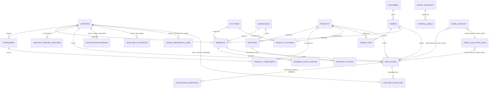

# Document 5 — Database Design

## HADES Model-Development Prototype

Version: 2.0 — rescoped to the ML pipeline only (dashboard/chat/MCP/audit tables removed)
Status: Baseline
Ground truth: `db/schema.sql` (DDL) and `db/generate_dataset.py` (the synthetic dataset that populates it)

---

## 1. Purpose

This document specifies the PostgreSQL schema that backs graph construction, training, and evaluation for the HADES prototype (`10_AI_ML_Documentation.md`). It covers exactly the tables the ML pipeline needs — nothing else. There is no application layer in this project, so there is no `users`, `alerts`, `chat`, `action_requests`, or `audit_log` table here.

## 2. Scope

- **In scope:** the source/master tables that become graph nodes and structural edges, the history tables that make feature computation and label derivation leakage-safe, the snapshot/label infrastructure, model output (`risk_scores`), and model-governance tables.
- **Also documented, not yet built:** the persistence tables for the three HADES components still being validated — the learned depth gate, Transformer 2, and Claim B (Section 6, Group D) — kept in this document so the schema is ready the moment each component is built, per `14_Model_Development_Roadmap.md`.
- **Out of scope:** anything that only a dashboard, chatbot, approval workflow, or MCP execution layer would need. If that work resumes later, this document does not need to be re-scoped to support it — those tables were removed, not deferred, because they don't exist in this project's plan right now.

## 3. Assumptions

- PostgreSQL 15+, native `gen_random_uuid()`, `JSONB`, partial indexes (matches `db/schema.sql`).
- All primary keys are UUIDs.
- Entities are deactivated (`is_active`), not deleted, to preserve graph and training-label history.
- `db/schema.sql` is authoritative for the 19 tables it defines; this document adds narrative, rationale, and the tables schema.sql does not yet contain.

## 4. Dependencies

`06_Graph_Database_Design.md` (this schema is the source the graph is built from), `10_AI_ML_Documentation.md` (feature engineering, leakage contract, and model architecture that consume it), `db/generate_dataset.py` and `db/README.md` (the synthetic dataset actually populating this schema today).

## 5. Entity-Relationship Diagram

**Temporal integrity.** Group B tables (Section 6) exist because the leakage contract (`10_AI_ML_Documentation.md` §6.1) requires every node, edge, and feature in a snapshot to reflect only what was known at a prediction timestamp `t₀`. Group A master tables hold *current state*; Group B history tables hold *what was true when*. Feature pipelines read Group B, never Group A's mutable columns.

## 6. Table Specifications

Tables are grouped by role, not by delivery phase — there is no product roadmap here, only a build order (`14_Model_Development_Roadmap.md`). Format per table: Purpose, Columns/Datatype/Constraints, Indexes, Relationships, Notes.

**Group A — master entities and structural edges** (graph nodes and non-temporal edges) · **Group B — history and snapshot infrastructure** (the leakage contract) · **Group C — model output and governance** · **Group D — persistence for the components still under validation (depth gate, Transformer 2, Claim B)**. Groups A, B, and `risk_scores` in Group C are implemented today in `db/schema.sql`; the rest of Group C and all of Group D are specified but not yet built.

---

### Group A — Master Entities and Structural Edges

### 6.1 `suppliers`

**Purpose:** Supplier master data — a core graph node type.

| Column | Datatype | Constraints |
|---|---|---|
| id | UUID | PK, default `gen_random_uuid()` |
| name | VARCHAR(255) | NOT NULL |
| country | VARCHAR(100) | NULL |
| capacity_score | NUMERIC(6,2) | NULL |
| lead_time_days | INTEGER | NOT NULL, default `0`, CHECK (`lead_time_days >= 0`) |
| reliability_history | NUMERIC(5,4) | NULL, CHECK (0 <= reliability_history <= 1) — **display only; deprecated for model use.** A mutable scalar recomputed over all history; reading it at training time leaks. Feature pipelines read `supplier_temporal_features` (Section 6.15) instead. |
| is_active | BOOLEAN | NOT NULL, default `true` |
| created_at | TIMESTAMPTZ | NOT NULL, default `now()` |
| updated_at | TIMESTAMPTZ | NOT NULL, default `now()` |

- **Indexes:** index on `name`; index on `is_active`.
- **Relationships:** parent of `components.supplier_id`, `shipments.supplier_id`; referenced by `risk_scores` (entity_type='supplier').
- **Pending amendment (Claim 3 support, data-gated):** `tier SMALLINT`, `is_frontier BOOLEAN` — see Section 6.23. Not added until `SUB_SUPPLIES`-equivalent data exists to populate them; adding the columns before there is data to put in them would just create two more silently-zero fields.

### 6.2 `components`

**Purpose:** Component/part master data supplied by suppliers, used in products.

| Column | Datatype | Constraints |
|---|---|---|
| id | UUID | PK, default `gen_random_uuid()` |
| supplier_id | UUID | NOT NULL, FK → `suppliers(id)` |
| name | VARCHAR(255) | NOT NULL |
| component_type | VARCHAR(100) | NOT NULL |
| unit_cost | NUMERIC(12,2) | NULL |
| created_at | TIMESTAMPTZ | NOT NULL, default `now()` |
| updated_at | TIMESTAMPTZ | NOT NULL, default `now()` |

- **Indexes:** index on `supplier_id`; index on `component_type`.
- **Relationships:** child of `suppliers`; parent of `product_components.component_id`.

### 6.3 `products`

**Purpose:** Finished-product master data — a core graph node type.

| Column | Datatype | Constraints |
|---|---|---|
| id | UUID | PK, default `gen_random_uuid()` |
| sku | VARCHAR(100) | NOT NULL, UNIQUE |
| name | VARCHAR(255) | NOT NULL |
| category | VARCHAR(100) | NULL |
| is_active | BOOLEAN | NOT NULL, default `true` |
| created_at | TIMESTAMPTZ | NOT NULL, default `now()` |
| updated_at | TIMESTAMPTZ | NOT NULL, default `now()` |

- **Indexes:** UNIQUE index on `sku`; index on `category`.
- **Relationships:** parent of `product_components.product_id`, `product_factories.product_id`, `inventory.product_id`, `order_items.product_id`; referenced by `risk_scores` (entity_type='product').

### 6.4 `product_components` (junction — `USED_IN` edge)

**Purpose:** Bill-of-materials — many-to-many between products and components.

| Column | Datatype | Constraints |
|---|---|---|
| id | UUID | PK, default `gen_random_uuid()` |
| product_id | UUID | NOT NULL, FK → `products(id)` |
| component_id | UUID | NOT NULL, FK → `components(id)` |
| quantity_required | INTEGER | NOT NULL, default `1`, CHECK (`quantity_required > 0`) |
| created_at | TIMESTAMPTZ | NOT NULL, default `now()` — when this BOM entry became valid |
| deactivated_at | TIMESTAMPTZ | NULL — when it stopped being valid; NULL means still current |

- **Indexes:** UNIQUE composite index on (`product_id`, `component_id`, `created_at`); index on `component_id`; index on `created_at`.
- **As-of edge filter:** a snapshot at `t₀` includes this edge only when `created_at <= t₀ AND (deactivated_at IS NULL OR deactivated_at > t₀)`. Without both columns, a BOM entry added after `t₀` would silently enter the snapshot — structural leakage no feature masking catches.

### 6.5 `factories`

**Purpose:** Manufacturing site master data — a core graph node type.

| Column | Datatype | Constraints |
|---|---|---|
| id | UUID | PK, default `gen_random_uuid()` |
| name | VARCHAR(255) | NOT NULL |
| location | VARCHAR(255) | NULL |
| capacity_units_per_day | INTEGER | NULL — site total across all products |
| is_active | BOOLEAN | NOT NULL, default `true` |
| created_at | TIMESTAMPTZ | NOT NULL, default `now()` |
| updated_at | TIMESTAMPTZ | NOT NULL, default `now()` |

- **Indexes:** index on `location`.
- **Relationships:** referenced by `shipments.factory_id`; parent of `product_factories` (Section 6.8), source of the `MANUFACTURED_AT` graph edge.

### 6.6 `warehouses`

**Purpose:** Warehouse master data — a core graph node type.

| Column | Datatype | Constraints |
|---|---|---|
| id | UUID | PK, default `gen_random_uuid()` |
| name | VARCHAR(255) | NOT NULL |
| location | VARCHAR(255) | NULL |
| capacity_units | INTEGER | NULL |
| is_active | BOOLEAN | NOT NULL, default `true` |
| created_at | TIMESTAMPTZ | NOT NULL, default `now()` |
| updated_at | TIMESTAMPTZ | NOT NULL, default `now()` |

- **Indexes:** index on `location`.
- **Relationships:** parent of `inventory.warehouse_id`; referenced by `shipments.warehouse_id`.

### 6.7 `customers`

**Purpose:** First-class customer entity — a graph node feeding the `ORDERED`/`PLACED_BY` edges and the raw signals Claim B's reweighting (Section 6.26) reads.

| Column | Datatype | Constraints |
|---|---|---|
| id | UUID | PK, default `gen_random_uuid()` |
| name | VARCHAR(255) | NOT NULL |
| priority_tier | customer_priority_tier ENUM(`strategic`,`standard`,`low`) | NOT NULL, default `standard` |
| contract_terms | JSONB | NULL — scoped to only the fields actually available in the dataset |
| is_active | BOOLEAN | NOT NULL, default `true` |
| created_at | TIMESTAMPTZ | NOT NULL, default `now()` |
| updated_at | TIMESTAMPTZ | NOT NULL, default `now()` |

- **Indexes:** index on `priority_tier`; index on `is_active`.
- **Relationships:** parent of `orders.customer_id`.
- **Note:** `priority_tier` is a graph node feature the structural encoder (SHARE in production, `rgcn_attn` — HGT originally) can see directly via `PLACED_BY` — this is precisely why Claim B's double-counting test (`10_AI_ML_Documentation.md` §8.5) exists.

### 6.8 `product_factories` (junction — `MANUFACTURED_AT` edge)

**Purpose:** Manufacturing capability — many-to-many between products and factories, kept as a declared capability table rather than inferred from shipment history.

| Column | Datatype | Constraints |
|---|---|---|
| id | UUID | PK, default `gen_random_uuid()` |
| product_id | UUID | NOT NULL, FK → `products(id)` |
| factory_id | UUID | NOT NULL, FK → `factories(id)` |
| is_primary | BOOLEAN | NOT NULL, default `false` |
| capacity_units_per_day | INTEGER | NULL, CHECK (`capacity_units_per_day >= 0`) — this factory's throughput **for this product**, distinct from `factories.capacity_units_per_day` |
| qualified_at | TIMESTAMPTZ | NULL |
| created_at | TIMESTAMPTZ | NOT NULL, default `now()` |
| deactivated_at | TIMESTAMPTZ | NULL |

- **Indexes:** UNIQUE composite index on (`product_id`, `factory_id`); index on `factory_id`; index on `created_at`; partial index on `is_primary` WHERE `is_primary = true`.
- **As-of edge filter:** same rule as `product_components` (Section 6.4).
- **Why a declared table, not an inferred edge:** the alternative — walking `shipments.factory_id → order → order_items → products` — is ambiguous (a multi-line order implies the shipping factory made every product on it, often false), silently drops any shipment missing `factory_id` or `order_id`, and worst of all makes graph *topology* a function of `shipments`, the same table the delay label derives from. That would make two snapshots of an otherwise-unchanged supply chain structurally different purely because more shipments had accumulated — leakage into the graph's shape, not just its features.

### 6.9 `inventory`

**Purpose:** Stock level per product/warehouse — **current state only**.

| Column | Datatype | Constraints |
|---|---|---|
| id | UUID | PK, default `gen_random_uuid()` |
| product_id | UUID | NOT NULL, FK → `products(id)` |
| warehouse_id | UUID | NOT NULL, FK → `warehouses(id)` |
| stock_level | INTEGER | NOT NULL, default `0`, CHECK (`stock_level >= 0`) |
| reorder_threshold | INTEGER | NOT NULL, default `0`, CHECK (`reorder_threshold >= 0`) |
| updated_at | TIMESTAMPTZ | NOT NULL, default `now()` |

- **Indexes:** UNIQUE composite index on (`product_id`, `warehouse_id`); index on `warehouse_id`.
- **Model use:** display/operational only. The shortage label is *defined* by `stock_level` crossing `reorder_threshold`, so reading current state at training time is direct label leakage — read `inventory_history` (Section 6.13) instead.

### 6.10 `orders`

**Purpose:** Customer order master data — a core graph node type.

| Column | Datatype | Constraints |
|---|---|---|
| id | UUID | PK, default `gen_random_uuid()` |
| order_number | VARCHAR(100) | NOT NULL, UNIQUE |
| customer_id | UUID | NOT NULL, FK → `customers(id)` |
| status | order_status ENUM(`open`,`fulfilled`,`cancelled`,`at_risk`) | NOT NULL, default `open` |
| placed_at | TIMESTAMPTZ | NOT NULL, default `now()` |
| due_at | TIMESTAMPTZ | NULL |
| order_value | NUMERIC(14,2) | NULL |
| created_at | TIMESTAMPTZ | NOT NULL, default `now()` |
| updated_at | TIMESTAMPTZ | NOT NULL, default `now()` |

- **Indexes:** UNIQUE index on `order_number`; index on `status`; index on `due_at`; index on `customer_id`.
- **Relationships:** parent of `order_items.order_id`; child of `customers`; referenced by `shipments.order_id`, `risk_scores` (entity_type='order').

### 6.11 `order_items`

**Purpose:** Line items linking orders to products (`ORDERED` edge).

| Column | Datatype | Constraints |
|---|---|---|
| id | UUID | PK, default `gen_random_uuid()` |
| order_id | UUID | NOT NULL, FK → `orders(id)` |
| product_id | UUID | NOT NULL, FK → `products(id)` |
| quantity | INTEGER | NOT NULL, CHECK (`quantity > 0`) |
| created_at | TIMESTAMPTZ | NOT NULL, default `now()` — as-of edge filter |

- **Indexes:** index on `order_id`; index on `product_id`; index on `created_at`.
- **As-of edge filter:** included in a `t₀` snapshot only when `created_at <= t₀`.

### 6.12 `shipments`

**Purpose:** Shipment master data — a core graph node type; the entity the delay-probability head predicts over.

| Column | Datatype | Constraints |
|---|---|---|
| id | UUID | PK, default `gen_random_uuid()` |
| supplier_id | UUID | NULL, FK → `suppliers(id)` |
| factory_id | UUID | NULL, FK → `factories(id)` |
| warehouse_id | UUID | NULL, FK → `warehouses(id)` |
| order_id | UUID | NULL, FK → `orders(id)` |
| carrier | VARCHAR(255) | NULL |
| status | shipment_status ENUM(`scheduled`,`in_transit`,`delivered`,`delayed`) | NOT NULL, default `scheduled` — **terminal/current value; display only** |
| eta | TIMESTAMPTZ | NULL — safe as a feature; known at dispatch |
| dispatched_at | TIMESTAMPTZ | NULL — source of `days_since_dispatch` |
| delivered_at | TIMESTAMPTZ | NULL — **label component; never a model feature** |
| origin_location | VARCHAR(255) | NULL |
| created_at | TIMESTAMPTZ | NOT NULL, default `now()` |
| updated_at | TIMESTAMPTZ | NOT NULL, default `now()` |

- **Indexes:** index on `supplier_id`; index on `warehouse_id`; index on `order_id`; index on `status`; index on `dispatched_at`.
- **Model use:** feature pipelines **must not read `status` or `delivered_at`** — the delay label is defined from them (`10_AI_ML_Documentation.md` §6.2). As-of status is reconstructed from `shipment_status_history` (Section 6.14).

---

### Group B — History and Snapshot Infrastructure (the Leakage Contract)

### 6.13 `inventory_history`

**Purpose:** Append-only observation log of stock positions — source of both the as-of `stock_level` feature and the shortage label.

| Column | Datatype | Constraints |
|---|---|---|
| id | UUID | PK, default `gen_random_uuid()` |
| inventory_id | UUID | NOT NULL, FK → `inventory(id)` |
| product_id | UUID | NOT NULL, FK → `products(id)` |
| warehouse_id | UUID | NOT NULL, FK → `warehouses(id)` |
| stock_level | INTEGER | NOT NULL, CHECK (`stock_level >= 0`) |
| reorder_threshold | INTEGER | NOT NULL, CHECK (`reorder_threshold >= 0`) |
| observed_at | TIMESTAMPTZ | NOT NULL — **valid time** |
| recorded_at | TIMESTAMPTZ | NOT NULL, default `now()` — **system time** |
| source | VARCHAR(50) | NOT NULL, default `'wms_sync'` |

- **Indexes:** composite index on (`product_id`, `warehouse_id`, `observed_at` DESC); index on `observed_at`.
- **Why two timestamps:** a correction written today about a position dated last year must not enter a snapshot built for last year — both the as-of query and the label query filter on `recorded_at <= t₀` as well as `observed_at`.
- **As-of query:** `SELECT DISTINCT ON (product_id, warehouse_id) ... WHERE observed_at <= :t0 AND recorded_at <= :t0 ORDER BY product_id, warehouse_id, observed_at DESC`
- **Shortage label query:** `bool_or(stock_level < reorder_threshold)` over rows where `observed_at > :t0 AND observed_at <= :t0 + :horizon`

### 6.14 `shipment_status_history`

**Purpose:** Append-only status transition log — source of the as-of shipment status and the delay label.

| Column | Datatype | Constraints |
|---|---|---|
| id | UUID | PK, default `gen_random_uuid()` |
| shipment_id | UUID | NOT NULL, FK → `shipments(id)` |
| status | shipment_status ENUM | NOT NULL |
| previous_status | shipment_status ENUM | NULL — NULL for the initial row |
| changed_at | TIMESTAMPTZ | NOT NULL — **valid time** |
| recorded_at | TIMESTAMPTZ | NOT NULL, default `now()` — **system time** |
| source | VARCHAR(50) | NOT NULL, default `'carrier_feed'` |

- **Indexes:** composite index on (`shipment_id`, `changed_at` DESC); index on (`status`, `changed_at`).
- **Eligibility rule:** only shipments whose as-of status is `scheduled` or `in_transit` are valid training examples — a shipment already `delivered`/`delayed` at `t₀` has no outcome left to predict.

### 6.15 `supplier_temporal_features`

**Purpose:** Precomputed as-of temporal features per supplier per snapshot date — the leakage-safe replacement for the mutable `suppliers.reliability_history` scalar, and the source of the multi-window features (`10_AI_ML_Documentation.md` §6.3) that make "this supplier is currently degrading" representable.

| Column | Datatype | Constraints |
|---|---|---|
| id | UUID | PK, default `gen_random_uuid()` |
| supplier_id | UUID | NOT NULL, FK → `suppliers(id)` |
| as_of_date | DATE | NOT NULL |
| on_time_rate_30d | NUMERIC(5,4) | NULL, CHECK (0 <= on_time_rate_30d <= 1) |
| on_time_rate_90d | NUMERIC(5,4) | NULL, CHECK (0 <= on_time_rate_90d <= 1) |
| on_time_rate_180d | NUMERIC(5,4) | NULL, CHECK (0 <= on_time_rate_180d <= 1) |
| trend_slope | NUMERIC(8,6) | NULL — negative means degrading |
| lateness_variance | NUMERIC(10,4) | NULL, CHECK (`lateness_variance >= 0`) |
| days_since_last_late | INTEGER | NULL, CHECK (`days_since_last_late >= 0`) |
| shipment_count_180d | INTEGER | NOT NULL, default `0` — sample size behind the rates |
| computed_at | TIMESTAMPTZ | NOT NULL, default `now()` |
| feature_spec_version | VARCHAR(20) | NOT NULL |

- **Indexes:** UNIQUE composite index on (`supplier_id`, `as_of_date`, `feature_spec_version`); index on `as_of_date`.
- **Why `shipment_count_180d` is not decorative:** an on-time rate of 1.00 from two shipments and from two hundred are different facts; a rate from too few shipments should be `NULL`, not optimistic.

### 6.16 `carrier_performance_snapshots`

**Purpose:** As-of carrier/route reliability, supplying two of the four shipment temporal features without materializing a per-shipment-per-date table.

| Column | Datatype | Constraints |
|---|---|---|
| id | UUID | PK, default `gen_random_uuid()` |
| carrier | VARCHAR(255) | NOT NULL |
| origin_location | VARCHAR(255) | NULL |
| destination_location | VARCHAR(255) | NULL |
| as_of_date | DATE | NOT NULL |
| on_time_rate_90d | NUMERIC(5,4) | NULL, CHECK (0 <= on_time_rate_90d <= 1) |
| shipment_count_90d | INTEGER | NOT NULL, default `0` |
| computed_at | TIMESTAMPTZ | NOT NULL, default `now()` |

- **Indexes:** UNIQUE composite index on (`carrier`, `origin_location`, `destination_location`, `as_of_date`); index on `as_of_date`.
- **The other two shipment features need no table:** `days_since_dispatch` is `t₀ − dispatched_at`; `seasonal_index` is a deterministic function of the calendar.

### 6.17 `graph_snapshots`

**Purpose:** Registry of every training snapshot built. Without it, no training result is reproducible.

| Column | Datatype | Constraints |
|---|---|---|
| id | UUID | PK, default `gen_random_uuid()` |
| t0 | TIMESTAMPTZ | NOT NULL |
| horizon_days | SMALLINT | NOT NULL, default `14` |
| node_counts | JSONB | NOT NULL — per node type |
| edge_counts | JSONB | NOT NULL — per meta-relation |
| label_counts | JSONB | NOT NULL — positives/negatives per task |
| feature_spec_version | VARCHAR(20) | NOT NULL |
| git_commit | VARCHAR(40) | NOT NULL |
| construction_seconds | NUMERIC(8,2) | NULL |
| created_at | TIMESTAMPTZ | NOT NULL, default `now()` |

- **Indexes:** UNIQUE composite index on (`t0`, `feature_spec_version`); index on `t0`.
- **`label_counts` is the column you read first.** It's where you discover a given month produced eleven positive delay labels and cannot support a comparison — cheaper to learn before training than after.

### 6.18 `training_labels`

**Purpose:** The actual supervision targets, stored rather than recomputed at load time — makes label construction auditable and after-the-fact leakage investigation possible.

| Column | Datatype | Constraints |
|---|---|---|
| id | UUID | PK, default `gen_random_uuid()` |
| snapshot_id | UUID | NOT NULL, FK → `graph_snapshots(id)` |
| entity_type | entity_type ENUM(`supplier`,`product`,`order`,`shipment`) | NOT NULL |
| entity_id | UUID | NOT NULL |
| task | VARCHAR(50) | NOT NULL — `delay`, `shortage`, `impact` |
| label | BOOLEAN | NOT NULL |
| event_at | TIMESTAMPTZ | NULL — positives only |
| label_source | VARCHAR(100) | NOT NULL |
| warehouse_id | UUID | NULL, FK → `warehouses(id)` — populated for `task='shortage'` only |

- **Indexes:** composite index on (`snapshot_id`, `task`, `entity_type`); index on (`entity_type`, `entity_id`).
- **Invariant that must hold:** every non-NULL `event_at` satisfies `t₀ < event_at <= t₀ + horizon_days`. Enforce in the loader, assert in a test.
- **`warehouse_id` (added post-Steps-0-5, "Step C"):** `shortage`'s `entity_id` is a `product_id`, and a product can be stocked at multiple warehouses with independent shortage outcomes in the same snapshot — without a disambiguator, `(snapshot_id, entity_id)` alone could carry conflicting `true`/`false` rows for what looks like "the same" label. `warehouse_id` resolves that: grouping by `(snapshot_id, entity_id, warehouse_id)` is conflict-free by construction (`db/generate_dataset.py`'s validation suite asserts this every run). NULL for `delay`/`impact`, whose `entity_id` already uniquely identifies one instance. Note this is a data-level fix only — the graph has no Product×Warehouse node, so the model pipeline (`ml/models/heads.py`) still reads the Product node's own embedding for every one of that product's labelled instances; resolving that would mean an edge-level head, a separate architectural question.

---

### Group C — Model Output and Governance

### 6.19 `risk_scores`

**Purpose:** Logged output of every inference run per entity — the evaluation and comparison record for the architecture ablation and layer-depth sweep.

| Column | Datatype | Constraints |
|---|---|---|
| id | UUID | PK, default `gen_random_uuid()` |
| entity_type | entity_type ENUM(`supplier`,`product`,`order`,`shipment`) | NOT NULL |
| entity_id | UUID | NOT NULL |
| delay_probability | NUMERIC(5,4) | NULL, CHECK (0 <= delay_probability <= 1) |
| shortage_risk | NUMERIC(5,4) | NULL, CHECK (0 <= shortage_risk <= 1) |
| impact_score | NUMERIC(5,4) | NOT NULL, CHECK (0 <= impact_score <= 1) |
| confidence | NUMERIC(5,4) | NULL, CHECK (0 <= confidence <= 1) — softmax margin or MC-dropout variance |
| risk_category | risk_category ENUM(`low`,`medium`,`high`,`critical`) | NOT NULL, default `low` |
| scoring_method | scoring_method ENUM(`gnn_native`,`weighted_formula`) | NOT NULL, default `weighted_formula` |
| model_version | VARCHAR(50) | NOT NULL — e.g. `graphsage-v1`, `gat-v1`, `hgt-v1` |
| snapshot_t0 | TIMESTAMPTZ | NULL — what moment the prediction is *about* |
| horizon_days | SMALLINT | NULL |
| scored_at | TIMESTAMPTZ | NOT NULL, default `now()` — when inference *ran* |

- **Indexes:** composite index on (`entity_type`, `entity_id`, `scored_at` DESC); index on `impact_score`; index on `model_version`; index on `risk_category`.
- **`risk_category`/`scoring_method` carried over from the schema but not exercised by this prototype:** they were built for a dashboard triage view and a business weighted-formula aggregator, neither of which exists here. Every row this pipeline writes uses `scoring_method='gnn_native'`; the columns are left in place (defaults intact) rather than dropped, since dropping them would be a schema change with no ML benefit.
- **`scored_at` vs `snapshot_t0`:** distinct on purpose — a backfilled re-score of an old snapshot must not look like a present-day risk change.
- **Audit:** immutable, append-only.

### 6.20 `explanation_subgraphs` — *specified, not yet in `schema.sql`*

**Purpose:** Persisted GNNExplainer output per held-out high-risk prediction — the qualitative-explanation-fidelity check (`10_AI_ML_Documentation.md` §10).

| Column | Datatype | Constraints |
|---|---|---|
| id | UUID | PK, default `gen_random_uuid()` |
| risk_score_id | UUID | NOT NULL, FK → `risk_scores(id)` |
| nodes | JSONB | NOT NULL — array of `{entity_type, entity_id, contribution_weight}` |
| edges | JSONB | NOT NULL — array of `{source, target, edge_type, contribution_weight}` |
| created_at | TIMESTAMPTZ | NOT NULL, default `now()` |

- **Indexes:** UNIQUE index on `risk_score_id`; GIN index on `nodes`.

### 6.21 `model_evaluation_runs` — *specified, not yet in `schema.sql`*

**Purpose:** Persisted classification/regression metrics for every training run, keyed by architecture and model version — the record the architecture ablation (Claim 1) and layer-depth sweep (Claim 2) are read from.

| Column | Datatype | Constraints |
|---|---|---|
| id | UUID | PK, default `gen_random_uuid()` |
| model_version | VARCHAR(50) | NOT NULL |
| architecture | VARCHAR(100) | NOT NULL — e.g. `graphsage`, `gat`, `heterogeneous_graph_transformer`, `rgcn`, **`rgcn_attn`** (current production value — documentation name SHARE, `project_HADES.md` §3) |
| metric_name | VARCHAR(50) | NOT NULL — `precision`, `recall`, `f1`, `roc_auc`, `mae`, `rmse`, `mape` |
| metric_value | NUMERIC(10,6) | NOT NULL |
| dataset_split | dataset_split ENUM(`train`,`validation`,`test`) | NOT NULL, default `test` |
| task | VARCHAR(50) | NOT NULL — `delay`, `shortage`, `impact` |
| depth_l | SMALLINT | NULL — which `L` this run used, populated for layer-depth-sweep rows |
| fold_id | SMALLINT | NULL |
| train_end_t0 | TIMESTAMPTZ | NULL |
| test_start_t0 | TIMESTAMPTZ | NULL |
| test_end_t0 | TIMESTAMPTZ | NULL |
| ci_lower | NUMERIC(10,6) | NULL |
| ci_upper | NUMERIC(10,6) | NULL |
| ci_method | VARCHAR(50) | NULL — e.g. `paired_block_bootstrap`, `delong` |
| evaluated_at | TIMESTAMPTZ | NOT NULL, default `now()` |

- **Indexes:** composite index on (`model_version`, `task`, `metric_name`); index on `architecture`; index on (`fold_id`, `test_start_t0`).
- **Interval reporting is not optional here.** Repeated snapshots of the same entities are autocorrelated, so i.i.d. methods (ordinary DeLong, naive bootstrap) understate the interval — `ci_method` records which estimator was actually used, and a paired, time-blocked bootstrap over whole snapshots is the correct default (`10_AI_ML_Documentation.md` §9.3). **A schema with nowhere to store an interval guarantees point estimates get reported instead** — this is why the columns exist even before the first run.

### 6.22 `model_registry` — *specified, not yet in `schema.sql`*

**Purpose:** Lightweight governance record per trained model version — the facts needed to trust and reproduce a given model.

| Column | Datatype | Constraints |
|---|---|---|
| id | UUID | PK, default `gen_random_uuid()` |
| model_version | VARCHAR(50) | NOT NULL, UNIQUE |
| architecture | VARCHAR(100) | NOT NULL — current production value `rgcn_attn` (documentation name SHARE, `project_HADES.md` §3); free text, no enum/CHECK constraint, so every historical value (`hgt`/`heterogeneous_graph_transformer`, `graphsage`, `gat`, `rgcn`, `rgcn_relemb`, `rgcn_battn`) stays queryable as-is |
| training_dataset | VARCHAR(255) | NULL |
| training_timestamp | TIMESTAMPTZ | NOT NULL |
| experiment_id | VARCHAR(100) | NULL |
| git_commit | VARCHAR(40) | NULL |
| hyperparameters | JSONB | NULL |
| parameter_count | BIGINT | NULL |
| purpose | VARCHAR(255) | NULL — e.g. `ablation baseline`, `layer-depth sweep L=3`, `final candidate` |
| status | model_status ENUM(`training`,`evaluating`,`candidate`,`active`,`archived`) | NOT NULL, default `training` |
| created_at | TIMESTAMPTZ | NOT NULL, default `now()` |

- **Indexes:** UNIQUE index on `model_version`; index on `status`; index on `architecture`.
- **Written by the training pipeline directly, never entered by hand** — otherwise this table drifts from what was actually run and stops being trustworthy.

---

### Group D — Persistence for the Components Still Under Validation

Everything in this group backs one of the three non-core HADES claims (`10_AI_ML_Documentation.md` §1) and is built only when that component is actually implemented, per `14_Model_Development_Roadmap.md`. None of it exists in `db/schema.sql` today.

### 6.23 `suppliers` tier/frontier amendment, and `supplier_relationships` — *Claim 3 support, data-gated*

Not built until `SUB_SUPPLIES`-equivalent upstream data exists — adding these columns today would just be two more silently-zero fields (Section 6.1). **Still accurate as written** — no `supplier_relationships` table or `tier`/`is_frontier` columns exist in the live schema. **Do not confuse this with the co-parent mechanism** (`06_Graph_Database_Design.md` §6.1, `Supplier→SUPPLIES→Component→rev_SUPPLIES→Supplier`), a separate, already-built path that dual-sourcing (`component_suppliers`) has made active on the current dataset — `reports/entropy_test.md`. This section's `SUB_SUPPLIES`/`supplier_relationships` — a direct Supplier-to-Supplier edge for explicit tiering — remains genuinely unbuilt.

**`suppliers` amendment:**

| Column | Datatype | Constraints |
|---|---|---|
| tier | SMALLINT | NOT NULL, default `1`, CHECK (`tier >= 1`) |
| is_frontier | BOOLEAN | NOT NULL, default `false` |

**`supplier_relationships` (new):**

| Column | Datatype | Constraints |
|---|---|---|
| id | UUID | PK, default `gen_random_uuid()` |
| upstream_supplier_id | UUID | NOT NULL, FK → `suppliers(id)` |
| downstream_supplier_id | UUID | NOT NULL, FK → `suppliers(id)`, CHECK (`downstream_supplier_id <> upstream_supplier_id`) |
| tier | SMALLINT | NOT NULL, CHECK (`tier >= 2`) |
| source | VARCHAR(50) | NULL |
| confidence | NUMERIC(5,4) | NULL, CHECK (0 <= confidence <= 1) |
| created_at | TIMESTAMPTZ | NOT NULL, default `now()` |

- **Relationships:** links `suppliers` to `suppliers`; source of the `SUB_SUPPLIES` graph edge.

### 6.24 `node_depth_attention` — *Claim 2 (learned depth gate) output*

**Purpose:** Persists the depth gate's per-node weights — the evidence for whether the learned deviation from the structural prior beats the prior alone.

| Column | Datatype | Constraints |
|---|---|---|
| id | UUID | PK, default `gen_random_uuid()` |
| entity_type | entity_type ENUM | NOT NULL — `supplier` in the initial scope |
| entity_id | UUID | NOT NULL |
| task | VARCHAR(50) | NOT NULL — `delay`, `shortage`, `impact` |
| model_version | VARCHAR(50) | NOT NULL |
| depth_weights | JSONB | NOT NULL — `[w1,w2,w3,w4]`, sums to 1 |
| prior_weights | JSONB | NOT NULL — the structural prior this row's weights are a deviation *from*, so a reviewer never has to look it up separately |
| created_at | TIMESTAMPTZ | NOT NULL, default `now()` |

- **Indexes:** composite index on (`entity_type`, `entity_id`, `model_version`, `task`).
- **Not the instrument that validates Claim 2** — the layer-depth sweep is (`10_AI_ML_Documentation.md` §9.4). This table is what makes the residual ("where did the model deviate from the prior, and for which suppliers") inspectable after the fact, not the proof itself.

### 6.25 `hidden_dependency_links` — *Claim 3 (Transformer 2) output*

**Purpose:** Persists Transformer 2's discovered supplier-pair attention weights.

| Column | Datatype | Constraints |
|---|---|---|
| id | UUID | PK, default `gen_random_uuid()` |
| supplier_a_id | UUID | NOT NULL, FK → `suppliers(id)` |
| supplier_b_id | UUID | NOT NULL, FK → `suppliers(id)`, CHECK (`supplier_a_id < supplier_b_id`) |
| attention_a_to_b | NUMERIC(6,5) | NOT NULL |
| attention_b_to_a | NUMERIC(6,5) | NOT NULL |
| symmetric_score | NUMERIC(6,5) | NOT NULL — mean of the two directional weights |
| rank_for_a | SMALLINT | NULL |
| rank_for_b | SMALLINT | NULL |
| snapshot_t0 | TIMESTAMPTZ | NOT NULL |
| candidate_pool_version | VARCHAR(50) | NOT NULL — `dense`, or the top-k configuration used |
| model_version | VARCHAR(50) | NOT NULL |
| validation_status | validation_status ENUM(`unvalidated`,`confirmed`,`rejected`) | NOT NULL, default `unvalidated` |
| detected_at | TIMESTAMPTZ | NOT NULL, default `now()` |

- **Indexes:** UNIQUE composite index on (`supplier_a_id`, `supplier_b_id`, `snapshot_t0`, `model_version`); index on `symmetric_score` DESC; index on `validation_status`.
- **Canonical ordering** (`supplier_a_id < supplier_b_id`) guarantees one row per pair; both directional weights are kept because attention is **not symmetric**.
- **Interpretation:** a row is an investigation lead, never a fact — see the validation routes in `10_AI_ML_Documentation.md` §8.3.

### 6.26 `supplier_dyadic_risk` — *Claim 4 output*

**Purpose:** Persists Claim B's relationship-specific reweighting of a supplier's global risk score, kept separate from `risk_scores` so the two are never conflated.

| Column | Datatype | Constraints |
|---|---|---|
| id | UUID | PK, default `gen_random_uuid()` |
| supplier_id | UUID | NOT NULL, FK → `suppliers(id)` |
| risk_score_id | UUID | NOT NULL, FK → `risk_scores(id)` — the global score this row reweights, unmodified |
| order_volume_share | NUMERIC(5,4) | NULL, CHECK (0 <= order_volume_share <= 1) |
| contract_priority_weight | NUMERIC(5,4) | NULL, CHECK (0 <= contract_priority_weight <= 1) |
| fulfilment_preference_weight | NUMERIC(5,4) | NULL, CHECK (0 <= fulfilment_preference_weight <= 1) — lead signal; the one the encoder cannot already see |
| dyadic_risk_score | NUMERIC(5,4) | NOT NULL, CHECK (0 <= dyadic_risk_score <= 1) |
| double_counting_test_run_id | VARCHAR(100) | NULL — links this row to the ablation run (with/without `priority_tier`) that validated it was not double-counting |
| scored_at | TIMESTAMPTZ | NOT NULL, default `now()` |

- **Indexes:** composite index on (`supplier_id`, `scored_at` DESC).
- **Audit:** immutable, append-only, mirroring `risk_scores`.

### 6.27 `link_prediction_scores` — *optional, Claim 3 cross-validation only*

**Purpose:** If a separate link-prediction decoder is built as an independent cross-check on Transformer 2's discoveries (`10_AI_ML_Documentation.md` §8.3, §9.4), its scored candidate pairs are persisted here — distinct from `hidden_dependency_links`, which stores attention weights, not decoder probabilities.

| Column | Datatype | Constraints |
|---|---|---|
| id | UUID | PK, default `gen_random_uuid()` |
| node_a_type | entity_type ENUM | NOT NULL |
| node_a_id | UUID | NOT NULL |
| node_b_type | entity_type ENUM | NOT NULL |
| node_b_id | UUID | NOT NULL |
| predicted_edge_type | VARCHAR(50) | NOT NULL — e.g. `SUB_SUPPLIES` |
| predicted_probability | NUMERIC(6,5) | NOT NULL, CHECK (0 <= predicted_probability <= 1) |
| decoder | VARCHAR(20) | NOT NULL, CHECK (`decoder IN ('distmult','mlp')`) |
| model_version | VARCHAR(50) | NOT NULL |
| scored_at | TIMESTAMPTZ | NOT NULL, default `now()` |

- **Indexes:** composite index on (`node_a_type`, `node_a_id`, `node_b_type`, `node_b_id`, `model_version`); index on `predicted_probability` DESC.
- **Status:** genuinely optional — only build this if Transformer 2's own validation routes (held-out edge recovery, future co-disruption rate) leave the result ambiguous enough that a second, independent signal is worth the extra model.

## 7. Build Order

Not a migration calendar with dates — a dependency order. Full detail and rationale: `14_Model_Development_Roadmap.md`.

1. **Group A + Group B** (Sections 6.1–6.18) — already implemented in `db/schema.sql`, already populated by `db/generate_dataset.py`. Nothing here is a hard blocker; it's the starting point.
2. **`risk_scores`** (6.19) — already in `db/schema.sql`; written by inference once a model exists.
3. **`explanation_subgraphs`, `model_evaluation_runs`, `model_registry`** (6.20–6.22) — build before the first ablation run. Without `model_evaluation_runs`'s CI columns specifically, point estimates get reported instead of intervals by default (Section 6.21) — this is a schema decision that pre-empts a methodology mistake, so it comes before, not after, training starts.
4. **`node_depth_attention`** (6.24) — build only once the learned depth gate itself is being implemented (Claim 2, after the fixed-prior baseline and layer-depth sweep already work without it).
5. **`hidden_dependency_links`**, optionally **`link_prediction_scores`** (6.25, 6.27) — build only once Transformer 2 is being implemented (Claim 3).
6. **`suppliers` tier/frontier amendment, `supplier_relationships`, `supplier_dyadic_risk`** (6.23, 6.26) — build only once Claim B is being implemented (Claim 4), and only after the double-counting test (`10_AI_ML_Documentation.md` §8.5) has a place to record its result.

## 8. Risks

| ID | Risk | Mitigation |
|---|---|---|
| DB-01 | Polymorphic `entity_type`/`entity_id` references (in `risk_scores`, `training_labels`) bypass native FK integrity | Application-layer validation enforces referential integrity in the training/evaluation pipeline; covered by pipeline tests (`13_Testing_Documentation.md`) |
| DB-02 | Feature pipelines read the deprecated mutable columns (`suppliers.reliability_history`, `shipments.status`, `inventory.stock_level`) out of habit, reintroducing label leakage | Column comments mark each display-only (Sections 6.1, 6.9, 6.12); an automated check asserts no module under the ML feature pipeline references them; covered by a leakage test (`10_AI_ML_Documentation.md` §9.5) |
| DB-03 | `model_registry` row edited after `status='active'`, undermining governance trust | Only `status` transitions permitted once a row is `active`; enforced in the training pipeline's write path |
| DB-04 | History tables grow large (`inventory_history` at weekly granularity across many product×warehouse pairs) | Partition by `observed_at` month if/when volume warrants it; not needed at prototype scale (~10K rows today per `db/README.md`) |
| DB-05 | Backfill produces approximated history that is subsequently treated as observed fact | Record the trustworthy-from date per history table; graph construction refuses `t₀` earlier than it (`db/README.md`: first usable `t₀` is 2024-07-01) |
| DB-06 | `feature_spec_version` drifts silently as feature definitions change, making old runs incomparable | Bump on every definition change; stored on both `graph_snapshots` and `supplier_temporal_features` |
| DB-07 | Snapshot construction becomes the training bottleneck | `supplier_temporal_features`/`carrier_performance_snapshots` precompute the expensive rolling aggregates; `graph_snapshots.construction_seconds` is measured per snapshot |
| DB-08 | Master-table attributes (`lead_time_days`, `capacity_score`, `country`) remain mutable, so a supplier that changed is retroactively assumed to have always been that way | Accepted for this prototype — these change slowly relative to the monthly snapshot cadence; full SCD Type 2 versioning is unnecessary complexity at this scale |

## 9. Future Extension

If this project ever resumes the product-scoped build (dashboard, chatbot, approval workflow, MCP execution, alerts), the application-layer tables that were removed from this document (`users`, `alert_thresholds`, `alerts`, `action_requests`, `action_log`, `chat_sessions`, `chat_messages`, `notifications`, `audit_log`) and the supplementary dashboard-analytics tables (SPOF traversal, supplier segmentation, geographic/spend concentration snapshots) would need to be reintroduced — none of them are needed to validate the four HADES claims this prototype exists to test, so they are not carried here as speculative schema.

---

## Document Control

- **Purpose:** Section 1. **Scope:** Section 2. **Assumptions:** Section 3. **Dependencies:** Section 4. **Risks:** Section 8. **Future Extension:** Section 9.
- Ground truth for the 19 already-implemented tables: `db/schema.sql`. Baseline for `06_Graph_Database_Design.md` and `10_AI_ML_Documentation.md`.
