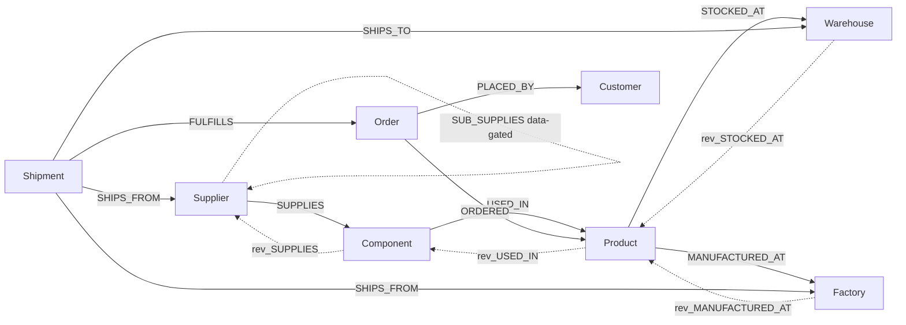
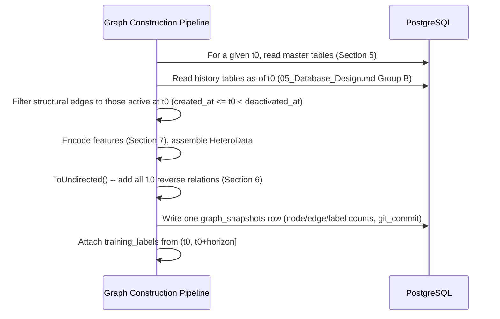

# Document 6 — Graph Database Design

## HADES Model-Development Prototype

Version: 2.0 — rescoped to the ML pipeline only; corrected to match `project_HADES.md` (bidirectional meta-relations, temporal features, frontier nodes)
Status: Baseline

---

## 1. Purpose

This document defines the heterogeneous graph representation the HADES encoder trains and infers on: node types, edge types (including the reverse relations correctness requires — Section 6), tensor encoding, and how a graph snapshot is assembled per prediction timestamp `t₀`. The primary representation is the PyTorch Geometric `HeteroData` tensor object; a Neo4j representation is optional and used only for developer inspection, never by the training/inference pipeline itself.

## 2. Scope

Covers graph construction and the entity embeddings/explanation data Layer 2 produces during evaluation. Out of scope: anything a dashboard or recommender feature would need from the graph (similarity search UI, live incremental updates to a served graph) — this pipeline runs offline, one snapshot at a time.

## 3. Assumptions

- PostgreSQL (`05_Database_Design.md`) is the system of record; the graph is a derived, rebuildable representation.
- Neo4j is optional, for developer/analyst querying only. The training/inference pipeline depends only on `HeteroData` — the pipeline is correct and complete with Neo4j entirely absent.
- One `HeteroData` object is built **per snapshot `t₀`**, not maintained as a single live, incrementally-updated graph — this project has no serving layer to keep live for.

## 4. Dependencies

`05_Database_Design.md` (source tables), `10_AI_ML_Documentation.md` (feature engineering, leakage contract, and the model architecture that consumes this graph), `project_HADES.md` Parts 2–3 (the authoritative meta-relation and encoding specification this document restates).

## 5. Node Types

| Node Type | Source Table | Key Properties | Notes |
|---|---|---|---|
| `Supplier` | `suppliers` + `supplier_temporal_features` | `country`, `capacity_score`, `lead_time_days`, **6 temporal-window features** (Section 7) | `reliability_history` on `suppliers` itself is display-only — never a feature (`05_Database_Design.md` §6.1) |
| `Supplier` (pending amendment) | `suppliers` | `tier`, `is_frontier` | Data-gated — not added until `SUB_SUPPLIES`-equivalent upstream data exists (`05_Database_Design.md` §6.23) |
| `Component` | `components` | `component_type`, `unit_cost` | |
| `Product` | `products` | `sku`, `category` | |
| `Factory` | `factories` | `location`, `capacity_units_per_day` | |
| `Warehouse` | `warehouses` | `location`, `capacity_units` | |
| `Shipment` | `shipments` + `shipment_status_history` + `carrier_performance_snapshots` | as-of `status`, `eta`, **4 temporal features** (Section 7) | as-of status reconstructed from `shipment_status_history`, never read from `shipments.status` directly |
| `Order` | `orders` | as-of `status`, `due_at` | |
| `Customer` | `customers` | `priority_tier` | Feeds Claim B's double-counting test (`10_AI_ML_Documentation.md` §8.5) |

**8 node types.** All node types additionally carry a `risk_embedding` vector, populated per inference run and used only for evaluation-time analysis in this prototype (Section 9) — there is no downstream recommender consuming it.

## 6. Edge Types — Forward and Reverse (20 Meta-Relations)

PyTorch Geometric message passing flows source → target only. A schema with only the 10 forward relations below would leave a Supplier with almost no in-edges — it would never receive information about the components it supplies or the orders at risk downstream, breaking the exact multi-hop reasoning this architecture exists to do (`project_HADES.md` §2.2). **Every relation is therefore paired with its reverse** via `torch_geometric.transforms.ToUndirected()`.

| Forward | Source (from → to) | Derivation | Edge Properties | Reverse (auto-generated) |
|---|---|---|---|---|
| `SUPPLIES` | `Supplier → Component` | `components.supplier_id` | — | `rev_SUPPLIES` |
| `USED_IN` | `Component → Product` | `product_components`, as-of filtered | `quantity_required` | `rev_USED_IN` |
| `STOCKED_AT` | `Product → Warehouse` | `inventory_history`, as-of | `stock_level`, `reorder_threshold` (both as-of `t₀`) | `rev_STOCKED_AT` |
| `MANUFACTURED_AT` | `Product → Factory` | `product_factories`, as-of filtered | `capacity_units_per_day` (per-product) | `rev_MANUFACTURED_AT` |
| `SHIPS_FROM` | `Shipment → Supplier` **and** `Shipment → Factory` | `shipments.supplier_id` / `shipments.factory_id` | — | `rev_SHIPS_FROM` (×2 — different meta-relation per target type, `project_HADES.md` §3.2) |
| `SHIPS_TO` | `Shipment → Warehouse` | `shipments.warehouse_id` | as-of status, `eta` | `rev_SHIPS_TO` |
| `FULFILLS` | `Shipment → Order` | `shipments.order_id` | — | `rev_FULFILLS` |
| `ORDERED` | `Order → Product` | `order_items`, as-of filtered | `quantity` | `rev_ORDERED` |
| `PLACED_BY` | `Order → Customer` | `orders.customer_id` | — | `rev_PLACED_BY` |
| `SUB_SUPPLIES` | `Supplier → Supplier` | `supplier_relationships` — **data-gated, not built** (`05_Database_Design.md` §6.23) | `tier`, `source`, `confidence` | `rev_SUB_SUPPLIES` |

**10 forward + 10 reverse = 20 meta-relations** (`project_HADES.md` §2.2, §3.2 — note `SHIPS_FROM` counts as two distinct meta-relations, one per target type, consistent with the structural encoder's `⟨source type, edge type, target type⟩` parameterization, SHARE's and HGT's alike). `SUB_SUPPLIES` is included in this count for completeness of the target schema but contributes no actual edges until upstream data exists (`05_Database_Design.md` §6.23) — not to be confused with the separate, now-active co-parent mechanism, Section 6.1.



*(Reverse arrows omitted from the diagram past the first four edges for legibility — every solid edge above has a corresponding `rev_*` edge in the actual graph.)*

### 6.1 Why the co-parent path specifically requires the reverse edge

The structural depth prior's derived floor of `L=2` (`10_AI_ML_Documentation.md` §8.2) rests on a Supplier's co-parents — *other suppliers of the same component* — being reachable in 2 hops:

```
Supplier_A  ──SUPPLIES──►  Component  ◄──SUPPLIES──  Supplier_B
```

Walking the second leg requires `rev_SUPPLIES`. Without reverse relations this path does not exist for message passing, and the depth-prior derivation in `10_AI_ML_Documentation.md` §8.2 would be unfounded, not merely conservative.

**Data status — corrected, active as of `reports/entropy_test.md`.** For most of
this project's history this path existed structurally but returned nothing:
`components.supplier_id` was a single not-null FK, so every Component belonged to
exactly one Supplier and a `Supplier -SUPPLIES-> Component -rev_SUPPLIES->
Supplier` round trip could only return to the *same* supplier — measured 0/800
reaching a different supplier, both at v2's 180-supplier scale and v3's original
800-supplier scale (`ml/graph/reach.py`, Step 2). **That changed once dual-sourcing
shipped** (`component_suppliers`, a secondary-supplier junction table alongside the
mandatory primary FK): the currently loaded database has it active — 420
components (17.5%) carry a second qualified supplier, and **449/800 suppliers
(56.1%) now measurably reach a different supplier in 2 hops**
(`reports/entropy_test.md`'s dataset-version finding). The co-parent mechanism
described above is a real, populated part of the graph on the current dataset, not
merely a structural possibility — Section 11's measured reach table should be
re-run to reflect this rather than cited from its pre-dual-sourcing values.

**This is unrelated to `SUB_SUPPLIES`** (Section 6, `Supplier → Supplier`), which
remains genuinely data-gated and not built — no `supplier_relationships` table or
`SUB_SUPPLIES` edge type exists in the current schema. The co-parent path above
reaches a different supplier *through a shared Component*, not through a direct
Supplier-to-Supplier edge; the two are structurally and causally distinct
mechanisms that happen to share the word "supplier" in their names.

## 7. Node and Edge Properties — Tensor Encoding

Each node type has a feature matrix `x` built as `h⁰_v = W_in[τ(v)] · x_v + b_in[τ(v)]`, projected into a shared `d=64` space (`project_HADES.md` §2.1).

**Measured** (`ml/graph/builder.py`, `ml/data/features.py`; verified against v3 — dimensions are
unchanged from v2 since the scale-up grew population sizes, not category cardinalities):

| Node Type | Feature Encoding | Dim |
|---|---|---|
| `Supplier` | `[lead_time_days (scaled), capacity_score (scaled), one-hot country (6), on_time_rate_30d, on_time_rate_90d, on_time_rate_180d, trend_slope, lateness_variance, days_since_last_late]` | **14** |
| `Component` | `[unit_cost (scaled), one-hot component_type (5)]` | **6** |
| `Product` | `[min_stock_ratio, avg_stock_ratio, total_stock, total_reorder_threshold, warehouse_count, bom_component_count, bom_mean_quantity_required, one-hot category (6)]` | **13** |
| `Factory` | `[capacity_units_per_day (scaled), one-hot location bucket (5)]` | **6** |
| `Warehouse` | `[capacity_units (scaled), one-hot location bucket (6)]` | **7** |
| `Shipment` | `[days_to_eta, days_since_dispatch, carrier_on_time_rate_90d, one-hot as-of status (4)]` | **7** |
| `Order` | `[days_to_due, one-hot as-of status (4)]` | **5** |
| `Customer` | `[one-hot priority_tier (3)]` | **3** |

**As-of, always.** Every feature above is computed strictly from information at or before the snapshot's `t₀` — this table restates `10_AI_ML_Documentation.md` §6.3's feature derivation in tensor-column form; that section is authoritative on *how* each value is computed, this one on *where it lands* in the tensor.

Edge feature encodings (`edge_attr`) follow the same scaling principle for numeric properties (`quantity_required`, `stock_level`, `reorder_threshold`, `capacity_units_per_day`).

**This table previously carried placeholder estimates (Supplier 21, Component 10, Product 8,
Factory 10, Warehouse 10, Shipment 10, Order 6, Customer 4) — corrected in code from Step 2
onward but never updated here until now.** Two differences beyond the raw numbers, worth
flagging: `Product`'s real feature set is the as-of stock/BOM aggregates the shortage task
actually needs, not a bare category one-hot as originally planned; `Shipment` drops
`route_on_time_rate_90d`/`seasonal_index` — the dataset's `carrier_performance_snapshots` never
populates route-level (origin/destination) granularity, so a route-specific feature distinct
from the carrier-level rate would have been fabricated, not measured. Every one-hot cardinality
above (6 countries, 5 component types, 6 categories, 5/6 location buckets, 4 statuses, 3 tiers)
is a real, queried distinct-value count, not an assumption — see `ml/tests/test_graph.py`'s
`test_one_hot_cardinality_matches_distinct_db_values`.

## 8. Cypher Examples (Neo4j, Optional — Developer Use Only)

Not used by the training/inference pipeline. Useful for manually inspecting graph structure during development.

```cypher
// Find all components a supplier provides, and the products that depend on them
MATCH (s:Supplier {id: $supplierId})-[:SUPPLIES]->(c:Component)-[:USED_IN]->(p:Product)
RETURN s.name, c.name, p.sku;

// Find all orders potentially affected by a supplier's delay
MATCH (s:Supplier {id: $supplierId})-[:SUPPLIES]->(:Component)-[:USED_IN]->(p:Product)
      <-[:ORDERED]-(o:Order)
RETURN DISTINCT o.id, o.status;

// Trace an explanation subgraph for a given held-out prediction (Section 10, AI/ML doc)
MATCH (n)
WHERE n.id IN $explanationNodeIds
OPTIONAL MATCH (n)-[r]-(m) WHERE m.id IN $explanationNodeIds
RETURN n, r, m;

// Measured k-hop reach per target type — validates the depth prior instead of assuming it
// (project_HADES.md §2.2: "Do not assume — measure.")
MATCH (s:Supplier {id: $supplierId})
CALL apoc.path.subgraphNodes(s, {maxLevel: 4}) YIELD node
RETURN labels(node)[0] AS nodeType, count(*) AS reachableCount;
```

## 9. Embeddings

- The inference pipeline produces a fixed-dimension embedding per node during every evaluation run, stored as `risk_embedding`, held in-memory per run.
- Embeddings are **not** persisted in PostgreSQL — `risk_scores` (`05_Database_Design.md` §6.19) persists only the scores derived from them, keeping the relational schema decoupled from model-internal representations.
- **Used in this prototype for:** Transformer 2's candidate pooling (top-k cosine similarity over Supplier embeddings, `10_AI_ML_Documentation.md` §8.3) and, optionally, cross-checking against a link-prediction decoder (`05_Database_Design.md` §6.27). Not used for any recommender or dashboard feature — those consumers do not exist in this project.

## 10. Indexes

| Representation | Index | Purpose |
|---|---|---|
| Neo4j (optional) | `CREATE INDEX supplier_id_idx FOR (s:Supplier) ON (s.id)`, and the equivalent per node type | Fast node lookup by source-of-truth UUID during manual inspection |
| `HeteroData` (tensor) | Node ID → tensor-row mapping dictionary, maintained per node type during graph assembly | O(1) lookup from PostgreSQL UUID to tensor row for evaluation and explanation mapping |

## 11. Graph Snapshot Assembly

Not a live, incrementally-updated graph — one `HeteroData` object is assembled per prediction timestamp `t₀`, matching `10_AI_ML_Documentation.md` §7.3 and the snapshot schedule in `graph_snapshots` (`05_Database_Design.md` §6.17):



- **No incremental update path.** Each snapshot is built fresh from the as-of state of the source tables; there is no served graph to patch in place, since there is no serving layer.
- **Measure, don't assume, reach.** After building a snapshot, compute the actual set of node types reachable in `k` hops per target type (Section 8's Cypher example, or the PyG equivalent) and use that measured table — not a theoretical one — to justify the depth prior (`10_AI_ML_Documentation.md` §8.2).

## 12. Risks

| ID | Risk | Mitigation |
|---|---|---|
| GD-01 | Maintaining an optional Neo4j representation risks drift from the tensor graph | Neo4j is documented as strictly optional and non-authoritative; both are derived from the same PostgreSQL source, and the pipeline is fully correct with Neo4j entirely absent |
| GD-02 | `MANUFACTURED_AT` capability incompletely recorded in `product_factories` | The edge is directly foreign-keyed (`05_Database_Design.md` §6.8) rather than inferred from shipment history, removing the ambiguity/nullability/structural-leakage failure modes a shipment-derived edge would have. Residual risk is *coverage* — the seeding pass omits pairs it cannot confirm rather than guessing |
| GD-03 | Omitting reverse relations (Section 6) would silently starve message passing to Suppliers and Components without an obvious symptom (the graph still "runs," it just under-performs) | `ToUndirected()` applied unconditionally at graph assembly; the measured k-hop reach table (Section 11) is checked before trusting any depth-prior claim |

## 13. Future Extension

If additional structured data becomes available (e.g. real `SUB_SUPPLIES` relationships), Section 6's `SUB_SUPPLIES` meta-relation is already specified and only needs `supplier_relationships` to be populated — no schema or encoding redesign is required to activate it.

---

## Document Control

- **Purpose:** Section 1. **Scope:** Section 2. **Assumptions:** Section 3. **Dependencies:** Section 4. **Risks:** Section 12. **Future Extension:** Section 13.
- Baseline for `10_AI_ML_Documentation.md`.
