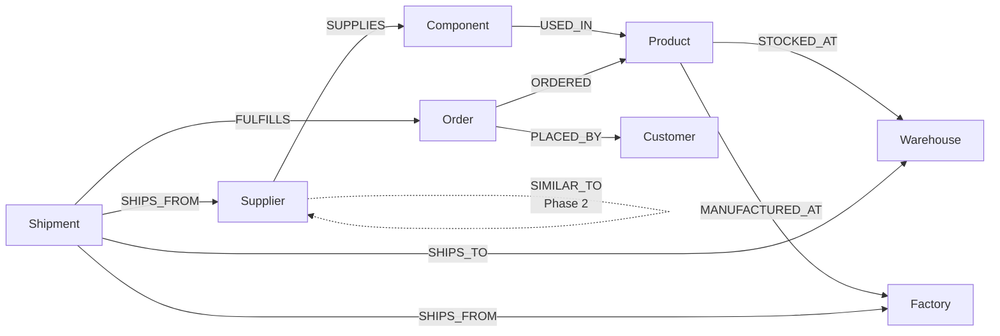
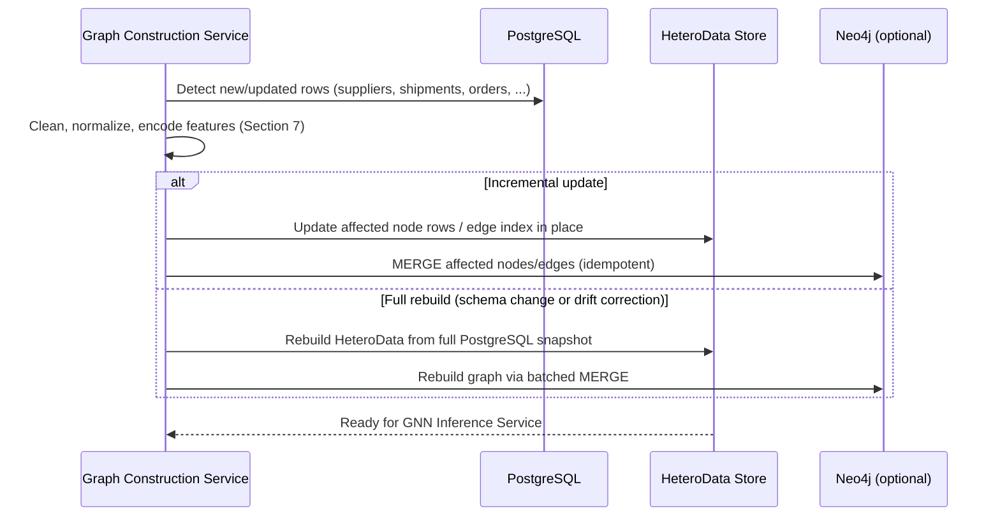

# Document 6 — Graph Database Design

## Graph Neural Network and Generative AI-Based Supply Chain Risk Prediction System

Version: 1.0
Status: Baseline
Consistent with: Documents 1–5

---

## 1. Purpose

This document defines the heterogeneous graph representation of the supply chain: node types, edge types, their properties, indexing strategy, embedding storage, and update mechanics. Two representations are covered, per Document 2's technology stack: the **tensor representation** (PyTorch Geometric `HeteroData`) used for GNN training/inference, and the **optional Neo4j representation** used for ad hoc querying and visualization convenience — both are built from the same PostgreSQL source of truth (Document 5) and must stay structurally identical.

## 2. Scope

Covers graph construction output (Layer 1) and the embeddings/explanation data produced by Layer 2, as consumed by the GNN Inference Service (Document 2, Section 4) and, in Phase 2, the Alternative-Supplier Recommender and What-If Simulator.

## 3. Assumptions

- PostgreSQL (Document 5) remains the system of record; the graph (tensor or Neo4j) is a derived, rebuildable representation, never the primary store of truth for any entity.
- Neo4j is optional and used only for developer/analyst querying and cross-checking graph structure — the GNN training/inference pipeline depends only on the `HeteroData` tensor representation, so the system functions correctly even if Neo4j is not deployed.
- Graph rebuilds are cheap enough at prototype scale to run incrementally per Document 4's Graph Construction Flow.

## 4. Dependencies

Document 5 (source tables), Document 4 Section 6 (Graph Construction Flow), Document 10 (AI/ML Documentation — consumes this graph for training/inference), Document 2 Section 5 (technology stack: PyTorch Geometric, Neo4j optional).

## 5. Node Types

| Node Type | Source Table (Document 5) | Key Properties | Delivery Phase |
|---|---|---|---|
| `Supplier` | `suppliers` | `id`, `country`, `capacity_score`, `lead_time_days`, `reliability_history` | Phase 1 |
| `Component` | `components` | `id`, `component_type`, `unit_cost` | Phase 1 |
| `Product` | `products` | `id`, `sku`, `category` | Phase 1 |
| `Factory` | `factories` | `id`, `location`, `capacity_units_per_day` | Phase 1 |
| `Warehouse` | `warehouses` | `id`, `location`, `capacity_units` | Phase 1 |
| `Shipment` | `shipments` | `id`, `status`, `eta`, `carrier` | Phase 1 |
| `Order` | `orders` | `id`, `status`, `due_at`, `order_value` | Phase 1 |
| `Customer` | `customers` | `id`, `priority_tier` | Phase 1 (node), Phase 2 (consumed by allocation ranking) |

All node types additionally carry a `risk_embedding` vector property populated after each GNN inference run (Section 9).

## 6. Edge Types

| Edge Type | Source (from → to) | Derivation | Properties | Delivery Phase |
|---|---|---|---|---|
| `SUPPLIES` | `Supplier → Component` | `components.supplier_id` | `since` (optional) | Phase 1 |
| `USED_IN` | `Component → Product` | `product_components` | `quantity_required` | Phase 1 |
| `STOCKED_AT` | `Product → Warehouse` | `inventory` | `stock_level`, `reorder_threshold` | Phase 1 |
| `MANUFACTURED_AT` | `Product → Factory` | inferred from `shipments.factory_id` linkage to product's order fulfillment | — | Phase 1 |
| `SHIPS_FROM` | `Shipment → Supplier` / `Shipment → Factory` | `shipments.supplier_id` / `shipments.factory_id` | — | Phase 1 |
| `SHIPS_TO` | `Shipment → Warehouse` | `shipments.warehouse_id` | `eta`, `status` | Phase 1 |
| `FULFILLS` | `Shipment → Order` | `shipments.order_id` | — | Phase 1 |
| `ORDERED` | `Order → Product` | `order_items` | `quantity` | Phase 1 |
| `PLACED_BY` | `Order → Customer` | `orders.customer_id` | — | Phase 1 |
| `SIMILAR_TO` | `Supplier → Supplier` | derived at inference time from embedding cosine similarity (not persisted from PostgreSQL) | `similarity_score` | Phase 2 (Alternative-Supplier Recommender) |



## 7. Node and Edge Properties — Tensor Encoding

For the PyTorch Geometric `HeteroData` representation, each node type has a feature matrix `x` built from the properties above, normalized/encoded as follows:

| Node Type | Feature Encoding |
|---|---|
| `Supplier` | `[lead_time_days (scaled), reliability_history, capacity_score (scaled), one-hot country bucket]` |
| `Component` | `[unit_cost (scaled), one-hot component_type]` |
| `Product` | `[one-hot category]` |
| `Factory` | `[capacity_units_per_day (scaled), one-hot location bucket]` |
| `Warehouse` | `[capacity_units (scaled), one-hot location bucket]` |
| `Shipment` | `[days_to_eta, one-hot status]` |
| `Order` | `[days_to_due, one-hot status, order_value (scaled)]` |
| `Customer` | `[one-hot priority_tier]` |

Edge feature encodings (`edge_attr`) follow the same normalization principle for numeric properties (e.g., `quantity_required`, `stock_level`). Full feature engineering detail is in Document 10 (AI/ML Documentation), Section 5.

## 8. Cypher Examples (Neo4j, Optional Representation)

Used for developer inspection and Phase 2 explainability cross-checks, not by the training/inference pipeline itself.

```cypher
// Find all components a supplier provides, and the products that depend on them
MATCH (s:Supplier {id: $supplierId})-[:SUPPLIES]->(c:Component)-[:USED_IN]->(p:Product)
RETURN s.name, c.name, p.sku;

// Find all orders potentially affected by a supplier's delay
MATCH (s:Supplier {id: $supplierId})-[:SUPPLIES]->(:Component)-[:USED_IN]->(p:Product)
      <-[:ORDERED]-(o:Order)
RETURN DISTINCT o.id, o.status;

// Trace the explanation subgraph for a given risk score (Phase 1 explainability)
MATCH (n)
WHERE n.id IN $explanationNodeIds
OPTIONAL MATCH (n)-[r]-(m) WHERE m.id IN $explanationNodeIds
RETURN n, r, m;

// Phase 2: candidate alternative suppliers by component type and embedding similarity
MATCH (s:Supplier {id: $flaggedSupplierId})-[:SUPPLIES]->(c:Component {component_type: $componentType})
MATCH (alt:Supplier)-[:SUPPLIES]->(:Component {component_type: $componentType})
WHERE alt.id <> s.id
RETURN alt.id, alt.name, gds.similarity.cosine(s.risk_embedding, alt.risk_embedding) AS similarity
ORDER BY similarity DESC
LIMIT 5;
```

## 9. Embeddings

- The GNN Inference Service (Document 2, Section 4) produces a fixed-dimension embedding per node during every inference run (FR-GNN-06), stored as `risk_embedding` on each node in both the tensor representation (in-memory, per run) and, when Neo4j is deployed, persisted as a node property for query convenience.
- Embeddings are **not** persisted in PostgreSQL (Document 5); the relational store persists only the risk *scores* derived from them (`risk_scores` table), keeping the relational schema decoupled from model-internal representations.
- Phase 2's Alternative-Supplier Recommender (FR-REC-01) and vector-similarity Cypher query (Section 8) both consume this embedding directly — no new embedding computation is introduced for that feature, per the problem statement's design principle (Section 5.4, `problem_statement.md`).

## 10. Indexes

| Representation | Index | Purpose | Delivery Phase |
|---|---|---|---|
| Neo4j | `CREATE INDEX supplier_id_idx FOR (s:Supplier) ON (s.id)` | Fast node lookup by source-of-truth ID | Phase 1 |
| Neo4j | Composite index per node type on `id` (all 8 node types) | Fast node lookup across all entity types | Phase 1 |
| Neo4j | Vector index on `risk_embedding` (Neo4j vector index or GDS similarity graph projection) | Similarity search for Alternative-Supplier Recommender | Phase 2 |
| `HeteroData` (tensor) | Node ID → tensor-row mapping dictionary maintained per node type during graph assembly | O(1) lookup from PostgreSQL UUID to tensor row for inference/explanation mapping | Phase 1 |

## 11. Graph Updates

Graph updates follow the Graph Construction Flow defined in Document 4, Section 6. This section specifies the graph-representation-level mechanics:



- **Incremental update:** the default path (FR-GC-07); only the affected node's feature row and its adjacent edges are recomputed, keeping the update proportional to the change size rather than the graph size.
- **Full rebuild:** triggered by a schema change (e.g., a new node/edge type is added between Phase 1 and Phase 2) or by a periodic drift-correction job that reconciles the graph against PostgreSQL to catch any missed incremental updates.
- **Idempotency:** Neo4j updates use `MERGE`, not `CREATE`, so a replayed update does not duplicate nodes/edges.
- **What-If Simulator (Phase 2):** operates on an in-memory *copy* of the current `HeteroData` snapshot, edits are applied to that copy only, and the copy is discarded after scoring (FR-SIM-04) — it never reaches the update path described above.

## 12. Risks

| ID | Risk | Mitigation | Delivery Phase |
|---|---|---|---|
| GD-01 | Maintaining two graph representations (tensor + optional Neo4j) risks drift between them | Both are derived from the same PostgreSQL source via the same Graph Construction Service; Neo4j is documented as optional and non-authoritative | Phase 1 |
| GD-02 | `MANUFACTURED_AT` edge is inferred rather than directly foreign-keyed in PostgreSQL, risking incorrect inference on ambiguous data | Restrict inference to shipments with an unambiguous factory-to-product link; flag ambiguous cases as a data-quality warning (NFR-17) | Phase 1 |
| GD-03 | `SIMILAR_TO` edges are computed at query time, not persisted, which could be slow at larger scale | Acceptable at prototype scale (NFR-02); Neo4j vector index (Section 10) mitigates cost if adopted | Phase 2 |
| GD-04 | `Customer` node carries only `priority_tier` as a learned feature; richer `contract_terms` (Document 5, Section 6.24) are not encoded into the tensor representation | The OR-Tools customer-allocation optimizer (FR-CUST-02) reads `contract_terms` directly from PostgreSQL rather than through the graph, so this is a scope choice, not a gap — the GNN does not need contract detail to predict shortage risk | Phase 2 |

## 13. Future Extension

If unstructured document volume grows (Document 1, Section 15), additional node/edge types (e.g., a `Contract` node linked to `Supplier`) could be introduced following the same node-property/edge-derivation pattern established in Sections 5–6, without altering the existing eight node types.

## 14. Optimization Constraint Inputs (Decision Intelligence / OR-Tools)

The OR-Tools optimization engine (Document 1, Section 8.16; `problem_statement.md`, Section 5.7) does not query the graph or GNN embeddings directly — the Decision Intelligence Service (Document 2, Section 4) assembles its constraint set from the same PostgreSQL source-of-truth properties already listed as node properties in Section 5, read directly rather than through the tensor/Neo4j representation:

| Constraint | Source Node Property (Section 5) | Used By |
|---|---|---|
| Inventory availability | `Product`/`Warehouse` via `inventory.stock_level` (Document 5, Section 6.8) | Safety-stock, PO-split, customer allocation |
| Supplier capacity | `Supplier.capacity_score` | PO-split, customer allocation |
| Warehouse capacity | `Warehouse.capacity_units` | Customer allocation |
| Production capacity | `Factory.capacity_units_per_day` | Customer allocation |
| Lead time | `Supplier.lead_time_days` | Safety-stock, PO-split, customer allocation |

No new node/edge type or tensor feature is required for this — these fields already exist as node properties (Section 5) for the GNN's own use; the optimizer simply reads them a second time, directly, for a different purpose (a deterministic constraint, not a learned feature).

- **Delivery Phase:** Phase 2

---

## Document Control

- **Purpose:** Section 1. **Scope:** Section 2. **Assumptions:** Section 3. **Dependencies:** Section 4. **Risks:** Section 12. **Future Extension:** Section 13. **Optimization Constraint Inputs:** Section 14.
- Baseline for Document 10 (AI/ML Documentation).
