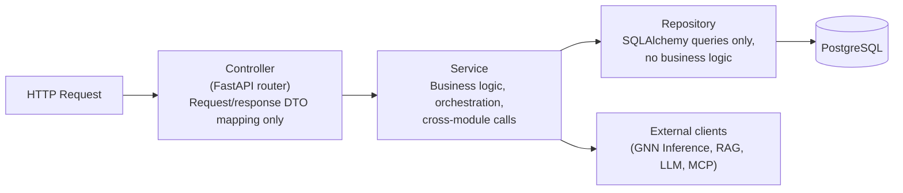

# Document 8 — Backend Design

## Graph Neural Network and Generative AI-Based Supply Chain Risk Prediction System

Version: 1.0
Status: Baseline
Consistent with: Documents 1–7

---

## 1. Purpose

This document defines the backend's internal software design: folder structure, module boundaries, service/repository/controller layering, DTOs, validation, caching, queues, background jobs, and how authentication/authorization are enforced in code. It operationalizes the components defined in Document 2 and the schema defined in Document 5.

## 2. Scope

Covers the FastAPI-based backend (API Gateway plus the services listed in Document 2, Section 4) for both phases. Each Phase 2 service is added as a new module following the same layering convention established in Phase 1 — no Phase 1 module is restructured to accommodate Phase 2.

## 3. Assumptions

- Python 3.11+ with FastAPI, SQLAlchemy (async) as ORM, Pydantic for DTO/schema validation.
- A modular monolith is used for Phase 1 (all core services as Python modules within one deployable, per Document 2's container-per-service note being a *deployment* packaging choice, not necessarily separate codebases) — each module remains independently testable and could be split into a separate deployable without code restructuring if needed.
- Redis is introduced in Phase 2 for caching and lightweight queueing; Phase 1 has no caching/queueing requirement significant enough to justify the dependency.

## 4. Dependencies

Document 2 (components, technology stack), Document 5 (schema the repository layer implements against), Document 9 (controllers implement these exact endpoint contracts), Document 12 (security controls implemented in the auth/authorization layer).

## 5. Folder Structure

```
backend/
├── app/
│   ├── main.py                      # FastAPI app factory, router registration
│   ├── core/
│   │   ├── config.py                 # Environment-based settings (Document 11)
│   │   ├── security.py               # JWT issuance/validation, password hashing
│   │   └── logging.py                # Structured logging setup (Document 2 §10)
│   ├── modules/
│   │   ├── auth/
│   │   │   ├── controller.py         # /api/v1/auth/*
│   │   │   ├── service.py
│   │   │   ├── repository.py
│   │   │   ├── dto.py
│   │   │   └── models.py             # SQLAlchemy: users
│   │   ├── graph_construction/
│   │   │   ├── controller.py
│   │   │   ├── service.py
│   │   │   ├── repository.py
│   │   │   ├── dto.py
│   │   │   ├── parsing.py            # lightweight document parsing (FR-GC-05)
│   │   │   └── models.py             # suppliers, components, products, ... (Document 5)
│   │   ├── prediction/
│   │   │   ├── controller.py         # /api/v1/predictions/*
│   │   │   ├── service.py
│   │   │   ├── repository.py
│   │   │   ├── dto.py
│   │   │   └── models.py             # risk_scores, explanation_subgraphs
│   │   ├── rag/                      # Phase 2
│   │   │   ├── controller.py
│   │   │   ├── service.py
│   │   │   ├── repository.py
│   │   │   └── dto.py
│   │   ├── llm/                      # Phase 2
│   │   │   ├── service.py
│   │   │   ├── prompt_templates.py
│   │   │   └── business_rules.py
│   │   ├── chatbot/                  # Phase 2
│   │   │   ├── controller.py         # /api/v1/chat/*
│   │   │   ├── service.py
│   │   │   ├── repository.py
│   │   │   ├── dto.py
│   │   │   └── models.py             # chat_sessions, chat_messages
│   │   ├── simulation/               # Phase 2
│   │   │   ├── controller.py         # /api/v1/simulate/*
│   │   │   └── service.py
│   │   ├── recommendation/           # Phase 2
│   │   │   ├── controller.py         # /api/v1/recommendations/*
│   │   │   └── service.py
│   │   ├── approval/                 # Phase 2
│   │   │   ├── controller.py         # /api/v1/approvals/*
│   │   │   ├── service.py
│   │   │   ├── repository.py
│   │   │   ├── dto.py
│   │   │   └── models.py             # action_requests
│   │   ├── mcp_execution/            # Phase 2
│   │   │   ├── service.py
│   │   │   ├── adapters/             # ERP/procurement MCP server adapters
│   │   │   └── models.py             # action_log
│   │   ├── alerts/                   # Phase 2
│   │   │   ├── controller.py         # /api/v1/alerts/*
│   │   │   ├── service.py
│   │   │   ├── repository.py
│   │   │   └── models.py             # alerts, alert_thresholds
│   │   ├── notifications/            # Phase 2
│   │   │   ├── service.py
│   │   │   └── models.py             # notifications
│   │   └── audit/
│   │       ├── controller.py         # /api/v1/audit/*
│   │       ├── service.py
│   │       └── models.py             # audit_log
│   ├── shared/
│   │   ├── dependencies.py           # FastAPI dependency-injection: current_user, db session
│   │   ├── pagination.py
│   │   ├── exceptions.py             # domain exception hierarchy
│   │   └── cache.py                  # Redis client wrapper (Phase 2)
│   └── jobs/
│       ├── graph_rebuild_job.py
│       ├── evidence_reindex_job.py   # Phase 2
│       └── alert_evaluation_job.py   # Phase 2
├── ml/
│   ├── gnn/                          # model definitions, training, inference (Document 10)
│   └── serving/                      # inference service entrypoint
├── migrations/                       # Alembic migrations (Document 5, Section 7)
└── tests/                            # Document 13
```

## 6. Modules

Each module in `app/modules/` maps 1:1 to a component in Document 2, Section 4, and owns its own controller, service, repository, DTOs, and SQLAlchemy models — no module reaches into another module's repository directly; cross-module calls go through the other module's service interface.

| Module | Maps to Component (Document 2) | Delivery Phase |
|---|---|---|
| `auth` | Auth Service | Phase 1 |
| `graph_construction` | Graph Construction Service | Phase 1 |
| `prediction` | GNN-Transformer Inference Service | Phase 1 |
| `audit` | (cross-cutting) | Phase 1 |
| `rag` | RAG Retrieval Service | Phase 2 |
| `llm` | LLM Orchestration Service | Phase 2 |
| `chatbot` | Chatbot Service | Phase 2 |
| `simulation` | (part of Prediction, exposed separately) | Phase 2 |
| `recommendation` | (part of Prediction, exposed separately) | Phase 2 |
| `approval` | (part of MCP Execution Service's approval gate) | Phase 2 |
| `mcp_execution` | MCP Execution Service | Phase 2 |
| `alerts` | (part of MCP Execution Service) | Phase 2 |
| `notifications` | Notification Service | Phase 2 |

## 7. Layering: Controllers, Services, Repositories



- **Controller:** validates the request shape via a Pydantic DTO, calls exactly one service method, maps the service result/exception to an HTTP response. No business logic.
- **Service:** implements the flows defined in Document 4 (e.g., `ApprovalService.approve()` implements the Approval Flow's approve branch). May call other modules' services and external clients (GNN Inference, RAG, LLM, MCP).
- **Repository:** thin SQLAlchemy query layer over the schema in Document 5. No business rules — e.g., the "rejection reason required" rule (Document 5, Section 6.17) lives in `ApprovalService`, not `ApprovalRepository`.

## 8. DTOs

Pydantic models define the request/response contracts consumed by Document 9's endpoint specs. Convention: `<Entity>CreateDTO`, `<Entity>ResponseDTO`, `<Entity>UpdateDTO` per module. DTOs never expose SQLAlchemy models directly to the API layer — every controller response is mapped through a `ResponseDTO`, keeping schema evolution (Document 5, Section 7 migrations) from silently changing the public API contract.

Example (`prediction/dto.py`):

```python
class RiskScoreResponseDTO(BaseModel):
    entity_type: Literal["supplier", "product", "order", "shipment"]
    entity_id: UUID
    delay_probability: float | None
    shortage_risk: float | None
    impact_score: float
    model_version: str
    scored_at: datetime

class ExplanationSubgraphResponseDTO(BaseModel):
    nodes: list[ExplanationNodeDTO]
    edges: list[ExplanationEdgeDTO]
```

## 9. Validation

| Layer | Validation | Delivery Phase |
|---|---|---|
| DTO (Pydantic) | Field types, required fields, enum membership, numeric ranges (mirrors Document 5 CHECK constraints) | Phase 1 |
| Service | Cross-field/business rules not expressible as a single-field constraint (e.g., `rejection_reason` required when rejecting, Document 5 §6.17) | Phase 1 (auth rules), Phase 2 (approval rules) |
| Database | CHECK constraints, foreign keys, UNIQUE constraints as the final integrity backstop (Document 5) | Phase 1 |

Validation is layered so that a bug in service-level logic cannot corrupt data — the database constraint is always the backstop, per Document 5's constraint definitions.

## 10. Caching

Introduced in Phase 2 (Redis), where repeated, expensive calls exist that did not exist in Phase 1's simpler read/compute pattern:

| Cache | Key | TTL | Purpose | Delivery Phase |
|---|---|---|---|---|
| Prediction snapshot cache | `predictions:{graph_snapshot_id}` | Until next graph update | Avoid recomputing GNN inference for identical graph state across concurrent dashboard/chatbot requests (Document 4, Section 15 risk AF-01) | Phase 2 |
| RAG retrieval cache | `rag:{query_hash}:{entity_id}` | 10 minutes | Reduce redundant vector search for repeated chatbot questions in a session | Phase 2 |
| Session cache | Chatbot session context | Session lifetime | Fast reload of recent conversation turns without re-querying `chat_messages` on every turn | Phase 2 |

Phase 1 has no caching layer: inference and dashboard reads are direct, since NFR-01/NFR-02 targets are met without one at prototype scale.

## 11. Queues and Background Jobs

| Job/Queue | Trigger | Purpose | Delivery Phase |
|---|---|---|---|
| `graph_rebuild_job` | Scheduled (e.g., hourly) + on-demand incremental trigger | Runs the Graph Construction Flow (Document 4, Section 6) | Phase 1 |
| `evidence_reindex_job` | New document ingested | Chunk/embed/index new evidence into the vector store without downtime (FR-RAG-04) | Phase 2 |
| `alert_evaluation_job` | After each `prediction` run completes | Evaluates new risk scores against `alert_thresholds` (Document 4, Section 11) | Phase 2 |
| `notification_dispatch_queue` | Alert created | Async dispatch to Slack/email via MCP, decoupling notification delivery latency from the alert-creation request path | Phase 2 |

Phase 1 uses a simple scheduled task runner (e.g., APScheduler) for `graph_rebuild_job`; Phase 2's higher job volume and need for retry/backoff (notification delivery, re-indexing) justifies introducing a lightweight task queue (e.g., Redis-backed) at that point, not before.

## 12. Authentication

Implemented in `core/security.py` and the `auth` module, per the Authentication Flow (Document 4, Section 5):

- Password hashing: `argon2` (or `bcrypt`) via `passlib`.
- JWT issuance: access token (short TTL) + refresh token (longer TTL), signed with a server-side secret sourced from environment configuration (Document 11).
- `shared/dependencies.py` exposes a `get_current_user` FastAPI dependency that every non-login controller route requires, decoding and validating the JWT, resolving the `users` row, and rejecting expired/invalid/deactivated-user tokens.

## 13. Authorization

RBAC is enforced via a `require_role(*roles)` FastAPI dependency layered on top of `get_current_user`:

```python
@router.post("/api/v1/approvals/{id}/approve")
async def approve_action(
    id: UUID,
    user: User = Depends(require_role("approver", "admin")),
    service: ApprovalService = Depends(get_approval_service),
):
    return await service.approve(id, actor=user)
```

| Role | Enforced On (examples) | Delivery Phase |
|---|---|---|
| `admin` | User management, alert threshold configuration | Phase 1 (users), Phase 2 (thresholds) |
| `analyst` | Read access to graph/prediction/dashboard endpoints; recommendation viewing | Phase 1 |
| `approver` | Approve/reject action_requests | Phase 2 |

Authorization is enforced at the controller layer (via dependency) as the single source of truth; the frontend's role-based UI hiding (Document 3, Section 7) is a UX convenience only, never the security boundary, per Document 2 Section 9.

## 14. Risks

| ID | Risk | Mitigation | Delivery Phase |
|---|---|---|---|
| BD-01 | Modular-monolith boundaries could erode over time if a service reaches into another module's repository | Code review convention + import-linting rule restricting cross-module repository imports | Phase 1 |
| BD-02 | Introducing Redis in Phase 2 adds an operational dependency not present in Phase 1 | Scoped narrowly to caching/queueing (Section 10–11); Phase 1 functionality has no dependency on it | Phase 2 |
| BD-03 | Background jobs (Section 11) failing silently could leave the graph or alerts stale without visibility | Job run status logged and exposed via the monitoring approach in Document 2, Section 11 | Phase 1 (graph job), Phase 2 (alert/notification jobs) |

## 15. Future Extension

The modular-monolith structure (Section 3 assumption) allows any module in `app/modules/` to be extracted into its own deployable service later (per Document 2's container-per-service target) without changing its internal controller/service/repository layering — only its process boundary changes.

---

## Document Control

- **Purpose:** Section 1. **Scope:** Section 2. **Assumptions:** Section 3. **Dependencies:** Section 4. **Risks:** Section 14. **Future Extension:** Section 15.
- Baseline for Document 9 (REST API Documentation).
