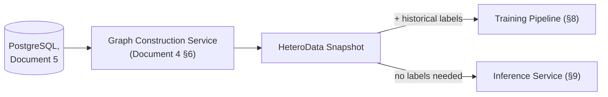
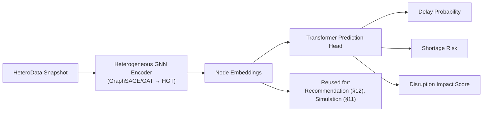

# Document 10 — AI/ML Documentation

## Graph Neural Network and Generative AI-Based Supply Chain Risk Prediction System

Version: 1.0
Status: Baseline
Consistent with: Documents 1–9

---

## 1. Purpose

This document specifies the machine learning design: feature engineering, graph construction inputs, node/edge features, training procedure, inference serving, evaluation methodology, metrics, explainability, model governance, the Risk Intelligence and Decision Intelligence methodologies, and the recommendation/optimization mechanisms. It is the ML-level contract implementing Layer 2 (GNN × Transformer / Graph Intelligence) of the problem statement, plus the two intelligence layers immediately downstream of it, and Phase 2 consumers (RAG grounding context, Alternative-Supplier Recommender).

## 2. Scope

- **Phase 1:** feature engineering, graph construction, GNN-Transformer model trained and evaluated as a progressive, evidence-based architecture ablation (GraphSAGE → GAT → HGT, Section 8.4) with governance metadata (Section 8.5), inference (incl. confidence signal, Section 9), persisted evaluation metrics (Section 10), explainability (GNNExplainer), the transparent weighted risk formula as a business aggregation layer (Section 16), and the Risk Intelligence methodology (Section 18).
- **Phase 2:** the same trained model reused (not redesigned) for the What-If Simulator (re-inference on perturbed graph) and the Alternative-Supplier Recommender (embedding similarity) — no new model architecture is introduced for either. The Decision Intelligence methodology (Section 19) and the OR-Tools optimization engine, including customer allocation as a constrained optimization problem (Section 17), similarly reuse Layer 2's/Risk Intelligence's outputs as solver inputs rather than introducing a new predictive model; the LLM explains these outputs but never computes them.

## 3. Assumptions

- Historical labels for "delay occurred" and "shortage occurred" exist (or are derivable) in the source data at a volume sufficient for supervised training, per Document 1, Section 12 assumption and Section 8 (Limitations) acknowledgment.
- Model training is offline/batch (not online/continuous learning); the inference service (Document 2, Section 4) serves a fixed model artifact until the next training run.
- GNNExplainer (or an equivalent perturbation-based explainer) provides sufficiently faithful explanations for a prototype; full explainability research rigor is out of scope for Phase 1.

## 4. Dependencies

Document 5 (source tables), Document 6 (graph node/edge types and tensor encoding — Section 7 of that document is the direct input to Section 5 here), Document 8 (`ml/gnn/` module location), Document 2 (technology stack: PyTorch, PyTorch Geometric, GraphSAGE/GAT, Heterogeneous Graph Transformer, GNNExplainer, Monte Carlo simulation).

## 5. Feature Engineering

Feature engineering operates on the `HeteroData` tensor representation defined in Document 6, Section 7. This section adds the derivation logic behind those encodings.

| Feature | Derivation | Node/Edge |
|---|---|---|
| `lead_time_days` (scaled) | Min-max or z-score normalization over historical `suppliers.lead_time_days` | Supplier node |
| `reliability_history` | Rolling on-time delivery rate over the last N shipments per supplier, computed from `shipments.status`/`eta`/`delivered_at` history | Supplier node |
| `capacity_score` (scaled) | Normalized supplier-reported or inferred capacity | Supplier node |
| `days_to_eta` / `days_to_due` | `eta - now()` / `due_at - now()` in days, recomputed at each graph snapshot | Shipment / Order node |
| `stock_level`, `reorder_threshold` | Direct from `inventory`, scaled | `STOCKED_AT` edge |
| `quantity_required` | Direct from `product_components`, scaled | `USED_IN` edge |
| One-hot categoricals | `component_type`, `category`, `location` bucket, `status` fields | Various nodes/edges |
| Label: `delayed` | Derived from `shipments.status = 'delayed'` or `delivered_at > eta` historically | Supplier/Shipment supervision target |
| Label: `shortage` | Derived from historical `inventory.stock_level` dropping below `reorder_threshold` while linked orders remained open | Product/Warehouse supervision target |

## 6. Graph Construction (ML Input)

The training/inference input graph is exactly the `HeteroData` object produced by the Graph Construction Service (Document 4, Section 6; Document 6). No separate ML-only graph construction path exists — this guarantees training-serving consistency: the same code path that assembles the graph for inference also assembles it for training, differing only in whether historical labels are attached.



## 7. Node Features and Edge Features (Summary Table)

Restated from Document 6, Section 7, for ML-document completeness — this document is the authority on *why* each encoding was chosen; Document 6 is the authority on *what* the encoding is.

| Node Type | Feature Vector Components | Dimensionality (approx.) |
|---|---|---|
| Supplier | lead time, reliability, capacity, country one-hot | ~15 |
| Component | unit cost, component_type one-hot | ~10 |
| Product | category one-hot | ~8 |
| Factory | capacity, location one-hot | ~10 |
| Warehouse | capacity, location one-hot | ~10 |
| Shipment | days_to_eta, status one-hot | ~6 |
| Order | days_to_due, status one-hot | ~6 |

| Edge Type | Feature Vector Components |
|---|---|
| `USED_IN` | quantity_required (scaled) |
| `STOCKED_AT` | stock_level, reorder_threshold (scaled) |
| `SHIPS_TO` | eta proximity, status one-hot |
| Others (`SUPPLIES`, `SHIPS_FROM`, `FULFILLS`, `ORDERED`) | structural only (no numeric edge feature beyond existence) |

## 8. Training

### 8.1 Model Architecture

A two-stage hybrid, per the problem statement's "GNN x Transformer" framing:

1. **Heterogeneous GNN encoder** (GraphSAGE / GAT baseline, upgraded to a Heterogeneous Graph Transformer) — message-passing over the typed node/edge graph to produce contextualized node embeddings, capturing multi-hop relationships (e.g., a supplier's risk propagating through `Component → Product → Order`).
2. **Transformer prediction head** — attends **globally over all node embeddings**, not only a node's immediate neighborhood, to produce the final delay/shortage/impact scores. This is an immediate, independent correction to this document (ships Phase 1, unrelated to the Layer 2 upgrade in Section 8.6 below): a neighborhood-scoped head cannot reliably close the 4-hop Supplier→Component→Product→Order→Customer BOM path within the encoder's own message-passing reach, so the prediction head's own attention — not an additional hop — is what closes that reach gap. This correction changes only the prediction head's attention scope; the encoder (item 1) is unchanged.



### 8.2 Training Procedure

| Step | Detail |
|---|---|
| Data split | Time-based split (train on earlier history, validate/test on later history) to avoid leakage and reflect real forecasting conditions |
| Loss function | Binary cross-entropy for delay/shortage classification heads; combined/weighted loss for the joint impact score |
| Optimizer | Adam / AdamW with learning-rate scheduling |
| Regularization | Dropout in GNN layers, edge dropout, early stopping on validation AUC |
| Class imbalance handling | Class-weighted loss or focal loss, since disruptions are a minority class in typical supply chain data |
| Training environment | Offline batch job (`ml/gnn/` per Document 8, Section 5), not part of the request-serving path |

### 8.3 Retraining Trigger

Phase 1: manual/scheduled retraining as new historical data accumulates. Continuous/automated retraining (MLOps pipeline) is explicitly Future Scope per Document 1, Section 15 — not required for the prototype.

### 8.4 Architecture Ablation Methodology (FR-ABL-01/02)

Section 8.1's encoder progression is not presented as a given — it is demonstrated by training and evaluating all three stages on the same held-out test set, and each stage exists to answer a specific research question the prior stage left open:

| Stage | Architecture | `model_version` (example) | Why this stage was run | Documented limitation motivating the next stage |
|---|---|---|---|---|
| 1 | GraphSAGE | `graphsage-v1` | Establishes whether neighborhood aggregation over the supply-chain graph beats row-by-row baselines at all, using simple mean/pooling aggregation with no attention | Every neighbor is weighted equally — the model cannot express that one supplier's delay matters more than another's to a given product's risk |
| 2 | GAT (Graph Attention Network) | `gat-v1` | Adds attention so the model learns *which* neighbors matter for a given prediction, directly testing whether attention improves over Stage 1's uniform aggregation | Treats the graph as effectively homogeneous — a `SUPPLIES` edge and a `SHIPS_TO` edge, or a `Supplier` node and a `Warehouse` node, are not distinguished by the attention mechanism |
| 3 | Heterogeneous Graph Transformer (HGT) — **final, committed** | `hgt-v1` | Chosen because the supply chain graph is natively multi-typed (7+ node types, 8+ edge types per Document 6, Sections 5–6); HGT's type-aware attention is the first stage that models "this is a supplier-to-component relationship, weighted differently than a shipment-to-warehouse relationship" directly | Highest computational cost of the three — justified only because Stages 1–2 demonstrate the need, not assumed up front |
| 4 | HGT + dual Transformer heads + Markov scoping — **Not committed** (Section 8.6) | `hgt-xga-jkt-v1` (example) | Would extend Stage 3 with intermediate-layer retention, per-node depth attention, type-constrained global attention, and a tested depth-sufficiency claim, per `updates/Supplier_Risk_Prediction.md` §9 | N/A — this stage is **Not committed — Phase 2 (early April 2027) or later; stretch-only before then, and only after RG-01 is solid.** It exists here only as a placeholder so the ablation table's shape already anticipates a fourth row without implying the row is scheduled. |

- Each stage is trained under identical data split, loss function, and regularization settings (Section 8.2) so the comparison isolates the effect of the encoder architecture, not confounding training-procedure differences. Stage 4 is excluded from this requirement until it is committed — it is a placeholder row, not a scheduled run.
- Each stage's evaluation metrics (Section 10) are persisted to `model_evaluation_runs` (Document 5, Section 6.23) under its own `model_version`/`architecture` pair, immutable and append-only.
- The Model Comparison screen (Document 3, Section 6.19) and its backing endpoint (Document 9, Section 9.4) surface all three side by side, along with this rationale, so the final architecture selection is a documented comparison rather than an asserted choice.
- **Delivery Phase:** Phase 1

### 8.5 Model Governance Metadata (FR-GOV-01/02)

Alongside `model_evaluation_runs`, each training run writes one `model_registry` row (Document 5, Section 6.25):

| Field | Source | Purpose |
|---|---|---|
| `training_dataset` | Dataset snapshot identifier used for that run | Reproducibility — which data produced this model |
| `training_timestamp` | Training pipeline start time | When the model was trained, independent of when it was evaluated |
| `experiment_id` | Training pipeline run ID | Cross-reference to experiment tracking logs (Document 2, Section 10) |
| `git_commit` | Git SHA of the training code at run time | Reproducibility — which code version produced this model |
| `hyperparameters` | Training config (learning rate, layers, dropout, etc.) | Reproducibility and comparison across runs |
| `parameter_count` | Model's total trainable parameter count | Cost/complexity comparison across the ablation (Section 8.4) |
| `status` | Lifecycle state (`training`/`evaluating`/`candidate`/`active`/`archived`) | Which model version is currently serving inference (Section 9) |

This is intentionally lightweight — a version, dataset reference, experiment ID, git commit, and hyperparameters per run — not a full MLOps registry with automated promotion/rollback (Document 1, Section 12 assumption). The training pipeline writes these fields directly; they are never entered manually, so they cannot drift from what was actually run (Document 1, Risk R-14).

- **Delivery Phase:** Phase 1

### 8.6 Layer 2 Architecture Upgrade — Not Committed

**Delivery Phase: Not committed — Phase 2 (early April 2027) or later; stretch-only before then, and only after RG-01 is solid.** Full specification lives entirely in `updates/Supplier_Risk_Prediction.md`; this subsection is a pointer, not a duplicate.

A proposed four-component upgrade to Section 8.1's encoder/head: (1) a 4-layer HGT encoder retaining all intermediate layer outputs instead of only the last; (2) Transformer 1, a per-node depth attention head (Jumping Knowledge style, Xu et al. 2018) whose learned weights become the empirical test of a depth-sufficiency hypothesis ("Markov Claim A"); (3) Transformer 2, a type-constrained global attention head discovering correlated hidden dependencies between suppliers with no recorded connection; and (4) a "Markov scoping" principle splitting Claim A (tested here) from Claim B (dyadic risk, which belongs to the Risk Intelligence Layer, Section 18.1). See `updates/Supplier_Risk_Prediction.md` Sections 6–11 for the full component specifications, required fixes (same-type attention constraint, dual-run training methodology), data model changes, training protocol, ablation design (Section 8.4, Stage 4 above), and honest pros/cons treatment.

This upgrade does not change anything else in this document — Sections 8.1–8.5 and 9–20 describe the system as it exists today and remain fully in force regardless of whether this upgrade is ever built.

### 8.7 Multi-Task Training Strategy (Phase 2 Addition)

Full detail: `updates/New_Features.md` Section 6. Summary, cross-referenced rather than duplicated:

- **Link prediction as pretraining, not just another head:** train a DistMult/MLP link-prediction decoder over the shared encoder first, using the full existing edge set (abundant labels, no disruption labels needed), then fine-tune the same encoder on the sparse supervised risk-prediction task (Section 8.1), initializing from the pretrained weights. This is the primary proposed mitigation for the class-imbalance risk (ML-01) — a task with abundant labels improving a task that doesn't have them, because they share weights.
- **A small, homogeneous jointly-trained head set:** only the core risk heads (delay, shortage, impact) plus compatible new supervised heads (lead-time regression, component criticality, order-at-risk, if committed) train jointly, once pretraining is done. Link prediction, clustering, and no-model analytical readouts are deliberately excluded from the joint loss to avoid their very different label volume/character drowning out the scarce disruption-label signal.
- **Delivery Phase:** Phase 2 — this section's link-prediction-decoder and joint-head-set additions are new supplementary tasks (`updates/New_Features.md` F-05, F-06, F-09, F-11), independent of the Layer 2 upgrade in Section 8.6, and independent of each other's individual commitment status.

## 9. Inference

Served by the GNN Inference Service (Document 2, Section 4; Document 8's `ml/serving/`):

- Loads the latest trained model artifact — the `model_registry` row with `status='active'` (Section 8.5) — and the current `HeteroData` snapshot (Section 6).
- Runs a forward pass to produce delay probability, shortage risk, and impact score per entity (FR-GNN-01–03).
- Computes a raw confidence signal (e.g., prediction-head softmax margin or MC-dropout variance across a small number of stochastic forward passes) alongside the scores; this raw signal is what the Risk Intelligence Layer (Section 18) turns into the `confidence` value exposed on `risk_scores` (FR-RISKINT-01) — the inference service produces the signal, Risk Intelligence owns its interpretation and exposure.
- Traces affected products/orders via graph reachability from the flagged entity (FR-GNN-04).
- Returns node embeddings alongside scores (FR-GNN-06) for Phase 2 reuse.
- Inference is stateless per request and does not mutate the persisted graph, satisfying NFR-01's latency target by avoiding any write path in the hot request.

## 10. Evaluation and Metrics

| Metric | Applies To | Target (Document 1, Section 11) |
|---|---|---|
| AUC-ROC | Delay probability, shortage risk classification | ≥ 0.80 on held-out test set |
| Precision / Recall | Delay/shortage classification at the operating threshold used for alerts (Phase 2) | Reported per class; tuned jointly with alert threshold (FR-MCP-06) to manage false-positive rate (NFR-18) |
| Calibration | Predicted probability vs. observed frequency (reliability diagram) | Reasonably calibrated so a "78%" delay probability is interpretable at face value in the chatbot's plain-language explanation (Phase 2) |
| Explanation fidelity (qualitative) | GNNExplainer subgraph | Evaluator review — does the highlighted subgraph match domain-plausible causes | Phase 1 |
| Embedding usefulness (qualitative) | Alternative-supplier recommendations | ≥ 80% judged plausible by evaluator (Document 1, Section 11) | Phase 2 |
| Inference time (`metric_name='inference_time_ms'`) | Per-entity forward-pass latency, measured at evaluation time | Reported per architecture — a direct cost input to the ablation comparison (Section 8.4), alongside `model_registry.parameter_count` (Section 8.5) | Phase 1 |

Evaluation runs are logged per Document 2, Section 11 (Monitoring — "model performance"), and persisted as `model_evaluation_runs` rows (Document 5, Section 6.23) — Precision, Recall, F1, ROC-AUC, and inference time for the classification heads, plus MAE/RMSE/MAPE if a regression head is added — keyed by `model_version`, **`task`** (Document 5, Section 6.23 amendment), and `architecture` so results are queryable and comparable across the ablation (Section 8.4), not only visible in training logs (FR-EVAL-01/02). Parameter count and other governance facts live on `model_registry` (Section 8.5) rather than as a repeated metric row, since they are per-model constants, not per-evaluation measurements.

**Supplementary-task metrics (Phase 2, `updates/New_Features.md` Section 7 — full per-task table there, summarized here):** lead-time regression uses MAE/RMSE/MAPE; component criticality uses Spearman rank correlation against the SPOF traversal's independent, non-ML impact measure (a moderate-confidence result, not equivalent in evidentiary weight to the classification heads above); hidden link prediction uses AUC-ROC/Average Precision on held-out edges, directly comparable to Kosasih & Brintrup (2021) and Aziz et al. (2021, arXiv:2107.10609)'s 0.877 test AUC benchmark; supplier segmentation uses silhouette score/Davies-Bouldin index (no ground truth exists for clustering). **SPOF, geographic, and spend concentration analyses (Phase 1) use no ML metric at all and are never persisted to `model_evaluation_runs`** — they are graph/SQL analyses, evaluated only by manual domain-plausibility review, the same qualitative pattern already used for GNNExplainer subgraph fidelity above.

## 11. What-If Simulation Support

The trained model from Section 8 is reused unmodified:

- A copy of the current `HeteroData` snapshot has one or more node/edge features overridden per the user's simulated change (e.g., `lead_time_days` doubled).
- Inference (Section 9) runs again on this copy only.
- Monte Carlo simulation utilities (Document 2, Section 5) may be layered on top to sample multiple perturbation scenarios and report a distribution of outcomes rather than a single point estimate, where the UI (Document 3, Section 6.12) calls for a range.
- The persisted graph and model are never touched by this path (FR-SIM-04).
- **Delivery Phase:** Phase 2

## 12. Explainability

- **Mechanism:** GNNExplainer (or equivalent perturbation-based subgraph explainer) identifies the minimal subgraph of nodes/edges most responsible for a given prediction, producing per-node and per-edge contribution weights (Document 5, Section 6.14 schema).
- **Phase 1 output:** the explanation subgraph is computed and persisted for every high-risk prediction; the dashboard renders it as a basic highlight (Document 3, FR-EXP-01 Phase 1 scope).
- **Phase 2 extension:** the same subgraph is color-coded by risk level and synchronized with chatbot answers (FR-EXP-02/03) — purely a presentation-layer extension, no new explainability computation.
- **Delivery Phase:** Phase 1 (computation), Phase 2 (full visual integration)

## 13. Recommendation (Alternative-Supplier)

- **Mechanism:** cosine similarity over the Section 8 model's learned supplier embeddings, filtered to suppliers providing the same `component_type` (FR-REC-01/02), computed via the Cypher/GDS query in Document 6, Section 8, or an equivalent in-process nearest-neighbor search over the embedding tensor.
- **No new model:** this reuses Layer 2's embeddings exactly as the problem statement specifies (Section 5.4, `problem_statement.md`) — there is no separate recommendation model to train or evaluate beyond the qualitative plausibility check in Section 10.
- **Delivery Phase:** Phase 2

## 14. Risks

| ID | Risk | Mitigation | Delivery Phase |
|---|---|---|---|
| ML-01 | Insufficient positive-label volume (delays/shortages are rare events) weakens model discrimination | Class-weighted/focal loss (Section 8.2); realistic AUC target (0.80, not higher) acknowledging data constraints | Phase 1 |
| ML-02 | Time-based split still risks leakage if graph features implicitly encode future information (e.g., an already-updated `reliability_history`) | Feature computation windowed strictly to information available as-of the snapshot date used for that training example | Phase 1 |
| ML-03 | GNNExplainer subgraphs may be unstable (different runs highlight different nodes) for borderline predictions | Explanation only surfaced with the associated confidence; qualitative evaluator review (Section 10) catches gross instability before demo | Phase 1 |
| ML-04 | Embedding-based recommendations may reflect graph structure bias (e.g., recommend suppliers only because they're well-connected, not genuinely similar) | Component-type filter (FR-REC-02) as a hard constraint before similarity ranking, reducing spurious matches | Phase 2 |
| ML-05 | Architecture ablation (Section 8.4) could show GraphSAGE/GAT outperforming the final HGT on a given metric, undermining the intended narrative | Comparison is reported honestly regardless of outcome — the ablation's purpose is evidence, not a foregone conclusion; final architecture selection documents the actual trade-off observed | Phase 1 |
| ML-06 | Weighted-formula risk scores (Section 16) and GNN-native scores could diverge meaningfully for the same entity, confusing users switching between them | `scoring_method` always displayed alongside `impact_score` (Document 3, Section 6.4); divergence is expected and documented, not treated as a bug | Phase 1 |

## 15. Future Extension

An automated retraining/MLOps pipeline (Document 1, Section 15) would slot in at Section 8.3's "Retraining Trigger" without changing the model architecture (Section 8.1) or the inference contract (Section 9) that Document 2's GNN Inference Service exposes.

## 16. Transparent Weighted Risk Formula — a Business Aggregation Layer, Not a GNN Replacement (FR-RISK-01/02)

**This is not an alternative model — it is a business-facing aggregation step that sits downstream of the GNN, inside the Risk Intelligence Layer (Section 18).** The GNN (Sections 8–9) still learns the relational representation and still produces `gnn_native` scores; the formula never replaces it, is never trained, and consumes the GNN's own signals as inputs:

```text
Graph -> HGT -> Learned Embeddings -> Risk Signals
  (Supplier Risk, Shipment Risk, Inventory Risk, Demand Risk, Financial Risk)
-> Weighted Business Formula -> Overall Business Risk

Overall Risk =
0.30 × Supplier Risk
+ 0.25 × Shipment Delay
+ 0.20 × Inventory Risk
+ 0.15 × Demand Spike
+ 0.10 × Financial Risk
```

- **Component signals:** Supplier Risk and Shipment Delay derive from the same `reliability_history`/delay-probability signals the GNN encoder consumes (Section 5); Inventory Risk derives from `stock_level`/`reorder_threshold` (Section 5); Demand Spike derives from recent order-volume deviation; Financial Risk is a placeholder signal scoped to whatever financial indicator fields are actually present in the dataset (consistent with Document 1, Section 12's data-availability principle).
- **Weights:** the values above are illustrative starting points, tuned against validation data before being finalized — not a permanently fixed constant (Document 1, Section 12 assumption).
- **Method tagging:** every `risk_scores` row records `scoring_method` (`gnn_native` or `weighted_formula`, Document 5, Section 6.13) so the two computation paths are never conflated (FR-RISK-02); this is a traceability decision, not only a formula choice.
- **No new model:** the formula is deterministic arithmetic over existing signals, computed in `risk_intelligence/risk_formula.py` (Document 8, Section 5) — it does not require training, evaluation, or a `model_version` of its own.
- **Delivery Phase:** Phase 1

## 17. Optimizer & Allocation Scoring (ML-Adjacent)

All three OR-Tools decision types below consume Layer 2's / Risk Intelligence's existing outputs as inputs to a separate, non-learned constraint-solving procedure — none introduces a new predictive model, and the LLM never computes any of these numbers (FR-OPT-03):

- **Safety-stock sizing and PO-splitting (FR-OPT-01):** the constraint solver takes `shortage_risk`/`delay_probability` outputs, current inventory, lead time, and demand signals (Section 5) as constraints/objective inputs; it does not consume or produce embeddings, and its output is an optimal-or-infeasible solver result, not a probability.
- **Customer allocation (FR-CUST-02) — a constrained optimization problem, not a ranking function:** given a shortage-flagged product (identified via FR-GNN-04's affected-orders trace), the solver **maximizes** a weighted objective of protected customer value — strategic importance (`customers.priority_tier`), SLA compliance, revenue protection (`orders.order_value`), and penalty avoidance (`customers.contract_terms`) — **subject to** inventory (`inventory.stock_level`), supplier capacity (`suppliers.capacity_score`), warehouse capacity (`warehouses.capacity_units`), lead time (`suppliers.lead_time_days`), and production capacity (`factories.capacity_units_per_day`) constraints, all already present in the Phase 1 schema (Document 5). This replaced an earlier, simpler ranking-by-priority approach specifically because a ranking cannot express capacity constraints across multiple competing orders simultaneously — only a solver can. Where priority/contract data is missing for a given customer, the constraint set falls back to a documented default (e.g., FIFO by order date, Document 1 NFR-21).
- **Solver: OR-Tools CP-SAT, not the LP/MIP solver** (full detail: `updates/Supplier_Risk_Prediction.md` Section 6.5). Allocation units are discrete integers (units of product shipped to an order), not continuous quantities, and CP-SAT natively handles integer decision variables and the combinatorial, discrete-capacity structure of this problem — an LP solver would require relaxing to continuous values and rounding afterward, risking exactly the forced/non-guaranteed result NFR-20 rules out. Decision-variable structure: `x_ij` = integer units of product `i` allocated to order `j`, constrained by `Σ_j x_ij ≤ available_inventory_i` and `x_ij ≤ quantity_ordered_ij`. **The objective weights (priority-tier weight, order-value weight, SLA-penalty weight) are a business judgment, not a derived quantity** — CP-SAT's feasibility guarantee (NFR-20) is a guarantee about the arithmetic given those weights, not about whether the weights themselves are correct; they must be sourced from real negotiated contract data (Document 1, Section 12 assumption), never invented, the same caution already applied to the weighted risk formula's starting weights (Section 16).
- **Delivery Phase:** Phase 2

## 18. Risk Intelligence Methodology

Implements Document 1, Section 8.18 (FR-RISKINT-01/02/03) as a deterministic, auditable transformation of Layer 2's raw output — no additional training or evaluation is required for anything in this section:

| Responsibility | Mechanism | Delivery Phase |
|---|---|---|
| Confidence estimation | Consumes the raw confidence signal produced at inference time (Section 9) — softmax margin or MC-dropout variance — and normalizes it to `[0,1]` for the `confidence` column | Phase 1 |
| Feature attribution / explanation preparation | Packages the GNNExplainer subgraph (Section 12) into the response shape the dashboard overlay and chatbot consume — no new attribution computation | Phase 1 |
| Business aggregation | Computes `impact_score` via `gnn_native` (direct model output) or `weighted_formula` (Section 16) | Phase 1 |
| Threshold evaluation | Compares `impact_score` against configurable thresholds (shared with `alert_thresholds`, Document 5 Section 6.15) | Phase 1 |
| Risk categorization | Assigns `risk_category` (`low`/`medium`/`high`/`critical`) from the threshold evaluation result | Phase 1 |

This layer is intentionally free of learned parameters — every step is deterministic given Layer 2's output, which is what makes it fully auditable (NFR-22).

### 18.1 Documented Future Responsibility — Markov Claim B (Dyadic Risk)

`updates/Supplier_Risk_Prediction.md`'s proposed "Markov scoping principle" (Section 8.6 above) makes two claims. **Claim A** (depth sufficiency) is part of the Layer 2 upgrade itself and is **Not committed — Phase 2 (early April 2027) or later; stretch-only before then, and only after RG-01 is solid**, same as the rest of Section 8.6. **Claim B** (dyadic risk — reweighting a supplier's global score by order-volume share, contract priority, and fulfilment preference for this specific focal firm) is deliberately different: it is specified to live here, in the Risk Intelligence Layer, not in Layer 2, because it is a business-relationship computation over an already-produced score, not a graph representation-learning problem — consistent with the precedent set by the transparent weighted risk formula (Section 16). Claim B's own delivery phase is **Phase 2**, gated only on `customers`/`contract_terms` consumption that is already Phase-2-scoped (Document 5, Section 6.24) — it does not inherit Claim A's "not committed" status, since it has no dependency on RG-01 or the rest of the Layer 2 upgrade being built first. If ever implemented, Claim B would add one responsibility to the table above: computing a `supplier_dyadic_risk` row (Document 5, Section 6.35) alongside, never replacing, the existing business-aggregation row.

## 19. Decision Intelligence Methodology

Implements Document 1, Section 8.19 (FR-DEC-01/02/03), sitting between a risk-intelligence record and the Optimization/LLM services:

- **Recommendation-path routing (FR-DEC-01):** a flagged entity routes to the Optimization Service (Section 17) if and only if its response is one of the three closed-form decision types (safety-stock, PO-split, customer allocation); everything else routes to the LLM Orchestration Service for a qualitative recommendation. This routing table is explicit and closed — anything not on the three-item list defaults to the LLM path, per Document 1, Risk R-13.
- **Policy validation (FR-DEC-02):** every candidate recommendation, from either path, is checked against business rules before becoming approval-eligible — this generalizes the LLM-specific validation already required by FR-LLM-03 to cover optimizer output as well, so neither path bypasses governance.
- **Decision trace (FR-DEC-03):** records which of Risk Intelligence, Decision Intelligence, Optimization, and LLM contributed to a given recommendation, persisted on `action_requests.decision_trace` (Document 5, Section 6.17) and surfaced on the approval detail view (Document 9, Section 13).
- **No numeric optimization by the LLM:** the LLM Orchestration Service's role, even for optimizer-routed decisions, is limited to explaining the already-computed optimal solution in plain language — it receives the solver's output as input, never re-derives or overrides it (FR-OPT-03).
- **Delivery Phase:** Phase 2

## 20. Risks (Risk Intelligence / Decision Intelligence)

| ID | Risk | Mitigation | Delivery Phase |
|---|---|---|---|
| ML-07 | Confidence signal (Section 18) is a relative, comparative measure, not a calibrated probability, and could be over-interpreted by a user as ground-truth certainty | UI displays confidence as a labeled, bounded signal (Document 3), not phrased as a guarantee; documented explicitly as a limitation (`problem_statement.md`, Section 8) | Phase 1 |
| ML-08 | Decision Intelligence routing (Section 19) misclassifies a decision type at the boundary (e.g., a partially-defined allocation scenario) | Routing table is a closed, reviewed three-item list (FR-DEC-01); anything ambiguous defaults to the LLM path rather than being forced into the optimizer | Phase 2 |

---

## Document Control

- **Purpose:** Section 1. **Scope:** Section 2. **Assumptions:** Section 3. **Dependencies:** Section 4. **Risks:** Section 14 (core ML), Section 20 (Risk/Decision Intelligence). **Future Extension:** Section 15. **Weighted Risk Formula:** Section 16. **Optimizer & Allocation Scoring:** Section 17. **Risk Intelligence Methodology:** Section 18. **Decision Intelligence Methodology:** Section 19.
- Baseline for Document 13 (Testing Documentation — model evaluation test cases).
