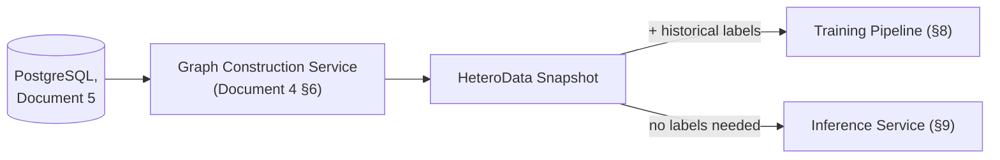
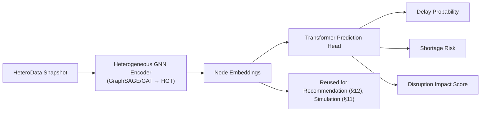

# Document 10 — AI/ML Documentation

## Graph Neural Network and Generative AI-Based Supply Chain Risk Prediction System

Version: 1.0
Status: Baseline
Consistent with: Documents 1–9

---

## 1. Purpose

This document specifies the machine learning design: feature engineering, graph construction inputs, node/edge features, training procedure, inference serving, evaluation methodology, metrics, explainability, and the recommendation mechanism. It is the ML-level contract implementing Layer 2 (GNN × Transformer) of the problem statement, and its Phase 2 consumers (RAG grounding context, Alternative-Supplier Recommender).

## 2. Scope

- **Phase 1:** feature engineering, graph construction, GNN-Transformer model, training, inference, evaluation, explainability (GNNExplainer).
- **Phase 2:** the same trained model reused (not redesigned) for the What-If Simulator (re-inference on perturbed graph) and the Alternative-Supplier Recommender (embedding similarity) — no new model architecture is introduced for either.

## 3. Assumptions

- Historical labels for "delay occurred" and "shortage occurred" exist (or are derivable) in the source data at a volume sufficient for supervised training, per Document 1, Section 12 assumption and Section 8 (Limitations) acknowledgment.
- Model training is offline/batch (not online/continuous learning); the inference service (Document 2, Section 4) serves a fixed model artifact until the next training run.
- GNNExplainer (or an equivalent perturbation-based explainer) provides sufficiently faithful explanations for a prototype; full explainability research rigor is out of scope for Phase 1.

## 4. Dependencies

Document 5 (source tables), Document 6 (graph node/edge types and tensor encoding — Section 7 of that document is the direct input to Section 5 here), Document 8 (`ml/gnn/` module location), Document 2 (technology stack: PyTorch, PyTorch Geometric, GraphSAGE/GAT, Heterogeneous Graph Transformer, GNNExplainer, Monte Carlo simulation).

## 5. Feature Engineering

Feature engineering operates on the `HeteroData` tensor representation defined in Document 6, Section 7. This section adds the derivation logic behind those encodings.

| Feature | Derivation | Node/Edge |
|---|---|---|
| `lead_time_days` (scaled) | Min-max or z-score normalization over historical `suppliers.lead_time_days` | Supplier node |
| `reliability_history` | Rolling on-time delivery rate over the last N shipments per supplier, computed from `shipments.status`/`eta`/`delivered_at` history | Supplier node |
| `capacity_score` (scaled) | Normalized supplier-reported or inferred capacity | Supplier node |
| `days_to_eta` / `days_to_due` | `eta - now()` / `due_at - now()` in days, recomputed at each graph snapshot | Shipment / Order node |
| `stock_level`, `reorder_threshold` | Direct from `inventory`, scaled | `STOCKED_AT` edge |
| `quantity_required` | Direct from `product_components`, scaled | `USED_IN` edge |
| One-hot categoricals | `component_type`, `category`, `location` bucket, `status` fields | Various nodes/edges |
| Label: `delayed` | Derived from `shipments.status = 'delayed'` or `delivered_at > eta` historically | Supplier/Shipment supervision target |
| Label: `shortage` | Derived from historical `inventory.stock_level` dropping below `reorder_threshold` while linked orders remained open | Product/Warehouse supervision target |

## 6. Graph Construction (ML Input)

The training/inference input graph is exactly the `HeteroData` object produced by the Graph Construction Service (Document 4, Section 6; Document 6). No separate ML-only graph construction path exists — this guarantees training-serving consistency: the same code path that assembles the graph for inference also assembles it for training, differing only in whether historical labels are attached.

## 7. Node Features and Edge Features (Summary Table)

Restated from Document 6, Section 7, for ML-document completeness — this document is the authority on *why* each encoding was chosen; Document 6 is the authority on *what* the encoding is.

| Node Type | Feature Vector Components | Dimensionality (approx.) |
|---|---|---|
| Supplier | lead time, reliability, capacity, country one-hot | ~15 |
| Component | unit cost, component_type one-hot | ~10 |
| Product | category one-hot | ~8 |
| Factory | capacity, location one-hot | ~10 |
| Warehouse | capacity, location one-hot | ~10 |
| Shipment | days_to_eta, status one-hot | ~6 |
| Order | days_to_due, status one-hot | ~6 |

| Edge Type | Feature Vector Components |
|---|---|
| `USED_IN` | quantity_required (scaled) |
| `STOCKED_AT` | stock_level, reorder_threshold (scaled) |
| `SHIPS_TO` | eta proximity, status one-hot |
| Others (`SUPPLIES`, `SHIPS_FROM`, `FULFILLS`, `ORDERED`) | structural only (no numeric edge feature beyond existence) |

## 8. Training

### 8.1 Model Architecture

A two-stage hybrid, per the problem statement's "GNN x Transformer" framing:

1. **Heterogeneous GNN encoder** (GraphSAGE / GAT baseline, upgraded to a Heterogeneous Graph Transformer) — message-passing over the typed node/edge graph to produce contextualized node embeddings, capturing multi-hop relationships (e.g., a supplier's risk propagating through `Component → Product → Order`).
2. **Transformer prediction head** — attends over a node's embedding plus its immediate heterogeneous neighborhood embeddings to produce the final delay/shortage/impact scores, capturing relative importance among neighbors more expressively than a simple pooling.

### 8.2 Training Procedure

| Step | Detail |
|---|---|
| Data split | Time-based split (train on earlier history, validate/test on later history) to avoid leakage and reflect real forecasting conditions |
| Loss function | Binary cross-entropy for delay/shortage classification heads; combined/weighted loss for the joint impact score |
| Optimizer | Adam / AdamW with learning-rate scheduling |
| Regularization | Dropout in GNN layers, edge dropout, early stopping on validation AUC |
| Class imbalance handling | Class-weighted loss or focal loss, since disruptions are a minority class in typical supply chain data |
| Training environment | Offline batch job (`ml/gnn/` per Document 8, Section 5), not part of the request-serving path |

### 8.3 Retraining Trigger

Phase 1: manual/scheduled retraining as new historical data accumulates. Continuous/automated retraining (MLOps pipeline) is explicitly Future Scope per Document 1, Section 15 — not required for the prototype.

## 9. Inference

Served by the GNN Inference Service (Document 2, Section 4; Document 8's `ml/serving/`):

- Loads the latest trained model artifact and the current `HeteroData` snapshot (Section 6).
- Runs a forward pass to produce delay probability, shortage risk, and impact score per entity (FR-GNN-01–03).
- Traces affected products/orders via graph reachability from the flagged entity (FR-GNN-04).
- Returns node embeddings alongside scores (FR-GNN-06) for Phase 2 reuse.
- Inference is stateless per request and does not mutate the persisted graph, satisfying NFR-01's latency target by avoiding any write path in the hot request.

## 10. Evaluation and Metrics

| Metric | Applies To | Target (Document 1, Section 11) |
|---|---|---|
| AUC-ROC | Delay probability, shortage risk classification | ≥ 0.80 on held-out test set |
| Precision / Recall | Delay/shortage classification at the operating threshold used for alerts (Phase 2) | Reported per class; tuned jointly with alert threshold (FR-MCP-06) to manage false-positive rate (NFR-18) |
| Calibration | Predicted probability vs. observed frequency (reliability diagram) | Reasonably calibrated so a "78%" delay probability is interpretable at face value in the chatbot's plain-language explanation (Phase 2) |
| Explanation fidelity (qualitative) | GNNExplainer subgraph | Evaluator review — does the highlighted subgraph match domain-plausible causes | Phase 1 |
| Embedding usefulness (qualitative) | Alternative-supplier recommendations | ≥ 80% judged plausible by evaluator (Document 1, Section 11) | Phase 2 |

Evaluation runs are logged per Document 2, Section 11 (Monitoring — "model performance").

## 11. What-If Simulation Support

The trained model from Section 8 is reused unmodified:

- A copy of the current `HeteroData` snapshot has one or more node/edge features overridden per the user's simulated change (e.g., `lead_time_days` doubled).
- Inference (Section 9) runs again on this copy only.
- Monte Carlo simulation utilities (Document 2, Section 5) may be layered on top to sample multiple perturbation scenarios and report a distribution of outcomes rather than a single point estimate, where the UI (Document 3, Section 6.12) calls for a range.
- The persisted graph and model are never touched by this path (FR-SIM-04).
- **Delivery Phase:** Phase 2

## 12. Explainability

- **Mechanism:** GNNExplainer (or equivalent perturbation-based subgraph explainer) identifies the minimal subgraph of nodes/edges most responsible for a given prediction, producing per-node and per-edge contribution weights (Document 5, Section 6.14 schema).
- **Phase 1 output:** the explanation subgraph is computed and persisted for every high-risk prediction; the dashboard renders it as a basic highlight (Document 3, FR-EXP-01 Phase 1 scope).
- **Phase 2 extension:** the same subgraph is color-coded by risk level and synchronized with chatbot answers (FR-EXP-02/03) — purely a presentation-layer extension, no new explainability computation.
- **Delivery Phase:** Phase 1 (computation), Phase 2 (full visual integration)

## 13. Recommendation (Alternative-Supplier)

- **Mechanism:** cosine similarity over the Section 8 model's learned supplier embeddings, filtered to suppliers providing the same `component_type` (FR-REC-01/02), computed via the Cypher/GDS query in Document 6, Section 8, or an equivalent in-process nearest-neighbor search over the embedding tensor.
- **No new model:** this reuses Layer 2's embeddings exactly as the problem statement specifies (Section 5.4, `problem_statement.md`) — there is no separate recommendation model to train or evaluate beyond the qualitative plausibility check in Section 10.
- **Delivery Phase:** Phase 2

## 14. Risks

| ID | Risk | Mitigation | Delivery Phase |
|---|---|---|---|
| ML-01 | Insufficient positive-label volume (delays/shortages are rare events) weakens model discrimination | Class-weighted/focal loss (Section 8.2); realistic AUC target (0.80, not higher) acknowledging data constraints | Phase 1 |
| ML-02 | Time-based split still risks leakage if graph features implicitly encode future information (e.g., an already-updated `reliability_history`) | Feature computation windowed strictly to information available as-of the snapshot date used for that training example | Phase 1 |
| ML-03 | GNNExplainer subgraphs may be unstable (different runs highlight different nodes) for borderline predictions | Explanation only surfaced with the associated confidence; qualitative evaluator review (Section 10) catches gross instability before demo | Phase 1 |
| ML-04 | Embedding-based recommendations may reflect graph structure bias (e.g., recommend suppliers only because they're well-connected, not genuinely similar) | Component-type filter (FR-REC-02) as a hard constraint before similarity ranking, reducing spurious matches | Phase 2 |

## 15. Future Extension

An automated retraining/MLOps pipeline (Document 1, Section 15) would slot in at Section 8.3's "Retraining Trigger" without changing the model architecture (Section 8.1) or the inference contract (Section 9) that Document 2's GNN Inference Service exposes.

---

## Document Control

- **Purpose:** Section 1. **Scope:** Section 2. **Assumptions:** Section 3. **Dependencies:** Section 4. **Risks:** Section 14. **Future Extension:** Section 15.
- Baseline for Document 13 (Testing Documentation — model evaluation test cases).
