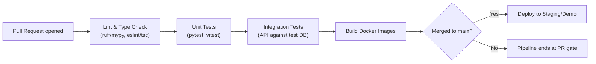

# Document 11 — Implementation Guide

## Graph Neural Network and Generative AI-Based Supply Chain Risk Prediction System

Version: 1.0
Status: Baseline
Consistent with: Documents 1–10

---

## 1. Purpose

This document specifies how the system is actually built and shipped by a five-person engineering team: development environment setup, dependency management, Docker configuration, environment variables, CI/CD, Git/branch strategy, testing gates, deployment procedure, and rollback. It operationalizes Documents 2 and 8 into a repeatable engineering workflow.

## 2. Scope

Covers the full 15-week Phase 1 build and the Phase 2 extension workflow through March 2027, consistent with Document 1's delivery strategy.

## 3. Assumptions

- Five-person engineering team, one owner per architectural layer (Document 1, Section 6 stakeholder table; `docs/team_plan.md` Section 2); Git strategy (Section 8) assumes a multi-contributor team process with per-person feature branches and cross-team PR review.
- GitHub is the source host, with GitHub Actions for CI/CD, consistent with Document 2, Section 5.
- Local development happens on each team member's machine using Docker Compose (Document 2, Section 6.1); no cloud development environment is required for Phase 1.

## 4. Dependencies

Document 2 (technology stack, deployment model), Document 8 (folder structure), Document 5 (migrations), Document 13 (test suite invoked by CI).

## 5. Development Environment

| Requirement | Version/Tool |
|---|---|
| Python | 3.11+ |
| Node.js | 20 LTS |
| Docker / Docker Compose | Latest stable |
| PostgreSQL client tools | `psql` 15+ |
| Package management (Python) | `uv` or `pip` + `venv` |
| Package management (JS) | `npm` or `pnpm` |
| IDE convention | `.editorconfig`, shared lint/format config (`ruff`/`black` for Python, `eslint`/`prettier` for TypeScript) committed to the repo |

## 6. Dependencies

| Category | Key Packages | Delivery Phase |
|---|---|---|
| Backend core | `fastapi`, `uvicorn`, `sqlalchemy[asyncio]`, `alembic`, `pydantic`, `passlib`, `python-jose` (JWT) | Phase 1 |
| ML | `torch`, `torch-geometric`, `pandas`, `scikit-learn`, `networkx` | Phase 1 |
| Frontend core | `react`, `typescript`, `d3`, `react-router`, `axios`/`fetch` wrapper | Phase 1 |
| Testing | `pytest`, `pytest-asyncio`, `httpx` (API tests), `vitest`/`jest` + `react-testing-library` (frontend) | Phase 1 |
| RAG/LLM | `langgraph`, LLM provider SDK, embedding client, `pgvector` Python bindings or `weaviate-client` | Phase 2 |
| Optimization | `ortools` (Google OR-Tools) | Phase 2 |
| MCP | MCP server/client SDK | Phase 2 |
| Notifications | Slack SDK, email client (SMTP or provider SDK) | Phase 2 |
| Caching/Queue | `redis`, `redis`-backed task queue client | Phase 2 |

All dependencies are pinned in `requirements.txt`/`pyproject.toml` (backend) and `package.json` lockfile (frontend); Phase 2 dependencies are added in a dedicated commit when Phase 2 work begins, not pre-installed during Phase 1.

## 7. Docker

Per Document 2, Section 6.1, each service is one Dockerfile; `docker-compose.yml` (Phase 1) and `docker-compose.phase2.yml` (additive override, Phase 2) define the full stack.

```yaml
# docker-compose.yml (Phase 1, illustrative excerpt)
services:
  postgres:
    image: postgres:15
    environment:
      POSTGRES_DB: ${POSTGRES_DB}
      POSTGRES_USER: ${POSTGRES_USER}
      POSTGRES_PASSWORD: ${POSTGRES_PASSWORD}
    volumes: ["pgdata:/var/lib/postgresql/data"]

  backend:
    build: ./backend
    env_file: .env
    depends_on: [postgres]
    ports: ["8000:8000"]

  frontend:
    build: ./frontend
    ports: ["3000:3000"]
    depends_on: [backend]

volumes:
  pgdata:
```

Phase 2 adds `vector-db` (if Weaviate is chosen over pgvector), `redis`, and the additional service containers listed in Document 2, Section 6.1, via `docker-compose.phase2.yml`, composed with `docker compose -f docker-compose.yml -f docker-compose.phase2.yml up`.

## 8. Environment Variables

| Variable | Purpose | Delivery Phase |
|---|---|---|
| `POSTGRES_DB`, `POSTGRES_USER`, `POSTGRES_PASSWORD`, `POSTGRES_HOST` | Database connection | Phase 1 |
| `JWT_SECRET_KEY`, `JWT_ACCESS_TTL_MIN`, `JWT_REFRESH_TTL_DAYS` | Auth token signing/expiry (Document 8, Section 12) | Phase 1 |
| `MODEL_ARTIFACT_PATH` | Path to the trained GNN model artifact served by the Inference Service; resolved against the `model_registry` row with `status='active'` (Document 5, Section 6.25) | Phase 1 |
| `RISK_CATEGORY_THRESHOLDS` | Default low/medium/high/critical threshold config consumed by the Risk Intelligence Service (FR-RISKINT-02) | Phase 1 |
| `CORS_ALLOWED_ORIGINS` | Frontend origin allowlist | Phase 1 |
| `VECTOR_DB_URL` | pgvector connection string or Weaviate endpoint | Phase 2 |
| `LLM_API_KEY`, `LLM_MODEL_NAME` | LLM provider credentials/model selection | Phase 2 |
| `EMBEDDING_MODEL_NAME` | Embedding model for RAG indexing | Phase 2 |
| `MCP_SERVER_ENDPOINTS` | Configured MCP server addresses (ERP/procurement, notification) | Phase 2 |
| `SLACK_BOT_TOKEN`, `NOTIFICATION_EMAIL_SMTP_URL` | Notification channel credentials | Phase 2 |
| `REDIS_URL` | Cache/queue connection | Phase 2 |

All secrets are supplied via `.env` (excluded from source control via `.gitignore`) locally, and via the CI/CD secret store in pipelines — never committed, per NFR-10.

## 9. CI/CD



- CI (GitHub Actions) runs on every pull request: lint, type-check, unit tests, integration tests (Document 13), then a Docker build check.
- CD triggers only on merge to `main`, deploying to the staging/demo environment (Document 2, Section 6.2).
- No pipeline step is skipped for Phase 2 work — the same gate applies to every PR regardless of phase.

## 10. Git Strategy

- **Trunk-based with short-lived feature branches**, appropriate for a five-person team: `main` is always demoable; work happens on `feature/<short-description>` branches merged via PR (peer-reviewed by another team member, CI-gated) to keep history readable and CI honest.
- Commit messages follow Conventional Commits (`feat:`, `fix:`, `docs:`, `refactor:`, `test:`) to keep the log traceable against Document 1 requirement IDs where relevant (e.g., `feat(auth): implement FR-AUTH-05 account lockout`).

## 11. Branch Strategy

| Branch | Purpose |
|---|---|
| `main` | Always-deployable; represents the current demoable state |
| `feature/*` | One feature/requirement per branch, merged via PR |
| `phase-2/*` (optional prefix) | Signals Phase 2 work explicitly, so `main` history clearly shows the Phase 1/Phase 2 boundary matching Document 1's delivery split |
| `hotfix/*` | Urgent fixes branched from `main`, merged back directly |

No long-lived `develop` branch is used — unnecessary process overhead for a single-developer, two-phase academic project.

## 12. Testing

Full detail in Document 13. Summary gate here: every PR must pass lint, unit, and integration tests before merge (Section 9); Phase 1 sign-off requires the full Document 13 Phase 1 test suite green before Phase 2 work begins, enforcing the scope discipline from Document 1, Section 2.4.

## 13. Deployment

| Step | Detail |
|---|---|
| Build | CI builds and tags Docker images per service (`git-sha` tag) |
| Migrate | `alembic upgrade head` run against the target environment's PostgreSQL before service restart |
| Release | `docker compose pull && docker compose up -d` on the staging/demo host (or equivalent container platform command) |
| Smoke test | Automated post-deploy health check hits `/healthz` on every service (Document 2, Section 11) before the deployment is marked successful |
| Phase 2 activation | Phase 2 services/images are deployed additively via `docker-compose.phase2.yml` (Section 7) once Phase 2 development is ready; Phase 1 services are not redeployed/restructured to accommodate this |

## 14. Rollback

| Step | Detail |
|---|---|
| Image rollback | Redeploy the previous known-good `git-sha`-tagged image set |
| Database rollback | `alembic downgrade -1` only if the failed release included a migration; otherwise no DB rollback is needed since Phase 1/Phase 2 migrations are additive (Document 5, Section 7) and backward-compatible with the prior application version |
| Verification | Re-run the smoke test (Section 13) against the rolled-back version before considering the incident closed |

Because the schema strategy (Document 5, Section 7) is additive-only, rollback risk is low: an old application version can typically run against a newer (additively migrated) schema without failure, simplifying emergency rollback to an image-only operation in most cases.

## 15. Risks

| ID | Risk | Mitigation | Delivery Phase |
|---|---|---|---|
| IG-01 | Cross-team PR review could be rushed under sprint deadline pressure, weakening the review safety net | CI gate (Section 9) is mandatory and non-bypassable (no `--no-verify`/skipped checks) as a backstop alongside mandatory peer review | Phase 1 |
| IG-02 | Phase 2 dependency additions (Section 6) could destabilize a working Phase 1 build if not isolated | Additive `docker-compose.phase2.yml` and dependency additions only after Phase 1 sign-off gate (Section 12) | Phase 2 |
| IG-03 | Manual deployment steps (Section 13) are error-prone without a dedicated ops team | Steps scripted (`Makefile`/shell scripts) rather than run ad hoc, reducing manual-step risk | Phase 1 |
| IG-04 | Enhancement Addendum schema changes (Document 5, Section 7.1) — `customers`, `model_evaluation_runs`, `scoring_method`, `orders.customer_id` backfill — are additive but sequence-sensitive | Migration order enforced exactly as Document 5, Section 7.1 lists it; `orders.customer_name` drop (step 6) run only as a separate, later migration after backfill verification | Phase 1 |
| IG-05 | `model_registry`, `confidence`/`risk_category` on `risk_scores`, and `decision_trace` on `action_requests` (Document 5, Section 7) are new/additive but easy to miss if the training pipeline or Decision Intelligence Service isn't updated in lockstep with the migration | Migration and the code path that populates the new columns land in the same PR, gated by the CI build/test check (Section 9) — a migration without a populating code path fails integration tests (Document 13) | Phase 1 (schema), Phase 2 (`decision_trace`) |

## 16. Future Extension

A managed container platform (e.g., ECS/Kubernetes) and blue-green deployment would replace Section 13's single-host Docker Compose deployment if the project moves beyond academic-prototype scale (Document 1, Section 15), without changing the CI build/test gate defined in Section 9.

---

## Document Control

- **Purpose:** Section 1. **Scope:** Section 2. **Assumptions:** Section 3. **Dependencies:** Section 4. **Risks:** Section 15. **Future Extension:** Section 16.
- Baseline for Document 14 (Project Roadmap — sprint plan follows this workflow).
