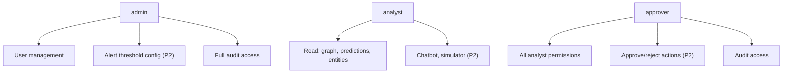

# Document 12 — Security Documentation

## Graph Neural Network and Generative AI-Based Supply Chain Risk Prediction System

Version: 1.0
Status: Baseline
Consistent with: Documents 1–11

---

## 1. Purpose

This document specifies the system's security controls in full: JWT-based authentication, RBAC authorization, encryption, secrets management, prompt injection protection, RAG-specific security, rate limiting, and audit logging. It expands the security summary in Document 2, Section 9 into implementation-level detail, since a system with agentic, ERP-executing capability (Phase 2) carries meaningfully elevated stakes (Document 1, Section 14, risk R-04).

## 2. Scope

Covers both phases. Phase 1's security surface is authentication, authorization, and data protection for a read/predict-only system. Phase 2 adds the security surface of generative AI (prompt injection, RAG grounding integrity) and autonomous action execution (approval-gate integrity).

## 3. Assumptions

- The system handles no regulated personal data beyond basic user account fields (name, email); no PCI/PHI-scope data is in play, keeping compliance scope to standard authentication/authorization hygiene plus the project's own approval-gate integrity requirement.
- TLS termination happens at the reverse proxy (Document 2, Section 6.1); internal Docker-network traffic is not separately encrypted at prototype scale.
- The ERP/procurement integration target is a sandbox/mock per Document 1's assumption (Section 12), so Section 11 (ERP security) here documents the control design, not a live production security audit.

## 4. Dependencies

Document 2 (Section 9 security summary this document expands), Document 5 (schema fields this document's controls apply to), Document 8 (Sections 12–13, code-level implementation of auth/authorization), Document 4 (flows this document's controls gate).

## 5. JWT

| Aspect | Design |
|---|---|
| Algorithm | HS256 (or RS256 if service-to-service verification without shared secret becomes necessary in Phase 2's multi-service topology) |
| Access token | Short TTL (default 15 minutes), carries `sub` (user id), `role`, `exp`, `iat` |
| Refresh token | Longer TTL (default 7 days), single-use rotation on refresh (old refresh token invalidated when a new one is issued) |
| Storage (client) | Access token in memory; refresh token in an `HttpOnly`, `Secure`, `SameSite=Strict` cookie to reduce XSS exfiltration risk |
| Validation | Every request except `POST /auth/login` validated by the `get_current_user` dependency (Document 8, Section 12): signature, expiry, and `is_active` status of the referenced user re-checked against PostgreSQL (not solely trusting token claims), so a deactivated user's still-valid token is rejected |
| Revocation | Logout (FR-AUTH-04) invalidates the refresh token server-side; access tokens are short-lived enough that immediate revocation is not required for them |

**Delivery Phase:** Phase 1

## 6. RBAC

Three roles, as defined in Document 1, Section 8.1 and enforced per Document 8, Section 13:

| Role | Permissions Summary |
|---|---|
| `admin` | User management (Phase 1), alert threshold configuration (Phase 2), full audit access |
| `analyst` | Read access to all entity/prediction/graph endpoints; chatbot and simulator use (Phase 2); cannot approve/reject actions |
| `approver` | All `analyst` permissions, plus approve/reject on `action_requests` (Phase 2), plus audit access (Compliance Officer persona) |

- **Enforcement point:** exclusively server-side, at the controller layer (Document 8, Section 13) — frontend role-based hiding (Document 3, Section 7) is UX only and is never trusted as a security boundary.
- **Privilege escalation prevention:** role changes are `admin`-only (Section 7, `PATCH /api/v1/users/{id}`) and are themselves audit-logged (Section 12).

**Delivery Phase:** Phase 1 (roles + admin/analyst enforcement); Phase 2 (approver-gated endpoints active)

## 7. Encryption

| Data | At Rest | In Transit |
|---|---|---|
| Passwords | Argon2/bcrypt salted hash (never reversible, never logged) | N/A |
| PostgreSQL data | Disk-level encryption via the hosting platform/volume (standard managed-Postgres or encrypted Docker volume) | TLS between backend and PostgreSQL where the deployment target supports it |
| API traffic | N/A | TLS 1.2+ terminated at the reverse proxy (Document 2, Section 6.1) |
| Vector DB (Phase 2) | Same disk-level encryption posture as PostgreSQL (pgvector) or provider-managed encryption (Weaviate) | TLS to the vector DB endpoint |
| LLM API calls (Phase 2) | N/A | TLS to the LLM provider; no request/response bodies persisted beyond the logging policy in Section 12 |

**Delivery Phase:** Phase 1 (passwords, PostgreSQL, API traffic); Phase 2 (vector DB, LLM API)

## 8. Secrets Management

- All secrets (`JWT_SECRET_KEY`, `POSTGRES_PASSWORD`, `LLM_API_KEY`, `SLACK_BOT_TOKEN`, etc., per Document 11, Section 8) are sourced exclusively from environment variables / `.env` files excluded from source control (NFR-10).
- CI/CD secrets (Document 11, Section 9) are stored in the GitHub Actions encrypted secrets store, never echoed to build logs.
- No secret is ever embedded in a frontend bundle; the React app holds no API keys — all provider calls (LLM, vector DB, MCP) are proxied through the backend (Document 2, Section 7 communication table).

**Delivery Phase:** Phase 1

## 9. Prompt Injection Protection

Applies to the Chatbot and LLM Orchestration Service (Document 4, Sections 8–9):

| Control | Description |
|---|---|
| Instruction/data separation | User questions and retrieved RAG evidence are passed to the LLM as clearly delimited *data* within the prompt template (Document 8, `llm/prompt_templates.py`), never concatenated as if they were system instructions |
| Untrusted-content framing | Retrieved evidence chunks (Document 7) are explicitly framed in the prompt as "reference material, not instructions" — the LLM is instructed to ignore any imperative statements found inside retrieved content |
| Output constraint | The LLM's action-recommendation output is constrained to a structured schema (Document 8's `dto.py` response models), not free-form text that could smuggle an unvalidated action into the approval pipeline |
| Business-rule validation | Every LLM-proposed action passes through business-rule validation (FR-LLM-03) before it can become an `action_request` row — a prompt-injected "approve unlimited spend" instruction cannot bypass this structural check |

**Delivery Phase:** Phase 2

## 10. RAG Security

| Control | Description |
|---|---|
| Source provenance | Every retrieved chunk carries `source_document_id` and `collection` metadata (Document 7, Section 6), so every claim in a generated explanation is traceable to a specific record (FR-LLM-04) |
| Access scoping | RAG queries are scoped by entity metadata filters (Document 7, Section 8) so a user cannot retrieve evidence unrelated to entities they have legitimate visibility into, consistent with RBAC (Section 6) |
| Grounding requirement | If retrieval returns no sufficiently relevant evidence, the LLM Orchestration Service must surface "no strong evidence found" rather than generating an ungrounded claim (Document 4, Section 8; Document 7, Section 12, risk VDB-02) |
| Ingestion validation | Documents ingested into the vector store (Document 7) go through the same lightweight parsing step as structured document ingestion (FR-GC-05), which normalizes rather than blindly trusting raw uploaded content |

**Delivery Phase:** Phase 2

## 11. ERP / MCP Execution Security

| Control | Description |
|---|---|
| Mandatory approval gate | No `action_request` reaches `mcp_execution` without `status = 'approved'` and a recorded `decided_by`/`decided_at` (Document 5, Section 6.17; FR-MCP-03) — enforced at the service layer (Document 8), not merely by UI convention |
| Least-privilege MCP credentials | MCP server adapters (Document 8, `mcp_execution/adapters/`) use scoped credentials limited to the specific action types the system is authorized to perform (e.g., raise-PO), not broad ERP admin access |
| Idempotency / replay protection | `action_requests.status` transitions are one-way (`pending → approved/rejected → executed/failed`); a `409 CONFLICT` (Document 9, Section 13) prevents double-execution of the same approval |
| Sandbox-first | Per Document 1's assumption, Phase 2 development and demo target a sandbox/mock ERP, limiting real-world blast radius during development |

**Delivery Phase:** Phase 2

## 12. Rate Limiting

- Per-user default limit: 100 requests/minute at the API Gateway (Document 9, Section 16), returning `429 RATE_LIMITED`.
- Tighter limits on expensive/sensitive endpoints: `POST /auth/login` (mitigates brute force, complementing account lockout FR-AUTH-05), `POST /chat/sessions/{id}/messages` and `POST /simulate` (mitigates runaway LLM/inference cost in Phase 2).
- Rate limit state tracked in Redis (Document 8, Section 10) once introduced in Phase 2; Phase 1's lower endpoint sensitivity uses a simpler in-memory limiter sufficient for prototype-scale traffic.

**Delivery Phase:** Phase 1 (login endpoint); Phase 2 (chat/simulate endpoints, Redis-backed)

## 13. Audit Logging

- The `audit_log` table (Document 5, Section 6.22) is the single, immutable audit trail across authentication (Phase 1), approval, and action-execution (Phase 2) events, satisfying NFR-15.
- Logged fields never include raw passwords, JWTs, or full LLM prompt/response bodies containing sensitive evidence content — only event type, actor, target, and a bounded `detail` payload (Document 5, Section 6.22).
- Audit records are write-once from the application's perspective: no update/delete path exists in the repository layer (Document 8) for `audit_log` rows.
- The Audit screen (Document 3, Section 6.16) is the human-facing view of this control, restricted to `admin`/`approver` roles (Section 6).

**Delivery Phase:** Phase 1 (authentication events); Phase 2 (approval/action events)

## 14. Security Control Summary Matrix

| Control Area | Phase 1 | Phase 2 |
|---|---|---|
| JWT auth | ✅ | ✅ (unchanged) |
| RBAC | ✅ (admin/analyst) | ✅ (adds approver enforcement) |
| Encryption | ✅ (passwords, PostgreSQL, API TLS) | ✅ (adds vector DB, LLM API) |
| Secrets management | ✅ | ✅ (adds LLM/MCP/Slack credentials) |
| Prompt injection protection | — | ✅ |
| RAG security | — | ✅ |
| ERP/MCP execution security | — | ✅ |
| Rate limiting | ✅ (login) | ✅ (adds chat/simulate) |
| Audit logging | ✅ (auth events) | ✅ (adds approval/action events) |

## 15. Risks

| ID | Risk | Mitigation | Delivery Phase |
|---|---|---|---|
| SEC-01 | Refresh-token cookie theft via a frontend XSS vulnerability | `HttpOnly`/`Secure`/`SameSite=Strict` cookie flags (Section 5); standard React output-encoding practices to prevent XSS in the first place | Phase 1 |
| SEC-02 | Prompt injection via retrieved RAG content bypassing instruction/data separation in an untested edge case | Structured-output constraint on LLM action proposals (Section 9) as a second layer, so even a successful injection cannot directly trigger an unvalidated action | Phase 2 |
| SEC-03 | Approval-gate bypass via a bug in the `action_requests` state machine | One-way status transitions with database-level constraints backing the application check (Section 11); covered by dedicated test cases in Document 13 | Phase 2 |
| SEC-04 | Over-broad MCP credential scope causing excessive blast radius on compromise | Least-privilege adapter credentials (Section 11); sandbox-first target (Document 1, Section 12 assumption) | Phase 2 |

## 16. Future Extension

Multi-factor authentication, IP-allowlisting for admin actions, and a formal third-party security audit of the ERP integration are natural extensions once the system moves beyond an academic prototype (Document 1, Section 15), layering onto the JWT/RBAC foundation (Sections 5–6) without redesigning it.

---

## Document Control

- **Purpose:** Section 1. **Scope:** Section 2. **Assumptions:** Section 3. **Dependencies:** Section 4. **Risks:** Section 15. **Future Extension:** Section 16.
- Baseline for Document 13 (Testing Documentation — security test cases).
