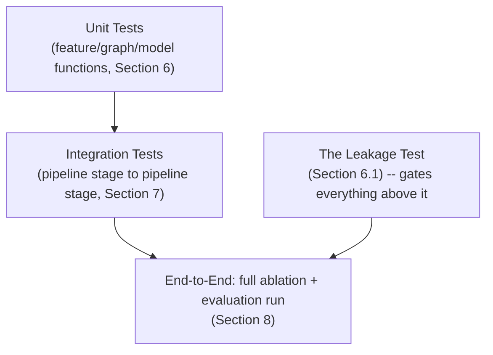

# Document 13 — Testing Documentation

## HADES Model-Development Prototype

Version: 2.0 — rescoped to the ML pipeline only (UI, API, security, and UAT testing removed)
Status: Baseline
Consistent with: `01_Product_Requirement_Document.md`–`11_Implementation_Guide.md`

---

## 1. Purpose

This document specifies what is tested and how, for a pipeline with no UI, no API, no auth, and no multi-user workflow. The center of gravity here is different from a product test suite: the most important test in this entire project is the leakage test (Section 6.1), because every other result in the project is meaningless if it fails.

## 2. Scope

- **In scope:** unit tests for feature engineering and graph assembly, integration tests for the pipeline end-to-end, the leakage test, and the statistical/methodological checks that make the evaluation protocol trustworthy (confidence intervals present, matched-parameter arm run, etc.).
- **Out of scope:** UI testing, API contract testing, security testing, performance/load testing in the product sense, and UAT — none of these apply to an offline pipeline with no served interface. `03_UI_UX_Documentation.md`, `07_Vector_Database_Design.md`, `08_Backend_Design.md`, `09_REST_API_Documentation.md`, and `12_Security_Documentation.md` explain why those layers don't exist in this project.

## 3. Assumptions

- `pytest` is the test runner (`11_Implementation_Guide.md` §6).
- A dedicated test/scratch database, migrated fresh per test run, is used for integration tests — never the researcher's working dataset.
- There is no CI system enforcing these gates automatically; running them is a manual discipline before trusting a result (`11_Implementation_Guide.md` §9).

## 4. Dependencies

`05_Database_Design.md` (schema constraints under test), `06_Graph_Database_Design.md` (graph assembly under test), `10_AI_ML_Documentation.md` (the feature/model/evaluation logic under test).

## 5. Testing Pyramid

Unlike a typical pyramid, the leakage test is not "more unit tests at the bottom" — it is a standing gate that every result above it depends on, re-run whenever feature engineering changes (`04_Application_Flow.md` §8).

## 6. Unit Testing

| Target | Example Test Case |
|---|---|
| As-of feature computation (`10_AI_ML_Documentation.md` §6.3) | Given a supplier with shipment history straddling `t₀`, `on_time_rate_90d` reflects only shipments with `changed_at ≤ t₀` |
| As-of edge filter (`product_components`, `product_factories`) | Given a BOM entry with `deactivated_at` before `t₀`, the edge is excluded from that snapshot; given one with `created_at` after `t₀`, also excluded |
| Label windowing (`training_labels`) | Given an event at `event_at`, the label is only attached to snapshots where `t₀ < event_at ≤ t₀ + 14d` |
| Reverse-relation generation (`06_Graph_Database_Design.md` §6) | `ToUndirected()` on a fixture graph produces exactly 20 meta-relations from 10 forward relations, with `SHIPS_FROM` counted as two distinct meta-relations (Supplier target, Factory target) |
| HGT encoder forward pass | Given a small fixture `HeteroData`, output embedding shape matches `(num_nodes, d)` per node type; no NaNs |
| Structural depth prior | Given the blanket-depth table (`10_AI_ML_Documentation.md` §8.2), the prior weights for each head sum to 1 and peak at the documented layer |
| Depth gate initialization | Untrained gate (near-zero output weights) reproduces the fixed structural-prior readout exactly, within floating-point tolerance |
| Transformer 2 same-type constraint | Given a mixed-node-type batch, attention weights between differently-typed nodes are exactly zero; nonzero only within Supplier–Supplier pairs |
| Transformer 2 candidate pooling | Given an embedding set, the top-k cosine pool always includes every node flagged `is_frontier=true`, regardless of its cosine rank |
| Claim B dyadic formula | Given known `order_volume_share`/`contract_priority_weight`/`fulfilment_preference_weight` inputs, output matches the documented formula within floating-point tolerance |
| Focal loss / KL anchor | Given known prediction/label pairs, loss matches a hand-computed reference value |
| GNNExplainer wrapper | Given a mock prediction, returns a subgraph whose contribution weights sum within an expected tolerance |
| Confidence-interval computation | Given a known metric distribution, the paired time-blocked bootstrap and DeLong implementations reproduce reference values from a known-good statistics library |

## 7. Integration Testing

| Test Case | Verifies |
|---|---|
| Graph snapshot construction, end to end, for a fixture `t₀` | `graph_snapshots` row is written with correct node/edge/label counts; the assembled `HeteroData` has exactly the expected node/edge types |
| Leakage test over the assembled graph (not raw CSVs) | No single feature column, read from the actual tensor, scores AUC > 0.9 on either label |
| Training run, end to end, for one architecture | `model_registry` and `model_evaluation_runs` rows are written with matching `model_version`, non-null `git_commit`, and at least one metric row per task carrying `ci_lower`/`ci_upper` |
| Layer-depth sweep, end to end | Four `model_evaluation_runs` rows exist for the sweep (`L=1..4`), each traceable to a distinct `model_registry` row |
| Architecture ablation, end to end, including the matched-parameter arm | Six `model_registry` rows exist (3 architectures × fixed-`d` and matched-`d` each), all evaluated on the identical held-out split |
| Depth-gate on/off comparison (once built) | Both runs share the same snapshot/split; only the gate differs |
| Transformer 2 validation (once built) | Held-out `SUB_SUPPLIES` edges, where they exist, are checked against `hidden_dependency_links` ranking |
| Claim B double-counting test (once built) | Two encoder runs (with/without `priority_tier`) produce comparable Claim B reordering-rate measurements from the same pipeline |

## 8. End-to-End Testing

One scenario, run in full before any result is reported externally (in a thesis write-up, a presentation, etc.):

| Scenario |
|---|
| From a clean database load (`db/load_data.py`) through snapshot construction, the leakage test, the layer-depth sweep, and the full architecture ablation with matched-parameter arm — every `model_evaluation_runs` row produced carries a confidence interval, and the comparison report states plainly which differences clear the noise floor and which do not |

## 9. Statistical / Methodological Checks

These are not conventional software tests, but they gate whether a *result* (not just the code) is trustworthy — failing one of these invalidates a conclusion even if all the tests above pass:

| Check | What it catches |
|---|---|
| Every reported comparison has a confidence interval attached | A point-estimate-only comparison being reported as a win (`10_AI_ML_Documentation.md` §9.3) |
| The architecture ablation includes the matched-parameter arm | "HGT won" being confounded with "HGT had more parameters" (`10_AI_ML_Documentation.md` §8.1) |
| The depth prior's validity is argued from the L-sweep, never from the gate's own learned weights | The circularity `project_HADES.md` §4.4 calls the "ordering rule" |
| A Transformer 2 discovery is reported with its validation route (held-out edges / co-disruption rate), not the raw attention score alone | Treating a correlation as a proven causal dependency |
| Claim B is reported only after the double-counting test has run | Reporting a reweighting effect that was actually the encoder's own signal restated |

## 10. Risks

| ID | Risk | Mitigation |
|---|---|---|
| TD-01 | The leakage test is treated as a one-time gate rather than re-run after feature changes | Process discipline documented in `04_Application_Flow.md` §8, restated here |
| TD-02 | A result gets reported before its confidence interval is computed, under time pressure | Section 9's checklist is applied before any result leaves the pipeline, not only during development |
| TD-03 | Integration tests run against real supplier/customer data instead of the synthetic fixture/test database | Not a real risk in this project — the dataset is synthetic throughout (`db/README.md`) — but the discipline (dedicated test DB, Section 3) is kept in case that ever changes |

---

## Document Control

- **Purpose:** Section 1. **Scope:** Section 2. **Assumptions:** Section 3. **Dependencies:** Section 4. **Risks:** Section 10.
