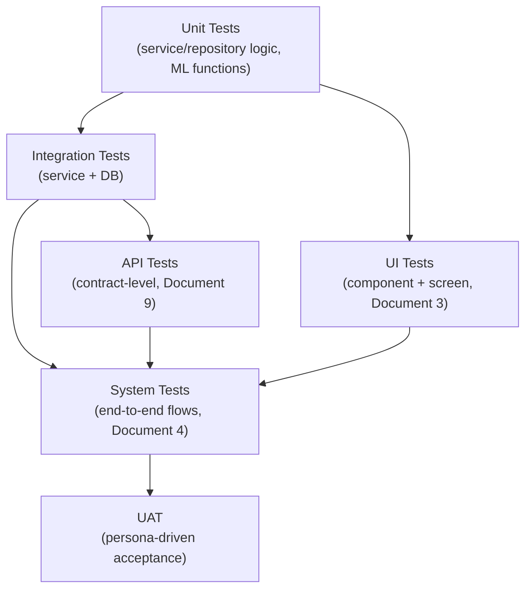

# Document 13 — Testing Documentation

## Graph Neural Network and Generative AI-Based Supply Chain Risk Prediction System

Version: 1.0
Status: Baseline
Consistent with: Documents 1–12

---

## 1. Purpose

This document specifies the testing strategy across unit, integration, system, API, UI, performance, security, UAT, and edge-case testing, and maps representative test cases to the requirements in Document 1 and the controls in Document 12. It defines the quality gate referenced in Document 11, Section 9 (CI/CD) and Section 12.

## 2. Scope

Covers test coverage for both phases; Phase 2 test cases are written when Phase 2 features are implemented, following the same test-type structure established for Phase 1 rather than a different testing approach.

## 3. Assumptions

- `pytest` (backend/ML) and `vitest`/`jest` + `react-testing-library` (frontend) are the test runners, per Document 11, Section 6.
- A dedicated test database (migrated fresh per test run or per suite) is used for integration/API tests — no test ever runs against the staging/demo database.
- UAT is conducted by team members role-playing each persona from Document 1, Section 7, led by Person 5 (`docs/team_plan.md` Section 4.6/5.7) given the absence of real end users on an academic project, supplemented by the Academic Supervisor's review where available.

## 4. Dependencies

Document 1 (requirements/user stories test cases trace to), Document 5 (schema constraints validated), Document 8 (layers under test), Document 9 (API contracts under test), Document 12 (security controls under test).

## 5. Testing Pyramid

## 6. Unit Testing

| Target | Example Test Case | Requirement Reference |
|---|---|---|
| `AuthService.verify_password` | Correct password returns True; incorrect returns False; hash never equals plaintext | FR-AUTH-01 |
| `AuthService.lock account` | 5th consecutive failed attempt sets `locked_until` | FR-AUTH-05 |
| `ApprovalService.reject` | Raises validation error if `reason` is empty | FR-MCP-04, Document 5 §6.17 |
| `RiskScoreRepository` mapping | Polymorphic `entity_type`/`entity_id` row maps to correct DTO | Document 5 §6.13 |
| Feature encoding functions (`ml/gnn/features.py`) | Given raw supplier record, output matches expected normalized feature vector | Document 10 §5 |
| GNNExplainer wrapper | Given a mock prediction, returns a subgraph with contribution weights summing within an expected tolerance | FR-GNN-05 |
| `RiskFormulaCalculator` (`risk_intelligence/risk_formula.py`) | Given known component risk inputs, weighted sum matches the documented formula (0.30/0.25/0.20/0.15/0.10) within floating-point tolerance | FR-RISK-01 |
| `ConfidenceEstimator` (`risk_intelligence/confidence.py`) | Given a raw model confidence signal, normalizes to `[0,1]`; never returns null for a scored entity | FR-RISKINT-01 |
| `RiskIntelligenceService.categorize` | Given an `impact_score` and threshold config, assigns the correct `risk_category`; boundary values resolve to the higher category (inclusive) | FR-RISKINT-02 |
| `EvaluationService.persist_metrics` | Given a metrics payload, writes one row per (`model_version`, `metric_name`, `dataset_split`); rejects an update to an existing row | FR-EVAL-01 |
| `EvaluationService.register_model` (`model_registry` write) | Given governance metadata, writes one row per `model_version`; a second write attempt after `status='active'` is rejected except for `status` transitions | FR-GOV-01/02, NFR-24 |
| `DecisionIntelligenceService.route` | Given a flagged entity's decision type, routes safety-stock/PO-split/allocation to the optimizer and anything else to the LLM path; unrecognized types default to the LLM path | FR-DEC-01 |
| `DecisionIntelligenceService.validate_policy` | Given a candidate recommendation (LLM- or optimizer-sourced), rejects one that violates a configured business rule | FR-DEC-02 |
| `DecisionIntelligenceService.compose_trace` | Given inputs from Risk Intelligence/Decision Intelligence/Optimization/LLM, produces a non-empty `decision_trace` with all contributing layers named | FR-DEC-03 |
| `OptimizationService.solve_customer_allocation` (`optimization/solvers/customer_allocation.py`) | Given competing orders and a constraint set (inventory, supplier/warehouse/production capacity, lead time), maximizes the protected-customer-value objective without violating any constraint; missing customer data falls back to FIFO-by-date | FR-CUST-02, NFR-21 |
| `OptimizationService.solve_safety_stock` / `solve_po_split` (`optimization/solvers/`) | Given an infeasible constraint set, returns `optimal: false` rather than raising or forcing a partial result | FR-OPT-01, NFR-20 |

**Delivery Phase:** Phase 1 (auth, entity, prediction, explainability, risk formula, confidence, categorization, evaluation, governance units); Phase 2 (approval, chatbot intent classification, recommendation similarity, decision routing/validation/trace, optimizer, allocation units)

## 7. Integration Testing

| Test Case | Verifies | Requirement Reference |
|---|---|---|
| Graph Construction Service ingests a new shipment row → `HeteroData` snapshot updates incrementally | FR-GC-07, Document 6 §11 |
| Document upload → parsing → structured fields populate `documents.extracted_fields` | FR-GC-05 |
| GNN Inference Service scores a known graph fixture → scores within expected range | FR-GNN-01–03 |
| Approval Flow: approve action_request → MCP Execution Service invoked with correct payload | Document 4 §10–12 |
| RAG Retrieval Service: seeded evidence corpus → query returns expected top-k chunk | FR-RAG-02, Document 7 §9 |
| Alert Evaluation job: risk score crossing configured threshold creates exactly one `alerts` row | FR-MCP-05, Document 4 §11 |
| Training pipeline completes for a given architecture → `model_evaluation_runs` and `model_registry` rows persisted with correct `model_version`/`architecture`/governance metadata | FR-EVAL-01, FR-GOV-01, Document 4 §18 |
| Prediction Flow: GNN raw output → Risk Intelligence Service writes `confidence`/`risk_category`/`scoring_method` on the same `risk_scores` row | FR-RISKINT-01–03, Document 4 §7 |
| `orders.customer_id` backfill migration: every distinct legacy `customer_name` maps to exactly one `customers` row post-migration | Document 5 §7.1, DB-05 |
| Decision Intelligence Flow: risk-intelligence record for a safety-stock-eligible entity → routed to Optimization Service, not LLM Orchestration | FR-DEC-01, Document 4 §21 |
| Optimizer Flow: optimal safety-stock request → `action_requests` row created with `source='optimizer'` and populated `decision_trace` | FR-OPT-02, FR-DEC-03, Document 4 §19 |
| Customer Allocation Flow: shortage-flagged product with competing orders and a capacity constraint set → optimal allocation respects every constraint and sums to ≤ available stock | FR-CUST-02, Document 4 §20 |

**Delivery Phase:** Phase 1 (graph construction, inference, risk intelligence, evaluation/governance persistence, customer migration); Phase 2 (RAG, decision intelligence, approval, MCP, alerts, optimizer, allocation)

## 8. System (End-to-End) Testing

Traces directly to the flows in Document 4:

| Flow Under Test | Scenario |
|---|---|
| Authentication → Dashboard | Login with valid credentials renders Dashboard within NFR-01/02 latency budget |
| Graph Construction → Prediction | New supplier delay record flows through to an updated risk score visible on the Risk Dashboard |
| Chatbot → Approval → MCP → ERP | User asks "what should we do," approves in chat, action executes against sandbox ERP, `action_log` reflects success |
| Alert → Notification | Threshold breach produces both an in-app alert and a (mocked) Slack/email delivery record |
| What-If Simulator | Perturbed lead time produces a different impact score than baseline, and the persisted graph is unchanged after the session |
| Architecture Ablation → Model Comparison | GraphSAGE, GAT, HGT trained and evaluated end-to-end; Model Comparison screen renders all three side by side from persisted metrics and governance metadata |
| Prediction → Risk Intelligence | A new supplier delay record flows through to a `risk_scores` row carrying `confidence` and `risk_category`, visible on the Risk Dashboard's Confidence Panel |
| Decision Intelligence → Optimizer → Approval → MCP | A safety-stock-eligible entity is routed by Decision Intelligence to the Optimizer, an optimal PO-split is approved in the Recommendation screen, executes against sandbox ERP, `action_log` reflects success, and the approval detail shows a complete `decision_trace` |
| Decision Intelligence → LLM → Approval | A non-optimizer-eligible flagged entity is routed by Decision Intelligence to the LLM Orchestration Service for a qualitative recommendation, validated against policy, and approved |
| Customer Allocation → Approval | Shortage-flagged product's competing orders optimized (not merely ranked) by the OR-Tools engine given a capacity constraint set, adjusted, and approved by Neha persona; `action_requests.action_payload` retains the objective/constraint values |

**Delivery Phase:** Phase 1 (Prediction → Risk Intelligence, plus Architecture Ablation → Model Comparison); Phase 2 (remaining rows)

## 9. API Testing

Contract tests against every endpoint in Document 9, using `httpx`/`pytest-asyncio`:

| Test Case | Verifies | Requirement Reference |
|---|---|---|
| `POST /auth/login` with valid/invalid/locked credentials | Correct status codes and response shapes (Document 9 §6.1) | FR-AUTH-01/05 |
| `GET /suppliers` pagination and filter parameters | Envelope shape, `422` on invalid `risk_level` | Document 9 §8.2 |
| `POST /approvals/{id}/reject` without `reason` | Returns `422 VALIDATION_ERROR` | FR-MCP-04 |
| `POST /approvals/{id}/approve` on an already-decided request | Returns `409 CONFLICT` (Document 9 §13, Document 12 §11) | NFR-09 |
| `PUT /alert-thresholds/{entity}/{metric}` as non-admin | Returns `403 FORBIDDEN` | FR-MCP-06 |
| Every entity family (Suppliers, Warehouses, Orders, Shipments, Products, Inventory) | Shared pattern (Document 9 §8.1) tested once per entity to catch drift (Document 9, risk API-01) | Document 9 §8.1 |
| `GET /api/v1/predictions` response includes `confidence` and `risk_category` | Every item carries both fields, never null `risk_category` (Document 9 §9.1) | FR-RISKINT-01/02 |
| `GET /api/v1/models/comparison` | Returns latest test-split metrics for `graphsage`, `gat`, `heterogeneous_graph_transformer` (Document 9 §9.4) | FR-ABL-02 |
| `GET /api/v1/models/registry` / `/active` | Returns governance metadata; `/active` `404`s when no model is `active` (Document 9 §9.5) | FR-GOV-01/02 |
| `POST /api/v1/customers` with invalid `priority_tier` | Returns `422 VALIDATION_ERROR` (Document 9 §8.3) | FR-CUST-01 |
| `GET /api/v1/customers/allocations/{product_id}` for a non-shortage-flagged product | Returns `404 NOT_FOUND` (Document 9 §8.4) | FR-CUST-02 |
| `POST /api/v1/optimize/po-split` with an infeasible constraint set | Returns `200 OK` with `optimal: false`, not a forced recommendation (Document 9 §12.2) | NFR-20 |
| `POST /api/v1/optimize/customer-allocation` | Returns an allocation respecting the supplied `constraint_set` (inventory/capacity/lead-time) | FR-CUST-02, FR-OPT-01 |
| `GET /api/v1/approvals/{id}` | Response includes a non-null `decision_trace` for any `approved`/`rejected` row (Document 9 §13) | NFR-23, FR-DEC-03 |

**Delivery Phase:** Phase 1 (auth, entity, prediction, evaluation, governance, customer endpoints); Phase 2 (chat, simulate, recommendation, optimization, allocation, decision trace, approval, alert endpoints)

## 10. UI Testing

Per screen (Document 3, Section 6), automated component tests plus manual verification of each state:

| Test Case | Screen | Verifies |
|---|---|---|
| Invalid login shows generic error, not field-specific | Login | Document 3 §6.1; NFR-08 |
| Risk Dashboard renders skeleton → data → error/retry states | Risk Dashboard | Document 3 §6.4 loading/error states |
| Graph view highlights explanation subgraph nodes in correct risk color | Supply Chain Graph | FR-EXP-02 |
| Chatbot shows streaming indicator, then renders citations as clickable links | Chatbot | Document 3 §6.11 |
| Reject action blocked until a reason is entered | Alerts | FR-MCP-04 |
| Risk Dashboard row shows `scoring_method` badge and formula breakdown popover when `weighted_formula` | Risk Dashboard | FR-RISK-02 |
| Confidence Panel renders confidence value and expands on demand, collapsed by default | Risk Dashboard, Supplier | FR-CONF-01, UX-05 |
| Model Comparison renders skeleton → three-architecture comparison (with rationale) → error/retry states | Model Comparison | Document 3 §6.19 |
| Model Metadata Panel shows training dataset/timestamp/experiment ID/git commit/hyperparameters/status for the active model | Model Comparison | FR-GOV-01/02 |
| Decision Trace Panel expands to show contributing layers for a queued approval item | Alerts | FR-DEC-03 |
| Optimizer Results panel shows an optimal/infeasible badge and objective value, distinct from LLM-generated recommendations | Recommendation | FR-OPT-01/03 |
| Allocation screen blocks submission if edited quantities exceed available stock | Allocation | US-CUST-02 |
| Allocation screen shows optimal badge, objective value, and applied constraint set | Allocation | FR-CUST-02 |
| Every screen: role without permission sees access-denied, not a broken page | All | Document 3 §7 |

**Delivery Phase:** Phase 1 (core screens, Model Comparison, Customers); Phase 2 (chatbot, simulator, recommendation, allocation, alerts screens)

## 11. Performance Testing

| Test Case | Target | Requirement Reference |
|---|---|---|
| Single-entity inference latency under load | p95 ≤ 2s | NFR-01 |
| Graph view render/interaction with 5,000-node fixture | p95 interaction ≤ 500ms | NFR-02 |
| Chatbot end-to-end response latency | p95 ≤ 5s | NFR-03 |
| Concurrent dashboard load (N simulated users) does not degrade inference latency beyond target | Cache effectiveness (Document 8 §10) verified under load | Phase 2 |

**Delivery Phase:** Phase 1 (inference, graph render); Phase 2 (chatbot, concurrency)

## 12. Security Testing

| Test Case | Verifies | Requirement Reference |
|---|---|---|
| Expired/invalid JWT rejected on every protected endpoint | Document 12 §5 | NFR-07 |
| Deactivated user's still-unexpired token is rejected | Document 12 §5 | FR-AUTH-04 |
| Role without `approver` cannot call approve/reject endpoints even with a valid token | Document 12 §6 | FR-MCP-03 |
| Password hash never appears in any API response or log | Document 12 §7–8 | NFR-08 |
| Injected instruction inside a mocked RAG evidence chunk does not alter the LLM's action-recommendation schema | Document 12 §9 | Phase 2 |
| Action cannot reach `executed` status without a prior `approved` status and `decided_by` | Document 12 §11 | NFR-09 |
| Rate limit returns `429` after threshold exceeded on `/auth/login` | Document 12 §12 | Phase 1 |
| No repository method exists to update/delete a `model_evaluation_runs` row | Document 12 §17 | NFR-19 |
| `model_registry` row with `status='active'` rejects a write to any field except `status` | Document 12 §17 | NFR-24 |
| Optimizer- and allocation-sourced (`source='optimizer'`) actions cannot reach `executed` without a prior `approved` status, identical to LLM-sourced actions | Document 12 §18 | Phase 2 |
| `action_requests` row cannot transition to `approved`/`rejected` with a null/empty `decision_trace` | Document 12 §19 | NFR-23 |
| LLM structured-output schema has no field capable of overriding an optimizer's numeric result on an optimizer-routed decision | Document 12 §19 | FR-OPT-03 |

**Delivery Phase:** Phase 1 (auth, RBAC, secrets, evaluation/governance integrity); Phase 2 (prompt injection, approval-gate integrity, optimizer/allocation authorization, decision intelligence audit)

## 13. User Acceptance Testing (UAT)

Persona-driven acceptance walkthroughs (Document 1, Section 7), each mapped to its user stories (Document 1, Section 10):

| Persona | UAT Scenario | User Stories Verified |
|---|---|---|
| Priya (Analyst) | Log in, view Risk Dashboard, drill into a flagged supplier, view explanation | US-PRED-01–05, US-EXP-01 |
| Rahul (Procurement Manager) | View alternative-supplier recommendation, approve raising a PO | US-REC-01–03 |
| Meera (Operations Manager) | View shortage risk in Inventory, receive a proactive alert | US-PRED-02, US-MCP-05 |
| Arjun (Admin) | Create a user, configure an alert threshold | US-AUTH-03, US-MCP-06 |
| Devika (Executive) | View Dashboard summary and risk trend timeline | US-DASH-04, US-TREND-01 |
| Karan (Compliance Officer) | Review and reject a proposed action with a reason, review audit log | US-MCP-01–02, US-DASH-05 |
| Devika / Arjun (Model Comparison) | View the GraphSAGE/GAT/HGT comparison and persisted evaluation history | US-ABL-01, US-EVAL-01 |
| Neha (Customer Operations Manager) | View OR-Tools-optimized allocation for a shortage-flagged product, adjust and approve a proposal, confirm rationale/decision trace is logged | US-CUST-01–03 |

UAT sign-off for Phase 1 requires all Phase 1-tagged scenarios above to pass before Phase 2 work begins, enforcing Document 1's Delivery Phase discipline.

**Delivery Phase:** Phase 1 (Priya, Meera, Arjun core scenarios, plus Devika/Arjun Model Comparison scenario); Phase 2 (Rahul, Devika, Karan scenarios, Neha allocation scenario, and remaining Phase 2 behavior)

## 14. Edge Cases

| Edge Case | Expected Behavior | Requirement Reference |
|---|---|---|
| Entity with no historical data (new supplier) | Prediction returns a low-confidence/neutral score rather than an error | NFR-17 |
| Malformed uploaded PDF | `documents.parse_status = 'failed'`, surfaced as a data-quality warning, not a silent drop | FR-GC-05, NFR-17 |
| Simultaneous approve attempts on the same `action_request` by two approvers | Second request receives `409 CONFLICT`; only one execution occurs | Document 12 §11 |
| RAG returns zero relevant chunks | Chatbot answer explicitly states low/no evidence rather than fabricating a citation | Document 7 §12 (VDB-02) |
| What-if simulation with an out-of-range feature value (e.g., negative lead time) | Blocked client-side and server-side with `422`, no scoring attempted | FR-SIM-01, Document 3 §6.12 |
| Graph query for a deactivated supplier | Entity still viewable (historical integrity) but flagged as inactive, excluded from new recommendations | Document 5 §6.2 |
| Alert threshold set to an extreme value causing alert flooding | Admin-configurable, but system does not crash or drop alerts under high volume — verified via a stress test | NFR-18 |
| Notification channel (Slack/email) temporarily unreachable | Delivery marked `failed`, alert remains visible in-app regardless | Document 4 §14 |
| Customer with missing `contract_terms` competes for allocation | Falls back to a documented default (FIFO by order date) rather than failing the allocation | NFR-21 |
| OR-Tools solver finds no optimal/feasible safety-stock/PO-split/allocation solution | Returns `optimal: false` with a reason; not surfaced as an approvable recommendation | NFR-20 |
| `orders.customer_name` legacy value has no matching `customers` row during backfill | Migration creates a new `customers` row rather than dropping the order's customer link | Document 5 §7.1 |
| Entity with no historical data, so the model's confidence signal is near-zero | `confidence` still populated (not null); `risk_category` reflects low certainty rather than defaulting to `critical` | NFR-17, FR-RISKINT-01 |
| Decision Intelligence receives a decision type outside the closed three-item routing list | Defaults to the LLM path rather than being forced into the optimizer | FR-DEC-01, R-13 |
| Training run fails mid-way, leaving no `model_registry` row | Model Comparison screen's Model Metadata Panel shows "no data" for that run rather than a stale/partial record | FR-GOV-01 |

**Delivery Phase:** Phase 1 (customer backfill, confidence edge cases); Phase 2 (allocation, optimizer, decision routing edge cases)

## 15. Risks

| ID | Risk | Mitigation | Delivery Phase |
|---|---|---|---|
| TD-01 | A person authoring both code and tests for their own layer risks confirmation bias (tests validate the implementation, not the requirement) | Test cases in this document are written from Document 1's requirement/user-story IDs first, traced explicitly in the tables above, not derived from the implementation after the fact; Person 5 owns cross-team integration testing independent of each layer's author | Phase 1 |
| TD-02 | Phase 2's generative/agentic surface (Sections 12–13) is inherently harder to test deterministically | Structured-output and approval-gate tests (Section 12) target the deterministic guardrails around the LLM, not the LLM's free-text output itself | Phase 2 |
| TD-03 | UAT without real end users (Section 3 assumption) may miss usability issues real personas would catch | Academic Supervisor review supplements self-conducted UAT where available | Phase 1 |

## 16. Future Extension

Automated load testing at scale beyond NFR-01/02's prototype targets, and fuzz testing of the LLM/chatbot input surface, are natural extensions once the system moves beyond an academic prototype (Document 1, Section 15), built on top of the same test-type structure (Sections 6–12) defined here.

---

## Document Control

- **Purpose:** Section 1. **Scope:** Section 2. **Assumptions:** Section 3. **Dependencies:** Section 4. **Risks:** Section 15. **Future Extension:** Section 16.
- Baseline for Document 14 (Project Roadmap — test milestones per sprint).
