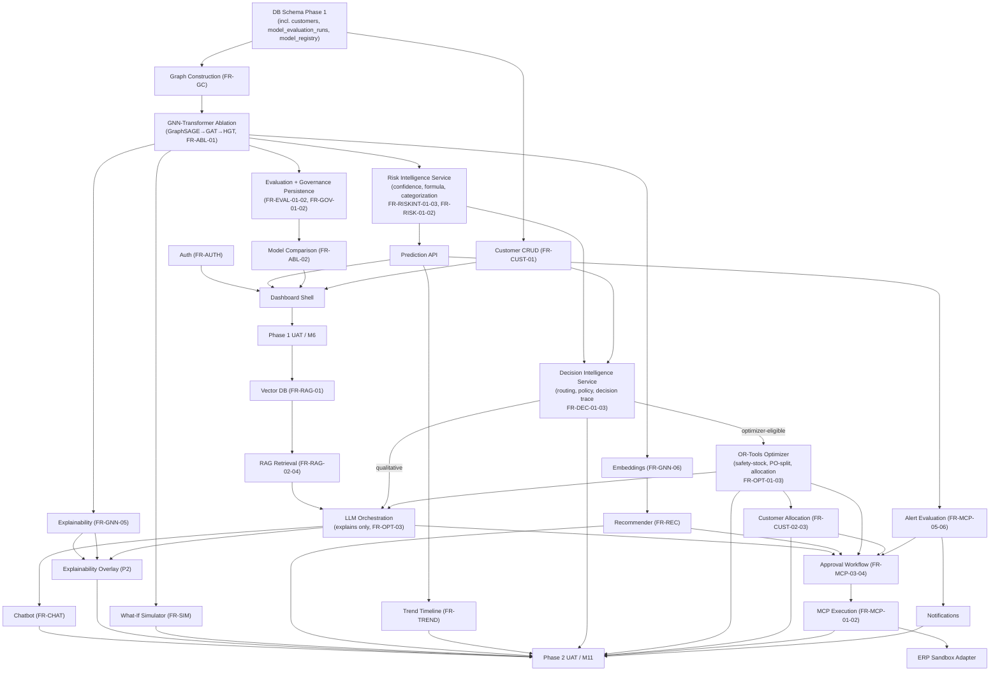
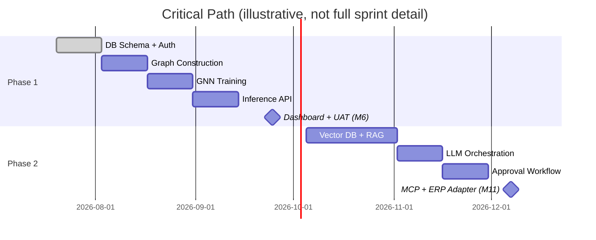
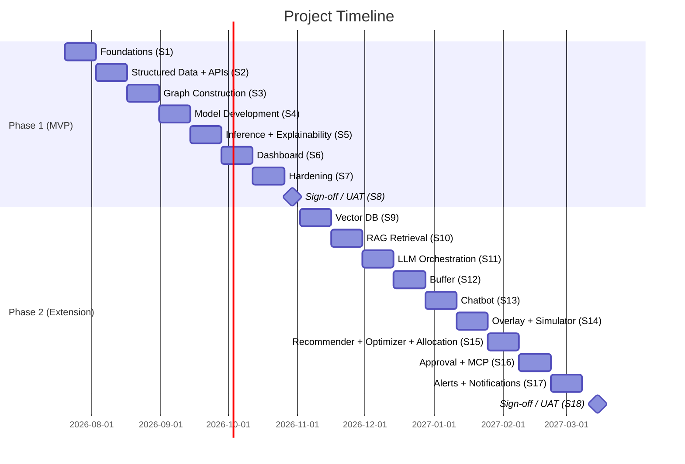

# Document 14 — Project Roadmap

## Graph Neural Network and Generative AI-Based Supply Chain Risk Prediction System

Version: 1.0
Status: Baseline
Consistent with: Documents 1–13

---

## 1. Purpose

This document defines the delivery roadmap: milestones, sprint plan, feature dependencies, implementation order, critical path, timeline, and risk register, sequencing every requirement from Document 1 across Phase 1 (15 weeks) and Phase 2 (target: March 2027).

## 2. Scope

Phase 1: 15 weeks, starting 2026-07-20, targeting completion 2026-11-01. Phase 2: extends Phase 1 from 2026-11-02 through end of March 2027, per Document 1's delivery strategy. Dates are planning estimates from the current date (2026-07-15), not contractual deadlines beyond the Phase 2 March 2027 target stated in the problem statement.

## 3. Assumptions

- Five-person team, ~consistent weekly effort per person across both phases (Document 1, Section 12; Document 11, Section 3; `docs/team_plan.md` Section 2).
- Sprint length: 2 weeks, matching the CI/CD and Git strategy cadence in Document 11.
- No sprint begins Phase 2 feature work before the Phase 1 UAT gate (Document 13, Section 13) passes, enforcing Document 1's Delivery Phase discipline (Section 2.4).

## 4. Dependencies

Document 1 (requirements/features being sequenced), Document 11 (workflow this roadmap executes within), Document 13 (test gates between sprints).

## 5. Milestones

| Milestone | Target Date | Exit Criteria |
|---|---|---|
| M1 — Foundations Ready | 2026-08-02 | Dev environment, CI/CD, DB schema (Phase 1 tables incl. `customers`, `model_evaluation_runs`), Auth working end-to-end |
| M2 — Graph Live | 2026-08-30 | Graph Construction Service assembling a real `HeteroData` graph from seeded data, incl. `Customer` node |
| M3 — Model Trained | 2026-09-13 | GraphSAGE, GAT, and HGT trained and evaluated as an ablation, meeting AUC-ROC ≥ 0.80 target (Document 1 §11) on held-out data for the final architecture; metrics and `model_registry` governance metadata persisted per architecture (FR-EVAL-01, FR-GOV-01) |
| M4 — Prediction API Live | 2026-09-27 | Inference + explanation subgraph + Risk Intelligence output (confidence, `risk_category`, weighted-formula scoring, FR-RISKINT-01–03, FR-RISK-01) served via REST, consumed by a test client |
| M5 — Phase 1 Dashboard Complete | 2026-10-11 | All Phase 1 screens (Document 3), incl. Model Comparison and Customers, functional against live APIs |
| **M6 — Phase 1 MVP Sign-off** | **2026-11-01** | Document 13 Phase 1 test suite green; UAT scenarios (Priya, Meera, Arjun, Devika/Arjun Model Comparison) pass |
| M7 — RAG + LLM Live | 2026-12-13 | Vector DB populated, RAG retrieval + LLM explanation generation working |
| M8 — Chatbot Live | 2027-01-10 | Chatbot end-to-end per Document 4 §9, integrated into dashboard |
| M9 — Simulator + Recommender + Decision Intelligence + Optimizer + Allocation Live | 2027-02-07 | What-if simulation, alternative-supplier recommendation, Decision Intelligence routing (FR-DEC-01), OR-Tools safety-stock/PO-split decisions (FR-OPT-01), and customer allocation as a constrained optimization problem (FR-CUST-02) functional |
| M10 — Agentic Layer Live | 2027-03-07 | Approval workflow (incl. optimizer/allocation sources, decision-trace population FR-DEC-03), MCP execution against sandbox ERP, alerts, and notifications functional |
| **M11 — Phase 2 Sign-off** | **2027-03-21** | Full Document 13 test suite (Phase 1 + Phase 2) green; all UAT personas (incl. Neha) pass |

## 6. Sprint Plan

### Phase 1 (8 sprints, 2026-07-20 → 2026-11-01)

| Sprint | Dates | Focus | Key Deliverables (Requirement IDs) |
|---|---|---|---|
| S1 | 2026-07-20 – 2026-08-02 | Foundations | Dev environment, Docker, CI/CD (Document 11); DB schema Phase 1 incl. `customers`, `model_evaluation_runs`, `model_registry`, `risk_scores.scoring_method`/`confidence`/`risk_category` (Document 5 §7); Auth (FR-AUTH-01–07) |
| S2 | 2026-08-03 – 2026-08-16 | Structured data + APIs | Entity tables + CRUD/read APIs (FR-GC-01–04); Customer CRUD (FR-CUST-01, Document 9 §8.3); `orders.customer_id` backfill (Document 5 §7.1); document upload/parsing (FR-GC-05) |
| S3 | 2026-08-17 – 2026-08-30 | Graph construction | Node/edge assembly incl. `Customer`/`PLACED_BY` (FR-GC-02–03, FR-GC-06); incremental update (FR-GC-07); feature engineering (Document 10 §5) |
| S4 | 2026-08-31 – 2026-09-13 | Model development | GraphSAGE → GAT → HGT architecture ablation + training pipeline (FR-GNN-01–03, FR-ABL-01; Document 10 §8, §8.4) |
| S5 | 2026-09-14 – 2026-09-27 | Inference + explainability + Risk Intelligence + evaluation | Inference service (FR-GNN-04, FR-GNN-07); GNNExplainer integration (FR-GNN-05); embeddings exposed (FR-GNN-06); Risk Intelligence Service — confidence estimation, weighted risk formula, threshold eval, categorization (FR-RISKINT-01–03, FR-RISK-01–02, FR-CONF-01); evaluation metrics + model governance persistence + comparison (FR-EVAL-01–02, FR-GOV-01–02, FR-ABL-02) |
| S6 | 2026-09-28 – 2026-10-11 | Dashboard | React shell, Dashboard, Supply Chain Graph, Risk Dashboard, entity screens, Model Comparison, Customers (FR-DASH-01–03, Document 3 §6.19–6.20) |
| S7 | 2026-10-12 – 2026-10-25 | Hardening | Full Document 13 Phase 1 test suite; performance tuning to NFR-01/02; security pass (Document 12 Phase 1 controls) |
| S8 | 2026-10-26 – 2026-11-01 | Sign-off | UAT (Document 13 §13, Priya/Meera/Arjun scenarios); bug-fix buffer; Phase 1 demo prep |

### Phase 2 (10 sprints, 2026-11-02 → 2027-03-21)

| Sprint | Dates | Focus | Key Deliverables (Requirement IDs) |
|---|---|---|---|
| S9 | 2026-11-02 – 2026-11-15 | Vector DB | Evidence schema, chunking, embedding pipeline (FR-RAG-01, Document 7 §5–7) |
| S10 | 2026-11-16 – 2026-11-29 | RAG retrieval | Hybrid search, ranking, filtering (FR-RAG-02–04) |
| S11 | 2026-11-30 – 2026-12-13 | LLM orchestration | Explanation generation, business-rule validation (FR-LLM-01–04) |
| S12 | 2026-12-14 – 2026-12-27 | Buffer / low-velocity sprint (holiday period) | Documentation catch-up, technical debt, exploratory chatbot prototyping |
| S13 | 2026-12-28 – 2027-01-10 | Chatbot | Intent classification, retrieve-then-generate pipeline, chat UI (FR-CHAT-01–05) |
| S14 | 2027-01-11 – 2027-01-24 | Explainability overlay + Simulator | Full overlay (FR-EXP-01–03); what-if re-inference (FR-SIM-01–04) |
| S15 | 2027-01-25 – 2027-02-07 | Decision Intelligence + Recommender + Optimizer + Trend Timeline + Allocation | Decision Intelligence Service — routing, policy validation (FR-DEC-01–02); alternative-supplier recommendation (FR-REC-01–04); trend timeline (FR-TREND-01–03); OR-Tools optimization engine incl. customer-allocation solver (FR-OPT-01–03); customer allocation as constrained optimization (FR-CUST-02–03) |
| S16 | 2027-02-08 – 2027-02-21 | Approval + MCP execution + Decision Trace | `action_requests`/`action_log` incl. `decision_trace` (Document 5 §6.17–18); approval workflow (FR-MCP-03–04); decision-trace population (FR-DEC-03); MCP/ERP sandbox adapter (Document 4 §12–13) |
| S17 | 2027-02-22 – 2027-03-07 | Alerts + Notifications | Threshold config, alert evaluation (FR-MCP-05–06); Slack/email delivery (Document 4 §14) |
| S18 | 2027-03-08 – 2027-03-21 | Sign-off | Full Document 13 test suite (Phase 1 + 2); all UAT personas; security review (Document 12 Phase 2 controls); final demo prep |

## 7. Feature Dependencies

## 8. Implementation Order

1. Foundations (Auth, schema, CI/CD) — nothing else can be built or tested without this.
2. Structured data + Graph Construction — the GNN has no input without it.
3. GNN-Transformer architecture ablation (GraphSAGE → GAT → HGT) and inference — the entire value proposition (Document 1, Section 1 Vision) depends on this being correct before any UI work is meaningful; the ablation demonstrates the architecture choice rather than asserting it.
4. Explainability, embeddings, Risk Intelligence (confidence, weighted risk formula, categorization), evaluation metrics + model governance persistence — produced as a side effect of Step 3, but validated before being consumed downstream; none of Risk Intelligence, the weighted formula, or evaluation/governance persistence requires additional training.
5. Dashboard, incl. Model Comparison and Customers screens — the first point at which the system is demoable end-to-end (Phase 1 MVP, per Document 1 Section 2.1).
6. **Phase 1 gate.** Only after M6 sign-off does Phase 2 work begin, per Document 1's scope discipline.
7. RAG → LLM → Chatbot — Layer 3 and 4 must exist before the chatbot (which consumes both) can be built (Document 4, Section 9).
8. Explainability overlay, Simulator, Recommender, Trend Timeline, Decision Intelligence, OR-Tools Optimizer, Customer Allocation — each only reuses existing Layer 2/Risk Intelligence output or Phase 1 customer data (Document 1, Section 5/5.7/5.8 problem-statement design principle), so these can proceed in parallel once Layer 2 and, where relevant, Layer 4 are stable. Decision Intelligence must land before Optimizer/Allocation can be wired end-to-end, since it is the routing layer that invokes them (FR-DEC-01) — this is a within-sprint (S15) ordering detail, not a cross-sprint dependency.
9. Approval workflow → MCP execution → ERP adapter — the approval gate must exist before execution is even implementable, since execution is contractually gated on it (FR-MCP-03), and optimizer/allocation decisions (with their decision trace) route through this same gate.
10. Alerts → Notifications — alerts depend on the same prediction pipeline as everything else, and notifications depend on alerts existing first.

## 9. Critical Path

The critical path — the sequence whose delay directly delays the final milestone — runs:

**Schema → Graph Construction → GNN Training → Inference API → Dashboard → (M6 gate) → Vector DB → RAG → LLM → Approval Workflow → MCP Execution → ERP Adapter → (M11 gate).**

Chatbot UI, Explainability Overlay, Simulator, Recommender, Decision Intelligence, Optimizer, Customer Allocation, and Trend Timeline (Sprints 13–15) run **off** the critical path in parallel with/around it, since none of them blocks the Approval → MCP → ERP chain that gates M11 — but all must still complete before M11 sign-off per Document 1's Phase 2 scope. The architecture ablation, Risk Intelligence (confidence/weighted formula/categorization), and evaluation/governance persistence (Sprints S4–S5) sit **on** the Phase 1 critical path since Dashboard (S6) and M6 sign-off depend on the trained model being available, but add no new critical-path stage of their own — they extend the existing "GNN Training" / "Inference API" stages rather than following them.

## 10. Timeline (High-Level)

## 11. Risk Register

Consolidates and extends the risk entries from Documents 1–13 with schedule impact.

| ID | Risk | Likelihood | Impact | Mitigation | Schedule Buffer | Delivery Phase |
|---|---|---|---|---|---|---|
| RM-01 | Model training (S4–S5) underperforms the 0.80 AUC target, requiring feature/architecture rework | Medium | High | S7 hardening sprint reserved partly as rework buffer; realistic target already set (Document 1 §11) | Absorbed in S7 | Phase 1 |
| RM-02 | Per-person velocity assumption (Document 11 §3) proves optimistic, or a cross-team handoff slips | High | Medium | 2-week sprint granularity makes slippage visible early; S12 buffer sprint in Phase 2 absorbs schedule drift from Phase 1 spillover | S12 (Phase 2) | Both |
| RM-03 | Holiday period (S12, Dec 2026) reduces effective velocity | High | Low | Sprint explicitly scoped as low-velocity/buffer, not feature-critical | Built into S12 | Phase 2 |
| RM-04 | ERP sandbox unavailable or harder to integrate than expected (Document 1, R-05) | Medium | Medium | S16 scoped with adapter abstraction (Document 8 §5, `mcp_execution/adapters/`) allowing a mock fallback without redesign | Absorbed in S16–S17 | Phase 2 |
| RM-05 | Phase 2 feature parallelism (Section 9) creates integration surprises at S18 | Medium | Medium | Each feature (Overlay, Simulator, Recommender, Trend) integrated incrementally against the live API (Document 9) as built, not batch-integrated at the end | Absorbed in S18 | Phase 2 |
| RM-06 | Scope creep pulling Phase 2 features into Phase 1 sprints | Medium | High | Hard M6 gate (Section 5); Delivery Phase tagging enforced from Document 1 onward | N/A — process control | Both |
| RM-07 | Ablation training (S4) for three architectures instead of one extends model-development time beyond the sprint window | Medium | Medium | S7 hardening sprint buffer (RM-01) also absorbs ablation overrun; GraphSAGE/GAT are cheaper to train than HGT, front-loading the schedule risk to the cheapest runs first | Absorbed in S7 | Phase 1 |
| RM-08 | Optimizer + Allocation added to S15 alongside Recommender/Trend Timeline increases that sprint's scope | Medium | Medium | All four are independent, parallelizable, off-critical-path features (Section 9); S18 sign-off buffer absorbs any S15 spillover, consistent with RM-05 | Absorbed in S18 | Phase 2 |
| RM-09 | Risk Intelligence Service (S5) and Decision Intelligence Service (S15–S16) are new services that could be under-scoped as "just formatting" rather than real integration work | Both appear as explicit sprint deliverables with their own requirement IDs (FR-RISKINT-*, FR-DEC-*) below, not folded silently into Prediction/Approval line items | Absorbed in S5 / S15–S16 | Phase 1 / Phase 2 |
| RM-10 | Customer allocation's reframe from ranking to OR-Tools optimization (S15) requires supplier/warehouse/factory capacity data to already be populated and correct | Capacity fields (`capacity_score`, `capacity_units`, `capacity_units_per_day`) are Phase 1 schema (Document 5), seeded and validated well before S15 | Absorbed in S15 | Phase 2 |

## 12. Assumptions Recap

Timeline assumes: consistent five-person team effort, no major architecture pivots after M3 (Model Trained), and ERP/LLM/vector-DB external dependencies (Document 1, Section 13) remain available throughout Phase 2.

## 13. Risks

See Section 11 (Risk Register) — this section is folded into Section 11 per this document's roadmap-specific format, which ties each risk to schedule impact rather than listing it separately.

## 14. Future Extension

Any Future Scope item from Document 1, Section 15 (multi-tenancy, streaming ingestion, MLOps pipeline, mobile client) would be scheduled as a Phase 3 roadmap extension appended after M11, following the same milestone/sprint/critical-path format established in this document.

---

## Document Control

- **Purpose:** Section 1. **Scope:** Section 2. **Assumptions:** Section 3 / Section 12. **Dependencies:** Section 4. **Risks:** Section 11. **Future Extension:** Section 14.
- Final document in the set; consistent with and traceable back to Documents 1–13.
