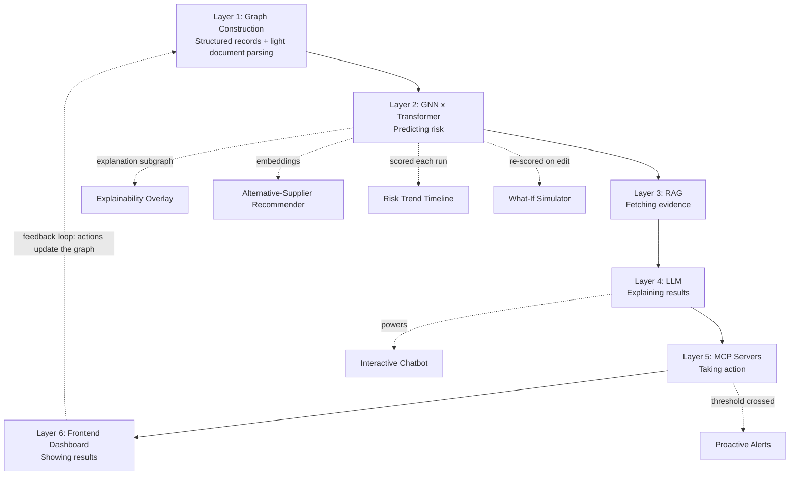

# Graph Neural Network and Generative AI-Based Supply Chain Risk Prediction System

**Six-Layer Architecture with Retrieval-Augmented Reasoning, Autonomous Execution, an Interactive Chatbot, and Extended Decision-Support Features**

*Final Year Project — Problem Statement and System Design | BE CSE (AIML)*

---

## 1. Abstract

Modern supply chains are formed of tightly interconnected suppliers, factories, warehouses, products, transportation routes, and customers. A disruption in one part of the network can cascade across many connected entities. This project presents an intelligent supply chain risk prediction system that represents the supply chain as a graph and applies a Graph Neural Network combined with a Transformer architecture to capture both direct and hidden relationships between entities.

The system's data is largely structured (supplier, order, shipment, and inventory records), with only a small amount of unstructured material such as occasional invoices or purchase-order PDFs. A lightweight document-parsing step normalizes this small unstructured portion into the same structured format before it enters graph construction, so the graph stays continuously updated without a heavyweight ingestion layer. A retrieval-augmented generation (RAG) layer grounds the system's explanations in real historical evidence, while a Large Language Model translates technical risk scores into plain-language explanations and recommended actions. An agentic execution layer built on MCP servers, guarded by a human-in-the-loop approval step, can carry out approved actions directly inside ERP or procurement systems.

Beyond the core six-layer pipeline, the system exposes an **interactive chatbot** for natural-language querying of risk and evidence, and five extended decision-support features: a **what-if scenario simulator**, a **visual explainability overlay**, an **alternative-supplier recommender**, a **risk trend timeline**, and **proactive MCP-based alerts**. Together, these components form a closed-loop system that senses risk, explains it in natural language, lets users interrogate and simulate it, and acts on it — supporting faster, more transparent, and more automated supply chain decision-making.

---

## 2. Problem Statement

Traditional supply chain systems typically analyze suppliers, orders, inventory, and shipments as separate, disconnected records. In reality, supply chain entities are highly connected: a delay from a single supplier can affect multiple components, several products, production schedules, warehouses, and customer orders at once. Conventional machine learning models, which treat each record independently, struggle to capture this network effect.

Even systems that do predict risk generally stop at producing a score or a static report. The prediction still has to be interpreted by an expert, a user has no easy way to ask follow-up questions or test alternatives, and any resulting action — such as switching suppliers or adjusting stock — still has to be carried out by hand in a separate system. This leaves a gap between predicting a disruption, understanding it, and responding to it in time.

This project addresses that gap by combining a Graph Neural Network for relationship-aware risk prediction with a Generative AI and agentic layer that grounds its reasoning in evidence, explains predictions in plain language through an interactive chatbot, lets users simulate alternative scenarios, and — with human approval — executes the recommended action directly in business systems.

---

## 3. Objectives

- Represent the supply chain as a heterogeneous graph of suppliers, components, products, factories, warehouses, shipments, and orders.
- Normalize the small unstructured portion of source documents (e.g. occasional invoices or POs) into structured fields feeding the graph.
- Predict supplier and shipment delay probability and inventory shortage risk using a GNN-Transformer hybrid model.
- Identify the products and customer orders affected by a predicted disruption.
- Ground risk explanations in real historical evidence using retrieval-augmented generation (RAG).
- Generate plain-language explanations and recommended actions using a Large Language Model.
- Provide an **interactive chatbot** so users can query risk scores, explanations, and evidence in natural language.
- Let users run **what-if scenarios** against the trained model without retraining.
- Visually surface **which entities drove a given prediction** directly on the graph view.
- Recommend **alternative suppliers** using the same embeddings the GNN already learns.
- Track and display **risk trends over time**, not just point-in-time scores.
- Proactively **notify** relevant stakeholders when risk crosses a threshold, rather than waiting for a manual check.
- Execute approved recommendations directly in ERP or procurement systems via MCP servers, with a human-in-the-loop approval step.
- Provide an interactive dashboard that ties all of the above together for monitoring risk and controlling agent actions.

---

## 4. Proposed System — Six Layers

The system is organized into six layers that together form a closed loop: structured records (supplemented by a small amount of lightly parsed document data) are assembled into a graph, the graph is used to predict risk, the prediction is grounded with evidence and explained in plain language, and — once approved — the recommended action is executed and fed back into the system. The interactive chatbot and the five extended features (Section 5) sit on top of this pipeline, drawing on what each layer already produces rather than requiring new modeling work.

### Layer 1: Making the Graph — Graph Construction
Structured records (supplier, shipment, order, inventory data) are merged, cleaned, and normalized. Where a small amount of unstructured source material exists — an occasional invoice or purchase-order PDF — a lightweight parsing step (a single extraction call, not a standing agent) converts it into the same structured format. Node types (suppliers, components, products, factories, warehouses, shipments, orders) and edge types (supplies, used-in, ships-to, and others) are defined and assembled into a heterogeneous graph, then converted into the tensor format required for model training.

### Layer 2: Predicting Risk — GNN x Transformer
A Graph Neural Network combined with a Transformer architecture learns from the graph to predict delay probability, shortage risk, and overall disruption impact. It traces which products and orders are affected and produces an explanation subgraph identifying the specific entities driving each prediction, and learns entity embeddings that are reused by the alternative-supplier recommender (Section 5.3).

### Layer 3: Fetching Evidence — RAG
Before any explanation is generated, this layer retrieves supporting evidence — past incident reports, contract clauses, supplier history — from a vector database, so the system's reasoning is grounded in real records rather than generated from memory alone.

### Layer 4: Explaining Results — LLM
A Large Language Model combines the risk score, the explanation subgraph, and the retrieved evidence into a plain-language explanation and a recommended action. This layer directly powers the interactive chatbot (Section 5), so users can ask follow-up questions in natural language rather than only reading a static explanation.

### Layer 5: Taking Action — MCP Servers
Once a recommended action is approved by a human reviewer, this layer carries it out directly in connected business systems — such as raising a purchase order with an alternative supplier or updating a shipment route — through MCP server connections, and logs the result. This layer also carries proactive alerts (Section 5.5) once risk crosses a set threshold.

### Layer 6: Showing Results — Frontend Dashboard
An interactive dashboard displays the supply chain graph colored by risk, a table of at-risk suppliers and orders, the chatbot panel, what-if simulation controls, the explainability overlay, the risk trend timeline, and approve/reject controls for pending agent actions.

### 4.1 System Flow

*Figure 1: The six-layer pipeline (solid arrows) with the feedback loop (dashed, red in the original diagram) and the interactive chatbot plus five extended features (dashed) shown as consumers of each layer's existing output — no new modeling layer is required for any of them.*

---

## 5. Interactive Chatbot and Extended Decision-Support Features

These six additions are deliberately **not** new architectural layers. Each one reuses an output that a layer already produces, so they add usability and demo strength without adding modeling risk.

### 5.1 Interactive Chatbot
Lets a user ask questions like *"Why is Supplier X flagged as high risk?"* in plain language.

- **Draws on:** Layer 2's risk score and explanation subgraph, Layer 3's retrieved evidence, and Layer 5's action log.
- **Flow:** the question is routed to determine intent (score lookup, explanation, general query) → the relevant risk record, explanation-subgraph entities, and RAG evidence are retrieved → the LLM composes a plain-language answer, e.g. *"Supplier X has a 78% delay probability, mainly driven by [factor A] and [factor B], corroborated by [past incident]."*
- If the user asks "what should we do," the chatbot can surface the recommended action; if approved in chat, that intent routes into the Layer 5 MCP execution pipeline with its approval gate — making the chatbot the front door to the whole action pipeline, not just a Q&A widget.
- **Scope note:** a simple retrieve-then-generate pipeline (pull the relevant record + evidence + explanation text → prompt template → LLM response) is sufficient; a fully autonomous tool-calling agent isn't needed here and would add risk for little demo value. Save agentic tool-calling for Layer 5, where it is actually taking action.

### 5.2 What-If Scenario Simulator
Lets a user perturb the graph — e.g. *"what if Supplier X's lead time doubles?"* — and re-run inference on the already-trained GNN to see which downstream products/orders shift into higher risk, without retraining.

- **Draws on:** the trained Layer 2 model, applied to a temporarily edited copy of the graph.
- **Value:** lets a panel watch the model reason live instead of reading a static score — one of the strongest demo moments available.
- **Effort:** moderate — requires a way to temporarily edit graph features and re-score; no new model or layer needed.

### 5.3 Visual Explainability Overlay
Renders Layer 2's explanation subgraph directly on the dashboard's graph view, highlighting the nodes/edges that drove a given risk score in the color of that risk level.

- **Draws on:** GNNExplainer output already produced by Layer 2.
- **Pairs with:** the chatbot — ask "why is this risky," get both a text answer and the relevant part of the graph highlighting simultaneously.
- **Effort:** low — this is wiring existing explanation data to the existing D3 graph visualization, not new computation.

### 5.4 Alternative-Supplier Recommender
When a supplier is flagged, ranks plausible replacements using graph similarity — same component type, similar capacity/location in the embedding space the GNN already learns — instead of only raising an alert.

- **Draws on:** entity embeddings already produced by Layer 2.
- **Integrates with:** Layer 5's action layer — instead of "approve: raise PO with Supplier X," the approval becomes "approve: raise PO with Supplier Y (94% similarity, lower risk)."
- **Value:** adds a recommendation-engine angle to the evaluation section largely for free, since it reuses embeddings the GNN already produces.

### 5.5 Risk Trend Timeline
A time-series view of how a supplier or product's risk score has moved over recent history, rather than only a snapshot.

- **Draws on:** risk scores logged from each Layer 2 run over time.
- **Value:** reframes the story from "here's a risk score" to "here's a system that's been watching this getting worse for three weeks" — a stronger demonstration of catching a slow-building disruption before a static system would.
- **Effort:** low — mostly logging and a chart component.

### 5.6 Proactive Alerts via MCP
Instead of only responding to manual dashboard checks or chat queries, the system proactively pushes a notification (e.g. Slack or email, still routed through MCP) once a risk score crosses a set threshold.

- **Draws on:** Layer 2's risk scores and Layer 5's existing MCP connection.
- **Value:** completes the closed-loop narrative — sense, explain, **notify**, and (with approval) act — instead of only acting when someone happens to check the dashboard.
- **Effort:** small addition to the existing MCP layer; no new infrastructure category.

---

## 6. Inputs and Outputs of Each Layer

| Layer | Input | Output |
|---|---|---|
| 1. Graph Construction | Structured records (supplier, shipment, order data) plus a small amount of lightly parsed document data | Heterogeneous supply chain graph with typed nodes and edges, ready for model training |
| 2. GNN x Transformer | Supply chain graph with node and edge features | Delay/shortage probabilities, affected orders, disruption impact, explanation subgraph, entity embeddings |
| 3. RAG | Risk prediction and/or user query | Retrieved supporting evidence: past incidents, contract clauses, supplier history |
| 4. LLM | Risk scores, explanation subgraph, retrieved evidence | Plain-language explanation and recommended action; chatbot responses |
| 5. MCP Servers | Human-approved recommended action; threshold-crossing risk scores | Action executed in ERP/procurement system (e.g. new PO, updated route) and logged; proactive alerts sent |
| 6. Frontend Dashboard | Risk scores, explanations, recommendations, action logs, embeddings, historical scores | Interactive graph view with explainability overlay, risk table, chatbot panel, what-if controls, trend timeline, and approval controls |

---

## 7. Advantages

- Captures complex, multi-hop supply chain relationships that row-by-row models miss.
- Detects how a disruption at one entity spreads across the network before it fully unfolds.
- Keeps document parsing lightweight and proportional to the small amount of unstructured data actually present, rather than over-building for a problem the project doesn't have.
- Grounds explanations in real historical evidence rather than unguided generation (RAG).
- Supports natural-language interaction through the chatbot, making the system usable by non-technical staff.
- Lets users test alternative scenarios (what-if simulator) without retraining the model.
- Makes predictions visually explainable directly on the graph, not just as text.
- Surfaces concrete alternative actions (supplier recommender) rather than only a flagged risk.
- Shows risk developing over time (trend timeline), not just a single snapshot.
- Notifies stakeholders proactively rather than relying on someone checking a dashboard.
- Closes the loop from detection to explanation to action, instead of stopping at a report.
- Keeps a human-in-the-loop approval step, balancing automation with accountability.

---

## 8. Limitations

- Requires a reasonably large volume of historical data for the GNN to learn reliable patterns.
- Prediction accuracy depends heavily on the quality and completeness of source records.
- Generative AI recommendations may still require human verification before being trusted fully.
- Real-time integration with existing ERP or procurement systems can be technically complex.
- Large, densely connected supply chain graphs may require significant computing resources to train and serve.
- LLM-based explanations carry some risk of inaccuracy (hallucination) if not properly grounded by RAG.
- Agentic execution introduces operational risk if approval controls are misconfigured or bypassed.
- If the volume or variety of unstructured documents grows beyond a small share of the data, the lightweight parsing step would need to be scaled into a more robust ingestion pipeline.
- The what-if simulator reflects the trained model's learned patterns, not a live re-simulation of real-world dynamics — its outputs are illustrative, not guaranteed forecasts.
- The alternative-supplier recommender depends on embedding quality, which is only as good as the graph and training data it was learned from.
- Proactive alerts require careful threshold tuning to avoid alert fatigue from false positives.

---

## 9. Technologies Used

| Component | Technologies |
|---|---|
| Graph Construction | Pandas, Scikit-learn, NetworkX, PyTorch Geometric (HeteroData), Neo4j (optional); LLM API for lightweight document field extraction where needed |
| GNN x Transformer | PyTorch, PyTorch Geometric, GraphSAGE / GAT baseline, Heterogeneous Graph Transformer, GNNExplainer, Monte Carlo simulation |
| RAG | Embedding model, vector database (pgvector / Weaviate), LangGraph retriever node, Text-to-SQL / Text-to-Cypher |
| LLM | Large Language Model API, LangGraph orchestration, prompt templates, business-rule validation |
| Interactive Chatbot | Same LLM API, retrieval-then-generate prompt pipeline, chat UI component |
| What-If Simulator | Trained GNN inference endpoint, temporary graph-feature editing utility |
| Explainability Overlay | GNNExplainer output, D3 graph visualization |
| Supplier Recommender | GNN entity embeddings, similarity search (cosine / nearest-neighbor) |
| Risk Trend Timeline | Time-series logging store, charting library (e.g. Recharts/D3) |
| MCP Servers & Alerts | MCP protocol servers, LangGraph agent loop, approval-gate UI, ERP/procurement API integration, Slack/email notification API |
| Frontend | React / Angular, D3 graph visualization, FastAPI, Spring Boot |

---

## 10. Conclusion

This project proposes an intelligent supply chain risk prediction system that goes beyond static prediction. A GNN-Transformer hybrid models the network of suppliers, products, warehouses, shipments, and orders to predict where disruption will strike next, while a lightweight parsing step keeps the small unstructured portion of the data flowing into the graph and a RAG layer grounds every explanation in real evidence. An interactive chatbot, a what-if simulator, a visual explainability overlay, an alternative-supplier recommender, a risk trend timeline, and proactive MCP-based alerts extend this core pipeline into a system users can question, test, and act on directly — and, with human approval, the system can act on its own recommendations inside real business systems. Together, these layers and features form a closed loop from data to informed, explainable, and actionable supply chain decisions.
