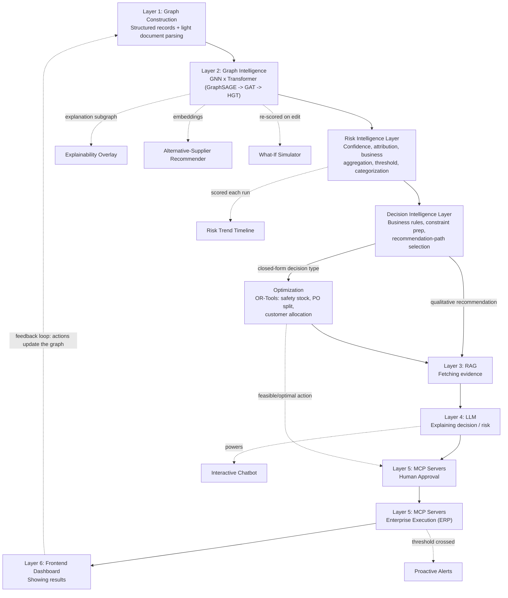

# Graph Neural Network and Generative AI-Based Supply Chain Risk Prediction System

**Six-Layer Architecture with Retrieval-Augmented Reasoning, Autonomous Execution, an Interactive Chatbot, and Extended Decision-Support Features**

*Final Year Project — Problem Statement and System Design | BE CSE (AIML)*

---

## 1. Abstract

Modern supply chains are formed of tightly interconnected suppliers, factories, warehouses, products, transportation routes, and customers. A disruption in one part of the network can cascade across many connected entities. This project presents an intelligent supply chain risk prediction system that represents the supply chain as a graph and applies a Graph Neural Network combined with a Transformer architecture to capture both direct and hidden relationships between entities.

The system's data is largely structured (supplier, order, shipment, and inventory records), with only a small amount of unstructured material such as occasional invoices or purchase-order PDFs. A lightweight document-parsing step normalizes this small unstructured portion into the same structured format before it enters graph construction, so the graph stays continuously updated without a heavyweight ingestion layer. A retrieval-augmented generation (RAG) layer grounds the system's explanations in real historical evidence, while a Large Language Model translates technical risk scores into plain-language explanations and recommended actions. An agentic execution layer built on MCP servers, guarded by a human-in-the-loop approval step, can carry out approved actions directly inside ERP or procurement systems.

Beyond the core six-layer pipeline, the system exposes an **interactive chatbot** for natural-language querying of risk and evidence, and seven extended decision-support features: a **what-if scenario simulator**, a **visual explainability overlay**, an **alternative-supplier recommender**, a **risk trend timeline**, **proactive MCP-based alerts**, an **OR-Tools optimization engine** for provably feasible purchase-order-splitting, safety-stock, and customer-allocation decisions, and a **customer allocation optimizer** that maximizes protected customer value across competing orders for constrained stock during a shortage. Together, these components form a closed-loop system that senses risk, explains it in natural language, lets users interrogate and simulate it, and acts on it — supporting faster, more transparent, and more automated supply chain decision-making.

Layer 2's model is developed and presented as an **architecture ablation with a documented research rationale**: a GraphSAGE baseline (established first, to prove neighborhood aggregation works at all, but with no attention mechanism and no way to weigh which neighbors matter), a GAT intermediate architecture (added next specifically to learn *which* neighbors matter and to improve explainability, but still structurally limited because it treats every node and edge as the same type in a supply chain that plainly is not homogeneous), and the final Heterogeneous Graph Transformer (chosen because supply chains are natively multi-typed — suppliers, components, products, factories, warehouses, shipments, and orders are different kinds of things connected by different kinds of relationships, and only a type-aware attention mechanism models that correctly). All three are trained and evaluated on the same held-out test set, so the final architecture choice is demonstrated by evidence rather than assumed, with every run's classification/regression metrics — plus governance metadata (training dataset, timestamp, experiment ID, git commit, hyperparameters, parameter count) — persisted for comparison.

Two intelligence layers sit immediately downstream of the graph model and are themselves first-class architectural layers, not incidental formatting steps. A **Risk Intelligence Layer** takes the GNN's raw delay/shortage/impact output and turns it into business-ready intelligence: it estimates a confidence score for every prediction, prepares feature attribution and explanation data, aggregates component risk signals into an overall business risk either natively from the model (`gnn_native`) or via a **transparent, documented weighted formula** (`weighted_formula`), evaluates that risk against configurable thresholds, and categorizes it (low/medium/high/critical) — with every score row recording exactly which method and confidence produced it. A **Decision Intelligence Layer** then takes that risk intelligence and decides what kind of response it warrants: applying business rules and policy checks, and — for the three decision types that admit a closed-form constraint model (safety-stock sizing, purchase-order splitting, and customer allocation) — preparing the problem for the OR-Tools optimization engine rather than leaving it to an LLM to guess at numbers. The Large Language Model's role is strictly to *explain* — the risk, the evidence behind it, and (when one exists) the optimizer's decision — in plain language; it never performs the numerical optimization itself. Retrieval-augmented generation supplies the real evidence that grounds every explanation the LLM produces, whether the subject is a raw risk score or an optimizer-produced decision.

---

## 2. Problem Statement

Traditional supply chain systems typically analyze suppliers, orders, inventory, and shipments as separate, disconnected records. In reality, supply chain entities are highly connected: a delay from a single supplier can affect multiple components, several products, production schedules, warehouses, and customer orders at once. Conventional machine learning models, which treat each record independently, struggle to capture this network effect.

Even systems that do predict risk generally stop at producing a score or a static report. The prediction still has to be interpreted by an expert, a user has no easy way to ask follow-up questions or test alternatives, and any resulting action — such as switching suppliers or adjusting stock — still has to be carried out by hand in a separate system. This leaves a gap between predicting a disruption, understanding it, and responding to it in time.

This project addresses that gap by combining a Graph Neural Network for relationship-aware risk prediction with a Generative AI and agentic layer that grounds its reasoning in evidence, explains predictions in plain language through an interactive chatbot, lets users simulate alternative scenarios, and — with human approval — executes the recommended action directly in business systems.

---

## 3. Objectives

- Represent the supply chain as a heterogeneous graph of suppliers, components, products, factories, warehouses, shipments, and orders.
- Normalize the small unstructured portion of source documents (e.g. occasional invoices or POs) into structured fields feeding the graph.
- Predict supplier and shipment delay probability and inventory shortage risk using a GNN-Transformer hybrid model.
- Identify the products and customer orders affected by a predicted disruption.
- Ground risk explanations in real historical evidence using retrieval-augmented generation (RAG).
- Generate plain-language explanations and recommended actions using a Large Language Model.
- Provide an **interactive chatbot** so users can query risk scores, explanations, and evidence in natural language.
- Let users run **what-if scenarios** against the trained model without retraining.
- Visually surface **which entities drove a given prediction** directly on the graph view.
- Recommend **alternative suppliers** using the same embeddings the GNN already learns.
- Track and display **risk trends over time**, not just point-in-time scores.
- Proactively **notify** relevant stakeholders when risk crosses a threshold, rather than waiting for a manual check.
- Execute approved recommendations directly in ERP or procurement systems via MCP servers, with a human-in-the-loop approval step.
- Demonstrate the final GNN architecture choice through a **progressive, evidence-based ablation** (GraphSAGE → GAT → Heterogeneous Graph Transformer) with a documented research rationale for each stage, evaluated on the same held-out data with persisted, comparable metrics rather than an asserted final choice.
- Persist standard classification and regression evaluation metrics, plus model-governance metadata (training dataset, timestamp, experiment ID, git commit, hyperparameters, parameter count, status), for every training run, queryable and comparable across architectures.
- Transform raw GNN output into business-ready intelligence via a **Risk Intelligence Layer**: confidence estimation, feature attribution, business aggregation (including a **transparent, documented weighted formula** as an explainable alternative to the GNN-native score), threshold evaluation, and risk categorization — with every score traceable to the method and confidence that produced it.
- Route flagged entities through a **Decision Intelligence Layer** that applies business rules and policy checks, and determines whether a decision is well-defined enough for constraint-based optimization or requires an LLM-generated qualitative recommendation instead.
- Generate provably optimal purchase-order-split, safety-stock, and customer-allocation decisions using a constraint-based **optimization engine (OR-Tools)** — maximizing protected customer value, SLA compliance, and revenue while respecting inventory, supplier capacity, warehouse capacity, lead time, and production capacity constraints — as an alternative to LLM-generated numerical recommendations for these well-defined decision types.
- Expose confidence, architecture, model version, scoring method, and decision provenance across every prediction, recommendation, and audit record, so nothing is a black box.
- Provide an interactive dashboard that ties all of the above together for monitoring risk and controlling agent actions.

---

## 4. Proposed System — Six Layers, Two Intelligence Stages

The system is organized into six named layers that together form a closed loop: structured records (supplemented by a small amount of lightly parsed document data) are assembled into a graph, the graph is used to predict risk, the prediction is turned into business-ready risk and decision intelligence, grounded with evidence and explained in plain language, and — once approved — the recommended or optimized action is executed and fed back into the system. Between Layer 2 (prediction) and Layer 5 (action), two intelligence stages — the **Risk Intelligence Layer** and the **Decision Intelligence Layer** — do the work of turning a raw model output into a governed business decision; they are described alongside the six numbered layers below because they are genuine architectural stages, not UI formatting. The interactive chatbot and the seven extended features (Section 5) sit on top of this pipeline, drawing on what each layer already produces rather than requiring new modeling work.

### Layer 1: Making the Graph — Graph Construction
Structured records (supplier, shipment, order, inventory data) are merged, cleaned, and normalized. Where a small amount of unstructured source material exists — an occasional invoice or purchase-order PDF — a lightweight parsing step (a single extraction call, not a standing agent) converts it into the same structured format. Node types (suppliers, components, products, factories, warehouses, shipments, orders, customers) and edge types (supplies, used-in, ships-to, placed-by, and others) are defined and assembled into a heterogeneous graph, then converted into the tensor format required for model training.

### Layer 2: Predicting Risk — GNN x Transformer (Graph Intelligence)
A Graph Neural Network combined with a Transformer architecture learns from the graph to predict delay probability, shortage risk, and overall disruption impact — the system's **Graph Intelligence**. This architecture is arrived at through a progressive, evidence-based ablation, each stage chosen for a specific, documented reason rather than assumed:

| Stage | Architecture | Why this stage | Documented limitation |
|---|---|---|---|
| 1 | GraphSAGE | Establishes the baseline: proves neighborhood aggregation over the supply-chain graph captures more signal than row-by-row models, using simple mean/pooling aggregation | No attention mechanism — every neighbor is weighted equally, so it cannot express that one supplier's delay matters more than another's to a given product |
| 2 | GAT (Graph Attention Network) | Adds attention so the model learns *which* neighbors matter for a given prediction, directly improving explainability over GraphSAGE | Still treats the graph as effectively homogeneous — it does not natively distinguish a `SUPPLIES` edge from a `SHIPS_TO` edge or a `Supplier` node from a `Warehouse` node |
| 3 | Heterogeneous Graph Transformer (HGT) — **final** | Chosen because the supply chain graph is natively multi-typed (7+ node types, 8+ edge types); HGT's type-aware attention is the first stage that models "this is a supplier-to-component relationship, weighted differently than a shipment-to-warehouse relationship" directly, rather than approximating it | Highest computational cost of the three; justified only because the earlier two stages demonstrate it is needed, not assumed up front |

All three stages are trained and evaluated on the same held-out test set under a distinct `model_version` each, with metrics and governance metadata (training dataset, timestamp, experiment ID, git commit, hyperparameters, parameter count) persisted per run (Section 5.7), so the final architecture choice is demonstrated by comparison rather than asserted. The layer traces which products and orders are affected, produces an explanation subgraph identifying the specific entities driving each prediction, and learns entity embeddings that are reused by the alternative-supplier recommender (Section 5.4) and the optimization engine (Section 5.7).

### Risk Intelligence Layer — Turning a Prediction into Business Intelligence
Layer 2 produces a raw model output — probabilities and embeddings. The Risk Intelligence Layer is the architectural stage that turns that output into something a business user or downstream decision can act on, and it sits immediately after Layer 2 in every prediction path:

- **Confidence estimation** — a confidence score for every prediction, so a user can distinguish a well-supported flag from a borderline one.
- **Feature attribution / explanation preparation** — packaging the GNNExplainer subgraph (Layer 2 output) into the form the dashboard overlay and chatbot consume.
- **Business aggregation** — computing `impact_score` either natively from the model (`gnn_native`) or via the transparent, documented weighted formula (`weighted_formula`, Section 5.7) over Supplier Risk, Shipment Delay, Inventory Risk, Demand Spike, and Financial Risk signals. The GNN is never replaced by the formula — the formula is a business-facing aggregation layer that can sit alongside or instead of the GNN-native score, and every row records which one produced it.
- **Threshold evaluation and risk categorization** — evaluating the score against configurable thresholds and assigning a `risk_category` (low/medium/high/critical), which is what the Risk Dashboard, alerts, and Decision Intelligence Layer all key off.

Nothing here retrains or replaces the GNN; this layer is a deterministic, auditable transformation of Layer 2's output into governed business intelligence.

### Decision Intelligence Layer — Deciding What Kind of Response a Risk Warrants
Once an entity has a risk-intelligence record (score, confidence, category), the Decision Intelligence Layer decides what happens next:

- **Business rules and policy validation** — every candidate recommendation, however it is generated, is checked against business rules before it can reach a human approver.
- **Constraint preparation** — for the three decision types that admit a closed-form model (safety-stock sizing, purchase-order splitting, customer allocation), this layer assembles the actual constraint set (inventory, supplier capacity, warehouse capacity, lead time, production capacity) that Layer 5's optimization engine solves.
- **Recommendation-path selection** — deciding whether a flagged entity's response is well-defined enough to hand to the OR-Tools optimization engine (Section 5.7) for a provably optimal numeric answer, or whether it instead needs the LLM (Layer 4) to produce a qualitative, evidence-grounded recommendation.
- **Decision trace** — recording which layer(s) — Risk Intelligence, Decision Intelligence, Optimization, LLM — contributed to a given recommendation, so every approval is traceable back to its actual reasoning, not just its final text.

The Large Language Model never performs this layer's job: it explains a decision, evidence, or risk in plain language — it does not compute optimal quantities. Numeric optimization is exclusively the OR-Tools engine's responsibility (Section 5.7).

### Layer 3: Fetching Evidence — RAG
Whenever an explanation is generated — of a risk score, or of a Decision Intelligence / OR-Tools decision — this layer retrieves supporting evidence — past incident reports, contract clauses, supplier history — from a vector database, so the system's reasoning is grounded in real records rather than generated from memory alone. RAG never predicts risk and never makes a decision; it only retrieves evidence for Layer 4 to explain with.

### Layer 4: Explaining Results — LLM
A Large Language Model combines the risk-intelligence record, the explanation subgraph, the retrieved evidence, and — where one exists — the Decision Intelligence / OR-Tools decision, into a plain-language explanation. Where no optimizer decision applies, it also proposes a qualitative recommended action, always subject to Decision Intelligence's business-rule validation before reaching approval. This layer directly powers the interactive chatbot (Section 5), so users can ask follow-up questions in natural language rather than only reading a static explanation. The LLM explains; it never optimizes numerically.

### Layer 5: Taking Action — MCP Servers
Once a recommended or optimized action is approved by a human reviewer, this layer carries it out directly in connected business systems — such as raising a purchase order with an alternative supplier or updating a shipment route — through MCP server connections, and logs the result. Recommended actions may originate from the LLM, the alternative-supplier recommender, the OR-Tools optimization engine (Section 5.7, covering safety-stock, PO-splitting, and customer allocation), or the Decision Intelligence Layer directly — all route through the same human-approval gate before execution. This layer also carries proactive alerts (Section 5.5) once risk crosses a set threshold.

### Layer 6: Showing Results — Frontend Dashboard
An interactive dashboard displays the supply chain graph colored by risk, a table of at-risk suppliers and orders, model metadata and confidence panels, the architecture-comparison and decision-trace views, the chatbot panel, what-if simulation controls, the explainability overlay, the risk trend timeline, and approve/reject controls for pending agent actions.

### 4.1 System Flow

*Figure 1: The six-layer pipeline (solid arrows), with the Risk Intelligence and Decision Intelligence stages shown explicitly between Layer 2 and Layer 3/5, the feedback loop (dashed), and the interactive chatbot plus seven extended features (dashed) shown as consumers of pipeline output — no new modeling layer is required for any of the extended features themselves.*

---

## 5. Interactive Chatbot and Extended Decision-Support Features

These eight additions are deliberately **not** new architectural layers. Each one reuses an output that a layer already produces, so they add usability and demo strength without adding modeling risk.

### 5.1 Interactive Chatbot
Lets a user ask questions like *"Why is Supplier X flagged as high risk?"* in plain language.

- **Draws on:** Layer 2's risk score and explanation subgraph, Layer 3's retrieved evidence, and Layer 5's action log.
- **Flow:** the question is routed to determine intent (score lookup, explanation, general query) → the relevant risk record, explanation-subgraph entities, and RAG evidence are retrieved → the LLM composes a plain-language answer, e.g. *"Supplier X has a 78% delay probability, mainly driven by [factor A] and [factor B], corroborated by [past incident]."*
- If the user asks "what should we do," the chatbot can surface the recommended action; if approved in chat, that intent routes into the Layer 5 MCP execution pipeline with its approval gate — making the chatbot the front door to the whole action pipeline, not just a Q&A widget.
- **Scope note:** a simple retrieve-then-generate pipeline (pull the relevant record + evidence + explanation text → prompt template → LLM response) is sufficient; a fully autonomous tool-calling agent isn't needed here and would add risk for little demo value. Save agentic tool-calling for Layer 5, where it is actually taking action.

### 5.2 What-If Scenario Simulator
Lets a user perturb the graph — e.g. *"what if Supplier X's lead time doubles?"* — and re-run inference on the already-trained GNN to see which downstream products/orders shift into higher risk, without retraining.

- **Draws on:** the trained Layer 2 model, applied to a temporarily edited copy of the graph.
- **Value:** lets a panel watch the model reason live instead of reading a static score — one of the strongest demo moments available.
- **Effort:** moderate — requires a way to temporarily edit graph features and re-score; no new model or layer needed.

### 5.3 Visual Explainability Overlay
Renders Layer 2's explanation subgraph directly on the dashboard's graph view, highlighting the nodes/edges that drove a given risk score in the color of that risk level.

- **Draws on:** GNNExplainer output already produced by Layer 2.
- **Pairs with:** the chatbot — ask "why is this risky," get both a text answer and the relevant part of the graph highlighting simultaneously.
- **Effort:** low — this is wiring existing explanation data to the existing D3 graph visualization, not new computation.

### 5.4 Alternative-Supplier Recommender
When a supplier is flagged, ranks plausible replacements using graph similarity — same component type, similar capacity/location in the embedding space the GNN already learns — instead of only raising an alert.

- **Draws on:** entity embeddings already produced by Layer 2.
- **Integrates with:** Layer 5's action layer — instead of "approve: raise PO with Supplier X," the approval becomes "approve: raise PO with Supplier Y (94% similarity, lower risk)."
- **Value:** adds a recommendation-engine angle to the evaluation section largely for free, since it reuses embeddings the GNN already produces.

### 5.5 Risk Trend Timeline
A time-series view of how a supplier or product's risk score has moved over recent history, rather than only a snapshot.

- **Draws on:** risk scores logged from each Layer 2 run over time.
- **Value:** reframes the story from "here's a risk score" to "here's a system that's been watching this getting worse for three weeks" — a stronger demonstration of catching a slow-building disruption before a static system would.
- **Effort:** low — mostly logging and a chart component.

### 5.6 Proactive Alerts via MCP
Instead of only responding to manual dashboard checks or chat queries, the system proactively pushes a notification (e.g. Slack or email, still routed through MCP) once a risk score crosses a set threshold.

- **Draws on:** Layer 2's risk scores and Layer 5's existing MCP connection.
- **Value:** completes the closed-loop narrative — sense, explain, **notify**, and (with approval) act — instead of only acting when someone happens to check the dashboard.
- **Effort:** small addition to the existing MCP layer; no new infrastructure category.

### 5.7 OR-Tools Optimization Engine
For three well-defined decision types — safety-stock sizing, purchase-order splitting across suppliers, and customer allocation under shortage (Section 5.8) — a constraint solver (OR-Tools) generates a decision that is provably optimal (not merely plausible) under real business constraints, prepared by the Decision Intelligence Layer and never computed by the LLM.

- **Draws on:** the same inventory, lead-time, and demand signals already flowing into Layer 1/2, plus supplier/warehouse/factory capacity fields, as solver constraints; the Decision Intelligence Layer assembles the exact constraint set for each request.
- **Scope:** deliberately narrow — safety-stock sizing, PO-splitting, and customer allocation only, not a general multi-objective solver, routing, or scheduling engine.
- **Integrates with:** Layer 5 — optimizer-generated decisions route through the same human-approval gate as LLM-generated recommendations, with `action_requests.source = 'optimizer'` distinguishing their origin, and Layer 4 (LLM) explains the resulting decision in plain language.
- **Value:** adds an optimality/feasibility guarantee the LLM's free-text recommendations cannot offer, for the decision types where a closed-form constraint model applies.

### 5.8 Customer Allocation Under Shortage
When a shortage-flagged product cannot fulfill every open order competing for it, this feature solves customer allocation as a constrained optimization problem via the OR-Tools engine (Section 5.7), instead of leaving the allocation decision to ad hoc manual judgment or a simple sort.

- **Objective:** maximize protected customer value — a weighted combination of strategic importance (customer priority tier), SLA compliance, revenue protection (order value), and penalty avoidance (contract penalty exposure).
- **Subject to:** available inventory, supplier capacity, warehouse capacity, lead time, and production capacity — the same operational constraints already captured on `suppliers`, `warehouses`, and `factories`.
- **Draws on:** Layer 2's shortage-risk output (which products/orders are affected) plus first-class `Customer` graph nodes (priority tier, contract terms) introduced alongside this feature.
- **Integrates with:** Layer 5 — the allocation decision is surfaced as a recommended action and routes through the same approval workflow as other actions, with its decision trace (Decision Intelligence Layer) recorded for audit.
- **Value:** replaces an inconsistent, order-by-order manual process with one mathematically optimal, evidence-backed allocation decision across all competing orders for the same constrained stock.

---

## 6. Inputs and Outputs of Each Layer

| Layer | Input | Output |
|---|---|---|
| 1. Graph Construction | Structured records (supplier, shipment, order, customer data) plus a small amount of lightly parsed document data | Heterogeneous supply chain graph with typed nodes and edges, ready for model training |
| 2. GNN x Transformer (Graph Intelligence) | Supply chain graph with node and edge features | Delay/shortage probabilities, affected orders, disruption impact, explanation subgraph, entity embeddings |
| Risk Intelligence Layer | Layer 2's raw scores and embeddings | Confidence score, `impact_score` (via `gnn_native` or `weighted_formula`), `risk_category`, threshold evaluation |
| Decision Intelligence Layer | Risk-intelligence record for a flagged entity | Recommendation-path decision (optimizer vs. LLM), assembled solver constraints, business-rule validation result, decision trace |
| 3. RAG | Risk prediction, decision, and/or user query | Retrieved supporting evidence: past incidents, contract clauses, supplier history |
| 4. LLM | Risk-intelligence record, explanation subgraph, retrieved evidence, optimizer decision (if any) | Plain-language explanation; qualitative recommended action where no optimizer path applies; chatbot responses |
| 5. MCP Servers | Human-approved recommended/optimized action; threshold-crossing risk scores | Action executed in ERP/procurement system (e.g. new PO, updated route) and logged; proactive alerts sent |
| 6. Frontend Dashboard | Risk scores, confidence, model metadata, explanations, recommendations, decision traces, action logs, embeddings, historical scores | Interactive graph view with explainability overlay, risk table, confidence/model-metadata panels, decision trace view, chatbot panel, what-if controls, trend timeline, and approval controls |
| Architecture Ablation & Model Governance | GraphSAGE, GAT, and HGT trained on the same graph/held-out split | Per-architecture classification/regression metrics plus governance metadata (dataset, timestamp, experiment ID, git commit, hyperparameters), persisted and compared |
| OR-Tools Optimization Engine | Inventory, lead-time, demand, and capacity signals; a safety-stock, PO-split, or customer-allocation decision request from Decision Intelligence | An optimal action decision (quantities/splits/allocation) with a feasibility guarantee, routed into Layer 5's approval workflow |

---

## 7. Advantages

- Captures complex, multi-hop supply chain relationships that row-by-row models miss.
- Detects how a disruption at one entity spreads across the network before it fully unfolds.
- Keeps document parsing lightweight and proportional to the small amount of unstructured data actually present, rather than over-building for a problem the project doesn't have.
- Grounds explanations in real historical evidence rather than unguided generation (RAG).
- Supports natural-language interaction through the chatbot, making the system usable by non-technical staff.
- Lets users test alternative scenarios (what-if simulator) without retraining the model.
- Makes predictions visually explainable directly on the graph, not just as text.
- Surfaces concrete alternative actions (supplier recommender) rather than only a flagged risk.
- Shows risk developing over time (trend timeline), not just a single snapshot.
- Notifies stakeholders proactively rather than relying on someone checking a dashboard.
- Closes the loop from detection to explanation to action, instead of stopping at a report.
- Keeps a human-in-the-loop approval step, balancing automation with accountability.
- Demonstrates *why* the final architecture was chosen — not just that it was — through a documented research rationale plus a persisted, comparable ablation.
- Separates "did the GNN predict this" from "is this business-ready" via an explicit Risk Intelligence Layer, so confidence, categorization, and business aggregation are governed steps, not incidental formatting.
- Separates "what should happen" from "what does the LLM say" via an explicit Decision Intelligence Layer, so numeric optimization is never delegated to a language model.
- Makes `impact_score` inspectable via a documented weighted formula, not only a trusted black-box output, while never replacing the GNN itself.
- Guarantees optimality (not just plausibility) for safety-stock, PO-splitting, and customer-allocation decisions via constraint-based optimization.
- Replaces ad hoc, inconsistent shortage allocation with one mathematically optimal, evidence-backed decision across all competing orders.
- Makes model governance (dataset, timestamp, experiment, git commit, hyperparameters, status) a first-class, queryable record instead of tribal knowledge in a training log.
- Exposes confidence and decision provenance everywhere a score or recommendation is shown, so nothing looks more certain than it is.

---

## 8. Limitations

- Requires a reasonably large volume of historical data for the GNN to learn reliable patterns.
- Prediction accuracy depends heavily on the quality and completeness of source records.
- Generative AI recommendations may still require human verification before being trusted fully.
- Real-time integration with existing ERP or procurement systems can be technically complex.
- Large, densely connected supply chain graphs may require significant computing resources to train and serve.
- LLM-based explanations carry some risk of inaccuracy (hallucination) if not properly grounded by RAG.
- Agentic execution introduces operational risk if approval controls are misconfigured or bypassed.
- If the volume or variety of unstructured documents grows beyond a small share of the data, the lightweight parsing step would need to be scaled into a more robust ingestion pipeline.
- The what-if simulator reflects the trained model's learned patterns, not a live re-simulation of real-world dynamics — its outputs are illustrative, not guaranteed forecasts.
- The alternative-supplier recommender depends on embedding quality, which is only as good as the graph and training data it was learned from.
- Proactive alerts require careful threshold tuning to avoid alert fatigue from false positives.
- The OR-Tools optimization engine is scoped narrowly to safety-stock sizing, PO-splitting, and customer allocation; it is not a general-purpose supply-chain solver and does not cover routing, scheduling, or vehicle routing.
- The customer allocation optimizer depends on customer priority, order value, and SLA penalty data, and supplier/warehouse/factory capacity data, being available or credibly synthesizable in the project's dataset; where it is not, `contract_terms` is scoped down to only the fields actually present rather than left as an aspirational field.
- Confidence scores reflect model-internal uncertainty signals, not a guarantee of real-world correctness — they are a relative, comparative signal for triage, not a calibrated probability of ground truth.
- Model governance here is intentionally lightweight (a version, dataset reference, experiment ID, git commit, and hyperparameters per run) — it is not a full MLOps model registry with automated promotion/rollback, which is out of scope for a prototype.

---

## 9. Technologies Used

| Component | Technologies |
|---|---|
| Graph Construction | Pandas, Scikit-learn, NetworkX, PyTorch Geometric (HeteroData), Neo4j (optional); LLM API for lightweight document field extraction where needed |
| GNN x Transformer | PyTorch, PyTorch Geometric, GraphSAGE / GAT baseline, Heterogeneous Graph Transformer, GNNExplainer, Monte Carlo simulation |
| RAG | Embedding model, vector database (pgvector / Weaviate), LangGraph retriever node, Text-to-SQL / Text-to-Cypher |
| LLM | Large Language Model API, LangGraph orchestration, prompt templates, business-rule validation |
| Interactive Chatbot | Same LLM API, retrieval-then-generate prompt pipeline, chat UI component |
| What-If Simulator | Trained GNN inference endpoint, temporary graph-feature editing utility |
| Explainability Overlay | GNNExplainer output, D3 graph visualization |
| Supplier Recommender | GNN entity embeddings, similarity search (cosine / nearest-neighbor) |
| Risk Trend Timeline | Time-series logging store, charting library (e.g. Recharts/D3) |
| MCP Servers & Alerts | MCP protocol servers, LangGraph agent loop, approval-gate UI, ERP/procurement API integration, Slack/email notification API |
| Architecture Ablation, Evaluation & Model Governance | Persisted evaluation-run store, model registry (version/dataset/experiment/git commit/hyperparameters/status), scikit-learn metrics (precision/recall/F1/ROC-AUC, MAE/RMSE/MAPE), inference-time/parameter-count tracking |
| Risk Intelligence Layer | Confidence estimation utilities, weighted-formula aggregation, threshold evaluation, risk categorization |
| Decision Intelligence Layer | Business-rule/policy validation, constraint-preparation logic, recommendation-path routing, decision-trace logging |
| OR-Tools Optimization Engine | Google OR-Tools constraint solver (safety-stock, PO-split, customer allocation) |
| Frontend | React / Angular, D3 graph visualization, FastAPI, Spring Boot |

---

## 10. Conclusion

This project proposes an intelligent supply chain risk prediction system that goes beyond static prediction. A GNN-Transformer hybrid — arrived at through a demonstrated, evidence-based ablation from GraphSAGE through GAT to a Heterogeneous Graph Transformer, with every run's metrics and governance metadata persisted for comparison — models the network of suppliers, products, warehouses, shipments, and orders to predict where disruption will strike next. A Risk Intelligence Layer turns that raw prediction into confidence-scored, categorized, business-ready intelligence — either as a GNN-native output or via a transparent weighted formula, with the computation method always recorded — and a Decision Intelligence Layer decides whether the resulting response is well-defined enough for the OR-Tools optimization engine to solve optimally (safety-stock sizing, PO-splitting, customer allocation) or needs the LLM's qualitative judgment instead; the LLM only ever explains, never optimizes numerically. A lightweight parsing step keeps the small unstructured portion of the data flowing into the graph, and a RAG layer grounds every explanation — of a risk score or of an optimizer decision — in real evidence. An interactive chatbot, a what-if simulator, a visual explainability overlay, an alternative-supplier recommender, a risk trend timeline, and proactive MCP-based alerts extend this core pipeline into a system users can question, test, and act on directly — and, with human approval, the system can act on its own recommendations and optimized decisions inside real business systems. Together, these layers and features form a closed loop from data to informed, explainable, optimal, and actionable supply chain decisions.
