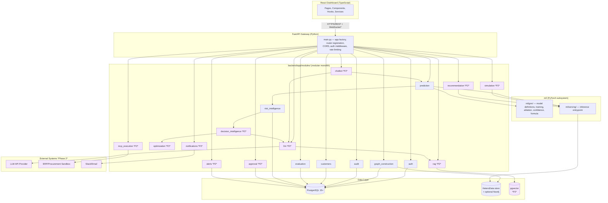

# Task Planner

## Graph Neural Network and Generative AI-Based Supply Chain Risk Prediction System

**Engineering Task Specification — Every Task, Fully Specified, No Summarization**

Version: 1.0
Status: Baseline
Consistent with: `docs/problem_statement.md`, `docs/01_Product_Requirement_Document.md` through `docs/14_Project_Roadmap.md`, `docs/team_plan.md`

---

## How To Use This Document

This document is the execution-level companion to `docs/team_plan.md`. Where `team_plan.md` establishes *who* owns *what*, on *what* sprint, with *what* completion gate, this document specifies *how* — every task carried by every person, in both deliveries, is broken down to the level of exact files, exact classes, exact database columns, exact API contracts, exact error codes, and exact test cases. No task description in this document should require the implementer to make an undocumented judgment call about scope, naming, or contract shape — those calls have already been made here, tied back to the specific document and section that authorizes them.

Every task in this document follows one fixed template (Section 0.7). Every task carries an explicit `Depends On` / `Unlocks` pair so the full project can be read as a directed acyclic graph, not just a sprint calendar. Section "Full Dependency Graph" (below the Project Overview) gives that graph in one place; each task repeats its own local slice of it inline, per the requested format.

Task IDs are inherited unchanged from `docs/team_plan.md`: `P<person>.<n>` for Delivery 1 (MVP), `D<person>.<n>` for Delivery 2 (Advanced AI Features).

---

# 0. Project Overview

## 0.1 Purpose of This Document

`docs/team_plan.md` answers "who does what, by when, and what proves it's done." This document answers "what, precisely, do they build" — for all 44 Delivery 1 tasks (P1.1–P1.8, P2.1–P2.9, P3.1–P3.10, P4.1–P4.10, P5.1–P5.7) and all 34 Delivery 2 tasks (D1.1–D1.6, D2.1–D2.6, D3.1–D3.7, D4.1–D4.7, D5.1–D5.8), 78 tasks in total. Every task specification in this document is self-contained: an implementer should be able to open this document to a single task and start work without needing to read any other document first, though every claim here is traceable back to the numbered documentation set (`docs/01_...md` through `docs/14_...md`) for anyone who wants the full rationale.

## 0.2 Overall Architecture

The system is a layered, service-oriented architecture (Document 2 §3.1) delivered as a Python/FastAPI backend, a Python/PyTorch ML subsystem, a React/TypeScript frontend, and a PostgreSQL + pgvector + (optional) Neo4j data layer, orchestrated with Docker Compose. Delivery 1 ships seven backend modules (`auth`, `graph_construction`, `prediction`, `audit`, `customers`, `evaluation`, `risk_intelligence`) behind a single FastAPI gateway; Delivery 2 adds eleven more modules (`rag`, `llm`, `chatbot`, `simulation`, `recommendation`, `decision_intelligence`, `optimization`, `approval`, `mcp_execution`, `alerts`, `notifications`) additively — no Delivery 1 module is restructured to make room for them (Document 8 §2).



This diagram is the single source of truth every task in this document is validated against: a task that would draw an arrow not shown here (e.g., a frontend component calling PostgreSQL directly, or the `graph_construction` module reaching into `prediction`'s repository) is out of scope and must be flagged, not implemented.

## 0.3 Responsibilities of Each Person

| Person   | Delivery 1                            | Delivery 2                   | Owns (folders)                                                                                                                                                                                                                                                                 |
| -------- | ------------------------------------- | ---------------------------- | ------------------------------------------------------------------------------------------------------------------------------------------------------------------------------------------------------------------------------------------------------------------------------ |
| Person 1 | Graph Construction & Data Engineering | RAG & Vector Database        | `backend/app/modules/graph_construction/`, `ml/gnn/features.py` (D1, incl. Customer node/shortage scenarios); `backend/app/modules/rag/` (D2)                                                                                                                                                                              |
| Person 2 | GNN + Transformer AI Development      | LLM & Chatbot                | `ml/gnn/` (D1, incl. ablation, `confidence.py`, `risk_formula.py`), `ml/serving/`; `backend/app/modules/llm/`, `backend/app/modules/chatbot/` (D2)                                                                                                                                                                                   |
| Person 3 | Backend & AI Serving                  | Advanced Frontend Features   | `backend/app/core/`, `backend/app/modules/auth/`, `backend/app/modules/prediction/`, `backend/app/modules/audit/`, `backend/app/modules/customers/`, `backend/app/modules/evaluation/`, `backend/app/modules/risk_intelligence/` (D1); `frontend/src/pages/chatbot/`, `frontend/src/pages/simulator/`, `frontend/src/pages/recommendation/`, `frontend/src/pages/trend/`, `frontend/src/pages/allocation/` (D2) |
| Person 4 | Frontend & Visualization              | MCP & Enterprise Integration | `frontend/src/` (D1, incl. `pages/customers/`, `pages/models/`); `backend/app/modules/approval/`, `backend/app/modules/mcp_execution/`, `backend/app/modules/alerts/`, `backend/app/modules/notifications/`, `backend/app/modules/decision_intelligence/` (D2)                                                                                                |
| Person 5 | Integration, Testing & Deployment     | Advanced Graph AI            | `.github/workflows/`, `backend/tests/`, `frontend/tests/`, `docker-compose*.yml` (D1); `backend/app/modules/simulation/`, `backend/app/modules/recommendation/`, `backend/app/modules/optimization/` (D2)                                                                                               |

No person's task in this document ever instructs them to edit a file inside another person's owned folder without that being an explicit, gated integration point (see each task's "Integration Points" and "What MUST NOT Be Modified" subsections).

## 0.4 Communication Between Modules

- **Frontend ↔ Gateway:** HTTPS/REST, `application/json`, versioned under `/api/v1/` (Document 9 §5). Delivery 2 chat adds WebSocket/SSE at `/ws/chat/{session_id}` with a documented non-streaming REST fallback (Document 9 §10.2).
- **Gateway ↔ Modules:** in-process function calls through each module's service interface (`backend/app/modules/<name>/service.py`) — Delivery 1 is a modular monolith (Document 8 §3), not separate network services, even though `docker-compose.yml` packages each conceptual service as its own container per Document 2 §6.1 for demo purposes. A module's service is the *only* legal entry point another module may call; no module imports another module's `repository.py` directly (Document 8 §7 boundary rule, enforced by import-linting per risk BD-01).
- **Modules ↔ Database:** SQLAlchemy async session via each module's `repository.py`, injected through `shared/dependencies.py` (Document 8 §5).
- **Prediction/Simulation/Recommendation ↔ ML subsystem:** direct call into `ml/serving/`'s inference entrypoint — stateless, no write path in the hot request (FR-GNN-07).
- **LLM/Chatbot ↔ External LLM API:** HTTPS/REST, credentials from environment (`LLM_API_KEY`), never exposed to the frontend (Document 12 §8).
- **MCP Execution ↔ ERP/Notification targets:** Model Context Protocol over stdio/HTTP transport (Document 2 §7), routed through `backend/app/modules/mcp_execution/adapters/`.
- **Background jobs:** `graph_rebuild_job` (Phase 1, APScheduler), `evidence_reindex_job`, `alert_evaluation_job`, `notification_dispatch_queue` (Phase 2, Redis-backed) — all live in `backend/app/jobs/` (Document 8 §11).

## 0.5 Coding Conventions

**Python (backend, ml/):**

- Python 3.11+, `ruff` for lint, `black`-compatible formatting, `mypy` for type-checking on `app/` and `ml/`.
- Every module follows controller → service → repository layering (Document 8 §7). Controllers do request/response DTO mapping only; services hold business logic; repositories hold SQLAlchemy queries only.
- DTOs are Pydantic `BaseModel` subclasses named `<Entity>CreateDTO`, `<Entity>ResponseDTO`, `<Entity>UpdateDTO` (Document 8 §8). SQLAlchemy models are never returned directly from a controller.
- Commit messages follow Conventional Commits (`feat:`, `fix:`, `docs:`, `refactor:`, `test:`), referencing the relevant FR/NFR ID where one exists (Document 11 §10), e.g. `feat(auth): implement FR-AUTH-05 account lockout`.
- No secret, API key, or credential is ever hardcoded; all come from environment variables listed in Document 11 §8 and read via `app/core/config.py`.

**TypeScript (frontend):**

- React + TypeScript, `eslint` + `prettier`, functional components with hooks only (no class components).
- Screens live under `frontend/src/pages/<screen>/`; shared UI primitives under `frontend/src/components/`; API calls isolated to `frontend/src/services/<domain>Service.ts` — no component calls `fetch`/`axios` directly.
- Every data-bound screen implements the loading/error/empty triad (NFR-11, Document 3 §7) using the shared `<AsyncState>` wrapper component built in P4.2 — no screen reimplements its own spinner/error banner.

**Testing:**

- Backend: `pytest` + `pytest-asyncio` + `httpx` for API tests, run against a dedicated, freshly-migrated test database — never the dev/staging database (Document 13 §3).
- Frontend: `vitest` + `react-testing-library`.
- Every task's "Testing Requirements" subsection lists the exact test cases required before that task's Definition of Done can be marked met; these test cases map back to Document 13's tables wherever one exists.

**Branching:**

- Trunk-based, `main` always demoable. One branch per task: `feature/<task-id>-<short-description>` for Delivery 1 (e.g. `feature/p1-3-graph-assembly`), `phase-2/<task-id>-<short-description>` for Delivery 2 (Document 11 §10–11).
- Every branch merges via a self-reviewed, CI-gated PR. CI must pass lint, type-check, unit tests, and integration tests before merge (Document 11 §9).

## 0.6 Repository Structure Assumptions

Every task in this document assumes the following repository layout exists or is being created by that task. This is the authoritative tree; no task should introduce a top-level folder not shown here without updating this section first.

```
repo-root/
├── backend/
│   ├── app/
│   │   ├── main.py
│   │   ├── core/
│   │   │   ├── config.py
│   │   │   ├── security.py
│   │   │   └── logging.py
│   │   ├── modules/
│   │   │   ├── auth/                 {controller,service,repository,dto,models}.py
│   │   │   ├── graph_construction/   {controller,service,repository,dto,parsing,models}.py
│   │   │   ├── prediction/           {controller,service,repository,dto,models}.py
│   │   │   ├── audit/                {controller,service,models}.py
│   │   │   ├── customers/            {controller,service,repository,dto,models}.py
│   │   │   ├── evaluation/           {controller,service,repository,dto,models}.py
│   │   │   ├── risk_intelligence/    {controller,service,dto}.py
│   │   │   ├── rag/                  {controller,service,repository,dto}.py           [Delivery 2]
│   │   │   ├── llm/                  {service,prompt_templates,business_rules}.py       [Delivery 2]
│   │   │   ├── chatbot/              {controller,service,repository,dto,models}.py      [Delivery 2]
│   │   │   ├── simulation/           {controller,service}.py                            [Delivery 2]
│   │   │   ├── recommendation/       {controller,service}.py                            [Delivery 2]
│   │   │   ├── decision_intelligence/ {controller,service,constraint_prep,policy_validation,decision_trace}.py [Delivery 2]
│   │   │   ├── optimization/         {controller,service,solvers/}.py                   [Delivery 2]
│   │   │   ├── approval/             {controller,service,repository,dto,models}.py      [Delivery 2]
│   │   │   ├── mcp_execution/        {service,adapters/,models}.py                      [Delivery 2]
│   │   │   ├── alerts/               {controller,service,repository,models}.py          [Delivery 2]
│   │   │   └── notifications/        {service,models}.py                                [Delivery 2]
│   │   ├── shared/
│   │   │   ├── dependencies.py
│   │   │   ├── pagination.py
│   │   │   ├── exceptions.py
│   │   │   └── cache.py                                                                  [Delivery 2]
│   │   └── jobs/
│   │       ├── graph_rebuild_job.py
│   │       ├── evidence_reindex_job.py                                                   [Delivery 2]
│   │       └── alert_evaluation_job.py                                                   [Delivery 2]
│   ├── ml/
│   │   ├── gnn/            model.py, train.py, features.py, explain.py, confidence.py, risk_formula.py
│   │   └── serving/        inference.py, simulate.py [Delivery 2]
│   ├── migrations/         Alembic versions (Document 5 §7)
│   ├── tests/               unit/, integration/, api/
│   └── requirements.txt / pyproject.toml
├── frontend/
│   ├── src/
│   │   ├── pages/           login/, dashboard/, graph/, risk/, suppliers/, warehouses/,
│   │   │                    orders/, shipments/, products/, inventory/, admin/, audit/,
│   │   │                    profile/, settings/, customers/, models/, chatbot/ [D2], simulator/ [D2],
│   │   │                    recommendation/ [D2], alerts/ [D2], allocation/ [D2]
│   │   ├── components/      shared UI primitives (AsyncState, DataTable, GraphCanvas, ...)
│   │   ├── services/        authService.ts, entityService.ts, predictionService.ts, ...
│   │   ├── hooks/           useAuth.ts, usePagination.ts, ...
│   │   ├── routes/          router configuration, feature-flag gating for Phase 2 screens
│   │   └── types/           shared TypeScript interfaces mirroring backend DTOs
│   ├── tests/
│   └── package.json
├── docker-compose.yml
├── docker-compose.phase2.yml
├── .github/workflows/ci.yml
└── docs/                    this documentation set
```

## 0.7 How to Read a Task Entry

Every task below follows this exact template, in this exact order:

1. **Task ID / Title / Sprint / Owner**
2. **Objective** — one to two sentences, what this task achieves.
3. **Background** — why this task exists, which document/section authorizes its scope.
4. **Repository Inspection Requirements** — what the implementer must check in the actual repository before writing any code.
5. **Existing Code Assumptions** — what must already exist, in working state, from prior tasks.
6. **Implementation Checklist** — numbered, actionable, in execution order.
7. **Files to Create** — exact paths.
8. **Files to Modify** — exact paths.
9. **Classes / Components / Controllers / Services / Models / DTOs** — exact names and responsibilities.
10. **Database Tables** — exact tables/columns touched, with reference to Document 5.
11. **API Contracts** — exact method, path, request/response shape, with reference to Document 9 (where applicable).
12. **Integration Points** — which other modules/people's work this touches, and how.
13. **External Dependencies** — exact packages/services.
14. **Error Handling** — exact error cases and the codes/responses they produce.
15. **Testing Requirements** — exact test cases required.
16. **Regression Checklist** — what must be re-verified as still working.
17. **Expected Output** — what a successful run/demo of this task looks like.
18. **Deliverables** — the concrete artifacts produced.
19. **Definition of Done** — the checklist that must be fully true to close the task.
20. **Git Commit Message** — the Conventional Commits message(s) for this task.
21. **What MUST NOT Be Modified** — explicit guardrails against scope creep into another owner's territory.
22. **Depends On** — task IDs that must be complete before this task can start.
23. **Unlocks** — task IDs that cannot start until this task is complete.

## 0.8 Global Definitions Referenced Throughout

- **Standard pagination envelope:** `{ "items": [...], "page": 1, "page_size": 20, "total": 123 }` (Document 9 §5).
- **Standard error envelope:** `{ "error": { "code": "STRING_CODE", "message": "human-readable" } }` (Document 9 §5).
- **Common error codes:** `401 UNAUTHENTICATED`, `403 FORBIDDEN`, `404 NOT_FOUND`, `409 CONFLICT`, `422 VALIDATION_ERROR`, `429 RATE_LIMITED`, `500 INTERNAL_ERROR`, `503 SERVICE_UNAVAILABLE`.
- **Auth requirement shorthand:** "Bearer JWT (`role1`,`role2`)" means the endpoint requires a valid `Authorization: Bearer <JWT>` header and the caller's role must be one of the listed roles, enforced via the `require_role(*roles)` FastAPI dependency (Document 8 §13).
- **`<AsyncState>` component:** a shared frontend wrapper (built in P4.2) that renders a skeleton while loading, an error banner with retry on failure, and an empty-state message when data is absent but the request succeeded — every data-bound screen in this document composes this component rather than reimplementing states.

---

# Full Dependency Graph

The table below is the complete `Depends On` / `Unlocks` graph for all 69 tasks, given once for quick lookup. Each task's own entry (Sections 1–5 for Delivery 1, Sections 6–10 for Delivery 2) repeats its row inline.

| Task | Depends On                                     | Unlocks                              |
| ---- | ---------------------------------------------- | ------------------------------------ |
| P1.1 | —                                             | P1.2, P2.1, P3.1                     |
| P1.2 | P1.1                                           | P1.3, P2.2                           |
| P1.3 | P1.2                                           | P1.4, P2.3, P3.3                     |
| P1.4 | P1.3                                           | P1.5, P3.3                           |
| P1.5 | P1.4                                           | P1.6, P2.5 (parallel support)        |
| P1.6 | P1.5                                           | P1.7, P4.4                           |
| P1.7 | P1.6                                           | P1.8, P5.6                           |
| P1.8 | P1.7                                           | P5.7 (Delivery 1 sign-off)           |
| P2.1 | P1.1                                           | P2.2, P3.4                           |
| P2.2 | P1.2, P2.1                                     | P2.3                                 |
| P2.3 | P1.3, P2.2                                     | P2.4                                 |
| P2.4 | P2.3                                           | P2.5, P5.4                           |
| P2.5 | P2.4                                           | P2.6, P3.5, P4.5, P5.4               |
| P2.6 | P2.5                                           | P2.7                                 |
| P2.7 | P2.6                                           | P2.8, P5.6                           |
| P2.8 | P2.7                                           | P5.7 (Delivery 1 sign-off)           |
| P2.9 | P2.5                                           | P3.10                                |
| P3.1 | P1.1                                           | P3.2, P4.1                           |
| P3.2 | P3.1, P1.1                                     | P3.3, P4.2, P4.4, P5.2               |
| P3.3 | P1.3, P1.4, P3.2                               | P3.4                                 |
| P3.4 | P2.1, P3.2                                     | P3.5                                 |
| P3.5 | P2.5, P3.4                                     | P3.6, P4.5, P5.5                     |
| P3.6 | P3.1                                           | P3.7, P4.6                           |
| P3.7 | P3.6                                           | P3.8, P5.6                           |
| P3.8 | P3.7                                           | P5.7 (Delivery 1 sign-off)           |
| P3.9 | P3.1, P1.1                                     | P4.9                                 |
| P3.10 | P2.6, P2.9, P3.5                              | P4.10                                |
| P4.1 | P3.1                                           | P4.2                                 |
| P4.2 | P4.1                                           | P4.3, P4.4                           |
| P4.3 | P4.2                                           | P4.5                                 |
| P4.4 | P3.2, P4.2, P1.6                               | P4.5                                 |
| P4.5 | P3.5, P4.3, P4.4                               | P4.6, P5.5                           |
| P4.6 | P3.6, P4.5                                     | P4.7                                 |
| P4.7 | P4.6                                           | P4.8, P5.6                           |
| P4.8 | P4.7                                           | P5.7 (Delivery 1 sign-off)           |
| P4.9 | P3.9                                           | (none blocking; informs D3.7)        |
| P4.10 | P3.10                                         | (none blocking; informs D3.7)        |
| P5.1 | —                                             | P5.2, P3.1 (Docker Compose collab)   |
| P5.2 | P3.2, P5.1                                     | P5.3                                 |
| P5.3 | P1.3, P1.4, P5.2                               | P5.4                                 |
| P5.4 | P2.4, P2.5, P5.3                               | P5.5                                 |
| P5.5 | P3.5, P4.5, P5.4                               | P5.6                                 |
| P5.6 | P1.7, P2.7, P3.7, P4.7, P5.5                   | P5.7                                 |
| P5.7 | P1.8, P2.8, P3.8, P4.8, P5.6                   | **M6 — all Delivery 2 tasks** |
| D1.1 | P1.7 (Phase 1`documents` table), P5.7 (M6)   | D1.2, D2.1                           |
| D1.2 | D1.1                                           | D1.3                                 |
| D1.3 | D1.2                                           | D1.4, D2.1, D2.2                     |
| D1.4 | D1.3                                           | D1.5                                 |
| D1.5 | D1.4                                           | D1.6, D2.1, D2.4                     |
| D1.6 | D1.5                                           | D5.5 (Delivery 2 sign-off)           |
| D2.1 | D1.3, P5.7 (M6), P2.5                          | D2.2                                 |
| D2.2 | D2.1                                           | D2.3, D4.1                           |
| D2.3 | D2.2, P5.7                                     | D2.4                                 |
| D2.4 | D2.3, D1.3                                     | D2.5, D3.1, D4.1                     |
| D2.5 | D2.4                                           | D2.6                                 |
| D2.6 | D2.5                                           | D5.5 (Delivery 2 sign-off)           |
| D3.1 | D2.4                                           | D3.2                                 |
| D3.2 | D3.1, P4.5 (basic highlight)                   | D3.6                                 |
| D3.3 | D5.1                                           | D3.6                                 |
| D3.4 | D5.2                                           | D3.6                                 |
| D3.5 | D5.3                                           | D3.6                                 |
| D3.6 | D3.1, D3.2, D3.3, D3.4, D3.5, D4.4             | D5.5 (Delivery 2 sign-off)           |
| D3.7 | D3.4, D3.6, D5.7, D5.8, D4.7                   | D5.5 (Delivery 2 sign-off)           |
| D4.1 | P5.7 (`users`/RBAC), D2.2                    | D4.2, D4.7                           |
| D4.2 | D4.1                                           | D4.3 (indirect), D4.5                |
| D4.3 | P5.7 (`risk_scores`), D5.3                   | D4.4                                 |
| D4.4 | D4.3                                           | D3.6, D4.5                           |
| D4.5 | D4.2, D2.2                                     | D4.6, D5.5 (Delivery 2 sign-off)     |
| D4.6 | D4.5                                           | D5.5 (Delivery 2 sign-off)           |
| D4.7 | D4.1, P5.7 (Risk Intelligence output), D2.1    | D5.7, D5.8, D3.7 (indirect)          |
| D5.1 | P5.7 (trained model, graph store)              | D3.3, D5.5                           |
| D5.2 | P5.7 (embeddings, FR-GNN-06)                   | D3.4, D5.4, D5.5                     |
| D5.3 | P5.7 (`risk_scores`)                         | D3.5, D4.3, D5.5                     |
| D5.4 | D5.2                                           | D5.5                                 |
| D5.5 | D5.1, D5.2, D5.3, D5.4, D1.6, D2.6, D3.6, D3.7, D4.5 | D5.6                            |
| D5.6 | D5.5                                           | **M11 — Phase 2 Sign-off**    |
| D5.7 | D4.7                                           | D3.7 (indirect), D5.8                |
| D5.8 | D4.7, D5.7, P1.5, P3.9                         | D3.7 (indirect)                      |

---

# 1. Delivery 1 — Person 1: Graph Construction & Data Engineering

## P1.1 — Dataset Sourcing & Schema Collaboration

**Sprint:** S1 (2026-07-20 – 2026-08-02) · **Owner:** Person 1

### Objective

Produce a realistic, scenario-rich Phase 1 dataset and, jointly with Person 3, freeze the PostgreSQL schema so every downstream person can build against a stable contract from Day 1.

### Background

Document 5 defines the full Phase 1 schema; Document 1 §12 assumes dataset volume/quality will be sufficient for the GNN to learn meaningful patterns. This task is the schema-freeze event referenced throughout `docs/team_plan.md` P1.1/P2.1/P3.1 and Document 14's "SCHEMA → GC → GNN" dependency chain. Nothing downstream can proceed on real data until this task closes.

### Repository Inspection Requirements

- Confirm the repository root matches Section 0.6's tree; if `backend/` does not yet exist, this task creates its skeleton jointly with P3.1 (coordinate before starting — do not create `backend/migrations/` independently of Person 3).
- Check `backend/migrations/` for any pre-existing Alembic revisions (`alembic history`) — none are expected at this point; if any exist, halt and confirm with Person 3 before altering them.
- Check for a `data/` or `seed/` folder from any prior scaffolding commit; if absent, this task creates it.

### Existing Code Assumptions

- None. This is the first task in the dependency graph alongside P3.1 and P5.1.

### Implementation Checklist

1. Decide real-vs-synthetic data strategy per Document 1 §12 assumption; if synthetic, generate with a fixed random seed (document the seed in `data/README.md`).
2. Draft entity list and cardinalities: target ≥15 suppliers, ≥30 components, ≥20 products, ≥5 factories, ≥8 warehouses, ≥150 orders, ≥200 shipments, spanning at least 6 months of historical timestamps to support the time-based train/test split Person 2 needs in P2.2.
3. Enumerate the 10 minimum business scenarios required by the P1.2 completion gate: (a) on-time delivery, (b) supplier delay, (c) inventory shortage, (d) carrier delay, (e) warehouse capacity constraint, (f) cancelled order, (g) partial shipment, (h) repeat-offender supplier (multiple delays), (i) new supplier with no history, (j) seasonal demand spike causing at-risk order status.
4. Draft the full PostgreSQL DDL for all Phase 1 tables listed in Document 5 §6.1–6.14, §6.22–6.25 (`users`, `suppliers`, `components`, `products`, `product_components`, `factories`, `warehouses`, `inventory`, `customers`, `orders` (incl. `customer_id`), `order_items`, `shipments`, `documents`, `risk_scores` (incl. `scoring_method`/`confidence`/`risk_category`), `explanation_subgraphs`, `model_evaluation_runs`, `model_registry`, `audit_log`), matching every column, datatype, and constraint exactly as specified.
5. Review the draft DDL jointly with Person 2 (for node/edge feature sufficiency) and Person 3 (for repository-layer feasibility) in a scheduled 1-hour sync before end of S1.
6. Finalize and write the first Alembic migration (`backend/migrations/versions/0001_phase1_schema.py`) — coordinate the actual `alembic revision` authoring with Person 3, who owns the migration tool, but Person 1 authors the DDL content.
7. Write the seed script (`data/seed_phase1.py`) that populates all 15 tables with the scenario-rich dataset from step 3.
8. Write the node/edge type inventory document (`docs/internal/graph_schema_notes.md`) enumerating the 8 node types (incl. `Customer`) and 9 edge types (incl. `PLACED_BY`) from Document 6 §5–6, mapped to source tables/columns.

### Files to Create

- `data/README.md` — dataset generation strategy, random seed, scenario list.
- `data/seed_phase1.py` — idempotent seed script.
- `data/fixtures/*.csv` or `*.json` — raw scenario data if not generated inline.
- `docs/internal/graph_schema_notes.md` — node/edge type inventory.
- `backend/migrations/versions/0001_phase1_schema.py` (co-authored with Person 3).

### Files to Modify

- None (greenfield task).

### Classes / Components / Controllers / Services / Models / DTOs

- None yet — this task is schema and data only. SQLAlchemy models are created in P3.1 against this frozen DDL.

### Database Tables

Creates (via migration, Document 5 §6): `users`, `suppliers`, `components`, `products`, `product_components`, `factories`, `warehouses`, `inventory`, `customers`, `orders`, `order_items`, `shipments`, `documents`, `risk_scores`, `explanation_subgraphs`, `model_evaluation_runs`, `model_registry`, `audit_log` — full column/constraint/index spec exactly as Document 5 §6.1–6.14, §6.22–6.25.

### API Contracts

None — no endpoints exist yet.

### Integration Points

- Person 2 (P2.1): consumes the frozen schema to define model input features.
- Person 3 (P3.1): consumes the frozen schema to build SQLAlchemy models and the Alembic migration.
- Person 5 (P5.2): will write contract tests against tables this task defines.

### External Dependencies

- PostgreSQL 15+ (local Docker container, coordinated with P5.1/P3.1).
- Faker or a comparable synthetic-data library, if synthetic data is chosen.

### Error Handling

- Not applicable at the schema/data level; malformed seed rows must fail the seed script loudly (raise, do not silently skip) so data problems are caught before other people build on the dataset.

### Testing Requirements

- `backend/tests/unit/test_seed_data_integrity.py`: every foreign key in the seeded dataset resolves to an existing row; no orphaned `order_items`, `product_components`, or `shipments`.
- Manual verification: each of the 10 scenarios in step 3 is confirmed queryable via a raw SQL check before sign-off.

### Regression Checklist

- N/A (first task).

### Expected Output

A running PostgreSQL instance with all 15 Phase 1 tables created and populated, queryable via `psql`, with the 10 required scenarios present and verifiable.

### Deliverables

- Frozen Phase 1 schema (Alembic migration `0001_phase1_schema.py`).
- Seed script + seeded database.
- Node/edge type inventory document.

### Definition of Done

- [ ] All 18 Phase 1 tables exist with exact column/constraint match to Document 5.
- [ ] Seed script runs idempotently and populates ≥15 suppliers, ≥150 orders per step 2 targets.
- [ ] All 10 business scenarios from step 3 are present and manually verified.
- [ ] Person 2 and Person 3 have signed off on the schema in the S1 sync.
- [ ] `docs/internal/graph_schema_notes.md` is committed and reviewed.

### Git Commit Message

```
feat(data): freeze Phase 1 PostgreSQL schema and seed scenario dataset

Co-authored-by: Person 3 <person3@team>
```

### What MUST NOT Be Modified

- Do not create SQLAlchemy ORM models — that is Person 3's task (P3.1), against this DDL.
- Do not touch `backend/app/` — it does not exist yet at this point in the timeline other than what P3.1 scaffolds in parallel.

### Depends On

— (no dependency; this is a Day-1 task alongside P3.1 and P5.1)

### Unlocks

P1.2, P2.1, P3.1

---

## P1.2 — Data Cleaning & Feature Engineering

**Sprint:** S2 (2026-08-03 – 2026-08-16) · **Owner:** Person 1

### Objective

Transform the raw seeded dataset into a cleaned, normalized, feature-engineered form ready for graph assembly, and implement the lightweight document-parsing step for invoice/PO PDFs.

### Background

Document 10 §5 defines the exact feature-derivation logic per node/edge type. FR-GC-04 requires cleaning/normalization/deduplication/type coercion; FR-GC-05 requires a single-extraction-call document parser, explicitly *not* a standing agent, to keep scope proportional to the small unstructured-data share (Document 1 §12 assumption).

### Repository Inspection Requirements

- Confirm P1.1's migration has been applied (`alembic current` shows `0001_phase1_schema`) and the seed script has been run against the dev database.
- Inspect `ml/gnn/` — if Person 2 has begun P2.1/P2.2 scaffolding, read `ml/gnn/features.py` if it exists as a stub to align function signatures before implementing.

### Existing Code Assumptions

- P1.1's schema and seed data exist and are queryable.
- `ml/gnn/` directory exists (created jointly with Person 2 in P2.1) with at least an empty `features.py`.

### Implementation Checklist

1. Implement `clean_records()` in `ml/gnn/features.py`: deduplication by natural key (e.g., `orders.order_number`, `products.sku`), type coercion (string-to-numeric, string-to-timestamp), and missing-value handling (documented default-fill policy per column, never silent drops).
2. Implement per-Document-10-§5 feature derivations: `lead_time_days` (min-max/z-score scaling), `reliability_history` (rolling on-time delivery rate over last N shipments), `capacity_score` (scaling), `days_to_eta`/`days_to_due` (recomputed at each snapshot), `stock_level`/`reorder_threshold` (scaling), `quantity_required` (scaling), one-hot categoricals (`component_type`, `category`, `location` bucket, `status` fields, `Customer.priority_tier`).
3. Implement the two supervision-target label derivations: `delayed` (from `shipments.status = 'delayed'` OR `delivered_at > eta`) and `shortage` (from historical `inventory.stock_level` dropping below `reorder_threshold` while linked orders remained open).
4. Implement `backend/app/modules/graph_construction/parsing.py`: a single-call LLM extraction function `parse_document(file_bytes, document_type) -> ExtractedFields` that reads an uploaded invoice/PO PDF and returns structured fields (supplier reference, line items, amounts, dates) — explicitly a single request/response call, no loop, no agent state.
5. Wire `parsing.py`'s output to populate `documents.extracted_fields` (JSONB) and set `documents.parse_status` to `parsed` or `failed`.
6. Add data-quality warning surfacing: any record failing cleaning/coercion is logged with a structured warning (not silently dropped), per NFR-17 — implement `DataQualityWarning` exception class raised and caught at the pipeline boundary, written to a `data_quality_warnings.log` for now (full `audit_log` wiring happens in P3.3+).
7. Verify against the 10 scenarios from P1.1 that each produces the expected feature values (e.g., the "repeat-offender supplier" scenario produces a `reliability_history` below 0.5).

### Files to Create

- `ml/gnn/features.py` (or extend the stub from P2.1).
- `backend/app/modules/graph_construction/parsing.py`.
- `backend/tests/unit/test_features.py`.
- `backend/tests/fixtures/sample_invoice.pdf`, `backend/tests/fixtures/sample_po.pdf`.

### Files to Modify

- None outside newly created files (this task does not touch other owners' code).

### Classes / Components / Controllers / Services / Models / DTOs

- `ExtractedFields` (Pydantic model in `parsing.py`): `supplier_reference: str | None`, `line_items: list[dict]`, `total_amount: float | None`, `document_date: datetime | None`.
- `DataQualityWarning` (exception class in `ml/gnn/features.py`).
- Functions: `clean_records(df) -> pd.DataFrame`, `derive_supplier_features(df) -> pd.DataFrame`, `derive_shipment_features(df) -> pd.DataFrame`, `derive_labels(df) -> pd.DataFrame`, `parse_document(file_bytes, document_type) -> ExtractedFields`.

### Database Tables

- Reads: `suppliers`, `shipments`, `inventory`, `orders`, `order_items`, `product_components`.
- Writes: `documents.extracted_fields`, `documents.parse_status` (via the function; actual controller wiring for the upload endpoint is P3.2).

### API Contracts

None directly — `parse_document()` is a pure function consumed by P3.2's `POST /api/v1/documents` controller.

### Integration Points

- Person 2: `ml/gnn/features.py` functions are called directly by P2.2's training scaffold.
- Person 3: `parsing.py`'s `parse_document()` is called by P3.2's document-upload controller.

### External Dependencies

- Pandas, Scikit-learn (`sklearn.preprocessing.MinMaxScaler`/`StandardScaler`).
- LLM API client (same provider as Document 2 §5's Phase 2 choice, used here only for the single extraction call — credential sourced from `LLM_API_KEY` env var per Document 11 §8, even though full LLM orchestration is Phase 2).
- PDF text extraction library (e.g., `pypdf` or `pdfplumber`) to feed text into the extraction call.

### Error Handling

- Malformed PDF (unreadable/corrupt): `parse_document()` catches the extraction failure and returns `parse_status='failed'` with the error reason — never raises uncaught into the caller (mirrors Document 13 §14 edge case).
- Missing required field during cleaning: raises `DataQualityWarning`, logged, and the record is quarantined (written to a `quarantine/` fixture) rather than silently dropped or silently included with a bad value.

### Testing Requirements

- `test_features.py::test_lead_time_scaling` — known input produces expected scaled output.
- `test_features.py::test_reliability_history_rolling_window` — a supplier with 3 delayed and 7 on-time shipments in the last 10 produces `reliability_history ≈ 0.7`.
- `test_features.py::test_delayed_label_derivation` — a shipment with `delivered_at > eta` is labeled `delayed=True`.
- `test_features.py::test_shortage_label_derivation` — inventory dropping below threshold while an order is open is labeled `shortage=True`.
- `test_features.py::test_data_quality_warning_on_malformed_record` — a record with an invalid type raises `DataQualityWarning` and is quarantined, not dropped silently.
- `backend/tests/unit/test_parsing.py::test_parse_valid_invoice` — `sample_invoice.pdf` returns populated `ExtractedFields`.
- `backend/tests/unit/test_parsing.py::test_parse_malformed_pdf_returns_failed_status` — a corrupted fixture returns `parse_status='failed'`, no exception escapes.

### Regression Checklist

- Re-run P1.1's seed integrity test; confirm cleaning does not alter row counts unexpectedly (only expected quarantine cases removed).

### Expected Output

A cleaned, feature-engineered in-memory/DataFrame representation of the dataset, and a working `parse_document()` function verified against two fixture PDFs.

### Deliverables

- `ml/gnn/features.py` with all derivation functions and passing unit tests.
- `backend/app/modules/graph_construction/parsing.py` with passing unit tests.
- Data-quality warning log demonstrated against at least one deliberately malformed fixture.

### Definition of Done

- [ ] All 10 business scenarios from P1.1 produce correct derived features and labels, manually spot-checked.
- [ ] `parse_document()` succeeds on both fixture PDFs and fails gracefully on a corrupted one.
- [ ] `test_features.py` and `test_parsing.py` are fully green in CI (once P5.1's CI exists — if CI is not yet live, run locally and note in the PR description).
- [ ] No record is silently dropped; every cleaning failure is visible in the quarantine log.

### Git Commit Message

```
feat(graph): implement Document 10 feature engineering and FR-GC-05 document parsing
```

### What MUST NOT Be Modified

- Do not implement the `POST /api/v1/documents` controller/route — that belongs to Person 3 (P3.2), which calls this task's `parse_document()`.
- Do not modify `ml/gnn/model.py` if it exists from P2.1/P2.2 — feature functions only.

### Depends On

P1.1

### Unlocks

P1.3, P2.2

---

## P1.3 — Heterogeneous Graph Assembly

**Sprint:** S3 (2026-08-17 – 2026-08-30) · **Owner:** Person 1

### Objective

Assemble the cleaned, feature-engineered data into a PyTorch Geometric `HeteroData` object and, optionally, a structurally identical Neo4j graph, per Document 6.

### Background

Document 6 §5–6 defines the exact 7 node types and 8 Phase 1 edge types; §7 defines the tensor encoding. FR-GC-06 requires the `HeteroData` assembly; this is the hard handoff point in Document 14 §7's "SCHEMA → GC → GNN" chain — Person 2 cannot begin real encoder work (P2.3) until this task closes.

### Repository Inspection Requirements

- Confirm P1.2's feature functions are merged to `main` and pass CI.
- Inspect `ml/gnn/` for any encoder stub Person 2 has started in P2.2, to confirm the expected `HeteroData` shape (node feature dimensionality per Document 10 §7) matches what this task will produce.

### Existing Code Assumptions

- P1.2's cleaned/feature-engineered data pipeline is functional and callable.
- PostgreSQL contains the seeded, cleaned dataset.

### Implementation Checklist

1. Create `ml/gnn/graph_builder.py` with `build_hetero_data(session) -> HeteroData`.
2. Implement node assembly for all 8 types (`Supplier`, `Component`, `Product`, `Factory`, `Warehouse`, `Shipment`, `Order`, `Customer`) per Document 6 §5, applying P1.2's feature encodings to produce each node type's `x` tensor per Document 6 §7's dimensionality table.
3. Implement edge assembly for all 9 Phase 1 edge types (`SUPPLIES`, `USED_IN`, `STOCKED_AT`, `MANUFACTURED_AT`, `SHIPS_FROM`, `SHIPS_TO`, `FULFILLS`, `ORDERED`, `PLACED_BY`) per Document 6 §6, including edge-level `edge_attr` tensors where specified (`quantity_required`, `stock_level`/`reorder_threshold`, `eta` proximity/status).
4. Handle the `MANUFACTURED_AT` inference case per Document 6 §6: restrict inference to shipments with an unambiguous factory-to-product link; flag ambiguous cases as a data-quality warning (risk GD-02 mitigation), reusing P1.2's `DataQualityWarning`.
5. Build the node-ID → tensor-row mapping dictionary per node type (Document 6 §10), enabling O(1) lookup from PostgreSQL UUID to tensor row — required by Person 2's explainability output (P2.5) and Person 3's serving layer (P3.4).
6. Implement the optional Neo4j export in `ml/gnn/neo4j_export.py`: `MERGE`-based idempotent node/edge creation matching the tensor graph exactly (risk GD-01 mitigation).
7. Serialize the assembled `HeteroData` to disk (`ml/gnn/artifacts/hetero_data_snapshot.pt`) so Person 2 can load a fixture without re-running assembly.

### Files to Create

- `ml/gnn/graph_builder.py`
- `ml/gnn/neo4j_export.py` (optional representation)
- `ml/gnn/artifacts/hetero_data_snapshot.pt` (generated artifact, not hand-written)
- `backend/tests/unit/test_graph_builder.py`

### Files to Modify

- `ml/gnn/features.py` — only if graph assembly surfaces a bug in a P1.2 feature function; any such change must be flagged to Person 2 since they may already depend on the current output shape.

### Classes / Components / Controllers / Services / Models / DTOs

- `HeteroGraphBuilder` (class in `graph_builder.py`) with methods `build_nodes()`, `build_edges()`, `build()`.
- `NodeIdMap` (dict-of-dicts helper: `{node_type: {postgres_uuid: tensor_row_index}}`).

### Database Tables

- Reads all 15 Phase 1 tables via P1.2's cleaning/feature pipeline; writes nothing (graph is a derived, rebuildable representation, never the source of truth — Document 6 §3 assumption).

### API Contracts

None — this is an offline/library-level task; the update pipeline (P1.4) and serving layer (P3.4) expose it via API later.

### Integration Points

- Person 2 (P2.3): loads `hetero_data_snapshot.pt` to build and validate the GNN encoder.
- Person 3 (P3.3): wraps this module as the `graph_construction` service.

### External Dependencies

- PyTorch, PyTorch Geometric (`torch_geometric.data.HeteroData`).
- NetworkX (intermediate graph manipulation if needed before tensor conversion).
- Neo4j Python driver (optional path).

### Error Handling

- Ambiguous `MANUFACTURED_AT` link: raise `DataQualityWarning`, exclude the edge, continue assembly (do not fail the whole build for one ambiguous edge).
- Missing node feature (e.g., a supplier with no `lead_time_days`): apply P1.2's documented default-fill policy; never leave a `NaN` in a tensor passed to Person 2's model.

### Testing Requirements

- `test_graph_builder.py::test_all_eight_node_types_present` — assembled `HeteroData` has non-empty `x` for all 8 node types (incl. `Customer`).
- `test_graph_builder.py::test_all_nine_edge_types_present` — assembled graph has non-empty `edge_index` for all 9 edge types (incl. `PLACED_BY`).
- `test_graph_builder.py::test_node_feature_dimensionality_matches_document_10` — each node type's feature width matches Document 10 §7's approximate dimensionality table.
- `test_graph_builder.py::test_no_nan_in_tensors` — no `NaN`/`inf` present anywhere in `x` or `edge_attr`.
- `test_graph_builder.py::test_node_id_map_round_trip` — every PostgreSQL UUID in the seed data resolves to exactly one tensor row and back.
- `test_graph_builder.py::test_ambiguous_manufactured_at_flagged_not_crashed` — a deliberately ambiguous fixture produces a warning, not an exception.

### Regression Checklist

- Re-run P1.2's feature unit tests to confirm no regression from any fix made in step 7 of the checklist above.

### Expected Output

Person 2 can run `torch.load("ml/gnn/artifacts/hetero_data_snapshot.pt")` and immediately perform a forward pass through a placeholder encoder without any shape errors.

### Deliverables

- `ml/gnn/graph_builder.py`, fully tested.
- A serialized `HeteroData` fixture artifact.
- Optional Neo4j export script.

### Definition of Done

- [ ] Person 2 confirms (in writing/PR review) that a forward pass against the produced `HeteroData` runs without shape errors.
- [ ] All tests in `test_graph_builder.py` pass.
- [ ] Ambiguous `MANUFACTURED_AT` cases are flagged, not silently wrong.

### Git Commit Message

```
feat(graph): assemble HeteroData graph per Document 6 node/edge spec (FR-GC-06)
```

### What MUST NOT Be Modified

- Do not implement the GNN encoder itself (`ml/gnn/model.py`) — that is Person 2's exclusive territory starting P2.3.
- Do not create the `graph_construction` FastAPI controller — that is Person 3's P3.3.

### Depends On

P1.2

### Unlocks

P1.4, P2.3, P3.3

---

## P1.4 — Incremental Graph Update Pipeline

**Sprint:** S4 (2026-08-31 – 2026-09-13) · **Owner:** Person 1

### Objective

Implement incremental graph updates (only affected nodes/edges recomputed) and a full-rebuild fallback, per FR-GC-07 and Document 6 §11.

### Background

FR-GC-07 requires incremental updates rather than a full rebuild on every change, to keep graph freshness proportional to change size, not graph size. Document 6 §11 specifies the exact incremental-vs-full-rebuild decision logic and Neo4j `MERGE` idempotency requirement.

### Repository Inspection Requirements

- Confirm P1.3's `graph_builder.py` is merged and its tests pass.
- Check whether Person 3 has begun scaffolding `backend/app/jobs/graph_rebuild_job.py` (P3.3 may have a stub) — if so, align this task's public function signature to what that stub expects.

### Existing Code Assumptions

- P1.3's full-build path (`HeteroGraphBuilder.build()`) works correctly.

### Implementation Checklist

1. Add `HeteroGraphBuilder.update_incremental(changed_rows: list[ChangedRow]) -> HeteroData` to `graph_builder.py`: recompute only the feature row(s) for affected node(s) and their adjacent edges.
2. Define `ChangedRow` (dataclass: `table: str`, `row_id: UUID`, `operation: Literal["insert","update"]`).
3. Implement change-detection glue: given a list of changed PostgreSQL rows (supplied by the caller — the scheduling/detection mechanism itself is Person 3's job in P3.3's `graph_rebuild_job`), map each to the node/edge type(s) it affects, using the `NodeIdMap` from P1.3.
4. Implement the full-rebuild trigger condition per Document 6 §11: schema change (detected via Alembic revision mismatch) or a periodic drift-correction pass — expose `HeteroGraphBuilder.needs_full_rebuild() -> bool`.
5. Extend `neo4j_export.py` to support incremental `MERGE` updates matching the same changed-row list, guaranteeing idempotency (a replayed update must not duplicate nodes/edges).
6. Write a before/after node-count regression test proving an incremental update does not touch unrelated node types.

### Files to Create

- `backend/tests/unit/test_incremental_update.py`

### Files to Modify

- `ml/gnn/graph_builder.py` — add incremental update methods.
- `ml/gnn/neo4j_export.py` — add incremental `MERGE` support.

### Classes / Components / Controllers / Services / Models / DTOs

- `ChangedRow` (dataclass).
- `HeteroGraphBuilder.update_incremental()`, `HeteroGraphBuilder.needs_full_rebuild()` (new methods on the existing class).

### Database Tables

- Reads any of the 15 Phase 1 tables, scoped to the specific `changed_rows` supplied.

### API Contracts

None directly — consumed by Person 3's `graph_rebuild_job` (P3.3).

### Integration Points

- Person 3 (P3.3/P3.4): the `graph_rebuild_job` scheduled task calls `update_incremental()` on a detected change and `needs_full_rebuild()` to decide the path.

### External Dependencies

- Same as P1.3 (PyTorch Geometric, Neo4j driver).

### Error Handling

- If a changed row references a node/edge type not yet in the graph (e.g., a brand-new supplier), treat as an insert, not an error.
- If `update_incremental()` is called with a row whose table is unrecognized, raise a clear `ValueError` rather than silently no-op-ing — a silent no-op here would produce a stale graph invisibly.

### Testing Requirements

- `test_incremental_update.py::test_new_shipment_updates_only_shipment_and_adjacent_edges` — before/after node-count diff shows exactly one new `Shipment` node and its `SHIPS_FROM`/`SHIPS_TO`/`FULFILLS` edges, no other node type count changes.
- `test_incremental_update.py::test_replayed_update_is_idempotent` — applying the same `ChangedRow` twice does not duplicate the node (Neo4j `MERGE` check).
- `test_incremental_update.py::test_needs_full_rebuild_detects_schema_change` — a simulated Alembic revision mismatch triggers `True`.

### Regression Checklist

- Re-run all P1.3 tests to confirm the full-build path (`build()`) is untouched by the new incremental methods.

### Expected Output

A new shipment record inserted into PostgreSQL results in an updated `HeteroData` graph with exactly the new node and its edges added, verifiable via a before/after diff script.

### Deliverables

- Incremental update capability on `HeteroGraphBuilder`.
- Idempotent Neo4j incremental export.

### Definition of Done

- [ ] All three new tests pass.
- [ ] Person 3 confirms the `update_incremental()` signature is callable from their `graph_rebuild_job` stub.
- [ ] No regression in P1.3's full-build tests.

### Git Commit Message

```
feat(graph): add incremental graph updates and full-rebuild fallback (FR-GC-07)
```

### What MUST NOT Be Modified

- Do not implement the scheduling mechanism (APScheduler job definition) — that is Person 3's P3.3.

### Depends On

P1.3

### Unlocks

P1.5, P3.3

---

## P1.5 — Graph Validation & Data-Quality Warnings

**Sprint:** S5 (2026-09-14 – 2026-09-27) · **Owner:** Person 1

### Objective

Add structural graph validation and formalize the data-quality warning path so malformed input surfaces visibly (NFR-17) rather than silently corrupting the graph or the model Person 2 is training in parallel.

### Background

NFR-17 requires the system to surface data-quality warnings rather than silently degrade. This task runs concurrently with Person 2's P2.4/P2.5 training and inference work — its purpose is partly to actively support debugging any encoding anomalies Person 2 discovers.

### Repository Inspection Requirements

- Confirm P1.4 is merged. Check with Person 2 (informal sync) whether any node/edge feature anomalies have surfaced during P2.3/P2.4 training — this task should address any reported issues as part of its scope.

### Existing Code Assumptions

- P1.4's incremental update pipeline works.
- P1.2's `DataQualityWarning` exception class exists.

### Implementation Checklist

1. Implement `ml/gnn/validate.py::validate_graph(hetero_data) -> ValidationReport`: checks for orphan nodes (no edges), dangling edge indices (referencing a non-existent node row), degenerate feature vectors (all-zero or all-`NaN` rows).
2. Define `ValidationReport` (dataclass: `orphan_nodes: list`, `dangling_edges: list`, `degenerate_features: list`, `is_valid: bool`).
3. Formalize `DataQualityWarning` into a structured, queryable log format (JSON lines) at `logs/data_quality_warnings.jsonl`, with fields: `timestamp`, `table`, `row_id`, `field`, `reason`.
4. Add a deliberate-fault test fixture (a record with a missing required field) and confirm it produces exactly one visible warning entry, not a crash and not a silent drop.
5. Pair with Person 2 for one session to debug any node/edge encoding issue surfaced during their S4–S5 training; document the resolution in `docs/internal/graph_schema_notes.md`.
6. Author ≥3 shortage scenarios: a product/warehouse combination with ≥2 open orders (from different customers, at least one `strategic`-tier) competing for stock below combined demand — the exact fixture shape Delivery 2's customer-allocation optimizer (D5.8) will use for its own test fixtures.
7. Extend `validate_graph()` to check the `Customer`/`PLACED_BY` slice specifically: every `Order` node resolves to exactly one `Customer` via `PLACED_BY`, and no `Customer` node is orphaned (zero placed orders is valid for a new customer, but flagged for review, not treated as an error).

### Files to Create

- `ml/gnn/validate.py`
- `backend/tests/unit/test_validate.py`
- `logs/data_quality_warnings.jsonl` (runtime-generated, `.gitignore`d; commit only a `.gitkeep`)

### Files to Modify

- `ml/gnn/features.py` — upgrade `DataQualityWarning` raising sites to write to the new structured log format.
- `docs/internal/graph_schema_notes.md` — append findings from the Person 2 pairing session.

### Classes / Components / Controllers / Services / Models / DTOs

- `ValidationReport` (dataclass).
- `validate_graph(hetero_data) -> ValidationReport` (function).

### Database Tables

None new — validation operates on the in-memory `HeteroData` object.

### API Contracts

None.

### Integration Points

- Person 2: consumes validation findings to debug training-time anomalies.
- Person 5 (P5.6): this task's warning log format is what the Phase 1 hardening pass checks for silent-failure regressions.

### External Dependencies

None beyond what P1.1–P1.4 already introduced.

### Error Handling

- `validate_graph()` never raises for a validation failure — it *reports* problems in `ValidationReport`; the caller decides whether to halt.

### Testing Requirements

- `test_validate.py::test_detects_orphan_node` — a node with no edges is listed in `orphan_nodes`.
- `test_validate.py::test_detects_dangling_edge` — an edge index referencing a non-existent row is listed in `dangling_edges`.
- `test_validate.py::test_detects_degenerate_feature_vector` — an all-zero feature row is listed in `degenerate_features`.
- `test_validate.py::test_deliberately_malformed_record_produces_visible_warning_not_crash` — end-to-end: malformed record → pipeline run → exactly one JSON-lines warning entry, pipeline completes successfully.
- `test_validate.py::test_every_order_resolves_to_exactly_one_customer` — the `Customer`/`PLACED_BY` validation check.
- `backend/tests/unit/test_shortage_scenarios.py::test_shortage_scenarios_have_competing_orders` — each of the ≥3 authored scenarios has ≥2 open orders exceeding available stock for the shared product/warehouse.

### Regression Checklist

- Re-run P1.3/P1.4 tests; confirm `validate_graph()` reports zero issues against the clean seeded dataset (a false positive here would be its own bug).

### Expected Output

Running the full pipeline against a deliberately malformed input record produces a warning entry in `logs/data_quality_warnings.jsonl` and the pipeline completes without crashing.

### Deliverables

- `ml/gnn/validate.py` with full test coverage.
- Structured, queryable data-quality warning log.

### Definition of Done

- [ ] All `test_validate.py` cases pass.
- [ ] Zero false-positive validation issues against the clean seeded dataset.
- [ ] Pairing session with Person 2 completed and documented.

### Git Commit Message

```
feat(graph): add structural graph validation and structured data-quality logging (NFR-17)
```

### What MUST NOT Be Modified

- Do not modify Person 2's `ml/gnn/model.py`, `train.py` — only pair/advise on `features.py`/`graph_builder.py` issues that are Person 1's territory.

### Depends On

P1.4

### Unlocks

P1.6 (also runs in informal parallel support of P2.5)

---

## P1.6 — Entity Screen Data Support

**Sprint:** S6 (2026-10-11) · **Owner:** Person 1

### Objective

Support Person 3 and Person 4 with correct, performant query patterns for the six entity screens, and freeze a reproducible demo dataset (v1) for the rest of the team's testing.

### Background

Document 3 §6.5–6.10 defines six entity screens (Suppliers, Warehouses, Orders, Shipments, Products, Inventory). Person 4's P4.4 (real data integration) and Person 3's P3.2 (entity APIs) both depend on this dataset being stable and correctly queryable.

### Repository Inspection Requirements

- Confirm P3.2's entity endpoints are live (check `GET /api/v1/suppliers` returns a 200 against the current seed data).
- Confirm P4.2's mock-data screens exist so this task can validate against real integration in P4.4.

### Existing Code Assumptions

- P3.2's six entity endpoint families exist and query the Phase 1 tables directly.
- P1.5's validation/data-quality tooling exists.

### Implementation Checklist

1. Review each of the six entity screens' data requirements (Document 3 §6.5–6.10 Components rows) against the current seed dataset; identify any missing joins or fields (e.g., Supplier detail needs linked `components`; Product detail needs bill-of-components).
2. Add any missing seed data to satisfy every screen's detail view (e.g., ensure every supplier has ≥1 linked component, every product has ≥1 linked warehouse via `inventory`).
3. Freeze the dataset as "v1": tag the seed script output with a version marker (`data/seed_phase1.py --version=1`), fix the random seed permanently, and write `data/CHANGELOG.md` documenting what "v1" contains.
4. Verify query performance for list endpoints (used by Document 3's paginated tables) against the frozen v1 dataset stays well under the NFR-01/02 budget Person 5 will formally test later — flag any table missing an index needed for `Document 9 §8.1` filter parameters (e.g., `risk_level` filter needs `risk_scores.impact_score` to be indexed, per Document 5 §6.13).
5. Pair with Person 4 for one session validating all six entity screens against live v1 data end-to-end.

### Files to Create

- `data/CHANGELOG.md`

### Files to Modify

- `data/seed_phase1.py` — add version tagging, fill any missing-join scenarios found in step 2.

### Classes / Components / Controllers / Services / Models / DTOs

None new — this is a data-completeness and query-support task.

### Database Tables

- Verifies join completeness across `suppliers` ↔ `components`, `products` ↔ `product_components` ↔ `components`, `products` ↔ `inventory` ↔ `warehouses`, `orders` ↔ `order_items` ↔ `products`, `shipments` ↔ `suppliers`/`factories`/`warehouses`/`orders`.

### API Contracts

None new — validates existing P3.2 contracts return complete data.

### Integration Points

- Person 3: confirms entity endpoints return complete, join-correct data.
- Person 4: pairs to validate all six screens end-to-end against v1 data.

### External Dependencies

None new.

### Error Handling

N/A — this is a data-completeness task, not a runtime error-handling task.

### Testing Requirements

- `backend/tests/integration/test_entity_screen_data_completeness.py`: for a sample of suppliers/products/orders, assert every screen's required join returns at least one related record (no entity is an orphan for its detail view).

### Regression Checklist

- Re-run P1.1's seed integrity test and P1.5's validation report against the "v1"-tagged dataset — must remain clean.

### Expected Output

All six entity screens (Document 3 §6.5–6.10), when pointed at v1 data, render without "missing reference" errors, verified in a joint session with Person 4.

### Deliverables

- Frozen, versioned "v1" demo dataset.
- `data/CHANGELOG.md`.
- Completeness test suite.

### Definition of Done

- [ ] All six entity screens render against v1 data without missing-reference errors (confirmed with Person 4).
- [ ] `test_entity_screen_data_completeness.py` passes.
- [ ] Dataset is tagged and reproducible (`--version=1` flag documented).

### Git Commit Message

```
feat(data): freeze v1 demo dataset with full entity-screen join coverage
```

### What MUST NOT Be Modified

- Do not modify P3.2's endpoint implementations — only report gaps back to Person 3 if a query pattern itself (not the data) is the problem.

### Depends On

P1.5

### Unlocks

P1.7, P4.4

---

## P1.7 — Data Pipeline Documentation & Hardening

**Sprint:** S7 (2026-10-12 – 2026-10-25) · **Owner:** Person 1

### Objective

Document the full graph-construction pipeline end-to-end, add missing unit test coverage, and confirm graph rebuild performance does not threaten Person 4's dashboard NFR targets.

### Background

This is Person 1's slot in the shared Phase 1 hardening sprint (S7) that every person participates in ahead of M6 sign-off (Document 14 §6, S7 "Hardening").

### Repository Inspection Requirements

- Run `pytest backend/tests/ -k graph or feature or parsing or validate` and review current coverage report; identify any untested branch across `features.py`, `graph_builder.py`, `parsing.py`, `validate.py`.
- Check with Person 5 whether CI (P5.1) is fully wired — this task's tests must run in that pipeline, not just locally.

### Existing Code Assumptions

- P1.1–P1.6 are all merged to `main`.
- P5.1's CI pipeline exists and runs backend unit/integration tests on every PR.

### Implementation Checklist

1. Write `docs/internal/graph_construction_pipeline.md`: end-to-end description of ingestion → cleaning → parsing → assembly → validation → incremental update, with a sequence diagram matching Document 4 §6's flow but annotated with actual function names from this codebase.
2. Close any coverage gap identified in the inspection step — target ≥85% line coverage on `ml/gnn/features.py`, `graph_builder.py`, `parsing.py`, `validate.py`.
3. Profile `HeteroGraphBuilder.build()` (full rebuild) and `update_incremental()` wall-clock time against the v1 dataset; record results in `docs/internal/graph_construction_pipeline.md`; confirm rebuild time does not risk NFR-01 (2s p95 inference, which depends on a fresh graph being available) or NFR-02 (dashboard render).
4. Add any missing edge-case tests surfaced by the coverage review (e.g., empty-graph handling, single-node handling).
5. Confirm all tests in this task's scope pass inside Person 5's actual CI pipeline, not just locally — open a PR and watch it go green.

### Files to Create

- `docs/internal/graph_construction_pipeline.md`

### Files to Modify

- `ml/gnn/features.py`, `graph_builder.py`, `parsing.py`, `validate.py` — only to close coverage gaps or fix bugs found while writing new tests, not to change existing behavior.
- `backend/tests/unit/test_features.py`, `test_graph_builder.py`, `test_parsing.py`, `test_validate.py` — extended with new cases.

### Classes / Components / Controllers / Services / Models / DTOs

None new.

### Database Tables

None new.

### API Contracts

None new.

### Integration Points

- Person 5: this task's tests become part of the S7 full-suite run (P5.6).
- Person 4: rebuild-time profiling result informs whether P4.7's NFR-02 verification needs any graph-side mitigation.

### External Dependencies

- `pytest-cov` for coverage measurement.

### Error Handling

N/A — hardening task, not new functional error paths (though edge-case tests may surface and fix small bugs, each such fix must be documented in the PR).

### Testing Requirements

- Coverage ≥85% on all four `ml/gnn/`/`parsing.py` modules, verified via `pytest --cov`.
- New edge-case tests: empty-graph build, single-node graph, single-edge-type graph.

### Regression Checklist

- Full re-run of every test written in P1.1–P1.6; all must remain green.

### Expected Output

A documented pipeline, ≥85% test coverage, and a recorded rebuild-performance profile showing no NFR risk.

### Deliverables

- `docs/internal/graph_construction_pipeline.md`.
- Coverage report ≥85% for Person 1's owned modules.
- Rebuild performance profile.

### Definition of Done

- [ ] Document 13 Phase 1 data/graph-construction test cases (unit: feature encoding, data-quality warning path) all pass in CI.
- [ ] Coverage ≥85% on owned modules.
- [ ] Rebuild-time profile recorded and shared with Person 2/Person 4/Person 5.

### Git Commit Message

```
test(graph): raise coverage to 85%+ and document the graph construction pipeline
```

### What MUST NOT Be Modified

- No behavior change beyond bug fixes surfaced by new tests — this is a hardening task, not a feature task.

### Depends On

P1.6

### Unlocks

P1.8, P5.6

---

## P1.8 — Phase 1 Sign-off Support

**Sprint:** S8 (2026-10-26 – 2026-11-01) · **Owner:** Person 1

### Objective

Support UAT scenarios touching data quality and dataset realism, and perform the final dataset/documentation freeze for Phase 1.

### Background

M6 — Phase 1 MVP Sign-off (Document 14 §5) requires Arjun-persona UAT to pass, which includes data-quality-warning visibility (Document 13 §13 Arjun scenario references US-AUTH-03/US-MCP-06, but the underlying data-quality behavior Arjun would inspect during the demo is this task's scope per Document 1 §7.4 Arjun persona pain points).

### Repository Inspection Requirements

- Confirm P1.7 is merged and CI is green on `main`.
- Read Person 5's UAT test script (P5.7) once drafted, to confirm this task's scope covers every data-related UAT step.

### Existing Code Assumptions

- P1.1–P1.7 fully merged and green.
- Person 5's UAT scenarios (P5.7) are in progress/drafted.

### Implementation Checklist

1. Walk through the Arjun UAT scenario (Document 13 §13) end-to-end against `main`; fix any data-related defect found (e.g., a scenario producing an unrealistic or missing value).
2. Perform final dataset freeze: confirm `data/seed_phase1.py --version=1` is the exact dataset used in the staging/demo deployment (P5.7); no further seed changes after this point without a full team sync.
3. Finalize all `docs/internal/*.md` documentation written across P1.1–P1.7 — proofread, cross-link, remove any TODOs.
4. Support Person 5's demo rehearsal (P5.7) with a fallback/reset script (`data/reset_demo_db.sh`) in case the demo environment's data drifts during rehearsal.

### Files to Create

- `data/reset_demo_db.sh`

### Files to Modify

- `docs/internal/*.md` — final proofreading pass, no scope change.
- `data/seed_phase1.py` — only if a genuine defect is found during UAT walkthrough; any such change requires re-running P1.6's completeness test.

### Classes / Components / Controllers / Services / Models / DTOs

None new.

### Database Tables

None new.

### API Contracts

None new.

### Integration Points

- Person 5: this task directly feeds P5.7's UAT execution and demo rehearsal.

### External Dependencies

None new.

### Error Handling

N/A.

### Testing Requirements

- Full re-run of `test_seed_data_integrity.py`, `test_entity_screen_data_completeness.py`, and the P1.5 validation report against the final frozen dataset — all must be clean.

### Regression Checklist

- Every test from P1.1–P1.7 green on `main` at the moment of freeze.

### Expected Output

A frozen, defect-free Phase 1 dataset and complete internal documentation, ready for the M6 demo.

### Deliverables

- Final frozen `data/seed_phase1.py` (v1, no further changes expected).
- `data/reset_demo_db.sh`.
- Finalized `docs/internal/*.md` set.

### Definition of Done

- [ ] Arjun UAT scenario passes with zero data-related defects.
- [ ] Dataset is frozen and matches the staging/demo deployment exactly.
- [ ] All internal documentation is finalized, no TODOs remaining.

### Git Commit Message

```
chore(data): finalize Phase 1 dataset freeze and documentation for M6 sign-off
```

### What MUST NOT Be Modified

- No new features — only defect fixes discovered during UAT walkthrough are in scope.

### Depends On

P1.7

### Unlocks

P5.7 (Delivery 1 sign-off — Person 1's final gate contribution)

---

# 2. Delivery 1 — Person 2: GNN + Transformer AI Development

## P2.1 — AI Architecture & Shared Contracts

**Sprint:** S1 (2026-07-20 – 2026-08-02) · **Owner:** Person 2

### Objective

Freeze the two-stage GNN-Transformer model design, its prediction targets/loss functions, the AUC-ROC ≥ 0.80 evaluation target, and the exact model I/O DTO contract Person 3 will scaffold against.

### Background

Document 10 §8.1 defines the two-stage hybrid: a heterogeneous GNN encoder (GraphSAGE/GAT → Heterogeneous Graph Transformer) plus a Transformer prediction head. Document 1 §11 sets the AUC-ROC ≥ 0.80 success metric. This is a Day-1 architecture freeze, mirrored by P1.1 and P3.1, per Document 14's principle that critical cross-team contracts are frozen before implementation begins.

### Repository Inspection Requirements

- Confirm whether `ml/gnn/` exists yet; if not, create the skeleton (`__init__.py`, empty `model.py`, `train.py`, `features.py` stub, `explain.py` stub) as this task's first step, coordinating with Person 1 who will fill `features.py` in P1.2.
- Check `backend/app/modules/prediction/` for any scaffolding from Person 3 — none expected yet at S1, but confirm before assuming a clean slate.

### Existing Code Assumptions

- P1.1's schema is frozen (informs what raw fields are available to become features).

### Implementation Checklist

1. Write the model architecture design doc `docs/internal/model_architecture.md`: the encoder is developed as a three-stage research ablation (GraphSAGE baseline → GAT intermediate → Heterogeneous Graph Transformer final, Document 10 §8.4), each stage documenting *why* it was run and what limitation motivated the next stage — not merely a linear upgrade path; prediction head (Transformer attending over node embedding + heterogeneous neighborhood), exact prediction targets (`delay_probability`, `shortage_risk`, `impact_score`), loss functions (binary cross-entropy per classification head, weighted/combined loss for `impact_score`), optimizer (Adam/AdamW + LR scheduling), regularization (dropout, edge dropout, early stopping on validation AUC), class-imbalance handling (class-weighted or focal loss).
2. Define the time-based train/validation/test split strategy (train on earlier history, validate/test on later history) to avoid leakage, per Document 10 §8.2.
3. Draft `RiskScoreResponseDTO` and `ExplanationSubgraphResponseDTO` (Pydantic models) exactly as shown in Document 8 §8's example, and place them in a shared-contract stub `ml/serving/contracts.py` that both this module and Person 3's `prediction/dto.py` will reference/mirror.
4. Review the contract with Person 1 (feature sufficiency) and Person 3 (serving feasibility) in the S1 joint sync (same meeting as P1.1 step 5).
5. Create empty `ml/gnn/model.py`, `ml/gnn/train.py`, `ml/gnn/explain.py`, `ml/serving/inference.py` module stubs with docstring-only function signatures matching the design doc, so Person 1's P1.2/P1.3 and Person 3's P3.4 can code against a stable shape immediately.

### Files to Create

- `docs/internal/model_architecture.md`
- `ml/gnn/__init__.py`, `ml/gnn/model.py` (stub), `ml/gnn/train.py` (stub), `ml/gnn/explain.py` (stub)
- `ml/serving/__init__.py`, `ml/serving/inference.py` (stub), `ml/serving/contracts.py`

### Files to Modify

None.

### Classes / Components / Controllers / Services / Models / DTOs

- `RiskScoreResponseDTO` (Pydantic, in `ml/serving/contracts.py`): `entity_type: Literal["supplier","product","order","shipment"]`, `entity_id: UUID`, `delay_probability: float | None`, `shortage_risk: float | None`, `impact_score: float`, `confidence: float | None`, `risk_category: Literal["low","medium","high","critical"]`, `scoring_method: Literal["gnn_native","weighted_formula"]`, `model_version: str`, `architecture: str`, `scored_at: datetime` — the `confidence`/`risk_category`/`scoring_method` fields are populated by Person 3's Risk Intelligence service (P3.10) downstream of this contract, not by this task, but the shape is frozen here so P3.4/P3.10 can scaffold against it immediately.
- `ExplanationSubgraphResponseDTO` (Pydantic): `nodes: list[ExplanationNodeDTO]`, `edges: list[ExplanationEdgeDTO]`.
- `ExplanationNodeDTO`: `entity_type: str`, `entity_id: UUID`, `contribution_weight: float`.
- `ExplanationEdgeDTO`: `source: UUID`, `target: UUID`, `edge_type: str`, `contribution_weight: float`.

### Database Tables

None directly — informs the design of `risk_scores`/`explanation_subgraphs` which are already frozen in P1.1's DDL (Document 5 §6.13–6.14); this task confirms the DTO shape matches those tables exactly.

### API Contracts

None live yet — this task defines the DTO shapes P3.4 will expose via `GET /api/v1/predictions` and `GET /api/v1/predictions/{entity_type}/{entity_id}/explanation` (Document 9 §9.1–9.2).

### Integration Points

- Person 1: confirms feature availability supports the chosen architecture.
- Person 3: consumes `contracts.py`'s DTOs verbatim in `prediction/dto.py`.

### External Dependencies

- PyTorch, PyTorch Geometric (design-time only at this stage — installed but not yet exercised).

### Error Handling

N/A — design/contract task.

### Testing Requirements

- N/A for this specific task (no executable code beyond stubs); stub function signatures are validated by type-checking (`mypy`) passing.

### Regression Checklist

N/A (first task).

### Expected Output

A written, reviewed model architecture document and a frozen DTO contract that Person 1 and Person 3 have both signed off on.

### Deliverables

- `docs/internal/model_architecture.md`.
- `ml/gnn/`, `ml/serving/` module skeletons.
- Frozen `RiskScoreResponseDTO`/`ExplanationSubgraphResponseDTO`.

### Definition of Done

- [ ] Person 1 and Person 3 approve the model I/O contract in the S1 sync (recorded in the PR description or a linked doc).
- [ ] `mypy` passes on all stub files.
- [ ] `docs/internal/model_architecture.md` is complete and committed.

### Git Commit Message

```
docs(ml): freeze GNN-Transformer architecture and model I/O contract
```

### What MUST NOT Be Modified

- Do not implement real model logic yet — stubs only; premature implementation risks diverging from the reviewed design.

### Depends On

P1.1

### Unlocks

P2.2, P3.4

---

## P2.2 — Training Pipeline Scaffolding

**Sprint:** S2 (2026-08-03 – 2026-08-16) · **Owner:** Person 2

### Objective

Build the offline batch training scaffold that will consume Person 1's feature-engineered data, including the time-based split and class-imbalance handling, runnable end-to-end even before real accuracy targets are met.

### Background

Document 8 §5 places training code in `ml/gnn/`, explicitly outside the request-serving path (Document 10 §3 assumption: training is offline/batch). Document 10 §8.2 specifies the training procedure this task scaffolds.

### Repository Inspection Requirements

- Confirm P1.2's `ml/gnn/features.py` functions are merged and callable; run them locally against seed data to confirm output shape before wiring `train.py` against them.
- Confirm P2.1's stubs are in place.

### Existing Code Assumptions

- P1.2's feature engineering functions exist and are callable (even if `graph_builder.py` from P1.3 is not yet merged — this task can scaffold against a fixture DataFrame in the interim and switch to real `HeteroData` once P1.3 lands, expected same sprint boundary).

### Implementation Checklist

1. Implement `ml/gnn/train.py::time_based_split(hetero_data, cutoff_date) -> (train, val, test)` per Document 10 §8.2.
2. Implement `ml/gnn/train.py::TrainingConfig` (dataclass): learning rate, batch size (or full-batch, common for GNNs on prototype-scale graphs), epochs, dropout rate, early-stopping patience, class-weight strategy.
3. Implement the training loop skeleton: `train_model(hetero_data, config) -> (model, training_history)`, wired to call an as-yet-unimplemented `build_model()` from `model.py` (Person 2 will fill this in P2.3/P2.4) — the loop itself (optimizer step, loss computation, early stopping, checkpointing) is fully implemented now.
4. Implement class-weighted BCE loss helper `weighted_bce_loss(logits, labels, pos_weight)`.
5. Add a training-run logging mechanism (per Document 2 §11 "model performance" monitoring requirement): write `epoch, train_loss, val_loss, val_auc` per epoch to `ml/gnn/artifacts/training_log.csv`.
6. Run the full loop against a stub/random-weight model to confirm the loop executes end-to-end (forward → loss → backward → checkpoint) without crashing, even though accuracy is meaningless at this stage.

### Files to Create

- `backend/tests/unit/test_train_scaffold.py`

### Files to Modify

- `ml/gnn/train.py` — replace stub with full scaffold implementation.

### Classes / Components / Controllers / Services / Models / DTOs

- `TrainingConfig` (dataclass).
- Functions: `time_based_split()`, `weighted_bce_loss()`, `train_model()`.

### Database Tables

None directly — operates on the in-memory `HeteroData`/DataFrame.

### API Contracts

None.

### Integration Points

- Person 1: `time_based_split()` and the loop consume P1.2's feature functions and (once merged) P1.3's `HeteroData`.

### External Dependencies

- PyTorch (`torch.optim.Adam`/`AdamW`, `torch.optim.lr_scheduler`).

### Error Handling

- If `hetero_data` contains zero positive labels for a target (e.g., no `delayed=True` rows in a tiny fixture), raise a clear `ValueError` rather than silently training a degenerate classifier.

### Testing Requirements

- `test_train_scaffold.py::test_time_based_split_no_leakage` — confirms every row in `val`/`test` has a later timestamp than every row in `train`.
- `test_train_scaffold.py::test_training_loop_runs_end_to_end_on_stub_model` — a training run with a trivial stub model completes all configured epochs and produces a non-empty `training_log.csv`.
- `test_train_scaffold.py::test_weighted_bce_handles_class_imbalance` — a synthetic 90/10 imbalanced label set produces a materially different loss than unweighted BCE.

### Regression Checklist

- Re-confirm P1.2's feature function outputs are unchanged in shape (a silent shape change here would break this scaffold).

### Expected Output

A training run executes end-to-end against a fixture graph (with a stub model), producing a populated `training_log.csv`, with no crashes.

### Deliverables

- Fully implemented `ml/gnn/train.py` scaffold (loop, split, loss helper) ready for the real encoder/head in P2.3/P2.4.

### Definition of Done

- [ ] All three tests in `test_train_scaffold.py` pass.
- [ ] A full scaffold run against seed data completes without crashing (even with meaningless accuracy).

### Git Commit Message

```
feat(ml): scaffold GNN training loop with time-based split (Document 10 §8.2)
```

### What MUST NOT Be Modified

- Do not implement `build_model()`'s real architecture yet (that's P2.3/P2.4) — the loop must work against *any* conforming model, including a stub.

### Depends On

P1.2, P2.1

### Unlocks

P2.3

---

## P2.3 — GNN Encoder Implementation

**Sprint:** S3 (2026-08-17 – 2026-08-30) · **Owner:** Person 2

### Objective

Implement the heterogeneous GNN encoder (GraphSAGE/GAT baseline) over Person 1's assembled `HeteroData` graph, producing contextualized node embeddings for all seven node types.

### Background

Document 10 §8.1 step 1: "Heterogeneous GNN encoder ... message-passing over the typed node/edge graph to produce contextualized node embeddings, capturing multi-hop relationships." This is the first real-model task, unblocked by P1.3's graph assembly landing.

### Repository Inspection Requirements

- Load `ml/gnn/artifacts/hetero_data_snapshot.pt` (produced by P1.3) and inspect its node/edge type structure directly before writing any encoder code — confirm it matches `docs/internal/model_architecture.md`'s assumptions exactly; if it diverges, raise with Person 1 before proceeding.

### Existing Code Assumptions

- P1.3's `HeteroData` snapshot exists and passes P1.3's own tests.
- P2.2's training scaffold exists and is callable with a stub model (proving the loop works independent of encoder correctness).

### Implementation Checklist

1. Implement `ml/gnn/model.py::HeteroGNNEncoder(nn.Module, backbone: Literal["sage","gat"])` using `torch_geometric.nn.HeteroConv` wrapping per-edge-type `SAGEConv` (Stage 1) or `GATConv` (Stage 2) layers — a single parameterized class covering both ablation stages, per Document 10 §8.1/§8.4.
2. Configure the encoder for all 8 node types (incl. `Customer`) and all 9 Phase 1 edge types (incl. `PLACED_BY`) from Document 6 §5–6, with per-node-type input dimensionality matching Document 10 §7's table exactly.
3. Implement 2–3 message-passing layers with ReLU activation and dropout between layers (Document 10 §8.2 regularization).
4. Implement `build_model(config) -> HeteroGNNEncoder`, satisfying P2.2's scaffold's expected function signature (replacing the stub).
5. Train Stage 1 (`backbone="sage"`) end-to-end against the same split/loss/regularization settings, logging its evaluation metrics under `model_version='graphsage-v1'`; then train Stage 2 (`backbone="gat"`) identically under `model_version='gat-v1'` — the comparison isolates the encoder-architecture effect, per Document 10 §8.4.
6. Run a forward pass against the real `hetero_data_snapshot.pt` for both stages and confirm output embedding dimensionality is consistent and non-degenerate (no all-zero output) for every node type.
7. Validate message passing explicitly traces multi-hop relationships: write a targeted test confirming a 2-hop path (`Supplier → Component → Product`) influences the `Product` node's embedding (perturbation test: changing the linked supplier's features changes the product's output embedding) — run for both backbones.

### Files to Create

- `backend/tests/unit/test_gnn_encoder.py`

### Files to Modify

- `ml/gnn/model.py` — replace stub with `HeteroGNNEncoder` implementation.
- `ml/gnn/train.py` — replace the stub `build_model()` reference with the real encoder.

### Classes / Components / Controllers / Services / Models / DTOs

- `HeteroGNNEncoder(nn.Module)` — the core encoder class.

### Database Tables

None directly.

### API Contracts

None.

### Integration Points

- Person 1: consumes `hetero_data_snapshot.pt` as-is; any shape mismatch is reported back to Person 1, not silently worked around.

### External Dependencies

- PyTorch Geometric (`HeteroConv`, `SAGEConv`, `GATConv`).

### Error Handling

- If a node type present in `hetero_data_snapshot.pt` has zero incoming/outgoing edges of any configured type, the encoder must still produce an embedding for it (via a learned bias/default), not crash — isolated nodes are expected for some entities (e.g., a brand-new supplier with no shipments yet).

### Testing Requirements

- `test_gnn_encoder.py::test_forward_pass_all_node_types_have_embeddings` — every one of the 7 node types has a non-empty, non-degenerate output tensor.
- `test_gnn_encoder.py::test_embedding_dimensionality_consistent` — all embeddings share the configured output width.
- `test_gnn_encoder.py::test_two_hop_message_passing_influences_product_embedding` — perturbation test as described in checklist step 6.
- `test_gnn_encoder.py::test_isolated_node_does_not_crash` — a synthetic isolated node still produces output.

### Regression Checklist

- Re-run P2.2's training-loop test with the real encoder substituted for the stub — loop must still complete without crashing.

### Expected Output

A forward pass through `HeteroGNNEncoder` against the real seeded graph produces contextualized embeddings for every node type, with demonstrated multi-hop influence.

### Deliverables

- `HeteroGNNEncoder` implementation.
- Passing encoder test suite.

### Definition of Done

- [ ] All `test_gnn_encoder.py` cases pass.
- [ ] P2.2's training loop runs end-to-end with the real encoder substituted in.
- [ ] Multi-hop influence is demonstrated, not just asserted.

### Git Commit Message

```
feat(ml): implement heterogeneous GNN encoder (GraphSAGE/GAT baseline)
```

### What MUST NOT Be Modified

- Do not modify `ml/gnn/graph_builder.py` (Person 1's file) — report shape issues rather than patching around them locally.

### Depends On

P1.3, P2.2

### Unlocks

P2.4

---

## P2.4 — Transformer Head & Full Training

**Sprint:** S4 (2026-08-31 – 2026-09-13) · **Owner:** Person 2

### Objective

Add the Transformer prediction head, run full training with proper optimization/regularization, and hit the AUC-ROC ≥ 0.80 target on held-out data — the project's core hypothesis gate (BG-1).

### Background

Document 10 §8.1 step 2: "Transformer prediction head — attends over a node's embedding plus its immediate heterogeneous neighborhood embeddings ... capturing relative importance among neighbors more expressively than a simple pooling." Document 1 §11 sets AUC-ROC ≥ 0.80 as the Phase 1 success metric; Document 1 §5 BG-1 frames this as the project's core hypothesis test.

### Repository Inspection Requirements

- Confirm P2.3's encoder passes all its tests and produces stable embeddings on the current v1-tagged dataset (post P1.6, if that lands first in-sprint; otherwise against the pre-v1 seed, re-validated once v1 lands).
- Review `ml/gnn/artifacts/training_log.csv` from any interim runs to check for obvious instability (loss not decreasing) before investing in a full hyperparameter sweep.

### Existing Code Assumptions

- P2.3's `HeteroGNNEncoder` is functional and tested.
- P2.2's training loop, split, and loss helper are functional.

### Implementation Checklist

1. Implement `ml/gnn/model.py::TransformerPredictionHead(nn.Module)`: multi-head attention over a target node's embedding concatenated with its sampled heterogeneous neighborhood embeddings, followed by three output heads (`delay_probability`, `shortage_risk`, `impact_score`).
2. Extend `HeteroGNNEncoder` (P2.3) with a third `backbone="hgt"` option using `torch_geometric.nn.HGTConv` for full type-aware attention across node/edge types — Stage 3 of the ablation, chosen because the graph is natively multi-typed (Document 10 §8.4).
3. Implement `ml/gnn/model.py::GNNTransformerHybrid(nn.Module)` composing `HeteroGNNEncoder` (any of the three backbones) + `TransformerPredictionHead` end-to-end.
4. Wire `build_model()` (P2.3) to return `GNNTransformerHybrid`, defaulting to `backbone="hgt"` for production inference.
5. Implement the combined/weighted loss for `impact_score` (Document 10 §8.2) combining the two classification losses.
6. Run full training for the HGT backbone with Adam/AdamW + LR scheduling, dropout, edge dropout, and early stopping on validation AUC (Document 10 §8.2), using P2.2's `TrainingConfig` — identical settings to the Stage 1/2 runs (P2.3) so the three-way comparison is apples-to-apples.
7. Run a hyperparameter tuning pass (grid or random search over learning rate, dropout, hidden dimension, number of layers) tracked in `ml/gnn/artifacts/hparam_search_results.csv`.
8. Select the best configuration by validation AUC; run final evaluation against the held-out test split for all three architectures; confirm AUC-ROC ≥ 0.80 for both delay and shortage classification heads on the final HGT model.
9. If the target is not met on the first pass, iterate: revisit class-imbalance handling, feature scaling (pair with Person 1 if a feature-quality issue is suspected), or architecture depth — this step is not optional; the task is not done until the target is met or a documented, escalated exception is raised to the team.
10. Save the final trained model artifact to `ml/gnn/artifacts/model_v1.pt` (HGT, `model_version='hgt-v1'`) with an accompanying `model_v1_metadata.json` (hyperparameters, training date, dataset version, git commit, parameter count, metrics) — and equivalent metadata files for the `graphsage-v1`/`gat-v1` artifacts from P2.3, all three handed to Person 3 (P3.10) for `model_evaluation_runs`/`model_registry` persistence.

### Files to Create

- `backend/tests/unit/test_transformer_head.py`
- `ml/gnn/artifacts/model_v1.pt`, `model_v1_metadata.json`, `hparam_search_results.csv` (generated artifacts)

### Files to Modify

- `ml/gnn/model.py` — add `TransformerPredictionHead`, `GNNTransformerHybrid`.
- `ml/gnn/train.py` — wire full training run, hyperparameter search harness.

### Classes / Components / Controllers / Services / Models / DTOs

- `TransformerPredictionHead(nn.Module)`.
- `GNNTransformerHybrid(nn.Module)` — the complete model class referenced everywhere downstream as "the model."

### Database Tables

None directly.

### API Contracts

None yet (serving is P2.5/P3.5).

### Integration Points

- Person 1: if AUC targets are not met and a feature-quality issue is suspected, this task requires a joint debugging session with Person 1.
- Person 5 (P5.4): this task's frozen model is what Person 5's model-integration tests validate against.

### External Dependencies

- PyTorch, PyTorch Geometric, Scikit-learn (`sklearn.metrics.roc_auc_score`).

### Error Handling

- If the held-out test set has too few positive examples for a stable AUC estimate, raise a clear warning in the evaluation output rather than reporting a misleadingly precise number.

### Testing Requirements

- `test_transformer_head.py::test_forward_pass_produces_three_outputs` — model output includes `delay_probability`, `shortage_risk`, `impact_score` for a batch of nodes.
- `test_transformer_head.py::test_output_ranges_are_valid_probabilities` — all three outputs are in `[0, 1]`.
- `backend/tests/integration/test_training_meets_auc_target.py::test_auc_roc_at_least_080` — loads `model_v1.pt` (HGT), evaluates against the held-out test split, asserts AUC-ROC ≥ 0.80 for both delay and shortage.
- `backend/tests/integration/test_ablation_comparison.py::test_all_three_architectures_evaluated_on_same_split` — GraphSAGE, GAT, and HGT metrics all exist for the identical held-out test split, no confounding split difference.

### Regression Checklist

- Re-run P2.3's encoder tests against the final architecture (encoder behavior must not have silently changed).
- Re-run P2.2's training-loop tests with the full hybrid model substituted.

### Expected Output

A trained model artifact (`model_v1.pt`) achieving AUC-ROC ≥ 0.80 on held-out data, with full hyperparameter search results logged.

### Deliverables

- `GNNTransformerHybrid` implementation.
- Trained, evaluated `model_v1.pt` meeting the AUC-ROC ≥ 0.80 gate.
- Hyperparameter search log.

### Definition of Done

- [ ] Held-out test AUC-ROC ≥ 0.80 for both delay and shortage classification (Document 1 §11) — **hard gate, not negotiable without a documented, team-agreed exception**.
- [ ] `test_auc_roc_at_least_080` passes in CI.
- [ ] `model_v1.pt` + metadata committed as build artifacts (or uploaded to the artifact store per Person 5's CI configuration).

### Git Commit Message

```
feat(ml): implement Transformer prediction head; achieve AUC-ROC >= 0.80 (BG-1)
```

### What MUST NOT Be Modified

- Do not modify `ml/gnn/graph_builder.py`'s output shape unilaterally to fix a training issue — coordinate any such change with Person 1 as a joint change.

### Depends On

P2.3

### Unlocks

P2.5, P5.4

---

## P2.5 — Inference Pipeline & Explainability

**Sprint:** S5 (2026-09-14 – 2026-09-27) · **Owner:** Person 2

### Objective

Build the stateless inference entrypoint, integrate GNNExplainer for per-prediction explanation subgraphs, and expose node embeddings for Delivery 2 reuse.

### Background

FR-GNN-07 requires a scoring endpoint decoupled from training; FR-GNN-05 requires explanation subgraphs via GNNExplainer; FR-GNN-06 requires exposed embeddings reusable downstream without recomputation. This is the hard handoff to Person 3 (serving) and Person 4 (basic highlight).

### Repository Inspection Requirements

- Confirm `model_v1.pt` (P2.4) loads correctly and reproduces the same AUC on a spot-check.
- Check `backend/app/modules/prediction/` for Person 3's P3.4 scaffolding (parallel-in-sprint; if P3.4 has landed a mock-response controller, read its expected DTO shape to confirm alignment with P2.1's frozen contract).

### Existing Code Assumptions

- P2.4's trained model artifact exists and meets the AUC gate.

### Implementation Checklist

1. Implement `ml/serving/inference.py::InferenceService`: loads `model_v1.pt` once at startup (not per-request), exposes `score_entity(entity_type, entity_id, hetero_data) -> RiskScoreResponseDTO`.
2. Ensure `InferenceService` is stateless per request — no write path in the hot request path (FR-GNN-07), satisfying part of the NFR-01 latency budget by construction.
3. Implement affected-entity tracing (FR-GNN-04): `trace_affected_entities(entity_type, entity_id, hetero_data) -> list[AffectedEntity]` via graph reachability (BFS/DFS over the relevant edge types) from the flagged entity.
4. Implement `ml/gnn/explain.py::explain_prediction(model, entity_type, entity_id, hetero_data) -> ExplanationSubgraphResponseDTO` using `torch_geometric.explain.Explainer` configured with a GNNExplainer-equivalent algorithm, producing per-node and per-edge contribution weights.
5. Implement `InferenceService.get_embedding(entity_type, entity_id) -> list[float]` returning the encoder's learned embedding for reuse (FR-GNN-06).
6. Wire all three outputs (score, explanation, embedding) into a single `InferenceService.infer(entity_type, entity_id) -> FullInferenceResult` convenience method for Person 3's controller to call once per request.
7. Verify against a known fixture: assert delay probability, shortage risk, impact score, affected orders, explanation subgraph, and embedding are all populated and sane for a deliberately high-risk seeded supplier.

### Files to Create

- `backend/tests/unit/test_inference.py`
- `backend/tests/unit/test_explain.py`

### Files to Modify

- `ml/serving/inference.py` — replace stub with full implementation.
- `ml/gnn/explain.py` — replace stub with full implementation.

### Classes / Components / Controllers / Services / Models / DTOs

- `InferenceService` (class): `score_entity()`, `trace_affected_entities()`, `get_embedding()`, `infer()`.
- `AffectedEntity` (dataclass: `entity_type`, `entity_id`).
- `FullInferenceResult` (dataclass bundling `RiskScoreResponseDTO`, `list[AffectedEntity]`, `ExplanationSubgraphResponseDTO`, `embedding: list[float]`).
- `explain_prediction()` (function in `explain.py`).

### Database Tables

None directly — this module is stateless and reads only from the in-memory graph; persistence of results to `risk_scores`/`explanation_subgraphs` is Person 3's responsibility in P3.5.

### API Contracts

None directly exposed yet (P3.5 wraps this in REST); this task's `infer()` return shape is exactly what P3.5's controller maps into `GET /api/v1/predictions` and the `/explanation` endpoint responses (Document 9 §9.1–9.2).

### Integration Points

- Person 3 (P3.4/P3.5): calls `InferenceService.infer()` directly from the `prediction` module's service layer.
- Person 4 (P4.5): consumes the explanation subgraph shape for the basic highlight feature.
- Delivery 2 Person 5 (D5.1/D5.2): reuses `get_embedding()` and the full inference call unmodified for the simulator and recommender.

### External Dependencies

- PyTorch Geometric's `torch_geometric.explain` module (GNNExplainer or equivalent perturbation-based explainer per Document 10 §12).

### Error Handling

- Unknown `entity_id` (not present in the current graph snapshot): raise a typed `EntityNotFoundError`, mapped by Person 3's controller to `404 NOT_FOUND` (Document 9 §9.2).
- Explainer failing to converge within a bounded iteration count: return a best-effort partial subgraph with a `low_confidence: true` flag rather than blocking the response indefinitely.

### Testing Requirements

- `test_inference.py::test_score_entity_returns_valid_dto` — output matches `RiskScoreResponseDTO` shape, all probabilities in `[0,1]`.
- `test_inference.py::test_trace_affected_entities_finds_downstream_orders` — a known seeded supplier's affected-orders trace matches the expected set via manual graph inspection.
- `test_inference.py::test_unknown_entity_raises_not_found` — `EntityNotFoundError` raised for a non-existent UUID.
- `test_explain.py::test_explanation_subgraph_has_contribution_weights` — every node/edge in the returned subgraph carries a `contribution_weight`.
- `test_explain.py::test_explanation_available_for_high_risk_prediction` — a deliberately high-risk seeded entity produces a non-empty explanation subgraph (supports Document 1 §11's "100% of high-risk predictions" target).

### Regression Checklist

- Re-run P2.4's AUC test to confirm the loaded-artifact path (`InferenceService`'s model loading) reproduces identical scores to the in-training evaluation.

### Expected Output

Calling `InferenceService.infer()` for a known high-risk supplier returns delay probability, shortage risk, impact score, affected orders, a populated explanation subgraph, and an embedding vector — all in one call.

### Deliverables

- `InferenceService` with full inference capability.
- `explain_prediction()` GNNExplainer integration.
- Passing test suite.

### Definition of Done

- [ ] All tests in `test_inference.py` and `test_explain.py` pass.
- [ ] Explanation subgraph is available for 100% of high-risk predictions in a spot-check against the v1 dataset.
- [ ] Person 3 confirms `infer()`'s return shape maps cleanly onto their controller (P3.5).

### Git Commit Message

```
feat(ml): implement stateless inference service with GNNExplainer integration (FR-GNN-04/05/06/07)
```

### What MUST NOT Be Modified

- Do not implement the REST endpoints themselves — that is Person 3's P3.5, which calls this service.
- Do not persist results to PostgreSQL from within this module — persistence is Person 3's repository-layer responsibility.

### Depends On

P2.4

### Unlocks

P2.6, P3.5, P4.5, P5.4

---

## P2.6 — Model Evaluation

**Sprint:** S6 (2026-10-11) · **Owner:** Person 2

### Objective

Produce a full evaluation report (AUC-ROC, precision/recall, calibration) and a qualitative explanation-fidelity review, confirming the model and its explanations are trustworthy, not just accurate on paper.

### Background

Document 10 §10 specifies the full evaluation methodology including calibration ("a '78%' delay probability is interpretable at face value in the chatbot's plain-language explanation" — a Delivery 2 concern this task lays the groundwork for) and qualitative explanation-fidelity review.

### Repository Inspection Requirements

- Confirm P2.5's inference/explainability pipeline is merged and stable.
- Check whether Person 1's v1 dataset (P1.6) has landed — evaluation should run against the final frozen dataset, not an interim one, wherever the sprint timing allows.

### Existing Code Assumptions

- P2.4's trained model and P2.5's inference/explanation pipeline both function correctly.

### Implementation Checklist

1. Implement `ml/gnn/evaluate.py::full_evaluation_report(model, test_split) -> EvaluationReport`: AUC-ROC, precision/recall at the operating threshold, inference time, and a calibration reliability diagram (predicted probability bucket vs. observed frequency) per Document 10 §10 — run for all three ablation architectures (GraphSAGE, GAT, HGT) so Person 3's `model_evaluation_runs` persistence (P3.10) has a complete, comparable metric set per `model_version`.
2. Generate and save the reliability diagram as `ml/gnn/artifacts/calibration_plot.png`.
3. Perform the qualitative explanation-fidelity review: sample ≥15 high-risk predictions, manually inspect each explanation subgraph, and judge whether the highlighted entities match domain-plausible causes (e.g., a delayed shipment's explanation should highlight the actual originating supplier, not an unrelated warehouse) — record judgments in `docs/internal/explanation_fidelity_review.md`.
4. Cross-check explanation subgraph availability against Document 1 §11's "100% of high-risk predictions" target across the full v1 dataset, not just the earlier spot-check from P2.5.
5. Write the final `docs/internal/model_evaluation_report.md` summarizing all metrics, the calibration plot, and the fidelity review findings.

### Files to Create

- `ml/gnn/evaluate.py`
- `ml/gnn/artifacts/calibration_plot.png`
- `docs/internal/explanation_fidelity_review.md`
- `docs/internal/model_evaluation_report.md`
- `backend/tests/unit/test_evaluate.py`

### Files to Modify

None outside newly created files.

### Classes / Components / Controllers / Services / Models / DTOs

- `EvaluationReport` (dataclass: `auc_roc_delay`, `auc_roc_shortage`, `precision`, `recall`, `calibration_bins: list[tuple]`).
- `full_evaluation_report()` (function).

### Database Tables

None directly.

### API Contracts

None.

### Integration Points

- Person 5 (P5.6): this evaluation report is referenced in the Phase 1 full test suite run as evidence the model gate is durable, not a one-time fluke.

### External Dependencies

- Scikit-learn (`roc_auc_score`, `precision_recall_curve`, `calibration_curve`), Matplotlib (for the reliability diagram).

### Error Handling

N/A — evaluation/reporting task.

### Testing Requirements

- `test_evaluate.py::test_full_evaluation_report_shape` — `EvaluationReport` fields are all populated and within valid ranges.
- `test_evaluate.py::test_calibration_bins_sum_to_total_test_size` — sanity check the calibration binning logic doesn't drop or double-count samples.

### Regression Checklist

- Re-run `test_auc_roc_at_least_080` (P2.4) to confirm the gate still holds on this task's evaluation run.

### Expected Output

A committed evaluation report with AUC-ROC, calibration plot, and explanation-fidelity findings, plus explanation-subgraph availability confirmed at 100% for high-risk predictions across the full dataset.

### Deliverables

- `docs/internal/model_evaluation_report.md`.
- `docs/internal/explanation_fidelity_review.md`.
- Calibration plot artifact.

### Definition of Done

- [ ] Explanation subgraph available for 100% of high-risk predictions across the full v1 dataset (Document 1 §11).
- [ ] Evaluation report and fidelity review are committed and complete.
- [ ] `test_evaluate.py` passes.

### Git Commit Message

```
docs(ml): produce full model evaluation report and explanation fidelity review
```

### What MUST NOT Be Modified

- Do not retrain or alter `model_v1.pt` as part of this task — evaluation only; if the fidelity review surfaces a real defect, that becomes a follow-up fix in P2.7, not a silent retrain here.

### Depends On

P2.5

### Unlocks

P2.7

---

## P2.7 — Latency & Retraining Hardening

**Sprint:** S7 (2026-10-12 – 2026-10-25) · **Owner:** Person 2

### Objective

Tune inference latency to meet NFR-01 (p95 ≤ 2s), document the retraining trigger, and support Person 5's load testing with a load-test-friendly entrypoint.

### Background

This is Person 2's slot in the shared Phase 1 hardening sprint. NFR-01 requires p95 inference latency ≤ 2 seconds under prototype-scale data volumes.

### Repository Inspection Requirements

- Run a local latency profile of `InferenceService.infer()` against the v1 dataset before making any changes, to establish a baseline.
- Coordinate timing with Person 5, whose P5.6 formal load test consumes this task's output.

### Existing Code Assumptions

- P2.6's evaluation is complete; model and inference pipeline are stable.

### Implementation Checklist

1. Profile `InferenceService.infer()` end-to-end (encoder forward pass, prediction head, explainer, embedding extraction) using `cProfile` or `torch.profiler`; identify the dominant cost (commonly the explainer step).
2. If the explainer step dominates and threatens the 2s budget, implement a bounded-iteration cap on the GNNExplainer run with a documented accuracy/latency tradeoff, or precompute/cache explanations for entities scored in the last graph rebuild cycle (design decision documented in `docs/internal/latency_tuning_notes.md`).
3. Ensure model loading happens once at process startup, not per-request (verify this was actually implemented correctly in P2.5, not just assumed).
4. Expose a load-test-friendly entrypoint `ml/serving/inference.py::score_batch(entity_refs: list) -> list[RiskScoreResponseDTO]` so Person 5 can drive concurrent/batched load without instantiating a new `InferenceService` per call.
5. Document the manual/scheduled retraining trigger (Document 10 §8.3) in `docs/internal/model_evaluation_report.md`'s addendum: retraining is offline/batch, triggered manually or on a schedule as new historical data accumulates — no continuous/automated retraining in Phase 1.
6. Run a local load simulation (≥50 sequential/concurrent calls) and confirm p95 ≤ 2s before handing off to Person 5's formal test.

### Files to Create

- `docs/internal/latency_tuning_notes.md`

### Files to Modify

- `ml/serving/inference.py` — add `score_batch()`, apply any latency mitigation from step 2.

### Classes / Components / Controllers / Services / Models / DTOs

- `InferenceService.score_batch()` (new method).

### Database Tables

None new.

### API Contracts

None new — `score_batch()` is an internal convenience for load testing, not a public REST route.

### Integration Points

- Person 5 (P5.6): directly drives `score_batch()` (or repeated `infer()` calls) in the formal NFR-01 load test.

### External Dependencies

- `torch.profiler` or `cProfile` (dev-time only).

### Error Handling

- No new error paths — this task must not regress P2.5's existing error handling for unknown entities.

### Testing Requirements

- `backend/tests/performance/test_inference_latency.py::test_p95_latency_under_2s` — runs 50+ calls against the v1 dataset locally and asserts p95 ≤ 2s.

### Regression Checklist

- Re-run all P2.5/P2.6 tests to confirm any latency mitigation (e.g., bounded explainer iterations) did not silently break explanation correctness — re-check the fidelity spot-check from P2.6 on a sample.

### Expected Output

A documented latency profile with p95 ≤ 2s locally, confirmed reproducible in Person 5's formal load test.

### Deliverables

- Latency-tuned `InferenceService`.
- `docs/internal/latency_tuning_notes.md`.
- `score_batch()` load-test entrypoint.

### Definition of Done

- [ ] `test_p95_latency_under_2s` passes locally.
- [ ] Person 5 confirms the same target is met in their formal NFR-01 load test (P5.6).
- [ ] Retraining trigger documented.

### Git Commit Message

```
perf(ml): tune inference latency to meet NFR-01 (p95 <= 2s) and expose batch scoring for load tests
```

### What MUST NOT Be Modified

- Do not sacrifice explanation-subgraph availability (Document 1 §11) purely for latency — any tradeoff must be documented and reviewed, not silently applied.

### Depends On

P2.6

### Unlocks

P2.8, P5.6

---

## P2.8 — Phase 1 Sign-off Support

**Sprint:** S8 (2026-10-26 – 2026-11-01) · **Owner:** Person 2

### Objective

Support Priya-persona UAT scenarios end-to-end and freeze the Phase 1 model artifact and version tag.

### Background

M6 — Phase 1 MVP Sign-off requires the Priya UAT scenario (Document 13 §13: "Log in, view Risk Dashboard, drill into a flagged supplier, view explanation") to pass, which is Person 2's model output at its core.

### Repository Inspection Requirements

- Confirm P2.7 is merged and CI is green.
- Read Person 5's drafted UAT script (P5.7) for the Priya scenario to confirm every step this task needs to support is covered.

### Existing Code Assumptions

- P2.1–P2.7 fully merged and green; `model_v1.pt` is the current production artifact.

### Implementation Checklist

1. Walk through the Priya UAT scenario end-to-end against `main`, using the frontend (Person 4's integrated dashboard) and backend (Person 3's live endpoints); fix any model-side defect found (e.g., an explanation subgraph rendering as empty for a specific seeded supplier).
2. Finalize the `model_version` string convention (e.g., `gnn-transformer-v1.3`, matching the example in Document 9 §9.1) and confirm it is correctly stamped on every `risk_scores` row written during the demo rehearsal.
3. Freeze `model_v1.pt` as the Phase 1 production artifact — no further training changes after this point without a full team sync (mirrors P1.8's dataset freeze).
4. Support Person 5's demo rehearsal with a fallback plan if inference behaves unexpectedly live (e.g., a pre-computed results cache as an emergency fallback, documented but not required to be built unless rehearsal reveals a real flakiness risk).

### Files to Create

None expected, beyond any defect-fix test cases.

### Files to Modify

- Any file across `ml/gnn/`, `ml/serving/` only as needed to fix a defect found in the UAT walkthrough — no scope beyond that.

### Classes / Components / Controllers / Services / Models / DTOs

None new.

### Database Tables

None new.

### API Contracts

None new.

### Integration Points

- Person 5: this task directly feeds the Priya UAT scenario in P5.7.
- Person 3/Person 4: joint walkthrough session to reproduce the full user-facing flow.

### External Dependencies

None new.

### Error Handling

N/A.

### Testing Requirements

- Full re-run of `test_auc_roc_at_least_080`, `test_inference.py`, `test_explain.py`, `test_p95_latency_under_2s` on the frozen `model_v1.pt` — all green.

### Regression Checklist

- Every test from P2.1–P2.7 green on `main` at the moment of freeze.

### Expected Output

The Priya UAT scenario passes end-to-end with zero model-related defects, using the frozen `model_v1.pt`.

### Deliverables

- Frozen `model_v1.pt` (Phase 1 production artifact).
- Confirmed `model_version` stamping.

### Definition of Done

- [ ] Priya UAT scenario passes with zero model-related defects.
- [ ] `model_v1.pt` is frozen and tagged as the Phase 1 production artifact.
- [ ] All model test suites green on `main`.

### Git Commit Message

```
chore(ml): freeze model_v1.pt as Phase 1 production artifact for M6 sign-off
```

### What MUST NOT Be Modified

- No new model features or retraining beyond defect fixes discovered during UAT walkthrough.

### Depends On

P2.7

### Unlocks

P5.7 (Delivery 1 sign-off — Person 2's final gate contribution)

---

## P2.9 — Risk Intelligence Methodology: Confidence Estimation & Weighted Formula

**Sprint:** S5 (2026-09-14 – 2026-09-27, parallel with P2.5) · **Owner:** Person 2

### Objective

Design the confidence-estimation mechanism and the transparent weighted risk formula that together let the Risk Intelligence Layer turn a raw model output into business-ready intelligence, and hand both off to Person 3 as an implementable spec.

### Background

Document 1 §8.18 (FR-RISKINT-01/02/03) and Document 10 §16/§18 define the Risk Intelligence Layer: it sits immediately downstream of Layer 2, computing `confidence`, `impact_score` (via `gnn_native` or `weighted_formula`), and `risk_category` — without retraining or replacing the GNN. This task is the methodology; Person 3's P3.10 is the service that implements it.

### Repository Inspection Requirements

- Confirm P2.4's `model_v1.pt` and P2.5's `InferenceService` are merged before designing confidence estimation against real model outputs, not a stub.
- Read `docs/internal/model_architecture.md` (P2.1) to confirm the prediction head's output shape supports the chosen confidence method (softmax margin requires per-class probabilities, already produced).

### Existing Code Assumptions

- P2.5's `InferenceService` produces `delay_probability`, `shortage_risk`, `impact_score` per entity.

### Implementation Checklist

1. Implement `ml/gnn/confidence.py::estimate_confidence(model, entity_batch) -> float`: softmax-margin-based confidence (distance of the predicted probability from the 0.5 decision boundary, normalized to `[0,1]`), or MC-dropout variance across ~10 stochastic forward passes if dropout layers make that more informative — pick one, document the choice and rejected alternative in `docs/internal/risk_intelligence_notes.md`.
2. Implement `ml/gnn/risk_formula.py::compute_weighted_formula(signals: RiskSignals) -> float`: `0.30*supplier_risk + 0.25*shipment_delay + 0.20*inventory_risk + 0.15*demand_spike + 0.10*financial_risk`, with `RiskSignals` sourced from the same features `ml/gnn/features.py` (P1.2) already derives (`reliability_history`/delay-probability for supplier/shipment risk, `stock_level`/`reorder_threshold` for inventory risk, recent order-volume deviation for demand spike; financial risk scoped to whatever financial fields Person 1's dataset actually has, per Document 1 §12).
3. Tune the formula's weights against a validation slice, documenting any deviation from the illustrative 0.30/0.25/0.20/0.15/0.10 starting weights and the rationale.
4. Write `docs/internal/risk_intelligence_handoff.md`: the exact function signatures, input/output types, and threshold-evaluation contract (`risk_category` boundaries) Person 3's `risk_intelligence_service` must implement — precise enough that P3.10 requires no further design decisions.
5. Review the handoff spec with Person 3 in a short sync before P3.10 begins.

### Files to Create

- `ml/gnn/confidence.py`
- `ml/gnn/risk_formula.py`
- `docs/internal/risk_intelligence_notes.md`
- `docs/internal/risk_intelligence_handoff.md`
- `backend/tests/unit/test_confidence.py`, `test_risk_formula.py`

### Files to Modify

None outside newly created files.

### Classes / Components / Controllers / Services / Models / DTOs

- `RiskSignals` (dataclass: `supplier_risk`, `shipment_delay`, `inventory_risk`, `demand_spike`, `financial_risk`, all `float`).
- Functions: `estimate_confidence()`, `compute_weighted_formula()`.

### Database Tables

None directly — informs Person 3's P3.10 writes to `risk_scores.confidence`/`impact_score`/`scoring_method` (Document 5 §6.13).

### API Contracts

None — this is a methodology/library task; P3.10 exposes it via `GET /api/v1/predictions`.

### Integration Points

- Person 3 (P3.10): implements `risk_intelligence_service` directly against this task's handoff spec.

### External Dependencies

None beyond what P2.1–P2.5 already introduced.

### Error Handling

- `compute_weighted_formula()` must handle a missing/unavailable signal (e.g., no financial data for a given supplier) by falling back to a documented default weight redistribution, not a crash or a silent zero.

### Testing Requirements

- `test_confidence.py::test_confidence_bounded_0_to_1` — output always in `[0,1]` across a range of fixture predictions.
- `test_confidence.py::test_confident_prediction_scores_higher_than_borderline` — a fixture prediction near 0.5 scores lower confidence than one near 0.0/1.0.
- `test_risk_formula.py::test_weighted_sum_matches_documented_formula` — known inputs produce the exact documented weighted sum within floating-point tolerance.
- `test_risk_formula.py::test_missing_signal_falls_back_not_crashes` — a fixture with a missing financial signal still returns a valid score.

### Regression Checklist

- Re-run P2.5's inference tests to confirm neither new module alters `InferenceService`'s existing output.

### Expected Output

A documented, reviewed confidence-estimation method and weighted-formula implementation that Person 3 can implement against without further clarification.

### Deliverables

- `ml/gnn/confidence.py`, `ml/gnn/risk_formula.py`, fully tested.
- `docs/internal/risk_intelligence_handoff.md`.

### Definition of Done

- [ ] Person 3 confirms the handoff spec is directly implementable.
- [ ] All confidence/formula tests pass.
- [ ] Weight-tuning rationale documented.

### Git Commit Message

```
feat(ml): design confidence estimation and weighted risk formula (FR-RISKINT-01, FR-RISK-01)
```

### What MUST NOT Be Modified

- Do not implement the `risk_intelligence_service` module or its API — that is Person 3's P3.10, which consumes this task's functions.
- Do not modify `model_v1.pt` or retrain — this task only adds a post-hoc interpretation layer over existing model output.

### Depends On

P2.5

### Unlocks

P3.10

---

# 3. Delivery 1 — Person 3: Backend & AI Serving

## P3.1 — FastAPI, PostgreSQL, Docker Foundation

**Sprint:** S1 (2026-07-20 – 2026-08-02) · **Owner:** Person 3

### Objective

Stand up the FastAPI application skeleton, the modular-monolith folder structure, the `auth` module (login/JWT/lockout/logout/admin CRUD), and the Docker Compose foundation.

### Background

Document 8 §5 defines the exact folder structure this task creates. Document 5 §6.1 defines the `users` table; FR-AUTH-01/02/04/05/06/07 define the auth requirements this task implements. Document 11 §7 defines the Docker Compose shape.

### Repository Inspection Requirements

- Coordinate directly with Person 1 (P1.1) — this task and P1.1 happen in the same sprint and jointly produce the first Alembic migration; agree on who runs `alembic init` first to avoid a merge conflict on `backend/migrations/env.py`.
- Coordinate with Person 5 (P5.1) on `docker-compose.yml` ownership — Person 5 owns CI/CD and the overall Compose file; Person 3 owns the `backend` and `postgres` service definitions within it.

### Existing Code Assumptions

- None (Day-1 task, alongside P1.1 and P5.1).

### Implementation Checklist

1. Create the `backend/` folder tree exactly per Section 0.6: `app/main.py`, `app/core/{config.py,security.py,logging.py}`, `app/modules/`, `app/shared/{dependencies.py,pagination.py,exceptions.py}`, `app/jobs/`.
2. Implement `app/core/config.py`: environment-based settings via `pydantic-settings`, reading `POSTGRES_*`, `JWT_*`, `CORS_ALLOWED_ORIGINS`, `MODEL_ARTIFACT_PATH` (Document 11 §8).
3. Implement `app/core/security.py`: password hashing (`passlib` with argon2/bcrypt), JWT issuance/validation (`python-jose`), access token (15 min default TTL) + refresh token (7 day default TTL, single-use rotation).
4. Implement `app/modules/auth/models.py`: SQLAlchemy `User` model matching Document 5 §6.1 exactly (`id`, `email`, `password_hash`, `full_name`, `role` enum, `is_active`, `failed_login_attempts`, `locked_until`, `last_login_at`, `created_at`, `updated_at`).
5. Implement `app/modules/auth/repository.py`: `AuthRepository` with `get_by_email()`, `create_user()`, `update_user()`, `deactivate_user()`, `increment_failed_attempts()`, `lock_account()`, `reset_failed_attempts()`.
6. Implement `app/modules/auth/service.py`: `AuthService` with `login()`, `refresh()`, `logout()`, `verify_password()`, `create_user()` (admin), `update_user_role()` (admin), `deactivate_user()` (admin) — implementing FR-AUTH-01, 02, 04, 05, 06.
7. Implement `app/modules/auth/dto.py`: `LoginRequestDTO`, `LoginResponseDTO`, `RefreshRequestDTO`, `UserResponseDTO`, `UserCreateDTO`.
8. Implement `app/modules/auth/controller.py`: `POST /api/v1/auth/login`, `POST /api/v1/auth/refresh`, `POST /api/v1/auth/logout`, `GET /api/v1/auth/me` exactly per Document 9 §6.1–6.4.
9. Implement `app/shared/dependencies.py::get_current_user()`: decodes/validates JWT, re-checks `is_active` against PostgreSQL (not solely trusting token claims per Document 12 §5), rejects deactivated users even with an unexpired token.
10. Implement `app/shared/dependencies.py::require_role(*roles)`: RBAC dependency layered on `get_current_user()` per Document 8 §13's example.
11. Co-author `backend/migrations/versions/0001_phase1_schema.py` with Person 1 (P1.1) — Person 3 runs the actual Alembic tooling against Person 1's reviewed DDL.
12. Write `backend/Dockerfile` and the `backend`/`postgres` service blocks of `docker-compose.yml`, coordinating the overall file structure with Person 5 (P5.1).
13. Implement `GET /healthz` per Document 2 §11 monitoring requirement.

### Files to Create

- `backend/app/main.py`
- `backend/app/core/config.py`, `security.py`, `logging.py`
- `backend/app/modules/auth/{controller,service,repository,dto,models}.py`
- `backend/app/shared/{dependencies,pagination,exceptions}.py`
- `backend/Dockerfile`
- `backend/tests/unit/test_auth_service.py`
- `backend/tests/api/test_auth_endpoints.py`

### Files to Modify

- `docker-compose.yml` (co-owned with Person 5) — add `backend`, `postgres` service definitions.
- `backend/migrations/versions/0001_phase1_schema.py` (co-authored with Person 1).

### Classes / Components / Controllers / Services / Models / DTOs

- **Model:** `User` (SQLAlchemy, `app/modules/auth/models.py`).
- **Repository:** `AuthRepository`.
- **Service:** `AuthService`.
- **Controller:** `auth_router` (FastAPI `APIRouter`) exposing the four endpoints.
- **DTOs:** `LoginRequestDTO`, `LoginResponseDTO`, `RefreshRequestDTO`, `RefreshResponseDTO`, `UserResponseDTO`, `UserCreateDTO`.
- **Dependencies:** `get_current_user`, `require_role`.

### Database Tables

- `users` (Document 5 §6.1) — full CRUD via `AuthRepository`.

### API Contracts

- `POST /api/v1/auth/login` — no auth required. Request: `{ "email": str, "password": str }`. Response `200`: `{ "access_token": str, "refresh_token": str, "user": { "id": UUID, "full_name": str, "role": str } }`. Errors: `401 UNAUTHENTICATED`, `423 LOCKED` (Document 9 §6.1).
- `POST /api/v1/auth/refresh` — Request: `{ "refresh_token": str }`. Response `200`: `{ "access_token": str }`. Errors: `401 UNAUTHENTICATED` (Document 9 §6.2).
- `POST /api/v1/auth/logout` — Bearer JWT. Response `204`. Errors: `401 UNAUTHENTICATED` (Document 9 §6.3).
- `GET /api/v1/auth/me` — Bearer JWT. Response `200`: `{ "id", "email", "full_name", "role" }` (Document 9 §6.4).

### Integration Points

- Person 1: co-owns the schema migration.
- Person 4 (P4.1): consumes the login/JWT contract immediately.
- Person 5 (P5.1): co-owns `docker-compose.yml`.

### External Dependencies

- FastAPI, Uvicorn, SQLAlchemy (async), Alembic, Pydantic, `passlib[argon2]`, `python-jose[cryptography]`, `pydantic-settings`.

### Error Handling

- Invalid credentials: `401 UNAUTHENTICATED` with a generic message ("Invalid email or password") — never reveals which field was wrong (NFR-08).
- Account locked: `423 LOCKED` distinct from generic invalid-credentials (FR-AUTH-05).
- Deactivated user presenting a still-valid access token: rejected at `get_current_user()`, `401 UNAUTHENTICATED`.
- Expired/invalid JWT: `401 UNAUTHENTICATED`.

### Testing Requirements

- `test_auth_service.py::test_verify_password_correct_and_incorrect` — matches Document 13 §6's example exactly.
- `test_auth_service.py::test_lock_account_after_5th_failed_attempt` — matches Document 13 §6/FR-AUTH-05.
- `test_auth_endpoints.py::test_login_valid_credentials_returns_tokens`.
- `test_auth_endpoints.py::test_login_invalid_credentials_returns_401_generic_message`.
- `test_auth_endpoints.py::test_login_locked_account_returns_423`.
- `test_auth_endpoints.py::test_deactivated_user_token_rejected`.
- `test_auth_endpoints.py::test_healthz_returns_200`.

### Regression Checklist

N/A (first task).

### Expected Output

`POST /api/v1/auth/login` against a seeded user returns a valid JWT pair; `alembic upgrade head` runs clean against a fresh database; `docker compose up` starts `postgres` and `backend` successfully.

### Deliverables

- Working FastAPI app with the `auth` module fully implemented.
- Phase 1 Alembic migration.
- `docker-compose.yml` backend/postgres services, `backend/Dockerfile`.

### Definition of Done

- [ ] `POST /api/v1/auth/login` issues a valid JWT against a seeded user.
- [ ] Phase 1 Alembic migration runs clean.
- [ ] All auth tests pass.
- [ ] `docker compose up` starts backend + postgres successfully.

### Git Commit Message

```
feat(backend): scaffold FastAPI app, PostgreSQL, Docker, and Auth module (FR-AUTH-01/02/04/05/06/07)

Co-authored-by: Person 1 <person1@team>
```

### What MUST NOT Be Modified

- Do not alter the DDL content Person 1 authored in P1.1 without a joint sync — this task runs the migration tooling, not the schema design.

### Depends On

P1.1

### Unlocks

P3.2, P4.1

---

## P3.2 — Entity CRUD/Read APIs

**Sprint:** S2 (2026-08-03 – 2026-08-16) · **Owner:** Person 3

### Objective

Implement the shared entity endpoint pattern for all six entity families and the document-upload endpoint wired to Person 1's parsing step.

### Background

Document 9 §8.1 defines the shared pattern for Suppliers, Warehouses, Orders, Shipments, Products, Inventory; §8.3 defines the document upload contract. FR-GC-05 requires the upload endpoint to call the lightweight parsing step, not implement parsing itself.

### Repository Inspection Requirements

- Confirm P1.2's `parse_document()` function signature in `backend/app/modules/graph_construction/parsing.py` is merged and stable before wiring the upload controller against it.
- Confirm P3.1's `auth` module and `get_current_user`/`require_role` dependencies are merged.

### Existing Code Assumptions

- P3.1's FastAPI app, auth module, and shared dependencies exist.
- P1.1's schema (all entity tables) is migrated and seeded.
- P1.2's `parse_document()` exists.

### Implementation Checklist

1. Create `app/modules/graph_construction/` module skeleton: `controller.py`, `service.py`, `repository.py`, `dto.py`, `models.py` (SQLAlchemy models for `suppliers`, `components`, `products`, `product_components`, `factories`, `warehouses`, `inventory`, `orders`, `order_items`, `shipments`, `documents` — exact match to Document 5 §6.2–6.12).
2. Implement a shared, reusable list/detail controller pattern (a base class or shared helper function) to avoid drift across the six near-identical entity families (Document 9 risk API-01 mitigation) — e.g., `make_entity_router(entity_name, service)` factory.
3. Implement `GET /api/v1/{entity}` for all six entities: pagination (`?page=&page_size=`), filtering (`?risk_level=high,medium&search=`), returning the standard envelope (Document 9 §5, §8.1).
4. Implement `GET /api/v1/{entity}/{id}` for all six entities: single entity detail including linked entities (e.g., Supplier detail includes `components`) per Document 9 §8.2's worked example.
5. Implement `POST /api/v1/documents` (multipart, Document 9 §8.3): accepts `file`, `document_type`, optional `supplier_id`; persists a `documents` row with `parse_status='pending'`; asynchronously (or synchronously for Phase 1 simplicity, documented as a known simplification) calls Person 1's `parse_document()` and updates `parse_status`/`extracted_fields`.
6. Implement DTOs for all six entities plus `DocumentUploadResponseDTO`.

### Files to Create

- `backend/app/modules/graph_construction/{controller,service,repository,dto,models}.py`
- `backend/tests/api/test_entity_endpoints.py`
- `backend/tests/api/test_document_upload.py`

### Files to Modify

- `backend/app/main.py` — register the new routers.

### Classes / Components / Controllers / Services / Models / DTOs

- **Models:** `Supplier`, `Component`, `Product`, `ProductComponent`, `Factory`, `Warehouse`, `Inventory`, `Order`, `OrderItem`, `Shipment`, `Document` (SQLAlchemy).
- **Repository:** `EntityRepository` (generic, parameterized by model) or six concrete repositories — implementer's choice, documented in the PR, as long as the shared-pattern goal (checklist step 2) is met.
- **Service:** `GraphConstructionService` (entity read operations) + `DocumentService` (upload/parse orchestration).
- **DTOs:** `SupplierResponseDTO`, `WarehouseResponseDTO`, `OrderResponseDTO`, `ShipmentResponseDTO`, `ProductResponseDTO`, `InventoryResponseDTO`, `DocumentUploadResponseDTO`.

### Database Tables

- `suppliers`, `components`, `products`, `product_components`, `factories`, `warehouses`, `inventory`, `orders`, `order_items`, `shipments`, `documents` (Document 5 §6.2–6.12) — read for all list/detail endpoints; `documents` written by the upload endpoint.

### API Contracts

- `GET /api/v1/{entity}?risk_level=&search=&page=&page_size=` for `suppliers|warehouses|orders|shipments|products|inventory` — Bearer JWT (any role). Response `200`: paginated envelope (Document 9 §8.1, worked example §8.2).
- `GET /api/v1/{entity}/{id}` — Bearer JWT (any role). Response `200`: full detail; `404 NOT_FOUND` if missing.
- `POST /api/v1/documents` — Bearer JWT (`analyst`,`admin`). Multipart form: `file`, `document_type`, `supplier_id?`. Response `202`: `{ "id": UUID, "parse_status": "pending" }`. Errors: `422 VALIDATION_ERROR` (unsupported file type), `413 PAYLOAD_TOO_LARGE` (Document 9 §8.3).

### Integration Points

- Person 1: `POST /api/v1/documents` calls `parse_document()` directly.
- Person 4 (P4.4): consumes all six list/detail endpoints for real data integration.
- Person 5 (P5.2): writes contract tests against these exact endpoints.

### External Dependencies

- `python-multipart` (FastAPI multipart form support).

### Error Handling

- Entity not found: `404 NOT_FOUND`.
- Invalid `risk_level` filter value: `422 VALIDATION_ERROR`.
- Unsupported upload file type: `422 VALIDATION_ERROR`.
- Oversized upload: `413 PAYLOAD_TOO_LARGE`.
- Malformed PDF (parsing fails): endpoint still returns `202 Accepted` with `parse_status='pending'`; the failure surfaces asynchronously as `parse_status='failed'`, consistent with Document 13 §14's edge case (never a synchronous 5xx for a bad PDF).

### Testing Requirements

- `test_entity_endpoints.py`: one parameterized test run per entity family (Document 9 §9's shared-pattern testing approach) covering pagination envelope shape, `422` on invalid filter, `404` on missing detail.
- `test_document_upload.py::test_upload_valid_pdf_returns_202_pending`.
- `test_document_upload.py::test_upload_unsupported_file_type_returns_422`.
- `test_document_upload.py::test_malformed_pdf_eventually_marked_failed_not_500`.

### Regression Checklist

- Re-run all P3.1 auth tests to confirm `require_role`/`get_current_user` still function correctly when applied to the new routers.

### Expected Output

All six entity families return the standard pagination envelope against Person 1's seeded data; a valid PDF upload returns `202` and eventually `parse_status='parsed'` with populated `extracted_fields`.

### Deliverables

- `graph_construction` module (entity read APIs + document upload).
- Full API test coverage for all six entity families.

### Definition of Done

- [ ] All six entity families return the standard envelope; `422` on invalid filter values.
- [ ] Document upload returns `202 Accepted` with `parse_status: pending`, transitions correctly.
- [ ] All tests in `test_entity_endpoints.py` and `test_document_upload.py` pass.

### Git Commit Message

```
feat(backend): implement entity CRUD/read APIs and document upload (Document 9 §8)
```

### What MUST NOT Be Modified

- Do not implement `parse_document()`'s internals — only call it (Person 1's territory, P1.2).

### Depends On

P3.1, P1.1

### Unlocks

P3.3, P4.2, P4.4, P5.2

---

## P3.3 — Graph Construction Service Integration

**Sprint:** S3 (2026-08-17 – 2026-08-30) · **Owner:** Person 3

### Objective

Wrap Person 1's graph construction pipeline as a callable service within the `graph_construction` module and wire the scheduled `graph_rebuild_job`.

### Background

Document 8 §11 defines `graph_rebuild_job` as a scheduled + on-demand-incremental task. This task is the integration seam between Person 1's pure pipeline code (`ml/gnn/graph_builder.py`) and the backend's job/service layer.

### Repository Inspection Requirements

- Confirm P1.3's `HeteroGraphBuilder.build()` and P1.4's `update_incremental()`/`needs_full_rebuild()` are merged and their signatures match what this task expects — read `ml/gnn/graph_builder.py` directly before writing the wrapper.

### Existing Code Assumptions

- P1.3 and P1.4 are both merged.
- P3.2's entity models/repositories exist (this task needs to detect "changed rows" across those tables).

### Implementation Checklist

1. Implement `app/modules/graph_construction/service.py::GraphConstructionService.rebuild_full()` and `::update_incremental(changed_rows)`, thin wrappers calling `HeteroGraphBuilder`.
2. Implement change detection: a simple polling/timestamp-based mechanism comparing each entity table's `updated_at`/`created_at` against the last successful rebuild timestamp, producing a `list[ChangedRow]` (Person 1's dataclass from P1.4) — documented as a Phase 1 simplification (event-driven change detection is Future Scope per Document 1 §15).
3. Implement `app/jobs/graph_rebuild_job.py`: an APScheduler job running hourly (configurable) that calls `update_incremental()` with detected changes, falling back to `rebuild_full()` if `needs_full_rebuild()` returns true.
4. Add job-run status logging (success/failure, duration, rows processed) to structured logs per Document 2 §10, addressing risk BD-03 (silent job failure visibility).
5. Expose an on-demand trigger (internal function, not a public endpoint in Phase 1) callable by the document-upload flow (P3.2) so a newly parsed document can trigger an incremental update without waiting for the next scheduled run.

### Files to Create

- `backend/app/jobs/graph_rebuild_job.py`
- `backend/tests/integration/test_graph_rebuild_job.py`

### Files to Modify

- `backend/app/modules/graph_construction/service.py` — add rebuild/update methods.
- `backend/app/main.py` — register the APScheduler job on startup.

### Classes / Components / Controllers / Services / Models / DTOs

- `GraphConstructionService.rebuild_full()`, `.update_incremental()`, `.detect_changed_rows()`.
- `graph_rebuild_job()` (scheduled function).

### Database Tables

- Reads `updated_at`/`created_at` across all entity tables for change detection; no new tables.

### API Contracts

None new (internal job, not exposed via REST in Phase 1).

### Integration Points

- Person 1: this task is a thin wrapper around P1.3/P1.4's pure functions — no graph-logic reimplementation.
- Person 5 (P5.3): writes integration tests directly against this wiring.

### External Dependencies

- APScheduler.

### Error Handling

- Job failure (e.g., `HeteroGraphBuilder` raises): caught at the job boundary, logged with full traceback, job marked failed in the status log — does not crash the FastAPI process.

### Testing Requirements

- `test_graph_rebuild_job.py::test_new_shipment_triggers_incremental_update` — inserting a new shipment row and running the job results in an updated graph snapshot reflecting exactly that change (matches P1.4's own test but exercised through the job/service layer, not called directly).
- `test_graph_rebuild_job.py::test_job_failure_is_logged_not_crashing` — a forced `HeteroGraphBuilder` exception is caught and logged, FastAPI process remains healthy.

### Regression Checklist

- Re-run P1.3/P1.4's own unit tests to confirm the wrapped service produces identical output to calling `HeteroGraphBuilder` directly.

### Expected Output

A new PostgreSQL record (e.g., a shipment insert) triggers an incremental graph update within one scheduled job cycle, observable via the job-status log.

### Deliverables

- `graph_rebuild_job` scheduled task.
- `GraphConstructionService` rebuild/update wrapper.

### Definition of Done

- [ ] A new PostgreSQL record triggers an incremental graph update, observable via a job-status log line.
- [ ] Both new tests pass.
- [ ] Job failures are logged, not silently swallowed or crash-inducing.

### Git Commit Message

```
feat(backend): wire scheduled graph_rebuild_job over Document 6 graph construction pipeline
```

### What MUST NOT Be Modified

- Do not modify `ml/gnn/graph_builder.py`'s internals — call it, don't reimplement it.

### Depends On

P1.3, P1.4, P3.2

### Unlocks

P3.4

---

## P3.4 — Model-Serving Contract Scaffolding

**Sprint:** S4 (2026-08-31 – 2026-09-13) · **Owner:** Person 3

### Objective

Build the `prediction` module's controller/service/repository/DTO skeleton against Person 2's frozen model I/O contract, returning a temporary mock response.

### Background

Document 8 §6 maps the `prediction` module to the GNN-Transformer Inference Service component. This task scaffolds the module ahead of Person 2's real inference pipeline landing in P2.5, so Person 4 (P4.4) has a stable contract to integrate against even before real numbers are available.

### Repository Inspection Requirements

- Read `ml/serving/contracts.py` (P2.1) directly to confirm the exact `RiskScoreResponseDTO`/`ExplanationSubgraphResponseDTO` field names before writing `prediction/dto.py` — these must mirror Person 2's contract exactly, not approximate it.

### Existing Code Assumptions

- P2.1's frozen contract exists.
- P3.2's shared entity infrastructure (pagination, DTO conventions) exists.

### Implementation Checklist

1. Create `app/modules/prediction/` module skeleton: `controller.py`, `service.py`, `repository.py`, `dto.py`, `models.py`.
2. Implement `models.py`: SQLAlchemy `RiskScore` and `ExplanationSubgraph` models matching Document 5 §6.13–6.14 exactly (including the polymorphic `entity_type`/`entity_id` pattern, JSONB `nodes`/`edges` columns).
3. Implement `dto.py`: `RiskScoreResponseDTO`, `ExplanationSubgraphResponseDTO`, `ExplanationNodeDTO`, `ExplanationEdgeDTO` — copied verbatim from Person 2's `ml/serving/contracts.py` (Document 8 §8's own worked example).
4. Implement `repository.py`: `PredictionRepository` with `get_latest_score(entity_type, entity_id)`, `get_explanation(risk_score_id)`, `save_score()`, `save_explanation()` (append-only inserts, never updates, per Document 5 §6.13's immutability note).
5. Implement `service.py`: `PredictionService.get_predictions(filters)` and `.get_explanation(entity_type, entity_id)`, returning a **hardcoded mock** `RiskScoreResponseDTO`/`ExplanationSubgraphResponseDTO` for now (explicitly temporary, replaced in P3.5).
6. Implement `controller.py`: `GET /api/v1/predictions?entity_type=&risk_level=` and `GET /api/v1/predictions/{entity_type}/{entity_id}/explanation` per Document 9 §9.1–9.2, wired to the mock service.

### Files to Create

- `backend/app/modules/prediction/{controller,service,repository,dto,models}.py`
- `backend/tests/api/test_prediction_endpoints_mock.py`

### Files to Modify

- `backend/app/main.py` — register the `prediction` router.

### Classes / Components / Controllers / Services / Models / DTOs

- **Models:** `RiskScore`, `ExplanationSubgraph` (SQLAlchemy).
- **Repository:** `PredictionRepository`.
- **Service:** `PredictionService` (mock implementation for now).
- **DTOs:** `RiskScoreResponseDTO`, `ExplanationSubgraphResponseDTO`, `ExplanationNodeDTO`, `ExplanationEdgeDTO`.

### Database Tables

- `risk_scores`, `explanation_subgraphs` (Document 5 §6.13–6.14) — models defined; repository methods implemented but not yet exercised with real inference data until P3.5.

### API Contracts

- `GET /api/v1/predictions?entity_type=supplier&risk_level=high` — Bearer JWT (any role). Response `200`: paginated envelope of `RiskScoreResponseDTO` (mock data). Errors: `422 VALIDATION_ERROR` (invalid `entity_type`) (Document 9 §9.1).
- `GET /api/v1/predictions/{entity_type}/{entity_id}/explanation` — Bearer JWT (any role). Response `200`: `ExplanationSubgraphResponseDTO` (mock). Errors: `404 NOT_FOUND` (Document 9 §9.2).

### Integration Points

- Person 2 (P2.1/P2.5): DTO contract must match exactly; P3.5 swaps the mock for a real call into `InferenceService`.
- Person 4: can begin building the Risk Dashboard against this mock contract immediately, without waiting for P2.5.

### External Dependencies

None new.

### Error Handling

- Invalid `entity_type` filter: `422 VALIDATION_ERROR`.
- Unknown entity for explanation lookup: `404 NOT_FOUND` (mock returns this for a hardcoded "unknown" UUID pattern used in tests).

### Testing Requirements

- `test_prediction_endpoints_mock.py::test_predictions_endpoint_returns_valid_mock_payload` — response matches `RiskScoreResponseDTO` shape exactly.
- `test_prediction_endpoints_mock.py::test_explanation_endpoint_returns_valid_mock_payload`.
- `test_prediction_endpoints_mock.py::test_invalid_entity_type_returns_422`.

### Regression Checklist

- Re-run P3.2/P3.3 tests to confirm no router registration conflicts.

### Expected Output

`GET /api/v1/predictions` returns a valid mock payload matching the final contract shape exactly, ready for Person 4 to integrate against.

### Deliverables

- `prediction` module skeleton with mock service.
- SQLAlchemy models for `risk_scores`/`explanation_subgraphs`.

### Definition of Done

- [ ] `GET /api/v1/predictions` returns a valid mock payload matching the contract shape.
- [ ] All tests in `test_prediction_endpoints_mock.py` pass.
- [ ] Person 2 confirms the DTO shape matches `ml/serving/contracts.py` exactly (field-by-field review).

### Git Commit Message

```
feat(backend): scaffold prediction module against frozen model I/O contract (mock data)
```

### What MUST NOT Be Modified

- Do not call into `ml/serving/inference.py` yet, even if it partially exists — this task's service must remain mock-only until P3.5 explicitly makes the swap, so the two changes are reviewable independently.

### Depends On

P2.1, P3.2

### Unlocks

P3.5

---

## P3.5 — Live Prediction & Explanation Endpoints

**Sprint:** S5 (2026-09-14 – 2026-09-27) · **Owner:** Person 3

### Objective

Replace the mock prediction service with a live call into Person 2's `InferenceService`, and persist every inference run's output to `risk_scores`/`explanation_subgraphs`.

### Background

This is the hard handoff point in the dependency graph: Person 2's P2.5 and Person 3's P3.4 both close before this task can start, and Person 4's P4.5 and Person 5's P5.5 cannot start until this task closes.

### Repository Inspection Requirements

- Read `ml/serving/inference.py::InferenceService.infer()` (P2.5) directly — confirm its `FullInferenceResult` shape maps cleanly onto `RiskScoreResponseDTO`/`ExplanationSubgraphResponseDTO` field-for-field before writing the swap.

### Existing Code Assumptions

- P2.5's `InferenceService` is merged and its tests pass.
- P3.4's mock scaffolding exists and its tests currently pass against mock data (to be updated, not deleted, in this task).

### Implementation Checklist

1. Replace `PredictionService`'s mock implementation with a real call into `InferenceService.infer()` (imported from `ml/serving/inference.py`), instantiated once at app startup (not per-request) via `app/shared/dependencies.py`.
2. On every inference call, persist the result: insert a new `risk_scores` row (append-only, matching Document 5 §6.13's immutability note — never update an existing row) and a corresponding `explanation_subgraphs` row (Document 5 §6.14, unique per `risk_score_id`).
3. Update `GET /api/v1/predictions` to read the **latest** `risk_scores` row per entity (via the composite index on `entity_type, entity_id, scored_at DESC` from Document 5 §6.13) rather than triggering a new inference on every read — clarify and document this read-vs-compute distinction (list endpoint reads persisted scores; a to-be-defined trigger, e.g. the `graph_rebuild_job` completing, is what causes new inference runs in Phase 1, since there is no dedicated "score now" endpoint required by Document 9).
4. Wire `GET /api/v1/predictions/{entity_type}/{entity_id}/explanation` to read the persisted `explanation_subgraphs` row linked to the latest `risk_scores` row for that entity.
5. Update `test_prediction_endpoints_mock.py` (rename to `test_prediction_endpoints.py`) to assert against real seeded-data behavior instead of mock payloads.
6. Manually verify: query a known high-risk seeded supplier and confirm the returned `delay_probability` and explanation subgraph are non-trivial and consistent with Person 2's P2.5 fixture test.

### Files to Create

- `backend/tests/integration/test_prediction_persistence.py`

### Files to Modify

- `backend/app/modules/prediction/service.py` — real `InferenceService` call replacing the mock.
- `backend/app/modules/prediction/repository.py` — implement `save_score()`/`save_explanation()` against real data.
- `backend/app/shared/dependencies.py` — add `get_inference_service()` singleton provider.
- `backend/tests/api/test_prediction_endpoints_mock.py` → rename/rewrite as `test_prediction_endpoints.py`.

### Classes / Components / Controllers / Services / Models / DTOs

- `PredictionService.get_predictions()`, `.get_explanation()` — now backed by real inference + persistence.
- New dependency provider: `get_inference_service()`.

### Database Tables

- `risk_scores`, `explanation_subgraphs` — now actually written to, append-only.

### API Contracts

Same as P3.4 (Document 9 §9.1–9.2), now returning real data instead of mock data.

### Integration Points

- Person 2: this task's correctness depends entirely on `InferenceService.infer()`'s contract being exactly as specified; any mismatch is raised with Person 2, not silently coerced.
- Person 4 (P4.5): hard handoff — the Risk Dashboard now shows real numbers.
- Person 5 (P5.5): system integration tests depend on this endpoint being live.

### External Dependencies

None new.

### Error Handling

- `InferenceService` raising `EntityNotFoundError` (Person 2's typed exception, P2.5): mapped to `404 NOT_FOUND` at the controller layer.
- Inference failure (any other exception from the ML layer): mapped to a retryable `500 INTERNAL_ERROR`, consumed by the Risk Dashboard's error state (Document 3 §6.4) — never left as an unhandled 500 with a stack trace leaking to the client.

### Testing Requirements

- `test_prediction_endpoints.py::test_real_supplier_returns_real_delay_probability` — a known seeded high-risk supplier returns a non-trivial score.
- `test_prediction_endpoints.py::test_explanation_endpoint_returns_real_subgraph`.
- `test_prediction_persistence.py::test_inference_run_persists_risk_score_row` — after a call, exactly one new `risk_scores` row exists for that entity.
- `test_prediction_persistence.py::test_risk_scores_are_append_only` — two successive inference runs for the same entity produce two rows, not an update to one.
- `test_prediction_persistence.py::test_entity_not_found_returns_404`.

### Regression Checklist

- Re-run P2.5's own tests to confirm no regression in `InferenceService` from this integration.
- Re-run P3.4's DTO-shape tests (now against real data) to confirm the contract shape itself hasn't drifted.

### Expected Output

A real supplier record returns a real delay probability and explanation subgraph end-to-end, with the result persisted as an immutable `risk_scores` row.

### Deliverables

- Live `prediction` module backed by `InferenceService`.
- Persistence of every inference run.

### Definition of Done

- [ ] A real supplier record returns a real delay probability and explanation subgraph end-to-end.
- [ ] `risk_scores` rows are append-only, never updated in place.
- [ ] All tests pass, including the new persistence tests.

### Git Commit Message

```
feat(backend): wire live GNN inference into prediction endpoints; persist risk_scores/explanation_subgraphs
```

### What MUST NOT Be Modified

- Do not modify `ml/serving/inference.py` — call it, don't alter its internals.
- Do not update `risk_scores` rows in place under any circumstance — always insert a new row.

### Depends On

P2.5, P3.4

### Unlocks

P3.6, P4.5, P5.5

---

## P3.6 — Audit & Admin Hardening

**Sprint:** S6 (2026-10-11) · **Owner:** Person 3

### Objective

Implement the audit-log write path for every authentication event and complete the Admin user-management endpoints.

### Background

FR-AUTH-07 requires every authentication event logged; Document 5 §6.22 defines `audit_log`; Document 9 §7 and §15 define the Admin and Audit endpoint contracts.

### Repository Inspection Requirements

- Confirm P3.1's `AuthService` login/logout flows are merged and stable — this task adds logging calls at those exact call sites, not a parallel reimplementation.

### Existing Code Assumptions

- P3.1's `auth` module is fully functional.

### Implementation Checklist

1. Create `app/modules/audit/` module: `controller.py`, `service.py`, `models.py`.
2. Implement `models.py::AuditLog` (SQLAlchemy) matching Document 5 §6.22 exactly (`id`, `actor_id`, `event_type`, `target_type`, `target_id`, `detail` JSONB, `created_at`).
3. Implement `AuditService.record_event(actor_id, event_type, target_type=None, target_id=None, detail=None)` — a single, reusable logging call.
4. Wire `AuditService.record_event()` into `AuthService` at every relevant call site: `login_success`, `login_failed`, `account_locked`, `logout`, `user_created`, `user_deactivated`, `user_role_changed` (Document 5 §6.22's example event types).
5. Implement `GET /api/v1/audit?from=&to=&event_type=` per Document 9 §15.1 — `admin`/`approver` roles only (note: `approver` role is defined now for RBAC completeness per Document 8 §13, even though no `approver`-gated Phase 2 endpoint exists yet).
6. Complete Admin endpoints per Document 9 §7: `GET /api/v1/users`, `POST /api/v1/users`, `PATCH /api/v1/users/{id}`, `POST /api/v1/users/{id}/deactivate` — `admin` role only.
7. Ensure the `audit_log` table is genuinely append-only at the repository layer: no `update`/`delete` method exists on `AuditRepository` at all (not just "unused" — structurally absent), per Document 12 §13.

### Files to Create

- `backend/app/modules/audit/{controller,service,models}.py`
- `backend/tests/api/test_audit_endpoints.py`
- `backend/tests/api/test_admin_endpoints.py`

### Files to Modify

- `backend/app/modules/auth/service.py` — add `AuditService.record_event()` calls at every listed call site.
- `backend/app/modules/auth/controller.py` — complete the Admin endpoints (`GET/POST /users`, `PATCH /users/{id}`, `POST /users/{id}/deactivate`) if not already stubbed in P3.1.
- `backend/app/main.py` — register the `audit` router.

### Classes / Components / Controllers / Services / Models / DTOs

- **Model:** `AuditLog`.
- **Service:** `AuditService`.
- **Controller:** `audit_router`.
- No new DTOs beyond `AuditLogResponseDTO`.

### Database Tables

- `audit_log` (Document 5 §6.22) — insert-only.
- `users` — full admin CRUD confirmed complete.

### API Contracts

- `GET /api/v1/audit?from=&to=&event_type=` — Bearer JWT (`admin`,`approver`). Response `200`: paginated envelope of audit entries (Document 9 §15.1). Errors: `403 FORBIDDEN`.
- `GET /api/v1/users`, `POST /api/v1/users`, `PATCH /api/v1/users/{id}`, `POST /api/v1/users/{id}/deactivate` — Bearer JWT (`admin`) (Document 9 §7).

### Integration Points

- Person 4 (P4.6): consumes both the Admin and Audit endpoints for their respective screens.

### External Dependencies

None new.

### Error Handling

- Non-admin caller on any Admin endpoint: `403 FORBIDDEN`.
- Non-admin/approver caller on `/audit`: `403 FORBIDDEN`.
- Duplicate email on user creation: `422 VALIDATION_ERROR`.

### Testing Requirements

- `test_audit_endpoints.py::test_every_login_attempt_produces_exactly_one_audit_row` — success and failure both logged.
- `test_audit_endpoints.py::test_non_admin_cannot_read_audit_log_returns_403`.
- `test_admin_endpoints.py::test_admin_creates_user_with_role`.
- `test_admin_endpoints.py::test_admin_deactivates_user_tokens_rejected_next_request`.
- `test_admin_endpoints.py::test_duplicate_email_returns_422`.

### Regression Checklist

- Re-run all P3.1 auth tests — login/logout flows must behave identically, now with logging side effects verified additionally.

### Expected Output

Every seeded login attempt (success and failure) produces exactly one `audit_log` row; Admin can create, update, and deactivate users, each action itself audit-logged.

### Deliverables

- `audit` module.
- Completed Admin endpoints.
- Full audit-log wiring across all auth events.

### Definition of Done

- [ ] Every login attempt produces exactly one `audit_log` row.
- [ ] All Admin endpoints function correctly with `403` enforcement for non-admins.
- [ ] `AuditRepository` has no update/delete method.

### Git Commit Message

```
feat(backend): implement audit logging (FR-AUTH-07) and complete Admin user management (Document 9 §7)
```

### What MUST NOT Be Modified

- Do not add any update/delete capability to `audit_log` — it must remain structurally append-only (Document 12 §13).

### Depends On

P3.1

### Unlocks

P3.7, P4.6

---

## P3.7 — Security & Rate-Limiting Hardening

**Sprint:** S7 (2026-10-12 – 2026-10-25) · **Owner:** Person 3

### Objective

Apply the full set of Phase 1 security controls and finalize Docker Compose for the staging/demo environment.

### Background

This is Person 3's slot in the shared hardening sprint. Document 12 §5–8, §12 define the exact Phase 1 controls: JWT cookie flags, rate limiting, secrets management.

### Repository Inspection Requirements

- Review current refresh-token handling (P3.1) — confirm whether it is currently returned in the JSON body (as Document 9 §6.1's example shows) or a cookie; Document 12 §5 specifies it should move to an `HttpOnly`/`Secure`/`SameSite=Strict` cookie for Phase 1 hardening — reconcile this discrepancy explicitly in this task (the JSON-body example in Document 9 is the wire format for the *access* token illustration; the refresh token's actual transport is hardened here per Document 12, and Document 9's example is treated as illustrative of the login response shape, not a contradiction to fix by removing the field, but by additionally setting the secure cookie and treating the body field as the initial-login convenience/demo path — resolve and document the final behavior clearly in the PR).

### Existing Code Assumptions

- P3.6's audit/admin hardening is merged.

### Implementation Checklist

1. Set the refresh token as an `HttpOnly`, `Secure`, `SameSite=Strict` cookie on login/refresh responses (Document 12 §5), in addition to (or instead of, per the reconciliation above — document the final decision) the JSON body field.
2. Implement per-user rate limiting: default 100 requests/minute at the gateway level (simple in-memory limiter sufficient for Phase 1 per Document 12 §12), with a tighter limit specifically on `POST /auth/login` to complement account lockout (FR-AUTH-05).
3. Return `429 RATE_LIMITED` with a `Retry-After` header when exceeded (Document 9 §16).
4. Audit `app/core/config.py` and the full codebase for any hardcoded secret or credential; confirm every secret is sourced from environment variables only (NFR-10) — this is a literal grep-and-verify pass, not just a design review.
5. Confirm no secret is ever included in a response body, log line, or error message (Document 12 §7–8) — add a test asserting `password_hash` never appears in any API response.
6. Finalize `docker-compose.yml` for staging/demo: environment variable wiring, volume persistence for PostgreSQL, restart policies (Document 11 §13).

### Files to Create

- `backend/tests/security/test_rate_limiting.py`
- `backend/tests/security/test_no_secret_leakage.py`

### Files to Modify

- `backend/app/modules/auth/controller.py` — cookie handling on login/refresh.
- `backend/app/main.py` — register rate-limiting middleware.
- `docker-compose.yml` — finalize for staging/demo.

### Classes / Components / Controllers / Services / Models / DTOs

- Rate-limiting middleware (function or `Starlette` middleware class).

### Database Tables

None new.

### API Contracts

No new endpoints; existing auth endpoints now additionally set the hardened cookie and are subject to rate limiting.

### Integration Points

- Person 5 (P5.6): this task's controls are exactly what Person 5's Document 13 §12 Phase 1 security test cases validate.

### External Dependencies

- A simple in-memory or `slowapi`-style rate-limiting library for Phase 1 (Redis-backed limiting is explicitly Phase 2, per Document 8 §10).

### Error Handling

- Rate limit exceeded: `429 RATE_LIMITED` with `Retry-After` header.

### Testing Requirements

- `test_rate_limiting.py::test_429_after_threshold_exceeded_on_login`.
- `test_no_secret_leakage.py::test_password_hash_never_in_login_response`.
- `test_no_secret_leakage.py::test_password_hash_never_in_logs` (grep-based check on a captured log stream during a test run).
- Re-run `test_auth_endpoints.py::test_deactivated_user_token_rejected` and expired/invalid JWT rejection tests (Document 13 §12) explicitly as part of this task's sign-off, even though they were written in P3.1 — confirm they still hold after the cookie change.

### Regression Checklist

- Full re-run of all `auth`, `audit`, `admin` tests from P3.1/P3.6 — the cookie change must not break any existing login/refresh flow test.

### Expected Output

All Document 13 §12 Phase 1 security test cases pass; `docker-compose.yml` is demo-ready.

### Deliverables

- Hardened refresh-token cookie handling.
- Rate limiting on `/auth/login` and globally.
- Finalized staging/demo Docker Compose configuration.

### Definition of Done

- [ ] Document 13 §12 Phase 1 security test cases (expired JWT rejection, deactivated-user rejection, password hash never leaked, `429` on login flood) all pass.
- [ ] No secret is hardcoded anywhere in the codebase (verified by grep pass, documented in the PR).
- [ ] `docker-compose.yml` is finalized for staging/demo.

### Git Commit Message

```
feat(security): harden JWT cookie handling, add rate limiting, verify no secret leakage (Document 12 §5/7/8/12)
```

### What MUST NOT Be Modified

- Do not weaken any existing auth check while adding the cookie/rate-limit layer — all existing tests must remain green.

### Depends On

P3.6

### Unlocks

P3.8, P5.6

---

## P3.8 — Phase 1 Sign-off Support

**Sprint:** S8 (2026-10-26 – 2026-11-01) · **Owner:** Person 3

### Objective

Support UAT, fix defects surfaced by Person 5's system tests, and tag/freeze the Phase 1 backend release.

### Background

M6 — Phase 1 MVP Sign-off requires the full Document 13 Phase 1 API test suite green and all UAT scenarios to pass.

### Repository Inspection Requirements

- Review Person 5's P5.6 full-suite run results and P5.7's drafted UAT scripts for any backend-attributed defect before this task's work begins.

### Existing Code Assumptions

- P3.1–P3.7 all merged and green on `main`.

### Implementation Checklist

1. Triage and fix every backend defect reported from Person 5's P5.6 full-suite run and P5.7's UAT walkthroughs.
2. Re-run the complete Document 13 Phase 1 API test suite locally and in CI after each fix; confirm no regression.
3. Tag the backend release (e.g., git tag `phase1-backend-v1.0`) once all defects are resolved and the suite is green.
4. Support the joint demo rehearsal with Person 4/Person 5, verifying live backend behavior matches the rehearsed script exactly (correct status codes, correct latencies, correct data).

### Files to Create

None expected beyond regression test cases for any fixed defect.

### Files to Modify

- Any backend file, strictly scoped to defect fixes identified during UAT/system testing — no new features.

### Classes / Components / Controllers / Services / Models / DTOs

None new.

### Database Tables

None new.

### API Contracts

None new — existing contracts only, defect-fixed if needed.

### Integration Points

- Person 5: primary consumer of this task's fixes, via the full-suite re-run.
- Person 1, Person 2, Person 4: joint defect triage if a fix spans module boundaries (e.g., a data issue surfacing as a backend symptom).

### External Dependencies

None new.

### Error Handling

- Any error-handling gap discovered during UAT (e.g., an unhandled exception producing a raw 500) must be fixed to return a proper structured error envelope before sign-off.

### Testing Requirements

- Full Document 13 Phase 1 API test suite green, re-verified as the final step of this task.

### Regression Checklist

- Every test written across P3.1–P3.7 green on `main` at the moment of tag.

### Expected Output

Full Document 13 Phase 1 API test suite green; tagged backend release ready for the M6 demo.

### Deliverables

- Tagged Phase 1 backend release.
- Zero open backend defects from UAT/system testing.

### Definition of Done

- [ ] Full Document 13 Phase 1 API test suite green.
- [ ] Backend release tagged.
- [ ] Demo rehearsal confirms live backend behavior matches script.

### Git Commit Message

```
fix(backend): resolve UAT/system-test defects and tag phase1-backend-v1.0 for M6 sign-off
```

### What MUST NOT Be Modified

- No new features — defect fixes only, strictly scoped to what UAT/system testing surfaced.

### Depends On

P3.7

### Unlocks

P5.7 (Delivery 1 sign-off — Person 3's final gate contribution)

---

## P3.9 — Customer Service & API

**Sprint:** S2 (2026-08-03 – 2026-08-16, alongside P3.2) · **Owner:** Person 3

### Objective

Implement the `customers` module (CRUD) and backfill `orders.customer_id` from the legacy `customer_name` field, so Person 4 and, later, Person 5's allocation optimizer (D5.8) have a first-class customer entity to build against.

### Background

Document 5 §6.24 defines `customers`; §6.9/§7.1 define the `orders.customer_id` additive-column-plus-backfill migration; FR-CUST-01 requires customers as first-class entities replacing the free-text field.

### Repository Inspection Requirements

- Confirm P1.1's `customers` DDL (part of the frozen Phase 1 schema) is applied.
- Check whether Person 1 has already seeded any customer data as part of P1.1/P1.2 — coordinate rather than duplicate.

### Existing Code Assumptions

- P3.1's FastAPI foundation and modular-monolith layering exist.
- `customers` and `orders.customer_id` (nullable) exist per the frozen migration.

### Implementation Checklist

1. Create `backend/app/modules/customers/` module: `controller.py`, `service.py`, `repository.py`, `dto.py`, `models.py`.
2. Implement `Customer` SQLAlchemy model matching Document 5 §6.24 exactly (`id`, `name`, `priority_tier` enum, `contract_terms` JSONB, `is_active`, timestamps).
3. Implement `CustomerService`: `create()`, `update()`, `get_by_id()`, `list(priority_tier=None)`.
4. Implement `GET /api/v1/customers`, `POST /api/v1/customers`, `GET /api/v1/customers/{id}`, `PATCH /api/v1/customers/{id}` per Document 9 §8.3.
5. Write and run the backfill migration (Document 5 §7.1, step 4): for each distinct `orders.customer_name`, create-or-match a `customers` row and populate `customer_id`; confirm zero orders are left with a null `customer_id`, then (in a later, separate migration, not this task) `orders.customer_id` becomes `NOT NULL`.
6. Mirror `priority_tier` changes into `audit_log` (they affect allocation ranking outcomes downstream, per Document 5 §6.24).

### Files to Create

- `backend/app/modules/customers/{controller,service,repository,dto,models}.py`
- `backend/migrations/versions/000X_customers_backfill.py`
- `backend/tests/unit/test_customer_service.py`
- `backend/tests/api/test_customer_endpoints.py`

### Files to Modify

- `backend/app/modules/graph_construction/models.py` or equivalent — none required; `orders` model gains `customer_id` via the migration only.

### Classes / Components / Controllers / Services / Models / DTOs

- **Model:** `Customer`.
- **Service:** `CustomerService`.
- **DTOs:** `CustomerCreateDTO`, `CustomerResponseDTO`, `CustomerUpdateDTO`.

### Database Tables

- `customers` (Document 5 §6.24) — new table.
- `orders.customer_id` (Document 5 §6.9) — additive column + backfill.

### API Contracts

- `GET /api/v1/customers?priority_tier=strategic` — Bearer JWT (any role). Paginated envelope.
- `POST /api/v1/customers` — Bearer JWT (`analyst`,`admin`). Errors: `422 VALIDATION_ERROR` (invalid `priority_tier`).
- `GET /api/v1/customers/{id}` — Errors: `404 NOT_FOUND`.
- `PATCH /api/v1/customers/{id}` — Bearer JWT (`admin`).

### Integration Points

- Person 4 (P4.9): consumes these endpoints for the Customers screen.
- Person 5 (D5.8, Delivery 2): reads `customers`/`orders.customer_id` as allocation-solver input.

### External Dependencies

None new.

### Error Handling

- Backfill row with no resolvable `customer_name`: create a new `customers` row rather than dropping the order's customer link (Document 5 risk DB-05).
- Invalid `priority_tier` value: `422 VALIDATION_ERROR`.

### Testing Requirements

- `test_customer_service.py::test_create_and_list_by_priority_tier`.
- `test_customer_endpoints.py::test_create_customer_invalid_tier_returns_422`.
- `backend/tests/integration/test_customer_backfill.py::test_every_order_resolves_to_exactly_one_customer_post_backfill`.

### Regression Checklist

- Re-run P3.2's entity endpoint tests to confirm `orders` responses are unaffected until the Delivery 2 allocation feature consumes `customer_id`.

### Expected Output

`POST /api/v1/customers` creates a customer; every seeded order resolves to exactly one `customer_id` after the backfill migration runs.

### Deliverables

- `customers` module with full CRUD.
- Backfill migration.

### Definition of Done

- [ ] All customer service/endpoint tests pass.
- [ ] Zero orphaned orders post-backfill.
- [ ] Priority-tier changes appear in `audit_log`.

### Git Commit Message

```
feat(backend): implement customer entity, CRUD API, and orders.customer_id backfill (FR-CUST-01)
```

### What MUST NOT Be Modified

- Do not drop `orders.customer_name` in this task — that is an intentionally deferred, separate migration (Document 5 §7.1, step 6) run only after every code path is confirmed off the legacy field.

### Depends On

P3.1, P1.1

### Unlocks

P4.9

---

## P3.10 — Evaluation, Model Governance & Risk Intelligence Services

**Sprint:** S5–S6 (2026-09-14 – 2026-10-11, alongside P3.5/P3.6) · **Owner:** Person 3

### Objective

Persist evaluation metrics and model-governance metadata from Person 2's training pipeline, and implement the Risk Intelligence service that turns Person 2's confidence/formula methodology (P2.9) into `confidence`/`risk_category`/`scoring_method` on every prediction.

### Background

Document 5 §6.23/§6.25 define `model_evaluation_runs`/`model_registry`; Document 1 §8.15/§8.18/§8.21 define FR-EVAL-01/02, FR-RISKINT-01–03, FR-GOV-01/02; Document 9 §9.4–9.5 define the evaluation/governance/risk-intelligence-bearing endpoints.

### Repository Inspection Requirements

- Read Person 2's P2.6 evaluation report and P2.9 handoff spec (`docs/internal/risk_intelligence_handoff.md`) directly before implementing — this task's service must match that spec exactly, not a reinterpretation of it.
- Confirm P3.5's live prediction endpoint is merged (this task extends its response shape).

### Existing Code Assumptions

- P2.6's per-architecture evaluation metrics and P2.9's confidence/formula functions exist and are callable (via a checked-in artifact/report Person 2 hands off, or directly if `ml/gnn/` is importable from `backend/`).
- P3.5's `prediction` module returns a live `RiskScoreResponseDTO`.

### Implementation Checklist

1. Create `backend/app/modules/evaluation/` module: persist `model_evaluation_runs` rows (`model_version`, `architecture`, `metric_name`, `metric_value`, `dataset_split`) and `model_registry` rows (`model_version`, `architecture`, `training_dataset`, `training_timestamp`, `experiment_id`, `git_commit`, `hyperparameters`, `parameter_count`, `status`) from Person 2's training-run output for all three ablation architectures.
2. Enforce `model_registry` immutability once `status='active'` at the repository layer — only further `status` transitions permitted thereafter (NFR-24).
3. Implement `GET /api/v1/models/evaluation-runs`, `/comparison`, `/registry`, `/active` per Document 9 §9.4–9.5.
4. Create `backend/app/modules/risk_intelligence/` module wrapping Person 2's `estimate_confidence()`/`compute_weighted_formula()` (P2.9): `RiskIntelligenceService.enrich(raw_prediction) -> EnrichedRiskScoreDTO` computing `impact_score` (via `gnn_native` or `weighted_formula`), `confidence`, and `risk_category` (threshold evaluation against configurable bounds, shared with `alert_thresholds` semantics).
5. Extend `prediction`'s response (P3.5) to include `confidence`, `risk_category`, `scoring_method`, and `architecture` on every `GET /api/v1/predictions` item (Document 9 §9.1).
6. Write `risk_scores.confidence`/`risk_category`/`scoring_method` on every persisted prediction row (Document 5 §6.13 additive columns).

### Files to Create

- `backend/app/modules/evaluation/{controller,service,repository,dto,models}.py`
- `backend/app/modules/risk_intelligence/{controller,service,dto}.py`
- `backend/migrations/versions/000X_evaluation_governance_risk_columns.py`
- `backend/tests/unit/test_evaluation_service.py`, `test_risk_intelligence_service.py`
- `backend/tests/api/test_evaluation_endpoints.py`

### Files to Modify

- `backend/app/modules/prediction/{controller,service,dto}.py` — add `confidence`/`risk_category`/`scoring_method`/`architecture` to the response.

### Classes / Components / Controllers / Services / Models / DTOs

- **Models:** `ModelEvaluationRun`, `ModelRegistry` (SQLAlchemy).
- **Services:** `EvaluationService`, `RiskIntelligenceService`.
- **DTOs:** `EvaluationRunResponseDTO`, `ModelRegistryResponseDTO`, `ArchitectureComparisonDTO`, `EnrichedRiskScoreDTO`.

### Database Tables

- `model_evaluation_runs` (Document 5 §6.23) — new table.
- `model_registry` (Document 5 §6.25) — new table.
- `risk_scores.confidence`, `.risk_category`, `.scoring_method` (Document 5 §6.13) — additive columns.

### API Contracts

- `GET /api/v1/models/evaluation-runs?architecture=&metric_name=` — Bearer JWT (any role) (Document 9 §9.4).
- `GET /api/v1/models/comparison` — returns latest test-split metrics per architecture side by side (Document 9 §9.4).
- `GET /api/v1/models/registry?status=`, `GET /api/v1/models/active` (Document 9 §9.5).
- `GET /api/v1/predictions` — extended response incl. `confidence`/`risk_category`/`scoring_method`/`architecture` (Document 9 §9.1).

### Integration Points

- Person 2 (P2.6/P2.9): source of the metrics/governance/confidence-formula data this task persists and serves.
- Person 4 (P4.10): consumes these endpoints for Model Comparison/Confidence Panel UI.
- Person 5, Delivery 2 (D4.7): the Decision Intelligence Service reads `risk_category`/`confidence` as its routing input.

### External Dependencies

None new.

### Error Handling

- Write attempt to a `model_registry` row with `status='active'` targeting any field other than `status`: rejected at the service layer.
- Missing confidence/formula input for a given entity: `RiskIntelligenceService` falls back to `gnn_native` scoring method with a documented default confidence rather than failing the whole prediction response.

### Testing Requirements

- `test_evaluation_service.py::test_persist_one_row_per_metric_dataset_split`.
- `test_evaluation_service.py::test_model_registry_rejects_field_edit_after_active`.
- `test_evaluation_endpoints.py::test_comparison_returns_three_architectures`.
- `test_risk_intelligence_service.py::test_enrich_populates_confidence_category_method`.
- `test_risk_intelligence_service.py::test_category_thresholds_boundary_inclusive`.

### Regression Checklist

- Re-run P3.5's prediction endpoint tests to confirm the extended response shape doesn't break existing consumers (Person 4's Delivery 1 Risk Dashboard, P4.5).

### Expected Output

`GET /api/v1/models/comparison` returns all three ablation architectures' metrics side by side; every prediction response carries `confidence`, `risk_category`, and `scoring_method`.

### Deliverables

- `evaluation` and `risk_intelligence` modules.
- Extended prediction response.

### Definition of Done

- [ ] All evaluation/risk-intelligence tests pass.
- [ ] `model_registry` immutability verified.
- [ ] Person 4 confirms the extended prediction response is directly consumable.

### Git Commit Message

```
feat(backend): implement evaluation, model governance, and Risk Intelligence services (FR-EVAL-01/02, FR-GOV-01/02, FR-RISKINT-01-03)
```

### What MUST NOT Be Modified

- Do not modify `ml/gnn/` — this task consumes Person 2's output, never recomputes it.
- Do not silently change the weighted-formula weights from what P2.9 tuned — any deviation requires a joint sync.

### Depends On

P2.6, P2.9, P3.5

### Unlocks

P4.10

---

# 4. Delivery 1 — Person 4: Frontend & Visualization

## P4.1 — React Foundation & Login

**Sprint:** S1 (2026-07-20 – 2026-08-02) · **Owner:** Person 4

### Objective

Scaffold the React + TypeScript project, routing, and authenticated shell/sidebar navigation, and build the Login screen against Person 3's auth contract.

### Background

Document 3 §5 defines the global navigation shell; §6.1 defines the Login screen spec in full (components, layout, validation, loading/error/empty states, permissions, responsive behavior).

### Repository Inspection Requirements

- Confirm `backend/` exists and `POST /api/v1/auth/login` is reachable (even a stub is enough to start scaffolding against, but final integration requires P3.1 merged).
- Check whether a `frontend/` folder already exists from any earlier scaffolding — if not, this task creates it fresh.

### Existing Code Assumptions

- P3.1's `/api/v1/auth/login`, `/refresh`, `/me` endpoints exist (at minimum in a mergeable branch state by the time this task needs to integrate, per the shared S1 timeline).

### Implementation Checklist

1. Scaffold `frontend/` with Vite + React + TypeScript, ESLint + Prettier config.
2. Create the folder structure per Section 0.6: `src/pages/`, `src/components/`, `src/services/`, `src/hooks/`, `src/routes/`, `src/types/`.
3. Implement `src/routes/router.tsx`: route table for all Phase 1 screens (even if most are placeholder stubs at this point), with an authenticated-shell wrapper route guarding everything except `/login`.
4. Implement `src/pages/login/LoginPage.tsx` per Document 3 §6.1: email field, password field, "Sign in" button, error banner, non-functional "forgot password" stub link.
5. Implement `src/services/authService.ts`: `login(email, password)`, `refresh()`, `logout()`, `getCurrentUser()` — the only file allowed to call `/api/v1/auth/*` directly.
6. Implement `src/hooks/useAuth.ts`: session state (access token in memory, not localStorage, per Document 12 §5's XSS-mitigation posture), login/logout actions, redirect-on-success logic.
7. Implement client-side validation: email format, both fields required, password field masked (Document 3 §6.1).
8. Implement the loading state (spinner + disabled submit button while the request is in flight) and error state (generic "Invalid email or password" banner; distinct "Account locked" message for `423`) per Document 3 §6.1.
9. Implement the authenticated shell: sidebar navigation component with placeholder links to all Document 3 §5 screens, header with user menu stub.

### Files to Create

- `frontend/` full scaffold (Vite config, `package.json`, `tsconfig.json`, `.eslintrc`, `.prettierrc`).
- `frontend/src/pages/login/LoginPage.tsx`
- `frontend/src/services/authService.ts`
- `frontend/src/hooks/useAuth.ts`
- `frontend/src/routes/router.tsx`
- `frontend/src/components/shell/{Sidebar,Header,AuthenticatedShell}.tsx`
- `frontend/tests/pages/LoginPage.test.tsx`

### Files to Modify

None (greenfield).

### Classes / Components / Controllers / Services / Models / DTOs

- **Components:** `LoginPage`, `Sidebar`, `Header`, `AuthenticatedShell`.
- **Service:** `authService` (module with named exports, not a class, per React/TS convention).
- **Hook:** `useAuth()`.
- **Types:** `User`, `LoginRequest`, `LoginResponse` (mirroring `backend/app/modules/auth/dto.py`).

### Database Tables

None (frontend task).

### API Contracts

Consumes (does not define): `POST /api/v1/auth/login`, `POST /api/v1/auth/refresh`, `POST /api/v1/auth/logout`, `GET /api/v1/auth/me` (Document 9 §6.1–6.4).

### Integration Points

- Person 3: consumes the exact auth contract from P3.1; any mismatch is reported back, not worked around with ad hoc parsing.

### External Dependencies

- React, TypeScript, Vite, React Router, a fetch wrapper (native `fetch` or `axios` — implementer's choice, isolated entirely inside `services/`).
- `vitest`, `@testing-library/react`.

### Error Handling

- Invalid credentials: generic "Invalid email or password" banner, no field-level disclosure (Document 3 §6.1, NFR-08-aligned).
- Locked account: distinct "Account locked" message.
- Network failure (backend unreachable): a distinct "Unable to reach server" banner, not the same as invalid-credentials.

### Testing Requirements

- `LoginPage.test.tsx::renders email and password fields`.
- `LoginPage.test.tsx::disables submit and shows spinner while request in flight`.
- `LoginPage.test.tsx::shows generic error on 401`.
- `LoginPage.test.tsx::shows locked message on 423`.
- `LoginPage.test.tsx::redirects to dashboard on successful login`.

### Regression Checklist

N/A (first task).

### Expected Output

A seeded user can log in via the UI and land on an (empty) Dashboard shell with a visible sidebar.

### Deliverables

- Working React app scaffold.
- Functional Login screen integrated against real backend auth.
- Authenticated shell with sidebar navigation.

### Definition of Done

- [ ] A seeded user can log in and land on an (empty) Dashboard shell.
- [ ] All `LoginPage.test.tsx` cases pass.
- [ ] ESLint/Prettier pass with zero warnings.

### Git Commit Message

```
feat(frontend): scaffold React app, routing, authenticated shell, and Login screen (Document 3 §6.1)
```

### What MUST NOT Be Modified

- Do not implement any backend code — this task consumes P3.1's contract only.

### Depends On

P3.1

### Unlocks

P4.2

---

## P4.2 — Dashboard & Entity Screens (Mock Data)

**Sprint:** S2 (2026-08-03 – 2026-08-16) · **Owner:** Person 4

### Objective

Build the Dashboard summary tiles and all six entity list/detail screens against mock data, and implement the shared loading/error/empty-state pattern once, reused everywhere.

### Background

Document 3 §6.2 defines the Dashboard; §6.5–6.10 define the six entity screens. NFR-11 and Document 3 §7 require every data-bound screen to implement the loading/error/empty triad consistently.

### Repository Inspection Requirements

- Confirm P4.1's shell/routing is merged.
- Read Document 9 §8.1–8.2's response shape carefully to build accurate mock fixtures matching the real contract exactly, so P4.4's later swap to real data requires no component changes.

### Existing Code Assumptions

- P4.1's authenticated shell and routing exist.

### Implementation Checklist

1. Implement the shared `<AsyncState>` component (Section 0.8's global definition): accepts `status: 'loading'|'error'|'empty'|'success'`, renders a skeleton, error banner + retry, empty message, or children accordingly — every subsequent data-bound screen in this document composes this component.
2. Implement `src/pages/dashboard/DashboardPage.tsx`: aggregate risk-severity tiles (High/Medium/Low counts), top-N at-risk entities widget, quick links, recent activity feed (Document 3 §6.2), against mock data.
3. Implement `src/pages/{suppliers,warehouses,orders,shipments,products,inventory}/` — one folder per entity, each with a `ListPage.tsx` (searchable/filterable table) and `DetailPage.tsx` (master-detail or dedicated detail route, per Document 3 §6.5–6.10's individual layout specs), all against mock fixture data shaped exactly like Document 9 §8.1–8.2.
4. Implement `src/components/DataTable.tsx`: shared sortable/filterable table component reused by all six entity list screens and later the Risk Dashboard (P4.5).
5. Implement mock fixtures in `src/mocks/` for all six entities, shaped exactly like the real API contract (field names, types) so no component code changes when P4.4 swaps to real data.

### Files to Create

- `frontend/src/components/AsyncState.tsx`
- `frontend/src/components/DataTable.tsx`
- `frontend/src/pages/dashboard/DashboardPage.tsx`
- `frontend/src/pages/{suppliers,warehouses,orders,shipments,products,inventory}/{ListPage,DetailPage}.tsx`
- `frontend/src/mocks/*.ts`
- `frontend/tests/components/AsyncState.test.tsx`
- `frontend/tests/pages/*.test.tsx` (one per entity screen)

### Files to Modify

- `frontend/src/routes/router.tsx` — wire real routes for all six entities + Dashboard.

### Classes / Components / Controllers / Services / Models / DTOs

- **Components:** `AsyncState`, `DataTable`, `DashboardPage`, six pairs of `{Entity}ListPage`/`{Entity}DetailPage`.
- **Types:** `Supplier`, `Warehouse`, `Order`, `Shipment`, `Product`, `Inventory` (TS interfaces mirroring the backend DTOs).

### Database Tables

None (frontend task; mock data only at this stage).

### API Contracts

None defined here — this task builds against mock fixtures shaped to match Document 9 §8.1–8.2 exactly, in anticipation of P4.4's real integration.

### Integration Points

- Person 3 (P3.2): this task's mock fixture shapes must exactly match what P3.2 will actually return — any divergence discovered later in P4.4 is a defect in this task, not P3.2's.

### External Dependencies

None new beyond P4.1's stack.

### Error Handling

- Every screen's `<AsyncState status="error">` shows a retry-capable banner (Document 3 §7).
- Every screen's `<AsyncState status="empty">` shows a distinct "no data" vs. "no results for filter" message (Document 3 §7).

### Testing Requirements

- `AsyncState.test.tsx`: renders correctly for all four states (`loading`, `error`, `empty`, `success`).
- One test file per entity screen: renders list with mock data, renders detail with mock data, renders all three non-success `<AsyncState>` variants.

### Regression Checklist

- Re-run `LoginPage.test.tsx` (P4.1) to confirm shell/routing changes haven't broken login.

### Expected Output

All six entity screens and the Dashboard render full loading/error/empty/success states against mock data, with a working sidebar linking between them.

### Deliverables

- `<AsyncState>` shared component.
- `<DataTable>` shared component.
- Six entity screens + Dashboard, fully functional against mock data.

### Definition of Done

- [ ] All six entity screens render full loading/error/empty states with mock data.
- [ ] All new component/page tests pass.
- [ ] Mock fixture shapes exactly match Document 9 §8.1–8.2.

### Git Commit Message

```
feat(frontend): build Dashboard and six entity screens against mock data with shared AsyncState pattern
```

### What MUST NOT Be Modified

- Do not call any real backend endpoint yet — mock data only, to keep this task's scope decoupled from backend timing.

### Depends On

P4.1

### Unlocks

P4.3, P4.4

---

## P4.3 — Supply Chain Graph Visualization

**Sprint:** S3 (2026-08-17 – 2026-08-30) · **Owner:** Person 4

### Objective

Build the D3 force-directed graph canvas with node-type legend, risk-color legend, zoom/pan, and node detail side panel, against mock graph data.

### Background

Document 3 §6.3 defines the Supply Chain Graph screen in full: components, layout, navigation, loading/error/empty states, responsive behavior.

### Repository Inspection Requirements

- Confirm P4.2's `<AsyncState>` and shell are merged.

### Existing Code Assumptions

- P4.2's shared components and routing exist.

### Implementation Checklist

1. Implement `src/components/GraphCanvas.tsx`: D3 force-directed layout rendering nodes (colored by type initially, risk-colored later in P4.5) and edges, with zoom/pan via `d3-zoom`.
2. Implement the node-type legend and (initially inactive) risk-color legend components.
3. Implement the node detail side panel: opens on node click, shows entity summary, "view full record" link to the corresponding entity screen (P4.2).
4. Implement mock graph data in `src/mocks/graphFixture.ts`: ≥200 nodes across all 7 types, matching Document 6 §5–6's node/edge type shape.
5. Implement the loading state ("Building graph view" centered spinner, with incremental render progress consideration noted for large graphs), error state (error panel + retry), and empty state ("No graph data available") per Document 3 §6.3.
6. Verify smooth pan/zoom performance against the 200+ node mock fixture on a standard laptop.

### Files to Create

- `frontend/src/components/GraphCanvas.tsx`
- `frontend/src/components/GraphLegend.tsx`
- `frontend/src/pages/graph/SupplyChainGraphPage.tsx`
- `frontend/src/mocks/graphFixture.ts`
- `frontend/tests/components/GraphCanvas.test.tsx`

### Files to Modify

- `frontend/src/routes/router.tsx` — add the graph route.

### Classes / Components / Controllers / Services / Models / DTOs

- **Components:** `GraphCanvas`, `GraphLegend`, `SupplyChainGraphPage`, `NodeDetailPanel`.

### Database Tables

None.

### API Contracts

None yet — mock data only; real graph data consumption is not a separate task in this document (the graph view's "risk-colored" real-data wiring happens in P4.5 alongside the Risk Dashboard, since risk color depends on prediction data, not raw graph structure, which Document 3 doesn't expose via a dedicated graph-fetch endpoint distinct from the entity endpoints already covered).

### Integration Points

None yet at the backend level — this task is mock-data only.

### External Dependencies

- D3.js (`d3-force`, `d3-zoom`, `d3-selection`).

### Error Handling

- Graph data load failure: error panel with retry, does not crash the shell (Document 3 §6.3).

### Testing Requirements

- `GraphCanvas.test.tsx::renders all node types with correct legend`.
- `GraphCanvas.test.tsx::zoom and pan interactions do not throw`.
- `GraphCanvas.test.tsx::clicking a node opens the detail panel`.
- `GraphCanvas.test.tsx::renders error state on load failure`.

### Regression Checklist

- Re-run P4.2's entity screen tests to confirm shared components (`AsyncState`) still behave correctly when reused here.

### Expected Output

A 200+ node mock graph renders and pans/zooms smoothly, with a working node detail panel.

### Deliverables

- `GraphCanvas` D3 visualization component.
- Supply Chain Graph screen against mock data.

### Definition of Done

- [ ] A 200+ node mock graph renders and pans/zooms smoothly.
- [ ] All `GraphCanvas.test.tsx` cases pass.

### Git Commit Message

```
feat(frontend): implement D3 Supply Chain Graph visualization (Document 3 §6.3)
```

### What MUST NOT Be Modified

- Do not wire real risk-color data yet — that's P4.5, once real prediction data exists.

### Depends On

P4.2

### Unlocks

P4.5

---

## P4.4 — Real Entity Data Integration

**Sprint:** S4 (2026-08-31 – 2026-09-13) · **Owner:** Person 4

### Objective

Replace mock data with Person 3's live entity CRUD/read APIs across all six entity screens and the Dashboard.

### Background
This task exercises the exact contract match planned since P4.2: because mock fixtures were shaped identically to Document 9 §8.1–8.2, this swap should require zero component-level changes, only service-layer wiring.

### Repository Inspection Requirements

- Confirm P3.2's six entity endpoints are live and P1.6's v1 dataset is seeded (read directly via `curl`/Postman against a running backend before touching frontend code).

### Existing Code Assumptions

- P3.2's entity endpoints exist and return data matching Document 9 §8.1–8.2.
- P1.6's v1 dataset is seeded.
- P4.2's screens exist against mock data.

### Implementation Checklist

1. Implement `src/services/entityService.ts`: `listSuppliers(filters)`, `getSupplier(id)`, and the equivalent five pairs for the other entities — the only file allowed to call `/api/v1/{entity}` endpoints directly.
2. Replace each entity screen's mock data source with a call through `entityService`, using `<AsyncState>` to reflect real loading/error/empty states from the live network call.
3. Wire pagination controls in `<DataTable>` to the real `?page=&page_size=` query parameters and the real response envelope's `total`.
4. Wire filter controls (search, risk-level where applicable) to the real `?search=&risk_level=` query parameters.
5. Verify against Person 1's v1 dataset: every entity screen reflects the seeded data exactly, with correct pagination counts.
6. Remove (or clearly mark as dev-only/storybook-only, implementer's choice) the mock fixtures from the production code path, keeping them available for tests only.

### Files to Create

- `frontend/src/services/entityService.ts`
- `frontend/tests/services/entityService.test.ts`

### Files to Modify

- All six entity `ListPage.tsx`/`DetailPage.tsx` files (P4.2) — swap mock data source for `entityService` calls.
- `frontend/src/pages/dashboard/DashboardPage.tsx` — swap summary-tile mock data for real aggregate queries (via the entity list endpoints with appropriate filters, since Document 9 does not define a dedicated dashboard-summary endpoint).
- Existing page test files — update to mock `entityService` (via `vitest` mocking) instead of asserting against static fixtures.

### Classes / Components / Controllers / Services / Models / DTOs

- **Service:** `entityService` (twelve functions: list + get per entity × six entities).

### Database Tables

None (frontend task; consumes P3.2's API which reads Person 1's tables).

### API Contracts

Consumes: `GET /api/v1/{entity}`, `GET /api/v1/{entity}/{id}` for all six entities (Document 9 §8.1–8.2).

### Integration Points

- Person 1 (P1.6): this task's correctness is validated against the v1 dataset's completeness guarantees.
- Person 3 (P3.2): any contract mismatch discovered here is reported back for a joint fix, not silently patched on the frontend.

### External Dependencies

None new.

### Error Handling

- Network/API failure: `<AsyncState status="error">` with retry, matching Document 3 §7's retryable-error convention.
- `403`/`401` from an expired session: redirect to Login (handled centrally in `entityService`'s shared HTTP client, not per-call).

### Testing Requirements

- `entityService.test.ts`: each of the twelve functions correctly constructs its request and parses its response.
- Updated page tests: assert correct rendering when `entityService` is mocked to return success, error, and empty responses.

### Regression Checklist

- Full re-run of every P4.2 test file, now updated to mock the service layer instead of asserting on static fixtures — must all still pass.

### Expected Output

Every entity screen reflects Person 1's seeded v1 dataset exactly, including correct pagination and filter behavior, verified by manual comparison against `psql` query output.

### Deliverables

- `entityService` fully implemented.
- All six entity screens + Dashboard running against real data.

### Definition of Done

- [ ] Every entity screen reflects the seeded dataset exactly, including pagination and filters.
- [ ] All updated tests pass.
- [ ] Manual verification against `psql` confirms no data discrepancy.

### Git Commit Message

```
feat(frontend): integrate real entity APIs, replacing mock data (Document 9 §8)
```

### What MUST NOT Be Modified

- Do not modify `backend/app/modules/graph_construction/` — report contract issues to Person 3 rather than adjusting parsing logic to paper over a backend inconsistency.

### Depends On

P3.2, P4.2, P1.6

### Unlocks

P4.5

---

## P4.5 — Risk Dashboard & Live Predictions

**Sprint:** S5 (2026-09-14 – 2026-09-27) · **Owner:** Person 4

### Objective

Build the Risk Dashboard against Person 3's live `/predictions` endpoint, and wire the Supply Chain Graph to risk-color nodes with the basic explanation-subgraph highlight.

### Background

Document 3 §6.4 defines the Risk Dashboard screen in full; §6.3's Phase 1 scope includes basic explanation highlighting (FR-EXP-01 Phase 1 scope: "basic subgraph output is Phase 1; full overlay wiring is Phase 2").

### Repository Inspection Requirements

- Confirm P3.5's live prediction/explanation endpoints are merged and return real, non-mock data — verify with a direct `curl` call against a known seeded supplier before wiring the UI.

### Existing Code Assumptions

- P3.5's live `/predictions` and `/explanation` endpoints exist.
- P4.3's `GraphCanvas` and P4.4's real entity integration both exist.

### Implementation Checklist

1. Implement `src/services/predictionService.ts`: `listPredictions(filters)`, `getExplanation(entityType, entityId)`.
2. Implement `src/pages/risk/RiskDashboardPage.tsx` per Document 3 §6.4: filter bar (entity type, risk level, date range), sortable data table (entity, risk score, delay probability, shortage risk, impact score, affected orders count) via the shared `<DataTable>`, row-level "view detail" action.
3. Wire `GraphCanvas` (P4.3) to color nodes by `impact_score` using a defined risk-color scale (e.g., green/yellow/orange/red bands), replacing the type-only coloring from P4.3.
4. Implement the basic explanation-subgraph highlight: selecting a flagged entity on the Risk Dashboard or Graph view highlights its explanation-subgraph nodes/edges on `GraphCanvas` (FR-EXP-01 Phase 1 scope — a basic highlight, not the full color-by-risk-level+chat-sync overlay, which is explicitly Phase 2/D3.2).
5. Implement navigation: Risk Dashboard row click → entity detail screen; "view explanation" → Graph view with the explanation highlight active, per Document 3 §6.4's Navigation row.
6. Implement filter-input validation (valid enum values/date ranges) with inline error messages (Document 3 §6.4).

### Files to Create

- `frontend/src/services/predictionService.ts`
- `frontend/src/pages/risk/RiskDashboardPage.tsx`
- `frontend/tests/pages/RiskDashboardPage.test.tsx`
- `frontend/tests/services/predictionService.test.ts`

### Files to Modify

- `frontend/src/components/GraphCanvas.tsx` — add risk-color scale and explanation-highlight rendering.
- `frontend/src/routes/router.tsx` — add the Risk Dashboard route.

### Classes / Components / Controllers / Services / Models / DTOs

- **Service:** `predictionService`.
- **Component:** `RiskDashboardPage`.
- **Types:** `RiskScore`, `ExplanationSubgraph`, `ExplanationNode`, `ExplanationEdge` (mirroring backend DTOs exactly).

### Database Tables

None (frontend task).

### API Contracts

Consumes: `GET /api/v1/predictions?entity_type=&risk_level=`, `GET /api/v1/predictions/{entity_type}/{entity_id}/explanation` (Document 9 §9.1–9.2).

### Integration Points

- Person 2/Person 3: this task is the first to render real model output to an end user — any surprising or nonsensical value (e.g., a probability outside `[0,1]`, though contractually impossible per Person 2's DTO, should still be defensively handled in the UI) is reported back.

### External Dependencies

None new.

### Error Handling

- Prediction fetch failure: table area error banner with retry, filters remain usable to retry with different parameters (Document 3 §6.4).
- Empty filtered results: "No entities currently at risk," distinct from a load error (Document 3 §6.4).

### Testing Requirements

- `RiskDashboardPage.test.tsx::renders sortable/filterable table with real-shaped data`.
- `RiskDashboardPage.test.tsx::shows error banner with retry on fetch failure`.
- `RiskDashboardPage.test.tsx::shows empty-state message distinct from error`.
- `GraphCanvas.test.tsx` (extended): `test_risk_color_scale_applied_correctly`, `test_explanation_subgraph_highlighted_on_selection`.

### Regression Checklist

- Re-run P4.3's `GraphCanvas` tests to confirm the new risk-color/highlight logic doesn't break base rendering/zoom/pan behavior.
- Re-run P4.4's entity screen tests — navigation from Risk Dashboard to entity detail must still work correctly.

### Expected Output

A flagged supplier shows a real delay probability on the Risk Dashboard and a highlighted explanation subgraph on the Supply Chain Graph view, using live backend data.

### Deliverables

- Risk Dashboard screen, fully functional against live data.
- Risk-colored, explanation-highlighted Graph view.

### Definition of Done

- [ ] A flagged supplier shows a real delay probability and a highlighted explanation subgraph on the graph view.
- [ ] All new/extended tests pass.

### Git Commit Message

```
feat(frontend): build Risk Dashboard and wire risk-colored graph with basic explanation highlight (FR-EXP-01)
```

### What MUST NOT Be Modified

- Do not implement the full Phase 2 explainability overlay (color-by-risk-level synchronized with chat) — that is explicitly D3.2 in Delivery 2; this task's highlight is intentionally basic.

### Depends On

P3.5, P4.3, P4.4

### Unlocks

P4.6, P5.5

---

## P4.6 — Admin, Audit, Profile, Settings

**Sprint:** S6 (2026-10-11) · **Owner:** Person 4

### Objective

Complete the Admin, Audit, Profile, and Settings screens, and hide Phase 2 sidebar entries behind a feature flag.

### Background

Document 3 §6.15–6.18 define these four screens in full. UX-01 (Document 3 §8) requires Phase 2 screens to be hidden, not broken links, in the Phase 1 build.

### Repository Inspection Requirements

- Confirm P3.6's Admin/Audit endpoints are merged and return real data.

### Existing Code Assumptions

- P3.6's Admin (`/users`) and Audit (`/audit`) endpoints exist.
- P4.5's Risk Dashboard and shell are complete.

### Implementation Checklist

1. Implement `src/pages/admin/AdminPage.tsx` per Document 3 §6.15: tabbed "Users" (create/deactivate/edit role) and a disabled/hidden "Thresholds" tab stub (Phase 2), admin-only access with an access-denied state for other roles.
2. Implement `src/pages/audit/AuditPage.tsx` per Document 3 §6.16: filterable, paginated audit table (timestamp, actor, event type, target, outcome), row detail expansion, `admin`/`approver` access only.
3. Implement `src/pages/profile/ProfilePage.tsx` per Document 3 §6.17: name/email display, password-change form (complexity + confirmation-match validation), session info.
4. Implement `src/pages/settings/SettingsPage.tsx` per Document 3 §6.18: preference form (default risk-table filters, theme toggle), notification-preferences section hidden/disabled (Phase 2).
5. Implement the feature-flag mechanism (`src/config/featureFlags.ts`, a simple boolean map read from a build-time env var) and apply it to hide (not disable-and-show) all Phase 2 sidebar entries: Chatbot, Simulator, Recommendation, Alerts (UX-01 mitigation).
6. Implement role-based UI hiding for Admin/Audit sidebar entries (UX convenience only — actual enforcement is the backend's `403`, per Document 3 §7/Document 12 §6).

### Files to Create

- `frontend/src/pages/admin/AdminPage.tsx`
- `frontend/src/pages/audit/AuditPage.tsx`
- `frontend/src/pages/profile/ProfilePage.tsx`
- `frontend/src/pages/settings/SettingsPage.tsx`
- `frontend/src/config/featureFlags.ts`
- `frontend/tests/pages/{AdminPage,AuditPage,ProfilePage,SettingsPage}.test.tsx`

### Files to Modify

- `frontend/src/components/shell/Sidebar.tsx` — apply feature-flag gating to Phase 2 entries; apply role-based hiding to Admin/Audit.
- `frontend/src/routes/router.tsx` — add routes for all four screens.

### Classes / Components / Controllers / Services / Models / DTOs

- **Components:** `AdminPage`, `AuditPage`, `ProfilePage`, `SettingsPage`.
- **Service additions:** `adminService.ts` (`listUsers`, `createUser`, `updateUserRole`, `deactivateUser`), `auditService.ts` (`listAuditEvents`).

### Database Tables

None (frontend task).

### API Contracts

Consumes: `GET/POST /api/v1/users`, `PATCH /api/v1/users/{id}`, `POST /api/v1/users/{id}/deactivate`, `GET /api/v1/audit?from=&to=&event_type=` (Document 9 §7, §15.1).

### Integration Points

- Person 3 (P3.6): direct consumer of the Admin/Audit contracts.

### External Dependencies

None new.

### Error Handling

- Non-admin navigating directly to `/admin`: access-denied state, not a broken page (Document 3 §6.15).
- Failed create/update/deactivate: inline error toast, form retains entered values (Document 3 §6.15).
- Wrong current password on profile update: inline error (Document 3 §6.17).

### Testing Requirements

- `AdminPage.test.tsx::admin can create user with role`.
- `AdminPage.test.tsx::non-admin sees access-denied state`.
- `AuditPage.test.tsx::filters by event type and date range`.
- `ProfilePage.test.tsx::password change validates complexity and confirmation match`.
- `SettingsPage.test.tsx::preference form persists and reloads defaults`.
- Sidebar test: `Sidebar.test.tsx::phase 2 entries hidden when feature flag disabled`.

### Regression Checklist

- Re-run all prior page tests to confirm sidebar changes (feature-flag gating) don't break existing navigation.

### Expected Output

All 12 Phase 1 screens (Login, Dashboard, Graph, Risk Dashboard, six entity screens, Admin, Audit, Profile, Settings) are reachable and functional; Phase 2 sidebar entries are hidden entirely.

### Deliverables

- Admin, Audit, Profile, Settings screens.
- Feature-flag gating mechanism for Phase 2 screens.

### Definition of Done

- [ ] All 12 Phase 1 screens are reachable and functional.
- [ ] Phase 2 screens are hidden, not broken links.
- [ ] All new tests pass.

### Git Commit Message

```
feat(frontend): build Admin, Audit, Profile, Settings screens; hide Phase 2 nav entries (UX-01)
```

### What MUST NOT Be Modified

- Do not build any Phase 2 screen content — stubs/hidden entries only.

### Depends On

P3.6, P4.5

### Unlocks

P4.7

---

## P4.7 — UI Hardening & Performance

**Sprint:** S7 (2026-10-12 – 2026-10-25) · **Owner:** Person 4

### Objective

Verify every screen's loading/error/empty states, confirm the 5,000-node graph render/interaction target, and complete a responsive pass down to tablet width.

### Background

This is Person 4's slot in the shared hardening sprint. NFR-02 requires the graph view to render up to 5,000 nodes with p95 interaction response ≤ 500ms; US-DASH-07 requires responsive behavior down to tablet width.

### Repository Inspection Requirements

- Run a manual audit of every screen built in P4.1–P4.6 against Document 3 §7's cross-cutting UX rules before writing new tests, to catalog any gaps.

### Existing Code Assumptions

- P4.1–P4.6 all merged.

### Implementation Checklist

1. Audit every screen for the loading/error/empty triad (Document 3 §7); fix any screen found missing one of the three states.
2. Generate a 5,000-node synthetic graph fixture; profile `GraphCanvas` render and pan/zoom interaction latency against it; optimize (e.g., canvas-based rendering instead of SVG for large node counts, level-of-detail simplification, or virtualization) until p95 interaction response ≤ 500ms.
3. Perform a responsive pass on every screen down to tablet width (per each screen's individual Document 3 §6.x "Responsive Behaviour" row) — master-detail screens stack vertically, tables convert to stacked cards, the graph canvas remains touch pan/zoomable.
4. Run an accessibility pass: keyboard focus visibility on all interactive elements, sufficient color contrast on risk-color bands.

### Files to Create

- `frontend/tests/performance/GraphCanvas.perf.test.tsx`
- `frontend/tests/responsive/*.test.tsx` (viewport-width assertions per screen)

### Files to Modify

- `frontend/src/components/GraphCanvas.tsx` — performance optimization for large node counts.
- Any screen found missing a state-triad element during the audit.
- Various component CSS/styling files for the responsive pass.

### Classes / Components / Controllers / Services / Models / DTOs

None new — hardening only.

### Database Tables

None.

### API Contracts

None new.

### Integration Points

- Person 5 (P5.6): this task's NFR-02 result is formally verified in Person 5's performance test suite.
- Person 1: if graph rebuild time (P1.7's profiling) is found to compound with frontend render time in a way that threatens the interaction budget, a joint note is added to both tasks' documentation.

### External Dependencies

None new (unless a canvas-rendering library is adopted for the large-graph optimization, documented in the PR if so).

### Error Handling

No new error paths — hardening only.

### Testing Requirements

- `GraphCanvas.perf.test.tsx::test_5000_node_render_and_interaction_under_500ms_p95`.
- Responsive tests: each screen renders correctly at 768px (tablet) and 1024px+ (desktop) viewport widths.
- Full audit checklist (Document 3 §7) confirmed against every screen, documented in the PR description as a completed checklist.

### Regression Checklist

- Full re-run of every frontend test written across P4.1–P4.6.

### Expected Output

Document 13 §10 Phase 1 UI test cases pass; the graph view renders 5,000 nodes with p95 interaction ≤ 500ms; every screen is usable down to tablet width.

### Deliverables

- Performance-optimized `GraphCanvas`.
- Full responsive pass across all 12 screens.
- Accessibility pass.

### Definition of Done

- [ ] Document 13 §10 Phase 1 UI test cases pass.
- [ ] NFR-02 verified locally (formal confirmation comes from Person 5's P5.6).
- [ ] All screens usable at tablet width and above.

### Git Commit Message

```
perf(frontend): optimize graph rendering for 5000 nodes (NFR-02) and complete responsive/accessibility pass
```

### What MUST NOT Be Modified

- No new features — hardening and defect-fixing only.

### Depends On

P4.6

### Unlocks

P4.8, P5.6

---

## P4.8 — Phase 1 Sign-off Support

**Sprint:** S8 (2026-10-26 – 2026-11-01) · **Owner:** Person 4

### Objective

Fix defects from UAT walkthroughs and polish the demo path (login → graph → prediction → dashboard).

### Background

M6 — Phase 1 MVP Sign-off requires "100% of Phase 1 functional requirements demonstrable" (Document 1 §11).

### Repository Inspection Requirements

- Review Person 5's UAT scripts (P5.7) and any defects logged during rehearsal before starting.

### Existing Code Assumptions

- P4.1–P4.7 all merged and green.

### Implementation Checklist

1. Walk through every UAT persona scenario touching the frontend (Priya, Meera, Arjun — Document 13 §13) end-to-end; fix any UI defect found.
2. Polish the exact demo path: login → Dashboard → Supply Chain Graph → Risk Dashboard → drill into a flagged supplier → view explanation — rehearse this specific path repeatedly and eliminate any rough edge (slow transition, unclear label, misaligned element).
3. Final visual QA pass across all 12 screens for consistency (spacing, typography, color usage matching the risk-color scale defined in P4.5).
4. Support Person 5's demo rehearsal directly, iterating on any last-mile UI issue found live.

### Files to Create

None expected beyond defect-fix test cases.

### Files to Modify

- Any frontend file, strictly scoped to defects found during UAT walkthrough and demo rehearsal.

### Classes / Components / Controllers / Services / Models / DTOs

None new.

### Database Tables

None.

### API Contracts

None new.

### Integration Points

- Person 5: primary partner for demo rehearsal and defect triage.
- Person 3: joint defect triage for any issue spanning frontend/backend.

### External Dependencies

None new.

### Error Handling

Any error-handling gap discovered during UAT (e.g., a raw error message leaking to the user) is fixed to match Document 3 §7's UX conventions.

### Testing Requirements

Full re-run of every frontend test written across P4.1–P4.7 — all green.

### Regression Checklist

Every test from P4.1–P4.7 green on `main` at the moment of sign-off.

### Expected Output

Document 1 §11's "100% of Phase 1 functional requirements demonstrable" target is met, confirmed via a full rehearsed walkthrough.

### Deliverables

Polished, defect-free Phase 1 frontend ready for the M6 demo.

### Definition of Done

- [ ] All Priya/Meera/Arjun UAT scenarios pass with zero frontend defects.
- [ ] Full demo path rehearsed and polished.
- [ ] All frontend tests green on `main`.

### Git Commit Message

```
fix(frontend): resolve UAT defects and polish Phase 1 demo path for M6 sign-off
```

### What MUST NOT Be Modified

No new features — defect fixes and polish only.

### Depends On

P4.7

### Unlocks

P5.7 (Delivery 1 sign-off — Person 4's final gate contribution)

---

## P4.9 — Customers Screen

**Sprint:** S4 (2026-08-31 – 2026-09-13, alongside P4.4) · **Owner:** Person 4

### Objective

Build the Customers list/detail screen against Person 3's customer API, so priority tier and contract terms are visible and manageable ahead of Delivery 2's allocation feature.

### Background

Document 3 §6.20 defines the Customers screen; FR-CUST-01 requires customers as first-class, user-manageable entities.

### Repository Inspection Requirements

- Read `backend/app/modules/customers/dto.py` (P3.9) directly for the exact response shape before building.

### Existing Code Assumptions

- P3.9's customer CRUD API is live.
- P4.2's shared `<AsyncState>`/`<DataTable>` components exist.

### Implementation Checklist

1. Implement `frontend/src/services/customerService.ts`: `listCustomers(priorityTier?)`, `getCustomer(id)`, `createCustomer()`, `updateCustomer(id)`.
2. Implement `frontend/src/pages/customers/CustomersPage.tsx` per Document 3 §6.20: searchable list with priority-tier filter, master-detail layout.
3. Implement `frontend/src/pages/customers/CustomerDetailPage.tsx`: profile fields, priority tier, contract terms, linked orders.
4. Implement create/edit form (Analyst/Admin only per Document 3 §6.20 permissions).
5. Implement loading/error/empty states via the shared `<AsyncState>` component.
6. Add the "Customers" sidebar entry (Phase 1, not feature-flagged).

### Files to Create

- `frontend/src/services/customerService.ts`
- `frontend/src/pages/customers/{CustomersPage,CustomerDetailPage,CustomerForm}.tsx`
- `frontend/tests/pages/CustomersPage.test.tsx`

### Files to Modify

- `frontend/src/components/shell/Sidebar.tsx` — add "Customers" entry.
- `frontend/src/routes/router.tsx` — add customers routes.
- `frontend/src/pages/orders/DetailPage.tsx` — link to the associated customer.

### Classes / Components / Controllers / Services / Models / DTOs

- **Service:** `customerService`.
- **Components:** `CustomersPage`, `CustomerDetailPage`, `CustomerForm`.

### Database Tables

None (frontend task).

### API Contracts

Consumes: `GET/POST/PATCH /api/v1/customers*` (Document 9 §8.3).

### Integration Points

- Person 3 (P3.9): API data source.

### External Dependencies

None new.

### Error Handling

- Empty search results: "No customers found," distinct from a load error.
- Invalid `priority_tier` submission: inline validation error, form values preserved.

### Testing Requirements

- `CustomersPage.test.tsx::renders list filtered by priority tier`.
- `CustomersPage.test.tsx::create/edit form validates priority tier`.
- `CustomersPage.test.tsx::renders empty state for no results`.

### Regression Checklist

- Re-run P4.4's Orders screen tests to confirm the new customer link doesn't break existing rendering.

### Expected Output

Customer list/detail renders against live data with correct priority-tier filtering.

### Deliverables

- Fully functional Customers screen.

### Definition of Done

- [ ] Customers screen renders against live P3.9 data.
- [ ] All tests pass.

### Git Commit Message

```
feat(frontend): implement Customers screen (Document 3 §6.20, FR-CUST-01)
```

### What MUST NOT Be Modified

- Do not modify `backend/app/modules/customers/` — consume the contract only.

### Depends On

P3.9

### Unlocks

(none blocking within Delivery 1; supports Delivery 2's D3.7 Allocation UI design familiarity)

---

## P4.10 — Model Comparison, Confidence Panel & Risk Formula UI

**Sprint:** S6 (2026-09-28 – 2026-10-11, alongside P4.6) · **Owner:** Person 4

### Objective

Build the Model Comparison screen and add the Confidence Panel and formula-breakdown popover to the Risk Dashboard, making the architecture ablation, model governance, and Risk Intelligence output visible and trustworthy to a non-technical user.

### Background

Document 3 §6.19 defines the Model Comparison screen and the cross-cutting Confidence Panel/Model Metadata Panel; FR-ABL-02, FR-EVAL-02, FR-GOV-01/02, FR-CONF-01 require this surface.

### Repository Inspection Requirements

- Read Person 3's `evaluation`/`risk_intelligence` DTOs (P3.10) directly before building.

### Existing Code Assumptions

- P3.10's evaluation/governance/risk-intelligence endpoints are live.
- P4.5's Risk Dashboard exists (this task extends it).

### Implementation Checklist

1. Implement `frontend/src/services/modelService.ts`: `getComparison()`, `getEvaluationRuns(filters)`, `getActiveModel()`.
2. Implement `frontend/src/pages/models/ModelComparisonPage.tsx` per Document 3 §6.19: three-architecture comparison cards (Precision/Recall/F1/ROC-AUC/inference-time, each annotated with its "why this stage" rationale from Document 10 §8.4), filterable evaluation-run history table, and a Model Metadata Panel (dataset, timestamp, experiment ID, git commit, hyperparameters, status) for the active model.
3. Extend `RiskDashboardPage.tsx` (P4.5) with a `risk_category` badge column, filter, and a collapsed-by-default Confidence Panel (expand-on-demand) plus a formula-breakdown popover shown when `scoring_method='weighted_formula'`.
4. Implement loading/error/empty states for all new components via `<AsyncState>`.
5. Add the "Model Comparison" sidebar entry (Phase 1, not feature-flagged).

### Files to Create

- `frontend/src/services/modelService.ts`
- `frontend/src/pages/models/ModelComparisonPage.tsx`
- `frontend/src/components/models/{ArchitectureCard,ModelMetadataPanel,EvaluationRunTable}.tsx`
- `frontend/src/components/risk/{ConfidencePanel,FormulaBreakdownPopover}.tsx`
- `frontend/tests/pages/ModelComparisonPage.test.tsx`

### Files to Modify

- `frontend/src/pages/risk/RiskDashboardPage.tsx` (P4.5) — add `risk_category` badge/filter, Confidence Panel, formula popover.
- `frontend/src/components/shell/Sidebar.tsx` — add "Model Comparison" entry.
- `frontend/src/routes/router.tsx` — add the model-comparison route.

### Classes / Components / Controllers / Services / Models / DTOs

- **Service:** `modelService`.
- **Components:** `ModelComparisonPage`, `ArchitectureCard`, `ModelMetadataPanel`, `EvaluationRunTable`, `ConfidencePanel`, `FormulaBreakdownPopover`.

### Database Tables

None (frontend task).

### API Contracts

Consumes: `GET /api/v1/models/comparison`, `/evaluation-runs`, `/registry`, `/active` (Document 9 §9.4–9.5); extended `GET /api/v1/predictions` (Document 9 §9.1).

### Integration Points

- Person 3 (P3.10): API data source.

### External Dependencies

None new.

### Error Handling

- No evaluation runs recorded yet: "No evaluation runs recorded yet," distinct from a load error.

### Testing Requirements

- `ModelComparisonPage.test.tsx::renders three architecture cards with rationale`.
- `ModelComparisonPage.test.tsx::renders model metadata panel for active model`.
- Extended `RiskDashboardPage.test.tsx::confidence panel collapsed by default, expands on click`.
- Extended `RiskDashboardPage.test.tsx::formula breakdown shown only for weighted_formula rows`.

### Regression Checklist

- Re-run P4.5's Risk Dashboard tests to confirm the new columns/panels don't break existing table behavior.

### Expected Output

Model Comparison renders all three architectures side by side from live data; every Risk Dashboard row exposes confidence on demand.

### Deliverables

- Model Comparison screen.
- Risk Dashboard Confidence Panel + formula breakdown.

### Definition of Done

- [ ] Model Comparison renders against live P3.10 data.
- [ ] Confidence Panel present on every risk row, collapsed by default.
- [ ] All tests pass.

### Git Commit Message

```
feat(frontend): implement Model Comparison screen and Confidence Panel (Document 3 §6.19, FR-CONF-01)
```

### What MUST NOT Be Modified

- Do not modify `backend/app/modules/evaluation/` or `risk_intelligence/` — consume contracts only.

### Depends On

P3.10

### Unlocks

(none blocking within Delivery 1; establishes UI conventions Person 3 reuses in Delivery 2's D3.7)

---

# 5. Delivery 1 — Person 5: Integration, Testing & Deployment

## P5.1 — CI/CD & Repository Foundation

**Sprint:** S1 (2026-07-20 – 2026-08-02) · **Owner:** Person 5

### Objective

Set up the GitHub Actions CI/CD pipeline, the branch strategy, and the shared Docker Compose stack with a dedicated test database.

### Background

Document 11 §9–11 define the CI/CD pipeline (lint → unit → integration → Docker build → deploy-on-merge) and branch strategy. Document 13 §3 requires a dedicated test database, never the dev/staging database, for integration/API tests.

### Repository Inspection Requirements

- Coordinate with Person 3 (P3.1) and Person 1 (P1.1) — all three Day-1 tasks touch the repository root; agree on commit order to avoid a three-way scaffolding conflict (recommended: Person 1's schema/data folder first, Person 3's backend skeleton second, this task's CI/CD and Compose wiring third, each as a separate reviewed PR against `main`).

### Existing Code Assumptions

- None initially; this task assumes P1.1 and P3.1 are landing in parallel within the same sprint and coordinates accordingly.

### Implementation Checklist

1. Initialize the git repository (if not already) with a `.gitignore` covering `__pycache__/`, `node_modules/`, `.env`, `ml/gnn/artifacts/*.pt` (large binary artifacts excluded from source control per standard practice), `logs/`.
2. Set up branch protection on `main`: require CI pass before merge, no direct pushes.
3. Write `.github/workflows/ci.yml` implementing Document 11 §9's pipeline: lint (`ruff`, `eslint`), type-check (`mypy`, `tsc`), unit tests (`pytest`, `vitest`), integration tests (`pytest` against a CI-spun-up test database), Docker build check.
4. Write `docker-compose.yml`'s top-level structure (network, volumes), collaborating with Person 3 on the `backend`/`postgres` service blocks (P3.1) and adding a separate `postgres-test` service (or an ephemeral CI-only database) for isolated test runs.
5. Document the branch strategy in `CONTRIBUTING.md`: `main` (always demoable), `feature/*` (Delivery 1), `phase-2/*` (Delivery 2), `hotfix/*`, Conventional Commits convention, self-reviewed CI-gated PRs (Document 11 §10–11).
6. Verify the full pipeline end-to-end with a trivial "hello world" PR.

### Files to Create

- `.github/workflows/ci.yml`
- `.gitignore`
- `CONTRIBUTING.md`
- `docker-compose.yml` (top-level structure; service blocks co-authored with Person 3)

### Files to Modify

None (greenfield, alongside P1.1/P3.1).

### Classes / Components / Controllers / Services / Models / DTOs

None — infrastructure task.

### Database Tables

None directly — provisions the *mechanism* (a `postgres-test` service/ephemeral DB) other tasks' tests will use.

### API Contracts

None.

### Integration Points

- Person 1, Person 3: coordinate on Day-1 repository scaffolding order.
- Every subsequent task: this pipeline gates every PR from this point forward.

### External Dependencies

- GitHub Actions, Docker, Docker Compose.

### Error Handling

N/A — infrastructure task.

### Testing Requirements

- A trivial PR (e.g., a `README.md` typo fix) runs the full CI gate (lint, type-check, unit, integration, Docker build) and merges to `main` cleanly.

### Regression Checklist

N/A (first task).

### Expected Output

A trivial PR triggers and passes the full CI pipeline; `docker compose up` starts a working local stack.

### Deliverables

- `.github/workflows/ci.yml`.
- `docker-compose.yml` foundation.
- `CONTRIBUTING.md` branch strategy documentation.

### Definition of Done

- [ ] A trivial PR runs the full CI gate and merges to `main` cleanly.
- [ ] Branch protection is active on `main`.
- [ ] `docker compose up` starts the stack successfully.

### Git Commit Message

```
chore(ci): set up GitHub Actions pipeline, branch strategy, and Docker Compose foundation
```

### What MUST NOT Be Modified

- Do not author the `backend`/`postgres` service *content* unilaterally — coordinate with Person 3, who owns those service definitions' internals.

### Depends On

— (no dependency; Day-1 task alongside P1.1 and P3.1)

### Unlocks

P5.2, P3.1 (Docker Compose collaboration)

---

## P5.2 — Test Harness & Contract Scaffolding

**Sprint:** S2 (2026-08-03 – 2026-08-16) · **Owner:** Person 5

### Objective

Set up the pytest/httpx and vitest/react-testing-library harnesses, and scaffold API contract tests against Person 3's entity endpoints as they ship.

### Background

Document 13 §3 specifies `pytest`+`pytest-asyncio`+`httpx` (backend) and `vitest`+`react-testing-library` (frontend) as the test runners. Document 9 risk API-01 flags the six near-identical entity endpoint families as prone to drift — this task's contract-test scaffold is the mitigation.

### Repository Inspection Requirements

- Confirm P3.2's entity endpoints are merged (or at least in a stable feature-branch state reviewable at this point) before writing contract tests against their exact shape.

### Existing Code Assumptions

- P5.1's CI pipeline exists.
- P3.2's six entity endpoint families exist.

### Implementation Checklist

1. Configure `backend/tests/conftest.py`: a `pytest` fixture providing an isolated, freshly-migrated test database session per test module (Document 13 §3), and an `httpx.AsyncClient` fixture for API tests.
2. Configure `frontend/vitest.config.ts` and `frontend/tests/setup.ts` for `react-testing-library`.
3. Write `backend/tests/api/test_entity_contract.py`: a single parameterized contract test run once per entity family (Suppliers, Warehouses, Orders, Shipments, Products, Inventory), asserting the pagination envelope shape, field types, and standard error codes are identical across all six — directly addressing risk API-01.
4. Wire `backend/tests/api/test_entity_contract.py` into the CI pipeline (P5.1) as a required check.
5. Document the "one contract test per new endpoint" convention in `CONTRIBUTING.md`, so every future endpoint (Delivery 1 and Delivery 2) is required to extend this pattern.

### Files to Create

- `backend/tests/conftest.py`
- `backend/tests/api/test_entity_contract.py`
- `frontend/vitest.config.ts`
- `frontend/tests/setup.ts`

### Files to Modify

- `.github/workflows/ci.yml` — ensure the new test harness runs correctly in CI (test database provisioning step).
- `CONTRIBUTING.md` — add the contract-test convention.

### Classes / Components / Controllers / Services / Models / DTOs

None new — test infrastructure only.

### Database Tables

None new — uses P3.2's existing tables via the isolated test database.

### API Contracts

Validates (does not define) all six entity family contracts from Document 9 §8.1.

### Integration Points

- Person 3 (P3.2): this task's contract test is the standing regression guard against any future drift in the six entity endpoints.

### External Dependencies

- `pytest-asyncio`, `httpx`, `vitest`, `@testing-library/react`, `@testing-library/jest-dom`.

### Error Handling

N/A — test infrastructure.

### Testing Requirements

- `test_entity_contract.py` passes for all six entity families as of P3.2's current implementation.

### Regression Checklist

- Re-run P5.1's trivial-PR CI gate check to confirm the new test harness doesn't break the pipeline.

### Expected Output

A contract test exists and passes for every shipped Phase 1 entity endpoint, running automatically on every PR via CI.

### Deliverables

- Backend and frontend test harnesses.
- Six-entity-family contract test suite.

### Definition of Done

- [ ] A contract test exists for every shipped Phase 1 endpoint by end of sprint.
- [ ] The contract test suite runs in CI on every PR.

### Git Commit Message

```
test(infra): set up pytest/vitest harnesses and entity-family contract test suite (Document 9 risk API-01)
```

### What MUST NOT Be Modified

- Do not modify `backend/app/modules/graph_construction/` — this task only tests it.

### Depends On

P3.2, P5.1

### Unlocks

P5.3

---

## P5.3 — Graph Construction Integration Tests

**Sprint:** S3 (2026-08-17 – 2026-08-30) · **Owner:** Person 5

### Objective

Write integration tests proving the incremental graph update and document-parsing paths work correctly end-to-end through the actual service/job layer, not just Person 1's unit-level tests.

### Background

Document 13 §7 specifies these exact integration test cases: "Graph Construction Service ingests a new shipment row → HeteroData snapshot updates incrementally" and "Document upload → parsing → structured fields populate documents.extracted_fields."

### Repository Inspection Requirements

- Confirm P1.3/P1.4 (Person 1) and P3.3 (Person 3's job wiring) are merged before writing these end-to-end integration tests — they exercise the full stack, not an isolated module.

### Existing Code Assumptions

- P1.3/P1.4's graph assembly/incremental update logic exists.
- P3.3's `graph_rebuild_job` wiring exists.
- P5.2's test harness exists.

### Implementation Checklist

1. Write `backend/tests/integration/test_graph_construction_e2e.py::test_new_shipment_row_updates_hetero_data_incrementally`: insert a shipment row directly into the test database, trigger the `graph_rebuild_job` (or its on-demand path), and assert the resulting `HeteroData` snapshot reflects exactly the new node/edges (mirrors Document 13 §7's exact case).
2. Write `test_document_upload_e2e.py::test_document_upload_parsing_populates_extracted_fields`: `POST /api/v1/documents` with a real fixture PDF via the test client, poll/await `parse_status`, assert `documents.extracted_fields` is correctly populated (mirrors Document 13 §7's exact case).
3. Add both tests to the CI-required check list.

### Files to Create

- `backend/tests/integration/test_graph_construction_e2e.py`
- `backend/tests/integration/test_document_upload_e2e.py`

### Files to Modify

- `.github/workflows/ci.yml` — ensure integration tests requiring the full stack (DB + job scheduler) run correctly in CI.

### Classes / Components / Controllers / Services / Models / DTOs

None new — test-only.

### Database Tables

Exercises `shipments`, `documents`, and the graph store, end-to-end.

### API Contracts

Exercises `POST /api/v1/documents` end-to-end (does not define it).

### Integration Points

- Person 1: this task validates their pipeline through the full stack.
- Person 3: this task validates their job/controller wiring around Person 1's pipeline.

### External Dependencies

None new.

### Error Handling

N/A — test-only task (though it does assert correct error-path behavior as part of its scope, e.g., that a malformed PDF still resolves to `parse_status='failed'` end-to-end, not just at the unit level).

### Testing Requirements

- Both integration tests pass against the current `main`.

### Regression Checklist

- Re-run P1.3/P1.4's and P3.3's own unit/integration tests to confirm consistency (no contradiction between unit-level and end-to-end results).

### Expected Output

Both Document 13 §7 integration test cases pass against the CI-gated test database.

### Deliverables

- Two end-to-end integration test files, passing in CI.

### Definition of Done

- [ ] Both tests pass against Person 1's pipeline in the CI-gated test database.
- [ ] Both tests are part of the required CI check list.

### Git Commit Message

```
test(integration): add end-to-end graph construction and document parsing integration tests (Document 13 §7)
```

### What MUST NOT Be Modified

- Do not modify Person 1's or Person 3's implementation to make a test pass — a failing test here indicates a defect to be reported and fixed by the owning person, not worked around.

### Depends On

P1.3, P1.4, P5.2

### Unlocks

P5.4

---

## P5.4 — Model & Inference Integration Tests

**Sprint:** S4–S5 (2026-08-31 – 2026-09-27) · **Owner:** Person 5

### Objective

Write integration tests proving the GNN Inference Service scores a known graph fixture within an expected range, validate the GNNExplainer wrapper's tolerance, and begin scripting the flagship end-to-end demo scenario.

### Background

Document 13 §7 specifies "GNN Inference Service scores a known graph fixture → scores within expected range" and §6 specifies the GNNExplainer wrapper unit test. This task spans two sprints (S4–S5) because it depends on Person 2's P2.4 (end of S4) and P2.5 (end of S5) landing sequentially.

### Repository Inspection Requirements

- At the start of S4: confirm P2.3 (encoder) is merged; scaffold the test against a fixture, expecting it to fail meaningfully until P2.4 lands.
- At the start of S5: confirm P2.4 (`model_v1.pt`, AUC ≥ 0.80) and P2.5 (`InferenceService`) are both merged before finalizing this task.

### Existing Code Assumptions
- By end of S4: P2.4's trained model exists.
- By end of S5: P2.5's `InferenceService` and explainability pipeline exist.

### Implementation Checklist

1. (S4) Write `backend/tests/integration/test_model_scoring_e2e.py::test_known_fixture_scores_within_expected_range`: load a fixed, known fixture supplier (deliberately high-risk per Person 1's seeded scenarios), score it via `InferenceService`, assert the delay probability falls within a documented expected range (not an exact value, since minor retraining variance is expected — range documented jointly with Person 2).
2. (S4/S5) Write `backend/tests/unit/test_gnn_explainer_wrapper.py::test_contribution_weights_within_tolerance` mirroring Document 13 §6's exact example: "Given a mock prediction, returns a subgraph with contribution weights summing within an expected tolerance."
3. (S5) Once P2.5 lands, extend `test_model_scoring_e2e.py` to also assert explanation subgraph and embedding presence for the same fixture.
4. (S5) Begin scripting `backend/tests/system/test_flagship_scenario.py`: the Phase 1 flagship demo (login → graph → prediction → dashboard, per `docs/team_plan.md` §8) as an automated system test — this task only *begins* the script; full completion is P5.5.

### Files to Create

- `backend/tests/integration/test_model_scoring_e2e.py`
- `backend/tests/unit/test_gnn_explainer_wrapper.py`
- `backend/tests/system/test_flagship_scenario.py` (initial draft)

### Files to Modify

None.

### Classes / Components / Controllers / Services / Models / DTOs

None new — test-only.

### Database Tables

None new — exercises existing tables via fixtures.

### API Contracts

None new — exercises `InferenceService` directly (not yet via REST, since P3.5's live endpoint wiring is concurrent/subsequent).

### Integration Points

- Person 2: this task is the first independent (non-Person-2-authored) validation of the model's real behavior — any surprising result is raised directly with Person 2.

### External Dependencies

None new.

### Error Handling

N/A — test-only.

### Testing Requirements

- `test_model_scoring_e2e.py` passes against `model_v1.pt` (P2.4) and `InferenceService` (P2.5).
- `test_gnn_explainer_wrapper.py` passes.

### Regression Checklist

- Re-run P2.4's own `test_auc_roc_at_least_080` and P2.5's own test suite to confirm consistency between Person 2's self-tests and this task's independent validation.

### Expected Output

Model integration tests pass against Person 2's frozen S4 model and S5 inference/explainability service, confirmed independently of Person 2's own test suite.

### Deliverables

- Model scoring integration test.
- GNNExplainer wrapper tolerance test.
- Initial flagship scenario test script.

### Definition of Done

- [ ] `test_model_scoring_e2e.py` and `test_gnn_explainer_wrapper.py` both pass.
- [ ] Flagship scenario script exists in draft form, ready for P5.5 completion.

### Git Commit Message

```
test(integration): add model scoring and GNNExplainer tolerance integration tests (Document 13 §6-7)
```

### What MUST NOT Be Modified

- Do not modify `ml/gnn/model.py` or `ml/serving/inference.py` — test and report only.

### Depends On

P2.4, P2.5, P5.3

### Unlocks

P5.5

---

## P5.5 — End-to-End System Integration

**Sprint:** S6 (2026-09-28 – 2026-10-11) · **Owner:** Person 5

### Objective

Wire and prove the full React ↔ FastAPI ↔ PostgreSQL/graph-store demo path end-to-end, and automate UI state tests across all Phase 1 screens.

### Background

This is the sprint where Document 14's M5 "Phase 1 Dashboard Complete" milestone lands; this task is the independent, automated proof that it actually works together, not just that each piece works in isolation.

### Repository Inspection Requirements

- Confirm P3.5 (live prediction endpoints) and P4.5 (Risk Dashboard + live predictions) are both merged — this task cannot meaningfully proceed until the full request path exists end-to-end.

### Existing Code Assumptions

- P3.5's live prediction/explanation endpoints exist.
- P4.5's Risk Dashboard and risk-colored graph exist.
- P5.4's draft flagship scenario script exists.

### Implementation Checklist

1. Complete `backend/tests/system/test_flagship_scenario.py` (started in P5.4): drive the full flagship path (login → Dashboard → Supply Chain Graph → Risk Dashboard → drill into flagged supplier → view explanation) via `httpx` calls simulating the frontend's exact request sequence, or via a browser-automation tool (Playwright) driving the actual React app — implementer's choice, documented in the PR, with Playwright preferred if time allows since it exercises the real UI, not just the API sequence.
2. Automate UI state tests (loading/error/empty) across every Phase 1 screen (Document 13 §10), consolidating and extending what individual people wrote inline in their own tasks (P4.1–P4.7) into one comprehensive cross-screen suite.
3. Wire this flagship system test into CI as a required check (may run less frequently than unit tests, e.g., only on `main` merges, if execution time is a concern — documented in the PR).
4. Document any integration gap found (e.g., a field name mismatch between frontend `types/` and backend DTOs that individual unit tests didn't catch because each side mocked the other) and route the fix to the correct owner.

### Files to Create

- `backend/tests/system/test_flagship_scenario.py` (completed)
- `frontend/tests/e2e/flagshipScenario.e2e.test.ts` (if Playwright is chosen)
- `frontend/tests/ui-states/allScreensStateAudit.test.tsx`

### Files to Modify

- `.github/workflows/ci.yml` — add the system-test stage.

### Classes / Components / Controllers / Services / Models / DTOs

None new — test/integration-only.

### Database Tables

None new — exercises the full existing schema.

### API Contracts

Exercises the full Phase 1 API surface end-to-end (does not define new contracts).

### Integration Points

- Every person: this is the first task that validates all four other people's work operating together, not in isolation.

### External Dependencies

- Playwright (if chosen for browser-level automation).

### Error Handling

N/A — test/integration task (though it does validate that error states across the stack compose correctly, e.g., a backend `500` correctly surfaces as a frontend error banner, not a blank screen).

### Testing Requirements

- `test_flagship_scenario.py` (or its Playwright equivalent) passes unattended against a freshly seeded environment.
- `allScreensStateAudit.test.tsx` confirms every Phase 1 screen implements the loading/error/empty triad correctly when exercised against a live (test) backend, not just mocked data.

### Regression Checklist

- Full re-run of every backend and frontend test written across P1–P4's Delivery 1 tasks.

### Expected Output

The flagship Phase 1 demo scenario runs unattended in CI against a seeded environment, end to end.

### Deliverables

- Completed, CI-integrated flagship scenario test.
- Cross-screen UI state audit suite.

### Definition of Done

- [ ] The flagship Phase 1 demo scenario runs unattended in CI against a seeded environment.
- [ ] All Phase 1 screens pass the UI state audit.
- [ ] Any integration gap found is fixed and re-verified.

### Git Commit Message

```
test(system): complete flagship end-to-end scenario test and cross-screen UI state audit
```

### What MUST NOT Be Modified

- Any fix required as a result of this task's findings is made by the *owning* person in their own module, not patched directly by Person 5 without review, except for trivial, obviously-scoped fixes agreed in the PR.

### Depends On

P3.5, P4.5, P5.4

### Unlocks

P5.6

---

## P5.6 — Full Phase 1 Test Suite Execution

**Sprint:** S7 (2026-10-12 – 2026-10-25) · **Owner:** Person 5

### Objective

Run and report on the complete Document 13 Phase 1 test suite — unit, integration, system, API, UI, performance, and security — across every person's hardening-sprint output.

### Background

This is the consolidation point of the shared S7 hardening sprint: every person (P1.7, P2.7, P3.7, P4.7) closes their own hardening task this same sprint, and this task is the cross-cutting verification that the sum of those individually-hardened pieces is actually a hardened whole.

### Repository Inspection Requirements

- Wait for and confirm merge of P1.7, P2.7, P3.7, P4.7 before running the final consolidated suite (informal daily check-ins during the sprint are expected, not a single end-of-sprint gate).

### Existing Code Assumptions

- P1.7 (data/graph hardening), P2.7 (latency hardening), P3.7 (security hardening), P4.7 (UI/performance hardening) are all merged.

### Implementation Checklist

1. Run the full Document 13 Phase 1 test suite: unit (all modules, incl. P2.9's confidence/formula tests and P3.9/P3.10's customer/evaluation/governance/risk-intelligence tests), integration (P5.3/P5.4, incl. the `orders.customer_id` backfill integrity check), system (P5.5's flagship scenario), API (P5.2's contract suite + all endpoint-specific tests, incl. `/customers`, `/models/*`), UI (P4.7's audit, incl. P4.9/P4.10's Customers/Model Comparison screens), performance (NFR-01 via P2.7, NFR-02 via P4.7), security (P3.7's Document 12 §12 suite, incl. `model_registry` post-`active` immutability, NFR-24).
2. Produce a consolidated test report (`docs/internal/phase1_test_report.md`): pass/fail count per category, coverage summary, any known flaky test flagged and triaged.
3. File a defect ticket (GitHub Issue or equivalent) for every failure found, tagged to the responsible owner; track to closure.
4. Re-run the full suite after each defect fix; do not close this task until 100% green.
5. Formally confirm NFR-01 (p95 ≤ 2s) and NFR-02 (p95 ≤ 500ms at 5,000 nodes) against Person 2's and Person 4's hardening work respectively, in this task's own environment (not just trusting their individual local results).

### Files to Create

- `docs/internal/phase1_test_report.md`

### Files to Modify

- `.github/workflows/ci.yml` — ensure every test category above runs in the consolidated CI run.

### Classes / Components / Controllers / Services / Models / DTOs

None new — verification/reporting only.

### Database Tables

None new.

### API Contracts

None new — full existing surface verified.

### Integration Points

- Every person: this task is the final cross-check before UAT (P5.7); any defect found routes back to its owner.

### External Dependencies

None new.

### Error Handling

N/A.

### Testing Requirements

Full Document 13 Phase 1 suite, 100% green, as defined across every prior task's "Testing Requirements" subsection in this document (Sections 1–5).

### Regression Checklist

Every single test written in Delivery 1 (P1.1–P4.10, P5.1–P5.5) green simultaneously on the same `main` commit.

### Expected Output

A consolidated, green Document 13 Phase 1 test report with formally confirmed NFR-01/NFR-02 compliance, and confirmed coverage of the customer, evaluation, governance, and Risk Intelligence surfaces added in P2.9/P3.9/P3.10/P4.9/P4.10.

### Deliverables

- `docs/internal/phase1_test_report.md`.
- Zero open defects across the full Phase 1 suite.

### Definition of Done

- [ ] Full Document 13 Phase 1 suite green.
- [ ] NFR-01 and NFR-02 formally confirmed in Person 5's own environment.
- [ ] Test report committed.

### Git Commit Message

```
test(phase1): execute and report full Document 13 Phase 1 test suite; confirm NFR-01/02
```

### What MUST NOT Be Modified

- Do not fix another person's defect directly without review — file and route it, unless it is a trivial, obviously-scoped fix explicitly agreed with the owner.

### Depends On

P1.7, P2.7, P3.7, P4.7, P5.5

### Unlocks

P5.7

---

## P5.7 — UAT & Phase 1 Demo Prep

**Sprint:** S8 (2026-10-26 – 2026-11-01) · **Owner:** Person 5

### Objective

Run persona-driven UAT for Priya, Meera, and Arjun; prepare and rehearse the Phase 1 demo; deploy to the staging/demo environment.

### Background

This is the M6 — Phase 1 MVP Sign-off gate itself (Document 14 §5): "Document 13 Phase 1 test suite green; UAT scenarios (Priya, Meera, Arjun) pass."

### Repository Inspection Requirements

- Confirm P5.6's test report shows 100% green before scheduling UAT sessions.
- Confirm P1.8, P2.8, P3.8, P4.8 are all in progress/near-complete (their own final sign-off tasks run in this same sprint, in parallel with this task's UAT execution).

### Existing Code Assumptions

- P5.6's full green test suite.
- P1.8/P2.8/P3.8/P4.8's respective sign-off support work is underway.

### Implementation Checklist

1. Write the three UAT scripts per Document 13 §13: Priya (log in, view Risk Dashboard, drill into a flagged supplier, view explanation → US-PRED-01–05, US-EXP-01), Meera (view shortage risk in Inventory, receive... note: proactive alerts are Phase 2, so Meera's Phase 1 scenario is scoped to shortage-risk visibility only → US-PRED-02), Arjun (create a user, configure... note: alert threshold configuration is Phase 2, so Arjun's Phase 1 scenario is scoped to user creation and audit-log review → US-AUTH-03 plus data-quality visibility per P1.8).
2. Execute all three UAT scripts against the staging/demo environment (not local dev), role-playing each persona per Document 13 §3's assumption (no real end users available for an academic project).
3. Log and route any defect found immediately to the responsible owner (P1.8/P2.8/P3.8/P4.8); re-run the affected UAT script after each fix.
4. Deploy the final, defect-free build to the staging/demo environment per Document 11 §13: build → migrate (`alembic upgrade head`) → release (`docker compose up -d`) → smoke test (`/healthz` on every service).
5. Conduct at least two full dry-run rehearsals of the live demo with the whole team, timing each and refining the script/talking points.
6. Formally declare M6 — Phase 1 MVP Sign-off once all three UAT scripts pass against the deployed staging/demo build with zero open defects.

### Files to Create

- `docs/internal/uat_scripts_phase1.md`
- `docs/internal/phase1_demo_script.md`

### Files to Modify

None beyond routing defect fixes to their respective owners' files (not this task's own scope to edit).

### Classes / Components / Controllers / Services / Models / DTOs

None new.

### Database Tables

None new.

### API Contracts

None new — full existing surface exercised via UAT.

### Integration Points

- Person 1, Person 2, Person 3, Person 4: all four are active participants in this task's UAT defect-fix loop via their own P#.8 tasks.

### External Dependencies

None new.

### Error Handling

N/A.

### Testing Requirements

- All three UAT scripts (Priya, Meera, Arjun) pass against the deployed staging/demo build.
- Post-deploy smoke test (`/healthz` on every service) passes.

### Regression Checklist

- Full Document 13 Phase 1 suite (P5.6) remains green on the exact commit deployed to staging/demo.

### Expected Output

**M6 — Phase 1 MVP Sign-off**: Document 13 Phase 1 suite green and Priya/Meera/Arjun UAT scenarios pass, against a deployed staging/demo environment, rehearsed and ready for the live demo.

### Deliverables

- Executed, passing UAT scripts.
- Deployed staging/demo environment.
- Rehearsed demo script.
- Formal M6 sign-off declaration.

### Definition of Done

- [ ] All three UAT scripts pass with zero open defects.
- [ ] Staging/demo deployment is live and smoke-tested.
- [ ] At least two full demo rehearsals completed.
- [ ] M6 is formally declared complete — **this is the gate that unlocks all of Delivery 2**.

### Git Commit Message

```
chore(release): execute Phase 1 UAT, deploy to staging/demo, and declare M6 sign-off

Co-authored-by: Person 1 <person1@team>
Co-authored-by: Person 2 <person2@team>
Co-authored-by: Person 3 <person3@team>
Co-authored-by: Person 4 <person4@team>
```

### What MUST NOT Be Modified

- No new features of any kind — this task and its dependent P#.8 tasks are strictly defect-fix and deployment scope.

### Depends On

P1.8, P2.8, P3.8, P4.8, P5.6

### Unlocks

**M6 — Phase 1 MVP Sign-off — all Delivery 2 tasks (D1.1 onward)**

---

# Delivery 1 — Sprint Delivery Summary

This section states, plainly and per sprint, exactly what each person has in a working, merged, demonstrable state at the close of that sprint — the "what do I actually have in my hands right now" view, as distinct from the task-by-task specification above.

## Sprint S1 (2026-07-20 – 2026-08-02)

| Person | Delivers at End of Sprint |
|---|---|
| Person 1 | Frozen Phase 1 PostgreSQL schema (all 18 tables, incl. `customers`, `model_evaluation_runs`, `model_registry`); a scenario-rich seeded dataset covering all 10 required business scenarios; `docs/internal/graph_schema_notes.md` (incl. `Customer`/`PLACED_BY`). |
| Person 2 | Frozen model architecture design (`docs/internal/model_architecture.md`), framed as a three-stage GraphSAGE→GAT→HGT ablation; frozen `RiskScoreResponseDTO`/`ExplanationSubgraphResponseDTO` contract (incl. `confidence`/`risk_category`/`scoring_method` fields); empty but structurally correct `ml/gnn/`, `ml/serving/` module skeletons. |
| Person 3 | A running FastAPI app with a fully functional `auth` module — real login, JWT issuance/refresh, account lockout, admin user CRUD — backed by the frozen schema; `backend/Dockerfile` and Compose service definitions. |
| Person 4 | A running React app with routing, an authenticated shell with sidebar, and a fully functional Login screen integrated against real backend auth. |
| Person 5 | A working GitHub Actions CI pipeline (lint, type-check, unit, integration, Docker build) gating every PR; branch protection on `main`; the Docker Compose foundation. |
| **Milestone** | **M1 — Foundations Ready**: dev environment, CI/CD, DB schema, Auth working end-to-end. |

## Sprint S2 (2026-08-03 – 2026-08-16)

| Person | Delivers at End of Sprint |
|---|---|
| Person 1 | Cleaned, feature-engineered dataset (Document 10 §5 derivations); working single-call document parser (`parse_document()`) verified against two fixture PDFs; structured data-quality warning path. |
| Person 2 | A fully functional (if not yet accurate) training loop scaffold: time-based split, class-weighted loss, checkpointing — runnable end-to-end against a fixture. |
| Person 3 | All six entity families (`GET /api/v1/{entity}`, `GET /api/v1/{entity}/{id}`) live against real seeded data; working `POST /api/v1/documents` upload endpoint wired to Person 1's parser; `customers` module CRUD live and `orders.customer_id` backfilled (P3.9). |
| Person 4 | Dashboard and all six entity screens fully built and state-complete (loading/error/empty/success) against realistic mock data; the shared `<AsyncState>` and `<DataTable>` components. |
| Person 5 | Backend/frontend test harnesses fully configured; a passing, CI-enforced contract test covering all six entity families. |

## Sprint S3 (2026-08-17 – 2026-08-30)

| Person | Delivers at End of Sprint |
|---|---|
| Person 1 | A fully assembled `HeteroData` graph (all 7 node types, all 8 edge types) from real seeded data, serialized as a loadable artifact; optional Neo4j export. |
| Person 2 | A working `HeteroGNNEncoder` producing contextualized, multi-hop-aware node embeddings for every node type, against Person 1's real graph. |
| Person 3 | The `graph_construction` service wrapping Person 1's pipeline, with a scheduled `graph_rebuild_job` demonstrably triggering incremental updates from new PostgreSQL records. |
| Person 4 | A working D3 Supply Chain Graph visualization (pan/zoom/legend/detail panel) against a 200+ node mock fixture. |
| Person 5 | Two passing end-to-end integration tests (incremental graph update; document upload → parsing) exercising the real service/job layer in CI. |
| **Milestone** | **M2 — Graph Live**: Graph Construction Service assembling a real `HeteroData` graph from seeded data. |

## Sprint S4 (2026-08-31 – 2026-09-13)

| Person | Delivers at End of Sprint |
|---|---|
| Person 1 | Incremental graph update pipeline (only affected nodes/edges recomputed), verified via before/after diff; idempotent Neo4j `MERGE` updates. |
| Person 2 | **`model_v1.pt`** — the final HGT stage of the ablation, meeting the AUC-ROC ≥ 0.80 gate on held-out data, plus GraphSAGE/GAT stage artifacts and a full hyperparameter search log for all three. |
| Person 3 | The `prediction` module fully scaffolded (controller/service/repository/DTOs/models) against Person 2's frozen contract, returning a validated mock response ready for Person 4 to integrate against. |
| Person 4 | All six entity screens and the Dashboard running against real, live backend data (no more mocks in the production code path); working pagination and filters. |
| Person 5 | A passing model-scoring integration test against Person 2's newly-trained model; a passing GNNExplainer-wrapper tolerance unit test; a draft flagship end-to-end scenario script. |
| **Milestone** | **M3 — Model Trained**: GNN-Transformer trained, meeting AUC-ROC ≥ 0.80 on held-out data. |

## Sprint S5 (2026-09-14 – 2026-09-27)

| Person | Delivers at End of Sprint |
|---|---|
| Person 1 | A formalized graph-validation module (`validate_graph()`) surfacing orphan nodes, dangling edges, and degenerate features as structured, queryable warnings — zero false positives against the clean dataset; ≥3 shortage scenarios with competing customer orders authored and validated. |
| Person 2 | A live, stateless `InferenceService` returning delay probability, shortage risk, impact score, affected orders, a GNNExplainer-backed explanation subgraph, and a reusable embedding — all in one call, for any seeded entity; a documented confidence-estimation method and tuned weighted risk formula handed off to Person 3 (P2.9). |
| Person 3 | Live `GET /api/v1/predictions` and `.../explanation` endpoints returning **real** model output, persisted as immutable `risk_scores`/`explanation_subgraphs` rows. |
| Person 4 | A fully functional Risk Dashboard against live prediction data, and a risk-colored Supply Chain Graph with the Phase 1 basic explanation-subgraph highlight. |
| Person 5 | Completed model-integration test suite (now including explanation/embedding assertions) against the live inference service. |
| **Milestone** | **M4 — Prediction API Live**: inference + explanation subgraph served via REST, consumed by a real dashboard. |

## Sprint S6 (2026-09-28 – 2026-10-11)

| Person | Delivers at End of Sprint |
|---|---|
| Person 1 | A frozen, versioned "v1" demo dataset with full join-completeness coverage for all six entity screens, confirmed jointly with Person 4. |
| Person 2 | A committed full evaluation report (AUC-ROC, calibration plot, explanation-fidelity review) covering all three ablation architectures side by side, confirming the model and its explanations are trustworthy at scale, not just on a spot-check. |
| Person 3 | Full audit-log wiring across every authentication event, and completed Admin user-management endpoints, both enforced by RBAC; live `evaluation`/`risk_intelligence` services and `GET /api/v1/models/*` endpoints (P3.10), with every prediction now carrying `confidence`/`risk_category`/`scoring_method`. |
| Person 4 | All 14 Phase 1 screens reachable and functional (Admin, Audit, Profile, Settings, Model Comparison, Customers newly added); Phase 2 screens cleanly hidden behind a feature flag. |
| Person 5 | A complete, CI-integrated flagship end-to-end scenario test running unattended against a seeded environment, plus a cross-screen UI-state audit suite. |
| **Milestone** | **M5 — Phase 1 Dashboard Complete**: all Phase 1 screens functional against live APIs. |

## Sprint S7 (2026-10-12 – 2026-10-25)

| Person | Delivers at End of Sprint |
|---|---|
| Person 1 | ≥85% test coverage across all owned graph-construction modules; a documented, NFR-safe graph-rebuild performance profile; complete pipeline documentation. |
| Person 2 | Inference latency tuned and confirmed at p95 ≤ 2s (NFR-01); a documented retraining trigger; a load-test-friendly batch-scoring entrypoint. |
| Person 3 | Full Phase 1 security control set applied and verified: hardened refresh-token cookie, rate limiting (with `429` handling), zero hardcoded secrets, `model_registry` post-`active` immutability confirmed, finalized staging/demo Docker Compose. |
| Person 4 | NFR-02 met (5,000-node graph render/interaction at p95 ≤ 500ms); full responsive pass to tablet width; accessibility pass across all 12 screens. |
| Person 5 | A consolidated `docs/internal/phase1_test_report.md` showing the entire Document 13 Phase 1 suite green, with NFR-01/NFR-02 independently reconfirmed. |

## Sprint S8 (2026-10-26 – 2026-11-01)

| Person | Delivers at End of Sprint |
|---|---|
| Person 1 | Zero open data-related UAT defects; a frozen, reproducible v1 dataset matching the deployed staging/demo environment exactly; a demo-recovery reset script. |
| Person 2 | Zero open model-related UAT defects; `model_v1.pt` formally frozen as the Phase 1 production artifact with confirmed `model_version` stamping. |
| Person 3 | Zero open backend UAT defects; a tagged `phase1-backend-v1.0` release. |
| Person 4 | Zero open frontend UAT defects; a fully rehearsed, polished demo path (login → graph → prediction → dashboard). |
| Person 5 | All three persona UAT scripts (Priya, Meera, Arjun) passing against a live, smoke-tested staging/demo deployment; at least two full rehearsed demo runs completed. |
| **Milestone** | **M6 — Phase 1 MVP Sign-off** — the entire team's Delivery 1 output is frozen, tested, deployed, and demo-ready. This gate unlocks every Delivery 2 task. |

---

# 6. Delivery 2 — Person 1: RAG & Vector Database

Delivery 2 begins only after M6 (Phase 1 MVP Sign-off, P5.7) passes. Person 1 rotates from Graph Construction into RAG, per `docs/team_plan.md` §5.1's rotation rationale: the same lightweight document-parsing step (FR-GC-05) that fed the Phase 1 graph now feeds the evidence corpus.

## D1.1 — Evidence Schema & Chunking

**Sprint:** S9 (2026-11-02 – 2026-11-15) · **Owner:** Person 1

### Objective

Implement the `evidence_chunks` pgvector schema across three evidence collections, implement paragraph-aware chunking, and produce at least 10 real evidence documents.

### Background

Document 7 §6 defines the `evidence_chunks` schema exactly; §7 defines the chunking strategy (~300–500 tokens, ~50 token overlap, paragraph-aware recursive splitting); §5 defines the three collections (`incidents`, `contracts`, `supplier_history`). FR-RAG-01 requires embedding/indexing this corpus.

### Repository Inspection Requirements

- Confirm the Delivery 1 `documents` table and `parse_document()` function (P1.2) are unchanged on `main` — this task extends that exact parsing path, not a new one.
- Check whether `backend/app/modules/rag/` exists yet; if not, this task creates the module skeleton.
- Confirm pgvector extension availability in the target PostgreSQL instance (`CREATE EXTENSION IF NOT EXISTS vector;`) — coordinate with whoever owns the Phase 2 Docker Compose override (`docker-compose.phase2.yml`, introduced collaboratively at this point, per Document 11 §7).

### Existing Code Assumptions

- Phase 1's `documents` table, `parse_document()`, and the full Phase 1 schema exist and are stable on `main`.

### Implementation Checklist

1. Add the pgvector extension and the `evidence_chunks` table via a new Alembic migration (`0002_phase2_rag_schema.py`), matching Document 7 §6 exactly: `id`, `collection` enum(`incidents`,`contracts`,`supplier_history`), `source_document_id`, `supplier_id`/`order_id`/`shipment_id`/`customer_id` (nullable metadata filter keys — `customer_id` scopes evidence for the Delivery 2 allocation recommender's rationale, FR-CUST-03), `chunk_text`, `chunk_index`, `embedding VECTOR(d)`, `published_at`, `created_at`.
2. Create `backend/app/modules/rag/` module skeleton: `controller.py`, `service.py`, `repository.py`, `dto.py`.
3. Implement `app/modules/rag/chunking.py::chunk_document(text, chunk_size=400, overlap=50) -> list[Chunk]` — paragraph-aware recursive splitting per Document 7 §7 (not raw fixed-width splitting).
4. Author or collect at least 10 real evidence documents across the three collections: SLA policy, shipment-delay SOP, customs-hold SOP, inventory-shortage SOP, escalation matrix, customer-notification policy, plus supplier-history narratives for at least 3 of Person 1's Delivery 1 seeded suppliers (reusing entity IDs from the frozen v1 dataset so metadata filtering in D1.2 has real, joinable references).
5. Wire ingestion: PDF/text evidence sources go through the existing `parse_document()` extraction path (FR-GC-05 reuse) before chunking; directly-authored structured evidence (e.g., the escalation matrix) is chunked directly without the PDF step.
6. Populate `collection`, `supplier_id`/`order_id`/`shipment_id`/`customer_id` metadata correctly per document.

### Files to Create

- `backend/migrations/versions/0002_phase2_rag_schema.py`
- `backend/app/modules/rag/{controller,service,repository,dto,chunking}.py`
- `backend/app/modules/rag/models.py` (SQLAlchemy `EvidenceChunk`)
- `data/evidence/*.md` or `*.pdf` — the ≥10 authored evidence documents
- `backend/tests/unit/test_chunking.py`

### Files to Modify

- `docker-compose.phase2.yml` — add pgvector extension provisioning (co-created if this is the first Delivery 2 task to need it).

### Classes / Components / Controllers / Services / Models / DTOs

- **Model:** `EvidenceChunk` (SQLAlchemy).
- **Function:** `chunk_document()`.
- **Dataclass:** `Chunk` (`text: str`, `index: int`).

### Database Tables

- `evidence_chunks` (Document 7 §6) — new table.

### API Contracts

None yet — ingestion is a script/service-level task in this sprint; retrieval endpoints come in D1.3.

### Integration Points

- Person 2 (D2.1): will query this table via hybrid search once D1.3 lands.
- Delivery 1's `documents` table and `parse_document()`: reused, not reimplemented.

### External Dependencies

- `pgvector` PostgreSQL extension, `pgvector` Python client bindings.

### Error Handling

- A source document that fails parsing (reusing P1.2's failure path): excluded from ingestion with a logged warning, not silently skipped without a trace.

### Testing Requirements

- `test_chunking.py::test_chunk_size_within_bounds` — every produced chunk is within the ~300–500 token target range.
- `test_chunking.py::test_overlap_preserves_boundary_context` — adjacent chunks share the expected ~50-token overlap.
- `test_chunking.py::test_paragraph_boundaries_respected` — chunking does not split mid-paragraph where a clean paragraph boundary exists within range.
- `backend/tests/integration/test_evidence_ingestion.py::test_at_least_ten_documents_ingested_with_correct_metadata`.

### Regression Checklist

- Re-run Delivery 1's `parse_document()` tests (P1.2) to confirm this task's reuse hasn't altered that function's behavior for Phase 1 callers.

### Expected Output

At least 10 evidence documents are chunked, embedded (embedding populated in D1.2, but the table/pipeline for it is ready here), and stored with correct `collection`/metadata fields.

### Deliverables

- `evidence_chunks` schema.
- Chunking implementation.
- ≥10 real evidence documents ingested (metadata correct; embedding population follows in D1.2).

### Definition of Done

- [ ] At least 10 evidence documents are chunked and stored with correct `collection`/metadata fields (FR-RAG-01).
- [ ] All chunking tests pass.
- [ ] pgvector extension is provisioned in the Phase 2 Compose override.

### Git Commit Message

```
feat(rag): implement evidence_chunks schema and Document 7 chunking strategy (FR-RAG-01)
```

### What MUST NOT Be Modified

- Do not alter Phase 1's `documents` table schema — `evidence_chunks` is additive, per Document 8 §2's additive-architecture principle.

### Depends On

P1.7 (Phase 1 `documents` table), P5.7 (M6 sign-off)

### Unlocks

D1.2, D2.1

---

## D1.2 — Embedding Pipeline & Metadata Filtering

**Sprint:** S10 (2026-11-16 – 2026-11-29) · **Owner:** Person 1

### Objective

Wire an embedding model into the ingestion path and implement metadata pre-filtering ahead of vector search.

### Background

Document 7 §8 defines metadata filtering (`collection`, `supplier_id`, `order_id`, `shipment_id`, `published_at`) so RAG queries are scoped to the entity under evaluation. Document 10's embedding-model choice (Document 2 §5) is reused here.

### Repository Inspection Requirements

- Confirm D1.1's `evidence_chunks` table and the ≥10 ingested documents (with `embedding` currently `NULL` or absent) are on `main`.

### Existing Code Assumptions

- D1.1's schema and ingested document metadata exist.

### Implementation Checklist

1. Implement `app/modules/rag/embedding.py::embed_text(text) -> list[float]` calling the chosen embedding model provider (credentials from `EMBEDDING_MODEL_NAME`/`LLM_API_KEY` env vars per Document 11 §8).
2. Backfill `embedding` for all chunks ingested in D1.1 via a one-time script (`scripts/backfill_embeddings.py`).
3. Extend the ingestion path (D1.1's chunking flow) to call `embed_text()` synchronously at ingestion time for all future documents.
4. Implement the B-tree composite index on (`supplier_id`, `collection`) and a B-tree index on `published_at` (Document 7 §10) via a migration.
5. Implement `app/modules/rag/repository.py::filter_by_metadata(collection=None, supplier_id=None, order_id=None, shipment_id=None, customer_id=None, published_after=None) -> QuerySet`, the pre-filtering stage ahead of vector search (Document 7 §8's flowchart: filter by `supplier_id`/`customer_id` → filter by `collection` → optional `published_at` window → search).

### Files to Create

- `backend/app/modules/rag/embedding.py`
- `scripts/backfill_embeddings.py`
- `backend/migrations/versions/0003_evidence_chunks_indexes.py`
- `backend/tests/unit/test_metadata_filtering.py`

### Files to Modify

- `backend/app/modules/rag/repository.py` — add `filter_by_metadata()`.
- `backend/app/modules/rag/chunking.py` or the D1.1 ingestion glue — call `embed_text()` inline.

### Classes / Components / Controllers / Services / Models / DTOs

- `embed_text()` (function).
- `RagRepository.filter_by_metadata()`.

### Database Tables

- `evidence_chunks.embedding` populated; new indexes added.

### API Contracts

None yet.

### Integration Points

- Person 2 (D2.1): will call `filter_by_metadata()` as the first stage of the hybrid search pipeline built in D1.3.

### External Dependencies

- Embedding model API client (same provider family as the Phase 2 LLM choice, Document 2 §5).

### Error Handling

- Embedding API failure during backfill: logged, chunk marked for retry, does not halt the entire backfill run for one failed chunk.

### Testing Requirements

- `test_metadata_filtering.py::test_filter_by_supplier_id_returns_only_attributable_chunks` — a query filtered to a specific supplier only returns evidence attributable to that supplier.
- `test_metadata_filtering.py::test_filter_by_collection_and_date_range`.
- `backend/tests/integration/test_embedding_backfill.py::test_all_ingested_chunks_have_embeddings_after_backfill`.

### Regression Checklist

- Re-run D1.1's chunking/ingestion tests to confirm the embedding step doesn't alter chunk boundaries or metadata.

### Expected Output

A query filtered to a specific supplier only returns evidence attributable to that supplier; every chunk from D1.1 now has a populated embedding vector.

### Deliverables

- Embedding pipeline (`embed_text()`, backfill script).
- Metadata pre-filtering (`filter_by_metadata()`).
- New indexes.

### Definition of Done

- [ ] All ingested chunks have populated embeddings.
- [ ] Metadata filtering test passes.
- [ ] New indexes are present per Document 7 §10.

### Git Commit Message

```
feat(rag): wire embedding pipeline and implement metadata pre-filtering (Document 7 §8/§10)
```

### What MUST NOT Be Modified

- Do not change the `evidence_chunks` schema shape from D1.1 — additive index/column population only.

### Depends On

D1.1

### Unlocks

D1.3

---

## D1.3 — Hybrid Search & Ranking

**Sprint:** S10 (2026-11-16 – 2026-11-29) · **Owner:** Person 1

### Objective

Implement vector + keyword hybrid search fused via Reciprocal Rank Fusion, with recency/exact-match re-ranking and top-k selection.

### Background

Document 7 §9 defines the exact hybrid search pipeline: vector search (cosine similarity), keyword search (PostgreSQL `tsvector`), RRF fusion, re-ranking, top-k=5 selection with `source_document_id` for citation (FR-LLM-04).

### Repository Inspection Requirements

- Confirm D1.2's `filter_by_metadata()` and populated embeddings are on `main`.

### Existing Code Assumptions

- D1.2's embedding pipeline and metadata filtering exist.

### Implementation Checklist

1. Add a GIN full-text index on `to_tsvector(chunk_text)` via migration (Document 7 §10).
2. Implement `app/modules/rag/search.py::vector_search(query_embedding, candidates, top_n) -> list[ScoredChunk]` — cosine similarity via pgvector's `<=>` operator.
3. Implement `app/modules/rag/search.py::keyword_search(query_text, candidates, top_n) -> list[ScoredChunk]` — PostgreSQL full-text search.
4. Implement `app/modules/rag/search.py::reciprocal_rank_fusion(vector_results, keyword_results) -> list[ScoredChunk]` combining both rankings into one.
5. Implement re-ranking: boost recency (`published_at`) and exact entity-metadata match; demote chunks below a minimum similarity threshold (Document 7 §9).
6. Implement `RagService.retrieve(query, filters, k=5) -> list[EvidenceResultDTO]`: the full pipeline — metadata filter (D1.2) → hybrid search → fusion → re-rank → top-k, each result carrying `source_document_id` and `collection` for citation.
7. Test against at least 10 hand-written test queries covering all three collections.

### Files to Create

- `backend/app/modules/rag/search.py`
- `backend/migrations/versions/0004_evidence_fulltext_index.py`
- `backend/tests/unit/test_hybrid_search.py`
- `backend/tests/integration/test_retrieval_relevance.py`

### Files to Modify

- `backend/app/modules/rag/service.py` — implement `retrieve()`.
- `backend/app/modules/rag/dto.py` — add `EvidenceResultDTO`.

### Classes / Components / Controllers / Services / Models / DTOs

- `ScoredChunk` (dataclass: `chunk`, `score`, `rank_source`).
- Functions: `vector_search()`, `keyword_search()`, `reciprocal_rank_fusion()`.
- `RagService.retrieve()`.
- **DTO:** `EvidenceResultDTO` (`chunk_text`, `source_document_id`, `collection`, `relevance_score`).

### Database Tables

- `evidence_chunks` — read via vector + full-text indexes.

### API Contracts

None exposed via REST yet in this task (internal service call); Person 2's D2.1 calls `RagService.retrieve()` directly, consistent with the modular-monolith service-call convention (Section 0.4).

### Integration Points

- Person 2 (D2.1/D2.2): hard handoff — `retrieve()`'s return shape is exactly what the LLM Orchestration Service consumes.

### External Dependencies

None new beyond pgvector.

### Error Handling

- Zero relevant results after filtering/search: `retrieve()` returns an empty list, not an error — the caller (Person 2's LLM Orchestration) is responsible for reflecting "no strong evidence found" (Document 4 §8), not this task.

### Testing Requirements

- `test_hybrid_search.py::test_vector_search_returns_ranked_results`.
- `test_hybrid_search.py::test_keyword_search_returns_ranked_results`.
- `test_hybrid_search.py::test_rrf_fusion_combines_both_rankings`.
- `test_retrieval_relevance.py::test_ten_curated_queries_return_relevant_top_k` — hybrid search with metadata filtering returns relevant top-k results for at least 10 test queries (FR-RAG-02/03).

### Regression Checklist

- Re-run D1.2's metadata-filtering tests to confirm the search pipeline correctly composes with the pre-filter stage.

### Expected Output

Hybrid search with metadata filtering (FR-RAG-02/03) returns relevant top-k results for at least 10 test queries, each result carrying a citable source reference.

### Deliverables

- Full hybrid search pipeline (`RagService.retrieve()`).
- Ten curated test queries with verified relevant results.

### Definition of Done

- [ ] `test_retrieval_relevance.py` passes for all 10 curated queries.
- [ ] Every result carries `source_document_id` and `collection`.
- [ ] Zero-result queries return an empty list, not an error.

### Git Commit Message

```
feat(rag): implement hybrid vector+keyword search with RRF fusion and re-ranking (Document 7 §9, FR-RAG-02/03)
```

### What MUST NOT Be Modified

- Do not implement any LLM-facing prompt logic — this task returns evidence only; composing it into an explanation is Person 2's D2.1.

### Depends On

D1.2

### Unlocks

D1.4, D2.1, D2.2

---

## D1.4 — Re-indexing Without Downtime

**Sprint:** S11–S12 (2026-11-30 – 2026-12-27) · **Owner:** Person 1

### Objective

Implement asynchronous re-indexing of newly ingested evidence documents without downtime or a full index rebuild.

### Background

FR-RAG-04 requires re-indexing without downtime. Document 8 §11 places this as the `evidence_reindex_job` background job.

### Repository Inspection Requirements

- Confirm D1.3's search pipeline is stable on `main`.
- Check whether a Redis-backed task queue exists yet from any other Delivery 2 task in progress this sprint (coordinate with whoever needs it first — likely Person 4's D4 work later, but this task can use a simpler mechanism if Redis isn't yet justified this early).

### Existing Code Assumptions

- D1.1–D1.3 fully merged.

### Implementation Checklist

1. Implement `backend/app/jobs/evidence_reindex_job.py`: triggered on new-document ingestion (e.g., a new `POST /api/v1/documents` upload tagged as evidence-eligible, or a directly-authored evidence record), chunks, embeds, and inserts new `evidence_chunks` rows asynchronously.
2. Confirm pgvector's `ivfflat`/`hnsw` ANN index structures support incremental insertion without a full rebuild at this data scale (Document 7 §11) — verify empirically with a before/after query-latency check across an insert.
3. Scope a periodic re-embedding job only for the embedding-model-version-change case (Document 7 §11) — implement as a manually-triggered script, not a scheduled job, since it is not part of routine ingestion.
4. Verify a newly ingested document is retrievable within the same session, without any manual index rebuild step or service restart.

### Files to Create

- `backend/app/jobs/evidence_reindex_job.py`
- `scripts/reembed_on_model_change.py`
- `backend/tests/integration/test_reindexing.py`

### Files to Modify

None outside newly created files.

### Classes / Components / Controllers / Services / Models / DTOs

- `evidence_reindex_job()` (async job function).

### Database Tables

- `evidence_chunks` — new inserts only, no schema change.

### API Contracts

None new.

### Integration Points

- Delivery 1's `documents`-upload flow (P3.2): the reindex job hooks into new evidence-eligible uploads.

### External Dependencies

None new (or Redis, if adopted at this point for async dispatch — documented in the PR).

### Error Handling

- Reindex job failure for one document: logged, does not block other documents' reindexing or degrade existing search availability.

### Testing Requirements

- `test_reindexing.py::test_newly_ingested_document_retrievable_same_session` — no full rebuild or downtime required.
- `test_reindexing.py::test_reindex_failure_for_one_document_does_not_block_others`.

### Regression Checklist

- Re-run D1.3's retrieval-relevance tests to confirm the reindex mechanism doesn't degrade existing search quality.

### Expected Output

A newly ingested document is retrievable within the same session without a full index rebuild or downtime.

### Deliverables

- `evidence_reindex_job`.
- Re-embedding script for model-version changes.

### Definition of Done

- [ ] A newly ingested document is retrievable within the same session (FR-RAG-04).
- [ ] Both new tests pass.

### Git Commit Message

```
feat(rag): implement evidence re-indexing without downtime (FR-RAG-04)
```

### What MUST NOT Be Modified

- Do not implement a scheduled full-corpus re-embedding job — explicitly out of scope per Document 7 §11 (manual/on-model-change only).

### Depends On

D1.3

### Unlocks

D1.5

---

## D1.5 — Retrieval Evaluation

**Sprint:** S12 (2026-12-14 – 2026-12-27, buffer sprint) · **Owner:** Person 1

### Objective

Evaluate retrieval relevance against a curated question set, tune chunking/ranking parameters, and confirm the ≥90% grounding target is achievable.

### Background

Document 1 §11 sets "≥90% of LLM explanations cite at least one retrieved evidence source" as the Phase 2 success metric — this task is the retrieval-side verification that makes that target achievable before Person 2 builds the LLM layer on top of it in D2.1.

### Repository Inspection Requirements

- Note this task falls in S12, the documented "buffer / low-velocity sprint (holiday period)" per Document 14 §6 — scope accordingly, prioritizing evaluation rigor over new feature surface.

### Existing Code Assumptions

- D1.1–D1.4 fully merged and stable.

### Implementation Checklist

1. Curate an expanded evaluation question set (≥25 questions) spanning all three collections and multiple seeded suppliers/orders.
2. Run `RagService.retrieve()` against every question; manually judge relevance of the top-k results (relevant/not relevant per question).
3. Compute the retrieval relevance rate; if below 90%, iterate: adjust chunk size/overlap (D1.1), re-rank weighting (D1.3), or evidence corpus gaps (author additional documents where a whole scenario category is under-represented).
4. Document all findings and the final tuned parameters in `docs/internal/retrieval_evaluation_report.md`.

### Files to Create

- `docs/internal/retrieval_evaluation_report.md`
- `backend/tests/evaluation/test_retrieval_relevance_expanded.py`
- `data/evidence/` — any additional documents authored to close a coverage gap found during evaluation.

### Files to Modify

- `backend/app/modules/rag/chunking.py`, `search.py` — only if tuning parameters change as a result of evaluation findings.

### Classes / Components / Controllers / Services / Models / DTOs

None new — evaluation task.

### Database Tables

None new (may add rows to `evidence_chunks` if new documents are authored).

### API Contracts

None new.

### Integration Points

- Person 2 (D2.1/D2.4): this task's findings directly inform whether the LLM grounding target is realistically achievable with the current corpus.

### External Dependencies

None new.

### Error Handling

N/A — evaluation task.

### Testing Requirements

- `test_retrieval_relevance_expanded.py`: relevance rate ≥ 90% across the expanded ≥25-question evaluation set.

### Regression Checklist

- Re-run D1.3's original 10-question test to confirm any tuning change hasn't regressed the original baseline.

### Expected Output

Retrieval relevance meets the ≥90% grounding target on the curated evaluation set, with a documented evaluation report.

### Deliverables

- `docs/internal/retrieval_evaluation_report.md`.
- Tuned chunking/ranking parameters (if changed).

### Definition of Done

- [ ] Retrieval relevance ≥ 90% on the expanded evaluation set.
- [ ] Evaluation report committed.

### Git Commit Message

```
docs(rag): evaluate and tune retrieval relevance to meet >=90% grounding target
```

### What MUST NOT Be Modified

- Do not tune parameters purely to pass this task's own evaluation set without genuinely improving generalization — document the reasoning for any parameter change.

### Depends On

D1.4

### Unlocks

D1.6, D2.1, D2.4

---

## D1.6 — RAG Hardening & Sign-off Support

**Sprint:** S18 (2027-03-08 – 2027-03-21) · **Owner:** Person 1

### Objective

Support Person 5's final AI pipeline integration and Person 2's chatbot with retrieval performance tuning, and finalize all RAG/vector-database documentation.

### Background

This is Person 1's slot in the shared Delivery 2 final sprint, mirroring P1.7/P1.8's role in Delivery 1's S7/S8.

### Repository Inspection Requirements

- Review any retrieval-latency or relevance defect logged during Person 2's D2.4–D2.6 chatbot work and Person 5's D5.5 final integration.

### Existing Code Assumptions

- D1.1–D1.5 fully merged; the RAG pipeline has been in continuous use by Person 2's chatbot since D2.1.

### Implementation Checklist

1. Profile `RagService.retrieve()` latency under the chatbot's live usage pattern (Person 2's D2.4 streaming flow); ensure it comfortably fits within the NFR-03 5s (p95) chatbot response budget, leaving headroom for the LLM generation step.
2. Fix any retrieval-relevance regression found during Delivery 2 system testing.
3. Finalize `docs/internal/retrieval_evaluation_report.md` and all RAG-related internal documentation.
4. Support Person 5's D5.5 concurrent-load test (dashboard + chatbot + simulator) by confirming retrieval performance holds under concurrent access.

### Files to Create

None expected beyond regression test cases.

### Files to Modify

- `backend/app/modules/rag/search.py` — only for defect fixes or documented latency optimizations.

### Classes / Components / Controllers / Services / Models / DTOs

None new.

### Database Tables

None new.

### API Contracts

None new.

### Integration Points

- Person 2, Person 5: primary consumers of this task's final hardening.

### External Dependencies

None new.

### Error Handling

No new error paths — hardening only.

### Testing Requirements

- Full re-run of the complete D1.1–D1.5 test suite, plus a retrieval-latency test under simulated concurrent load.

### Regression Checklist

Every test written across D1.1–D1.5 green on `main`.

### Expected Output

RAG retrieval meets FR-RAG-01–04 in the full Document 13 Delivery 2 suite, with confirmed latency headroom under concurrent load.

### Deliverables

- Finalized RAG documentation.
- Confirmed concurrent-load latency performance.

### Definition of Done

- [ ] RAG retrieval meets FR-RAG-01–04 in the full Document 13 Delivery 2 suite.
- [ ] Concurrent-load latency confirmed acceptable.

### Git Commit Message

```
chore(rag): finalize RAG hardening and documentation for M11 sign-off
```

### What MUST NOT Be Modified

- No new features — hardening and documentation finalization only.

### Depends On

D1.5

### Unlocks

D5.5 (Delivery 2 sign-off)

---

# 7. Delivery 2 — Person 2: LLM & Chatbot

Person 2 rotates from GNN + Transformer AI Development into LLM & Chatbot, per `docs/team_plan.md` §5.1: the explanation subgraphs and embeddings Person 2 already produces (FR-GNN-05/06) become the exact inputs their own LLM/chatbot work consumes — no new modeling risk.

## D2.1 — LLM Orchestration Foundation

**Sprint:** S11 (2026-11-30 – 2026-12-13) · **Owner:** Person 2

### Objective

Build the LLM Orchestration Service: prompt templates with instruction/data separation, combining risk score + explanation subgraph + retrieved evidence into a plain-language explanation.

### Background

FR-LLM-01 requires combining the risk score, explanation subgraph, and retrieved evidence into a plain-language explanation. Document 12 §9 defines the exact prompt-injection protection requirements this task must implement from the start, not retrofit later: instruction/data separation and untrusted-content framing.

### Repository Inspection Requirements

- Confirm D1.3's `RagService.retrieve()` is merged and stable — read its `EvidenceResultDTO` shape directly before designing the prompt template's evidence-injection format.
- Re-read Delivery 1's `RiskScoreResponseDTO`/`ExplanationSubgraphResponseDTO` (own prior work, P2.1/P2.5) to confirm the exact fields available for prompt composition.

### Existing Code Assumptions

- D1.3's RAG retrieval is functional.
- Phase 1's prediction/explanation endpoints and persisted `risk_scores`/`explanation_subgraphs` exist.

### Implementation Checklist

1. Create `backend/app/modules/llm/` module: `service.py`, `prompt_templates.py`, `business_rules.py` (Document 8 §5's exact file layout for this module — no `controller.py`/`repository.py`, since Document 8 §6 maps `llm` to "(part of Prediction, exposed separately)"-style internal service consumption, not a standalone REST surface of its own in Phase 2's initial cut).
2. Implement `prompt_templates.py::build_explanation_prompt(risk_score, explanation_subgraph, evidence: list[EvidenceResultDTO]) -> str`: a template that clearly delimits (a) system instructions, (b) the structured risk/explanation data, and (c) retrieved evidence chunks explicitly framed as "reference material, not instructions" (Document 12 §9's untrusted-content framing control) — retrieved content is passed as data, never concatenated as if it were an instruction.
3. Implement `service.py::LLMOrchestrationService.generate_explanation(entity_type, entity_id) -> ExplanationResultDTO`: fetches the latest risk score + explanation subgraph (via the Phase 1 `prediction` module's service, not its repository — Section 0.4 boundary rule), fetches evidence (via `RagService.retrieve()`), builds the prompt, calls the LLM API, parses the structured response.
4. Implement the LLM API client wrapper (`llm/client.py` or inline in `service.py`) using `LLM_API_KEY`/`LLM_MODEL_NAME` env vars (Document 11 §8), with the API call isolated so it is never reachable from the frontend (Document 2 §7 communication table).
5. Implement `business_rules.py::validate_proposed_action(action) -> ValidatedAction | ValidationError` — the business-rule validation gate referenced in FR-LLM-03, checked before any LLM-proposed action can become an `action_request` (full `action_requests` creation itself is Person 4's D4.1, but the validation function lives here, in the LLM module, since it validates the LLM's own output against domain rules).
6. Verify citation requirement (FR-LLM-04): every generated explanation includes at least one evidence citation when evidence was found; if retrieval returned zero results (per D1.3's contract), the explanation must explicitly state "no strong evidence found" rather than fabricate a claim (Document 4 §8, Document 7 risk VDB-02 mitigation).
7. Implement `prompt_templates.py::build_decision_explanation_prompt(decision_intelligence_result, evidence) -> str` and `service.py::explain_optimizer_decision(action_request_id) -> ExplanationResultDTO`: for entities Person 4's Decision Intelligence Service (D4.7) routes to the optimizer, this task explains the already-computed decision — the prompt receives the optimizer's `objective_value`/`rationale` as read-only structured data (same untrusted-content framing as evidence) and the response schema has no field capable of overriding or re-deriving the numeric result (FR-OPT-03: the LLM never optimizes, only explains).

### Files to Create

- `backend/app/modules/llm/{service,prompt_templates,business_rules,client}.py`
- `backend/app/modules/llm/dto.py` (`ExplanationResultDTO`)
- `backend/tests/unit/test_prompt_templates.py`
- `backend/tests/unit/test_business_rules.py`
- `backend/tests/integration/test_llm_orchestration.py`

### Files to Modify

None outside newly created files (this task's dependencies are consumed via existing service interfaces, not by modifying `prediction`/`rag`).

### Classes / Components / Controllers / Services / Models / DTOs

- **Service:** `LLMOrchestrationService`.
- **DTO:** `ExplanationResultDTO` (`explanation_text: str`, `citations: list[CitationDTO]`, `grounded: bool`).
- **Functions:** `build_explanation_prompt()`, `validate_proposed_action()`.

### Database Tables

None new — reads Phase 1's `risk_scores`/`explanation_subgraphs` and Delivery 2's `evidence_chunks` via their owning modules' services.

### API Contracts

None yet — no REST endpoint in this task; consumed directly by Person 3's D3.1 chatbot UI indirectly through Person 2's own D2.3/D2.4 chatbot controller (not this task's scope).

### Integration Points

- Person 1 (D1.3): calls `RagService.retrieve()` directly.
- Phase 1's `prediction` module (P3.4/P3.5): calls its service for the latest risk score/explanation, never its repository directly (Section 0.4).
- Person 4 (D4.1): will consume `validate_proposed_action()`'s output when constructing `action_requests`.

### External Dependencies

- LLM API provider SDK, LangGraph (for prompt assembly/orchestration structure, per Document 2 §5).

### Error Handling

- Retrieval returns zero evidence: explanation states "no strong evidence found," `grounded=False` in the DTO — not an error, a valid outcome.
- LLM API failure/timeout: raises a typed `LLMUnavailableError`, to be mapped by Person 2's own D2.4 chatbot controller (and any Phase 2 caller) to `503 SERVICE_UNAVAILABLE` (Document 9 §10.2).
- Malformed/unparseable LLM response: retried once with a stricter format instruction; if still malformed, raises the same `LLMUnavailableError` rather than passing malformed data downstream.

### Testing Requirements

- `test_prompt_templates.py::test_instructions_and_data_clearly_delimited` — the built prompt structurally separates system instructions from injected data (string-structure assertion, not just visual inspection).
- `test_prompt_templates.py::test_retrieved_evidence_framed_as_reference_not_instruction`.
- `test_business_rules.py::test_valid_action_passes_validation`.
- `test_business_rules.py::test_invalid_action_rejected` (e.g., an action referencing a non-existent entity).
- `test_llm_orchestration.py::test_explanation_cites_evidence_when_available`.
- `test_llm_orchestration.py::test_explanation_states_no_evidence_found_when_retrieval_empty`.
- `test_llm_orchestration.py::test_llm_failure_raises_typed_error_not_uncaught_exception`.

### Regression Checklist

- Re-run D1.3's retrieval tests to confirm this task's consumption pattern doesn't require any change to `RagService`.

### Expected Output

Given a fixed risk score + evidence set, the LLM produces a plain-language explanation citing at least one evidence source (FR-LLM-04).

### Deliverables

- `LLMOrchestrationService.generate_explanation()`.
- Prompt-injection-resistant prompt template.
- Business-rule validation gate.

### Definition of Done

- [ ] Given a fixed risk score + evidence set, the LLM produces a plain-language explanation citing at least one evidence source.
- [ ] All prompt-template and business-rule tests pass.
- [ ] Instruction/data separation is structurally verified, not just visually inspected.

### Git Commit Message

```
feat(llm): implement LLM orchestration with grounded explanation generation (FR-LLM-01/03/04, Document 12 §9)
```

### What MUST NOT Be Modified

- Do not modify `backend/app/modules/rag/` or `backend/app/modules/prediction/` internals — consume their service interfaces only.
- Do not expose the LLM API key or client to the frontend under any circumstance.

### Depends On

D1.3, P5.7 (M6), P2.5 (Phase 1 explanation subgraph)

### Unlocks

D2.2

---

## D2.2 — Recommended-Action Generation

**Sprint:** S11 (2026-11-30 – 2026-12-13) · **Owner:** Person 2

### Objective

Generate a recommended action alongside every explanation, constrained to a structured output schema.

### Background

FR-LLM-02 requires a recommended action alongside every explanation. Document 12 §9's "output constraint" control requires the LLM's action-recommendation output to be a structured schema, not free-form text, so a prompt-injected instruction cannot smuggle an unvalidated action into the approval pipeline.

### Repository Inspection Requirements

- Confirm D2.1's `LLMOrchestrationService` and `validate_proposed_action()` are merged.

### Existing Code Assumptions

- D2.1's explanation generation pipeline exists and is tested.

### Implementation Checklist

1. Define `ProposedActionDTO` (Pydantic, strict schema): `action_type: Literal["raise_po","update_route","escalate","no_action"]`, `target_entity_type`, `target_entity_id`, `recommended_supplier_id: UUID | None`, `rationale: str` — deliberately with **no** field capable of carrying a numeric quantity/threshold override, so this schema structurally cannot smuggle an LLM-computed number into an optimizer-eligible decision (FR-OPT-03; this DTO is only ever used for the qualitative-recommendation path Person 4's Decision Intelligence Service (D4.7) routes to the LLM, never the optimizer path).
2. Extend `prompt_templates.py::build_explanation_prompt()` (or add a sibling `build_action_recommendation_prompt()`) to instruct the LLM to respond with a JSON payload matching `ProposedActionDTO`'s schema exactly — using the LLM API's structured-output/function-calling mode if the provider supports it, rather than free-text-then-parse, per Document 12 §9's output-constraint control.
3. Implement `LLMOrchestrationService.generate_recommended_action(entity_type, entity_id) -> ProposedActionDTO`, composing the explanation (D2.1) and the action recommendation in one coherent call (or two calls sharing context — implementer's choice, documented in the PR).
4. Wire `validate_proposed_action()` (D2.1) as a mandatory post-processing step: every `ProposedActionDTO` returned by this function has already passed business-rule validation before the caller ever sees it.
5. Test against the full evaluation set: every high-risk prediction produces both an explanation and a schema-valid recommended action.

### Files to Create

- `backend/tests/unit/test_action_recommendation.py`
- `backend/tests/integration/test_recommendation_schema_validity.py`

### Files to Modify

- `backend/app/modules/llm/prompt_templates.py` — add action-recommendation prompt.
- `backend/app/modules/llm/service.py` — add `generate_recommended_action()`.
- `backend/app/modules/llm/dto.py` — add `ProposedActionDTO`.

### Classes / Components / Controllers / Services / Models / DTOs

- **DTO:** `ProposedActionDTO`.
- **Method:** `LLMOrchestrationService.generate_recommended_action()`.

### Database Tables

None new.

### API Contracts

None yet.

### Integration Points

- Person 4 (D4.1): hard handoff — `ProposedActionDTO` is the exact shape D4.1's `action_requests` creation consumes.

### External Dependencies

None new (same LLM API client as D2.1).

### Error Handling

- LLM returns a payload not matching `ProposedActionDTO`'s schema: rejected at the Pydantic validation boundary, retried once, then raises `LLMUnavailableError` (same typed error as D2.1) rather than passing malformed data downstream — this is the core of the prompt-injection defense (Document 12 §9's output constraint).
- `validate_proposed_action()` rejects the action (e.g., references a non-existent entity): the function returns `action_type="no_action"` with the rejection rationale, never silently drops the response.

### Testing Requirements

- `test_action_recommendation.py::test_valid_prediction_produces_schema_valid_action`.
- `test_action_recommendation.py::test_malformed_llm_response_rejected_not_passed_through`.
- `test_recommendation_schema_validity.py::test_every_high_risk_prediction_in_eval_set_produces_explanation_and_action` — every high-risk prediction in the evaluation set produces both an explanation and a schema-valid recommended action.

### Regression Checklist

- Re-run all D2.1 tests to confirm the explanation-generation path is unaffected by this task's additions.

### Expected Output

Every high-risk prediction in the evaluation set produces both an explanation and a schema-valid recommended action.

### Deliverables

- `ProposedActionDTO` schema.
- `generate_recommended_action()` with mandatory business-rule validation.

### Definition of Done

- [ ] Every high-risk prediction in the evaluation set produces both an explanation and a schema-valid recommended action.
- [ ] A deliberately malformed LLM response is rejected, never passed through.

### Git Commit Message

```
feat(llm): generate schema-constrained recommended actions alongside explanations (FR-LLM-02, Document 12 §9)
```

### What MUST NOT Be Modified

- Do not allow any code path where a free-text LLM action recommendation reaches `backend/app/modules/approval/` (Person 4's D4.1) without passing through `ProposedActionDTO`'s schema validation first.

### Depends On

D2.1

### Unlocks

D2.3, D4.1

---

## D2.3 — Chatbot Intent Classification

**Sprint:** S13 (2026-12-28 – 2027-01-10) · **Owner:** Person 2

### Objective

Implement intent classification for chatbot queries and the chat session/message persistence schema and endpoints.

### Background

FR-CHAT-02 requires classifying each chatbot query's intent (`score_lookup`, `explanation`, `general`, `action_request`). Document 5 §6.19–6.20 define `chat_sessions`/`chat_messages`; Document 9 §10 defines the chat endpoint contracts.

### Repository Inspection Requirements

- Confirm D2.2's action-recommendation pipeline is merged.

### Existing Code Assumptions

- D2.1/D2.2's LLM orchestration exists.
- Delivery 1's `users`/auth (for `chat_sessions.user_id`) exists.

### Implementation Checklist

1. Add `chat_sessions`, `chat_messages` tables via a new migration (`0005_phase2_chatbot_schema.py`), matching Document 5 §6.19–6.20 exactly, including the `chat_intent` enum(`score_lookup`,`explanation`,`general`,`action_request`) and `citations` JSONB column.
2. Create `backend/app/modules/chatbot/` module: `controller.py`, `service.py`, `repository.py`, `dto.py`, `models.py`.
3. Implement `service.py::classify_intent(message_text) -> ChatIntent` — an LLM-based or lightweight rule-based classifier (implementer's choice; a lightweight prompt-based classification call reusing the D2.1 LLM client is the documented default), producing one of the four intents.
4. Implement `POST /api/v1/chat/sessions` (Document 9 §10.1) creating a new `chat_sessions` row.
5. Build a labeled test set of ≥20 questions spanning all four intents; verify classification accuracy.

### Files to Create

- `backend/migrations/versions/0005_phase2_chatbot_schema.py`
- `backend/app/modules/chatbot/{controller,service,repository,dto,models}.py`
- `backend/tests/unit/test_intent_classification.py`
- `backend/tests/fixtures/intent_test_questions.json` (≥20 labeled questions)

### Files to Modify

None outside newly created files.

### Classes / Components / Controllers / Services / Models / DTOs

- **Models:** `ChatSession`, `ChatMessage` (SQLAlchemy).
- **Service:** `ChatbotService.classify_intent()`.
- **DTO:** `ChatSessionResponseDTO`.

### Database Tables

- `chat_sessions`, `chat_messages` (Document 5 §6.19–6.20) — new tables.

### API Contracts

- `POST /api/v1/chat/sessions` — Bearer JWT (`analyst`,`approver`,`admin`). Response `201`: `{ "session_id": UUID }` (Document 9 §10.1).

### Integration Points

- Person 3 (D3.1): consumes `POST /api/v1/chat/sessions` to initialize the chat UI.

### External Dependencies

None new.

### Error Handling

- Non-eligible role attempting to create a session: `403 FORBIDDEN`.

### Testing Requirements

- `test_intent_classification.py::test_at_least_18_of_20_questions_route_correctly` — matches Document 13's own acceptance-bar style exactly.
- `backend/tests/api/test_chat_session_endpoint.py::test_create_session_returns_session_id`.

### Regression Checklist

- Re-run D2.1/D2.2's test suites to confirm the new module doesn't interfere with the `llm` module's internals.

### Expected Output

At least 18 of 20 test questions route to the correct intent path.

### Deliverables

- `chatbot` module with intent classification.
- `chat_sessions`/`chat_messages` schema.
- `POST /api/v1/chat/sessions` endpoint.

### Definition of Done

- [ ] At least 18 of 20 test questions route to the correct intent path.
- [ ] Schema matches Document 5 §6.19–6.20 exactly.

### Git Commit Message

```
feat(chatbot): implement intent classification and chat session schema (FR-CHAT-02, Document 5 §6.19-20)
```

### What MUST NOT Be Modified

- Do not modify `backend/app/modules/llm/` — reuse its client, don't duplicate LLM API access logic.

### Depends On

D2.2, P5.7

### Unlocks

D2.4

---

## D2.4 — Retrieve-Then-Generate Pipeline

**Sprint:** S13 (2026-12-28 – 2027-01-10) · **Owner:** Person 2

### Objective

Implement the full chatbot message flow: record + evidence + explanation → prompt template → streamed LLM response, plus in-chat action-approval routing.

### Background

Document 4 §9 defines the exact chatbot flow sequence diagram. FR-CHAT-03 requires the retrieve-then-generate pipeline; FR-CHAT-04 requires in-chat approval routing into the Approval Flow (Document 4 §10, Person 4's D4.1).

### Repository Inspection Requirements

- Confirm D2.3's intent classification and session schema are merged.
- Confirm D1.5's retrieval evaluation is complete (or at least D1.3's baseline hybrid search is stable) since this task's chatbot answers depend directly on retrieval quality.

### Existing Code Assumptions

- D2.3's `ChatbotService.classify_intent()` and chat session schema exist.
- D2.1/D2.2's explanation and action-recommendation generation exist.
- D1.3's `RagService.retrieve()` exists.

### Implementation Checklist

1. Implement `POST /api/v1/chat/sessions/{session_id}/messages` (Document 9 §10.2) — non-streaming REST version first (the CI-testable baseline per Document 9 risk API-02), then the WebSocket/SSE streaming variant at `/ws/chat/{session_id}` (Document 2 §7).
2. Implement the full flow per Document 4 §9: receive message → `classify_intent()` (D2.3) → branch:
   - **Explanation intent:** fetch risk record + explanation subgraph (Phase 1 `prediction` service) → fetch evidence (`RagService.retrieve()`, D1.3) → compose answer (`LLMOrchestrationService.generate_explanation()`, D2.1) → return answer + citations.
   - **Action-request intent ("what should we do"):** fetch recommended action (`generate_recommended_action()`, D2.2) → return answer with an inline "approve" card payload.
3. Implement in-chat approval routing (FR-CHAT-04): when a user approves an action from the chat UI, `POST` the approval through to Person 4's D4.1 `approval` module's service interface (not its repository — Section 0.4), tagging `action_requests.source='chatbot'` (Document 5 §6.17).
4. Persist every message (`chat_messages`, including `citations` and `intent`) as it's sent/received.
5. Verify NFR-03: chatbot response latency p95 ≤ 5s for a retrieve-then-generate query, under local testing.

### Files to Create

- `backend/tests/api/test_chat_message_endpoint.py`
- `backend/tests/integration/test_chatbot_flow_e2e.py`

### Files to Modify

- `backend/app/modules/chatbot/controller.py` — add message endpoint (REST + WebSocket).
- `backend/app/modules/chatbot/service.py` — implement the full flow.
- `backend/app/modules/chatbot/repository.py` — persist messages.

### Classes / Components / Controllers / Services / Models / DTOs

- `ChatbotService.handle_message(session_id, content) -> ChatMessageResponseDTO`.
- **DTO:** `ChatMessageRequestDTO`, `ChatMessageResponseDTO` (`role`, `content`, `intent`, `citations`, `action_card: ProposedActionDTO | None`).

### Database Tables

- `chat_messages` — every turn persisted.

### API Contracts

- `POST /api/v1/chat/sessions/{session_id}/messages` — Bearer JWT (`analyst`,`approver`,`admin`). Request: `{ "content": str }`. Response `200`: `{ "role": "assistant", "content": str, "intent": str, "citations": [...] }`. Errors: `503 SERVICE_UNAVAILABLE` (RAG/LLM unavailable) (Document 9 §10.2).
- `WS /ws/chat/{session_id}` — streaming variant, same underlying flow (Document 2 §7).

### Integration Points

- Person 4 (D4.1): in-chat approval routes directly into the `approval` module's service.
- Person 1 (D1.3/D1.5): every explanation-intent answer depends on retrieval quality.
- Person 3 (D3.1): hard handoff — the chat UI is built directly against this endpoint's contract.

### External Dependencies

None new beyond D2.1's LLM client.

### Error Handling

- RAG or LLM unavailable: `503 SERVICE_UNAVAILABLE` with a distinct message, consumed by Person 3's D3.1 chatbot error state (Document 3 §6.11) — never a silent hang or a generic 500.

### Testing Requirements

- `test_chat_message_endpoint.py::test_explanation_question_returns_cited_answer`.
- `test_chat_message_endpoint.py::test_action_request_question_returns_approvable_card`.
- `test_chat_message_endpoint.py::test_rag_llm_unavailable_returns_503`.
- `test_chatbot_flow_e2e.py::test_full_flow_why_is_supplier_flagged` — the exact "Why is Supplier X flagged as high risk?" example from Document 4 §9, end to end.
- `backend/tests/performance/test_chatbot_latency.py::test_p95_under_5s` (NFR-03).

### Regression Checklist

- Re-run D2.1, D2.2, D2.3, D1.3 test suites to confirm this task's orchestration doesn't regress any underlying service.

### Expected Output

"Why is Supplier X flagged as high risk?" returns a relevant, cited answer within the NFR-03 5s (p95) budget; "what should we do" surfaces an approvable action card.

### Deliverables

- Full chatbot message flow (REST + streaming).
- In-chat approval routing.

### Definition of Done

- [ ] The exact flagship chatbot question returns a relevant, cited answer within 5s (p95).
- [ ] Action-request questions surface an approvable card.
- [ ] All tests pass.

### Git Commit Message

```
feat(chatbot): implement retrieve-then-generate message flow with in-chat approval routing (FR-CHAT-03/04, Document 4 §9)
```

### What MUST NOT Be Modified

- Do not implement the `approval` module's own logic — only call its service interface (Person 4's D4.1 territory).

### Depends On

D2.3, D1.3

### Unlocks

D2.5, D3.1, D4.1

---

## D2.5 — Chat Session Persistence & Hardening

**Sprint:** S14 (2027-01-11 – 2027-01-24) · **Owner:** Person 2

### Objective

Persist chat history per session for follow-up context, and add graceful degradation when RAG/LLM is unavailable.

### Background

FR-CHAT-05 requires session persistence for context continuity. Document 2 §13 requires graceful degradation: "If RAG/LLM services are unavailable, chatbot surfaces a clear error state rather than a silent failure."

### Repository Inspection Requirements

- Confirm D2.4's message flow is merged and stable.

### Existing Code Assumptions

- D2.4's full message flow and persistence exist.

### Implementation Checklist

1. Implement conversation-context assembly: `ChatbotService.get_session_context(session_id, max_turns=10) -> list[ChatMessage]`, feeding recent turns into the prompt for follow-up question continuity.
2. Extend `prompt_templates.py` (D2.1) to accept and correctly delimit conversation history as additional context (same instruction/data separation discipline as evidence).
3. Implement explicit graceful degradation: wrap RAG/LLM calls in a circuit-breaker-style check; on `LLMUnavailableError` (D2.1) or a RAG timeout, return a structured "temporarily unavailable" response distinct from a normal answer, consumed by Person 3's D3.1 UI.
4. Test a multi-turn conversation: ask a follow-up question that only makes sense with prior context ("what about their lead time specifically?") and confirm the answer correctly uses session history.

### Files to Create

- `backend/tests/integration/test_multi_turn_context.py`
- `backend/tests/integration/test_graceful_degradation.py`

### Files to Modify

- `backend/app/modules/chatbot/service.py` — add `get_session_context()`, wire into `handle_message()`.
- `backend/app/modules/llm/prompt_templates.py` — accept conversation history.

### Classes / Components / Controllers / Services / Models / DTOs

- `ChatbotService.get_session_context()`.

### Database Tables

- `chat_messages` — read for context assembly (already written to since D2.4).

### API Contracts

Same as D2.4 — no new endpoint, behavior extension only.

### Integration Points

- Person 3 (D3.1): the "temporarily unavailable" response is what their error state renders.

### External Dependencies

None new.

### Error Handling

- RAG/LLM unavailable mid-conversation: returns the distinct unavailable-state response; the failed turn is *not* persisted as a normal assistant message (to avoid poisoning future context with an error string).

### Testing Requirements

- `test_multi_turn_context.py::test_followup_question_uses_prior_context`.
- `test_graceful_degradation.py::test_simulated_llm_outage_produces_distinct_response_not_crash`.

### Regression Checklist

- Re-run D2.4's full flow tests to confirm context assembly doesn't break single-turn behavior.

### Expected Output

A multi-turn conversation retains context across turns; a simulated LLM outage produces the correct degraded-state response, not a crash.

### Deliverables

- Multi-turn context assembly.
- Graceful degradation handling.

### Definition of Done

- [ ] Multi-turn context test passes.
- [ ] Graceful degradation test passes.

### Git Commit Message

```
feat(chatbot): add multi-turn context persistence and graceful RAG/LLM degradation (FR-CHAT-05)
```

### What MUST NOT Be Modified

- Do not persist a failed/unavailable-state turn as if it were a normal assistant message.

### Depends On

D2.4

### Unlocks

D2.6

---

## D2.6 — Explanation Quality & Sign-off Support

**Sprint:** S18 (2027-03-08 – 2027-03-21) · **Owner:** Person 2

### Objective

Manually evaluate chatbot answer relevance against the ≥90% target and support Person 5's final AI pipeline integration.

### Background

Document 1 §11 sets "≥90% judged relevant/correct by evaluator" as the Phase 2 chatbot success metric. This is Person 2's slot in the shared Delivery 2 final sprint.

### Repository Inspection Requirements

- Confirm D2.1–D2.5 are all merged and have been in continuous use throughout S13–S17 by Person 3's chatbot UI and Person 4's approval integration.

### Existing Code Assumptions

- The full chatbot pipeline (D2.1–D2.5) is stable and has been exercised by other Delivery 2 tasks' integration work.

### Implementation Checklist

1. Curate a representative sample of ≥30 chatbot questions spanning all four intents and multiple seeded entities.
2. Manually evaluate each answer for relevance/correctness against the ground truth (known seeded data + evidence corpus).
3. Compute the relevance rate; if below 90%, iterate on prompt templates, retrieval parameters (coordinate with Person 1), or intent classification accuracy.
4. Document findings in `docs/internal/chatbot_evaluation_report.md`.
5. Support Person 5's D5.5 final AI pipeline integration and concurrent-load testing.

### Files to Create

- `docs/internal/chatbot_evaluation_report.md`
- `backend/tests/evaluation/test_chatbot_answer_relevance.py`

### Files to Modify

- `backend/app/modules/llm/prompt_templates.py` — only if evaluation findings require tuning.

### Classes / Components / Controllers / Services / Models / DTOs

None new.

### Database Tables

None new.

### API Contracts

None new.

### Integration Points

- Person 1: joint tuning session if a retrieval-quality issue is the root cause of a low-relevance answer.
- Person 5: final integration support.

### External Dependencies

None new.

### Error Handling

No new error paths.

### Testing Requirements

- `test_chatbot_answer_relevance.py`: relevance rate ≥ 90% on the ≥30-question evaluation sample.

### Regression Checklist

Full re-run of D2.1–D2.5's test suites.

### Expected Output

Chatbot answer relevance ≥ 90% on the evaluator's sample question set (Document 1 §11).

### Deliverables

- `docs/internal/chatbot_evaluation_report.md`.

### Definition of Done

- [ ] Chatbot answer relevance ≥ 90% on the evaluator's sample question set.
- [ ] Evaluation report committed.

### Git Commit Message

```
docs(chatbot): evaluate answer relevance against >=90% target and finalize for M11 sign-off
```

### What MUST NOT Be Modified

- No new features — evaluation and tuning only.

### Depends On

D2.5

### Unlocks

D5.5 (Delivery 2 sign-off)

---

# 8. Delivery 2 — Person 3: Advanced Frontend Features

Person 3 rotates from Backend & AI Serving into Advanced Frontend Features — a deliberate domain swap with Person 4, per `docs/team_plan.md` §5.1/§6.2. Person 3 built every Phase 1 API contract and now builds the Phase 2 UI against contracts they already know intimately.

## D3.1 — Chatbot UI

**Sprint:** S13 (2026-12-28 – 2027-01-10) · **Owner:** Person 3

### Objective

Build the Chatbot panel: message thread, input box, suggested-question chips, streaming indicator, inline citation links, and an inline "approve action" card.

### Background

Document 3 §6.11 defines the Chatbot screen in full. This task consumes Person 2's D2.4 endpoint, which Person 3 did not build but whose backend conventions (DTO shapes, error envelopes) they know from their own Delivery 1 work.

### Repository Inspection Requirements

- Read `backend/app/modules/chatbot/dto.py` and `controller.py` (D2.3/D2.4, Person 2's work) directly to confirm the exact request/response shape before building the UI — do not assume familiarity carries over without verification, since Person 2 owns this contract now, not Person 3.
- Confirm the rotation handoff session (`docs/team_plan.md` §6.2) has occurred: Person 4 has walked Person 3 through the Phase 1 frontend conventions (`<AsyncState>`, `entityService` pattern, component structure) before this task begins.

### Existing Code Assumptions

- D2.4's `POST /api/v1/chat/sessions/{session_id}/messages` (REST) and `/ws/chat/{session_id}` (streaming) both exist.
- Phase 1's `<AsyncState>`, shell/routing, and feature-flag mechanism (P4.6) exist and are unchanged.

### Implementation Checklist

1. Un-hide the "Chatbot" sidebar entry behind the Phase 2 feature flag (P4.6's mechanism) now that this screen is being built.
2. Implement `frontend/src/services/chatService.ts`: `createSession()`, `sendMessage(sessionId, content)` (REST fallback), `connectStream(sessionId, onMessage)` (WebSocket).
3. Implement `frontend/src/pages/chatbot/ChatbotPage.tsx` per Document 3 §6.11: message thread (user/assistant bubbles), input box with max-length validation and empty-submission blocking, send button, suggested-question chips (pre-populated example questions), streaming/typing indicator while the LLM response streams in.
4. Implement inline citation rendering: each citation in a response opens the relevant Supplier/Order/Evidence detail (reusing Person 4's Delivery 1 entity detail routes).
5. Implement the inline "approve action" card: rendered when `action_card` is present in the response (D2.4's `ChatMessageResponseDTO`), interactive only for `approver`/`admin` roles (Document 3 §6.11 permissions), calling through to Person 4's approval endpoint (D4.1) on click.
6. Implement the layout: slide-over panel or dedicated full-height screen with a persistent input bar at bottom; full-screen takeover on mobile widths (Document 3 §6.11 responsive behavior).
7. Implement the error state: if RAG/LLM is unavailable (D2.4/D2.5's `503`/degraded response), show an inline message distinct from a "no answer found" response (Document 3 §6.11).
8. Implement the empty state: placeholder greeting with example questions when no conversation has started.

### Files to Create

- `frontend/src/services/chatService.ts`
- `frontend/src/pages/chatbot/ChatbotPage.tsx`
- `frontend/src/components/chat/{MessageThread,MessageBubble,CitationLink,ApprovalCard}.tsx`
- `frontend/tests/pages/ChatbotPage.test.tsx`
- `frontend/tests/services/chatService.test.ts`

### Files to Modify

- `frontend/src/components/shell/Sidebar.tsx` — un-hide the Chatbot entry.
- `frontend/src/routes/router.tsx` — add the chatbot route.

### Classes / Components / Controllers / Services / Models / DTOs

- **Service:** `chatService`.
- **Components:** `ChatbotPage`, `MessageThread`, `MessageBubble`, `CitationLink`, `ApprovalCard`.
- **Types:** `ChatMessage`, `ChatSession`, `ProposedAction` (mirroring backend DTOs exactly, re-verified against Person 2's actual `dto.py`).

### Database Tables

None (frontend task).

### API Contracts

Consumes: `POST /api/v1/chat/sessions`, `POST /api/v1/chat/sessions/{session_id}/messages`, `WS /ws/chat/{session_id}` (Document 9 §10).

### Integration Points

- Person 2 (D2.4): direct contract consumer — any mismatch found is reported to Person 2, not worked around.
- Person 4 (D4.1): the approval card's click action calls Person 4's approval endpoint.

### External Dependencies

- WebSocket client (native `WebSocket` API or a thin wrapper).

### Error Handling

- RAG/LLM unavailable: distinct inline error message (Document 3 §6.11), not a generic failure banner.
- Empty message submission: blocked client-side before it reaches the network.
- Max message length exceeded: blocked client-side with inline validation.

### Testing Requirements

- `ChatbotPage.test.tsx::renders empty state with example questions initially`.
- `ChatbotPage.test.tsx::sends message and renders streaming response`.
- `ChatbotPage.test.tsx::renders citation links that navigate to entity detail`.
- `ChatbotPage.test.tsx::renders approval card for approver role, hidden/non-interactive for analyst role`.
- `ChatbotPage.test.tsx::shows distinct unavailable message on 503`.
- `ChatbotPage.test.tsx::blocks empty message submission`.

### Regression Checklist

- Re-run all Phase 1 frontend tests to confirm un-hiding the Chatbot sidebar entry hasn't broken navigation elsewhere.

### Expected Output

A live conversation against Person 2's chatbot service renders streaming responses with clickable citations, verified against the flagship question "Why is Supplier X flagged as high risk?"

### Deliverables

- Fully functional Chatbot screen.
- `chatService`.

### Definition of Done

- [ ] A live conversation renders streaming responses with clickable citations.
- [ ] All `ChatbotPage.test.tsx` cases pass.
- [ ] Approval card permission-gating verified for both `approver` and `analyst` roles.

### Git Commit Message

```
feat(frontend): implement Chatbot UI with streaming, citations, and inline approval (Document 3 §6.11)
```

### What MUST NOT Be Modified

- Do not modify `backend/app/modules/chatbot/` — consume the contract, report mismatches to Person 2.

### Depends On

D2.4

### Unlocks

D3.2

---

## D3.2 — Explainability Overlay

**Sprint:** S14 (2027-01-11 – 2027-01-24) · **Owner:** Person 3

### Objective

Extend the Phase 1 basic explanation highlight into the full overlay: color-coded by risk level, synchronized with chatbot answers.

### Background

FR-EXP-01–03 define the full overlay requirement: color-by-risk-level and synchronization with chatbot answers, building on the Phase 1 basic highlight (P4.5, built by Person 4 — now Person 3 extends work originally written by their rotation partner).

### Repository Inspection Requirements

- Read `frontend/src/components/GraphCanvas.tsx` (P4.3/P4.5, authored by Person 4) directly and in full before modifying it — this is the clearest instance in the whole project of one rotation partner extending the other's Delivery 1 code; understand the existing risk-color-scale and highlight logic exactly before changing it.

### Existing Code Assumptions

- P4.5's `GraphCanvas` risk-color scale and basic explanation highlight exist and function correctly.
- D3.1's Chatbot UI exists.

### Implementation Checklist

1. Extend `GraphCanvas.tsx`'s explanation-highlight logic (currently a basic highlight from P4.5) to color-code highlighted nodes/edges by the risk level of the associated prediction (FR-EXP-02), using the same risk-color scale already defined in P4.5 — no new color system, just applying it to the highlight state too.
2. Implement a synchronization channel between `ChatbotPage` (D3.1) and `SupplyChainGraphPage`: when a chat answer includes an explanation (intent=`explanation`), the corresponding subgraph is highlighted on the graph view simultaneously with the text answer rendering (FR-EXP-03) — implement via shared state (React context or a lightweight state manager, implementer's choice) rather than prop-drilling across unrelated routes.
3. Handle the case where the Graph view and Chatbot are on different routes/panels simultaneously visible (per Document 3 §6.11's "slide-over panel" layout option) versus not visible (full-screen takeover on mobile) — document the resolved UX for the mobile case (e.g., a "view on graph" link when the graph isn't simultaneously visible).

### Files to Create

- `frontend/src/context/ExplainabilityContext.tsx` (or equivalent shared-state mechanism)
- `frontend/tests/integration/explainabilitySync.test.tsx`

### Files to Modify

- `frontend/src/components/GraphCanvas.tsx` — add risk-level color coding to highlights.
- `frontend/src/pages/chatbot/ChatbotPage.tsx` — publish highlight-sync events on explanation answers.
- `frontend/src/pages/graph/SupplyChainGraphPage.tsx` — subscribe to highlight-sync events.

### Classes / Components / Controllers / Services / Models / DTOs

- `ExplainabilityContext` (React context) — `activeExplanation: ExplanationSubgraph | null`, `setActiveExplanation()`.

### Database Tables

None.

### API Contracts

None new — consumes existing explanation data already flowing through D3.1's chat messages and Phase 1's `/predictions/.../explanation` endpoint.

### Integration Points

- Person 4's original P4.5 code is being extended, not replaced — any behavior change to the base highlight must be verified against P4.5's original tests too.

### External Dependencies

None new.

### Error Handling

No new error paths beyond what D3.1/P4.5 already handle.

### Testing Requirements

- `explainabilitySync.test.tsx::asking_why_in_chat_highlights_matching_subgraph_on_graph_view` — the core FR-EXP-03 requirement.
- Extended `GraphCanvas.test.tsx::test_highlight_colored_by_risk_level` (extends P4.5's original test file).

### Regression Checklist

- Full re-run of P4.3/P4.5's original `GraphCanvas.test.tsx` suite — the base highlight/zoom/pan/legend behavior must be completely unaffected.

### Expected Output

Asking "why is this risky" in chat simultaneously highlights the matching subgraph on the Supply Chain Graph screen, colored by the prediction's risk level.

### Deliverables

- Risk-colored explanation overlay.
- Chat-to-graph synchronization mechanism.

### Definition of Done

- [ ] `explainabilitySync.test.tsx` passes.
- [ ] All original P4.3/P4.5 `GraphCanvas` tests still pass unmodified.

### Git Commit Message

```
feat(frontend): extend explainability overlay with risk-level coloring and chatbot sync (FR-EXP-01/02/03)
```

### What MUST NOT Be Modified

- Do not remove or restructure any of Person 4's original `GraphCanvas` API surface (zoom/pan/legend/node-click) — extend additively.

### Depends On

D3.1, P4.5 (basic highlight)

### Unlocks

D3.6

---

## D3.3 — What-If Simulator UI

**Sprint:** S14 (2027-01-11 – 2027-01-24) · **Owner:** Person 3

### Objective

Build the two-pane What-If Simulator screen: entity selector, editable feature form, "run simulation" button, before/after comparison, affected-entities list.

### Background

Document 3 §6.12 defines the Simulator screen in full. This task consumes Person 5's D5.1 backend endpoint.

### Repository Inspection Requirements

- Read `backend/app/modules/simulation/dto.py` and `controller.py` (D5.1, Person 5's work) directly to confirm the exact request/response shape.

### Existing Code Assumptions

- D5.1's `POST /api/v1/simulate` exists.

### Implementation Checklist

1. Un-hide the "What-if Simulator" sidebar entry.
2. Implement `frontend/src/services/simulationService.ts`: `runSimulation(entityType, entityId, featureOverrides)`.
3. Implement `frontend/src/pages/simulator/SimulatorPage.tsx` per Document 3 §6.12: two-pane layout (controls left, results right), entity selector (reusing Phase 1 entity search components), editable feature form (e.g., lead time input), "run simulation" button.
4. Implement client-side validation of perturbation inputs (e.g., non-negative lead time) — out-of-range input blocked with an inline message before "run simulation" is enabled (Document 3 §6.12).
5. Implement the before/after risk comparison view and affected-entities list, rendered from D5.1's response shape (`baseline`, `simulated`, `shifted_entities` per Document 9 §11.1).
6. Implement the loading state ("Run simulation" button spinner, skeleton results pane), error state (inline error, original state remains visible), and empty state ("select an entity to begin") per Document 3 §6.12.
7. Launch entry points from the Supply Chain Graph view and Supplier/Product detail screens (Document 3 §6.12 navigation).

### Files to Create

- `frontend/src/services/simulationService.ts`
- `frontend/src/pages/simulator/SimulatorPage.tsx`
- `frontend/src/components/simulator/{FeatureForm,ComparisonView,AffectedEntitiesList}.tsx`
- `frontend/tests/pages/SimulatorPage.test.tsx`

### Files to Modify

- `frontend/src/components/shell/Sidebar.tsx` — un-hide the Simulator entry.
- `frontend/src/routes/router.tsx` — add the simulator route.
- `frontend/src/pages/graph/SupplyChainGraphPage.tsx`, `frontend/src/pages/suppliers/DetailPage.tsx`, `frontend/src/pages/products/DetailPage.tsx` — add simulator entry-point links.

### Classes / Components / Controllers / Services / Models / DTOs

- **Service:** `simulationService`.
- **Component:** `SimulatorPage`.
- **Types:** `SimulationRequest`, `SimulationResult` (mirroring `backend/app/modules/simulation/dto.py`).

### Database Tables

None (frontend task).

### API Contracts

Consumes: `POST /api/v1/simulate` (Document 9 §11.1).

### Integration Points

- Person 5 (D5.1): direct contract consumer.

### External Dependencies

None new.

### Error Handling

- Out-of-range perturbation input: inline validation error, "run simulation" disabled until corrected.
- Simulation request failure: inline error, original unmodified state remains visible (Document 3 §6.12) — never a blank results pane.

### Testing Requirements

- `SimulatorPage.test.tsx::renders empty state prompting entity selection`.
- `SimulatorPage.test.tsx::validates non-negative lead time input`.
- `SimulatorPage.test.tsx::renders before-after comparison on successful simulation`.
- `SimulatorPage.test.tsx::renders affected entities list`.
- `SimulatorPage.test.tsx::shows inline error and preserves prior state on failure`.

### Regression Checklist

- Re-run Supplier/Product detail page tests (P4.4) to confirm the new entry-point links don't break existing detail-page behavior.

### Expected Output

Doubling a supplier's lead time visibly shifts downstream product/order risk in the before/after view.

### Deliverables

- Fully functional What-If Simulator screen.

### Definition of Done

- [ ] Doubling a supplier's lead time visibly shifts downstream risk in the before/after view.
- [ ] All `SimulatorPage.test.tsx` cases pass.

### Git Commit Message

```
feat(frontend): implement What-If Simulator UI (Document 3 §6.12)
```

### What MUST NOT Be Modified

- Do not modify `backend/app/modules/simulation/` — consume the contract, report mismatches to Person 5.

### Depends On

D5.1

### Unlocks

D3.6

---

## D3.4 — Recommendation UI

**Sprint:** S15 (2027-01-25 – 2027-02-07) · **Owner:** Person 3

### Objective

Build the Recommendation screen: ranked candidate supplier cards with similarity scores and an "approve: raise PO" action per candidate.

### Background

Document 3 §6.13 defines the Recommendation screen. This task consumes Person 5's D5.2 backend endpoint and integrates with Person 4's D4.1 approval workflow.

### Repository Inspection Requirements

- Read `backend/app/modules/recommendation/` (D5.2) and `backend/app/modules/approval/` (D4.1) contracts directly before building.

### Existing Code Assumptions

- D5.2's `GET /api/v1/recommendations/suppliers/{supplier_id}` exists.
- D4.1's approval endpoints exist.

### Implementation Checklist

1. Un-hide the "Recommendation" sidebar entry (or, per Document 3 §6.13's navigation note, ensure it's reachable primarily as a launch point from Supplier detail rather than a standalone sidebar item, matching the screen's documented navigation pattern).
2. Implement `frontend/src/services/recommendationService.ts`: `getRecommendations(supplierId)`.
3. Implement `frontend/src/pages/recommendation/RecommendationPage.tsx` per Document 3 §6.13: card/list layout, one card per candidate sorted by similarity score descending, each showing similarity score, component-type match, risk comparison.
4. Implement the "approve: raise PO" action per candidate, requiring a confirmation dialog before submission (Document 3 §6.13 validation note), calling through to Person 4's D4.1 approval-creation flow with the recommended supplier pre-filled.
5. Implement the loading (skeleton cards), error (retry-capable banner), and empty ("No suitable alternatives found for this component type") states.
6. Implement permission gating: view for `analyst`/`approver`/`admin`; approve action only for `approver`/`admin` (Document 3 §6.13).

### Files to Create

- `frontend/src/services/recommendationService.ts`
- `frontend/src/pages/recommendation/RecommendationPage.tsx`
- `frontend/src/components/recommendation/{CandidateCard,ConfirmApprovalDialog}.tsx`
- `frontend/tests/pages/RecommendationPage.test.tsx`

### Files to Modify

- `frontend/src/pages/suppliers/DetailPage.tsx` — add the "view alternatives" launch entry point.
- `frontend/src/routes/router.tsx` — add the recommendation route.

### Classes / Components / Controllers / Services / Models / DTOs

- **Service:** `recommendationService`.
- **Components:** `RecommendationPage`, `CandidateCard`, `ConfirmApprovalDialog`.
- **Types:** `SupplierRecommendation` (mirroring `backend/app/modules/recommendation`'s DTO).

### Database Tables

None (frontend task).

### API Contracts

Consumes: `GET /api/v1/recommendations/suppliers/{supplier_id}` (Document 9 §12.1), and Person 4's approval-creation endpoint.

### Integration Points

- Person 5 (D5.2): recommendation data source.
- Person 4 (D4.1): approval action target.

### External Dependencies

None new.

### Error Handling

- No candidates found: "No suitable alternatives found for this component type," distinct from a load error.
- Approval submission failure: inline error toast, card list state preserved.

### Testing Requirements

- `RecommendationPage.test.tsx::renders ranked cards sorted by similarity score`.
- `RecommendationPage.test.tsx::approve action requires confirmation dialog`.
- `RecommendationPage.test.tsx::approve action hidden for analyst role, visible for approver`.
- `RecommendationPage.test.tsx::renders empty state when no candidates`.

### Regression Checklist

- Re-run Supplier detail page tests (P4.4) to confirm the new entry point doesn't break existing behavior.

### Expected Output

A flagged supplier's recommendation list renders ranked by similarity score, and approving routes into the Delivery 2 approval workflow.

### Deliverables

- Fully functional Recommendation screen.

### Definition of Done

- [ ] Recommendation list renders ranked by similarity score.
- [ ] Approving routes into the approval workflow correctly.
- [ ] All tests pass.

### Git Commit Message

```
feat(frontend): implement Alternative-Supplier Recommendation UI (Document 3 §6.13)
```

### What MUST NOT Be Modified

- Do not modify `backend/app/modules/recommendation/` or `backend/app/modules/approval/` — consume contracts only.

### Depends On

D5.2

### Unlocks

D3.6

---

## D3.5 — Risk Trend Timeline UI

**Sprint:** S15 (2027-01-25 – 2027-02-07) · **Owner:** Person 3

### Objective

Build the risk trend timeline chart with multi-entity overlay comparison.

### Background

FR-TREND-01–03 define the trend timeline requirement; Document 3 §6.4's sparkline column plus a dedicated trend view are the UI surface.

### Repository Inspection Requirements

- Read `backend/app/modules/prediction/controller.py`'s trend endpoint (D5.3, extending Phase 1's `prediction` module) directly.

### Existing Code Assumptions

- D5.3's `GET /api/v1/predictions/{entity_type}/{entity_id}/trend` exists and reads continuous, gap-free `risk_scores` history.

### Implementation Checklist

1. Implement `frontend/src/services/trendService.ts`: `getTrend(entityType, entityId, from, to)`.
2. Implement `frontend/src/pages/trend/TrendTimelinePage.tsx`: time-series chart (Recharts or D3, per Document 2 §5's technology choice) showing a selected entity's risk score over a chosen date range.
3. Implement multi-entity overlay comparison (FR-TREND-02/US-TREND-02): allow selecting multiple entities to render on the same chart.
4. Add a risk-trend sparkline column to the existing Risk Dashboard table (Document 3 §6.4's Phase 2 extension), reusing the same trend data at a smaller scale.
5. Implement chart styling consistent with the risk-color scale already established (P4.5) for visual consistency across the dashboard.

### Files to Create

- `frontend/src/services/trendService.ts`
- `frontend/src/pages/trend/TrendTimelinePage.tsx`
- `frontend/src/components/trend/{TrendChart,EntitySelector,Sparkline}.tsx`
- `frontend/tests/pages/TrendTimelinePage.test.tsx`

### Files to Modify

- `frontend/src/pages/risk/RiskDashboardPage.tsx` (P4.5) — add the sparkline column.
- `frontend/src/routes/router.tsx` — add the trend timeline route.

### Classes / Components / Controllers / Services / Models / DTOs

- **Service:** `trendService`.
- **Components:** `TrendTimelinePage`, `TrendChart`, `EntitySelector`, `Sparkline`.

### Database Tables

None (frontend task).

### API Contracts

Consumes: `GET /api/v1/predictions/{entity_type}/{entity_id}/trend?from=&to=` (Document 9 §9.3).

### Integration Points

- Person 5 (D5.3): trend data source.

### External Dependencies

- Recharts (or D3, per Document 2 §5).

### Error Handling

- No historical data for a newly-flagged entity: chart shows a clear "insufficient history" message rather than a broken/empty chart.

### Testing Requirements

- `TrendTimelinePage.test.tsx::renders single-entity trend chart`.
- `TrendTimelinePage.test.tsx::renders multi-entity overlay comparison`.
- `TrendTimelinePage.test.tsx::shows insufficient-history message for sparse data`.
- Extended `RiskDashboardPage.test.tsx::renders sparkline column`.

### Regression Checklist

- Re-run P4.5's `RiskDashboardPage.test.tsx` suite to confirm the sparkline addition doesn't break the existing table.

### Expected Output

Two suppliers' risk trends render on one comparison chart over a selected date range.

### Deliverables

- Risk Trend Timeline screen.
- Risk Dashboard sparkline column.

### Definition of Done

- [ ] Multi-entity trend comparison renders correctly.
- [ ] All tests pass, including the extended Risk Dashboard test.

### Git Commit Message

```
feat(frontend): implement Risk Trend Timeline with multi-entity comparison (FR-TREND-01/02/03)
```

### What MUST NOT Be Modified

- Do not modify `backend/app/modules/prediction/` — consume the trend endpoint, report mismatches to Person 5.

### Depends On

D5.3

### Unlocks

D3.6

---

## D3.6 — Advanced UI Hardening & Sign-off Support

**Sprint:** S18 (2027-03-08 – 2027-03-21) · **Owner:** Person 3

### Objective

Cross-cutting polish across all Phase 2 screens: Alerts screen tabs, full responsive pass, and the complete Document 13 Phase 2 UI test suite.

### Background

This is Person 3's slot in the shared Delivery 2 final sprint, and the point at which the Alerts screen (built by Person 4 in D4.4's backend, but whose frontend Person 3 must now also complete since it wasn't a standalone D3 task — see checklist step 1) is finished.

### Repository Inspection Requirements

- Confirm D4.4's alerts/notifications backend (`alerts` endpoints, Document 9 §14) is merged before building the Alerts screen frontend.
- Audit D3.1–D3.5 against Document 3 §7's cross-cutting UX rules for any gap.

### Existing Code Assumptions

- D3.1–D3.5 all merged.
- D4.4's alert backend endpoints exist.

### Implementation Checklist

1. Implement `frontend/src/pages/alerts/AlertsPage.tsx` per Document 3 §6.14: two-tab layout ("Alerts" feed, "Pending Approvals" queue), filter by status/severity, reject-with-reason validation (FR-MCP-04), un-hide the "Alerts" sidebar entry.
2. Un-hide all remaining Phase 2 sidebar entries and confirm every one is functional (no dead links remain).
3. Complete a full responsive pass on every Phase 2 screen (Chatbot, Simulator, Recommendation, Trend, Alerts) down to tablet width, matching the same standard set in P4.7 for Phase 1 screens.
4. Run the full Document 13 Phase 2 UI test suite; fix any gap found.
5. Support Person 5's D5.5 final integration and concurrent-load testing from the frontend side.

### Files to Create

- `frontend/src/pages/alerts/AlertsPage.tsx`
- `frontend/src/components/alerts/{AlertFeed,ApprovalQueue,RejectReasonDialog}.tsx`
- `frontend/tests/pages/AlertsPage.test.tsx`
- `frontend/tests/responsive/phase2ScreensResponsive.test.tsx`

### Files to Modify

- `frontend/src/components/shell/Sidebar.tsx` — un-hide all remaining Phase 2 entries.
- Any D3.1–D3.5 file requiring a fix from the Document 13 Phase 2 UI suite run.

### Classes / Components / Controllers / Services / Models / DTOs

- **Component:** `AlertsPage`, `AlertFeed`, `ApprovalQueue`, `RejectReasonDialog`.
- **Service addition:** `alertsService.ts` (`listAlerts`, `acknowledgeAlert`, `listPendingApprovals`).

### Database Tables

None (frontend task).

### API Contracts

Consumes: `GET /api/v1/alerts?status=active`, `POST /api/v1/alerts/{id}/acknowledge`, `GET /api/v1/approvals?status=pending` (Document 9 §13–14).

### Integration Points

- Person 4 (D4.3/D4.4): alert/approval data source.
- Person 5 (D5.5): joint final integration.

### External Dependencies

None new.

### Error Handling

- Reject action blocked until a reason is entered (Document 13 §10 UI test example, FR-MCP-04).

### Testing Requirements

- `AlertsPage.test.tsx::renders alert feed and pending approvals in separate tabs`.
- `AlertsPage.test.tsx::reject blocked until reason entered`.
- `phase2ScreensResponsive.test.tsx`: all five Phase 2 screens usable at tablet width.
- Full Document 13 §10 Phase 2 UI test cases pass.

### Regression Checklist

- Full re-run of every frontend test written across D3.1–D3.5 and all Phase 1 frontend tests (P4.1–P4.8) — nothing regresses when the last sidebar entries are un-hidden.

### Expected Output

Document 13 §10 Phase 2 UI test cases pass; all Phase 2 sidebar entries are un-hidden and fully functional.

### Deliverables

- Alerts screen.
- Full Phase 2 responsive pass.

### Definition of Done

- [ ] Document 13 §10 Phase 2 UI test cases pass.
- [ ] All Phase 2 sidebar entries un-hidden and functional.
- [ ] Full regression suite green.

### Git Commit Message

```
feat(frontend): implement Alerts screen and complete Phase 2 UI hardening for M11 sign-off
```

### What MUST NOT Be Modified

- Do not modify `backend/app/modules/alerts/` or `mcp_execution/` — consume contracts only.

### Depends On

D3.1, D3.2, D3.3, D3.4, D3.5, D4.4

### Unlocks

D5.5 (Delivery 2 sign-off)

---

## D3.7 — Optimizer Results, Allocation Screen & Decision Trace Panel

**Sprint:** S17–S18 (2027-02-22 – 2027-03-21, after D5.7/D5.8/D4.7) · **Owner:** Person 3

### Objective

Extend the Recommendation UI with an Optimizer Results panel, build the Allocation screen, and add a Decision Trace Panel to the Alerts pending-approval queue, making Decision Intelligence/OR-Tools output legible to Rahul, Meera, and Neha.

### Background

Document 3 §6.13 (Recommendation, extended), §6.21 (Allocation), and the cross-cutting Decision Trace Panel (Document 3 §2) implement FR-OPT-01/02, FR-CUST-02/03, and FR-DEC-03.

### Repository Inspection Requirements

- Read `backend/app/modules/optimization/dto.py` (D5.7/D5.8) and `backend/app/modules/decision_intelligence/dto.py` (D4.7) directly before building.

### Existing Code Assumptions

- D5.7's safety-stock/PO-split endpoints and D5.8's customer-allocation endpoint exist.
- D4.7's decision-trace API exists.
- D3.4's Recommendation UI and D3.6's Alerts screen exist (this task extends both).

### Implementation Checklist

1. Extend `RecommendationPage.tsx` (D3.4) with an `OptimizerResultsPanel` component: optimal/infeasible badge, objective value, and rationale for safety-stock/PO-split decisions, sourced from `POST /api/v1/optimize/safety-stock`/`/po-split` (Document 9 §12.2).
2. Implement `frontend/src/pages/allocation/AllocationPage.tsx` per Document 3 §6.21: shortage-flagged product selector, optimal-allocation badge with objective value and applied constraint set, ranked competing-orders table (customer, priority tier, order value, SLA penalty, proposed quantity) with editable quantities, client-side sum-vs-available-stock validation (US-CUST-02), "approve allocation" action.
3. Implement `frontend/src/components/decisions/DecisionTracePanel.tsx`: expandable panel (collapsed by default, per UX-05) naming which of Risk Intelligence/Decision Intelligence/Optimization/LLM produced a given recommendation, embedded in the Alerts pending-approval queue (D3.6) via `GET /api/v1/approvals/{id}/decision-trace`.
4. Add the "Allocation" sidebar entry (feature-flagged until this task ships).
5. Implement loading/error/empty states for all new components via `<AsyncState>`.

### Files to Create

- `frontend/src/services/{optimizationService,allocationService}.ts`
- `frontend/src/pages/allocation/AllocationPage.tsx`
- `frontend/src/components/recommendation/OptimizerResultsPanel.tsx`
- `frontend/src/components/allocation/{AllocationTable,ConstraintSummary}.tsx`
- `frontend/src/components/decisions/DecisionTracePanel.tsx`
- `frontend/tests/pages/AllocationPage.test.tsx`

### Files to Modify

- `frontend/src/pages/recommendation/RecommendationPage.tsx` (D3.4) — add `OptimizerResultsPanel`.
- `frontend/src/pages/alerts/AlertsPage.tsx` (D3.6) — add `DecisionTracePanel` to the pending-approval queue.
- `frontend/src/components/shell/Sidebar.tsx` — add "Allocation" entry.
- `frontend/src/routes/router.tsx` — add the allocation route.

### Classes / Components / Controllers / Services / Models / DTOs

- **Services:** `optimizationService`, `allocationService`.
- **Components:** `AllocationPage`, `AllocationTable`, `ConstraintSummary`, `OptimizerResultsPanel`, `DecisionTracePanel`.

### Database Tables

None (frontend task).

### API Contracts

Consumes: `POST /api/v1/optimize/safety-stock`/`/po-split`/`/customer-allocation`, `GET /api/v1/customers/allocations/{product_id}` (Document 9 §8.4, §12.2); `GET /api/v1/approvals/{id}/decision-trace` (Document 9 §13).

### Integration Points

- Person 5 (D5.7/D5.8): optimizer/allocation data source.
- Person 4 (D4.7): decision-trace data source.

### External Dependencies

None new.

### Error Handling

- Edited allocation quantities summing above available stock: submission blocked client-side with an inline message before it reaches the API (server-side validation is the authoritative backstop).
- No shortage-flagged product selected: "No shortage-flagged product selected" prompt, not an error state.

### Testing Requirements

- `AllocationPage.test.tsx::blocks submission when edited quantities exceed available stock`.
- `AllocationPage.test.tsx::renders optimal badge and constraint summary`.
- `RecommendationPage.test.tsx::renders optimizer results panel with optimal/infeasible badge` (extends D3.4's suite).
- `AlertsPage.test.tsx::decision trace panel expands to show contributing layers` (extends D3.6's suite).

### Regression Checklist

- Re-run D3.4's and D3.6's full test suites to confirm these extensions don't break existing Recommendation/Alerts behavior.

### Expected Output

Optimizer Results, Allocation, and Decision Trace Panel all render correctly against live Delivery 2 backend data.

### Deliverables

- Allocation screen.
- Optimizer Results panel (Recommendation UI extension).
- Decision Trace Panel (Alerts UI extension).

### Definition of Done

- [ ] Allocation screen blocks over-allocation submission client-side.
- [ ] Optimizer Results and Decision Trace panels render against live data.
- [ ] All tests pass.

### Git Commit Message

```
feat(frontend): implement Optimizer Results, Allocation screen, and Decision Trace Panel (Document 3 §6.21, FR-CUST-02/03, FR-DEC-03)
```

### What MUST NOT Be Modified

- Do not modify `backend/app/modules/optimization/` or `decision_intelligence/` — consume contracts only.

### Depends On

D3.4, D3.6, D5.7, D5.8, D4.7

### Unlocks

D5.5 (Delivery 2 sign-off)

---

# 9. Delivery 2 — Person 4: MCP & Enterprise Integration

Person 4 rotates from Frontend & Visualization into MCP & Enterprise Integration — the domain swap partner to Person 3, per `docs/team_plan.md` §5.1/§6.2. Having spent Delivery 1 seeing the system through a user's eyes, Person 4 now owns the highest-stakes surface in the project: where an AI recommendation becomes a real action.

## D4.1 — Approval Workflow Backend

**Sprint:** S16 (2027-02-08 – 2027-02-21) · **Owner:** Person 4

### Objective

Implement the `approval` module: `action_requests` schema, the Approval Flow, and its endpoints, enforcing the mandatory human-approval gate and required-reason-on-reject rule.

### Background

Document 5 §6.17 defines `action_requests`; Document 4 §10 defines the Approval Flow sequence exactly; FR-MCP-03/04 require the mandatory approval gate and reject-reason requirement; Document 5 risk DB-03 flags the reason-required-on-reject rule as needing application-layer (not database CHECK constraint) enforcement.

### Repository Inspection Requirements

- Re-read `backend/app/modules/auth/` (own Delivery 1 work, P3.1/P3.6) directly to refresh RBAC/`require_role` usage before building `approver`-gated endpoints — Person 4 built the frontend consumer of this in Delivery 1, not the backend mechanism itself, so this is genuinely new territory despite being "familiar."
- Read `backend/app/modules/llm/dto.py`'s `ProposedActionDTO` (D2.2, Person 2's work) directly to confirm the exact shape this task's `action_requests` creation consumes.

### Existing Code Assumptions

- Phase 1's `users`/RBAC (`admin`, `analyst`, `approver` roles) exists and is unchanged.
- D2.2's `ProposedActionDTO` and `validate_proposed_action()` exist.

### Implementation Checklist

1. Add `action_requests` table via migration (`0006_phase2_approval_schema.py`), matching Document 5 §6.17 exactly: `id`, `alert_id` (nullable), `source` enum(`llm_explanation`,`recommendation`,`chatbot`,`optimizer`), `entity_type`, `entity_id`, `recommended_supplier_id` (nullable), `action_payload` JSONB, `decision_trace` JSONB (nullable at the column level; the mandatory-non-empty-before-`approved`/`rejected` enforcement is added by D4.7, this same sprint — this task creates the column so D4.7 doesn't need a second migration), `status` enum(`pending`,`approved`,`rejected`,`executed`,`failed`), `rejection_reason` (nullable), `decided_by`, `decided_at`, `created_at`.
2. Create `backend/app/modules/approval/` module: `controller.py`, `service.py`, `repository.py`, `dto.py`, `models.py`.
3. Implement `ApprovalService.create_request(source, entity_type, entity_id, action_payload, recommended_supplier_id=None, alert_id=None) -> ActionRequest` — callable by Person 2's LLM module, Person 5's recommender, and Person 2's chatbot (three `source` values), each via this service's interface, not its repository.
4. Implement `ApprovalService.approve(action_request_id, actor) -> ActionRequest`: sets `status='approved'`, `decided_by=actor.id`, `decided_at=now()` — enforces one-way status transitions (`pending → approved/rejected`), returns `409 CONFLICT` if already decided (Document 9 §13, Document 12 §11).
5. Implement `ApprovalService.reject(action_request_id, actor, reason) -> ActionRequest`: **application-layer enforcement** that `reason` is non-empty and required (Document 5 risk DB-03) — this is not a database CHECK constraint; it must be enforced in `ApprovalService`, raising a validation error if missing.
6. Implement endpoints per Document 9 §13: `GET /api/v1/approvals?status=pending`, `GET /api/v1/approvals/{id}`, `POST /api/v1/approvals/{id}/approve` (`approver`,`admin`), `POST /api/v1/approvals/{id}/reject` (`approver`,`admin`).
7. Mirror every status transition into `audit_log` (Phase 1's `AuditService`, reused via its service interface) per NFR-15's unified audit trail requirement.

### Files to Create

- `backend/migrations/versions/0006_phase2_approval_schema.py`
- `backend/app/modules/approval/{controller,service,repository,dto,models}.py`
- `backend/tests/unit/test_approval_service.py`
- `backend/tests/api/test_approval_endpoints.py`

### Files to Modify

None outside newly created files (audit logging is called via `AuditService`'s existing interface, not by modifying the `audit` module).

### Classes / Components / Controllers / Services / Models / DTOs

- **Model:** `ActionRequest` (SQLAlchemy).
- **Service:** `ApprovalService`.
- **DTOs:** `ActionRequestResponseDTO`, `ApproveRequestDTO`, `RejectRequestDTO` (`{ "reason": str }`).

### Database Tables

- `action_requests` (Document 5 §6.17) — new table.

### API Contracts

- `GET /api/v1/approvals?status=pending` — Bearer JWT (`analyst`,`approver`,`admin`).
- `GET /api/v1/approvals/{id}` — Bearer JWT (`analyst`,`approver`,`admin`). Includes evidence/action payload for review.
- `POST /api/v1/approvals/{id}/approve` — Bearer JWT (`approver`,`admin`).
- `POST /api/v1/approvals/{id}/reject` — Bearer JWT (`approver`,`admin`). Request: `{ "reason": str }`. Errors: `422 VALIDATION_ERROR` (missing reason), `409 CONFLICT` (already decided) (Document 9 §13).

### Integration Points

- Person 2 (D2.2/D2.4): calls `ApprovalService.create_request()` from both the LLM module and the chatbot's in-chat approval flow.
- Person 5 (D5.2): calls `create_request()` when a recommendation is approved.
- Person 3 (D3.4/D3.6): frontend consumer of these endpoints.

### External Dependencies

None new.

### Error Handling

- Reject without a reason: `422 VALIDATION_ERROR`, enforced at the service layer, not just the DTO layer (since DTO-level "required" alone wouldn't catch an empty string — the service must reject blank/whitespace-only reasons too).
- Approve/reject an already-decided request: `409 CONFLICT` (Document 9 §13, Document 12 §11).
- Non-`approver`/`admin` calling approve/reject: `403 FORBIDDEN`.

### Testing Requirements

- `test_approval_service.py::test_reject_without_reason_raises_validation_error` — matches Document 13 §6's `ApprovalService.reject` example exactly.
- `test_approval_service.py::test_approve_sets_decided_by_and_timestamp`.
- `test_approval_endpoints.py::test_reject_missing_reason_returns_422`.
- `test_approval_endpoints.py::test_approve_already_decided_returns_409` (Document 13 §9's exact example).
- `test_approval_endpoints.py::test_non_approver_cannot_approve_returns_403`.
- `test_approval_endpoints.py::test_simultaneous_approve_by_two_approvers_second_gets_409` (Document 13 §14 edge case).

### Regression Checklist

- Re-run Phase 1's `audit_log` tests (P3.6) to confirm approval events are correctly mirrored without breaking the existing auth-event logging.

### Expected Output

An action cannot reach `approved` without a recorded `decided_by`/`decided_at`; rejecting without a reason returns `422`; a double-decision attempt returns `409`.

### Deliverables

- `approval` module.
- `action_requests` schema.
- Full endpoint set with approval-gate integrity enforced.

### Definition of Done

- [ ] An action cannot reach `approved` without a recorded `decided_by`/`decided_at`.
- [ ] Rejecting without a reason returns `422`.
- [ ] Simultaneous approval attempts: only one succeeds, the other gets `409`.
- [ ] All tests pass.

### Git Commit Message

```
feat(mcp): implement approval workflow with mandatory human-approval gate (FR-MCP-03/04, Document 5 risk DB-03)
```

### What MUST NOT Be Modified

- Do not modify `backend/app/modules/llm/` or `chatbot/` — consume `ProposedActionDTO`, don't alter its producers.
- Do not add any code path that sets `status='approved'` without going through `ApprovalService.approve()` with a real `actor`.

### Depends On

P5.7 (`users`/RBAC), D2.2

### Unlocks

D4.2

---

## D4.2 — MCP Execution Service & ERP Sandbox Adapter

**Sprint:** S16 (2027-02-08 – 2027-02-21) · **Owner:** Person 4

### Objective

Implement the MCP Execution Service and an ERP/procurement sandbox adapter, with least-privilege credentials and full execution logging.

### Background

Document 4 §12–13 define the MCP Flow and ERP Flow exactly; Document 12 §11 defines the ERP/MCP execution security controls (mandatory approval gate re-verification, least-privilege credentials, idempotency, sandbox-first).

### Repository Inspection Requirements

- Confirm D4.1's `ApprovalService` and `action_requests` schema are merged.
- Research the target ERP/procurement sandbox or mock contract (Document 1 §12 assumption) — if no real sandbox is available, build against a documented, self-authored mock contract that satisfies the same interface shape a real sandbox would.

### Existing Code Assumptions

- D4.1's approval workflow exists and is fully functional.

### Implementation Checklist

1. Add `action_log` table via migration, matching Document 5 §6.18 exactly: `id`, `action_request_id`, `mcp_server`, `target_system`, `status` enum(`success`,`failure`), `reference_id` (nullable), `error_detail` (nullable), `executed_at`.
2. Create `backend/app/modules/mcp_execution/` module: `service.py`, `adapters/`, `models.py` (Document 8 §5's exact layout — no `controller.py` in this module per Document 8 §6, since execution is triggered internally by the approval flow, not a direct user-facing REST surface of its own beyond what D4.1 exposes).
3. Implement `adapters/erp_sandbox_adapter.py::raise_purchase_order(supplier_id, line_items) -> ExecutionResult` and `update_shipment_route(shipment_id, new_route) -> ExecutionResult` — MCP server tool calls per Document 4 §12's sequence diagram, targeting the sandbox/mock ERP.
4. Implement `MCPExecutionService.execute(action_request_id) -> ActionLog`: **re-validates the approval is still eligible** (not expired/superseded — Document 4 §12 step "Validate action still eligible") before invoking the adapter, invokes the correct MCP tool based on `action_requests.action_payload.action_type`, writes the `action_log` entry, and does not automatically retry on failure (Document 4 §12 failure-handling note: "no retry is automatic — a failed action re-enters the queue for human review").
5. Implement least-privilege credential scoping: the adapter's credentials (`MCP_SERVER_ENDPOINTS` env var, Document 11 §8) are scoped only to the specific action types the system is authorized to perform, not broad ERP admin access (Document 12 §11).
6. Wire `MCPExecutionService.execute()` to be triggered automatically upon `ApprovalService.approve()` succeeding (D4.1), completing the Approval Flow → MCP Flow handoff (Document 4 §10 final step: "GW->>MCP: Trigger execution").

### Files to Create

- `backend/migrations/versions/0007_phase2_action_log_schema.py`
- `backend/app/modules/mcp_execution/{service,models}.py`
- `backend/app/modules/mcp_execution/adapters/erp_sandbox_adapter.py`
- `backend/tests/unit/test_mcp_execution_service.py`
- `backend/tests/integration/test_erp_sandbox_adapter.py`

### Files to Modify

- `backend/app/modules/approval/service.py` — trigger `MCPExecutionService.execute()` on successful approval.

### Classes / Components / Controllers / Services / Models / DTOs

- **Model:** `ActionLog` (SQLAlchemy).
- **Service:** `MCPExecutionService`.
- **Adapter:** `erp_sandbox_adapter` module functions.
- `ExecutionResult` (dataclass: `status`, `reference_id`, `error_detail`).

### Database Tables

- `action_log` (Document 5 §6.18) — new table.

### API Contracts

None new directly (internal execution triggered by D4.1's approve endpoint, not its own REST surface).

### Integration Points

- Person 3 (D3.6): the Alerts screen surfaces execution outcomes indirectly via the approval queue's status.

### External Dependencies

- MCP server/client SDK (Document 2 §5).
- Sandbox ERP API client (or the self-authored mock, documented in the PR if no real sandbox is available).

### Error Handling

- ERP-side failure (auth failure, invalid PO fields): captured as a `status='failure'` `action_log` entry with `error_detail`, not swallowed (Document 4 §13).
- Action no longer eligible at execution time (e.g., superseded): execution is aborted, logged as a failure with a specific `error_detail`, and the `action_request` does not silently transition to `executed`.

### Testing Requirements

- `test_mcp_execution_service.py::test_execute_approved_action_produces_success_log`.
- `test_mcp_execution_service.py::test_execute_revalidates_eligibility_before_invoking_adapter`.
- `test_mcp_execution_service.py::test_failed_execution_does_not_auto_retry`.
- `test_erp_sandbox_adapter.py::test_raise_purchase_order_against_sandbox`.
- `backend/tests/integration/test_approval_to_execution_e2e.py::test_approve_action_request_triggers_mcp_execution_invoked_with_correct_payload` — matches Document 13 §7's exact integration test case: "Approval Flow: approve action_request → MCP Execution Service invoked with correct payload."

### Regression Checklist

- Re-run D4.1's approval tests to confirm the auto-trigger wiring doesn't break the approve/reject flow's own correctness (e.g., a slow/failing MCP execution must not cause the `approve()` call itself to fail or hang indefinitely — consider async dispatch if execution latency is a concern, documented in the PR).

### Expected Output

An approved `action_request` executes against the sandbox ERP and produces a logged success/failure outcome with a reference ID.

### Deliverables

- `mcp_execution` module.
- `action_log` schema.
- ERP sandbox adapter.

### Definition of Done

- [ ] An approved action executes against the sandbox ERP and produces a logged outcome.
- [ ] Document 13 §7's exact "Approval Flow → MCP Execution" integration test passes.
- [ ] All tests pass.

### Git Commit Message

```
feat(mcp): implement MCP Execution Service with ERP sandbox adapter (Document 4 §12-13, Document 12 §11)
```

### What MUST NOT Be Modified

- Do not implement automatic retry on execution failure — explicitly disallowed per Document 4 §12's failure-handling design.
- Do not grant the adapter's credentials broader scope than the specific supported action types.

### Depends On

D4.1

### Unlocks

D4.5 (also informally supports D4.3's downstream alert-to-approval linkage)

---

## D4.3 — Alert Evaluation & Thresholds

**Sprint:** S17 (2027-02-22 – 2027-03-07) · **Owner:** Person 4

### Objective

Implement `alert_thresholds`/`alerts` schema, the alert-evaluation job run after every prediction, and threshold-configuration endpoints.

### Background

Document 5 §6.15–6.16 define the schema; Document 4 §11 defines the Alert Flow; FR-MCP-05/06 require threshold-crossing notification and admin-configurable thresholds.

### Repository Inspection Requirements

- Confirm Phase 1's `risk_scores` table (P1.1/P3.5) and Person 5's D5.3 trend-logging cadence are stable — this task's evaluation job runs "after each prediction run completes" (Document 4 §11), so it must hook into the same cadence Person 5's trend logging observes.

### Existing Code Assumptions

- Phase 1's `risk_scores` table exists with continuous inference-run history.

### Implementation Checklist

1. Add `alert_thresholds`, `alerts` tables via migration (`0008_phase2_alerts_schema.py`), matching Document 5 §6.15–6.16 exactly: thresholds keyed by (`entity_type`, `metric`) with a `threshold_value`; alerts linking a `risk_score_id` to a `threshold_id` with `severity`/`status`.
2. Create `backend/app/modules/alerts/` module: `controller.py`, `service.py`, `repository.py`, `models.py`.
3. Implement `backend/app/jobs/alert_evaluation_job.py`: triggered after each Phase 1 prediction run completes (hook into the same point Person 5's D5.3 trend-logging observes, coordinating on the exact trigger mechanism), evaluates the new `risk_scores` row against configured `alert_thresholds`, creates an `alerts` row on breach (Document 4 §11's flowchart).
4. Implement `GET /api/v1/alerts?status=active`, `POST /api/v1/alerts/{id}/acknowledge`, `GET /api/v1/alert-thresholds`, `PUT /api/v1/alert-thresholds/{entity_type}/{metric}` (`admin` only) per Document 9 §14.
5. Ensure threshold changes are audit-logged (Document 5 §6.15's "every change written to audit_log" requirement, NFR-18).

### Files to Create

- `backend/migrations/versions/0008_phase2_alerts_schema.py`
- `backend/app/modules/alerts/{controller,service,repository,models}.py`
- `backend/app/jobs/alert_evaluation_job.py`
- `backend/tests/unit/test_alert_evaluation.py`
- `backend/tests/api/test_alert_endpoints.py`

### Files to Modify

None outside newly created files.

### Classes / Components / Controllers / Services / Models / DTOs

- **Models:** `AlertThreshold`, `Alert` (SQLAlchemy).
- **Service:** `AlertsService`.
- Job: `alert_evaluation_job()`.

### Database Tables

- `alert_thresholds`, `alerts` (Document 5 §6.15–6.16).

### API Contracts

- `GET /api/v1/alerts?status=active` — Bearer JWT (any role).
- `POST /api/v1/alerts/{id}/acknowledge` — Bearer JWT (`analyst`,`approver`,`admin`).
- `GET /api/v1/alert-thresholds` — Bearer JWT (any role).
- `PUT /api/v1/alert-thresholds/{entity_type}/{metric}` — Bearer JWT (`admin`). Request: `{ "threshold_value": float }`. Errors: `422 VALIDATION_ERROR` (out of `[0,1]`) (Document 9 §14).

### Integration Points

- Person 5 (D5.3): job trigger coordination.
- Person 3 (D3.6): frontend consumer via the Alerts screen.
- D4.4: this task's `alerts` rows are what trigger notifications.

### External Dependencies

None new.

### Error Handling

- Threshold value outside `[0,1]`: `422 VALIDATION_ERROR`.
- Non-admin setting a threshold: `403 FORBIDDEN`.
- Alert evaluation job failure: logged, does not block the underlying prediction run from completing (Document 4 §11 failure-handling note).

### Testing Requirements

- `test_alert_evaluation.py::test_threshold_breach_creates_exactly_one_alert_row` — matches Document 13 §7's exact case: "Alert Evaluation job: risk score crossing configured threshold creates exactly one alerts row."
- `test_alert_evaluation.py::test_no_breach_creates_no_alert`.
- `test_alert_endpoints.py::test_non_admin_cannot_set_threshold_returns_403`.
- `test_alert_endpoints.py::test_threshold_extreme_value_does_not_cause_alert_flooding_crash` (Document 13 §14 edge case, NFR-18).

### Regression Checklist

- Re-run Phase 1's prediction-flow tests (P3.5) to confirm the new post-prediction hook doesn't alter prediction response latency materially (NFR-01 must still hold).

### Expected Output

A risk score crossing a configured threshold creates exactly one `alerts` row.

### Deliverables

- `alerts` module.
- Alert evaluation job.
- Threshold configuration endpoints.

### Definition of Done

- [ ] A threshold breach creates exactly one `alerts` row (matches Document 13 §7 exactly).
- [ ] All tests pass.
- [ ] Threshold changes are audit-logged.

### Git Commit Message

```
feat(mcp): implement alert threshold evaluation and configuration (FR-MCP-05/06, Document 4 §11)
```

### What MUST NOT Be Modified

- Do not modify Phase 1's `prediction` module's core scoring logic — hook into its completion event, don't alter its behavior.

### Depends On

P5.7 (`risk_scores`), D5.3

### Unlocks

D4.4

---

## D4.4 — Notification Service

**Sprint:** S17 (2027-02-22 – 2027-03-07) · **Owner:** Person 4

### Objective

Implement the Notification Service and Slack/email MCP adapter, with an async dispatch queue and delivery-outcome logging.

### Background

Document 4 §14 defines the Notification Flow; Document 5 §6.21 defines `notifications`; Document 8 §11 places `notification_dispatch_queue` as an async job decoupling delivery latency from alert-creation.

### Repository Inspection Requirements

- Confirm D4.3's `alerts` table and evaluation job are merged.

### Existing Code Assumptions

- D4.3's alert creation is functional.

### Implementation Checklist

1. Add `notifications` table via migration (`0009_phase2_notifications_schema.py`), matching Document 5 §6.21 exactly: `id`, `alert_id`, `channel` enum(`slack`,`email`), `recipient`, `status` enum(`sent`,`delivered`,`failed`), `delivered_at`, `created_at`.
2. Create `backend/app/modules/notifications/` module: `service.py`, `models.py`.
3. Implement recipient resolution: `NotificationService.resolve_recipients(alert) -> list[Recipient]` by role/entity ownership (Document 4 §14).
4. Implement the Slack/email MCP adapter, reusing the same `mcp_execution/adapters/` pattern established in D4.2 (a `notification_adapter.py` alongside `erp_sandbox_adapter.py`).
5. Implement `backend/app/jobs/notification_dispatch_queue.py`: async dispatch decoupling delivery latency from the alert-creation request path (Document 8 §11).
6. Log delivery outcome (`sent`/`delivered`/`failed`) to `notifications`; a failure is surfaced in-app (Person 3's D3.6 Alerts screen) as "notification not delivered," without blocking the underlying alert (Document 4 §14 failure-handling note).

### Files to Create

- `backend/migrations/versions/0009_phase2_notifications_schema.py`
- `backend/app/modules/notifications/{service,models}.py`
- `backend/app/modules/mcp_execution/adapters/notification_adapter.py`
- `backend/app/jobs/notification_dispatch_queue.py`
- `backend/tests/integration/test_notification_flow.py`

### Files to Modify

- `backend/app/modules/alerts/service.py` — trigger the notification dispatch on alert creation.

### Classes / Components / Controllers / Services / Models / DTOs

- **Model:** `Notification`.
- **Service:** `NotificationService`.

### Database Tables

- `notifications` (Document 5 §6.21).

### API Contracts

None new directly (delivery is an internal async flow, not a user-facing endpoint of its own).

### Integration Points

- Person 3 (D3.6): the Alerts screen's "notification not delivered" indicator consumes `notifications.status`.

### External Dependencies

- Slack API client, email client (SMTP or provider SDK, per Document 2 §5).

### Error Handling

- Notification channel unreachable: `status='failed'`, alert remains visible in-app regardless (Document 13 §14 edge case, Document 4 §14).

### Testing Requirements

- `test_notification_flow.py::test_threshold_breach_produces_alert_and_mocked_delivery_record` — matches Document 13 §8's exact system-test scenario: "Alert → Notification: Threshold breach produces both an in-app alert and a (mocked) Slack/email delivery record."
- `test_notification_flow.py::test_unreachable_channel_marks_failed_alert_still_visible`.

### Regression Checklist

- Re-run D4.3's alert-evaluation tests to confirm the notification trigger doesn't alter alert-creation behavior or timing.

### Expected Output

A threshold breach produces both an in-app alert and a (mocked) Slack/email delivery record within the async dispatch path.

### Deliverables

- `notifications` module.
- Async dispatch queue.
- Notification MCP adapter.

### Definition of Done

- [ ] Threshold breach produces both an alert and a delivery record.
- [ ] Channel-unreachable case does not suppress the in-app alert.
- [ ] All tests pass.

### Git Commit Message

```
feat(mcp): implement proactive notification dispatch via MCP (FR-MCP-05, Document 4 §14)
```

### What MUST NOT Be Modified

- Do not make notification delivery synchronous/blocking on the alert-creation path — must remain async per Document 8 §11.

### Depends On

D4.3

### Unlocks

D3.6, D4.5

---

## D4.5 — Security & Idempotency Hardening

**Sprint:** S18 (2027-03-08 – 2027-03-21) · **Owner:** Person 4

### Objective

Verify one-way `action_requests` status transitions and `409` on double-decision, and run the full Document 13 §12 Phase 2 security test suite.

### Background

This is Person 4's slot in the shared Delivery 2 final sprint. Document 12 §11 defines the idempotency/replay-protection control; Document 12 §15 risk SEC-03 flags approval-gate bypass as the highest-impact Phase 2 security risk.

### Repository Inspection Requirements

- Review D4.1's and D4.2's own tests to identify any gap against the full Document 13 §12 Phase 2 security checklist before writing new tests.

### Existing Code Assumptions

- D4.1–D4.4 fully merged and functioning correctly under normal-path testing.

### Implementation Checklist

1. Write an exhaustive idempotency test suite: every possible `action_requests.status` transition is verified to be one-way and enforced (`pending → approved|rejected`, `approved → executed|failed`) with no code path able to skip a state.
2. Run Document 13 §12's exact Phase 2 security test cases: "Injected instruction inside a mocked RAG evidence chunk does not alter the LLM's action-recommendation schema" (coordinate with Person 2 to construct the adversarial fixture, since it exercises D2.2's schema constraint from this task's security-verification angle) and "Action cannot reach `executed` status without a prior `approved` status and `decided_by`."
3. Verify least-privilege MCP credential scoping (D4.2) is actually enforced, not just documented — attempt (in a test) an out-of-scope adapter call and confirm it is rejected.
4. Formally confirm the Document 1 §11 success metric: "0 actions executed without a recorded human approval" — run a stress test attempting concurrent/malformed approval requests and confirm zero leaks.

### Files to Create

- `backend/tests/security/test_approval_gate_integrity.py`
- `backend/tests/security/test_prompt_injection_action_schema.py`

### Files to Modify

- `backend/app/modules/approval/service.py`, `mcp_execution/service.py` — only if a genuine gap is found during this hardening pass.

### Classes / Components / Controllers / Services / Models / DTOs

None new — hardening/verification only.

### Database Tables

None new.

### API Contracts

None new.

### Integration Points

- Person 2: joint construction of the prompt-injection adversarial test fixture.
- Person 5 (D5.5): this task's confirmed security posture is a precondition for final sign-off.

### External Dependencies

None new.

### Error Handling

No new error paths — verification of existing error handling's completeness.

### Testing Requirements

- `test_approval_gate_integrity.py::test_all_status_transitions_are_one_way_no_skip_path`.
- `test_approval_gate_integrity.py::test_zero_actions_executed_without_approval_under_stress`.
- `test_prompt_injection_action_schema.py::test_injected_instruction_in_evidence_does_not_alter_action_schema` — matches Document 13 §12's exact case.
- `test_approval_gate_integrity.py::test_action_cannot_reach_executed_without_prior_approved_and_decided_by` — matches Document 13 §12's exact case.

### Regression Checklist

- Full re-run of D4.1–D4.4's complete test suites.

### Expected Output

Document 13 Phase 2 security suite passes with zero unauthorized executions.

### Deliverables

- Full idempotency/security test suite.
- Confirmed zero-leak approval-gate integrity.

### Definition of Done

- [ ] Document 13 Phase 2 security suite passes.
- [ ] "0 actions executed without a recorded human approval" confirmed under stress testing (Document 1 §11).

### Git Commit Message

```
test(security): verify approval-gate integrity and idempotency under adversarial conditions (Document 12 §11, risk SEC-03)
```

### What MUST NOT Be Modified

- Any fix required must strengthen, never weaken, an existing check.

### Depends On

D4.2, D2.2

### Unlocks

D4.6, D5.5 (Delivery 2 sign-off)

---

## D4.6 — Enterprise Integration Sign-off Support

**Sprint:** S18 (2027-03-08 – 2027-03-21) · **Owner:** Person 4

### Objective

Support UAT scenarios for Karan (Compliance Officer) and Rahul (Procurement Manager).

### Background

Document 13 §13 defines the exact UAT scenarios: Karan reviews and rejects a proposed action with a reason and reviews the audit log; Rahul views a recommendation and approves raising a PO.

### Repository Inspection Requirements

- Confirm D4.5's security hardening is merged and all its tests are green.

### Existing Code Assumptions

- D4.1–D4.5 fully merged.

### Implementation Checklist

1. Walk through the Karan UAT scenario end-to-end: review a proposed action with its supporting evidence, reject with a reason, confirm the rejection and reason appear correctly in the audit log (US-MCP-01/02).
2. Walk through the Rahul UAT scenario end-to-end: view a recommendation (Person 3's D3.4 UI, Person 5's D5.2 backend), approve "raise PO with Supplier Y," confirm the action executes and logs correctly (US-REC-03, US-MCP-03).
3. Fix any defect found during either walkthrough.
4. Support Person 5's D5.5/D5.6 final sign-off activities from the MCP/enterprise-integration angle.

### Files to Create

None expected beyond defect-fix test cases.

### Files to Modify

- Any file across `approval/`, `mcp_execution/`, `alerts/`, `notifications/`, strictly scoped to defects found during UAT.

### Classes / Components / Controllers / Services / Models / DTOs

None new.

### Database Tables

None new.

### API Contracts

None new.

### Integration Points

- Person 3, Person 5: joint UAT walkthroughs.

### External Dependencies

None new.

### Error Handling

Any gap found during UAT is fixed to return a proper structured error/success response.

### Testing Requirements

Full re-run of the complete D4.1–D4.5 test suite as the final step of this task.

### Regression Checklist

Every test written across D4.1–D4.5 green on `main`.

### Expected Output

Karan's reject-with-reason and audit-review scenario, and Rahul's approve-a-PO scenario, both pass end-to-end.

### Deliverables

Zero open MCP/enterprise-integration defects from UAT.

### Definition of Done

- [ ] Karan's UAT scenario passes.
- [ ] Rahul's UAT scenario passes.
- [ ] Full regression suite green.

### Git Commit Message

```
fix(mcp): resolve Karan/Rahul UAT defects for M11 sign-off
```

### What MUST NOT Be Modified

No new features — defect fixes only.

### Depends On

D4.5

### Unlocks

D5.5 (Delivery 2 sign-off)

---

## D4.7 — Decision Intelligence Service

**Sprint:** S16 (2027-02-08 – 2027-02-21, alongside D4.1) · **Owner:** Person 4

### Objective

Implement the `decision_intelligence` module: route each risk-intelligence record to the OR-Tools optimizer or the LLM, validate policy on every candidate recommendation regardless of source, and compose the decision trace persisted on every `action_requests` row.

### Background

Document 1 §8.19 (FR-DEC-01/02/03) and Document 10 §19 define the Decision Intelligence Layer, sitting between Risk Intelligence output and the Optimization/LLM services. Per the rotation (`docs/team_plan.md` §5.1), Person 4 owns Delivery 2 backend (MCP & Enterprise Integration is the natural extension point, since this module's output feeds directly into D4.1's approval workflow), while Person 3 owns the Delivery 2 frontend consumer (D3.7). This task builds on D4.1's `action_requests` schema — which already includes the `decision_trace` column and `optimizer` source value, added there specifically so this task doesn't need a second migration — rather than preceding it.

### Repository Inspection Requirements

- Read Person 3's `risk_intelligence` DTOs (P3.10, Delivery 1) directly — this task's routing input is exactly that shape.
- Confirm D2.1's `llm` module and its `validate_proposed_action()` exist before extending policy validation to cover optimizer output too.
- Confirm D4.1's `action_requests` migration (with `decision_trace`/`optimizer` already present) is merged before starting.

### Existing Code Assumptions

- P3.10's Risk Intelligence service (Delivery 1) produces `confidence`/`risk_category`/`scoring_method` per entity.
- D2.1's LLM Orchestration Service exists.
- D4.1's `action_requests` table, with `decision_trace` and the `optimizer` source value, exists.

### Implementation Checklist

1. Create `backend/app/modules/decision_intelligence/` module: `controller.py`, `service.py`, `constraint_prep.py`, `policy_validation.py`, `decision_trace.py`.
2. Implement `DecisionIntelligenceService.route(risk_record) -> Literal["optimizer","llm"]`: a closed, explicit three-item routing table (safety-stock, PO-split, customer allocation → `"optimizer"`; everything else → `"llm"`, per Document 1 Risk R-13 — no implicit/inferred routing).
3. Implement `constraint_prep.py::assemble_constraints(entity) -> ConstraintSet`: reads inventory, supplier/warehouse/production capacity, and lead time directly from PostgreSQL (Document 6 §14) for the optimizer-routed case.
4. Implement `policy_validation.py::validate_candidate(recommendation, source) -> ValidationResult`, extending D2.1's LLM-only business-rule check to cover optimizer output too (FR-DEC-02) — every candidate, regardless of source, passes through this single validation path.
5. Implement `decision_trace.py::compose_trace(risk_record, routing_decision, optimizer_result=None, llm_result=None) -> DecisionTraceDTO` (Document 8 §8's `DecisionTraceDTO` shape: `risk_intelligence`, `decision_intelligence`, `optimization`, `llm` sub-objects).
6. Wire `ApprovalService.create_request()` (D4.1) to require a non-empty `decision_trace` for every row this service creates (NFR-23) — the column and enum value already exist from D4.1's migration; this step adds the application-layer enforcement only.

### Files to Create

- `backend/app/modules/decision_intelligence/{controller,service,constraint_prep,policy_validation,decision_trace}.py`
- `backend/tests/unit/test_decision_intelligence_service.py`
- `backend/tests/api/test_decision_intelligence_endpoints.py`

### Files to Modify

- `backend/app/modules/approval/service.py` (D4.1) — add the mandatory-non-empty `decision_trace` check to `create_request()`.

### Classes / Components / Controllers / Services / Models / DTOs

- **Service:** `DecisionIntelligenceService`.
- **DTOs:** `ConstraintSet`, `DecisionTraceDTO` (per Document 8 §8), `RoutingDecisionDTO`.

### Database Tables

- `action_requests.decision_trace`, `action_source` enum's `optimizer` value (Document 5 §6.17) — both created by D4.1's migration; this task adds the write path and the mandatory-non-empty enforcement, not the schema itself.

### API Contracts

- `GET /api/v1/approvals/{id}/decision-trace` — Bearer JWT (`analyst`,`approver`,`admin`) (Document 9 §13).

### Integration Points

- Person 5 (D5.7/D5.8): receives the assembled constraint set for optimizer-routed entities.
- Person 2 (D2.1/D2.2): receives qualitative-recommendation-routed entities, and explains optimizer-routed decisions.
- Person 3 (D3.7): frontend consumer of the decision-trace API.

### External Dependencies

None new.

### Error Handling

- Ambiguous decision type not clearly matching the three-item routing table: defaults to `"llm"`, never forced into the optimizer (Document 1 Risk R-13).
- Attempt to create an `action_requests` row with an empty `decision_trace`: rejected at the service layer (NFR-23).

### Testing Requirements

- `test_decision_intelligence_service.py::test_safety_stock_routes_to_optimizer`.
- `test_decision_intelligence_service.py::test_unrecognized_type_defaults_to_llm`.
- `test_decision_intelligence_service.py::test_optimizer_output_also_policy_validated`.
- `test_decision_intelligence_endpoints.py::test_decision_trace_endpoint_returns_all_four_layers`.
- `backend/tests/integration/test_action_request_requires_decision_trace.py::test_empty_trace_rejected`.

### Regression Checklist

- Re-run D4.1's approval tests to confirm the added `decision_trace` enforcement doesn't break existing approve/reject behavior for pre-existing `source` values.

### Expected Output

A safety-stock-eligible entity is routed to the optimizer, not the LLM; every resulting `action_requests` row carries a non-empty `decision_trace`.

### Deliverables

- `decision_intelligence` module.
- Mandatory `decision_trace` enforcement on `action_requests` creation.

### Definition of Done

- [ ] Routing table is closed and tested for all three types plus the default case.
- [ ] Every `action_requests` row has a non-empty `decision_trace`.
- [ ] All tests pass.

### Git Commit Message

```
feat(mcp): implement Decision Intelligence Service with routing, policy validation, and decision trace (FR-DEC-01/02/03)
```

### What MUST NOT Be Modified

- Do not modify `backend/app/modules/llm/` to perform numeric optimization — the LLM explains only (FR-OPT-03); this module is the boundary that enforces that separation.
- Do not re-run or duplicate D4.1's `action_requests` migration — the `decision_trace` column and `optimizer` enum value already exist from it.

### Depends On

D4.1 (`action_requests` schema), P5.7 (Risk Intelligence output), D2.1 (`validate_proposed_action()` to extend)

### Unlocks

D5.7, D5.8, D3.7 (indirect, via D5.7/D5.8)

---

# 10. Delivery 2 — Person 5: Advanced Graph AI

Person 5 rotates from Integration, Testing & Deployment into Advanced Graph AI, per `docs/team_plan.md` §5.1: the whole-system view built while integration-testing every Delivery 1 track is exactly what's needed to extend Person 2's trained model (unmodified) into new decision-support features.

## D5.1 — What-If Simulator Backend

**Sprint:** S14 (2027-01-11 – 2027-01-24) · **Owner:** Person 5

### Objective

Implement `POST /api/v1/simulate`: copy the graph, apply feature overrides, re-run the trained Phase 1 model unmodified, and discard the copy after scoring.

### Background

FR-SIM-01–04 define the exact requirements; Document 10 §11 specifies that "the trained model from Section 8 is reused unmodified" and that Monte Carlo simulation utilities may layer on top for multi-scenario distributions.

### Repository Inspection Requirements

- Re-read `ml/serving/inference.py::InferenceService` (Person 2's Delivery 1 work, P2.5) directly and in full — this task must call it, not reimplement or fork any part of it, per Document 10 §11's "unmodified" requirement.
- Read `ml/gnn/graph_builder.py` (Person 1's Delivery 1 work, P1.3/P1.4) directly to understand exactly how to produce a temporary, non-persisted `HeteroData` copy.

### Existing Code Assumptions

- Phase 1's trained `model_v1.pt`, `InferenceService`, and `HeteroGraphBuilder` all exist and are unchanged since Delivery 1 sign-off.

### Implementation Checklist

1. Create `backend/app/modules/simulation/` module: `controller.py`, `service.py` (Document 8 §5's exact layout — no `repository.py`/`models.py`, since simulation never persists anything, per FR-SIM-04).
2. Implement `ml/serving/simulate.py::create_temporary_copy(hetero_data) -> HeteroData` — a deep copy of the current graph snapshot, never a reference to the live one.
3. Implement `ml/serving/simulate.py::apply_feature_overrides(temp_graph, entity_type, entity_id, overrides: dict) -> HeteroData` — mutates only the temporary copy.
4. Implement `SimulationService.run_simulation(entity_type, entity_id, feature_overrides) -> SimulationResultDTO`: creates the temp copy, applies overrides, re-runs `InferenceService.infer()` (Person 2's exact function, unmodified) against the temp copy for the target entity and its affected entities, compares baseline vs. simulated scores, and **discards the temp copy** at the end of the function (no persistence path exists for it at all).
5. Layer Monte Carlo simulation utilities (`ml/serving/simulate.py::monte_carlo_sample(temp_graph, overrides_distribution, n_samples)`) for multi-scenario distributions where the UI calls for a range (Document 10 §11) — scoped as an optional enhancement to the base single-point simulation, not a hard requirement for the endpoint's Definition of Done.
6. Implement `POST /api/v1/simulate` per Document 9 §11.1: request `{ "entity_type", "entity_id", "feature_overrides": {...} }`, response `{ "baseline": {...}, "simulated": {...}, "shifted_entities": [...] }`.
7. Write a before/after graph-state diff test proving the persisted graph is byte-for-byte unchanged after any number of simulation calls (US-SIM-03's hard requirement).

### Files to Create

- `backend/app/modules/simulation/{controller,service}.py`
- `backend/app/modules/simulation/dto.py`
- `ml/serving/simulate.py`
- `backend/tests/unit/test_simulate.py`
- `backend/tests/api/test_simulation_endpoint.py`

### Files to Modify

None outside newly created files (calls `InferenceService`/`HeteroGraphBuilder` via their existing public interfaces only).

### Classes / Components / Controllers / Services / Models / DTOs

- **Service:** `SimulationService.run_simulation()`.
- **Functions:** `create_temporary_copy()`, `apply_feature_overrides()`, `monte_carlo_sample()`.
- **DTOs:** `SimulateRequestDTO`, `SimulationResultDTO`, `ShiftedEntityDTO`.

### Database Tables

None — simulation never touches PostgreSQL or the persisted graph store (FR-SIM-04).

### API Contracts

- `POST /api/v1/simulate` — Bearer JWT (`analyst`,`approver`,`admin`). Request: `{ "entity_type": str, "entity_id": UUID, "feature_overrides": dict }`. Response `200`: `{ "baseline": {"impact_score": float}, "simulated": {"impact_score": float}, "shifted_entities": [...] }`. Errors: `422 VALIDATION_ERROR` (feature value out of allowed range, e.g., negative lead time) (Document 9 §11.1).

### Integration Points

- Person 2's Delivery 1 model/inference code: called unmodified, per the core design principle of this feature.
- Person 3 (D3.3): hard handoff — the Simulator UI is built directly against this endpoint.

### External Dependencies

None new.

### Error Handling

- Out-of-range feature override (e.g., negative `lead_time_days`): `422 VALIDATION_ERROR`, validated before any graph copy or inference work begins.
- Unknown `entity_id`: reuses `InferenceService`'s `EntityNotFoundError` → `404 NOT_FOUND`.

### Testing Requirements

- `test_simulate.py::test_persisted_graph_unchanged_after_simulation` — the core US-SIM-03 requirement, verified via a before/after hash or deep-equality check on the persisted graph store.
- `test_simulate.py::test_feature_override_applied_only_to_temp_copy`.
- `test_simulate.py::test_negative_lead_time_rejected_before_scoring`.
- `test_simulation_endpoint.py::test_doubling_lead_time_shifts_downstream_risk` — matches Document 13 §8's exact system-test scenario: "What-If Simulator: Perturbed lead time produces a different impact score than baseline, and the persisted graph is unchanged after the session."

### Regression Checklist

- Re-run Person 2's Delivery 1 `test_inference.py`/`test_explain.py` suites to confirm this task's usage pattern hasn't required any change to `InferenceService`.

### Expected Output

Simulated results never mutate the persisted graph, verified by a before/after graph-state diff test; doubling a supplier's lead time visibly shifts downstream risk.

### Deliverables

- `simulation` module.
- What-if simulation backend with Monte Carlo extension.

### Definition of Done

- [ ] Persisted graph is verified byte-identical before and after any number of simulation calls.
- [ ] Document 13 §8's exact system-test scenario passes.
- [ ] All tests pass.

### Git Commit Message

```
feat(simulation): implement What-If Simulator backend reusing trained model unmodified (FR-SIM-01/02/03/04)
```

### What MUST NOT Be Modified

- Do not modify `ml/serving/inference.py`, `ml/gnn/model.py`, or `model_v1.pt` in any way — the entire feature's validity rests on reusing them exactly as Delivery 1 froze them.
- Never write simulation results back to the persisted graph store or PostgreSQL.

### Depends On

P5.7 (trained model, graph store)

### Unlocks

D3.3, D5.5

---

## D5.2 — Alternative-Supplier Recommender

**Sprint:** S15 (2027-01-25 – 2027-02-07) · **Owner:** Person 5

### Objective

Implement the alternative-supplier recommendation endpoint using cosine similarity over the GNN's existing entity embeddings, filtered by component type.

### Background

FR-REC-01–04 define the exact requirements; Document 6 §9 confirms embeddings are produced fresh per inference run and are not persisted in PostgreSQL — this task computes similarity at request time (or via the optional Neo4j vector index, Document 6 §10) rather than requiring new embedding computation.

### Repository Inspection Requirements

- Re-read `InferenceService.get_embedding()` (Person 2's P2.5) directly to confirm the exact embedding retrieval interface.
- Read `ml/gnn/graph_builder.py`'s node-ID mapping (Person 1's P1.3) to understand how to resolve a supplier's `component_type` for the filtering step (Document 5 §6.3's `components.component_type` index, noted in Document 5 §6.3 as existing specifically to support this feature).

### Existing Code Assumptions

- Phase 1's embeddings (FR-GNN-06) are available via `InferenceService.get_embedding()`.

### Implementation Checklist

1. Create `backend/app/modules/recommendation/` module: `controller.py`, `service.py` (Document 8 §5's exact layout — no persistence layer, per Document 8 §6's "(part of Prediction, exposed separately)" mapping).
2. Implement `RecommendationService.find_candidates(flagged_supplier_id) -> list[RecommendationCandidate]`: (a) resolve the flagged supplier's `component_type`(s) via `components.component_type` (Document 5 §6.3), (b) find all other active suppliers supplying at least one component of the same type(s) (FR-REC-02), (c) compute cosine similarity between the flagged supplier's embedding and each candidate's embedding (FR-REC-01), (d) rank descending by similarity, (e) attach each candidate's current `impact_score` for the "lower-risk justification" (FR-REC-03).
3. Implement `GET /api/v1/recommendations/suppliers/{supplier_id}` per Document 9 §12.1.
4. Implement the similarity computation efficiently: batch cosine similarity via NumPy/PyTorch tensor ops rather than a per-candidate Python loop, given the prototype-scale supplier count is small but the pattern should be sound.
5. Run the evaluation: for a sample of flagged suppliers, manually judge whether the top recommendations are plausible (same component type, comparable capacity/location) — target ≥80% plausibility (Document 1 §11).

### Files to Create

- `backend/app/modules/recommendation/{controller,service}.py`
- `backend/app/modules/recommendation/dto.py`
- `backend/tests/unit/test_recommendation_service.py`
- `backend/tests/api/test_recommendation_endpoint.py`
- `docs/internal/recommendation_evaluation.md`

### Files to Modify

None outside newly created files.

### Classes / Components / Controllers / Services / Models / DTOs

- **Service:** `RecommendationService.find_candidates()`.
- **DTO:** `RecommendationCandidateDTO` (`supplier_id`, `name`, `similarity_score`, `impact_score`), `RecommendationResponseDTO`.

### Database Tables

- Reads `suppliers`, `components` (for `component_type` filtering), `risk_scores` (for candidate impact scores) — no new tables.

### API Contracts

- `GET /api/v1/recommendations/suppliers/{supplier_id}` — Bearer JWT (any role). Response `200`: `{ "flagged_supplier_id", "candidates": [{ "supplier_id", "name", "similarity_score", "impact_score" }] }`. Errors: `404 NOT_FOUND`, `422 VALIDATION_ERROR` (no component type resolvable for supplier) (Document 9 §12.1).

### Integration Points

- Person 2's Delivery 1 embeddings: consumed directly, no recomputation.
- Person 3 (D3.4): hard handoff — the Recommendation UI is built directly against this endpoint.
- Person 4 (D4.1): recommendation approval integrates with `recommended_supplier_id` on `action_requests` (FR-REC-04).

### External Dependencies

None new.

### Error Handling

- Supplier with no resolvable `component_type` (e.g., no linked components at all): `422 VALIDATION_ERROR`.
- No candidates found after filtering: `200` with an empty `candidates` list (not an error — Person 3's D3.4 UI renders this as an empty state).

### Testing Requirements

- `test_recommendation_service.py::test_candidates_filtered_by_matching_component_type` — matches FR-REC-02 exactly.
- `test_recommendation_service.py::test_candidates_ranked_by_similarity_descending`.
- `test_recommendation_service.py::test_no_component_type_returns_422`.
- `test_recommendation_endpoint.py::test_recommendations_include_similarity_and_impact_score`.
- `docs/internal/recommendation_evaluation.md`: documented judgment that ≥80% of recommendations are plausible (Document 1 §11).

### Regression Checklist

- Re-run Person 2's `test_inference.py::test_...embedding` tests to confirm no change to embedding generation was required.

### Expected Output

≥80% of recommendations judged plausible by evaluator review.

### Deliverables

- `recommendation` module.
- Evaluation report confirming the ≥80% plausibility target.

### Definition of Done

- [ ] ≥80% of recommendations judged plausible (Document 1 §11).
- [ ] All tests pass.

### Git Commit Message

```
feat(recommendation): implement alternative-supplier recommender via embedding similarity (FR-REC-01/02/03)
```

### What MUST NOT Be Modified

- Do not add any new embedding-computation path — reuse `InferenceService.get_embedding()`'s existing output exclusively (Document 6 §9's design principle).

### Depends On

P5.7 (embeddings, FR-GNN-06)

### Unlocks

D3.4, D5.4, D5.5

---

## D5.3 — Risk Trend Logging

**Sprint:** S15 (2027-01-25 – 2027-02-07) · **Owner:** Person 5

### Objective

Ensure every model run appends to the append-only `risk_scores` table with no gaps, and implement the trend-query endpoint.

### Background

FR-TREND-01 requires risk scores logged at every model run; Document 5 §6.13 already establishes `risk_scores` as append-only since Delivery 1 (P1.1/P3.5) — this task's job is continuity verification and exposing the read path, not building new write infrastructure.

### Repository Inspection Requirements

- Re-read `backend/app/modules/prediction/repository.py::save_score()` (Person 3's Delivery 1 work, P3.5) directly to confirm it is genuinely append-only and has been continuously invoked since Delivery 1 sign-off with no gaps in the historical record.

### Existing Code Assumptions

- Phase 1's `risk_scores` table and append-only write path exist and have been in continuous use.

### Implementation Checklist

1. Audit the historical `risk_scores` data for gaps (a period where a scored entity should have a row but doesn't, e.g., due to a job failure) — if the Delivery 1 → Delivery 2 transition period has a gap, document it as a known limitation rather than attempting to backfill fabricated data.
2. Implement `GET /api/v1/predictions/{entity_type}/{entity_id}/trend?from=&to=` per Document 9 §9.3, extending Phase 1's `prediction` module (adding to `controller.py`/`service.py`/`repository.py` there, not creating a new module, since Document 9 §9.3 explicitly notes this "reads the Phase 1 risk_scores table, so no backend change is needed at Phase 2 activation beyond exposing this route").
3. Implement `PredictionRepository.get_trend(entity_type, entity_id, from_date, to_date) -> list[TrendPoint]` using the existing composite index (`entity_type, entity_id, scored_at DESC`, Document 5 §6.13) for efficient range queries.
4. Verify continuity: simulate two weeks of daily scoring runs for a test entity and confirm a gap-free trend line.

### Files to Create

- `backend/tests/integration/test_trend_continuity.py`
- `docs/internal/risk_scores_continuity_audit.md`

### Files to Modify

- `backend/app/modules/prediction/controller.py` — add the trend endpoint.
- `backend/app/modules/prediction/service.py` — add `get_trend()`.
- `backend/app/modules/prediction/repository.py` — add `get_trend()` query.
- `backend/app/modules/prediction/dto.py` — add `TrendResponseDTO`, `TrendPointDTO`.

### Classes / Components / Controllers / Services / Models / DTOs

- `PredictionService.get_trend()`, `PredictionRepository.get_trend()`.
- **DTOs:** `TrendResponseDTO`, `TrendPointDTO` (`scored_at`, `impact_score`).

### Database Tables

- `risk_scores` — read-only extension, no schema change.

### API Contracts

- `GET /api/v1/predictions/{entity_type}/{entity_id}/trend?from=&to=` — Bearer JWT (any role). Response `200`: `{ "entity_id", "points": [{ "scored_at", "impact_score" }] }` (Document 9 §9.3).

### Integration Points

- Person 3 (D3.5): hard handoff — the Trend Timeline UI is built directly against this endpoint.
- Person 4 (D4.3): alert evaluation's cadence and this task's continuity are jointly coordinated.

### External Dependencies

None new.

### Error Handling

- Entity with no historical scores in range: `200` with an empty `points` list (Person 3's D3.5 UI renders "insufficient history").

### Testing Requirements

- `test_trend_continuity.py::test_two_weeks_daily_scoring_produces_gap_free_trend`.
- `backend/tests/api/test_trend_endpoint.py::test_trend_endpoint_returns_points_in_range`.

### Regression Checklist

- Re-run P3.5's persistence tests (`test_risk_scores_are_append_only`) to reconfirm append-only integrity holds under Delivery 2's higher call volume (chatbot/simulator activity).

### Expected Output

A supplier scored daily for two simulated weeks shows a continuous, gap-free trend line.

### Deliverables

- Trend endpoint extending Phase 1's `prediction` module.
- Continuity audit report.

### Definition of Done

- [ ] Continuity test passes.
- [ ] Trend endpoint returns correct data in range.

### Git Commit Message

```
feat(prediction): expose risk trend endpoint over existing risk_scores history (FR-TREND-01, Document 9 §9.3)
```

### What MUST NOT Be Modified

- Do not alter `risk_scores`'s append-only write path (P3.5) — this task only reads it and extends the same module additively.

### Depends On

P5.7 (`risk_scores`)

### Unlocks

D3.5, D4.3, D5.5

---

## D5.4 — Advanced Graph Analytics & SIMILAR_TO Edge

**Sprint:** S16 (2027-02-08 – 2027-02-21) · **Owner:** Person 5

### Objective

Implement the query-time `SIMILAR_TO` edge for Neo4j-based recommendation cross-checks, backing D5.2 with the optional vector index.

### Background

Document 6 §6 defines `SIMILAR_TO` as "derived at inference time from embedding cosine similarity (not persisted from PostgreSQL)"; §8's Cypher example shows the exact query pattern; §10 lists the Neo4j vector index as the Phase 2 similarity-search optimization.

### Repository Inspection Requirements

- Confirm the optional Neo4j representation (Person 1's Delivery 1 P1.3 `neo4j_export.py`) is deployed and current, if this task's scope includes it — otherwise document this task as REST-endpoint-consistency-checking only, without a live Neo4j cross-check, per Document 6 §3's "Neo4j is optional" assumption.

### Existing Code Assumptions

- D5.2's REST-based recommendation endpoint exists and works correctly.
- Person 1's optional `neo4j_export.py` exists (if Neo4j is deployed in this environment).

### Implementation Checklist

1. If Neo4j is deployed: implement the Cypher query from Document 6 §8's exact example ("Phase 2: candidate alternative suppliers by component type and embedding similarity") as a documented, runnable query in `docs/internal/similar_to_queries.cypher`.
2. Implement a Neo4j vector index on `risk_embedding` (Document 6 §10) if not already present.
3. Write a cross-check script (`scripts/verify_recommendation_consistency.py`) comparing D5.2's REST endpoint output against the Cypher query's output for a sample of flagged suppliers, confirming consistent top candidates.
4. If Neo4j is *not* deployed in the target environment: document this task's scope reduction explicitly in `docs/internal/similar_to_queries.cypher`'s header (the query is provided and validated against a local Neo4j instance for documentation/portability purposes, per Document 6 §3's assumption that "the system functions correctly even if Neo4j is not deployed").

### Files to Create

- `docs/internal/similar_to_queries.cypher`
- `scripts/verify_recommendation_consistency.py`
- `backend/tests/integration/test_similar_to_consistency.py` (skipped/conditional if Neo4j is not deployed, documented clearly why)

### Files to Modify

None outside newly created files.

### Classes / Components / Controllers / Services / Models / DTOs

None new beyond the Cypher query and verification script.

### Database Tables

None new in PostgreSQL — this task is entirely about the optional Neo4j representation and REST-vs-Cypher consistency.

### API Contracts

None new.

### Integration Points

- Person 1's Delivery 1 `neo4j_export.py`: consumed as-is.
- D5.2: the REST endpoint being cross-checked.

### External Dependencies

- Neo4j Python driver, Neo4j GDS (Graph Data Science) library for `gds.similarity.cosine`.

### Error Handling

N/A — analytics/verification task.

### Testing Requirements

- `test_similar_to_consistency.py::test_cypher_and_rest_endpoint_agree_on_top_candidates` (or documented skip with rationale if Neo4j is not deployed in this environment).

### Regression Checklist

- Re-run D5.2's own tests to confirm no change was needed to the REST endpoint as a result of this cross-check.

### Expected Output

A Cypher similarity query and the REST recommendation endpoint return consistent top candidates for the same supplier (where Neo4j is deployed), or a clearly documented scope reduction (where it is not).

### Deliverables

- Documented, validated `SIMILAR_TO` Cypher query.
- Consistency verification script.

### Definition of Done

- [ ] Cypher query and REST endpoint produce consistent results (or the scope reduction is clearly documented).
- [ ] All applicable tests pass.

### Git Commit Message

```
feat(graph): implement SIMILAR_TO Cypher query and cross-check against REST recommender (Document 6 §6/8/10)
```

### What MUST NOT Be Modified

- Do not make Neo4j a hard runtime dependency for the recommendation feature — it must remain optional per Document 6 §3.

### Depends On

D5.2

### Unlocks

D5.5

---

## D5.5 — Final AI Pipeline Integration

**Sprint:** S18 (2027-03-08 – 2027-03-21) · **Owner:** Person 5

### Objective

Integrate the What-If Simulator, Recommender, and Trend Timeline against the fully assembled Phase 2 stack, and confirm system-wide inference performance under concurrent load.

### Background

This is the consolidation point of the entire Delivery 2 effort, mirroring P5.6's role in Delivery 1 — every other Delivery 2 task closes into this one.

### Repository Inspection Requirements

- Confirm every other Delivery 2 task (D1.6, D2.6, D3.6, D4.5/D4.6) is merged or in its final review before starting this task's system-wide integration pass.

### Existing Code Assumptions

- D1.1–D1.6, D2.1–D2.6, D3.1–D3.6, D4.1–D4.6, D5.1–D5.4 are all merged.

### Implementation Checklist

1. Run the full Delivery 2 flagship scenario end-to-end (per `docs/team_plan.md` §8's Delivery 2 flow): chatbot question → RAG-grounded explanation → recommendation surfaced → in-chat approval → MCP execution → alert/notification → trend timeline reflects the resolved disruption.
2. Run a concurrent-load test: simultaneous dashboard traffic, chatbot conversations, and simulator requests, confirming inference latency stays within NFR-01 using the prediction-snapshot cache (Document 8 §10) — implement the Redis-backed cache if not already introduced by an earlier task, scoped narrowly per Document 8 §10's table.
3. Consolidate a `docs/internal/phase2_test_report.md` mirroring P5.6's Delivery 1 report structure, covering the full Document 13 suite (Phase 1 + Phase 2).
4. File and route any integration defect found to its owning person; re-run until 100% green.

### Files to Create

- `docs/internal/phase2_test_report.md`
- `backend/tests/system/test_delivery2_flagship_scenario.py`
- `backend/app/shared/cache.py` (Redis client wrapper, if not already introduced — Document 8 §10)

### Files to Modify

- `.github/workflows/ci.yml` — ensure the full Phase 1 + Phase 2 suite runs in the consolidated CI run.
- `docker-compose.phase2.yml` — add Redis if newly introduced.

### Classes / Components / Controllers / Services / Models / DTOs

None new beyond the cache wrapper.

### Database Tables

None new.

### API Contracts

None new — full existing Phase 1 + Phase 2 surface verified together.

### Integration Points

- Every Delivery 2 person: this task is the final cross-check before UAT/sign-off.

### External Dependencies

- Redis (if the prediction-snapshot cache is introduced here).

### Error Handling

N/A — integration/verification task.

### Testing Requirements

- `test_delivery2_flagship_scenario.py`: the full chatbot-to-execution-to-trend flow, unattended, in CI.
- Concurrent-load test confirming NFR-01 holds under combined dashboard + chatbot + simulator traffic.
- Full Document 13 suite (Phase 1 + Phase 2), 100% green.

### Regression Checklist

Every test written across all of Delivery 1 and Delivery 2 (P1.1–P5.7, D1.1–D5.4, D3.7, D4.7, D5.7, D5.8) green simultaneously on the same `main` commit.

### Expected Output

All three advanced-AI features function correctly under the same concurrent-load test Person 3 and Person 4 run for their features; the full Delivery 2 flagship scenario runs unattended.

### Deliverables

- `docs/internal/phase2_test_report.md`.
- Consolidated flagship system test.
- Confirmed concurrent-load NFR-01 compliance.

### Definition of Done

- [ ] Full Delivery 2 flagship scenario passes unattended in CI.
- [ ] NFR-01 confirmed under concurrent load.
- [ ] Full Document 13 suite (Phase 1 + Phase 2) green.

### Git Commit Message

```
test(phase2): execute full Delivery 2 integration, confirm concurrent-load NFR-01 compliance
```

### What MUST NOT Be Modified

- Do not fix another person's defect directly without review — file and route it, unless trivial and explicitly agreed.

### Depends On

D5.1, D5.2, D5.3, D5.4, D1.6, D2.6, D3.6, D3.7, D4.5

### Unlocks

D5.6

---

## D5.6 — Advanced AI Sign-off Support

**Sprint:** S18 (2027-03-08 – 2027-03-21) · **Owner:** Person 5

### Objective

Support Devika-persona UAT and finalize Phase 2 sign-off.

### Background

Document 13 §13 defines Devika's UAT scenario: "View Dashboard summary and risk trend timeline" (US-DASH-04, US-TREND-01). This is the final task in the entire project's dependency graph, unlocking M11.

### Repository Inspection Requirements

- Confirm D5.5's full Phase 1 + Phase 2 test report is green.
- Confirm D1.6, D2.6, D3.6, D4.6 (each person's own final sign-off task) are all complete or in their final review.

### Existing Code Assumptions

- D5.5's consolidated integration is complete and green.

### Implementation Checklist

1. Execute the Devika UAT scenario end-to-end against the deployed staging/demo environment.
2. Execute the full six-persona UAT suite (Document 13 §13: Priya, Rahul, Meera, Arjun, Devika, Karan) jointly with the rest of the team, confirming every scenario passes.
3. Deploy Phase 2 additively via `docker-compose.phase2.yml` (Document 11 §13's "Phase 2 activation" procedure) without redeploying/restructuring Phase 1 services.
4. Conduct at least two full dry-run rehearsals of the Delivery 2 flagship demo with the whole team.
5. Formally declare **M11 — Phase 2 Sign-off** once the full Document 13 suite (Phase 1 + Phase 2) is green and all six UAT personas pass against the deployed environment.

### Files to Create

- `docs/internal/uat_scripts_phase2.md`
- `docs/internal/phase2_demo_script.md`

### Files to Modify

None beyond routing any final defect to its owner.

### Classes / Components / Controllers / Services / Models / DTOs

None new.

### Database Tables

None new.

### API Contracts

None new.

### Integration Points

- Every person on the team: final joint sign-off activity.

### External Dependencies

None new.

### Error Handling

N/A.

### Testing Requirements

- All six persona UAT scripts pass against the deployed staging/demo environment.
- Post-deploy smoke test on every Phase 1 + Phase 2 service.

### Regression Checklist

Full Document 13 suite (Phase 1 + Phase 2) remains green on the exact commit deployed.

### Expected Output

**M11 — Phase 2 Sign-off**: full Document 13 suite (Phase 1 + Phase 2) green; all six UAT personas pass against a deployed, rehearsed staging/demo environment.

### Deliverables

- Executed, passing six-persona UAT suite.
- Deployed Phase 2 environment.
- Rehearsed final demo script.
- Formal M11 sign-off declaration.

### Definition of Done

- [ ] All six UAT scripts pass with zero open defects.
- [ ] Phase 2 deployed additively, Phase 1 unaffected.
- [ ] At least two full demo rehearsals completed.
- [ ] M11 is formally declared complete — **the project's final gate**.

### Git Commit Message

```
chore(release): execute full six-persona UAT, deploy Phase 2, and declare M11 sign-off

Co-authored-by: Person 1 <person1@team>
Co-authored-by: Person 2 <person2@team>
Co-authored-by: Person 3 <person3@team>
Co-authored-by: Person 4 <person4@team>
```

### What MUST NOT Be Modified

- No new features — this task and its dependent sign-off tasks are strictly UAT, deployment, and rehearsal scope.

### Depends On

D5.5

### Unlocks

**M11 — Phase 2 Sign-off — project complete**

---

## D5.7 — OR-Tools Safety-Stock & PO-Split Solvers

**Sprint:** S16–S17 (2027-02-08 – 2027-03-07, after D4.7) · **Owner:** Person 5

### Objective

Implement the OR-Tools constraint solvers for safety-stock sizing and purchase-order splitting, and their REST endpoints, given the constraint set Person 4's Decision Intelligence Service assembles.

### Background

Document 1 §8.16 (FR-OPT-01/02/03) scopes the optimization engine narrowly to safety-stock and PO-splitting (this task) plus customer allocation (D5.8) — explicitly not a general solver (Document 1 Risk R-12). Document 9 §12.2 defines the endpoint contracts.

### Repository Inspection Requirements

- Read `backend/app/modules/decision_intelligence/constraint_prep.py` (D4.7) directly for the exact `ConstraintSet` shape before implementing the solvers.

### Existing Code Assumptions

- D4.7's `DecisionIntelligenceService` and `ConstraintSet` exist.

### Implementation Checklist

1. Create `backend/app/modules/optimization/` module: `controller.py`, `service.py`, `solvers/safety_stock.py`, `solvers/po_split.py`.
2. Implement `solvers/safety_stock.py::solve(constraint_set) -> SafetyStockResult`: OR-Tools CP-SAT or linear solver minimizing stockout risk subject to lead-time and demand-variance constraints, targeting a configurable service level.
3. Implement `solvers/po_split.py::solve(constraint_set) -> POSplitResult`: OR-Tools solver splitting a required quantity across candidate suppliers subject to each supplier's capacity and lead time.
4. Implement `POST /api/v1/optimize/safety-stock` and `POST /api/v1/optimize/po-split` (Document 9 §12.2): both return `{ optimal: true, ..., objective_value }` on success or `{ optimal: false, reason }` on infeasibility — never a forced/partial recommendation (NFR-20).
5. Keep both solvers strictly scoped to their documented decision type — no routing, scheduling, or general multi-objective logic (Document 1 Risk R-12).

### Files to Create

- `backend/app/modules/optimization/{controller,service}.py`
- `backend/app/modules/optimization/solvers/{safety_stock,po_split}.py`
- `backend/tests/unit/test_safety_stock_solver.py`, `test_po_split_solver.py`
- `backend/tests/api/test_optimization_endpoints.py`

### Files to Modify

None outside newly created files.

### Classes / Components / Controllers / Services / Models / DTOs

- **Service:** `OptimizationService`.
- **DTOs:** `SafetyStockResult`, `POSplitResult` (both carrying `optimal: bool`, `objective_value: float | None`, `rationale: str`).

### Database Tables

None new — reads `inventory`, `suppliers`, `shipments` via the constraint set D4.7 already assembled.

### API Contracts

- `POST /api/v1/optimize/safety-stock` — Bearer JWT (`analyst`,`approver`,`admin`). Request/response per Document 9 §12.2.
- `POST /api/v1/optimize/po-split` — same auth, per Document 9 §12.2.

### Integration Points

- Person 4 (D4.7): caller, supplies the constraint set and routes the result into the approval workflow.
- Person 3 (D3.7): frontend consumer via the Optimizer Results panel.

### External Dependencies

- Google OR-Tools (`ortools` Python package).

### Error Handling

- No feasible solution: return `{ optimal: false, reason: "..." }` in a `200 OK`, never a `500` or a forced approximate answer (NFR-20).

### Testing Requirements

- `test_safety_stock_solver.py::test_feasible_case_returns_optimal_threshold`.
- `test_safety_stock_solver.py::test_infeasible_case_returns_optimal_false`.
- `test_po_split_solver.py::test_split_respects_supplier_capacity`.
- `test_optimization_endpoints.py::test_infeasible_returns_200_not_500`.

### Regression Checklist

- Re-run D4.7's tests to confirm the constraint-set contract is consumed exactly as frozen.

### Expected Output

A feasible request returns an optimal decision with objective value; an infeasible request returns `optimal: false`, never a forced recommendation.

### Deliverables

- `optimization` module with safety-stock and PO-split solvers.

### Definition of Done

- [ ] All solver/endpoint tests pass.
- [ ] Infeasible cases never produce a forced recommendation.

### Git Commit Message

```
feat(optimization): implement OR-Tools safety-stock and PO-split solvers (FR-OPT-01/02/03)
```

### What MUST NOT Be Modified

- Do not expand solver scope beyond safety-stock/PO-splitting (Document 1 Risk R-12) — no routing, scheduling, or general optimization.
- Do not modify `backend/app/modules/llm/` — the LLM explains this task's output, never computes it.

### Depends On

D4.7

### Unlocks

D3.7 (Optimizer Results UI)

---

## D5.8 — OR-Tools Customer Allocation Solver

**Sprint:** S17 (2027-02-22 – 2027-03-07, after D5.7) · **Owner:** Person 5

### Objective

Implement the customer-allocation solver: maximize protected customer value across competing orders for a shortage-flagged product, subject to inventory and capacity constraints — a genuinely constrained optimization problem, not a priority sort.

### Background

Document 1 §8.17 (FR-CUST-02) and Document 10 §17 specify the objective (strategic importance, SLA compliance, revenue protection, penalty avoidance) and constraints (inventory, supplier/warehouse/production capacity, lead time). This replaced an earlier simpler ranking-by-priority approach specifically because a ranking cannot express multi-order capacity constraints simultaneously.

### Repository Inspection Requirements

- Read Person 1's shortage scenario fixtures (P1.5, Delivery 1) directly — these are this task's primary test fixtures, not synthetic ones authored fresh.
- Read `backend/app/modules/customers/models.py` (P3.9, Delivery 1) for the exact `Customer`/`orders.customer_id` shape.

### Existing Code Assumptions

- P3.9's `customers`/`orders.customer_id` schema (Delivery 1) exists and is populated.
- D4.7's constraint-set assembly includes customer priority/contract data for the allocation case.
- P1.5's shortage scenarios (≥3, Delivery 1) exist in the seeded dataset.

### Implementation Checklist

1. Implement `backend/app/modules/optimization/solvers/customer_allocation.py::solve(constraint_set) -> AllocationResult`: OR-Tools solver maximizing `Σ (allocated_qty_i × customer_value_i)` where `customer_value_i` weights `priority_tier`, `order_value`, and `contract_terms` penalty exposure, subject to `Σ allocated_qty_i ≤ available_stock` and the assembled capacity/lead-time constraints.
2. Implement the documented fallback (NFR-21): where a competing customer's priority/contract data is missing, default to FIFO-by-`placed_at` for that customer's contribution to the objective, rather than failing the whole allocation.
3. Implement `POST /api/v1/optimize/customer-allocation` and back `GET /api/v1/customers/allocations/{product_id}` (Document 9 §8.4, §12.2) with this solver's output.
4. Validate against all of Person 1's ≥3 shortage scenarios (P1.5): confirm the allocation respects every constraint and sums to ≤ available stock in each case.

### Files to Create

- `backend/app/modules/optimization/solvers/customer_allocation.py`
- `backend/tests/unit/test_customer_allocation_solver.py`
- `backend/tests/integration/test_allocation_against_shortage_scenarios.py`

### Files to Modify

- `backend/app/modules/optimization/controller.py` (D5.7) — add the `/customer-allocation` route.
- `backend/app/modules/customers/controller.py` (P3.9) — wire `GET /api/v1/customers/allocations/{product_id}` to this solver.

### Classes / Components / Controllers / Services / Models / DTOs

- `AllocationResult` (DTO: `allocations: list[{order_id, customer_id, allocated_qty}]`, `objective_value`, `optimal: bool`, `constraints_applied`).

### Database Tables

None new — reads `customers`, `orders`, `inventory`, `suppliers`, `warehouses`, `factories` via the constraint set.

### API Contracts

- `POST /api/v1/optimize/customer-allocation` — Bearer JWT (`analyst`,`approver`,`admin`) (Document 9 §12.2).
- `GET /api/v1/customers/allocations/{product_id}` — same auth (Document 9 §8.4).

### Integration Points

- Person 1 (P1.5, Delivery 1): shortage-scenario fixtures.
- Person 4 (D4.7): constraint-set supplier.
- Person 3 (D3.7): frontend consumer via the Allocation screen.

### External Dependencies

- Google OR-Tools (shared with D5.7).

### Error Handling

- Missing customer priority/contract data: documented FIFO fallback (NFR-21), never a failed allocation.
- Requested allocation exceeding available stock: solver caps total allocation at `available_stock`, never over-allocates.

### Testing Requirements

- `test_customer_allocation_solver.py::test_maximizes_protected_value_within_stock_limit`.
- `test_customer_allocation_solver.py::test_missing_customer_data_falls_back_to_fifo`.
- `test_allocation_against_shortage_scenarios.py::test_all_p1_5_scenarios_respect_constraints` — runs against all ≥3 of Person 1's shortage fixtures.

### Regression Checklist

- Re-run D5.7's tests to confirm the shared `optimization` module/controller isn't broken by this addition.

### Expected Output

A shortage scenario with capacity constraints produces an allocation that respects every constraint and sums to ≤ available stock; missing customer data falls back to FIFO-by-date.

### Deliverables

- Customer-allocation solver.
- `GET /api/v1/customers/allocations/{product_id}` backed by real optimization.

### Definition of Done

- [ ] All of Person 1's shortage scenarios produce a constraint-respecting allocation.
- [ ] Missing-data fallback verified.
- [ ] All tests pass.

### Git Commit Message

```
feat(optimization): implement OR-Tools customer allocation solver (FR-CUST-02, NFR-21)
```

### What MUST NOT Be Modified

- Do not implement this as a simple priority sort — the objective/constraint formulation is the point (Document 10 §17).

### Depends On

D4.7, P1.5, P3.9

### Unlocks

D3.7 (Allocation UI)

---

# Delivery 2 — Sprint Delivery Summary

The same "what do I actually have in my hands right now" view as the Delivery 1 summary above, for every Delivery 2 sprint. Role labels below use each person's Delivery 2 identity (Person 1 = RAG & Vector DB, Person 2 = LLM & Chatbot, Person 3 = Advanced Frontend, Person 4 = MCP & Enterprise Integration, Person 5 = Advanced Graph AI), per the rotation in Section 5.1.

## Sprint S9 (2026-11-02 – 2026-11-15)

| Person | Delivers at End of Sprint |
|---|---|
| Person 1 | The `evidence_chunks` pgvector schema across all three collections; ≥10 real, ingested evidence documents with correct metadata. |
| Person 2 | Rotation handoff complete (Section 6.2) — briefed on RAG's evolving contract; design prep for LLM orchestration, no shippable code yet this sprint. |
| Person 3 | Rotation handoff complete — walked through every Phase 1 screen/component pattern by Person 4; design prep for the Chatbot UI. |
| Person 4 | Rotation handoff complete — walked through every Phase 1 API contract/module boundary by Person 3; research into the approval/MCP domain. |
| Person 5 | Research/design prep for the What-If Simulator backend, reviewing Person 2's Delivery 1 `InferenceService` in depth. |
| **Milestone** | Delivery 1 → Delivery 2 rotation handoff formally complete; Phase 2 development begins on a stable, unchanged Phase 1 foundation. |

## Sprint S10 (2026-11-16 – 2026-11-29)

| Person | Delivers at End of Sprint |
|---|---|
| Person 1 | A fully populated embedding pipeline (every ingested chunk has a real embedding vector); metadata pre-filtering (`filter_by_metadata()`); the complete hybrid search pipeline (vector + keyword + RRF fusion + re-ranking), verified relevant against 10 curated test queries. |
| Person 2 | — (no shippable deliverable this sprint; LLM orchestration work begins S11 once hybrid search, D1.3, is available). |
| Person 3 | — (Chatbot UI work begins S13, once D2.4 lands). |
| Person 4 | — (Approval/MCP work begins S16). |
| Person 5 | — (Simulator backend work begins S14). |

## Sprint S11 (2026-11-30 – 2026-12-13)

| Person | Delivers at End of Sprint |
|---|---|
| Person 1 | Asynchronous re-indexing of newly ingested evidence, verified retrievable within the same session, no downtime. |
| Person 2 | A working `LLMOrchestrationService` producing grounded, cited plain-language explanations from real risk scores + real retrieved evidence; a schema-constrained, business-rule-validated recommended-action generator. |
| **Milestone** | **M7 — RAG + LLM Live**: vector DB populated, RAG retrieval + LLM explanation generation working. |

## Sprint S12 (2026-12-14 – 2026-12-27, buffer/holiday sprint)

| Person | Delivers at End of Sprint |
|---|---|
| Person 1 | A documented retrieval-evaluation report confirming ≥90% relevance on an expanded ≥25-question set — the grounding target the LLM layer depends on. |
| All others | Documentation catch-up, technical debt, and exploratory prototyping, per Document 14 §6's explicit low-velocity framing for this sprint — no hard deliverable gate this sprint for Persons 2–5. |

## Sprint S13 (2026-12-28 – 2027-01-10)

| Person | Delivers at End of Sprint |
|---|---|
| Person 2 | Working intent classification (≥18/20 test questions routed correctly) with persisted `chat_sessions`/`chat_messages`; the full retrieve-then-generate chatbot message flow (REST + streaming), meeting the NFR-03 5s (p95) budget, with in-chat approval routing wired through. |
| Person 3 | A fully functional Chatbot UI — streaming responses, clickable citations, permission-gated approval cards — against Person 2's live service. |
| **Milestone** | **M8 — Chatbot Live**: chatbot end-to-end, integrated into the dashboard. |

## Sprint S14 (2027-01-11 – 2027-01-24)

| Person | Delivers at End of Sprint |
|---|---|
| Person 2 | Multi-turn conversation context (follow-up questions correctly use prior turns) and verified graceful degradation on simulated RAG/LLM outages. |
| Person 3 | The full explainability overlay (risk-level color coding, synchronized with chatbot answers) extending Person 4's Delivery 1 highlight; a fully functional What-If Simulator UI against Person 5's new backend. |
| Person 5 | A working `POST /api/v1/simulate` endpoint reusing Person 2's Delivery 1 model completely unmodified, with a formally verified guarantee that the persisted graph is never mutated by any simulation call. |

## Sprint S15 (2027-01-25 – 2027-02-07)

| Person | Delivers at End of Sprint |
|---|---|
| Person 3 | The Recommendation UI (ranked candidate cards, confirm-and-approve flow) and the Risk Trend Timeline UI (multi-entity comparison chart, Risk Dashboard sparkline column). |
| Person 5 | The Alternative-Supplier Recommender endpoint (≥80% of recommendations judged plausible) and the risk-trend endpoint exposing gap-free historical `risk_scores` data. |
| **Milestone** | **M9 — Simulator + Recommender Live**: what-if simulation and alternative-supplier recommendation functional. |

## Sprint S16 (2027-02-08 – 2027-02-21)

| Person | Delivers at End of Sprint |
|---|---|
| Person 4 | A fully functional Approval Workflow backend (mandatory approval gate, required-reason-on-reject, `409` on double-decision, `action_requests` schema incl. `decision_trace`/`optimizer` source from the start) and the MCP Execution Service with a working ERP sandbox adapter, auto-triggered on approval; the Decision Intelligence Service (routing, policy validation, decision trace) live (D4.7). |
| Person 5 | The documented, validated `SIMILAR_TO` Cypher query and REST-vs-Cypher consistency verification for the recommender; OR-Tools safety-stock/PO-split solvers live against Person 4's constraint set (D5.7, into S17). |

## Sprint S17 (2027-02-22 – 2027-03-07)

| Person | Delivers at End of Sprint |
|---|---|
| Person 4 | Alert threshold evaluation (breach → exactly one alert row) and threshold-configuration endpoints; the Notification Service with async Slack/email dispatch and delivery-outcome logging. |
| Person 5 | The OR-Tools customer-allocation solver (D5.8), validated against all of Person 1's Delivery 1 shortage scenarios. |
| **Milestone** | **M10 — Agentic Layer Live**: approval workflow, Decision Intelligence routing, MCP execution against sandbox ERP, alerts, notifications, and OR-Tools safety-stock/PO-split/allocation decisions all functional. |

## Sprint S18 (2027-03-08 – 2027-03-21)

| Person | Delivers at End of Sprint |
|---|---|
| Person 1 | Finalized RAG documentation and confirmed retrieval-latency headroom under concurrent chatbot/dashboard/simulator load. |
| Person 2 | A documented chatbot evaluation report confirming ≥90% answer relevance. |
| Person 3 | The completed Alerts screen and a full responsive/UI-test pass across all five Phase 2 screens; Optimizer Results panel, Allocation screen, and Decision Trace Panel live against Person 5's/Person 4's Delivery 2 backend (D3.7). |
| Person 4 | A formally verified, adversarially-tested approval-gate integrity guarantee ("0 actions executed without a recorded human approval"), plus zero open Karan/Rahul UAT defects. |
| Person 5 | A consolidated `docs/internal/phase2_test_report.md` showing the entire Document 13 suite (Phase 1 + Phase 2) green under confirmed concurrent-load NFR-01 compliance; all six persona UAT scripts passing against a deployed, rehearsed staging/demo environment. |
| **Milestone** | **M11 — Phase 2 Sign-off** — the entire team's Delivery 2 output is frozen, tested, deployed, and demo-ready. The project is complete. |

---

# Document Control

- **Purpose:** Section 0.1. **Architecture:** Section 0.2. **Responsibilities:** Section 0.3. **Communication:** Section 0.4. **Conventions:** Section 0.5. **Repository Structure:** Section 0.6.
- **Task template legend:** Section 0.7. **Global definitions:** Section 0.8.
- **Full dependency graph:** immediately following the Project Overview, before Section 1.
- Consistent with and traceable to: `docs/problem_statement.md`, `docs/01_Product_Requirement_Document.md` through `docs/14_Project_Roadmap.md`, and `docs/team_plan.md`.
- This document contains 78 fully specified tasks (44 Delivery 1: P1.1–P1.8, P2.1–P2.9, P3.1–P3.10, P4.1–P4.10, P5.1–P5.7; 34 Delivery 2: D1.1–D1.6, D2.1–D2.6, D3.1–D3.7, D4.1–D4.7, D5.1–D5.8) across 5 people and 2 deliveries, plus two Sprint Delivery Summaries covering all 18 sprints (S1–S18). The 9 tasks added beyond the original 69 (P2.9, P3.9, P3.10, P4.9, P4.10, D3.7, D4.7, D5.7, D5.8) integrate the approved architecture enhancement (research ablation, Risk Intelligence, model governance, customer entity, Decision Intelligence, OR-Tools optimization) while preserving every person's original domain and the Delivery 1→2 rotation.
- No task in this document should be started without first re-reading its **Repository Inspection Requirements** and **Depends On** sections against the actual current state of the repository — this document specifies intent and contract; the repository is always the source of truth for current state.

**END OF TASK PLANNER**


