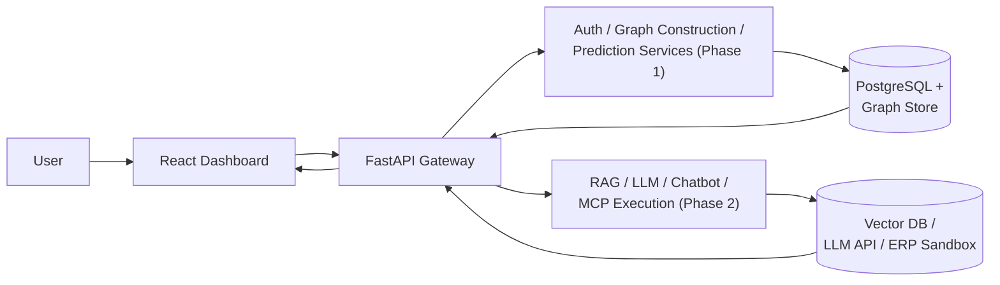
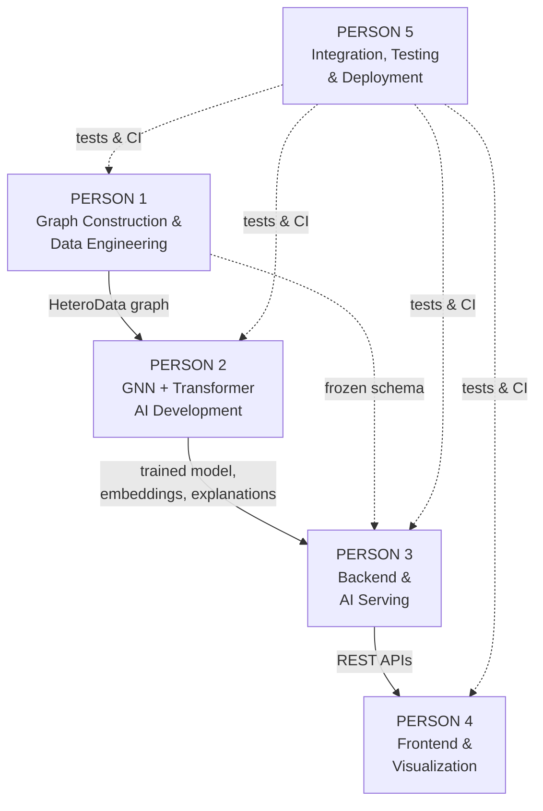
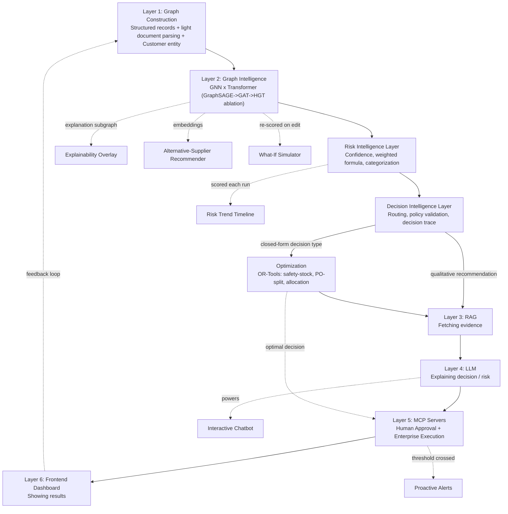
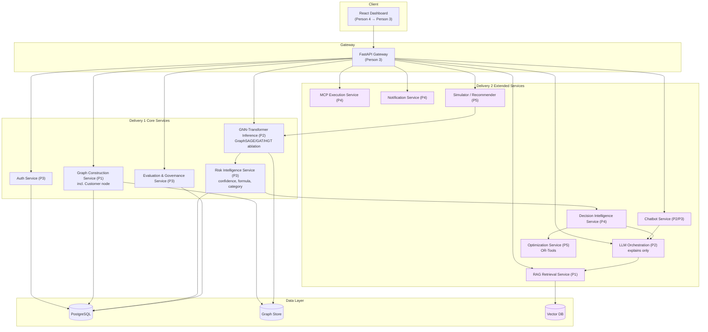
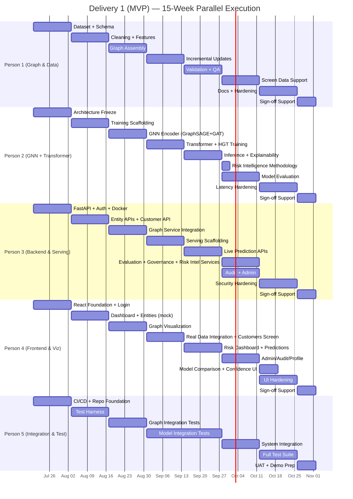
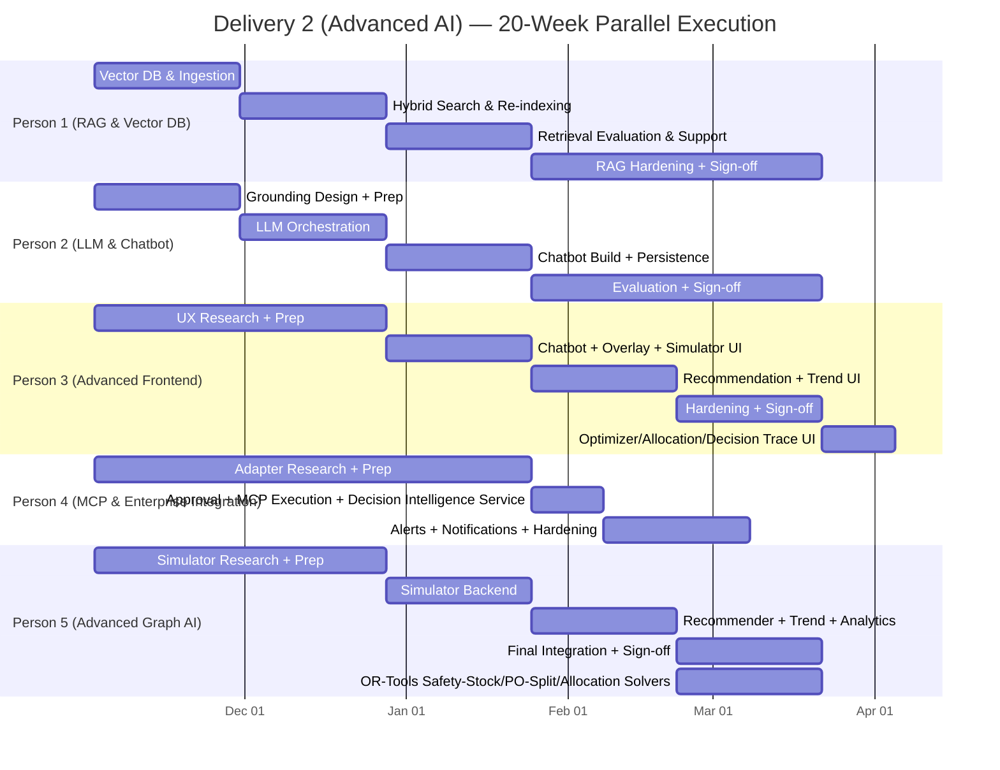
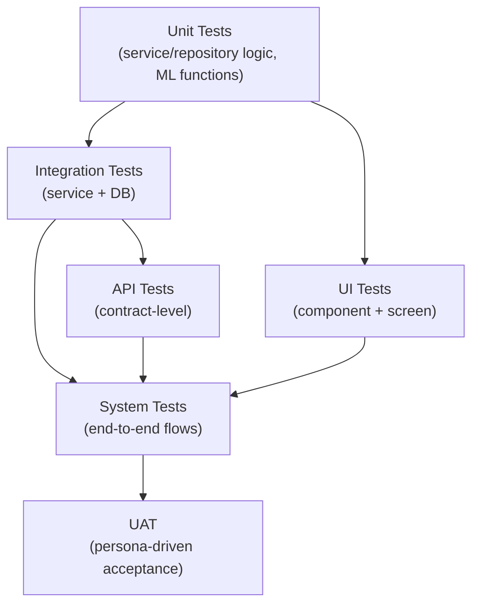

# BE Computer Science / AI & ML Final Year Project — Team Work Plan

## Graph Neural Network and Generative AI-Based Supply Chain Risk Prediction System

*Six-Layer Architecture with Retrieval-Augmented Reasoning, Autonomous Execution, an Interactive Chatbot, and Extended Decision-Support Features*

|                                      |                                                                                                                                |
| ------------------------------------ | ------------------------------------------------------------------------------------------------------------------------------ |
| **Team Size**                  | 5 members                                                                                                                      |
| **Deliveries**                 | Delivery 1 — MVP (Core System); Delivery 2 — Advanced AI Features                                                            |
| **Delivery 1 Window**          | 8 sprints / 15 weeks (2026-07-20 → 2026-11-01)                                                                                |
| **Delivery 2 Window**          | 10 sprints / 20 weeks (2026-11-02 → 2027-03-21)                                                                               |
| **Development Model**          | Five coherent parallel ownership tracks per delivery, with a deliberate role rotation between deliveries                       |
| **Flagship Demo (Delivery 1)** | Risk Dashboard flags a supplier, shows delay probability, and reveals the explanation subgraph driving it                      |
| **Flagship Demo (Delivery 2)** | Chatbot explains*why* a supplier is flagged, recommends an alternative, and — once approved — executes and logs the action |

*Prepared as a dependency-aware execution plan with task gates, handoffs, technologies and branch problem statements, sourced from `docs/problem_statement.md` and `docs/14_Project_Roadmap.md`.*

---

## Contents

1. [Project Overview and Master Problem Statement](#1-project-overview-and-master-problem-statement)
2. [Team Ownership Model](#2-team-ownership-model)
3. [System Architecture and Request Flow](#3-system-architecture-and-request-flow)
4. [Delivery 1 (MVP) Team Plan](#4-delivery-1-mvp-team-plan)
5. [Delivery 2 (Advanced AI Features) Team Plan](#5-delivery-2-advanced-ai-features-team-plan)
6. [Cross-Team Handoffs](#6-cross-team-handoffs)
7. [Integration Timeline](#7-integration-timeline)
8. [Testing Strategy](#8-testing-strategy)
9. [Final Deliverables](#9-final-deliverables)
10. [Definition of Done](#10-definition-of-done)

---

## 1. Project Overview and Master Problem Statement

Supply chains are dense networks of suppliers, components, products, factories, warehouses, shipments, and customer orders, where a disruption at one node cascades unpredictably across many others. Row-by-row systems that treat these entities as disconnected records cannot see that cascade coming, and even a system that produces a risk score typically stops there — a static number a user cannot question, simulate, or act on without leaving the tool. This project builds a closed-loop system that represents the supply chain as a heterogeneous graph, predicts disruption risk with a GNN-Transformer hybrid, grounds every explanation in retrieved evidence, and — with human approval — executes the recommended action directly inside connected business systems.

### Master Problem Statement

> Design and implement a five-person, two-delivery engineering programme that represents a live enterprise supply chain as a heterogeneous graph, predicts disruption risk with a GNN-Transformer hybrid, grounds every explanation in retrieved evidence and plain language, lets a human interrogate and simulate that risk, and — with explicit approval — executes the resulting recommendation inside connected business systems, closing the loop from data to accountable action.

### Flagship Demonstration Scenarios

**Delivery 1 (MVP):** Priya (Supply Chain Analyst) opens the Risk Dashboard and sees *Acme Components Ltd.* flagged at a 78% delay probability. She opens its explanation subgraph and sees exactly which components, products, and orders are driving that score — without cross-referencing any other system.

**Delivery 2 (Advanced AI):** Priya asks the chatbot *"Why is Acme Components flagged as high risk, and what should we do?"* The chatbot answers in plain language, citing a retrieved incident report, and surfaces a recommended alternative supplier at 94% similarity with a lower risk profile. Rahul (Procurement Manager) approves the recommendation in chat; the system raises a purchase order against the sandbox ERP via MCP and logs the outcome — end to end, with no manual handoff between systems.

**End-to-End Request Flow**

---

## 2. Team Ownership Model

The project is split by architectural responsibility across two deliveries, not by an even count of tickets. In Delivery 1, each member owns one coherent layer of the six-layer architecture (Document 2, Section 3.3). In Delivery 2, ownership **rotates**: Person 1 and Person 2 deepen their original specialty (graph/data → RAG/vector data; GNN/Transformer → LLM/chatbot, since both are direct extensions of what they already built), while Person 3 and Person 4 **swap domains** — the Delivery 1 backend owner becomes the Delivery 2 advanced-frontend owner and vice versa, each bringing first-hand knowledge of the contract the other side of the swap depends on. Person 5 moves from cross-cutting integration/testing into advanced graph AI, leveraging the whole-system familiarity built while integration-testing every other track in Delivery 1.

| Member   | Delivery 1 Role                       | Delivery 2 Role              | Estimated Load | Core Question                                                                                                         |
| -------- | ------------------------------------- | ---------------------------- | -------------- | --------------------------------------------------------------------------------------------------------------------- |
| Person 1 | Graph Construction & Data Engineering (incl. Customer entity) | RAG & Vector Database        | ≈20%          | How does the system turn raw records — now including customers — into a trustworthy structure — first a graph, then a retrievable evidence base? |
| Person 2 | GNN + Transformer AI Development (incl. GraphSAGE→GAT→HGT ablation, Risk Intelligence methodology, model governance) | LLM & Chatbot                | ≈20%          | How does the system reason over that structure — first to score risk *and know how confident it is*, then to explain it in language?                |
| Person 3 | Backend & AI Serving (incl. Customer, Evaluation & Risk Intelligence services) | Advanced Frontend Features (incl. Optimizer/Allocation/Decision Trace UI) | ≈20%          | How does the system get built, and — having built it — how should it be surfaced to a user, including the system's own decisions?                         |
| Person 4 | Frontend & Visualization              | MCP & Enterprise Integration (incl. Decision Intelligence Service) | ≈20%          | How does a user see the system, and — having seen it from the outside — how should it safely decide and act on the world?      |
| Person 5 | Integration, Testing & Deployment     | Advanced Graph AI (incl. OR-Tools Optimization Engine) | ≈20%          | Does the whole system actually work together, and — having proven that — how far can the core model *and its decision-support features* be pushed?      |

Each person's added scope from the approved architecture enhancement (research ablation, Risk Intelligence, model governance, customer entity, Decision Intelligence, OR-Tools optimization) is distributed to preserve this even split — see Sections 4 and 5 for exactly which new tasks each person owns.

**Team Ownership and System Interaction (Delivery 1)**

> **Boundary rule (Delivery 1):** Person 3 owns FastAPI as the hosting and model-serving platform; Person 2 owns the model itself. Person 1 owns everything upstream of the graph; Person 4 owns everything the user sees. End-to-end integration and testing are Person 5's responsibility but never Person 5's alone — every task below carries an explicit completion gate the owning person must clear before handoff.

> **Boundary rule (Delivery 2):** Ownership rotates, but Delivery 1's contracts do not change underneath the rotation — Document 8's additive, modular-monolith design means each Phase 2 module (`rag`, `llm`, `chatbot`, `simulation`, `recommendation`, `approval`, `mcp_execution`, `alerts`, `notifications`) is added alongside the Phase 1 modules, never restructuring them.

---

## 3. System Architecture and Request Flow

### 3.1 Six-Layer Architecture, Two Intelligence Stages

Per `docs/problem_statement.md` §4 (as revised): two intelligence stages — **Risk Intelligence** and **Decision Intelligence** — now sit explicitly between Layer 2 and Layer 3/5. They are genuine architectural stages, not UI formatting, and each has a named owner below.

### 3.2 Layer → Component → Owner Mapping

| Layer                 | Component (Document 2 §4)                  | Delivery 1 Owner                               | Delivery 2 Owner                                             |
| --------------------- | ------------------------------------------- | ---------------------------------------------- | ------------------------------------------------------------ |
| 1. Graph Construction | Graph Construction Service (incl. Customer node) | Person 1                                       | Person 1 (extends into evidence ingestion)                   |
| 2. GNN × Transformer (Graph Intelligence) | GNN-Transformer Inference Service (GraphSAGE→GAT→HGT ablation) | Person 2                                       | Person 5 (reuses model unmodified for simulator/recommender) |
| Risk Intelligence Layer | Risk Intelligence Service (confidence, weighted formula, categorization); Evaluation Service (`model_evaluation_runs`, `model_registry`) | Person 2 (methodology) / Person 3 (service & API) | — (stable, carried forward) |
| Decision Intelligence Layer | Decision Intelligence Service (routing, policy validation, decision trace) | — (schema foundation only, Person 3) | Person 4 (backend) / Person 3 (UI) |
| 3. RAG                | RAG Retrieval Service, Vector DB            | —                                             | Person 1                                                     |
| 4. LLM                | LLM Orchestration Service (explains risk *and* Decision Intelligence/Optimizer output; never optimizes numerically) | —                                             | Person 2                                                     |
| 4b. Chatbot           | Chatbot Service                             | —                                             | Person 2 (logic) / Person 3 (UI)                             |
| Optimization           | Optimization Service (OR-Tools: safety-stock, PO-split, customer allocation) | —                                             | Person 5                                                      |
| 5. MCP Servers        | MCP Execution Service, Notification Service | —                                             | Person 4                                                     |
| 6. Frontend Dashboard | React Dashboard, API Gateway                | Person 3 (API) / Person 4 (UI)                 | Person 3 (advanced UI, incl. Optimizer/Allocation/Decision Trace) / Person 4 (approval surfaces) |
| Cross-cutting         | Auth, Audit, CI/CD, Testing                 | Person 3 (auth/audit) / Person 5 (CI/CD/tests) | Person 4 (approval audit) / Person 5 (final integration)     |

### 3.3 High-Level Component Diagram

---

## 4. Delivery 1 (MVP) Team Plan

### 4.1 Responsibility Table

| Person   | Role                                  | Primary Ownership                                                                                       | Core Question                          |
| -------- | ------------------------------------- | ------------------------------------------------------------------------------------------------------- | -------------------------------------- |
| Person 1 | Graph Construction & Data Engineering | Dataset sourcing, cleaning, feature engineering, graph schema, HeteroData assembly, incremental updates | Is the graph correct and current?      |
| Person 2 | GNN + Transformer AI Development      | GNN encoder, Transformer prediction head, training, evaluation, inference, explainability               | Is the model accurate and explainable? |
| Person 3 | Backend & AI Serving                  | FastAPI, PostgreSQL, auth, REST APIs, Docker, model serving                                             | Is the platform correct and secure?    |
| Person 4 | Frontend & Visualization              | React dashboard, graph visualization, entity screens, risk dashboard                                    | Can a user see and trust the result?   |
| Person 5 | Integration, Testing & Deployment     | CI/CD, end-to-end integration, test suite, performance, UAT, deployment                                 | Does it all work together, provably?   |

---

### 4.2 Person 1 Work Plan: Graph Construction & Data Engineering

#### Branch Problem Statement

> Turn structured supplier, order, shipment, and inventory records — plus a small share of unstructured invoices/POs — into a clean, feature-engineered, continuously-updated heterogeneous graph that Person 2's model can train and infer against without ambiguity.

#### Technology Stack

| Area                   | Technology                                 | Purpose                                                        |
| ---------------------- | ------------------------------------------ | -------------------------------------------------------------- |
| Data processing        | Pandas, Scikit-learn                       | Cleaning, normalization, feature engineering (Document 10 §5) |
| Graph representation   | PyTorch Geometric`HeteroData`, NetworkX  | Tensor graph for training/inference (Document 6)               |
| Graph store (optional) | Neo4j                                      | Developer inspection, Cypher cross-checks (Document 6 §8)     |
| Relational source      | PostgreSQL                                 | System of record (Document 5)                                  |
| Document parsing       | LLM API (single extraction call)           | Lightweight invoice/PO field extraction (FR-GC-05)             |
| Testing                | pytest                                     | Feature-encoding and data-quality unit tests                   |
| Version Control        | Git, dedicated`feature/graph-*` branches | Controlled delivery                                            |

#### Ordered Task Timeline

**P1.1 Dataset Sourcing & Schema Collaboration — Deadline: End of S1 (2026-08-02)**

- Source/compile realistic supplier, order, shipment, and inventory data covering on-time, delayed, shortage, and cancelled scenarios (Document 1 §12 assumption).
- Collaborate with Person 3 to freeze the Phase 1 PostgreSQL schema: `suppliers`, `components`, `products`, `product_components`, `factories`, `warehouses`, `inventory`, `customers`, `orders` (incl. `customer_id`), `order_items`, `shipments`, `documents` (Document 5 §6.1–6.12, §6.24).
- Define the node/edge type inventory for the heterogeneous graph, including the `Customer` node type and `PLACED_BY` edge (Document 6 §5–6).

Completion gate: Person 2 and Person 3 approve the schema and node/edge type list.
Dependency/handoff: No dependency. Schema is a hard handoff to Person 2 (features) and Person 3 (repositories).

**P1.2 Data Cleaning & Feature Engineering — Deadline: End of S2 (2026-08-16)**

- Implement cleaning, normalization, deduplication, and type coercion (FR-GC-04).
- Implement feature derivation per Document 10 §5 (`lead_time_days`, `reliability_history`, `capacity_score`, `days_to_eta`/`days_to_due`, one-hot categoricals), plus `Customer.priority_tier` one-hot encoding for the new node type.
- Implement the lightweight document-parsing step for invoice/PO PDFs — a single extraction call, not a standing agent (FR-GC-05).

Completion gate: A cleaned, feature-engineered dataset with at least 10 predefined business scenarios (on-time, shortage, carrier delay, warehouse delay) is queryable.
Dependency/handoff: Requires P1.1. Feeds Person 2's tensor encoding directly.

**P1.3 Heterogeneous Graph Assembly — Deadline: End of S3 (2026-08-30)**

- Assemble typed nodes (Supplier, Component, Product, Factory, Warehouse, Shipment, Order, Customer) and typed edges (SUPPLIES, USED_IN, STOCKED_AT, MANUFACTURED_AT, SHIPS_FROM, SHIPS_TO, FULFILLS, ORDERED, PLACED_BY) per Document 6 §5–6.
- Build the PyTorch Geometric `HeteroData` object (FR-GC-06) with the tensor encodings in Document 6 §7.
- Stand up the optional Neo4j representation, kept structurally identical to the tensor graph.

Completion gate: Person 2 can load a `HeteroData` snapshot and run a forward pass without shape errors.
Dependency/handoff: Requires P1.2. Hard handoff to Person 2 (Document 14 §7: SCHEMA → GC → GNN).

**P1.4 Incremental Graph Update Pipeline — Deadline: End of S4 (2026-09-13)**

- Implement incremental update (FR-GC-07): only affected node/edge rows recomputed on new/changed records.
- Implement the full-rebuild path for schema changes or drift correction (Document 6 §11).
- Idempotent Neo4j `MERGE` updates.

Completion gate: A new shipment/order record updates the graph without a full rebuild, verified by a before/after node-count check.
Dependency/handoff: Requires P1.3. Hands the update job's interface to Person 3 for scheduling (`graph_rebuild_job`, Document 8 §11).

**P1.5 Graph Validation & Data-Quality Warnings — Deadline: End of S5 (2026-09-27)**

- Validate graph structural integrity (orphan nodes, dangling edges, degenerate feature vectors).
- Surface data-quality warnings for missing/malformed fields rather than silently corrupting the graph (NFR-17).
- Support Person 2 debugging node/edge feature encoding issues surfaced during training.
- Author ≥3 shortage scenarios with multiple open orders competing for the same constrained product/warehouse stock (feeding Delivery 2's customer allocation optimizer, FR-CUST-02), and validate the `Customer`/`PLACED_BY` graph slice (no orphan customers, every order resolves to exactly one customer).

Completion gate: A deliberately malformed input record produces a visible warning, not a crash or silent bad graph state; the shortage scenarios are queryable and each has ≥2 competing orders.
Dependency/handoff: Requires P1.4. Runs concurrently with Person 2's S4–S5 training work.

**P1.6 Entity Screen Data Support — Deadline: End of S6 (2026-10-11)**

- Support Person 3 and Person 4 with query patterns for the six entity screens (Document 3 §6.5–6.10).
- Freeze the demo dataset (v1) with a fixed, reproducible seed so results are stable across the team's testing.

Completion gate: All six entity screens render against the frozen dataset without missing-reference errors.
Dependency/handoff: Requires P1.5. Supports Person 4's S6 dashboard build.

**P1.7 Data Pipeline Documentation & Hardening — Deadline: End of S7 (2026-10-25)**

- Document the graph construction pipeline end-to-end (ingestion → cleaning → parsing → assembly → update).
- Add unit tests for feature-encoding functions and the data-quality warning path (Document 13 §6).
- Profile graph rebuild time; confirm it does not threaten NFR-01/NFR-02.

Completion gate: Full Document 13 Phase 1 data/graph-construction test cases pass.
Dependency/handoff: Requires P1.6. Feeds Person 5's Phase 1 hardening sprint.

**P1.8 Phase 1 Sign-off Support — Deadline: End of S8 (2026-11-01)**

- Support UAT scenarios touching data quality and dataset realism (Arjun persona).
- Final dataset/documentation freeze for Phase 1.

Completion gate: Phase 1 dataset and graph construction pipeline pass UAT without data-related defects.
Dependency/handoff: Requires P1.7. Closes out Delivery 1 for Person 1.

---

### 4.3 Person 2 Work Plan: GNN + Transformer AI Development

#### Branch Problem Statement

> Build the two-stage GNN-Transformer hybrid that turns Person 1's heterogeneous graph into delay, shortage, and impact predictions that are accurate (AUC-ROC ≥ 0.80), fast (p95 ≤ 2s), and explainable — and expose the embeddings Delivery 2 will reuse without retraining anything.

#### Technology Stack

| Area              | Technology                                                  | Purpose                                     |
| ----------------- | ----------------------------------------------------------- | ------------------------------------------- |
| ML framework      | PyTorch, PyTorch Geometric                                  | Model implementation                        |
| GNN architectures | GraphSAGE / GAT baseline → Heterogeneous Graph Transformer | Encoder (Document 10 §8.1)                 |
| Prediction head   | Transformer                                                 | Delay/shortage/impact scoring               |
| Explainability    | GNNExplainer                                                | Explanation subgraphs (FR-GNN-05)           |
| Evaluation        | Scikit-learn (AUC-ROC, calibration)                         | Held-out test evaluation (Document 10 §10) |
| Serving           | `ml/serving/` entrypoint (Document 8 §5)                 | Stateless inference                         |
| Version Control   | Git, dedicated`feature/gnn-*` branches                    | Controlled delivery                         |

#### Ordered Task Timeline

**P2.1 AI Architecture & Shared Contracts — Deadline: End of S1 (2026-08-02)**

- Freeze the model design: heterogeneous GNN encoder + Transformer prediction head, developed as an explicit three-stage research ablation — GraphSAGE baseline → GAT intermediate → Heterogeneous Graph Transformer final, each with a documented rationale, not merely a linear upgrade path (Document 10 §8.1, §8.4).
- Define prediction targets, loss functions, and the AUC-ROC ≥ 0.80 evaluation target (Document 1 §11).
- Define the `RiskScoreResponseDTO` / `ExplanationSubgraphResponseDTO` contract with Person 3 (Document 8 §8), including the `confidence`, `risk_category`, `scoring_method`, and `architecture` fields the Risk Intelligence Layer will populate (P2.9).

Completion gate: Person 1 and Person 3 approve the model I/O contract.
Dependency/handoff: No dependency. Critical cross-team contract, frozen alongside P1.1/P3.1.

**P2.2 Training Pipeline Scaffolding — Deadline: End of S2 (2026-08-16)**

- Build the offline batch training scaffold (`ml/gnn/`, Document 8 §5) against Person 1's data as it lands.
- Implement the time-based train/validation/test split (Document 10 §8.2) to avoid label leakage.
- Implement class-weighted/focal loss handling for the minority-class disruption labels.

Completion gate: A training run executes end-to-end on a fixture graph without crashing.
Dependency/handoff: Requires P1.2 and P2.1.

**P2.3 GNN Encoder Implementation — Deadline: End of S3 (2026-08-30)**

- Implement and train the GraphSAGE baseline (Stage 1 of the ablation) over Person 1's `HeteroData` graph, logged under `model_version='graphsage-v1'`, then the GAT intermediate architecture (Stage 2), logged under `model_version='gat-v1'` — each evaluated on the same held-out split so the eventual HGT choice (P2.4) is a documented comparison, not an assumption.
- Validate message passing across all eight node types (incl. `Customer`) and nine Phase 1 edge types (incl. `PLACED_BY`).

Completion gate: Encoder produces contextualized node embeddings of the expected dimensionality for every node type.
Dependency/handoff: Requires P1.3.

**P2.4 Transformer Head & Full Training — Deadline: End of S4 (2026-09-13)**

- Add the Transformer prediction head attending over a node's embedding and heterogeneous neighborhood, and train the final Heterogeneous Graph Transformer (Stage 3 of the ablation) under `model_version='hgt-v1'`.
- Run full training with Adam/AdamW + LR scheduling, dropout, early stopping on validation AUC.
- Hyperparameter tuning against the AUC-ROC ≥ 0.80 target; persist per-architecture metrics (Precision/Recall/F1/ROC-AUC/inference-time) plus governance metadata (git commit, hyperparameters, dataset reference) for all three ablation stages, handed to Person 3's evaluation service (P3.10) for persistence to `model_evaluation_runs`/`model_registry`.

Completion gate: Held-out test AUC-ROC ≥ 0.80 for delay/shortage classification (Document 1 §11) — the project's core hypothesis (BG-1) is proven here — **and** the GraphSAGE/GAT/HGT comparison shows HGT is the justified choice, not merely the last one trained.
Dependency/handoff: Requires P2.3.

**P2.5 Inference Pipeline & Explainability — Deadline: End of S5 (2026-09-27)**

- Build the stateless inference entrypoint (`ml/serving/`) — no write path in the hot request (FR-GNN-07).
- Integrate GNNExplainer for per-prediction explanation subgraphs with contribution weights (FR-GNN-05).
- Expose node embeddings alongside scores for Delivery 2 reuse (FR-GNN-06).

Completion gate: Inference returns delay probability, shortage risk, impact score, affected orders, explanation subgraph, and embeddings for a known fixture.
Dependency/handoff: Requires P2.4. Hard handoff to Person 3 (serving) and Person 4 (basic highlight).

**P2.6 Model Evaluation — Deadline: End of S6 (2026-10-11)**

- Full evaluation report: AUC-ROC, precision/recall, calibration (Document 10 §10), covering all three ablation stages side by side.
- Qualitative explanation-fidelity review against domain-plausible causes.

Completion gate: Explanation subgraph available for 100% of high-risk predictions (Document 1 §11); the three-architecture comparison report is complete and handed to Person 3 (P3.10) for the Model Comparison API.
Dependency/handoff: Requires P2.5.

**P2.7 Latency & Retraining Hardening — Deadline: End of S7 (2026-10-25)**

- Tune inference latency to meet NFR-01 (p95 ≤ 2s) under prototype-scale load.
- Document the manual/scheduled retraining trigger (Document 10 §8.3).
- Support Person 5's performance test suite with a load-test-friendly entrypoint.

Completion gate: p95 inference latency ≤ 2s in Person 5's load test.
Dependency/handoff: Requires P2.6.

**P2.8 Phase 1 Sign-off Support — Deadline: End of S8 (2026-11-01)**

- Support Priya-persona UAT scenarios (risk score, explanation) end-to-end.
- Freeze the Phase 1 model artifact and version tag (`model_version`, Document 5 §6.13).

Completion gate: Frozen model artifact passes UAT with Person 3/4's integrated dashboard.
Dependency/handoff: Requires P2.7.

**P2.9 Risk Intelligence Methodology: Confidence & Weighted Formula — Deadline: End of S5 (2026-09-27, parallel with P2.5)**

- Design the confidence-estimation mechanism (softmax margin or MC-dropout variance across a small number of stochastic forward passes) that turns a raw model output into the `confidence` value exposed on every prediction (FR-RISKINT-01).
- Define and tune the transparent weighted risk formula (0.30 Supplier Risk + 0.25 Shipment Delay + 0.20 Inventory Risk + 0.15 Demand Spike + 0.10 Financial Risk) against validation data as a documented, inspectable alternative to the GNN-native score — never a replacement for the GNN itself (FR-RISK-01).
- Hand off the confidence signal and the tuned formula's exact computation to Person 3 (P3.10), who implements them as the `risk_intelligence_service`.

Completion gate: Person 3 confirms the confidence signal and formula spec are directly implementable without further clarification.
Dependency/handoff: Requires P2.5. Hands off to P3.10.

---

### 4.4 Person 3 Work Plan: Backend & AI Serving

#### Branch Problem Statement

> Build the platform that hosts authentication, the entity data model, and the AI inference boundary as a single stable, secure, well-layered FastAPI service — the foundation every other person's work is called through.

#### Technology Stack

| Area             | Technology                                         | Purpose                               |
| ---------------- | -------------------------------------------------- | ------------------------------------- |
| AI/App host      | Python, FastAPI, Pydantic, Uvicorn                 | REST APIs, model serving boundary     |
| Database         | PostgreSQL, SQLAlchemy (async), Alembic            | Schema, migrations (Document 5)       |
| Security         | JWT (`python-jose`), `passlib` (argon2/bcrypt) | Auth (Document 12 §5)                |
| Containerization | Docker, Docker Compose                             | Local dev + staging (Document 11 §7) |
| Testing          | pytest, pytest-asyncio, httpx                      | API/unit tests                        |
| Version Control  | Git, dedicated`feature/backend-*` branches       | Controlled delivery                   |

#### Ordered Task Timeline

**P3.1 FastAPI, PostgreSQL, Docker Foundation — Deadline: End of S1 (2026-08-02)**

- Stand up the FastAPI app factory and modular-monolith folder structure (Document 8 §5), with Person 5 on the Docker Compose skeleton (Document 11 §7).
- Implement the `users` table and Auth module (Document 5 §6.1; FR-AUTH-01/02/04/05/06/07): login, JWT issuance/refresh, account lockout, logout, admin user CRUD.
- Freeze the Phase 1 schema with Person 1 (Document 5 §7 migration set), including `customers`, `model_evaluation_runs`, and `model_registry`, and the `risk_scores.scoring_method`/`confidence`/`risk_category` columns.

Completion gate: `POST /api/v1/auth/login` issues a valid JWT against a seeded user; the Phase 1 Alembic migration runs clean.
Dependency/handoff: No dependency. API contract handed to Person 4 immediately.

**P3.2 Entity CRUD/Read APIs — Deadline: End of S2 (2026-08-16)**

- Implement the shared entity endpoint pattern (Document 9 §8.1) for Suppliers, Warehouses, Orders, Shipments, Products, Inventory.
- Implement `POST /api/v1/documents` for invoice/PO upload (multipart, FR-GC-05), wired to Person 1's parsing step.

Completion gate: All six entity families return the standard pagination envelope; document upload returns `202 Accepted` with `parse_status: pending`.
Dependency/handoff: Requires P3.1 and P1.1 (schema). Hands stable read APIs to Person 4.

**P3.3 Graph Construction Service Integration — Deadline: End of S3 (2026-08-30)**

- Wrap Person 1's graph construction pipeline as the `graph_construction` module (Document 8 §5–6).
- Wire the `graph_rebuild_job` scheduled task (APScheduler, Document 8 §11).

Completion gate: A new PostgreSQL record triggers an incremental graph update, observable via a job-status log line.
Dependency/handoff: Requires P1.3/P1.4 and P3.2.

**P3.4 Model-Serving Contract Scaffolding — Deadline: End of S4 (2026-09-13)**

- Build the `prediction` module's controller/service/repository/DTO skeleton (Document 8 §5–6, §8) against Person 2's frozen contract (P2.1), with a temporary mock response.
- Implement `risk_scores` and `explanation_subgraphs` repositories (Document 5 §6.13–6.14).

Completion gate: `GET /api/v1/predictions` returns a valid mock payload matching the final contract shape.
Dependency/handoff: Requires P2.1 and P3.2.

**P3.5 Live Prediction & Explanation Endpoints — Deadline: End of S5 (2026-09-27)**

- Replace the mock with a live call into Person 2's inference service; implement `GET /api/v1/predictions/{entity_type}/{entity_id}/explanation` (Document 9 §9.1–9.2).
- Persist every inference run to `risk_scores`/`explanation_subgraphs` (append-only, Document 5 §6.13).

Completion gate: A real supplier record returns a real delay probability and explanation subgraph end-to-end.
Dependency/handoff: Requires P2.5. Hard handoff to Person 4 for the Risk Dashboard and explanation panel.

**P3.6 Audit & Admin Hardening — Deadline: End of S6 (2026-10-11)**

- Implement `GET /api/v1/audit` (auth events, Document 9 §15) and the `audit_log` write path for every login/logout/lock/deactivate event (FR-AUTH-07).
- Complete Admin user-management endpoints (Document 9 §7): create, update role, deactivate.

Completion gate: Every seeded login attempt (success and failure) produces exactly one `audit_log` row.
Dependency/handoff: Requires P3.1. Feeds Person 4's Admin/Audit screens.

**P3.7 Security & Rate-Limiting Hardening — Deadline: End of S7 (2026-10-25)**

- Apply Phase 1 security controls (Document 12 §5–8, §12): `HttpOnly`/`Secure`/`SameSite` refresh cookie, per-user rate limiting (100 req/min, tighter on `/auth/login`), secrets sourced from environment only.
- Finalize Docker Compose for the staging/demo environment (Document 11 §13).

Completion gate: Document 13 §12 Phase 1 security test cases (expired JWT rejection, deactivated-user rejection, password hash never leaked, `429` on login flood) all pass.
Dependency/handoff: Requires P3.6. Feeds Person 5's security test pass.

**P3.8 Phase 1 Sign-off Support — Deadline: End of S8 (2026-11-01)**

- Support UAT and fix defects surfaced by Person 5's system tests.
- Tag and freeze the Phase 1 backend release.

Completion gate: Full Document 13 Phase 1 API test suite green.
Dependency/handoff: Requires P3.7.

**P3.9 Customer Service & API — Deadline: End of S2 (2026-08-16, alongside P3.2)**

- Implement the `customers` module (CRUD) and `GET/POST/PATCH /api/v1/customers*` endpoints (Document 9 §8.3; FR-CUST-01), plus the `orders.customer_id` backfill migration from legacy `customer_name` values (Document 5 §7.1).

Completion gate: `POST /api/v1/customers` creates a customer; every seeded order resolves to exactly one `customer_id` post-backfill.
Dependency/handoff: Requires P3.1, P1.1. Feeds Person 4's Customers screen (P4.9).

**P3.10 Evaluation, Model Governance & Risk Intelligence Services — Deadline: End of S5–S6 (2026-09-14 – 2026-10-11, alongside P3.5/P3.6)**

- Implement the `evaluation` module: persist `model_evaluation_runs` and `model_registry` rows from Person 2's training pipeline output (P2.4/P2.6), and expose `GET /api/v1/models/comparison`, `/evaluation-runs`, `/registry`, `/active` (Document 9 §9.4–9.5; FR-EVAL-01/02, FR-GOV-01/02).
- Implement the `risk_intelligence` module consuming Person 2's confidence signal and weighted-formula spec (P2.9): compute `impact_score` via `gnn_native`/`weighted_formula`, assign `risk_category` against configurable thresholds, and expose all of it on `GET /api/v1/predictions` (FR-RISKINT-01–03, FR-RISK-01/02).

Completion gate: `GET /api/v1/models/comparison` returns all three ablation architectures' metrics side by side; every prediction response carries `confidence`, `risk_category`, and `scoring_method`.
Dependency/handoff: Requires P2.6, P2.9, P3.5. Feeds Person 4's Model Comparison/Confidence Panel UI (P4.10).

---

### 4.5 Person 4 Work Plan: Frontend & Visualization

#### Branch Problem Statement

> Build the React dashboard that turns Person 3's APIs and Person 2's predictions into a trustworthy, responsive decision-support surface a non-technical operations user (Priya, Meera, Arjun) can use without ML or graph expertise.

#### Technology Stack

| Area                | Technology                                    | Purpose                               |
| ------------------- | --------------------------------------------- | ------------------------------------- |
| Frontend            | React, TypeScript                             | Dashboard shell, screens              |
| Graph visualization | D3.js                                         | Supply Chain Graph (Document 3 §6.3) |
| Communication       | REST, JSON, fetch/axios                       | Frontend ↔ FastAPI                   |
| Testing             | vitest / jest, react-testing-library          | Component/screen tests                |
| Version Control     | Git, dedicated`feature/frontend-*` branches | Controlled delivery                   |

#### Ordered Task Timeline

**P4.1 React Foundation & Login — Deadline: End of S1 (2026-08-02)**

- Scaffold the React + TypeScript project, routing, and authenticated shell/sidebar navigation (Document 3 §5).
- Build the Login screen against Person 3's `/auth/login` contract (Document 3 §6.1).

Completion gate: A seeded user can log in and land on an (empty) Dashboard shell.
Dependency/handoff: Requires P3.1's auth contract.

**P4.2 Dashboard & Entity Screens (Mock Data) — Deadline: End of S2 (2026-08-16)**

- Build the Dashboard summary tiles (Document 3 §6.2) and the six entity list/detail screens against mock data.
- Implement the shared loading/error/empty-state pattern (NFR-11, Document 3 §7) once, reused everywhere.

Completion gate: All six entity screens render full loading/error/empty states with mock data.
Dependency/handoff: Requires P4.1.

**P4.3 Supply Chain Graph Visualization — Deadline: End of S3 (2026-08-30)**

- Build the D3 force-directed graph canvas with node-type legend, risk-color legend, zoom/pan, and node detail panel (Document 3 §6.3), against mock graph data.

Completion gate: A 200+ node mock graph renders and pans/zooms smoothly.
Dependency/handoff: Requires P4.2.

**P4.4 Real Entity Data Integration — Deadline: End of S4 (2026-09-13)**

- Replace mock data with Person 3's live entity CRUD/read APIs across all six entity screens and the Dashboard.

Completion gate: Every entity screen reflects Person 1's seeded dataset exactly, including pagination and filters.
Dependency/handoff: Requires P3.2.

**P4.5 Risk Dashboard & Live Predictions — Deadline: End of S5 (2026-09-27)**

- Build the Risk Dashboard sortable/filterable table (Document 3 §6.4) against Person 3's live `/predictions` endpoint.
- Wire the Supply Chain Graph to risk-color nodes and render the basic explanation-subgraph highlight (FR-EXP-01 Phase 1 scope).

Completion gate: A flagged supplier shows a real delay probability and a highlighted explanation subgraph on the graph view.
Dependency/handoff: Requires P3.5.

**P4.6 Admin, Audit, Profile, Settings — Deadline: End of S6 (2026-10-11)**

- Complete the Admin, Audit, Profile, and Settings screens (Document 3 §6.15–6.18).
- Hide Phase 2 sidebar entries (Chatbot, Simulator, Recommendation, Alerts) behind a feature flag rather than deleting them (UX-01 mitigation).

Completion gate: All 12 Phase 1 screens are reachable and functional; Phase 2 screens are hidden, not broken links.
Dependency/handoff: Requires P3.6.

**P4.7 UI Hardening & Performance — Deadline: End of S7 (2026-10-25)**

- Verify every screen's loading/error/empty states (Document 13 §10).
- Confirm the 5,000-node graph render/interaction target (NFR-02, p95 ≤ 500ms).
- Responsive pass down to tablet width (US-DASH-07).

Completion gate: Document 13 §10 Phase 1 UI test cases pass; NFR-02 verified by Person 5's performance test.
Dependency/handoff: Requires P4.6. Feeds Person 5's UI/performance testing.

**P4.8 Phase 1 Sign-off Support — Deadline: End of S8 (2026-11-01)**

- Fix defects from UAT walkthroughs; polish the demo path (login → graph → prediction → dashboard).

Completion gate: Document 1 §11 "100% of Phase 1 functional requirements demonstrable" target met.
Dependency/handoff: Requires P4.7.

**P4.9 Customers Screen — Deadline: End of S4 (2026-09-13, alongside P4.4)**

- Build the Customers list/detail screen (Document 3 §6.20) against Person 3's `customers` API (P3.9): searchable list, priority-tier filter, detail view with contract terms and linked orders.

Completion gate: Customer list/detail renders against live data with correct priority-tier filtering.
Dependency/handoff: Requires P3.9.

**P4.10 Model Comparison, Confidence Panel & Risk Formula UI — Deadline: End of S6 (2026-10-11, alongside P4.6)**

- Build the Model Comparison screen (Document 3 §6.19): three-architecture comparison cards with each stage's rationale, evaluation-run history, and a Model Metadata Panel (dataset, timestamp, experiment ID, git commit, hyperparameters, status) against Person 3's evaluation/governance API (P3.10).
- Add the Confidence Panel (collapsed by default) and the formula-breakdown popover to the Risk Dashboard (Document 3 §6.4) against the same API.

Completion gate: Model Comparison renders all three architectures side by side from live data; every Risk Dashboard row exposes confidence on demand.
Dependency/handoff: Requires P3.10.

---

### 4.6 Person 5 Work Plan: Integration, Testing & Deployment

#### Branch Problem Statement

> Prove — continuously, not just at the end — that Person 1 through Person 4's independently-owned layers actually work together, and ship a reliable, demoable Phase 1 MVP through disciplined CI/CD.

#### Technology Stack

| Area             | Technology                                           | Purpose                                  |
| ---------------- | ---------------------------------------------------- | ---------------------------------------- |
| CI/CD            | GitHub Actions                                       | Lint, test, build gate (Document 11 §9) |
| Testing          | pytest, pytest-asyncio, httpx, vitest                | Full pyramid (Document 13 §5)           |
| Containerization | Docker, Docker Compose                               | Local + staging orchestration            |
| Version Control  | Git, trunk-based,`main`/`feature/*`/`hotfix/*` | Branch strategy (Document 11 §10–11)   |

#### Ordered Task Timeline

**P5.1 CI/CD & Repository Foundation — Deadline: End of S1 (2026-08-02)**

- Set up the GitHub Actions pipeline (lint → unit → integration → Docker build, Document 11 §9) and branch strategy.
- Stand up the shared Docker Compose stack (with Person 3) and a dedicated test database.

Completion gate: A trivial PR runs the full CI gate and merges to `main` cleanly.
Dependency/handoff: No dependency. Enables every other person's PRs from Day 1.

**P5.2 Test Harness & Contract Scaffolding — Deadline: End of S2 (2026-08-16)**

- Set up pytest/httpx (backend) and vitest/react-testing-library (frontend), per Document 13 §3.
- Scaffold API contract tests against Person 3's entity endpoints as they ship (Document 9 §8.1, addressing risk API-01).

Completion gate: A contract test exists for every shipped Phase 1 endpoint by end of sprint.
Dependency/handoff: Requires P3.2.

**P5.3 Graph Construction Integration Tests — Deadline: End of S3 (2026-08-30)**

- Integration test: a new shipment row updates the `HeteroData` snapshot incrementally (FR-GC-07).
- Integration test: document upload → parsing → `documents.extracted_fields` populated correctly (FR-GC-05).

Completion gate: Both tests pass against Person 1's pipeline in the CI-gated test database.
Dependency/handoff: Requires P1.3/P1.4.

**P5.4 Model & Inference Integration Tests — Deadline: End of S4–S5 (2026-08-31 – 2026-09-27)**

- Integration test: GNN Inference Service scores a known graph fixture within an expected range (FR-GNN-01–03).
- Unit test the GNNExplainer wrapper's contribution-weight tolerance (FR-GNN-05).
- Begin scripting the flagship end-to-end scenario (Section 8).

Completion gate: Model integration tests pass against Person 2's frozen S4 model and S5 inference/explainability service.
Dependency/handoff: Requires P2.4/P2.5.

**P5.5 End-to-End System Integration — Deadline: End of S6 (2026-10-11)**

- Wire React ↔ FastAPI ↔ PostgreSQL/graph store end-to-end for the full Phase 1 demo path.
- Automate UI state tests (loading/error/empty) across all Phase 1 screens (Document 13 §10).

Completion gate: The flagship Phase 1 demo scenario (Section 8) runs unattended in CI against a seeded environment.
Dependency/handoff: Requires P3.5 and P4.5.

**P5.6 Full Phase 1 Test Suite Execution — Deadline: End of S7 (2026-10-25)**

- Run the complete Document 13 Phase 1 suite: unit, integration, system, API, UI, performance (NFR-01/02), security (Document 12 Phase 1 controls), including the new confidence/`risk_category` coverage (P3.10), `model_evaluation_runs`/`model_registry` persistence and post-`active` immutability (NFR-19/24), and the `orders.customer_id` backfill migration integrity check (P3.9).
- Track and report defects to the responsible owner; no defect closes without a regression test.

Completion gate: Full Document 13 Phase 1 suite green.
Dependency/handoff: Requires all Persons' S7 hardening tasks.

**P5.7 UAT & Phase 1 Demo Prep — Deadline: End of S8 (2026-11-01)**

- Run persona-driven UAT for Priya, Meera, and Arjun (Document 13 §13).
- Prepare and rehearse the Phase 1 demo; deploy to the staging/demo environment (Document 11 §13).

Completion gate: **M6 — Phase 1 MVP Sign-off**: Document 13 Phase 1 suite green and Priya/Meera/Arjun UAT scenarios pass (Document 14 §5).
Dependency/handoff: Requires P5.6 and every person's final sign-off task.

---

### 4.7 Delivery 1 Dependencies

| Dependency                                                | Needed For                                          | Owner               | Sprint |
| --------------------------------------------------------- | --------------------------------------------------- | ------------------- | ------ |
| Frozen Phase 1 PostgreSQL schema (Document 5 §6.1–6.14) | Graph construction, backend repositories            | Person 1 + Person 3 | S1     |
| Seeded, feature-engineered dataset                        | Model training                                      | Person 1            | S1–S2 |
| Assembled`HeteroData` graph                             | GNN encoder training                                | Person 1            | S3     |
| Frozen model I/O contract (`RiskScoreResponseDTO`)      | Prediction module scaffolding                       | Person 2            | S1     |
| Trained GNN-Transformer model (AUC-ROC ≥ 0.80)           | Live inference integration                          | Person 2            | S4     |
| GNNExplainer + embeddings                                 | Explainability overlay, downstream Delivery 2 reuse | Person 2            | S5     |
| Live`/api/v1/predictions` + `/explanation` endpoints  | Risk Dashboard, graph highlight                     | Person 3            | S5     |
| CI/CD pipeline + test database                            | Every PR across all persons                         | Person 5            | S1     |
| Docker Compose stack                                      | Local dev + staging deploy                          | Person 3 + Person 5 | S1     |
| `customers` API + `orders.customer_id` backfill           | Customers screen                                     | Person 3 (P3.9)     | S2     |
| Confidence signal + weighted-formula spec                 | Risk Intelligence service                            | Person 2 (P2.9)     | S5     |
| Evaluation/governance + Risk Intelligence services         | Model Comparison, Confidence Panel UI                | Person 3 (P3.10)    | S5–S6 |

### 4.8 Delivery 1 Completion Gates

| Milestone                            | Target                           | Exit Criteria                                                                     | Primary Owner(s)      |
| ------------------------------------ | -------------------------------- | --------------------------------------------------------------------------------- | --------------------- |
| M1 — Foundations Ready              | End of S1 (2026-08-02)           | Dev environment, CI/CD, Phase 1 DB schema (incl. `customers`, `model_evaluation_runs`, `model_registry`), Auth working end-to-end | Person 3, Person 5    |
| M2 — Graph Live                     | End of S3 (2026-08-30)           | Graph Construction Service assembling a real`HeteroData` graph (incl. `Customer` node) from seeded data | Person 1              |
| M3 — Model Trained                  | End of S4 (2026-09-13)           | GraphSAGE→GAT→HGT ablation complete; final HGT meets AUC-ROC ≥ 0.80 on held-out data | Person 2              |
| M4 — Prediction API Live            | End of S5 (2026-09-27)           | Inference + explanation subgraph + confidence/risk_category (Risk Intelligence) served via REST | Person 2, Person 3    |
| M5 — Phase 1 Dashboard Complete     | End of S6 (2026-10-11)           | All Phase 1 screens functional against live APIs                                  | Person 4              |
| **M6 — Phase 1 MVP Sign-off** | **End of S8 (2026-11-01)** | Document 13 Phase 1 suite green; Priya/Meera/Arjun UAT pass                       | All (led by Person 5) |

### Non-Negotiable Milestones (Delivery 1)

- End of S1: Architecture, database schema, API contracts, and response schema are frozen.
- End of S4: Data pipeline, backend skeleton, and model training all independently functional.
- End of S6: Full dashboard functional against live prediction APIs.
- End of S8: Complete end-to-end flow works; Document 13 Phase 1 suite green; feature freeze for Delivery 2 begins.

---

## 5. Delivery 2 (Advanced AI Features) Team Plan

Delivery 2 begins only after M6 (Phase 1 MVP Sign-off) passes, enforcing Document 1 §2.4's Delivery Phase discipline. No Phase 1 module is restructured — every Delivery 2 module is added alongside it (Document 8 §2).

### 5.1 Responsibility Rotation Table

| Person   | Delivery 1 Role                       | Delivery 2 Role              | Rotation Rationale                                                                                                                                                                                                                                                            |
| -------- | ------------------------------------- | ---------------------------- | ----------------------------------------------------------------------------------------------------------------------------------------------------------------------------------------------------------------------------------------------------------------------------- |
| Person 1 | Graph Construction & Data Engineering | RAG & Vector Database        | Deepens specialty: the same lightweight document-parsing step (FR-GC-05) that fed the graph now feeds the evidence corpus (Document 7 §7) — no new ingestion pipeline.                                                                                                      |
| Person 2 | GNN + Transformer AI Development      | LLM & Chatbot                | Deepens specialty: the explanation subgraphs and embeddings Person 2 already produces (FR-GNN-05/06) become the exact inputs their own LLM/chatbot work consumes — no new modeling risk.                                                                                     |
| Person 3 | Backend & AI Serving                  | Advanced Frontend Features   | **Domain swap with Person 4.** Person 3 built every Phase 1 API contract, so they build the Phase 2 UI against contracts they already know intimately.                                                                                                                  |
| Person 4 | Frontend & Visualization              | MCP & Enterprise Integration | **Domain swap with Person 3.** Person 4 spent Delivery 1 seeing the system through a user's eyes, and now owns the surface where an AI-proposed action becomes a real-world one — bringing that same scrutiny to the approval/audit UX contract they hand to Person 3. |
| Person 5 | Integration, Testing & Deployment     | Advanced Graph AI            | The whole-system view built while integration-testing every Delivery 1 track is exactly what's needed to extend Person 2's trained model (unmodified) into the simulator and recommender.                                                                                     |

> **Boundary rule (rotation):** Person 3 and Person 4 explicitly hand each other their Delivery 1 domain knowledge at the Delivery 1 → Delivery 2 transition (Section 6.2) — this is a deliberate cross-training swap, not a coincidence, and is treated as a first-class handoff with its own gate.

---

### 5.2 Person 1 Work Plan: RAG & Vector Database

#### Branch Problem Statement

> Build the evidence layer that grounds every Delivery 2 explanation in real historical records — incident reports, contract clauses, supplier history — so Person 2's LLM never has to reason from memory alone.

#### Technology Stack

| Area            | Technology                                       | Purpose                             |
| --------------- | ------------------------------------------------ | ----------------------------------- |
| Vector database | pgvector (co-located with PostgreSQL)            | Evidence store (Document 7)         |
| Chunking        | Paragraph-aware recursive splitting              | ~300–500 tokens, ~50 token overlap |
| Embedding       | Embedding model via LLM API provider             | Dense vector representation         |
| Search          | PostgreSQL full-text (`tsvector`) + vector ANN | Hybrid search (Document 7 §9)      |
| Version Control | Git, dedicated`phase-2/rag-*` branches         | Controlled delivery                 |

#### Ordered Task Timeline

**D1.1 Evidence Schema & Chunking — Deadline: End of S9 (2026-11-15)**

- Implement the `evidence_chunks` schema (Document 7 §6) across three collections (`incidents`, `contracts`, `supplier_history`).
- Implement paragraph-aware recursive chunking, reusing the Phase 1 document-parsing step as the PDF source path.
- Author or collect at least 10 evidence documents (SLA policy, delay/customs/shortage SOPs, escalation matrix, notification policy).

Completion gate: At least 10 evidence documents are chunked, embedded, and stored with correct `collection`/metadata fields (FR-RAG-01).
Dependency/handoff: Requires Phase 1's `documents` table and parsing step. Hard handoff to Person 2 for grounded explanations.

**D1.2 Embedding Pipeline & Metadata Filtering — Deadline: End of S10 (2026-11-29)**

- Wire the embedding model into the ingestion path; populate `supplier_id`/`order_id`/`shipment_id`/`customer_id` metadata (Document 7 §8), the last enabling customer-scoped evidence for allocation rationale (FR-CUST-03).
- Implement metadata pre-filtering ahead of vector search (Document 7 §10).

Completion gate: A query filtered to a specific supplier only returns evidence attributable to that supplier.
Dependency/handoff: Requires D1.1.

**D1.3 Hybrid Search & Ranking — Deadline: End of S10 (2026-11-29)**

- Implement vector search + keyword search fused via Reciprocal Rank Fusion (Document 7 §9).
- Implement recency/exact-match re-ranking and top-k (k=5) selection with `source_document_id` for citation (FR-LLM-04).

Completion gate: Hybrid search with metadata filtering (FR-RAG-02/03) returns relevant top-k results for at least 10 test queries.
Dependency/handoff: Requires D1.2. Hard handoff to Person 2.

**D1.4 Re-indexing Without Downtime — Deadline: End of S11–S12 (2026-11-30 – 2026-12-27)**

- Implement the `evidence_reindex_job` (Document 8 §11) triggered on new-document ingestion, with additive index inserts (FR-RAG-04).

Completion gate: A newly ingested document is retrievable within the same session without a full index rebuild or downtime.
Dependency/handoff: Requires D1.3.

**D1.5 Retrieval Evaluation — Deadline: End of S12 (2026-12-27)**

- Evaluate retrieval relevance against a curated question set; tune chunking/ranking parameters.
- Document findings feeding Person 2's grounding requirement (≥90% of explanations cite at least one evidence source, Document 1 §11).

Completion gate: Retrieval relevance meets the ≥90% grounding target on the curated evaluation set.
Dependency/handoff: Requires D1.4. Feeds Person 2's D2.1/D2.4.

**D1.6 RAG Hardening & Sign-off Support — Deadline: End of S18 (2027-03-21)**

- Support Person 5's final AI pipeline integration and Person 2's chatbot with retrieval performance tuning.
- Final documentation of the vector database design and evidence corpus.

Completion gate: RAG retrieval meets FR-RAG-01–04 in the full Document 13 Delivery 2 suite.
Dependency/handoff: Requires D1.5. Supports Phase 2 sign-off (M11).

---

### 5.3 Person 2 Work Plan: LLM & Chatbot

#### Branch Problem Statement

> Turn Person 1's evidence and their own Delivery 1 model output into plain-language explanations, recommended actions, and a conversational front door — never generating a claim that isn't grounded, and never emitting an action that isn't schema-constrained.

#### Technology Stack

| Area            | Technology                                        | Purpose                                                    |
| --------------- | ------------------------------------------------- | ---------------------------------------------------------- |
| Orchestration   | LangGraph                                         | Prompt assembly, retrieval calls, business-rule validation |
| LLM             | LLM API (chat/completion)                         | Explanation and chatbot generation                         |
| Streaming       | WebSocket / SSE over HTTPS                        | Chat response streaming (Document 2 §7)                   |
| Persistence     | PostgreSQL (`chat_sessions`, `chat_messages`) | Conversation history (Document 5 §6.19–6.20)             |
| Version Control | Git, dedicated`phase-2/llm-*` branches          | Controlled delivery                                        |

#### Ordered Task Timeline

**D2.1 LLM Orchestration Foundation — Deadline: End of S11 (2026-12-13)**

- Build the `llm` module: prompt templates with instruction/data separation (Document 12 §9), combining risk score + explanation subgraph + retrieved evidence into a plain-language explanation (FR-LLM-01) — and, for entities the Decision Intelligence Layer (Person 4, D4.7) routes to the optimizer, explaining the already-computed optimal decision instead of generating one (FR-OPT-03: the LLM never optimizes numerically).
- Implement business-rule validation of LLM-proposed actions before they can become an `action_request` (FR-LLM-03).

Completion gate: Given a fixed risk score + evidence set, the LLM produces a plain-language explanation citing at least one evidence source (FR-LLM-04).
Dependency/handoff: Requires Person 1's D1.3 and Phase 1's prediction/explanation endpoints.

**D2.2 Recommended-Action Generation — Deadline: End of S11 (2026-12-13)**

- Generate a recommended action alongside every explanation (FR-LLM-02), constrained to a structured output schema (Document 12 §9), preventing prompt-injected free-form actions — the schema has no field capable of overriding an optimizer-provided numeric result, closing off any path for the LLM to smuggle in its own quantity.

Completion gate: Every high-risk prediction in the evaluation set produces both an explanation and a schema-valid recommended action.
Dependency/handoff: Requires D2.1. Hard handoff to Person 4's approval workflow.

**D2.3 Chatbot Intent Classification — Deadline: End of S13 (2027-01-10)**

- Implement intent classification (`score_lookup`, `explanation`, `general`, `action_request` — FR-CHAT-02) and the `chat_sessions`/`chat_messages` schema.
- Implement `POST /api/v1/chat/sessions` and message endpoints (Document 9 §10).

Completion gate: At least 18 of 20 test questions route to the correct intent path.
Dependency/handoff: Requires D2.2 and Phase 1's prediction endpoints.

**D2.4 Retrieve-Then-Generate Pipeline — Deadline: End of S13 (2027-01-10)**

- Implement the full chatbot flow (Document 4 §9): record + evidence + explanation → prompt template → LLM response, streamed with a non-streaming REST fallback.
- Implement in-chat action approval routing into the Approval Flow (FR-CHAT-04).

Completion gate: "Why is Supplier X flagged as high risk?" returns a relevant, cited answer within the NFR-03 5s (p95) budget; "what should we do" surfaces an approvable action card.
Dependency/handoff: Requires D2.3 and Person 1's D1.3. Hard handoff to Person 3 (chat UI) and Person 4 (approval routing).

**D2.5 Chat Session Persistence & Hardening — Deadline: End of S14 (2027-01-24)**

- Persist chat history per session for follow-up context (FR-CHAT-05).
- Add graceful degradation: if RAG/LLM is unavailable, return a distinct "temporarily unavailable" response.

Completion gate: A multi-turn conversation retains context across turns; a simulated LLM outage produces the correct degraded-state response, not a crash.
Dependency/handoff: Requires D2.4.

**D2.6 Explanation Quality & Sign-off Support — Deadline: End of S18 (2027-03-21)**

- Manual evaluation of chatbot answer relevance against the ≥90% target (Document 1 §11).
- Support Person 5's final AI pipeline integration.

Completion gate: Chatbot answer relevance ≥ 90% on the evaluator's sample question set.
Dependency/handoff: Requires D2.5. Supports Phase 2 sign-off (M11).

---

### 5.4 Person 3 Work Plan: Advanced Frontend Features

#### Branch Problem Statement

> Having built every Phase 1 API contract as Person 3, now build the four screens that make Delivery 2's AI legible and actionable to a user — the chatbot, the explainability overlay, the what-if simulator, and the trend timeline — leaning on that first-hand API knowledge instead of relearning it from documentation.

#### Technology Stack

| Area                | Technology                                    | Purpose                                                           |
| ------------------- | --------------------------------------------- | ----------------------------------------------------------------- |
| Frontend            | React, TypeScript                             | Chatbot panel, simulator, trend views                             |
| Streaming client    | WebSocket / SSE client                        | Chat response streaming                                           |
| Charting            | Recharts / D3                                 | Risk trend timeline (Document 3 §6.4 sparkline + dedicated view) |
| Graph visualization | D3.js (extends Person 4's Delivery 1 canvas)  | Explainability overlay                                            |
| Version Control     | Git, dedicated`phase-2/frontend-*` branches | Controlled delivery                                               |

#### Ordered Task Timeline

**D3.1 Chatbot UI — Deadline: End of S13 (2027-01-10)**

- Build the Chatbot panel (Document 3 §6.11): message thread, input box, suggested-question chips, streaming/typing indicator, inline citation links, inline "approve action" card.
- Implement full-screen takeover on mobile widths.

Completion gate: A live conversation against Person 2's chatbot service renders streaming responses with clickable citations.
Dependency/handoff: Requires D2.4.

**D3.2 Explainability Overlay — Deadline: End of S14 (2027-01-24)**

- Extend the Phase 1 basic highlight into the full overlay: color-coded by risk level, synchronized with chatbot answers (FR-EXP-01–03).

Completion gate: Asking "why is this risky" in chat simultaneously highlights the matching subgraph on the Supply Chain Graph screen.
Dependency/handoff: Requires D3.1 and Phase 1's basic explanation highlight.

**D3.3 What-If Simulator UI — Deadline: End of S14 (2027-01-24)**

- Build the two-pane Simulator screen (Document 3 §6.12): entity selector, editable feature form, "run simulation" button, before/after comparison, affected-entities list.
- Client-side validation of perturbation ranges ahead of `POST /api/v1/simulate`.

Completion gate: Doubling a supplier's lead time visibly shifts downstream product/order risk in the before/after view.
Dependency/handoff: Requires Person 5's simulator backend (D5.1).

**D3.4 Recommendation UI — Deadline: End of S15 (2027-02-07)**

- Build the Recommendation screen (Document 3 §6.13): ranked candidate cards, "approve: raise PO" action per candidate with confirmation dialog.

Completion gate: A flagged supplier's recommendation list renders ranked by similarity score, and approving routes into the Delivery 2 approval workflow.
Dependency/handoff: Requires Person 5's recommender (D5.2).

**D3.5 Risk Trend Timeline UI — Deadline: End of S15 (2027-02-07)**

- Build the trend timeline chart with multi-entity overlay comparison (FR-TREND-02), against `GET /api/v1/predictions/{entity_type}/{entity_id}/trend`.

Completion gate: Two suppliers' risk trends render on one comparison chart over a selected date range.
Dependency/handoff: Requires Person 5's trend logging (D5.3, reusing Phase 1's `risk_scores` table).

**D3.6 Advanced UI Hardening & Sign-off Support — Deadline: End of S18 (2027-03-21)**

- Cross-cutting polish: Alerts screen tabs (feed + pending approvals), responsive pass on all Phase 2 screens, full Document 13 Phase 2 UI test cases.

Completion gate: Document 13 §10 Phase 2 UI test cases pass; all Phase 2 sidebar entries un-hidden and functional.
Dependency/handoff: Requires D3.1–D3.5 and Person 4's Alerts backend.

**D3.7 Optimizer Results, Allocation Screen & Decision Trace Panel — Deadline: End of S18 (2027-02-22 – 2027-03-21, after D5.7/D5.8/D4.7)**

- Extend the Recommendation UI (D3.4) with an Optimizer Results panel: optimal/infeasible badge and objective value for safety-stock/PO-split decisions, sourced from Person 5's Optimization Service (D5.7).
- Build the Allocation screen (Document 3 §6.21): shortage-flagged product selector, optimal-allocation badge with objective value and applied constraints, ranked competing-orders table with editable quantities, against Person 5's customer-allocation solver (D5.8).
- Build the Decision Trace Panel (embedded in the Alerts pending-approval queue, D3.6): expandable view naming which layer (Risk Intelligence, Decision Intelligence, Optimization, LLM) produced a given recommendation, against Person 4's decision-trace API (D4.7).

Completion gate: Optimizer Results, Allocation, and Decision Trace Panel all render correctly against live Delivery 2 backend data.
Dependency/handoff: Requires D3.4, D3.6, D5.7, D5.8, D4.7.

---

### 5.5 Person 4 Work Plan: MCP & Enterprise Integration

#### Branch Problem Statement

> Having spent Delivery 1 seeing the system through a user's eyes, now own the highest-stakes surface in the project — the point where an AI recommendation becomes a real action inside an ERP/procurement system — and make sure nothing executes without an accountable human decision.

#### Technology Stack

| Area               | Technology                               | Purpose                                              |
| ------------------ | ---------------------------------------- | ---------------------------------------------------- |
| Agentic execution  | Model Context Protocol (MCP) servers     | Action execution (Document 4 §12–13)               |
| Orchestration      | LangGraph agent loop                     | Approval/execution routing                           |
| Integration target | ERP/procurement sandbox or mock          | Action execution target (Document 1 §12 assumption) |
| Notifications      | Slack API, email (SMTP/API)              | Proactive alerts (Document 4 §14)                   |
| Version Control    | Git, dedicated`phase-2/mcp-*` branches | Controlled delivery                                  |

#### Ordered Task Timeline

**D4.1 Approval Workflow Backend — Deadline: End of S16 (2027-02-21)**

- Implement the `approval` module: `action_requests` schema wiring (Document 5 §6.17) — including the `decision_trace` JSONB column and the `optimizer` value on the `source` enum from the start, so Person 4's own D4.7 doesn't need a second migration — the Approval Flow (Document 4 §10), and endpoints (Document 9 §13).
- Enforce the mandatory human-approval gate (FR-MCP-03) and required-reason-on-reject rule (FR-MCP-04) at the service layer.

Completion gate: An action cannot reach `approved` without a recorded `decided_by`/`decided_at`; rejecting without a reason returns `422`.
Dependency/handoff: Requires Phase 1's `users`/RBAC and Person 2's D2.2 recommended-action output.

**D4.2 MCP Execution Service & ERP Sandbox Adapter — Deadline: End of S16 (2027-02-21)**

- Implement the `mcp_execution` module and ERP/procurement sandbox adapter (Document 4 §12–13).
- Implement least-privilege, scoped MCP credentials (Document 12 §11) and the `action_log` write path (Document 5 §6.18).

Completion gate: An approved `action_request` executes against the sandbox ERP and produces a logged success/failure outcome with a reference ID.
Dependency/handoff: Requires D4.1.

**D4.3 Alert Evaluation & Thresholds — Deadline: End of S17 (2027-03-07)**

- Implement `alert_thresholds` and `alerts` schema (Document 5 §6.15–6.16), the `alert_evaluation_job` run after every prediction, and threshold-config endpoints (FR-MCP-06).

Completion gate: A risk score crossing a configured threshold creates exactly one `alerts` row.
Dependency/handoff: Requires Phase 1's `risk_scores` and Person 5's trend logging cadence.

**D4.4 Notification Service — Deadline: End of S17 (2027-03-07)**

- Implement the Notification Service and Slack/email MCP adapter (Document 4 §14), the `notification_dispatch_queue`, and the `notifications` table.

Completion gate: A threshold breach produces both an in-app alert and a (mocked) Slack/email delivery record within the async dispatch path.
Dependency/handoff: Requires D4.3.

**D4.5 Security & Idempotency Hardening — Deadline: End of S18 (2027-03-21)**

- Verify one-way `action_requests` status transitions and `409 CONFLICT` on double-decision.
- Run Document 13 §12 Phase 2 security test cases: a prompt-injected evidence chunk cannot alter the action-recommendation schema; an action cannot reach `executed` without prior `approved` status.

Completion gate: Document 13 Phase 2 security suite passes with zero unauthorized executions ("0 actions executed without a recorded human approval", Document 1 §11).
Dependency/handoff: Requires D4.2 and D2.2. Supports Phase 2 sign-off (M11).

**D4.6 Enterprise Integration Sign-off Support — Deadline: End of S18 (2027-03-21)**

- Support UAT scenarios for Karan (Compliance Officer) and Rahul (Procurement Manager).

Completion gate: Karan's reject-with-reason and audit-review scenario, and Rahul's approve-a-PO scenario, both pass (Document 13 §13).
Dependency/handoff: Requires D4.5.

**D4.7 Decision Intelligence Service — Deadline: End of S16 (2027-02-08 – 2027-02-21, alongside D4.1)**

- Implement the `decision_intelligence` module: routes each risk-intelligence record to Person 5's Optimization Service (D5.7/D5.8) for the three closed-form decision types (safety-stock, PO-split, customer allocation, FR-DEC-01) or to Person 2's LLM Orchestration Service otherwise; assembles the OR-Tools constraint set (inventory, supplier/warehouse/production capacity, lead time) from PostgreSQL for the routed case.
- Implement policy validation extending Person 2's LLM-only business-rule check (D2.1) to cover optimizer output too (FR-DEC-02), and compose the `decision_trace` (Document 5 §6.17) persisted on every `action_requests` row D4.1's `ApprovalService` creates (FR-DEC-03).
- Add the mandatory-non-empty `decision_trace` enforcement to D4.1's `ApprovalService.create_request()` — the `decision_trace` column and `optimizer` source-enum value are created by D4.1's own migration (sequenced there specifically so this task doesn't need a second schema change).

Completion gate: A safety-stock-eligible entity is routed to the optimizer, not the LLM; every resulting `action_requests` row carries a non-empty `decision_trace` (NFR-23).
Dependency/handoff: Requires D4.1 (`action_requests` schema), P5.7 (Risk Intelligence output). Feeds Person 5's Optimizer/Allocation solvers (D5.7/D5.8) and Person 3's Decision Trace Panel (D3.7).

---

### 5.6 Person 5 Work Plan: Advanced Graph AI

#### Branch Problem Statement

> Reuse Person 2's trained Delivery 1 model, unmodified, to power three new decision-support features — simulation, recommendation, and trend tracking — leveraging the whole-system fluency built while integration-testing every Delivery 1 track.

#### Technology Stack

| Area              | Technology                                            | Purpose                                              |
| ----------------- | ----------------------------------------------------- | ---------------------------------------------------- |
| Simulation        | Monte Carlo simulation utilities over the trained GNN | What-if scenarios (Document 10 §11)                 |
| Similarity search | Cosine similarity over GNN embeddings                 | Alternative-supplier recommender (Document 6 §8–9) |
| Graph analytics   | Neo4j GDS / vector index (optional)                   | `SIMILAR_TO` edge cross-checks                     |
| Caching           | Redis                                                 | Prediction-snapshot cache (Document 8 §10)          |
| Version Control   | Git, dedicated`phase-2/graph-ai-*` branches         | Controlled delivery                                  |

#### Ordered Task Timeline

**D5.1 What-If Simulator Backend — Deadline: End of S14 (2027-01-24)**

- Implement `POST /api/v1/simulate`: copy the current `HeteroData` snapshot, apply feature overrides, re-run Person 2's trained inference unmodified (FR-SIM-01–02), discard the copy after scoring (FR-SIM-04).
- Layer Monte Carlo simulation utilities for multi-scenario distributions where the UI calls for a range (Document 10 §11).

Completion gate: Simulated results never mutate the persisted graph, verified by a before/after graph-state diff test (US-SIM-03).
Dependency/handoff: Requires Phase 1's trained model and graph store. Hard handoff to Person 3's Simulator UI.

**D5.2 Alternative-Supplier Recommender — Deadline: End of S15 (2027-02-07)**

- Implement `GET /api/v1/recommendations/suppliers/{supplier_id}`: rank candidates by cosine similarity over the GNN's existing entity embeddings (FR-REC-01), filtered by matching `component_type` (FR-REC-02), surfacing a similarity score and lower-risk justification (FR-REC-03).

Completion gate: ≥ 80% of recommendations judged plausible by evaluator review (Document 1 §11).
Dependency/handoff: Requires Phase 1's embeddings (FR-GNN-06). Hard handoff to Person 3's Recommendation UI and Person 4's approval integration (FR-REC-04).

**D5.3 Risk Trend Logging — Deadline: End of S15 (2027-02-07)**

- Ensure every model run appends to the append-only `risk_scores` table with no gaps, so the trend timeline has continuous history from Phase 1 onward.
- Implement `GET /api/v1/predictions/{entity_type}/{entity_id}/trend`.

Completion gate: A supplier scored daily for two simulated weeks shows a continuous, gap-free trend line.
Dependency/handoff: Feeds Person 3's Trend Timeline UI (D3.5) directly.

**D5.4 Advanced Graph Analytics & SIMILAR_TO Edge — Deadline: End of S16 (2027-02-21)**

- Implement the query-time `SIMILAR_TO` edge (Document 6 §6, §8) for Neo4j-based recommendation cross-checks, backing D5.2 with the vector index option (Document 6 §10).

Completion gate: A Cypher similarity query and the REST recommendation endpoint (D5.2) return consistent top candidates for the same supplier.
Dependency/handoff: Requires D5.2.

**D5.5 Final AI Pipeline Integration — Deadline: End of S18 (2027-03-21)**

- Integrate the What-If Simulator, Recommender, and Trend Timeline against the fully assembled Phase 2 stack (RAG, LLM, chatbot, MCP) alongside Person 1 and Person 2.
- System-wide inference optimization: confirm concurrent dashboard + chatbot + simulator load does not degrade inference latency beyond NFR-01 (Document 8 §10 prediction-snapshot cache).

Completion gate: All three advanced-AI features function correctly under the same concurrent-load test Person 3 and Person 4 run for their features.
Dependency/handoff: Requires D5.1–D5.4.

**D5.6 Advanced AI Sign-off Support — Deadline: End of S18 (2027-03-21)**

- Support Devika-persona UAT (Dashboard summary + trend timeline) and Priya/Rahul recommendation-adjacent scenarios.

Completion gate: Document 13 §13 Devika UAT scenario passes.
Dependency/handoff: Requires D5.5. Supports Phase 2 sign-off (M11).

**D5.7 OR-Tools Safety-Stock & PO-Split Solvers — Deadline: End of S17 (2027-02-08 – 2027-03-07, after D4.7)**

- Implement the `optimization` module's safety-stock and PO-split solvers (Google OR-Tools constraint solver, Document 1 §8.16) and `POST /api/v1/optimize/safety-stock`/`/po-split` (Document 9 §12.2), consuming the constraint set Person 4's Decision Intelligence Service (D4.7) assembles. Scope stays deliberately narrow — these two decision types only, never a general solver (Document 1, risk R-12).

Completion gate: A feasible request returns an optimal decision with objective value; an infeasible request returns `optimal: false`, never a forced recommendation (NFR-20).
Dependency/handoff: Requires D4.7. Feeds Person 3's Optimizer Results UI (D3.7).

**D5.8 OR-Tools Customer Allocation Solver — Deadline: End of S17 (2027-02-22 – 2027-03-07, after D5.7)**

- Implement the customer-allocation solver: maximize protected customer value (priority tier, SLA compliance, order value, penalty avoidance) subject to inventory, supplier/warehouse/production capacity, and lead time, and `POST /api/v1/optimize/customer-allocation` (Document 9 §12.2; FR-CUST-02). Reuses Person 1's Delivery 1 `customers`/`orders.customer_id` schema and Person 1's Delivery 1 shortage scenarios (P1.5) as its primary test fixtures.

Completion gate: A shortage scenario with capacity constraints produces an allocation that respects every constraint and sums to ≤ available stock; missing customer data falls back to FIFO-by-date (NFR-21).
Dependency/handoff: Requires D4.7, P1.5 (shortage scenarios), P3.9 (`customers` schema). Feeds Person 3's Allocation UI (D3.7).

---

### 5.7 Delivery 2 Dependencies

| Dependency                                    | Needed For                       | Owner                       | Sprint   |
| --------------------------------------------- | -------------------------------- | --------------------------- | -------- |
| Phase 1`documents`/parsing step             | Evidence ingestion source        | Person 1                    | S9       |
| Phase 1 embeddings (FR-GNN-06)                | Alternative-supplier recommender | Person 5                    | S15      |
| Phase 1`risk_scores` table                  | Risk trend timeline              | Person 5, Person 3          | S15      |
| Hybrid search (RAG)                           | LLM-grounded explanations        | Person 2                    | S11      |
| LLM Orchestration + recommended-action schema | Approval workflow                | Person 4                    | S16      |
| Chatbot service                               | Chatbot UI                       | Person 3                    | S13      |
| What-if simulator backend                     | Simulator UI                     | Person 3                    | S14      |
| Approval + MCP execution                      | Alerts/Approval UI, audit        | Person 3, Person 5 sign-off | S16–S18 |
| Decision Intelligence Service (routing, constraint assembly, decision trace) | Optimizer/Allocation solvers, Approval | Person 4 (D4.7) | S16 |
| OR-Tools safety-stock/PO-split/allocation solvers | Optimizer Results & Allocation UI | Person 5 (D5.7/D5.8) | S16–S17 |

### 5.8 Delivery 2 Completion Gates

| Milestone                          | Target                            | Exit Criteria                                                                          | Primary Owner(s)                                      |
| ---------------------------------- | --------------------------------- | -------------------------------------------------------------------------------------- | ----------------------------------------------------- |
| M7 — RAG + LLM Live               | End of S11 (2026-12-13)           | Vector DB populated, RAG retrieval + LLM explanation generation working                | Person 1, Person 2                                    |
| M8 — Chatbot Live                 | End of S13 (2027-01-10)           | Chatbot end-to-end, integrated into dashboard                                          | Person 2, Person 3                                    |
| M9 — Simulator + Recommender Live | End of S15 (2027-02-07)           | What-if simulation and alternative-supplier recommendation functional                  | Person 5, Person 3                                    |
| M10 — Agentic Layer Live          | End of S17 (2027-03-07)           | Approval workflow, Decision Intelligence routing, MCP execution against sandbox ERP, alerts, notifications, and OR-Tools safety-stock/PO-split/allocation decisions (incl. optimizer/allocation sources with decision trace) all functional | Person 4, Person 5                                     |
| **M11 — Phase 2 Sign-off**  | **End of S18 (2027-03-21)** | Full Document 13 suite (Phase 1 + Phase 2) green; all UAT personas pass                | All (led by Person 5 + Person 4's security hardening) |

### Non-Negotiable Milestones (Delivery 2)

- End of S9: Delivery 1 → Delivery 2 rotation handoff complete (Section 6.2); Phase 2 dependency additions isolated to `docker-compose.phase2.yml`.
- End of S13: RAG, LLM, and Chatbot all independently functional — the core Delivery 2 hypothesis (grounded, conversational explanation) is proven or not proven here.
- End of S17: Full agentic loop (recommend → approve → execute → log) functional against the sandbox ERP.
- End of S18: Complete closed-loop system works; Document 13 full suite green; final demo prep.

---

## 6. Cross-Team Handoffs

### 6.1 Within-Delivery Handoffs

| Deadline | Owner      | Handoff                                    | Receiver           | Gate                                                       |
| -------- | ---------- | ------------------------------------------ | ------------------ | ---------------------------------------------------------- |
| S1       | Person 1   | Frozen Phase 1 schema                      | Person 2, Person 3 | Feature engineering and repositories can begin             |
| S1       | Person 2   | Frozen model I/O contract                  | Person 3           | Prediction module scaffolding can begin                    |
| S1       | Person 3   | Working`/auth/login`                     | Person 4           | Login screen can integrate                                 |
| S3       | Person 1   | Assembled`HeteroData` graph              | Person 2           | GNN encoder training can begin                             |
| S4       | Person 2   | Trained model (AUC-ROC ≥ 0.80)            | Person 3           | Live inference integration can begin                       |
| S5       | Person 2/3 | Live prediction + explanation endpoints    | Person 4           | Risk Dashboard and graph highlight can go live             |
| S6       | Person 3/4 | Fully integrated Phase 1 dashboard         | Person 5           | End-to-end system testing can begin                        |
| S8       | All        | Green Document 13 Phase 1 suite            | All                | **M6 — Delivery 1 feature freeze**                  |
| S9       | Person 1   | Phase 1`documents`/parsing reuse         | (self, Delivery 2) | Evidence ingestion can begin                               |
| S11      | Person 1   | Hybrid search (D1.3)                       | Person 2           | LLM grounding can begin                                    |
| S11      | Person 2   | Recommended-action schema (D2.2)           | Person 4           | Approval workflow can begin                                |
| S13      | Person 2   | Live chatbot service (D2.4)                | Person 3           | Chatbot UI can integrate                                   |
| S14      | Person 5   | Simulator backend (D5.1)                   | Person 3           | Simulator UI can integrate                                 |
| S15      | Person 5   | Recommender + trend logging (D5.2/D5.3)    | Person 3, Person 4 | Recommendation/Trend UI and approval integration can begin |
| S16      | Person 4   | Approval + MCP execution (D4.1/D4.2)       | Person 3, Person 5 | Alerts UI and final integration can begin                  |
| S18      | All        | Green Document 13 full suite (Phase 1 + 2) | All                | **M11 — Delivery 2 sign-off**                       |
| S2       | Person 3   | Customer API + backfill (P3.9)             | Person 4            | Customers screen can begin                                  |
| S5       | Person 2   | Confidence signal + weighted-formula spec (P2.9) | Person 3       | Risk Intelligence service can begin                          |
| S5–S6   | Person 3   | Evaluation, governance & Risk Intelligence services (P3.10) | Person 4 | Model Comparison/Confidence Panel UI can begin              |
| S16      | Person 4   | Decision Intelligence Service (D4.7)       | Person 5             | Optimizer/allocation solvers can begin                       |
| S16–S17 | Person 5   | OR-Tools solvers (D5.7/D5.8)               | Person 3             | Optimizer Results/Allocation UI can begin                    |

### 6.2 Delivery 1 → Delivery 2 Rotation Handoff

Held as its own knowledge-transfer session at the start of S9, before any Delivery 2 code is written — this is the one handoff that moves a *person*, not just an artifact.

| Person               | Hands Off (from Delivery 1)                                                                                 | Receives (into Delivery 2)     | What Carries Over                                                                                                                    |
| -------------------- | ----------------------------------------------------------------------------------------------------------- | ------------------------------ | ------------------------------------------------------------------------------------------------------------------------------------ |
| Person 1             | Graph construction pipeline, document parsing                                                               | Continues as owner             | Direct reuse — same parsing step, new destination table                                                                             |
| Person 2             | Trained model, embeddings, explanation subgraphs                                                            | Continues as owner             | Direct reuse — same model outputs, new consumer (LLM)                                                                               |
| Person 3 → Person 4 | Every Phase 1 API contract, backend module boundaries (Document 8 §6), auth/RBAC internals                 | MCP/approval backend ownership | Person 4 inherits Person 3's contract literacy — Document 9's exact endpoint shapes, Document 12's auth model                       |
| Person 4 → Person 3 | Every Phase 1 screen, component patterns, D3 visualization internals, UX state conventions (Document 3 §7) | Advanced frontend ownership    | Person 3 inherits Person 4's UI conventions — loading/error/empty pattern, graph canvas internals                                   |
| Person 5             | Full test suite, CI/CD pipeline, whole-system integration knowledge                                         | Advanced Graph AI ownership    | Person 5 inherits nothing new technically, but brings the only end-to-end mental model of the system into extending the model itself |

Completion gate for this handoff: each outgoing owner walks the incoming owner through their module live (not just documentation) before S9 work begins; Person 3 and Person 4 additionally pair for one day on each other's former screens/endpoints.

---

## 7. Integration Timeline

**Delivery 1 — 8-Sprint Parallel Execution (2026-07-20 → 2026-11-01)**

**Delivery 2 — 10-Sprint Parallel Execution (2026-11-02 → 2027-03-21)**

*Phase groupings below approximate the sprint-level deadlines given in each person's Ordered Task Timeline (Section 5); this chart is illustrative of overall load, not a substitute for those deadlines.*

### Sprint-by-Sprint Breakdown — Delivery 1

| Sprint | Dates          | Person 1            | Person 2                   | Person 3                  | Person 4                     | Person 5                        |
| ------ | -------------- | ------------------- | -------------------------- | ------------------------- | ---------------------------- | ------------------------------- |
| S1     | 07-20 – 08-02 | Dataset + schema    | Architecture freeze        | FastAPI/Auth/Docker       | React foundation + Login     | CI/CD + repo foundation         |
| S2     | 08-03 – 08-16 | Cleaning + features | Training scaffolding       | Entity APIs + Customer API (P3.9) | Dashboard + entities (mock)  | Test harness                    |
| S3     | 08-17 – 08-30 | Graph assembly (incl. Customer node) | GNN encoder (GraphSAGE→GAT ablation) | Graph service integration | Graph visualization          | Graph integration tests         |
| S4     | 08-31 – 09-13 | Incremental updates | Transformer + HGT training | Serving scaffolding       | Real data integration + Customers screen (P4.9) | Model integration tests         |
| S5     | 09-14 – 09-27 | Validation + QA + shortage scenarios | Inference + explainability + Risk Intelligence methodology (P2.9) | Live prediction APIs      | Risk Dashboard + predictions | Model integration tests (cont.) |
| S6     | 09-28 – 10-11 | Screen data support | Model evaluation           | Audit + Admin + Evaluation/Governance/Risk Intel services (P3.10) | Admin/Audit/Profile + Model Comparison/Confidence UI (P4.10) | System integration              |
| S7     | 10-12 – 10-25 | Docs + hardening    | Latency hardening          | Security hardening        | UI hardening                 | Full test suite                 |
| S8     | 10-26 – 11-01 | Sign-off support    | Sign-off support           | Sign-off support          | Sign-off support             | UAT + demo prep                 |

### Sprint-by-Sprint Breakdown — Delivery 2

| Sprint | Dates          | Person 1 (RAG)                       | Person 2 (LLM/Chat)                | Person 3 (Adv. Frontend)  | Person 4 (MCP)                | Person 5 (Adv. Graph AI)     |
| ------ | -------------- | ------------------------------------ | ---------------------------------- | ------------------------- | ----------------------------- | ---------------------------- |
| S9     | 11-02 – 11-15 | Evidence schema + chunking           | —                                 | Rotation handoff (6.2)    | Rotation handoff (6.2)        | —                           |
| S10    | 11-16 – 11-29 | Embedding + hybrid search            | —                                 | —                        | —                            | —                           |
| S11    | 11-30 – 12-13 | Re-indexing (into S12)               | LLM orchestration + action gen     | —                        | —                            | —                           |
| S12    | 12-14 – 12-27 | Retrieval evaluation (buffer sprint) | —                                 | —                        | —                            | —                           |
| S13    | 12-28 – 01-10 | —                                   | Chatbot intent + retrieve-generate | Chatbot UI                | —                            | —                           |
| S14    | 01-11 – 01-24 | —                                   | Session persistence                | Overlay + Simulator UI    | —                            | Simulator backend            |
| S15    | 01-25 – 02-07 | —                                   | —                                 | Recommendation + Trend UI | —                            | Recommender + trend logging  |
| S16    | 02-08 – 02-21 | —                                   | —                                 | —                        | Approval + MCP execution + Decision Intelligence Service (D4.7) | Graph analytics (SIMILAR_TO) + OR-Tools safety-stock/PO-split (D5.7, into S17) |
| S17    | 02-22 – 03-07 | —                                   | —                                 | —                        | Alerts + Notifications        | OR-Tools allocation solver (D5.8) |
| S18    | 03-08 – 03-21 | RAG hardening + sign-off             | Evaluation + sign-off              | Hardening + sign-off + Optimizer/Allocation/Decision Trace UI (D3.7) | Security hardening + sign-off | Final integration + sign-off |

---

## 8. Testing Strategy

### Testing Pyramid

### Required Test Categories

- **Data/graph tests (Person 1):** feature-encoding correctness, incremental update integrity, data-quality warning paths, customer graph/shortage-scenario validation, evidence chunking/embedding correctness (Delivery 2).
- **Model tests (Person 2):** AUC-ROC ≥ 0.80 on held-out data for all three ablation architectures, GNNExplainer contribution-weight tolerance, confidence-signal sanity, LLM grounding/citation rate ≥ 90% (Delivery 2).
- **Backend/API tests (Person 3):** every endpoint in Document 9 contract-tested (incl. customer, evaluation, governance, risk-intelligence APIs); auth/RBAC enforcement; UI-state coverage for advanced screens (Delivery 2).
- **Frontend/integration-security tests (Person 4):** loading/error/empty states on every screen (Delivery 1); approval-gate integrity and idempotency, decision-trace-mandatory enforcement, prompt-injection resistance (Delivery 2).
- **System, performance, and UAT tests (Person 5):** end-to-end flows, NFR-01/02/03 latency targets, full persona-driven UAT; advanced graph-AI and OR-Tools optimizer/allocation regression tests (Delivery 2).

### Feature Freeze Rule

> After each delivery's final sprint begins (S8 for Delivery 1, S18 for Delivery 2), no new features are allowed unless they fix a critical gap in the flagship demo. The final sprint is for reliability, evaluation, documentation, and presentation only.

### Flagship Demo Acceptance Flow — Delivery 1

1. Priya logs in and opens the Risk Dashboard.
2. Dashboard shows Acme Components Ltd. flagged at 78% delay probability, sourced from Person 2's live inference endpoint.
3. Priya opens the explanation subgraph and sees the specific components, products, and orders driving the score, rendered on Person 4's graph view.
4. Priya drills into the affected orders list and confirms the blast radius.
5. Audit log shows Priya's login event; Arjun (Admin) can review it.

### Flagship Demo Acceptance Flow — Delivery 2

1. Priya opens the Chatbot panel and asks *"Why is Acme Components flagged as high risk, and what should we do?"*
2. Chatbot classifies the query as a combined explanation + action-request intent.
3. Chatbot retrieves the risk record and explanation subgraph (Phase 1), retrieves supporting evidence via hybrid search (Person 1), and composes a cited explanation via the LLM (Person 2).
4. Chatbot surfaces a recommended alternative supplier (Person 5's recommender) with a similarity score and lower-risk justification, plus an inline "approve" card.
5. Rahul (Procurement Manager) approves the action in chat; the request enters the Approval Flow (Person 4).
6. Karan (Compliance Officer) reviews and approves in the Approvals queue.
7. The MCP Execution Service raises a purchase order against the sandbox ERP and logs the outcome.
8. Meera receives a proactive alert on the original threshold breach; the Alerts screen (Person 3) reflects both the alert and the executed action.
9. Devika views the updated risk trend timeline showing the resolved disruption.

---

## 9. Final Deliverables

| Deliverable                                                                  | Primary Owner | Definition of Done                                                                       |
| ---------------------------------------------------------------------------- | ------------- | ---------------------------------------------------------------------------------------- |
| Clean, feature-engineered dataset (incl. customer shortage scenarios)        | Person 1      | ≥10 predefined business scenarios queryable, incl. ≥3 shortage/competing-order scenarios; data-quality warnings surfaced, not silent |
| Heterogeneous graph + update pipeline (incl. Customer node)                  | Person 1      | `HeteroData` assembled from live schema; incremental updates verified (FR-GC-07)       |
| Trained GNN-Transformer model + GraphSAGE/GAT/HGT ablation                   | Person 2      | AUC-ROC ≥ 0.80 on held-out test set (Document 1 §11); three-architecture comparison documented |
| Inference + explainability pipeline + Risk Intelligence methodology          | Person 2      | Explanation subgraph available for 100% of high-risk predictions; p95 ≤ 2s; confidence signal + weighted-formula spec handed off |
| Backend APIs + Auth + Docker + Customer/Evaluation/Governance/Risk Intelligence services | Person 3 | Full Document 9 contract implemented (incl. §8.3, §9.4–9.5); Document 13 Phase 1 API suite green |
| React dashboard (Phase 1, incl. Customers, Model Comparison, Confidence Panel) | Person 4    | All 14 Phase 1 screens functional with loading/error/empty states                        |
| Fully integrated Phase 1 MVP                                                 | Person 5      | M6 sign-off: Document 13 Phase 1 suite green, UAT passed                                 |
| RAG pipeline + vector DB                                                     | Person 1 (D1) | ≥90% of explanations cite at least one evidence source                                  |
| LLM explanation engine + chatbot (explains risk and optimizer decisions)     | Person 2 (D2) | Chatbot answer relevance ≥ 90% on evaluator sample; 0 numeric optimizations performed by the LLM |
| Advanced frontend (chatbot UI, overlay, simulator, trend, recommendation, optimizer/allocation/decision-trace UI) | Person 3 (D3) | Document 13 Phase 2 UI suite green; all Phase 2 screens un-hidden                        |
| MCP integration, approval workflow, alerts, Decision Intelligence Service    | Person 4 (D4) | 0 actions executed without recorded approval; alert precision ≤10% false-positive; 100% of `action_requests` carry a decision trace |
| Simulator, recommender, trend prediction backend, OR-Tools optimization engine | Person 5 (D5) | Simulated graph never mutates persisted state; ≥80% of recommendations judged plausible; 100% of surfaced optimizer decisions are optimal/feasible outputs |
| Fully integrated Delivery 2 system                                           | All           | M11 sign-off: Document 13 full suite green, all UAT personas pass                        |
| Report, PPT, demo video                                                      | All           | Architecture, ownership, results, and limitations documented per Document 1 §7/§8      |

---

## 10. Definition of Done

### Delivery 1 (MVP) — Done when:

- All Document 1 §8 Phase 1 functional requirements are demonstrable end-to-end (login → graph → prediction → dashboard).
- AUC-ROC ≥ 0.80 on held-out test data (Document 1 §11).
- p95 inference latency ≤ 2s; graph view interaction ≤ 500ms at 5,000 nodes (NFR-01/02).
- Explanation subgraph available for 100% of high-risk predictions.
- GraphSAGE, GAT, and HGT are all trained and evaluated on the same held-out split, with the HGT choice justified by the comparison, not asserted; every prediction response carries `confidence`, `risk_category`, and `scoring_method` (100% coverage, NFR-22).
- `model_evaluation_runs` and `model_registry` are populated for every training run, with `model_registry` immutable once a version reaches `active` (NFR-24).
- Document 13 Phase 1 test suite (unit, integration, system, API, UI, performance, security) is fully green.
- Priya, Meera, and Arjun UAT scenarios (Document 13 §13) all pass.
- Phase 1 is deployed to the staging/demo environment and smoke-tested.

### Delivery 2 (Advanced AI Features) — Done when:

- All Document 1 §8 Phase 2 functional requirements are demonstrable end-to-end (chat → recommend → approve → execute → log).
- ≥90% of LLM explanations cite at least one retrieved evidence source; chatbot answer relevance ≥90%.
- 0 actions executed without a recorded human approval; approval-gate and idempotency security tests pass.
- Every `action_requests` row that reaches `approved`/`rejected` carries a non-empty decision trace (NFR-23); 100% of safety-stock/PO-split/customer-allocation decisions are OR-Tools optimizer outputs, never LLM-generated numbers (FR-OPT-03).
- ≥80% of alternative-supplier recommendations judged plausible; alert false-positive rate ≤10%.
- Document 13 full test suite (Phase 1 + Phase 2) is fully green.
- All six personas' UAT scenarios (Priya, Rahul, Meera, Arjun, Devika, Karan — Document 13 §13) pass.
- Phase 2 is deployed additively via `docker-compose.phase2.yml` without redeploying/restructuring Phase 1 services.

### Final Team Operating Rules

- No person moves to the next task until the current task passes its stated completion gate.
- Shared contracts (schema, API shapes, model I/O) may not change silently — changes require immediate team agreement, exactly as they were frozen at the relevant S1/S9 handoff.
- Each person maintains their own branch (`feature/*` in Delivery 1, `phase-2/*` in Delivery 2) and merges only CI-tested work.
- Every sprint ends with a short handoff review: completed, blocked, required from others — mirroring the Cross-Team Handoffs table (Section 6).
- The Delivery 1 → Delivery 2 rotation handoff (Section 6.2) is a scheduled, gated event, not an informal note passed along.
- The flagship demo scenario for the active delivery is tested continuously from its "core hypothesis" milestone onward (M3 for Delivery 1, M8 for Delivery 2) — not just at the end.
- After each delivery's feature-freeze sprint begins, reliability outranks feature count.

---

**END OF WORK PLAN**
