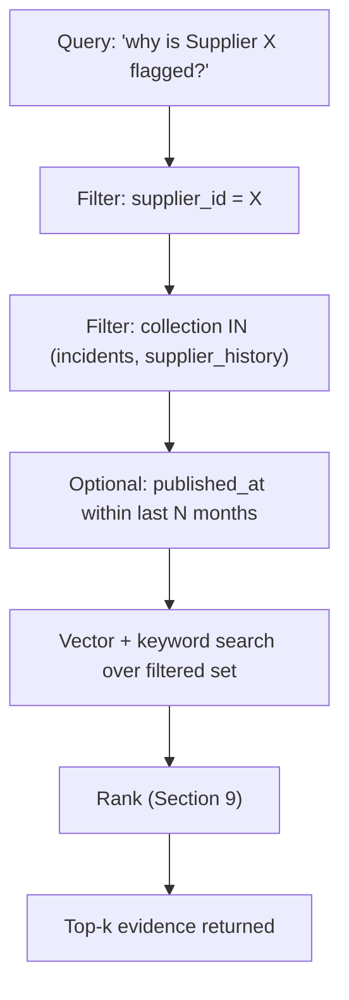

> **ARCHIVED — V1 application documentation, superseded by the V2 benchmark reframing.**
> Vector store for RAG evidence_chunks in the V1 application. No variant of the V2 benchmark has a retrieval component.
> Preserved unchanged for the record. See `docs/CHANGELOG_V1_to_V2.md`.

# Document 7 — Vector Database Design

## Graph Neural Network and Generative AI-Based Supply Chain Risk Prediction System

Version: 1.0
Status: Baseline
Consistent with: Documents 1–6

---

## 1. Purpose

This document defines the vector database design backing the RAG layer (Layer 3): collections, metadata schema, chunking strategy, embedding model, hybrid search, ranking, and filtering. It is entirely a **Phase 2** capability, per Document 1, Section 2.3, and implements the RAG Flow defined in Document 4, Section 8.

**RAG never predicts risk and never makes a decision.** Prediction is exclusively the GNN's job (Document 10); numeric optimization is exclusively OR-Tools' job (Document 10, Section 17); RAG's only role is retrieving evidence for the LLM to explain with, whether the subject being explained is a raw risk score or a Decision Intelligence/Optimization decision (`problem_statement.md`, Section 4, Layer 3).

## 2. Scope

Covers the evidence corpus referenced in the problem statement (Section 3, Layer 3): past incident reports, contract clauses, and supplier history. Does not cover the structured relational data (Document 5) or the graph representation (Document 6) — only the small unstructured/semi-structured evidence corpus that RAG retrieves over.

## 3. Assumptions

- pgvector (co-located with the existing PostgreSQL instance) is the default choice for prototype scale, per Document 2, Section 5; Weaviate is an accepted alternative if pgvector's ANN performance proves insufficient at evaluation scale — the design below is written to be portable between the two.
- Evidence volume remains consistent with the problem statement's framing of the unstructured data as a small portion of overall data (Document 1, Section 12 assumption); this design is not built for large-scale enterprise document ingestion.
- Evidence documents are attributable to a specific supplier, order, or shipment wherever possible, enabling metadata filtering (Section 8).

## 4. Dependencies

Document 2 Section 5 (vector DB technology choice), Document 4 Section 8 (RAG Flow), Document 5 (`suppliers`, `orders`, `shipments`, `customers` IDs used as metadata foreign references), Document 10 (embedding model detail), Document 12 (RAG security — prompt injection via retrieved content).

## 5. Collections

| Collection | Contents | Delivery Phase |
|---|---|---|
| `evidence_incidents` | Past incident reports (e.g., prior delay/shortage write-ups) | Phase 2 |
| `evidence_contracts` | Contract clauses relevant to supplier obligations, SLAs, penalties — including customer SLA/penalty clauses referenced by the allocation recommender's rationale (FR-CUST-03) | Phase 2 |
| `evidence_supplier_history` | Narrative supplier history/performance notes | Phase 2 |

A single logical `evidence_chunks` table (pgvector) or class (Weaviate) holds all three, distinguished by a `collection` metadata field, so cross-collection hybrid search (Section 9) queries one index rather than fanning out across three.

## 6. Schema — `evidence_chunks`

| Field | Type | Description |
|---|---|---|
| `id` | UUID | Primary key |
| `collection` | ENUM(`incidents`,`contracts`,`supplier_history`) | Logical collection |
| `source_document_id` | UUID | Reference to the originating document (may map to `documents.id` in Document 5 for parsed PDFs, or an evidence-specific source) |
| `supplier_id` | UUID (nullable) | Metadata filter key — FK-equivalent to `suppliers.id` |
| `order_id` | UUID (nullable) | Metadata filter key — FK-equivalent to `orders.id` |
| `shipment_id` | UUID (nullable) | Metadata filter key — FK-equivalent to `shipments.id` |
| `customer_id` | UUID (nullable) | Metadata filter key — FK-equivalent to `customers.id` (Document 5, Section 6.24); scopes evidence (e.g., contract clauses) to the customer under evaluation for allocation rationale (FR-CUST-03) |
| `chunk_text` | TEXT | The chunk content |
| `chunk_index` | INTEGER | Position of this chunk within its source document |
| `embedding` | VECTOR(d) | Dense embedding, dimension `d` per chosen embedding model (Document 10) |
| `published_at` | TIMESTAMPTZ | Original document date, used for recency ranking/filtering |
| `created_at` | TIMESTAMPTZ | Ingestion timestamp |

## 7. Chunking Strategy

| Parameter | Value | Rationale |
|---|---|---|
| Chunk size | ~300–500 tokens | Balances retrieval precision against context completeness for incident/contract narratives |
| Overlap | ~50 tokens | Prevents losing context at chunk boundaries |
| Splitting unit | Paragraph-aware recursive splitting (not raw fixed-width) | Preserves semantic coherence of contract clauses and incident narratives |
| Source | Output of the lightweight document-parsing step (Document 5, `documents` table) for PDFs, or directly-authored structured evidence records | Reuses the same parsing step already built for Layer 1 (FR-GC-05), avoiding a second ingestion pipeline |

## 8. Metadata and Filtering

Metadata fields (`collection`, `supplier_id`, `order_id`, `shipment_id`, `published_at`) support filtered retrieval so RAG queries are scoped to the entity under evaluation, not the entire corpus:

This directly implements FR-RAG-03 (hybrid search with metadata filtering).

## 9. Hybrid Search and Ranking

| Stage | Approach | Delivery Phase |
|---|---|---|
| Vector search | Cosine similarity over `embedding` column/index, top-N candidate retrieval (N > k) | Phase 2 |
| Keyword search | PostgreSQL full-text search (`tsvector`) over `chunk_text` (or Weaviate's native BM25) run in parallel | Phase 2 |
| Fusion | Reciprocal Rank Fusion (RRF) combining vector-rank and keyword-rank into a single ranked list | Phase 2 |
| Re-ranking | Boost recency (`published_at`) and exact entity-metadata match; demote chunks below a minimum similarity threshold | Phase 2 |
| Final selection | Top-k (default k=5) chunks returned with `source_document_id` and `collection` for citation (FR-LLM-04) | Phase 2 |

## 10. Indexes

| Index | Target | Purpose | Delivery Phase |
|---|---|---|---|
| ANN vector index (pgvector `ivfflat`/`hnsw`, or Weaviate native HNSW) | `embedding` | Fast approximate nearest-neighbor search | Phase 2 |
| GIN full-text index | `to_tsvector(chunk_text)` | Keyword search component of hybrid search | Phase 2 |
| B-tree composite index | (`supplier_id`, `collection`) | Fast metadata pre-filtering before vector search | Phase 2 |
| B-tree index | `published_at` | Recency-based ranking/filtering | Phase 2 |

## 11. Re-indexing

Per FR-RAG-04, new evidence must be indexed without downtime:

- New documents are chunked and embedded asynchronously on ingestion (background job, Document 8 Section on Background Jobs).
- Inserts into `evidence_chunks` are additive; ANN index structures (`ivfflat`/`hnsw`) support incremental insertion without requiring a full index rebuild at this data scale.
- A periodic re-embedding job is scoped only for the case where the embedding model version changes — not part of routine ingestion.

## 12. Risks

| ID | Risk | Mitigation | Delivery Phase |
|---|---|---|---|
| VDB-01 | Retrieved chunk content could be used for prompt injection against the downstream LLM | Retrieved content is treated as untrusted data, not instructions, in the LLM Orchestration prompt template (Document 12, Section on RAG Security) | Phase 2 |
| VDB-02 | Sparse evidence corpus (small unstructured data volume, per Document 1 assumptions) may yield low-relevance retrieval for some entities | LLM Orchestration must reflect low-confidence retrieval as "no strong evidence found" rather than forcing a citation (Document 4, Section 8) | Phase 2 |
| VDB-03 | pgvector ANN performance may not scale if evidence volume is underestimated | Weaviate is a documented fallback (Section 3 assumption) requiring no schema redesign, only a storage-layer swap | Phase 2 |

## 13. Future Extension

If the volume/variety of unstructured evidence grows materially, this design supports adding new `collection` values (e.g., `regulatory_filings`) without schema changes — only new ingestion sources feeding the same `evidence_chunks` structure, consistent with Document 1, Section 15.

---

## Document Control

- **Purpose:** Section 1. **Scope:** Section 2. **Assumptions:** Section 3. **Dependencies:** Section 4. **Risks:** Section 12. **Future Extension:** Section 13.
- Baseline for Document 10 (AI/ML Documentation — RAG evaluation) and Document 12 (Security — RAG/prompt injection).
