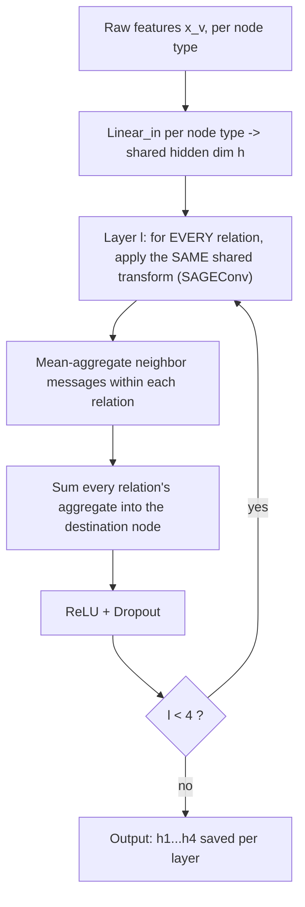
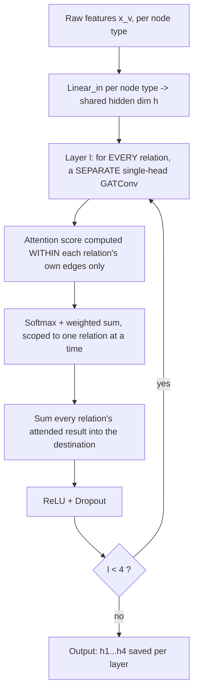
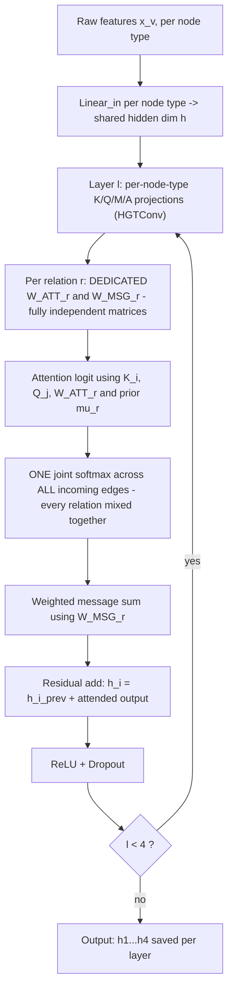
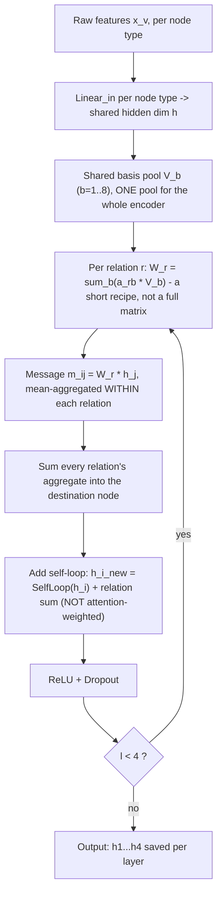
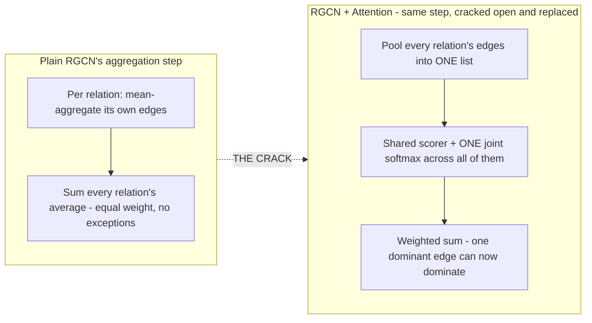
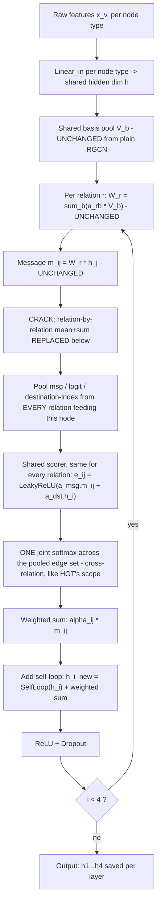
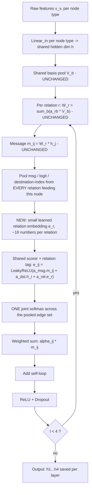

# ChainPilot / HADES — Architecture Reference

Graph structure, the six architectures tested to date, why each was tried, why each
was or wasn't kept, the layer-by-layer mechanics of each, and the one remaining
design still on the table. All numbers below are real, measured results from
`reports/step5_result_v4_4arch.md`, `reports/rgcn_attn_pilot.md`, and
`reports/rgcn_matched_pilot.md` — nothing here is estimated or assumed.

---

## 1. Naming legend

Terminology drifted over the course of this project's architecture line of work, so
here's the mapping used consistently in this document:

| Name used here | What it is | Status |
|---|---|---|
| GraphSAGE | Type-blind, one shared transform for every relation | Tested |
| GAT | Type-blind, attention within each relation only | Tested |
| HGT | Full per-relation-type transform + attention, HGT's native design | Tested |
| RGCN | Basis-decomposition transform (shared pool), no attention | Tested |
| **RGCN + Attention** ("opt1") | RGCN's transform + one shared, relation-agnostic attention scorer | Tested |
| **RGCN + Relation Embedding** ("opt2") | RGCN + Attention's scorer, plus a small per-relation embedding fed into it | Tested |
| RGCN + Basis-Decomposed Attention ("opt3" / next step) | A *second*, separate basis pool dedicated purely to attention scoring | **Not yet built or tested** |

---

## 2. The graph

**8 node types:** Supplier, Component, Product, Factory, Warehouse, Shipment, Order,
Customer.

**20 meta-relations:** 10 forward relations, each doubled into a reverse relation by
`ToUndirected()` at graph-build time (`ml/graph/builder.py`). Four of the ten forward
relations are data-thin relative to the rest — this imbalance is the single fact
driving every result in this document.


Every arrow above is mirrored by `ToUndirected()` into an identical reverse edge
(e.g. `SUPPLIES: Supplier→Component` also produces `rev_SUPPLIES: Component→Supplier`)
— 10 forward + 10 reverse = the full 20 meta-relations every encoder actually sees.

**All 20, explicitly:**

| # | Forward relation | # | Reverse relation |
|---|---|---|---|
| 1 | Supplier —SUPPLIES→ Component *(thin)* | 11 | Component —rev_SUPPLIES→ Supplier |
| 2 | Component —USED_IN→ Product *(thin)* | 12 | Product —rev_USED_IN→ Component |
| 3 | Product —STOCKED_AT→ Warehouse *(thin)* | 13 | Warehouse —rev_STOCKED_AT→ Product |
| 4 | Product —MANUFACTURED_AT→ Factory *(thin)* | 14 | Factory —rev_MANUFACTURED_AT→ Product |
| 5 | Shipment —SHIPS_FROM→ Supplier | 15 | Supplier —rev_SHIPS_FROM→ Shipment |
| 6 | Shipment —SHIPS_FROM→ Factory | 16 | Factory —rev_SHIPS_FROM→ Shipment |
| 7 | Shipment —SHIPS_TO→ Warehouse | 17 | Warehouse —rev_SHIPS_TO→ Shipment |
| 8 | Shipment —FULFILLS→ Order | 18 | Order —rev_FULFILLS→ Shipment |
| 9 | Order —ORDERED→ Product | 19 | Product —rev_ORDERED→ Order |
| 10 | Order —PLACED_BY→ Customer | 20 | Customer —rev_PLACED_BY→ Order |

Real per-node-type feature dimensions (recomputed live, unchanged since v3):
Supplier=14, Component=6, Product=13, Factory=6, Warehouse=7, Shipment=7, Order=5,
Customer=3 — every architecture projects these into the same shared hidden
dimension before anything else happens.

**Three prediction tasks:** delay (targets Shipment), shortage (targets Product),
impact (targets Supplier).

---

## 3. Architecture-by-architecture

### GraphSAGE

**Why we tried it.** The cheapest possible baseline — one shared transform for every
relation, no exceptions. Establishes the floor: what accuracy is achievable with zero
relation-awareness at all.

**Positives — theory.** Extremely low parameter count relative to its capacity;
maximal sharing means every relation's data contributes to the same one estimate, so
nothing gets starved.

**Positives — numbers.** Delay AUC 0.8053 ± 0.0040 at fixed-d=64 — the highest raw
mean of any architecture on delay (though statistically tied with HGT and RGCN, not
a confirmed win). Reasonably competitive on shortage (0.7857 ± 0.0047).

**Negatives — theory.** No way to distinguish a SUPPLIES edge from a STOCKED_AT edge;
no attention, so every neighbor within a relation is averaged in identically
regardless of relevance.

**Negatives — numbers.** Impact AUC only 0.8912 ± 0.0046 — clearly behind HGT
(0.9335) and RGCN+Attention (0.9387–0.9393).

**Why not chosen.** Never wins outright on any task (best case is a statistical tie
on delay); loses clearly on impact; superseded on every task by RGCN+Attention, which
matches or beats it while adding genuine relation-awareness.

---

### GAT

**Why we tried it.** Isolates whether attention *alone* — with no relation-type
awareness and no basis-sharing — explains any of HGT's advantage. Deliberately kept
single-head to preserve this project's documented matched-parameter capacity
ordering (GAT < GraphSAGE < HGT at equal parameter budgets).

**Positives — theory.** Can single out one dominant neighbor within a given
relation's own edges (though never across relations — see negatives).

**Positives — numbers.** The only baseline architecture that beats GraphSAGE on
impact (0.9138 ± 0.0050 vs GraphSAGE's 0.8912) — direct evidence that attention
itself helps there, even without relation-awareness.

**Negatives — theory.** Completely relation- and type-blind — cannot represent any
relation-specific reasoning at all. Attention is a per-relation-then-summed
mechanism here (via `HeteroConv` wrapping one `GATConv` per relation), so it can't
even compare importance *across* relations, only within one relation's own edges at
a time.

**Negatives — numbers.** Clear worst performer on delay (0.7467 ± 0.0080) and by far
the worst on shortage (0.6728 ± 0.0248 — both the lowest mean *and* the highest
seed-to-seed variance measured for any architecture on any task). Never beats HGT on
anything.

**Why not chosen.** Consistently the weakest architecture across every round tested;
retained only as a diagnostic that isolates "attention with zero relation-awareness."

---

### HGT

**Why we tried it.** The project's original, documented architecture — the most
expressive design tested: every one of the 20 meta-relations gets its own fully
independent attention/message matrices, plus a single joint softmax across all of a
node's neighbors regardless of relation.

**Positives — theory.** Maximum expressiveness — nothing forces any two relations to
behave similarly; can single out one standout neighbor from anywhere in a node's
full incoming edge set.

**Positives — numbers.** Decisively, consistently the best on impact in every round
tested: 0.9335 ± 0.0022, never confirmed beaten by a properly paired test (RGCN+Attn
ties it, doesn't clearly exceed it, at either parameter scale).

**Negatives — theory.** Every one of the four thin relations (1,933–7,092 edges) has
to independently estimate a full `hidden × hidden` matrix from a fraction of the
data the denser relations get — a textbook high-variance/overfitting setup.

**Negatives — numbers.** Loses consistently to RGCN-family architectures on shortage
in *every* round tested (RGCN: +0.0118 to +0.0152; RGCN+Attn: +0.0147 to +0.0162 in
its favor), and never confirmed ahead of RGCN+Attention on delay either (statistical
tie in every round, despite HGT's extra machinery).

**Why not chosen as the sole model.** Its entire advantage is concentrated on one
task; the exact mechanism that wins it impact (full per-relation independence) is
the same mechanism that loses it shortage. RGCN+Attention now matches or exceeds it
on all three tasks simultaneously, at comparable parameter cost once matched.

---

### RGCN (plain)

**Why we tried it.** The direct test of the thin-relation-overfitting hypothesis:
replace HGT's full independence with cheap, structured basis-decomposition sharing
(`W_r = Σ_b a_rb · V_b`) and see if shortage recovers.

**Positives — theory.** Thin relations only need to learn a handful of blending
coefficients (a `num_bases`-length recipe) rather than an entire matrix, sharply
reducing what has to be estimated from scarce data.

**Positives — numbers.** Consistent, reproducible win over HGT on shortage in every
round: +0.0118 to +0.0152 depending on the round, always holding sign across all 5
seeds — the first clean confirmation of the thin-relation hypothesis in this
project.

**Negatives — theory.** No attention at all — every neighbor within a relation
averaged flatly, every relation's average summed in with equal weight regardless of
how informative it actually is for this specific node.

**Negatives — numbers.** Worst performer on impact of the four original
architectures: 0.8676–0.8699, clearly behind even GraphSAGE (0.8912), let alone HGT
(0.9335) — basis-sharing trades away exactly the specialization impact needs.

**Why not chosen as final.** Loses badly and consistently on impact; directly
superseded once attention was added on top.

---

### RGCN + Attention ("opt1")

**Why we tried it.** Tests whether attention alone — kept fully relation-blind, added
cheaply on top of RGCN's already-working transform — recovers what plain RGCN was
missing on impact, without giving up shortage's advantage.

**Positives — theory.** Keeps RGCN's exact thin-relation protection intact, while
adding the one capability RGCN structurally lacked: a joint, cross-relation softmax
that can single out one standout neighbor regardless of which relation it arrived
through.

**Positives — numbers.** The strongest single result in the whole project. At
fixed-d=64 (170,984 params): delay 0.8127 ± 0.0035, shortage 0.7985 ± 0.0023, impact
0.9393 ± 0.0098 — beats HGT consistently on delay (+0.0112) and shortage (+0.0162),
ties on impact (raw mean *above* HGT's). At matched-d (hidden=128, num_bases=10,
752,211 params — 0.17% off HGT's own anchor): delay 0.8118 ± 0.0035, shortage 0.7971
± 0.0024, impact 0.9387 ± 0.0051 — **every task moved by less than 0.0015 from the
fixed-d numbers**, confirming this is a real mechanism advantage, not a
smaller-model-regularizes-better artifact. Still beats HGT consistently on delay
(+0.0103) and shortage (+0.0147) at matched scale.

**Negatives — theory.** The attention scorer is fully shared and relation-blind — it
cannot learn that "important" looks structurally different for a SUPPLIES edge than
a STOCKED_AT edge, even if a task genuinely needed that distinction.

**Negatives — numbers.** Impact remains only a statistical tie with HGT, not a
confirmed win — and the current matched-d comparison against HGT specifically uses a
weaker *unpaired* test, since HGT was never retrained with a checkpoint persisted for
a true paired comparison. That's a methodology gap, not a performance one, but it
means impact's real status is still slightly open.

**Current status.** The leading candidate architecture in the project, pending one
fairer paired retest on impact, and pending its own over-smoothing/depth profile
being measured before it can be trusted inside a future depth-gate (Transformer 1).

---

### RGCN + Relation Embedding ("opt2")

**Why we tried it.** Tests whether giving the shared attention scorer a small amount
of relation-identity context — a per-relation embedding vector fed in alongside the
message — recovers any further benefit beyond what fully relation-blind attention
already captured.

**Positives — theory.** Cheap way to make attention at least partially
relation-aware, without the cost or overfitting exposure of giving every relation its
own full attention matrix.

**Positives — numbers.** Beats HGT consistently on shortage (+0.0167 across all 5
seeds at matched-d) — the third independent mechanism (after plain RGCN and
RGCN+Attention) to reproduce that specific win.

**Negatives — theory.** The message a relation-specific transform produces (`W_r ·
h_j`) already implicitly carries that relation's "fingerprint," since `W_r` was built
from that relation's own basis-blended recipe. Handing the attention step an
*explicit* relation tag on top is, in large part, redundant with information the
scorer can already infer from the message's own content.

**Negatives — numbers.** Statistically tied with RGCN+Attention on all three tasks —
every paired delta flips sign across seeds (delay +0.0013, shortage −0.0020, impact
+0.0018, none significant) — despite costing more parameters (388 more at matched
hidden, plus needing its own capacity re-search) and beating HGT on only one task
(shortage) versus RGCN+Attention's two (delay and shortage).

**Why not chosen over RGCN + Attention.** Adds real cost and complexity for no
measurable accuracy benefit. The simpler design remains the better default.

---

## 4. Overall comparison

| Architecture | Arm | Encoder params | Delay AUC | Shortage AUC | Impact AUC |
|---|---|---:|---|---|---|
| GraphSAGE | fixed-d=64 | 664,896 | 0.8053 ± 0.0040 | 0.7857 ± 0.0047 | 0.8912 ± 0.0046 |
| GAT | fixed-d=64 | 347,456 | 0.7467 ± 0.0080 | 0.6728 ± 0.0248 | 0.9138 ± 0.0050 |
| HGT | fixed-d=64 (= matched-d) | 701,088 | 0.8015 ± 0.0106 | 0.7824 ± 0.0057 | **0.9335 ± 0.0022** |
| RGCN | fixed-d=64 | 170,464 | 0.8018 ± 0.0016 | 0.7942 ± 0.0037 | 0.8676 ± 0.0122 |
| **RGCN + Attention** | fixed-d=64 | 170,984 | **0.8127 ± 0.0035** | 0.7985 ± 0.0023 | 0.9393 ± 0.0098 |
| **RGCN + Attention** | matched-d | 752,211 | 0.8118 ± 0.0035 | 0.7971 ± 0.0024 | 0.9387 ± 0.0051 |
| RGCN + RelEmbedding | matched-d *(no fixed-d run exists)* | 752,599 | 0.8105 ± 0.0031 | **0.7991 ± 0.0010** | 0.9369 ± 0.0047 |

Bold = best mean per column. RGCN+Attention is the only architecture with the best
or statistically-tied-for-best result on all three tasks simultaneously.

---

## 5. How each one actually works, layer by layer

Every encoder shares the same entry point (`Linear_in` per node type into a common
hidden dimension) and the same exit contract (every layer's output saved, `h¹…h⁴`,
not just the last) — what differs is entirely inside the box below.

### GraphSAGE



### GAT



### HGT



### RGCN (plain)



### The crack — what changes going from RGCN to RGCN + Attention

This is the exact step that gets cracked open and replaced. Everything upstream of
it (input projection, basis pool, per-relation transform) stays identical.



### RGCN + Attention ("opt1") — full layer flow



### RGCN + Relation Embedding ("opt2") — full layer flow



---

## 6. Next step — RGCN + Basis-Decomposed Attention ("opt3")

**Status: not yet built, not yet tested. Theoretical design only — no numbers exist
for this one.**

Both attention variants tested so far kept the scorer either fully shared (opt1) or
shared-plus-a-small-tag (opt2). The one remaining point on that dial is the most
expensive: give every relation its **own dedicated attention-scoring matrix**,
built the same cheap way the transformation matrices already are — a second,
*separate* small shared basis pool, dedicated purely to attention, distinct from the
pool used for message content:

```
A_r = sum_b(c_rb * Q_b)          # a second basis pool, Q_b, just for scoring
e_ij = (h_i^T . A_r . h_j) / sqrt(hidden)     # bilinear score, per relation
```

**Expected upside (theory).** The most expressive of the three attention designs —
relations could genuinely disagree about what "important" means, not just about what
the message content says.

**Expected risk (theory).** Reopens real per-relation parameter estimation inside
attention — even basis-shared, it's still relation-specific, making it the most
exposed of the three designs to the same overfitting pattern that hurt HGT on the
four thin relations. Given both opt1 and opt2 already showed that relation-blind or
lightly-relation-aware attention captured most of the available benefit, the
marginal value here is genuinely uncertain — it could be small.

**Cost.** Roughly doubles RGCN's relational parameter budget (two full basis pools
instead of one).

**Why still worth testing.** It's the last untested point on the "how relation-aware
should attention be" dial, and completes the systematic sweep rather than leaving a
gap based on a prediction instead of a measurement.

---

## 7. Open items

- RGCN+Attention's win over HGT on impact is a raw-mean lead but only a statistical
  tie — the current test is unpaired because no HGT checkpoint has ever been
  persisted. A real paired retest (retrain HGT once, with checkpointing turned on)
  would settle whether it's a genuine third win.
- RGCN+Attention's over-smoothing/depth behavior across layers has never been
  measured (only HGT's has, from an earlier depth sweep) — needed before any future
  depth-gate work trusts it.
- Dual-sourcing (`component_suppliers`) exists in the schema but is dormant in the
  live dataset — every component still has exactly one supplier — so co-parent
  structural signal isn't actually present in anything trained so far.
