# ChainPilot / HADES — Architecture Reference

Graph structure, encoder architecture selection (**Layer 1**), per-task depth selection on top
of the winning encoder (**Layer 2**), and global hidden-dependency discovery on top of that
(**Layer 3**) — why each design was tried, why it was or wasn't kept, the layer-by-layer
mechanics of each, and what's still on the table. All numbers below are real, measured results
from `reports/layer1.md`, `reports/layer2.md`, `reports/rgcn_types.md`,
`reports/entropy_test.md`, and `reports/phase3.md` — nothing here is estimated or assumed.

---

# LAYER 1 — Core Encoder Architecture

Which encoder computes the shared node representations every prediction task reads from.

## 1. Naming legend

| Name used here | What it is | Status |
|---|---|---|
| GraphSAGE | Type-blind, one shared transform for every relation | Tested |
| GAT | Type-blind, attention within each relation only | Tested |
| HGT | Full per-relation-type transform + attention, HGT's native design | Tested |
| RGCN | Basis-decomposition transform (shared pool), no attention | Tested |
| **SHARE** (RGCN + Attention, code: `rgcn_attn`) | RGCN's transform + one shared, relation-agnostic attention scorer | Tested — **production default** |
| **SHARP** (RGCN + Relation Embedding, code: `rgcn_relemb`) | SHARE's scorer + a small per-relation embedding fed into it | Tested |
| **SHARK** (RGCN + Basis-Decomposed Attention, code: `rgcn_battn`) | A *second*, separate basis pool dedicated purely to attention scoring | **Tested** |

---

## 2. The graph

**8 node types:** Supplier, Component, Product, Factory, Warehouse, Shipment, Order,
Customer.

**20 meta-relations:** 10 forward relations, each doubled into a reverse relation by
`ToUndirected()` at graph-build time (`ml/graph/builder.py`). Four of the ten forward
relations are data-thin relative to the rest — this imbalance is the single fact
driving every result in this document.

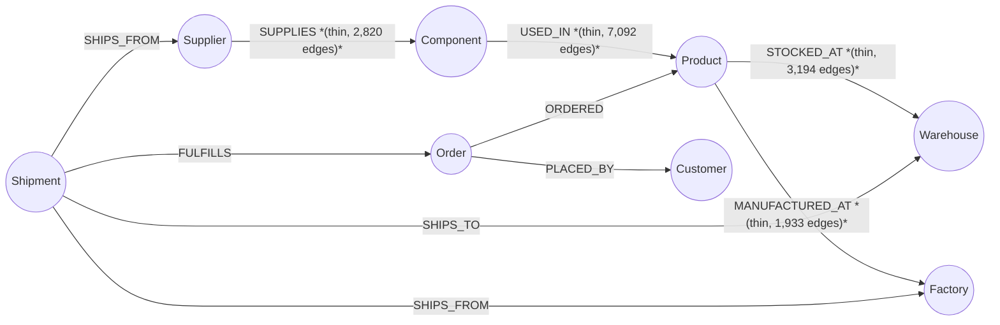

Every arrow above is mirrored by `ToUndirected()` into an identical reverse edge
(e.g. `SUPPLIES: Supplier→Component` also produces `rev_SUPPLIES: Component→Supplier`)
— 10 forward + 10 reverse = the full 20 meta-relations every encoder actually sees.
`SUPPLIES`'s real count (2,820, not the earlier-assumed 2,400) reflects dual-sourcing
being actively loaded in the live dataset — 2,400 mandatory + 420 secondary-supplier
edges (`reports/entropy_test.md`).

Real per-node-type feature dimensions: Supplier=14, Component=6, Product=13, Factory=6,
Warehouse=7, Shipment=7, Order=5, Customer=3 — every architecture projects these into
the same shared hidden dimension before anything else happens.

**Three prediction tasks:** delay (targets Shipment), shortage (targets Product),
impact (targets Supplier).

---

## 3. Architecture-by-architecture

### GraphSAGE

**Why we tried it.** The cheapest possible baseline — one shared transform for every
relation, no exceptions. Establishes the floor.

**Positives — numbers.** Delay AUC 0.8053 ± 0.0040 at fixed-d=64 — highest raw mean of
any architecture on delay (statistically tied with HGT and RGCN, not a confirmed win).

**Negatives — numbers.** Impact AUC only 0.8912 ± 0.0046 — clearly behind HGT (0.9335)
and SHARE (0.9393).

**Why not chosen.** Never wins outright on any task; superseded on every task by SHARE.

---

### GAT

**Why we tried it.** Isolates whether attention *alone* — no relation-type awareness,
no basis-sharing — explains any of HGT's advantage.

**Positives — numbers.** The only baseline that beats GraphSAGE on impact (0.9138 vs
0.8912) — evidence attention itself helps there.

**Negatives — numbers.** Clear worst performer on delay (0.7467) and shortage (0.6728
— both the lowest mean and highest variance measured for any architecture on any task).

**Why not chosen.** Consistently the weakest architecture across every round.

---

### HGT

**Why we tried it.** The project's original architecture — every one of the 20
meta-relations gets its own fully independent attention/message matrices.

**Positives — numbers.** Decisively, consistently the best on impact in every round
tested: 0.9335 ± 0.0022 — undefeated by any architecture across the project's whole
history, including all three RGCN-attention hybrids.

**Negatives — numbers.** Loses consistently to the RGCN family on shortage in every
round (RGCN: +0.0118–0.0152; SHARE: +0.0147–0.0162 in their favor).

**Why not chosen as the sole model.** Its entire advantage is concentrated on impact;
SHARE now matches or exceeds it on all three tasks simultaneously.

---

### RGCN (plain)

**Why we tried it.** Direct test of the thin-relation-overfitting hypothesis: replace
HGT's full independence with basis-decomposition sharing.

**Positives — numbers.** Consistent win over HGT on shortage in every round: +0.0118 to
+0.0152, the cleanest confirmation of the thin-relation hypothesis.

**Negatives — numbers.** Worst performer on impact of every architecture tried,
including every hybrid: 0.8509–0.8699.

**Why not chosen as final.** Loses badly on impact; directly superseded once attention
was added.

---

### SHARE — RGCN + Attention (`rgcn_attn`)

**Why we tried it.** Tests whether attention alone — kept fully relation-blind, added
cheaply on top of RGCN's transform — recovers impact without giving up shortage.

**Positives — theory.** Keeps RGCN's thin-relation protection intact, adds a joint,
cross-relation softmax that can single out one standout neighbor regardless of relation.

**Positives — numbers.** The strongest single result in the project. Matched-d
(hidden=128, num_bases=10, 752,211 params — 0.17% off HGT's own anchor): delay 0.8105–
0.8118, shortage 0.7971–0.7982, impact 0.9365–0.9393. Beats HGT consistently on delay
(+0.0103–0.0112) and shortage (+0.0147–0.0167), ties on impact. Moved by less than
0.0015 per task between fixed-d and matched-d — a real mechanism advantage, not a
smaller-model-regularizes-better artifact.

**Negatives — theory.** The attention scorer is fully shared and relation-blind — it
cannot learn that "important" looks different for a SUPPLIES edge than a STOCKED_AT
edge.

**Current status.** **Production default.** Best-supported candidate across four rounds
of hybrid experimentation (plain RGCN, and SHARE/SHARP/SHARK) — no other variant beats
it on more than one task, and it is the cheapest of the three hybrids to build and train.

---

### SHARP — RGCN + Relation Embedding (`rgcn_relemb`)

**Why we tried it.** Tests whether giving the shared attention scorer a small amount of
relation-identity context recovers any further benefit beyond fully relation-blind
attention.

**Positives — theory.** Cheap way to make attention partially relation-aware, without
giving every relation its own full attention matrix.

**Positives — numbers.** Beats HGT consistently on shortage (+0.0167 at matched-d) —
the third independent mechanism to reproduce that specific win.

**Negatives — theory.** The message a relation-specific transform produces already
implicitly carries that relation's fingerprint — an explicit relation tag on top is
largely redundant with information the scorer can already infer.

**Negatives — numbers.** Statistically tied with SHARE on all three tasks (every paired
delta flips sign across seeds), despite costing more parameters, and beats HGT on only
one task (shortage) versus SHARE's two.

**Why not chosen over SHARE.** Adds real cost and complexity for no measurable accuracy
benefit.

---

### SHARK — RGCN + Basis-Decomposed Attention (`rgcn_battn`)

**Why we tried it.** The last untested point on the "how relation-aware should
attention be" dial — instead of a shared scorer (SHARE) or a shared scorer plus a small
tag (SHARP), give every relation its own dedicated attention-scoring *matrix*, built the
same cheap way the transform matrices already are: a second, separate basis pool
(`att_basis`, `att_coeff`), distinct from the pool used for message content —
`A_r = Σ_b(c_rb·Q_b)`, bilinear score `e_ij = (h_i^T·A_r·h_j)/√hidden`.

**Positives — theory.** The most expressive of the three attention designs — relations
could genuinely disagree about what "important" means, not just about what the message
content says.

**Positives — numbers.** Delay and shortage land in the same range as SHARE/SHARP
(matched: hidden=110, num_bases=9, num_bases_attn=16, 701,310 params — delay 0.8113 ±
0.0052, shortage 0.7956 ± 0.0013).

**Negatives — theory.** Reopens real per-relation parameter estimation inside
attention — even basis-shared, it's relation-specific, exposing it to the same
overfitting pattern that hurt HGT on the four thin relations.

**Negatives — numbers.** Impact's std (0.0559) is an order of magnitude wider than
either other hybrid's (SHARE: 0.0058, SHARP: 0.0071) — driven by a single outlier seed
(seed1: impact=0.8016 vs 0.9433/0.9468/0.9464/0.9189 for the other four). The most
expressive, most expensive design also shows the most fragile training dynamics, at
roughly double the relational parameter cost of the vector-scorer hybrids, for no
accuracy gain.

**Why not chosen.** Neither better on average nor more stable than SHARE or SHARP on
any task — the extra expressiveness buys measurable training fragility without a
measurable return.

---

## 4. Overall comparison

| Architecture | Arm | Params (matched-d) | Delay AUC | Shortage AUC | Impact AUC |
|---|---|---:|---|---|---|
| GraphSAGE | matched-d=66 | 720,261 | 0.8032 | 0.7898 | 0.8889 |
| GAT | matched-d=92 | 731,495 | 0.7400 | 0.6560 | 0.9182 |
| HGT | d=64 (fixed = matched) | 713,763 | 0.8015 | 0.7824 | **0.9335** |
| RGCN | matched-d=138, num_bases=4 | 757,565 | 0.8044 | 0.7976 | 0.8509 |
| **SHARE** | matched-d=128, num_bases=10 | 752,211 | **0.8105–0.8118** | 0.7971–0.7982 | 0.9365–0.9393 |
| SHARP | matched-d=128, num_bases=10, relemb=16 | 752,599 | 0.8100–0.8105 | **0.7988–0.7991** | 0.9366–0.9369 |
| SHARK | hidden=110, num_bases=9, num_bases_attn=16 | 738,273 | 0.8113 | 0.7956 | 0.9114 (unstable, std 0.056) |

Bold = best mean per column, among directly comparable matched-parameter results. SHARE
is the only architecture with the best or statistically-tied-for-best result on all
three tasks simultaneously, and the only one that never shows elevated seed-to-seed
instability.

---

## 5. How each one actually works, layer by layer

Every encoder shares the same entry point (`Linear_in` per node type into a common
hidden dimension) and the same exit contract (every layer's output saved, `h¹…h⁴`) —
what differs is entirely inside the box below.

### GraphSAGE

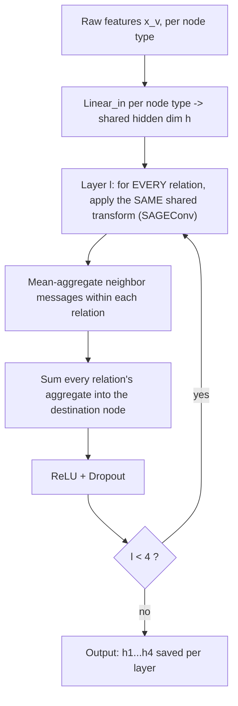

### GAT

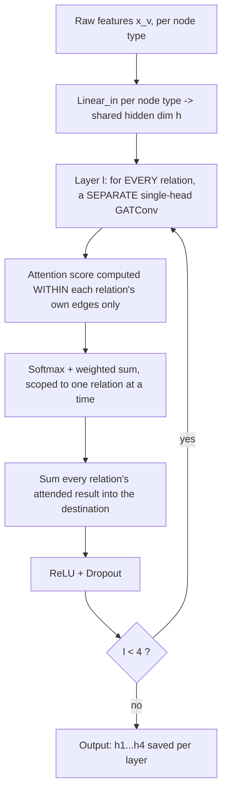

### HGT

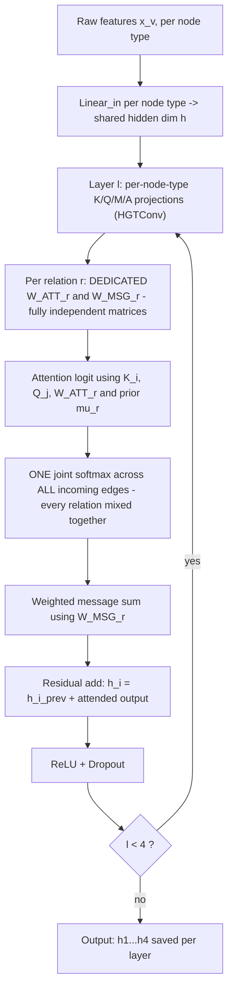

### RGCN (plain)

### The crack — plain RGCN's aggregation, replaced three different ways

Everything upstream of this step (input projection, basis pool, per-relation
transform) stays identical across SHARE/SHARP/SHARK — only this one step changes.

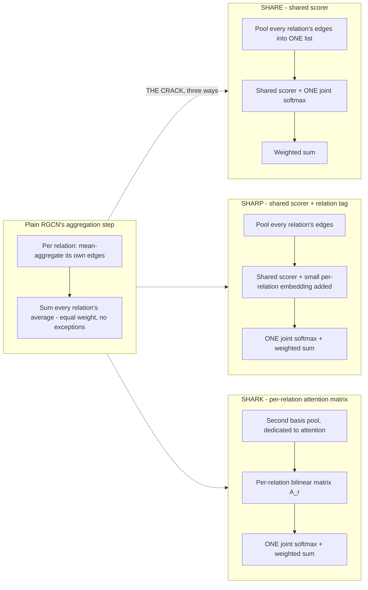

### SHARE — full layer flow

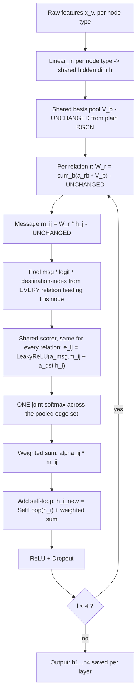

### SHARP — full layer flow

### SHARK — full layer flow

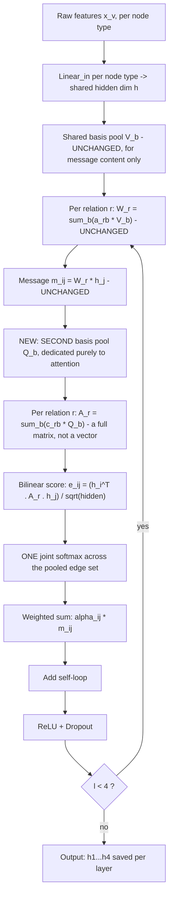

---

## 6. Open items

- SHARK's impact instability (std 0.0559, one outlier seed) is unexplained beyond "more
  expressive, more overfitting exposure" — not root-caused to a specific relation or
  mechanism.
- SHARE's win over HGT on impact remains a statistical tie, not a confirmed win, under
  every test run so far — the current comparisons against HGT are unpaired since no HGT
  checkpoint has ever been persisted.
- All three hybrids independently reproduce the same anti-smoothing pattern on Shipment
  embeddings (similarity *falling* with depth, the opposite of every other node type) —
  an architecture-independent property of the graph, not a model artifact. This directly
  motivated Layer 2's depth-selection work, below.

---

# LAYER 2 — Per-Task Depth Selection on SHARE

SHARE's encoder computes `h⁰…h⁴` — the node's representation at every depth from the raw
input projection through the full 4-layer trunk. Every architecture in Layer 1 read only
`h⁴` (the final layer) for every task. Layer 2 is the investigation into whether a
shallower or task-specific read does better, and what the cheapest reliable way to
exploit that is.

## 1. Naming legend

| Name used here | What it is | Status |
|---|---|---|
| Learned Task Gate | One learned depth-weight vector per task, KL-anchored to a prior | Tested |
| **Markov Floor** (code: `rgcn_attn_markov`) | Zero-parameter, per-task fixed depth derived from graph structure | Tested — **production default** |
| Rung 4 | Per-node attention-based gate over the 5 depth tokens | Tested |
| Rung 5 | Per-node MLP gate over a pooled depth representation | Tested |
| **Variant A** (bounded residual on Rung 5) | Fixed Markov prior + a small, capped learned correction | Tested — **recommended upgrade over Markov alone** |
| Variant B (structural features) | Rung 5 + explicit degree/type/relation-count inputs | Tested |
| Variant C (freeze + slow LR) | Rung 5, gate frozen early then unfrozen slowly | Tested |
| Variant D (depth-preserving projection) | Rung 5 with per-depth projection instead of mean-pooling | Tested |
| Variant E (weight-averaging) | Post-hoc averaging of 5 independently-trained Rung 5 seeds | Tested — **failed, do not use** |
| Minimal Explanatory Subgraph / New-Information Convergence / Diffusion-Based Convergence | Numerical, non-learned depth signals | **Not yet built** — see `v2/layer2_contingency_plans.md` |

## 2. What depth means here

A node's representation at depth `l` reflects everything reachable within `l` hops.
`h⁰` is the node's own raw features, no graph information at all. Each additional layer
lets one more round of neighbor information blend in. A task whose signal is genuinely
local (e.g. delay, one hop from its Shipment target to Supplier/Factory) is well-served
by a shallow read; a task whose signal is spread across the whole bill-of-materials
chain (impact, ultimately touching Order/Customer) needs a deep one.

| Task | Empirically confirmed depth | Why |
|---|---|---|
| delay | `h¹` | Shipment's delay risk is a 1-hop relationship to its Supplier/Factory — deeper reads add noise, not signal |
| shortage | `h³` | Product shortage depends on a longer chain (Component→Product plus Warehouse context) — but shown depth-indifferent in every sweep to date |
| impact | `h⁴` | Impact's causal reach spans the full BOM chain to Order/Customer |

## 3. Mechanism-by-mechanism

### Learned Task Gate

**Why we tried it.** Let each task learn its own depth preference from data instead of
guessing it, via `h_task = Σ softmax(w_task)_l · h_l` — one 5-length weight vector per
task, KL-anchored to a theory-derived prior to stop it drifting somewhere untested.

**Positives — numbers.** Correctly recovers each task's known depth preference exactly
(delay→h¹, shortage→broad/h³, impact→h⁴), stable across seeds, near-total
lambda-insensitivity.

**Negatives — numbers.** Only 1 of 9 (lambda × task) cells clears 5-seed significance
(shortage at λ=0.01, +0.0064). Delay and impact show no reliable AUC change despite the
gate learning the "correct" depth.

**Why not chosen as final.** Mechanistically correct, practically inert — knowing the
right depth didn't translate into an accuracy gain, because the gate still rides on the
full 4-layer trunk's capacity rather than an actually smaller model.

---

### Markov Floor

**Why we tried it.** Derive each task's depth directly from the graph's causal structure
(Markov blanket reasoning) instead of learning it — zero parameters, zero training
signal on depth at all.

**Positives — theory.** A node's Markov blanket (parents, children, co-parents) is the
minimal set that screens off everything else — free, structural, testable via a direct
L-sweep rather than asserted.

**Positives — numbers.** Delay: +0.0072 mean AUC over baseline, CONSISTENT across all 5
seeds, at zero added cost. Beats every more expensive mechanism tried on this specific
task, including the learned gate.

**Negatives — numbers.** Shortage and impact show no reliable change in either
direction — informative (confirms depth-indifference) rather than a shortcoming.

**Current status.** **Production default entering Round 5's variant work**, and the
baseline every subsequent mechanism is measured against.

---

### Rung 4 / Rung 5 — per-node gates

**Why we tried it.** Markov gives one depth per *task*; a per-node gate could let
individual suppliers deviate if the data supports it — the one thing a structural
blanket can never do. Both initialized to reproduce Markov's answer exactly, so neither
could plausibly start worse than it.

**Positives — numbers.** Neither beat Markov on AUC, but Rung 5's deviations (when they
happened) showed a real, sign-consistent structural pattern: deviating nodes were
reliably *lower*-degree, on shortage and impact.

**Negatives — numbers.** Both showed wild, seed-dependent, **bimodal** instability —
some training runs stayed pinned at Markov's answer for nearly every node, others let
75–98% of nodes drift to a different depth, with no accuracy difference distinguishing
the two outcomes. Rung 4's extra attention machinery (15× Rung 5's parameter count)
bought nothing measurable over Rung 5's plain MLP.

**Why not chosen as final.** Instability, not accuracy, was the blocker — motivating
Round 5's five isolated fixes, below.

---

### Variant A — bounded residual ★

**Why we tried it.** Attack the instability's actual root cause: nothing was stopping
the gate from drifting arbitrarily far from Markov's answer. Make the Markov term a
fixed, non-trainable constant, and only allow a small, `tanh`-capped correction on top.

**Positives — theory.** A structural guarantee, not a hope — the maximum possible
deviation from Markov is bounded by construction, at every lambda tested.

**Positives — numbers.** **100% match rate — every seed, every task, every cap size
(λ=0.1/0.3/0.5) tested.** Zero deviating nodes, completely eliminating the bimodal
failure mode. AUC nominally *higher* than Markov on all three tasks at every lambda,
though not statistically significant.

**Negatives — numbers.** None measured — no accuracy cost at any cap size tested.

**Why chosen.** The clearest, most decisive result in the whole depth-selection line: a
strict upgrade over Markov (same accuracy, genuine per-node flexibility if ever needed)
at zero measured cost.

---

### Variant B — structural features

**Why we tried it.** Give the gate the already-known evidence (degree, node type,
relation histogram) directly, instead of making it re-infer that from noisy embeddings.

**Positives — numbers.** Meaningfully stabilized shortage (match rate 0.981 vs the
unfixed original's 0.712), with a consistent degree correlation.

**Negatives — numbers.** Delay remained just as unstable as the unfixed original (0.516
match rate, same wide seed-to-seed spread).

**Why not chosen alone.** Partial fix — helps one task, doesn't touch the mechanism
causing delay's instability.

---

### Variant C — freeze + slow learning rate

**Why we tried it.** Let the shared encoder settle before the gate is allowed to move,
on the theory that early-training noise was driving the instability.

**Positives — numbers.** Large, consistent improvement: delay reached perfect stability
(1.000), shortage/impact nearly so (0.995/0.973 vs the original's 0.712/0.917).

**Negatives — numbers.** Not a complete fix — some residual seed-dependence remained,
unlike Variant A's total elimination.

**Why kept as a follow-up candidate.** Mechanistically complementary to Variant A (one
bounds the ceiling, the other slows the approach to it) — the recommended next
combination to test.

---

### Variant D — depth-preserving projection

**Why we tried it.** Stop blurring all five depths into one mean-pooled average; keep a
small, compressed identity for each before the gate decides.

**Positives — theory.** Directly reverses a documented information loss from the
original Rung 5 design.

**Negatives — numbers.** No improvement — delay's instability was statistically
indistinguishable from the unfixed original (0.113 vs 0.124 match rate), and shortage
got slightly *worse* (0.545 vs 0.712).

**Why not chosen.** The instability was never caused by the information loss this
variant fixes — it was caused by the lack of any drift limit, which this variant never
addressed.

---

### Variant E — post-hoc weight averaging

**Why we tried it.** If different seeds land in different lucky/unlucky spots, average
their final parameters together to cancel out the randomness — zero extra inference
cost if it worked.

**Negatives — numbers.** **Catastrophic failure.** Shortage (0.3223) and impact (0.4548)
scored *worse than random guessing* — every comparison against every baseline
significant in the negative direction, on every task.

**Why not chosen — at all.** Naive parameter-space averaging across independently
initialized, independently trained neural nets is a well-documented failure mode absent
shared-trajectory checkpoints or a common pretrained initialization — not a bug in this
implementation, the expected outcome of the technique misapplied.

---

## 4. Overall comparison

| Mechanism | Delay AUC | Shortage AUC | Impact AUC | Stability (match rate) | Params |
|---|---|---|---|---|---|
| Baseline (h⁴ for every task) | 0.8083–0.8172 | 0.7970–0.7991 | 0.9357–0.9445 | n/a (fixed) | 0 |
| Learned Task Gate (best λ) | 0.8080–0.8113 | **0.8041** | 0.9370–0.9383 | n/a (task-level, not per-node) | 15 |
| **Markov Floor** | **0.8163–0.8188** | 0.7963–0.7994 | 0.9424–0.9445 | 1.00 (by construction) | **0** |
| Rung 4 | 0.8150 | 0.7896 ± 0.0142 | 0.9394 | 0.44–1.00 (bimodal) | 198,546 |
| Rung 5 (original) | 0.8150–0.8170 | 0.7904–0.7976 | 0.9443–0.9450 | 0.12–1.00 (bimodal) | 12,894 |
| **Variant A** | **0.8176–0.8188** | 0.7980–0.7994 | 0.9418–0.9447 | **1.00 (all seeds, all λ)** | ~same as Rung 5 |
| Variant B | 0.8144 | 0.7987 | 0.9382 | delay 0.52, shortage **0.98** | +1,200 |
| Variant C | 0.8166 | **0.8005** | 0.9408 | **1.00 / 0.995 / 0.973** | same as Rung 5 |
| Variant D | 0.8160 | 0.7962 | 0.9430 | 0.11 / 0.55 / 0.96 (no improvement) | −5,400 |
| Variant E | 0.7285 | 0.3223 | 0.4548 | 1.00 (but catastrophically wrong) | 0 (post-hoc) |

Bold = best mean or best outcome per column among directly comparable arms. No mechanism
tested has beaten Markov/Variant A on AUC at a statistically defensible standard — the
work in this layer is a stability story, not yet an accuracy one.

---

## 5. How the key mechanisms actually work

### Markov Floor — depth readout

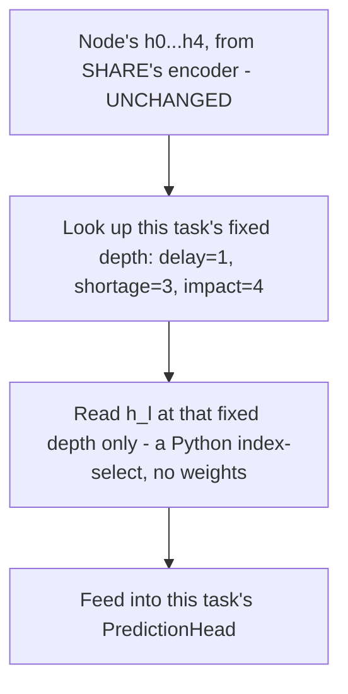

### Learned Task Gate — one distribution per task

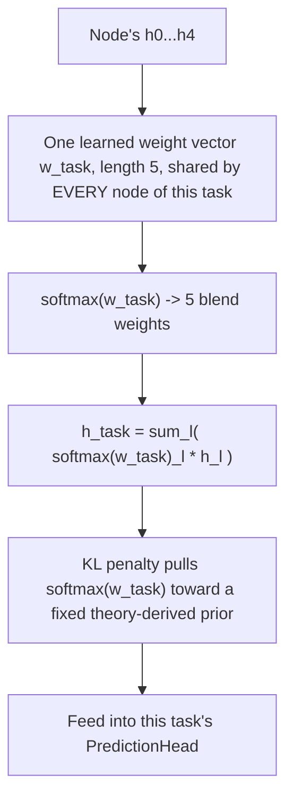

### Rung 5 (original) — per-node gate, the design that became unstable

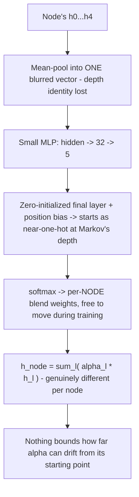

### The crack — Rung 5 (unbounded) vs. Variant A (bounded), the fix that worked

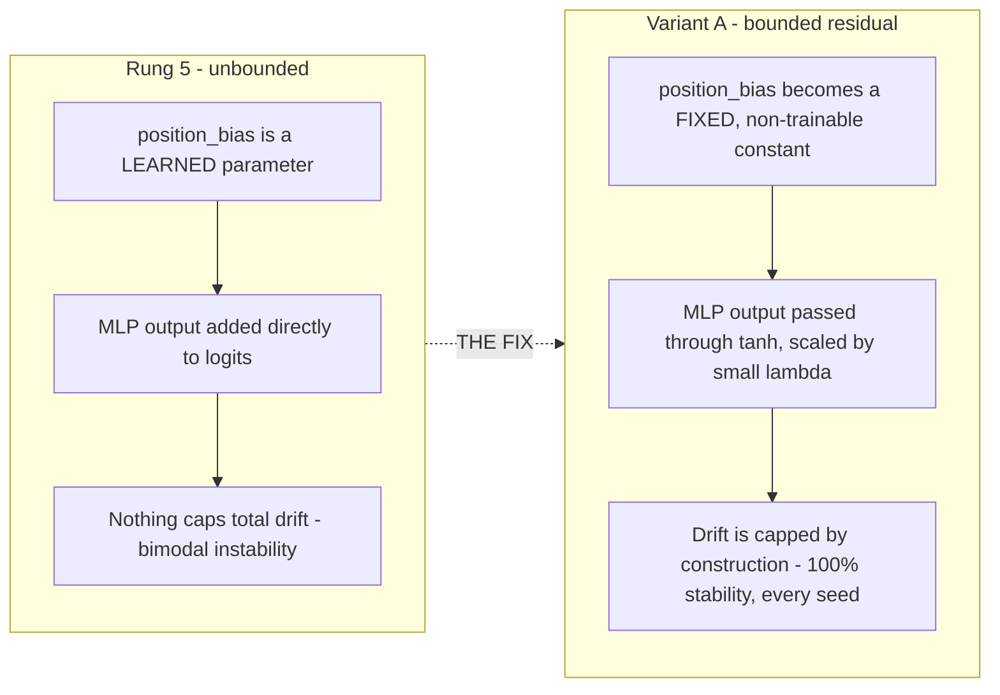

---

## 6. Next step — numerical, non-learned depth signals

**Status: not yet built or tested.** A separate reference document,
`v2/layer2_contingency_plans.md`, catalogs 24 originally-proposed ideas (merged down to
11 distinct mechanisms after deduplication) for deciding depth without training a gate
at all — using graph structure, message-convergence, or diffusion mathematics instead of
labels. The three most promising, in priority order:

1. **Minimal Explanatory Subgraph** — find which upstream nodes actually explain a
   prediction; depth becomes a byproduct, not a decision. Connects to Graph Information
   Bottleneck / GSAT (cited prior art).
2. **New-Information Convergence** — stop a node's propagation once the messages
   arriving stop changing meaningfully. Fully label-free.
3. **Diffusion-Based Convergence** — treat propagation as a diffusion process with a
   known closed-form decay (ties to APPNP/PPRGo), avoiding empirical threshold tuning
   entirely.

All three would be anchored to the Markov Floor as a mandatory minimum, per the lesson
learned from Rung 4/5's unconstrained drift — see `v2/layer2_contingency_plans.md` for
the full catalog and reasoning.

---

## 7. Open items

- No depth-selection mechanism tested so far has produced a statistically defensible
  AUC improvement on shortage or impact — five independent designs, five different
  mechanisms, the same negative result on those two tasks. Only delay (via Markov/
  Variant A) and Variant A's stability result are unambiguous positives.
- Variant A + Variant C combined is the most defensible next experiment — mechanistically
  complementary (one bounds the ceiling, the other slows the approach to it), neither
  showed any accuracy cost alone, not yet tested together.
- The three numerical, label-free depth signals (§6 above) remain unbuilt — their
  primary value proposition is robustness on noisier real-world data, not raw AUC on the
  current synthetic dataset, and that specific claim is untested.
- A "Global Context Halting" mechanism, dependent on a future Global Transformer
  (Transformer 2) component, is speculative until that component exists — it does not
  exist in this codebase as of this document.

---

# LAYER 3 — Global Hidden-Dependency Discovery + Fusion

Everything in Layer 1 and Layer 2 propagates information strictly along the graph's own edges
— message passing can never connect two Suppliers with no path between them. Layer 3 adds a
component that operates outside that constraint entirely: a global attention mechanism over
Supplier embeddings, with no adjacency mask, specifically built to surface hidden
dependencies the graph's own structure cannot represent — then asks whether what it discovers
can be fused back into a prediction task to make it more accurate.

## 1. Naming legend

| Name used here | What it is | Status |
|---|---|---|
| **Transformer 2** (code base: `rgcn_attn_variant_a_transformer2`) | Global same-type attention over Supplier embeddings, no adjacency mask, top-k=64 cosine pool | Tested — **validated as a discovery mechanism** |
| Additive Fusion (original design) | `z_impact + t2_scale · t2_output`, one global learned scalar | Tested |
| **Confidence-Aware Fusion** (code: `rgcn_attn_t2_confidence`) | Additive fusion scaled by a label-free retrieval-confidence score | Tested — **recommended fusion design** |
| Per-Node Trust Gate (code: `rgcn_attn_t2_trustgate`) | Small per-Supplier learned gate replacing the single global scale | Tested |
| Cross-Attention Fusion (code: `rgcn_attn_t2_crossattn`) | Impact embedding cross-attends directly over the retrieved candidate pool | Tested |

## 2. What discovery means here

Every mechanism in Layer 1 and Layer 2 is bounded by the graph's own edges — a Supplier's
representation can only ever be shaped by nodes reachable through some sequence of real
relations (`SUPPLIES`, `SHIPS_FROM`, and so on), no matter how many layers deep it reads.
That is a real limitation: two Suppliers can share a genuine hidden cause — the same
unmodeled upstream plant, the same regional customs office, anything the schema never
recorded as an edge — and no amount of depth tuning from Layer 2 can ever connect them,
because there is no path to traverse in the first place. Layer 3 exists to close exactly that
gap: instead of asking "how many hops should this node look," it asks "which OTHER Suppliers,
anywhere in the graph, does this Supplier's embedding actually resemble, regardless of whether
a path connects them at all."

| Question | Which layer answers it |
|---|---|
| How should a node's own local neighborhood be weighted? | Layer 1 (SHARE's shared attention scorer) |
| How many hops of that neighborhood should a task actually read? | Layer 2 (Markov Floor / Variant A) |
| Are there hidden, non-graph-edge relationships worth surfacing at all? | **Layer 3 (Transformer 2)** |
| If surfaced, should that discovery change a prediction? | **Layer 3 (fusion design — this is the open question)** |

These are two genuinely separate claims, and this project's own validation methodology treats
them as such: a discovery mechanism can be correct and useful (a human-reviewable
investigation-leads tool) even in a round where it does not yet move a downstream task's AUC.

## 3. Mechanism-by-mechanism

### Transformer 2 — the discovery mechanism itself

**Why we tried it.** Every prior architecture (Layer 1) and every depth mechanism (Layer 2)
is fundamentally bounded by the graph's own edges. Transformer 2 tests whether a same-type,
no-adjacency-mask global attention pass over Supplier embeddings can recover a hidden
dependency the schema never encoded as an edge at all — the "moralization" case theorized in
`Markov Scoping and Transformer 1.md` §1.3/§2.4.

**Positives — theory.** Operates post-encoder, on top of whatever depth Variant A currently
selects for impact — purely additive, no changes to SHARE, SHARP, SHARK, or Markov/Variant A.
Bounded to a top-64 cosine-similarity candidate pool per Supplier, matching the original spec's
own bounding choice.

**Positives — numbers.** **VALIDATION VERDICT: PASS, decisively, consistent across all 5
seeds.** Mean percentile rank of the 4 planted H_POLYMER suppliers' pairwise similarity: 0.7255
(chance 0.500). Pool-membership discovery rate: 0.7444 (chance ~0.105) — every seed's discovery
rate exceeds 0.66, 5.5–7.5x the measured chance rate. Not one lucky seed; it replicates.

**Negatives — numbers.** Discovering the hidden dependency did not reliably improve impact
AUC under the original additive-fusion design (0.9434 → 0.9455, but the delta flips sign across
seeds — not statistically significant).

**Why kept, as a discovery tool.** The `hidden_dependency_links` table is real, working, and
populated with a genuine better-than-chance signal a human reviewer can act on — independent of
whether any current fusion design converts that discovery into an AUC gain.

---

### Prerequisite findings — why the AUC gap exists (read before judging any fusion variant)

**Causal coupling verdict (from `db/generate_dataset.py`, read directly).** H_POLYMER — the
only planted hidden-dependency scenario this dataset contains — has **no cross-supplier causal
coupling**, unlike Task 3's dual-sourcing scenario (`COPARENT_COUPLING = 0.35`). Every
H_POLYMER member's own label is fully derivable from that supplier's own observable history
alone; nothing about a partner's stress leaks into it. H_POLYMER is a real, causally-grounded
correlation (all 4 members share genuine, simultaneous disruption exposure) but is
**structurally redundant for prediction purposes** — discovering it adds nothing incrementally
predictive, no matter how the discovery is fused in.

**Retrieval-confidence-vs-usefulness correlation.** Measured directly: Suppliers with more
confident retrieval (concentrated attention, genuinely similar top-64 pool) are the ones whose
predictions Transformer 2 moves the most (`pearson_r = +0.7666`). A real, exploitable signal —
though "moves a prediction a lot" and "moves it correctly" are different claims, and this
dataset's redundancy (above) means the second claim can't currently be tested.

---

### Additive Fusion (original design)

**Why we tried it.** The simplest possible way to let a validated discovery signal influence a
prediction — one learned global scalar, zero-initialized so training can only move away from
the safe, do-nothing baseline deliberately.

**Positives — numbers.** Nominally higher impact AUC (0.9434 → 0.9455) and stable across
re-runs as the reference discovery-quality benchmark (0.7730 mean percentile rank) for judging
every other fusion variant against.

**Negatives — numbers.** The AUC gain is not statistically defensible — the delta flips sign
across seeds. A single global scale applies identically to all 800 Suppliers, diluting
whatever real signal exists for the handful that actually have one.

**Why not chosen as final.** Superseded by Confidence-Aware Fusion, which reuses the same
mechanism with zero added parameters and better-preserved discovery quality.

---

### Confidence-Aware Fusion ★

**Why we tried it.** Rather than let a single learned scalar apply uniformly, scale the fusion
contribution directly by a label-free confidence signal Transformer 2 already computes
internally (mean top-64 cosine similarity + attention entropy) — motivated directly by the
retrieval-confidence correlation finding above.

**Positives — theory.** Adds zero new learned parameters — the confidence signal already
exists inside Transformer 2's forward pass, so there is no new trainable surface area and
therefore no new source of the seed-dependent instability every other per-node gate in this
project's history has shown.

**Positives — numbers.** Best-preserved discovery quality of the three variants tested (0.7130
mean percentile rank vs. the original's 0.7730 — closest of the three to the validated
baseline). Point estimates on par with the other variants on AUC (delay 0.8176, shortage
0.7995, impact 0.9432), though — like every other variant — not statistically significant
against either shared baseline.

**Negatives — numbers.** No variant, including this one, produced a statistically defensible
AUC improvement — expected, given the causal-coupling finding above, not a shortcoming specific
to this design.

**Why chosen.** Zero added cost, the most stable of the three (no new learned weights), and the
best-preserved discovery signal — the correct default until a dataset with genuine incremental
cross-supplier signal exists to actually reward a fusion mechanism. See `reports/phase3.md`
Part 3 for the full comparative rationale.

---

### Per-Node Trust Gate

**Why we tried it.** Replace the single global scale with a per-Supplier learned gate
(`trust_i = tanh(MLP(z_impact_i))`, zero-initialized, reusing Variant A's own bounded-residual
pattern) — the most direct attempt to target only the Suppliers where fusion actually helps.

**Positives — numbers.** Marginally higher point-estimate AUC than confidence-weighting on
delay/impact (not significant). Mechanically the most flexible of the three variants.

**Negatives — numbers.** **Highly unstable across seeds — the same bimodal, seed-dependent
signature Layer 2's Rung 4/5 work found repeatedly.** Mean trust ranges from −0.009 to +0.428
depending purely on random seed; the degree correlation flips sign across seeds
(`[-0.129, -0.146, -0.012, -0.220, +0.101]`). The 4 known H_POLYMER members' mean trust
(+0.0166) is *lower* than the rest of the population's (+0.1715) — consistent with the
causal-coupling finding: there is no training pressure to trust H_POLYMER's signal specifically,
because it carries no incremental predictive value.

**Why not chosen as final.** The instability itself, not the AUC null result, is the open
question — worth revisiting only if a future dataset provides genuine incremental
hidden-dependency signal to train against.

---

### Cross-Attention Fusion

**Why we tried it.** Replace the additive combination with genuine cross-attention — let the
impact representation actively query the retrieved candidate pool, rather than receiving
Transformer 2's generic weighting indiscriminately.

**Positives — theory.** The most expressive fusion mechanism of the three — selective
retrieval of only the relevant part of what was discovered, in principle.

**Negatives — numbers.** The most expensive variant (+49,535 params, the priciest of the
three) and the weakest discovery-quality preservation (0.6510 mean percentile rank) — the
fusion mechanism's own gradient pulls the impact embedding away from the pure retrieval
objective more than either simpler design.

**Why not chosen.** Highest cost, weakest discovery-quality retention, no AUC compensation to
show for either — the least justified of the three on current evidence.

---

## 4. Overall comparison

| Arm | Delay AUC | Shortage AUC | Impact AUC | Discovery (mean percentile) | Params (Δ over base_a) |
|---|---|---|---|---|---|
| base_a (Variant A alone, no Transformer 2) | 0.8167 ± 0.0025 | 0.7952 ± 0.0038 | 0.9436 ± 0.0011 | n/a | 0 |
| Additive Fusion (original) | 0.8144–0.8186 | 0.7991–0.7996 | 0.9425–0.9455 | 0.7730 (reference) | +49,537 |
| **Confidence-Aware Fusion** ★ | 0.8176 ± 0.0026 | 0.7995 ± 0.0039 | 0.9432 ± 0.0025 | **0.7130** | **+0** (reuses existing signal) |
| Per-Node Trust Gate | 0.8185 ± 0.0008 | 0.7991 ± 0.0037 | 0.9438 ± 0.0019 | 0.6357 | +4,160 |
| Cross-Attention Fusion | 0.8186 ± 0.0017 | 0.7992 ± 0.0050 | 0.9443 ± 0.0020 | 0.6510 | +49,535 |

Bold = chosen mechanism. No arm beats another on AUC at a statistically defensible standard —
every comparison across every pair of arms flips sign across seeds. The differentiator across
this layer is discovery-quality preservation and parameter cost, not AUC, per
`reports/phase3.md`'s Prerequisite 0 finding (H_POLYMER carries no incremental predictive
signal for any fusion mechanism to exploit).

## 5. How the key mechanisms actually work

### Transformer 2 — global discovery pass

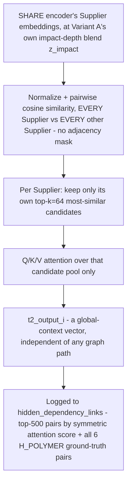

### The crack — three ways to fuse a discovered signal back into impact

Everything upstream of this step (the discovery pass itself, producing `t2_output_i`) stays
identical across all three fusion variants — only how that output gets combined with
`z_impact` changes.

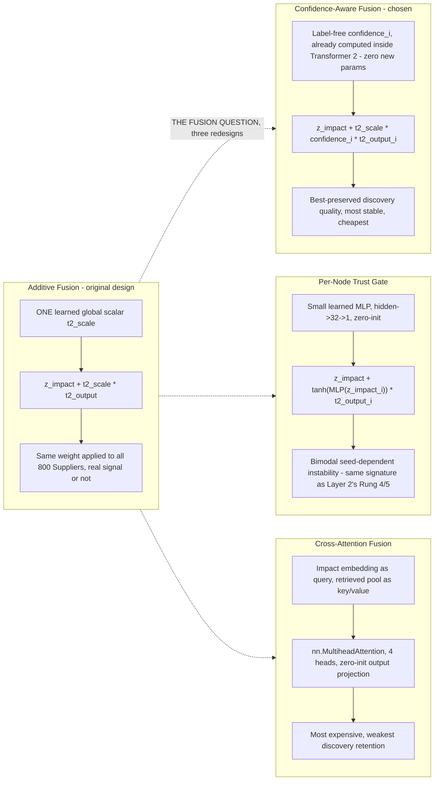

## 6. Next step

**Status: no further fusion variant is currently planned.** The blocking finding
(`reports/phase3.md` Prerequisite 0) is a property of the dataset, not the fusion mechanism —
no amount of further fusion-design sophistication can produce a genuine AUC win from H_POLYMER
specifically, because it carries no incremental predictive signal beyond what each Supplier's
own features already capture. The natural next step is a dataset change, not a model change: a
hidden-dependency scenario built the way Task 3's dual-sourcing scenario was (an explicit,
incremental `COPARENT_COUPLING`-style cross-supplier bleed-through term) applied to a
Transformer-2-style undirected/non-graph-edge relationship. Until such a dataset exists,
Confidence-Aware Fusion remains the standing recommendation — free, stable, and the best
current custodian of Transformer 2's one validated capability.

## 7. Open items

- No fusion variant tested has produced a statistically defensible AUC improvement on any
  task — three independent designs, the same negative result, fully explained by Prerequisite
  0's dataset-level finding rather than any design flaw.
- Per-Node Trust Gate's instability (bimodal, seed-dependent, same signature as Layer 2's Rung
  4/5) is unresolved and worth revisiting specifically if a future dataset provides genuine
  incremental hidden-dependency signal.
- The `is_frontier` override remains implemented but inert — `suppliers.is_frontier` does not
  exist in the live schema, a disclosed limitation carried over from Round 1.
- No dataset currently exists with an incrementally predictive (not just correlated) hidden
  cross-supplier dependency of the kind Transformer 2's fusion designs would need to show a
  real AUC benefit — flagged as the actual blocker for this entire layer's accuracy question,
  not a modeling gap.
