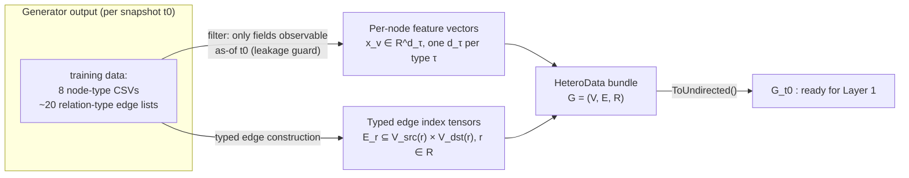
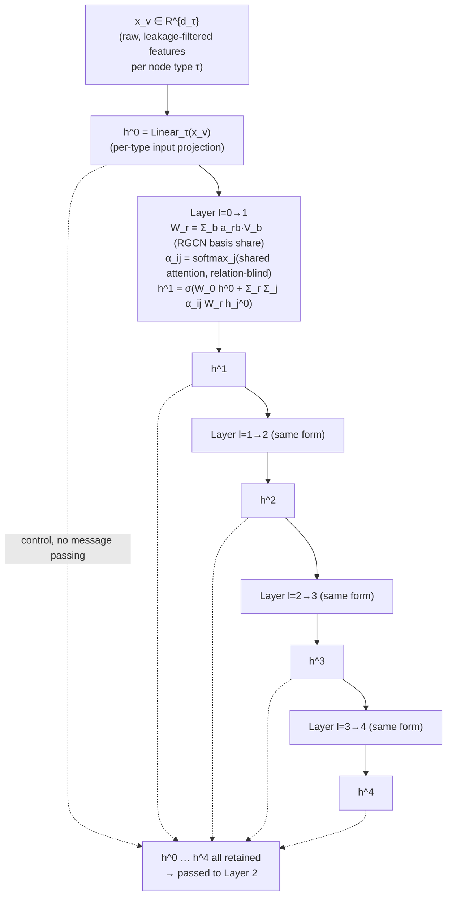
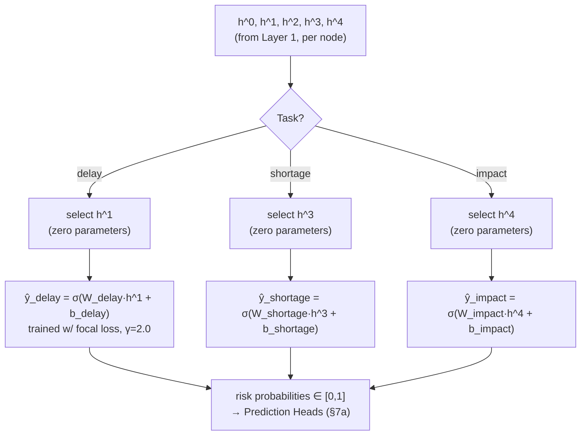
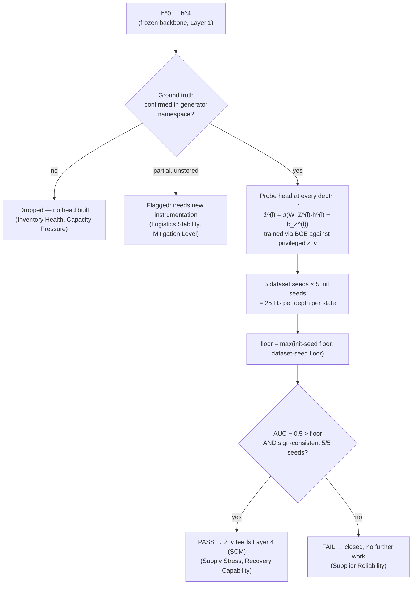
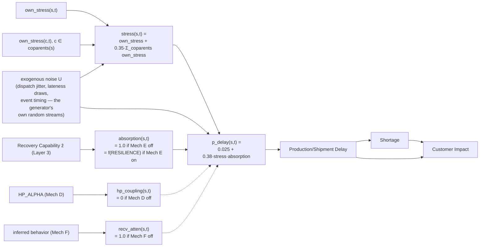
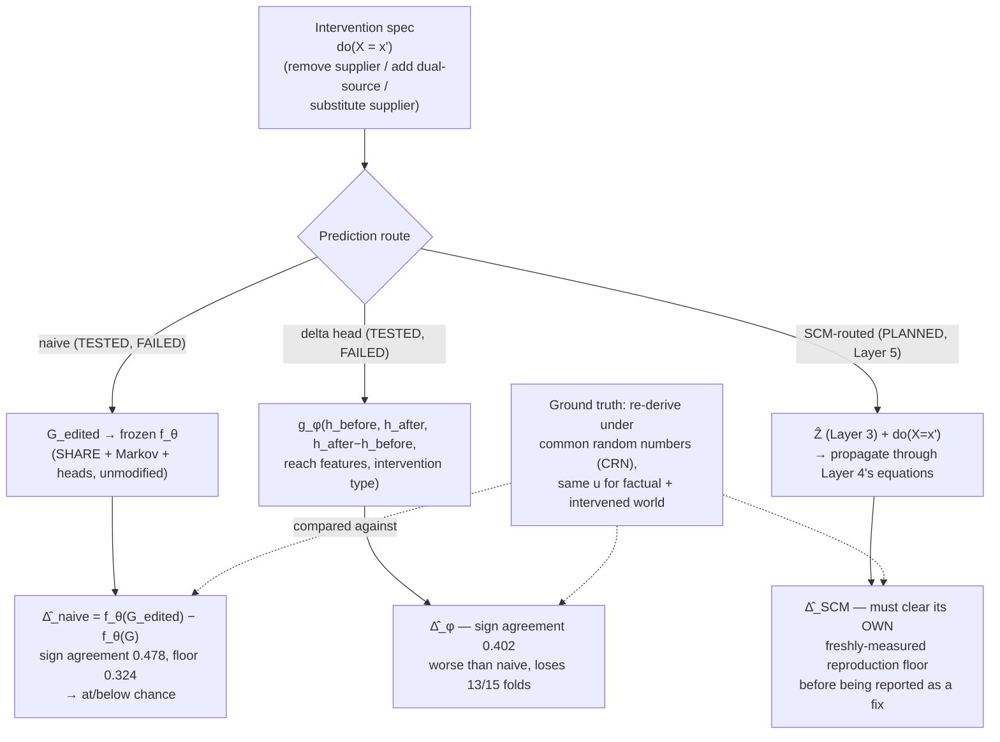
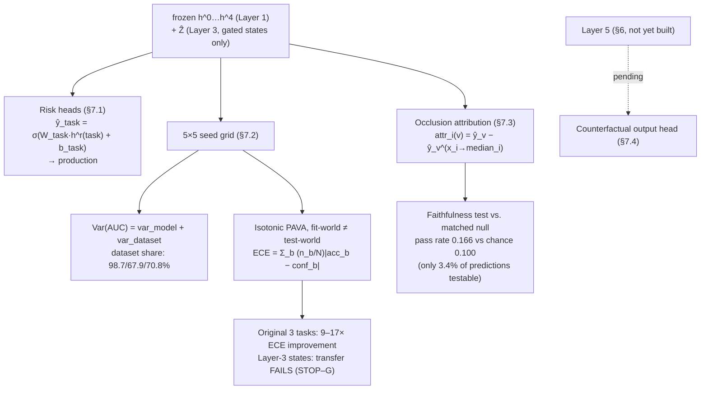
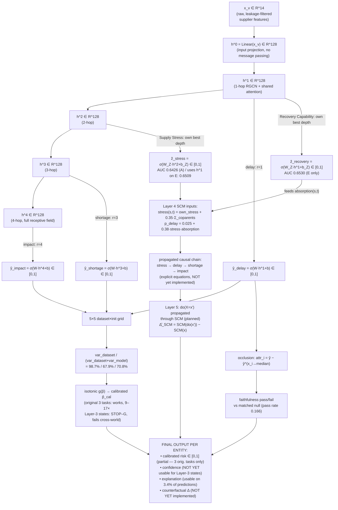

# HADES V3 — Final Planned Architecture: Theory, Mathematics, Practice

*Companion to `results/HADES_build_history_and_architecture_evolution.md`. That document is the
"how we got here"; this one is the "what it is, precisely" — every layer explained on three
levels (why it exists, the exact math, what's actually built and measured), with a flowchart for
each layer's computation and one master flowchart for how a value moves through the whole stack.
Numbers cited are measured facts from the project's own reports, not estimates; equations for
layers that reuse the generator's known code are transcribed from the generator source as
described in `HADES_v3/docs/HADES-v3_init.md` and `HADES_v3/reports/layer3_uncertainty_aware.md`;
equations for the learned layers (SHARE, readout, heads) follow the standard formalization
consistent with the architecture as described in `HADES_v2/findings/evolution.md` and
`HADES_v2/ml/README.md` — where a specific coefficient or hyperparameter is a measured/reported
fact (e.g. `0.35`, `0.025 + 0.38`, `752,211` parameters) it is stated as such; where a formula is
the standard textbook form implementing a *described* design choice, it is presented as that.*

---

## 0. The architecture in one paragraph

Raw graph in, calibrated risk-with-confidence-and-explanation (and, eventually, counterfactual
answers) out. A heterogeneous supply-chain graph is encoded by a shared-attention relational GCN
(**Layer 1 — SHARE**) into five progressively deeper representations of every node. A
zero-parameter selector (**Layer 2 — Markov Blanket readout**) picks, per prediction task, the one
depth that is theoretically sufficient for that task and discards the rest. On top of that frozen
backbone, small probe heads (**Layer 3 — Latent State Estimation**) try to recover a handful of
hidden operational quantities the generator tracks internally but never emits. Those recovered
states are meant to feed an explicit set of causal equations (**Layer 4 — Structural Causal
Model**) lifted directly from the generator's own code, which in turn drive an intervention
simulator (**Layer 5 — Counterfactual Engine**) that answers "what happens if we remove this
supplier" by propagating the edit through the SCM rather than by re-running the encoder on an
edited graph. Four parallel prediction heads sit at the end: the original risk scores
(delay/shortage/impact), a calibrated confidence estimate, a faithfulness-tested explanation, and
(once Layer 5 exists) a counterfactual outcome. As of this writing, Layers 1–2 are closed and in
production; Layer 3 is built but has not produced a single state that survives every gate; Layers 4
and 5 are designed but not yet implemented, precisely because the naive alternative to Layer 5 was
tested and shown to fail.

---

## 1. Layer 0 — Input representation: the heterogeneous graph

### 1.1 Theory
A supply chain is not one relation type — a supplier *supplies* a component, a factory *makes* a
product from components, a warehouse *stores* a product, a shipment *carries* a product to a
customer. Collapsing this into a single homogeneous graph (one node type, one edge type) throws
away exactly the structural information a reasoning system needs to distinguish "this node is
risky because its supplier is late" from "this node is risky because its warehouse is empty."
The architecture therefore commits to a **heterogeneous graph** as its native input representation
from the start, and every downstream layer is built to consume that typing rather than average it
away.

### 1.2 Mathematics
The graph at snapshot $t_0$ is $G_{t_0} = (\mathcal{V}, \mathcal{E}, \mathcal{R})$ where
$\mathcal{V} = \bigcup_\tau V_\tau$ is the union of typed node sets (Supplier, Component, Product,
Factory, Warehouse, Shipment, Order, Customer — eight types), $\mathcal{R}$ is the set of relation
types (≈20 meta-relations at baseline, 22 under Mechanism J's added `UPSTREAM_OF` relation,
doubled again by `ToUndirected()` at load time), and
$\mathcal{E} = \bigcup_{r \in \mathcal{R}} E_r \subseteq V_{\text{src}(r)} \times V_{\text{dst}(r)}$.
Every node $v$ of type $\tau$ carries a feature vector $x_v \in \mathbb{R}^{d_\tau}$ — for the
Shipment type this is 14 dimensions, drawn only from what is observable as-of $t_0$ (Section 9
covers the leakage discipline this enforces). The graph is assembled fresh per snapshot; there is
no persistent node identity carried across snapshots inside the model — only through the labels
used for training.

### 1.3 Practical
Implemented in `ml/data/loader.py::build_snapshot`, converted to a PyTorch Geometric `HeteroData`
object and passed through `ToUndirected()`. Assembled bundles are cached to `ml/.cache/` because
nine architectures × five seeds re-read the same bundles 45 times during a sweep. Three deliberate
generator-specific deviations are handled at this layer: Mechanism G's reporting-delay gap (as-of
clock reads `recorded_at`, not `changed_at`, so the model cannot see a status change before it was
actually reported); Mechanism J's added `UPSTREAM_OF` relation; and Mechanism A's node-set shrinkage
(hidden suppliers are absent from `suppliers.csv` entirely, not merely feature-masked). A denylist
(`HIDDEN_STATE_COLUMNS`) and `verify_no_hidden_state()` guard against any generator-internal column
(resilience, hidden_parent_id, stress, …) leaking into $x_v$.

### 1.4 Flowchart

### 1.5 Effect of data scarcity on this layer
This layer has no learned parameters, so it cannot "overfit" in the usual sense — but it is where
scarcity from every later layer actually originates. Two structural relation types are thin by
construction (hundreds to a few thousand edges against tens of thousands for the rest), which is
precisely the property that broke the original HGT encoder downstream (Section 2.6). The feature
vectors are also only as informative as the generator's own field set — real supply-chain systems
observe dozens of additional signals (contract terms, financial health, quality audit history) this
graph simply does not represent, because the generator was never asked to.

---

## 2. Layer 1 — SHARE (Shared-Attention Relational Encoder)

### 2.1 Theory
Two failure modes bracket the design space. Give every relation type its own fully independent
attention and transform (as the original HGT did) and thin relations — with only hundreds of edges
— overfit, because they don't have enough examples to fit their own parameter set. Give every
relation the *same* transform (as plain GraphSAGE/RGCN-without-attention does) and the model loses
the ability to single out one genuinely standout neighbor regardless of which relation connects it,
which costs accuracy on tasks (like impact) that hinge on exactly that. SHARE is the resolution:
keep RGCN's parameter-sharing transform (protects thin relations) but add **one shared,
relation-blind attention scorer** on top (recovers the ability to weight neighbors by importance,
without re-introducing a per-relation parameter set). This is a bias-variance argument made
concrete and then empirically confirmed, not a design chosen a priori — Section 4 of the companion
history document has the full seven-architecture bake-off that led here.

### 2.2 Mathematics
For each relation $r$, the transform uses RGCN's basis decomposition — $B$ shared basis matrices
$V_1, \dots, V_B \in \mathbb{R}^{d^{(l)} \times d^{(l+1)}}$, with each relation's weight matrix a
learned linear combination of them:

$$
W_r^{(l)} = \sum_{b=1}^{B} a_{rb}^{(l)} \, V_b^{(l)}, \qquad a_{rb}^{(l)} \in \mathbb{R}
$$

so a relation never gets a fully independent transform, only a different mixing of $B$ shared
bases ($B{=}10$ in the production configuration — Section 2.4). The relation-blind attention
scorer computes a single set of attention logits shared across every relation type: for an edge
$(i, j)$ of relation $r$,

$$
e_{ij}^{(l)} = \text{LeakyReLU}\!\left(a^{(l)\top} \big[W_r^{(l)} h_i^{(l)} \,\Vert\, W_r^{(l)} h_j^{(l)}\big]\right), \qquad
\alpha_{ij}^{(l)} = \frac{\exp(e_{ij}^{(l)})}{\sum_{k \in \mathcal{N}(i)} \exp(e_{ik}^{(l)})}
$$

where $a^{(l)}$ is a single learned vector shared by *every* relation — this is the "relation-blind"
part: the scorer that decides how much to trust a neighbor never sees which relation connected it,
only the (already relation-transformed) content of the two endpoint representations. The layer
update is then

$$
h_i^{(l+1)} = \sigma\!\left( W_0^{(l)} h_i^{(l)} + \sum_{r \in \mathcal{R}} \sum_{j \in \mathcal{N}_r(i)} \alpha_{ij}^{(l)} \, W_r^{(l)} h_j^{(l)} \right)
$$

stacked for $l = 0, \dots, 3$, producing five representations per node,
$h^0, h^1, h^2, h^3, h^4$, where $h^0$ is the initial linear projection of $x_v$ (zero
message-passing steps — used throughout the project as a control for "is this signal readable from
raw features alone") and each subsequent $h^l$ has aggregated information from progressively larger
neighborhoods.

### 2.3 Why this specific form was chosen over the alternatives (quantified)
| Architecture | Formula difference from SHARE | Measured cost |
|---|---|---|
| HGT | fully independent $W_r$ and independent attention *per relation* | best on impact (0.9335) but loses to RGCN family on shortage every round — thin-relation overfitting |
| RGCN (no attention) | drops the $\alpha_{ij}$ term entirely (uniform aggregation) | worst on impact (0.8509) — no mechanism to single out a standout neighbor |
| SHARP | adds a small per-relation embedding fed into $e_{ij}$'s computation | statistically tied with SHARE, costs more, no measurable gain |
| SHARK | replaces the shared vector $a^{(l)}$ with a full per-relation attention matrix | same accuracy range as SHARE, ~10× more seed-to-seed instability (impact std 0.056 vs. SHARE's 0.006) |

### 2.4 Practical
`ml/models/rgcn_attn_encoder.py`. Production configuration: hidden dimension 128, $B{=}10$ bases,
**752,211 parameters total** — reproducing `HADES_v1/reports/info.md` §4 exactly. Validated
best-or-tied-for-best on all three prediction tasks across **all twelve** V2 mechanism variants, on
two independently-built datasets. Confirmed **closed** as of the V3 inheritance audit — SHA-256
checksum matches V2 byte-for-byte, and it is not retrained or modified by any V3 layer.

### 2.5 Flowchart

### 2.6 Effect of data scarcity on this layer
Already-visible even with SHARE's protections: two of ten relation types are structurally thin
(hundreds to low-thousands of edges against tens of thousands for the rest), and while SHARE's
shared-basis transform is specifically designed to resist overfitting on this thin data, it does
not eliminate the underlying scarcity — it just prevents the model from being *given* enough
per-relation parameters to memorize it. On real company data, relation sparsity would likely be
worse, not better: a real firm's dual-sourcing edges, substitution edges, and upstream-visibility
edges are typically far rarer and noisier than a generator that explicitly controls edge density by
construction.

---

## 3. Layer 2 — Markov Blanket Readout

### 3.1 Theory
Named for the idea that a node's *Markov blanket* — the minimal set of other nodes that renders it
conditionally independent of the rest of the graph — sits at a particular graph-distance "depth"
from it, and that depth is a property of the *task*, not something that needs to be learned per
node. Three of the graph's task-relevant causal chains are of different length: delay is a
near-neighbor property (does *this* shipment's own carrier/route look bad), shortage propagates
through one more hop (a product's shortage depends on its components' suppliers), and impact
requires the longest chain (a supplier's overall risk aggregates across its whole downstream
footprint). Eight distinct learned alternatives to picking one fixed depth were tried across two
projects — none ever beat simply fixing it per task. That negative result, repeated at this scale
and stability, is itself the theoretical claim this layer now encodes: for this benchmark, adaptive
depth selection has no signal to adapt to.

### 3.2 Mathematics
The readout is a **deterministic, zero-parameter selector**

$$
r(\text{task}) = \begin{cases} 1 & \text{task} = \texttt{delay} \\ 3 & \text{task} = \texttt{shortage} \\ 4 & \text{task} = \texttt{impact} \end{cases}
\qquad\qquad
\hat{h}_v^{\text{task}} = h_v^{r(\text{task})}
$$

with no gradient ever computed with respect to $r$ — it is fixed by design, not fit. A small,
task-specific head then maps that single selected depth to a probability:

$$
\hat{y}_v^{\text{task}} = \sigma\!\left(W_{\text{task}} \, \hat{h}_v^{\text{task}} + b_{\text{task}}\right)
$$

trained against the sparse-positive-rate label with **focal loss** (to counteract the label
imbalance — impact is 2.13% positive at spec scale):

$$
\mathcal{L}_{\text{focal}} = -\alpha_{\text{task}} \, (1-\hat{y})^\gamma \, y \log \hat{y} - (1-\alpha_{\text{task}}) \, \hat{y}^\gamma (1-y)\log(1-\hat{y}), \qquad \gamma = 2.0
$$

with $\alpha_{\text{task}}$ computed directly from the training split's own positive rate. The eight
rejected alternatives to $r(\cdot)$ tried instead to learn a per-task or per-node blend
$g_\phi(h^0,\dots,h^4) \to \Delta^4$ (a distribution over depths) or a residual correction around
the fixed prior — all failed for reasons detailed in Section 5.3 of the companion history document
(one alternative's correction term was mathematically incapable of ever moving; another collapsed
to a single global depth via destructive mean-pooling of per-depth tokens).

### 3.3 Practical
`ml/models/rgcn_attn_markov_encoder.py` (the readout logic) plus `ml/models/heads.py` (the
per-task head, focal loss). Closed as of V3's inheritance: confirmed unchanged from V2, and its
adaptive-depth alternative is explicitly documented as "not an open question." One caveat carried
forward from V3 Phase 1: **this fixed depth mapping was tuned for the three original prediction
tasks and is demonstrably not the right depth for Layer 3's latent-state estimation** — h⁴ turns
out to be the *worst*-performing depth for both latent states that pass their gate (best depths are
h¹ and h², Section 4.4). Layer 3 reads from its own best depth rather than inheriting this mapping.

### 3.4 Flowchart

### 3.5 Effect of data scarcity on this layer
The depth *selector* itself has zero parameters, so it cannot overfit — but the per-task head that
consumes the selected depth is a small classifier subject to the same scarcity as any supervised
model: impact's 2.13% positive rate is the tightest constraint of the three original tasks, and it
is exactly the kind of imbalance focal loss exists to manage rather than eliminate. More
importantly, the *depth mapping itself* was chosen empirically against this benchmark's specific
label distribution and causal-chain lengths; there is no guarantee a real company's actual causal
lag structure between "supplier stress" and "customer-visible impact" matches the generator's
chosen chain length, so this is a place where synthetic-benchmark-tuned architecture choices could
silently misalign with real timing.

---

## 4. Layer 3 — Latent State Estimation

### 4.1 Theory
This is explicitly **not** a re-attempt of the identity-discovery question V2's original Layer 3
asked and failed at (Section 6 of the companion history document; that question — "which specific
other suppliers does this one secretly share a hidden parent with" — is closed for a diagnosed
structural reason and is not reopened here). This layer asks a different question: can a small
probe recover a hidden *scalar operational condition* (how stressed is this supplier right now, how
much resilience does it have) from the same observable representations the encoder already
computes? The theoretical justification for even attempting this is a precedent, not an analogy:
Mechanism E's true hidden resilience state was separately checked during dataset calibration and
found recoverable at AUC ≈ 0.599 from hand-built features — meaningfully above chance, in sharp
contrast to hidden-parent *identity*, which sat at exactly chance at every encoder depth under every
method tried. Ground-truth confirmation is mandatory *before* any estimator is built — a discipline
adopted specifically because it would have caught V2's original mistake of building a discovery
mechanism for a relationship that turned out to be structurally undiscoverable.

### 4.2 Mathematics
For a candidate latent state $Z$ with confirmed generator-side ground truth $z_v \in \{0,1\}$ (or a
continuous value, binarized by median split for the identifiability tests), a probe head is fit on
top of the **frozen** backbone at every depth $l \in \{0,1,2,3,4\}$:

$$
\hat{z}_v^{(l)} = \sigma\!\left(W_Z^{(l)} h_v^{(l)} + b_Z^{(l)}\right), \qquad
\mathcal{L}_Z = \text{BCE}(\hat{z}_v^{(l)}, z_v)
$$

with $z_v$ used **only** as a training/evaluation target, never as a model input at inference — the
same privileged-supervision discipline enforced by `verify_no_hidden_state()` at Layer 0. A state is
only built at all if a ground-truth confirmation check passes first:

$$
\text{confirmed}(Z) \iff \exists\ \text{a generator-internal variable } g \text{ such that } z_v \equiv g(v,t) \text{ is inspectable in-process}
$$

(concretely: the generator is executed with its `write()` stub disabled and its own namespace
inspected directly, refusing to trust ground truth from a generator run that itself failed
validation). Once a head is fit, it must clear a **reproduction floor** before any AUC is trusted —
and, following the dataset-seed-variance finding from the decision-support build (Section 7.2 of the
companion document), the floor used is the *maximum* of two independently measured floors, not just
one:

$$
\text{floor}(Z, l) = \max\big(\text{floor}_{\text{init-seed}}(Z,l),\ \text{floor}_{\text{dataset-seed}}(Z,l)\big), \qquad
\text{gate: } \text{AUC}(Z,l) - 0.5 > \text{floor}(Z,l) \text{ and sign-consistent across all 5 dataset seeds}
$$

### 4.3 Candidates tested and their disposition

| Candidate | Ground truth | Head built? | Result |
|---|---|---|---|
| Supply Stress | confirmed (`own_stress()`) | yes | **PASS** — best AUC 0.6426 (h², Variant A) / 0.6509 (h¹, Variant E) |
| Recovery Capability | confirmed (`RESILIENCE[sup_id]`, Mechanism-E only) | yes | **PASS** — best AUC 0.6530 (h¹, Variant E), strongest result in the phase |
| Supplier Reliability | confirmed (`IDIO[sup_id]`) | yes | **FAIL** — AUC 0.44–0.51, not sign-consistent, below its own floor at every depth |
| Inventory Health | not confirmed — already an emitted feature | no | dropped |
| Capacity Pressure | not confirmed — no time-varying latent exists | no | dropped |
| Logistics Stability | partially confirmed — real effect, never stored per-entity | no | needs new instrumentation |
| Mitigation Level (bonus) | confirmed as genuinely latent | no | needs new instrumentation (destructively drained by the agent loop) |

### 4.4 Practical
`ml/confirm_latent_states.py` (ground-truth confirmation) and `ml/latent_state_head.py`
(estimator heads). Measured on the `v1` preset (800 suppliers) across all five dataset seeds
because spec-scale data only has two seeds on disk. Notably, both cleared states are recovered
*better* from a middle depth (h¹ or h²) than from h⁴, the depth the (unrelated) impact task's
readout uses — Layer 3 is instructed to read from its own best depth, not inherit Layer 2's mapping.
Supplier Reliability's failure has a fully diagnosed mechanism (Section 5 below), and its single-seed
pilot number (AUC 0.5444, superficially reportable) collapsing to below-chance under the five-seed
floor is one of the project's clearest live demonstrations of why the floor discipline exists.

### 4.5 Flowchart

### 4.6 Effect of data scarcity on this layer
This is the layer where data scarcity shows up most directly and most quantifiably in this project.
Supplier Reliability's failure is a textbook positive-rate problem: the underlying outage mechanism
gives only 25% of suppliers a single ~25-day outage across a 21-month timeline, and — critically —
53–57% of outaged suppliers dispatch *zero* shipments during their own outage window, meaning the
observable evidence a classifier would need simply doesn't exist in most cases, independent of model
capacity. This was explicitly diagnosed as "not a sampling problem to fix with a bigger head, but an
identifiability failure" once Section 5's real-intervention test confirmed the same non-signal at
the causal level, not just the correlational one. Recovery Capability's pass is itself
sample-thin in a different way: because `RESILIENCE` is static per supplier, its 24,000 nominal test
rows collapse to only ~800 truly independent observations per seed (replicated six times across
snapshots) — the result survives on five-seed sign-consistency, not on row count.

---

## 5. Layer 4 — Structural Causal Model (SCM)

### 5.1 Theory
Pearl's causal hierarchy places prediction ($P(Y\mid X)$) at rung 1 and intervention
($P(Y\mid do(X))$) at rung 2; no volume of rung-1 (observational) data alone identifies a rung-2
quantity without either genuine interventional data or explicit structural assumptions about how
variables cause one another. Layers 1–3 are rung-1 machinery, however sophisticated. Layer 4 is the
project's answer to needing rung 2: rather than attempting causal *discovery* (learning the causal
graph and its equations from data — explicitly named the hardest open problem the original proposal
would otherwise have inherited), it **extracts** the equations that are already known, because this
project's data comes from a generator whose source code literally contains them. This is a
deliberate, disclosed shortcut, not a general solution — Section 10 returns to exactly why it does
not transfer to real deployment.

### 5.2 Mathematics — the actual extracted causal chain
The generator's live channel on Variant 0 (`db/generate_dataset.py`, as confirmed by the
identifiability tests in `layer3_uncertainty_aware.md` §2A) is:

$$
\text{stress}(s,t) = \text{own\_stress}(s,t) \;+\; \underbrace{0.35}_{\text{COPARENT\_COUPLING}} \cdot \sum_{c \,\in\, \text{coparents}(s)} \text{own\_stress}(c,t)
$$

$$
p_{\text{delay}}(s,t) = 0.025 \;+\; 0.38 \cdot \text{stress}(s,t) \cdot \text{absorption}(s,t)
$$

with `absorption` gated by two mechanisms:

$$
\text{absorption}(s,t) = \begin{cases}
1.0 & \text{Mechanism E disabled} \\
f_{\text{resilience}}\big(\text{RESILIENCE}[s]\big) \le 1.0 & \text{Mechanism E enabled — this is Layer 3's "Recovery Capability"}
\end{cases}
$$

and two further gated terms that vanish to their inert value when their mechanism is off, exactly
mirroring the generator's own mechanism-isolation contract (Section 5, `02_TRS.md` ISO-2):

$$
\text{hp\_coupling}(s,t) = \begin{cases} 0.0 & \text{Mechanism D disabled} \\ f_{\text{HP\_ALPHA}}(\cdot) & \text{Mechanism D enabled} \end{cases}
\qquad\quad
\text{recv\_atten}(s,t) = \begin{cases} 1.0 & \text{Mechanism F disabled} \\ f_{\text{adaptive}}(\cdot) & \text{Mechanism F enabled} \end{cases}
$$

Downstream of $p_{\text{delay}}$, the causal chain named in the V3 init document continues:

$$
\text{Supply Stress} \;\rightarrow\; \text{Inventory Reduction} \;\rightarrow\; \text{Production Delay} \;\rightarrow\; \text{Shipment Delay} \;\rightarrow\; \text{Customer Impact}
$$

Formally, this is a structural causal model $M = (\mathbf{U}, \mathbf{V}, \mathbf{F})$: exogenous
noise $\mathbf{U}$ (the generator's random draws — dispatch jitter, lateness draws, event timing),
endogenous variables $\mathbf{V}$ (stress, $p_{\text{delay}}$, shipment status, shortage, impact),
and the structural equations $\mathbf{F}$ above, each endogenous variable a deterministic function
of its parents and its own noise term.

### 5.3 Practical
**Not yet built.** The planned extraction targets are named precisely (`own_stress`,
`COPARENT_COUPLING`, `HP_ALPHA`, the resilience absorption terms) and the roadmap requires a
**validation step that has no V2 precedent**: run the extracted equations forward on real generator
inputs and confirm they reproduce the generator's own simulated outputs exactly or within a stated,
measured tolerance — "an SCM that is 'extracted' but silently wrong is worse than no SCM, because
Layer 5 depends on it being load-bearing." This validation step is explicitly scoped as its own
gate, not folded into Layer 5's testing.

### 5.4 Flowchart — the causal DAG this layer encodes

### 5.5 Effect of data scarcity on this layer
Uniquely among the six layers, this layer is **not** limited by data volume in the way the others
are — its equations come from reading code, not from fitting statistics — which is precisely its
appeal and precisely its limitation. It cannot fail the way Layer 3's Supplier Reliability probe
failed (not enough positive examples), because it never estimates anything from examples. But this
means data scarcity is invisible here in a way that should not be mistaken for the layer being
"solved": the moment this equation set has to be learned or validated against anything other than
the same generator that wrote it, every one of the volume/diversity problems the other layers face
reappears immediately (Section 10).

---

## 6. Layer 5 — Counterfactual Engine

### 6.1 Theory
Answering "what happens if we remove this supplier" requires evaluating a *mutilated* model — in
Pearl's formalism, $do(X = x')$ replaces $X$'s own structural equation with the constant $x'$ and
propagates forward through every downstream equation, holding the exogenous noise $\mathbf{U}$
fixed. Two structurally different — and both already-tested — alternatives exist to actually doing
that:

1. **Naive graph-edit:** apply the structural edit directly to the graph and re-run the *frozen,
   already-trained* SHARE + Markov readout forward pass, unmodified. No new architecture is needed —
   the encoder's parameters index by node/relation type, not identity, so it runs fine on an edited
   graph. The question is only whether its output tracks the truth.
2. **SCM-routed (the planned Layer 5):** apply the same edit to Layer 4's explicit equations and
   propagate it through them directly, using Layer 3's estimated latent states as the equations'
   inputs.

The naive approach was tested first, precisely because it requires building nothing new, and it is
the direct empirical reason Layer 4/5 exist at all rather than being deferred as an "enhancement."

### 6.2 Mathematics

**Ground truth**, measured under common random numbers (CRN) — the *same* draw of every exogenous
noise term $\mathbf{u} = (u_{\text{delay}}, g_{\text{lateness}}, e_{\text{early}}, j_{\text{jitter}})$
is consumed by both the factual and the intervened world, isolating the effect of the intervention
itself rather than of re-sampling noise:

$$
\Delta_{\text{true}}(v) = f_Y\big(\text{do}(X{=}x'),\ \mathbf{u}\big) - f_Y\big(X,\ \mathbf{u}\big)
$$

**Naive prediction** (the version already tested and failed):

$$
\hat{\Delta}_{\text{naive}}(v) = f_\theta(G_{\text{edited}}) - f_\theta(G)
$$

where $f_\theta$ is the *unmodified* frozen SHARE + Markov + head stack. **Sign agreement** is the
project's headline metric for whether this tracks anything real:

$$
\text{SignAgree} = \frac{1}{|V_{\text{affected}}|} \sum_{v \,\in\, V_{\text{affected}}} \mathbb{1}\big[\text{sign}(\hat{\Delta}_{\text{naive}}(v)) = \text{sign}(\Delta_{\text{true}}(v))\big]
$$

Measured pooled: **0.524** (single run) → **0.478**, below chance, once averaged over a
15-run reproduction floor (3 model-init seeds × 5 dataset seeds), against a measured floor of
**0.324** — i.e. the apparent single-run edge was 13× smaller than pure model-init-seed noise.

**Delta-prediction head** (Phase 1b, built specifically because the naive result was a clean miss):

$$
\hat{\Delta}_{\phi}(v) = g_\phi\big(h_v^{\text{before}},\ h_v^{\text{after}},\ h_v^{\text{after}} - h_v^{\text{before}},\ r(v),\ \mathbb{1}_{\text{intervention type}}\big)
$$

where $r(v)$ is a small set of co-parent-graph reach features, $g_\phi$ is a small MLP with a
zero-inflated loss (gate + magnitude), and the whole thing is trained supervised, directly against
generator-produced $(X, X', \Delta_{\text{true}})$ triples with a leave-one-dataset-seed-out split.
Measured: mean sign agreement **0.4016**, *worse* than the naive baseline's **0.5085** on the same
15-fold comparison, losing 13 of 15 paired folds.

**Planned SCM-routed prediction** (Layer 5 proper, once Layer 4 exists):

$$
\hat{\Delta}_{\text{SCM}}(v) = \text{SCM}\big(\hat{Z}(v),\ \text{do}(X{=}x'),\ \mathbf{u}\big) - \text{SCM}\big(\hat{Z}(v),\ X,\ \mathbf{u}\big)
$$

routing the intervention through Layer 4's explicit equations rather than through the frozen
encoder's raw forward pass — and, per the roadmap's own gate, this prediction must clear a
**freshly measured** reproduction floor the same way the naive approach's floor of 0.324 was
measured, "regardless of which layer produced it," before any improvement is reported as a finding.

### 6.3 Practical
Both already-built components — `ml/counterfactual_edit.py` / `ml/counterfactual_ground_truth.py`
(naive) and `ml/counterfactual_delta_head.py` (Phase 1b) — are **negative results**, not dead code:
the generator-side re-simulation harness and the pairing logic in `ml/run_counterfactual_phase1.py`
remain directly reusable as Layer 5's *ground-truth* mechanism; what changes is that the
*prediction* side must read from Layer 4, not from either of the two approaches already shown to
fail. The SCM-routed engine itself is **not yet built**. One coverage gap is already known and must
be addressed before Layer 5 can claim full task coverage: closed-form ground truth is usable for
`impact` and `shortage` (coarse, robust aggregates) but **not for `delay`**, where a single extra
random draw flips 179% as many labels as there are true positives — building this for `delay` needs
the generator to apply a structural edit at an arbitrary $t_0$ and simulate forward, for which
Mechanism C's pre-scheduled rewire machinery is named as the natural template.

### 6.4 Flowchart

### 6.5 Effect of data scarcity on this layer
This is the layer scarcity hits hardest, on two separate fronts. First, the closed-form ground
truth itself is scarcity-limited for `delay`: at this benchmark's scale, one extra stochastic draw
swamps the true causal signal (a 179% flip rate against true positives), meaning delay's
counterfactual ground truth simply isn't stably measurable yet at all — this is a data/scale
problem, not a modeling one. Second, the delta-prediction head's failure was explicitly diagnosed as
a *training-data* scarcity problem: only ~800 nonzero-effect training rows existed, spread across
three worlds structurally unrelated to the held-out test world's own suppliers (because supplier
identity doesn't transfer across dataset seeds — Section 7.2 of the companion document) — nowhere
near enough interventional examples to learn a generalizable delta function from.

---

## 7. Prediction Heads

### 7.1 Risk heads (delay / shortage / impact)
Already specified in Layer 2 (Section 3.2) — $\hat{y}_v^{\text{task}} = \sigma(W_{\text{task}}
\hat{h}_v^{\text{task}} + b_{\text{task}})$, trained via focal loss. These are the only heads
currently in full production use.

### 7.2 Confidence / uncertainty head

**Theory.** A single training run's AUC conflates two independent sources of randomness: which
model initialization was drawn, and which *dataset* (which "world") was generated. Treating only the
first as "uncertainty," as a plain model-init ensemble or MC Dropout would, systematically
understates the true uncertainty on this benchmark.

**Mathematics.** A $5{\times}5$ grid (5 dataset seeds × 5 model-init seeds) allows the proper
two-way decomposition via the law of total variance:

$$
\text{Var}(\text{AUC}) = \underbrace{\mathbb{E}_{d}\big[\text{Var}_m(\text{AUC} \mid d)\big]}_{\text{var}_{\text{model}}} + \underbrace{\text{Var}_{d}\big(\mathbb{E}_m[\text{AUC} \mid d]\big)}_{\text{var}_{\text{dataset}}}
$$

Measured dataset share of total variance: **98.7% (delay), 67.9% (shortage), 70.8% (impact)**.
Calibration uses isotonic regression via pool-adjacent-violators (PAVA) — the monotone map
$g: [0,1] \to [0,1]$ minimizing squared error subject to $g$ non-decreasing — fit on one world's
predictions and evaluated on a different world's, with reliability measured by expected calibration
error over $B$ equal-count bins:

$$
\text{ECE} = \sum_{b=1}^{B} \frac{n_b}{N} \big|\,\text{acc}(b) - \text{conf}(b)\,\big|
$$

**Practical.** `ml/uncertainty_ensemble.py`, `ml/uncertainty_calibrate.py`. On the original three
tasks: isotonic recalibration drops ECE 9×–17×; ensembling itself does not clear its own floor on
any task. On Layer 3's latent states: the *same* machinery, applied via the identical protocol,
fails completely — cross-world calibration transfer is net-negative (Section 4 of the companion
document, Step 3), and the analogous per-entity confidence signal is actively backwards (Step 4:
the most-confident bin is the *least* discriminative one).

### 7.3 Explanation head

**Theory.** Attention weights are not treated as an explanation by default in this project — they
"look exactly like an explanation" without being checked, and this project has already been burned
by exactly that (Section 6, item 2, of the companion document — a contrastive retrieval arm that
looked confident and was memorization). An explanation is only accepted after a **faithfulness
test**: does ablating the cited factor actually move the prediction the way the explanation claims.

**Mathematics.** Occlusion attribution for feature $i$ of node $v$:

$$
\text{attr}_i(v) = \hat{y}_v - \hat{y}_v^{(x_i \to \tilde{x}_i)}
$$

where $\tilde{x}_i$ is the per-node-type **median** of feature $i$ (chosen because features are
z-scored/clipped counts where zero is an extreme value, not a neutral one). The faithfulness test
ablates the top-attributed factor and compares the resulting shift against a matched null built from
the *same feature* ablated on *other non-saturated entities* (the only one of three tried null
formulations that isn't circular or vacuous):

$$
\text{pass}(v) = \mathbb{1}\Big[\big|\hat{y}_v - \hat{y}_v^{(x_{i^*} \to \tilde{x}_{i^*})}\big| > \text{Percentile}_{90}\big(\text{null distribution}\big)\Big]
$$

**Practical.** `ml/explain_prediction.py`, `ml/test_explanation_faithfulness.py`. 96.5% of `delay`
predictions sit at $p \ge 0.999$ (saturated — occlusion of a single feature can't move them),
leaving only 3.4% of predictions in a testable range. Measured pass rate **0.166** against chance
**0.100** — 5/5 seeds above chance, cleared modestly (1.66×). `days_since_dispatch` is the dominant
cited factor (74% of citations) but the least specific one (12.5% pass rate); rarer status flags are
far more specific (77.8–100% pass rates).

### 7.4 Counterfactual output head
Not yet in production — feeds directly from Layer 5 once it exists (Section 6).

### 7.5 Flowchart — all four heads

---

## 8. Overall architecture flowchart — how a numerical value transforms across every layer

This is the master trace: a single supplier node's value, followed symbolically from raw input to
every kind of output the architecture is designed to produce.

---

## 9. How the lack of correct / sufficient data affects each layer

| Layer | Where scarcity actually bites | Measured evidence |
|---|---|---|
| 0 — Input graph | thin relations by construction (hundreds vs. tens of thousands of edges); feature set bounded by what the generator was coded to emit | 2 of 10 relations structurally thin — the root cause of HGT's original failure |
| 1 — SHARE | resisted by design (shared bases), not eliminated | SHARK (no sharing) shows 10× higher seed variance on the *same* thin relations — the counterfactual proof that scarcity is real even though SHARE absorbs it |
| 2 — Markov readout | zero-param selector itself immune; the task head under it is not | impact's 2.13% positive rate at spec scale is the tightest of the three original tasks |
| 3 — Latent states | **the sharpest, most direct hit in the whole architecture** | Supplier Reliability: 1.1–1.2% positive rate, 53–57% of "outaged" suppliers ship nothing during their own outage — no observable evidence exists to learn from, independent of model capacity |
| 4 — SCM | invisible *by construction* — equations are read from code, not fit | not measurable as a scarcity problem here — which is exactly the concern (Section 10) |
| 5 — Counterfactual engine | scarcity on two fronts: unstable ground truth (delay) and thin training signal (delta head) | delay's re-simulation ground truth: 179% label-flip rate vs. true positives; delta head: ~800 nonzero-effect rows across 3 unrelated worlds |
| 7.2 — Confidence/calibration | bounded by number of "worlds" (dataset seeds) available to average over | only 5 worlds exist; calibration transfer floor computed from just 20 leave-one-world-out folds |
| 7.3 — Explanation | bounded by how much of the prediction distribution is even in a testable range | 96.5% of delay predictions saturated; only 3.4% of predictions are usable at all |

---

## 10. The scarce, imperfect synthetic data problem — and what five years of real company data would (and would not) fix

### 10.1 What "scarce and imperfect" means concretely here
Every number in Section 9 is a symptom of the same root condition: this project has exactly **one
generator**, controllable to five dataset seeds at spec scale (two of which are actually retained on
disk at any time), producing a fixed distribution of event types, rates, and magnitudes that were
themselves tuned by hand across three versions to "look less synthetic" (timestamp jitter, evolving
topology, recalibrated label rates). That is a fundamentally different regime from a real company's
operational history: it is small in the number of independent "worlds" it offers (5, not
effectively unlimited), narrow in the range of disruption types and magnitudes it can produce (only
what the ten named mechanisms encode), and — most importantly for Layer 4/5 — it has ground truth
*only because it is synthetic*: the SCM extraction works precisely because the generator's own code
is readable, a property no real company's supply chain has.

### 10.2 What five years of real company data would fix, layer by layer

**Layer 0 / Layer 1 (graph, encoder).** Volume and diversity directly help here: a real company
observing five years of actual supplier, order, shipment, and inventory activity would almost
certainly produce denser, more varied relation types than the ten hand-specified mechanisms this
generator encodes — real dual-sourcing, real substitutions, real logistics reroutes, occurring at
whatever natural rate the business actually has, rather than at a rate a config file chose. This
would likely reduce the thin-relation problem SHARE was specifically built to resist, simply by
giving those relations more real examples.

**Layer 2 (readout).** Five years of real label history — actual delays, actual shortages, actual
customer-impact events — would let the fixed-depth mapping (delay→h¹, shortage→h³, impact→h⁴) be
re-validated against a real causal-chain length instead of a generator-chosen one, and at a much
higher positive-event count than even spec-scale synthetic data reaches for impact (2.13%).

**Layer 3 (latent states) — the layer scarcity hits hardest, and the one real data would help most
directly.** Supplier Reliability's failure is fundamentally a "not enough real outage events to
learn from" problem — real outage histories, spanning five years and (presumably) more suppliers
than 800–4,000, with outages of naturally varying length and severity rather than one scripted
~25-day window per affected supplier, would very plausibly produce enough genuine evidence for this
kind of state to become identifiable where it currently is not. The same logic applies to
Logistics Stability and Mitigation Level, both currently blocked purely by the generator never
storing a per-entity, per-time value for them — a real operational data warehouse recording
inventory and mitigation actions over five years would have exactly that granularity by default.

**Layer 4 (SCM) — this is where real data helps least, and the honest caveat matters most.** Five
years of real data does *not* by itself solve Layer 4's problem, because Layer 4's current approach
doesn't have a data problem — it has a *ground-truth-access* problem. The V3 init document states
this caveat explicitly and it is worth repeating in full here: extracting equations from generator
code works "because it's a synthetic benchmark with known coded equations; it does not by itself
demonstrate real-deployment readiness, where no generator exists and structure would need
hand-specification or causal discovery from real data — a different and substantially harder
problem this project has not attempted." Five years of real observational data does not, on its
own, identify causal structure — Pearl's hierarchy argument from Section 5.1 applies exactly as much
to five years of data as to five days, unless that data includes genuine natural experiments
(supplier switches, disruptions, policy changes that were not caused by the outcome being
predicted) or the company is willing to make explicit structural assumptions the way this project's
generator does implicitly by construction. **What five years of real data would provide, and what
the generator cannot, is genuine quasi-experimental variation** — real supplier substitutions that
happened for reasons unrelated to the outcome, real regional disruptions that hit some suppliers and
not others — which is a legitimate (though still imperfect) substitute for controlled intervention
data, and would be the actual mechanism by which real data helps this layer, not volume alone.

**Layer 5 (counterfactual engine).** This is where the volume-and-diversity argument is strongest
and most directly evidenced by this project's own failure. The delta-prediction head failed with
~800 synthetic nonzero-effect examples spread across only three usable "worlds"; five years of real
supplier-substitution and disruption events at even a mid-size company would likely produce orders
of magnitude more genuine natural-experiment examples, addressing the exact scarcity that was
diagnosed as the delta head's cause of failure. The `delay` task's closed-form ground-truth
instability (a single random draw flipping 179% as many labels as true positives) is also, in a
real sense, a "too little signal relative to noise at this population size" problem — a real
company's much larger shipment volume over five years would very plausibly average out that same
kind of noise the way it does not at 800–4,000 synthetic suppliers.

**Layer 7.2 (confidence/calibration).** This is the cleanest volume argument in the whole
architecture: the report that measured the calibration-transfer failure states directly that "the
cheapest material improvement is more worlds… generation is ~20s/world at mid scale, so S=10–20 is
nearly free and would tighten every number." Five years of real company data would not add more
synthetic "worlds" in the dataset-seed sense, but it would add real regime diversity (different
years, different demand seasons, different macroeconomic conditions) — the actual thing "worlds"
are a synthetic stand-in for — potentially enough distinct regimes to make the deployable,
observable-proxy-conditioned calibration approach (queued but not yet run — see the companion
history document, Section 12) genuinely fittable, where five synthetic dataset seeds are not enough
to fit it today.

**Layer 7.3 (explanation).** Real outcome distributions are very unlikely to be as saturated as this
synthetic benchmark's: 96.5% of delay predictions sitting at $p \ge 0.999$ is a property of how this
generator's label mechanism happens to produce risk scores, not a law of supply-chain risk in
general. Five years of real data, with a naturally smoother and more continuous distribution of
actual delay risk, would very plausibly expand the explainable range well beyond the 3.4% this
benchmark currently allows.

### 10.3 The honest summary
Five of the six layers (0, 1, 2, 3, 5, and the confidence/explanation heads) are limited in
measurable, specific ways by this project's small, narrow, synthetic data, and five years of real
company operational data — with its much larger volume, longer time horizon, and genuine
quasi-experimental variation — would plausibly relieve most of those limits directly. The one layer
where this is not simply true is Layer 4, the SCM: its current implementation strategy is
*only* viable because the data is synthetic and the ground truth is code, and no amount of
additional real data substitutes for that unless it happens to contain the kind of natural
experiments that make causal structure identifiable from observation. That is the one place in this
architecture where "more data" and "better data" are genuinely different asks, and the project's own
documentation is explicit that it has not yet attempted the harder one.
