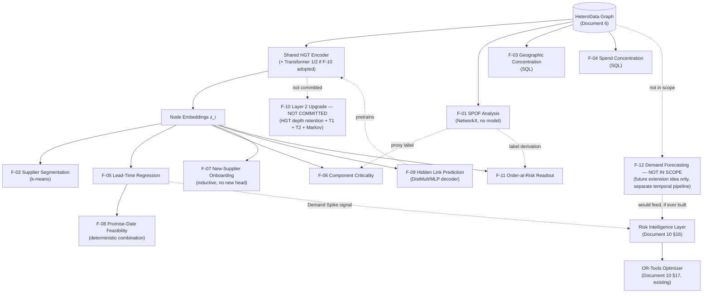

# New Features — One Encoder, Many Readouts

## Graph Neural Network and Generative AI-Based Supply Chain Risk Prediction System

Version: 1.0
Status: Partially merged — Tier 1 items (F-01–F-04, F-07 demo) are now committed Phase 1 baseline: Document 1 (§2.1 items 15–19, §8.22 FR-SPOF/SEG/GEO/SPEND/ONBOARD), Document 3 (§6.22 Analytics screen), Document 4 (§22–23 flows), Document 5 (§6.26–6.29 tables), Document 8 (`analytics/` module), Document 9 (§9.6 endpoints), Document 13 (§6 test cases). Tier 2/3 items (F-05, F-06, F-08, F-09, F-11) are committed Phase 2 baseline (schema in Document 5 §6.30–6.35, planned modules in Document 8, planned endpoints in Document 9 §12.3) but not yet built. F-10 remains **Not committed — Phase 2 (early April 2027) or later; stretch-only before then, and only after RG-01 is solid** (Document 10 §8.6). F-12 remains **Not in scope — documented as a future extension idea only, no committed delivery phase** (Document 5 §6.46 appendix only).
Consistent with: Documents 1–14; `updates/Supplier_Risk_Prediction.md`; `updates/Other_Tools.md`

---

## 1. Purpose and Scope

This document catalogues twelve new capabilities that all consume the **same** heterogeneous graph and the **same** learned encoder that Layer 2 already produces (Document 10, Section 8). It is a build reference, not a design specification: each feature gets one concrete, actionable entry, not a design discussion.

**In scope:** what each feature does, how it's implemented, what it reads and writes, what it costs, and what it's worth. **Out of scope:** re-deriving Layer 2's base architecture (Document 10 covers it; `updates/Supplier_Risk_Prediction.md` covers its proposed upgrade) or re-litigating Phase 1/Phase 2 scope discipline (`updates/Other_Tools.md` Section 10 already did that and this document's phasing, Section 9, stays consistent with it).

This document amends Document 5 (new tables, Section 5), and — on acceptance — should be reflected in Document 1's functional requirements and Document 10's model architecture sections, the same way `updates/Supplier_Risk_Prediction.md` is pending merge there.

## 2. Design Principle — One Encoder, Many Readouts

**These are not nine separate projects bolted onto a risk classifier. They are one shared graph representation with multiple task heads and analytical readouts reading from it.**

This matters for more than tidiness. It changes what the project's research claim actually is. A system that trains a GNN to predict delay/shortage risk and stops there is making a narrow claim: *this model predicts these two labels*. A system where the same encoder also predicts lead time, scores hidden links, segments suppliers, and scores component criticality — with each of those readouts independently checkable against something real (a held-out edge, a k-means silhouette score, a graph traversal) — is making a broader and more defensible claim: ***the learned representation itself captures real supply-chain structure, and the risk labels are only one of several tasks that structure supports.***

That reframing is not just narrative. It has three concrete consequences that organize the rest of this document:

1. **The encoder is the asset, not any one head.** Every feature entry in Section 4 names exactly which encoder output it consumes (Section 8's dependency map makes this literal). A feature that needs a new encoder is an architecture change (Tier 3/F-10); a feature that only needs a new head on existing embeddings is cheap (Tier 2) precisely *because* the expensive part — learning the representation — is already paid for.
2. **Readouts can validate each other.** Supplier segmentation (F-02) is independent evidence the embeddings capture real structure — if clusters don't correspond to anything a domain reviewer recognizes, that is itself a finding about representation quality, not just a failed feature. Component criticality's proxy label (F-06) is checked against single-point-of-failure analysis (F-01)'s independent, non-ML graph-traversal measure. This cross-checking is only possible because everything shares one representation.
3. **The sparse-label problem gets a real mitigation, not just a workaround.** Disruption labels are scarce (Document 10, Section 8.2); *edges* are not — every recorded relationship is a positive label for hidden link prediction (F-09). Pretraining the shared encoder on link prediction before fine-tuning on sparse risk labels (Section 6) is the direct payoff of sharing one encoder across tasks: a task with abundant labels can improve a task that doesn't have them, but only if they share weights.

The organizing tiers in Section 3 reflect effort and risk, in that order — not importance. Some Tier 1 items (F-01–F-04) are genuinely more useful to a business stakeholder than some Tier 2/3 items; they're Tier 1 because they cost almost nothing and touch no model, not because they matter less.

## 3. Feature Catalogue

| ID | Name | Tier | Category |
|---|---|---|---|
| F-01 | Single-Point-of-Failure Analysis | 1 — Analytical readout | Analytical readout |
| F-02 | Supplier Segmentation | 1 — Analytical readout | Analytical readout |
| F-03 | Geographic Concentration Risk | 1 — Analytical readout | Analytical readout |
| F-04 | Spend and Dependency Concentration | 1 — Analytical readout | Analytical readout |
| F-05 | Lead-Time Prediction (Regression) | 2 — Additional head | Task head |
| F-06 | Component Criticality Scoring | 2 — Additional head | Task head |
| F-07 | New-Supplier Onboarding Risk | 2 — Additional head | Task head (no new head — evaluation protocol only) |
| F-08 | Order Promise-Date Feasibility | 2 — Additional head | Task head (deterministic combination, not a learned head) |
| F-09 | Hidden Link Prediction | 3 — Substantial | Task head |
| F-10 | Layer 2 Architecture Upgrade | 3 — Substantial | Architecture change |
| F-11 | Order-at-Risk Readout Head | 3 — Substantial | Task head |
| F-12 | Demand Forecasting (future extension only) | 3 — Substantial | Architecture change |

Tier 1 (F-01–F-04) requires **no training and no model change** — pure graph traversal or SQL over data the system already has. Tier 2 (F-05–F-08) adds heads to the existing encoder without changing it. Tier 3 (F-09–F-12) either changes the encoder itself or trains a new component substantial enough to need its own evaluation protocol.

## 4. Per-Feature Specifications

### F-01 — Single-Point-of-Failure Analysis

| Field | Value |
|---|---|
| Category | Analytical readout — **no model behind this; do not present it as an ML result** |
| What it does | For each supplier, traverses downstream (`SUPPLIES → USED_IN → STOCKED_AT/ORDERED → PLACED_BY`) and counts reachable products, orders, and order value, surfacing findings like "47% of OEM commitments trace through three suppliers." |
| Implementation approach | Build a NetworkX `DiGraph` from the same source the Graph Construction Service assembles `HeteroData` from (Document 6, Section 6); for each Supplier node, run reachability (BFS/DFS) forward along the edge chain above; aggregate reachable `Order.order_value` and count distinct `Customer`s. |
| Inputs | `suppliers`, `components`, `product_components`, `inventory`, `order_items`, `orders`, `customers` (Document 5) — no embeddings, no trained model. |
| Output and where persisted | Per-supplier reachable product/order counts and order-value share, persisted to `spof_analysis` (Section 5.2). |
| Effort | 1–2 days |
| Research value | Low as ML research; **high as business credibility** — a concrete, verifiable, non-model-dependent finding a stakeholder can sanity-check by hand. Also functions as F-06's ground-truth proxy (Section 2, point 2). |
| Dependencies | None — runs off the same structured data CP-01 (graph construction) already ingests. |
| Delivery Phase | Phase 1 (2026-11-15, per `updates/Other_Tools.md` Section 10) — cheap, zero training risk, does not touch the protected architecture ablation. |

### F-02 — Supplier Segmentation

| Field | Value |
|---|---|
| Category | Analytical readout — clustering, unsupervised, no supervised labels involved |
| What it does | K-means clustering over the supplier embeddings the encoder already produces, grouping behaviorally similar suppliers. Doubles as independent validation that the embeddings capture real structure (Section 2, point 2). |
| Implementation approach | Take `risk_embedding` (Document 6, Section 5) for every Supplier node from the latest active model run; standardize; run k-means (scikit-learn) with `k` chosen via silhouette score sweep; profile each cluster's dominant real-world traits (country, component type, capacity band) for a qualitative sanity check. |
| Inputs | Supplier `risk_embedding` vectors (Document 6, Section 9) — no raw features, no re-running inference. |
| Output and where persisted | Per-supplier segment label, persisted to `supplier_segments` (Section 5.3). |
| Effort | 0.5–1 day |
| Research value | Low as a standalone deliverable; **its real value is as a validation instrument** for the encoder itself — if clusters correspond to nothing a domain reviewer recognizes, that's evidence about representation quality worth reporting either way (Section 2). |
| Dependencies | CP-02 (Layer 2) must have run at least once to produce embeddings. |
| Delivery Phase | Phase 1 (2026-11-15) — trivial, read-only against existing embeddings. |

### F-03 — Geographic Concentration Risk

| Field | Value |
|---|---|
| Category | Analytical readout — pure SQL, no model behind this |
| What it does | Aggregates exposure by `suppliers.country` and `factories.location`, identifying regional single points of failure (e.g., "62% of active suppliers are concentrated in two countries"). |
| Implementation approach | `GROUP BY` aggregation over `suppliers.country` and `factories.location`, weighted by number of active suppliers/factories and, optionally, their combined order-value exposure (join through `components`/`order_items`). |
| Inputs | `suppliers`, `factories` (Document 5, Sections 6.2, 6.6) — no graph, no embeddings. |
| Output and where persisted | Per-dimension exposure share, persisted to `geographic_exposure_snapshots` (Section 5.4) so the dashboard can show trend over time, not just a single point-in-time query result. |
| Effort | 0.5 day |
| Research value | Low as ML research; **high as business credibility**, same as F-01 — this is exactly the kind of finding a non-technical stakeholder can verify against a spreadsheet. |
| Dependencies | None. |
| Delivery Phase | Phase 1 (2026-11-15) — trivial SQL. |

### F-04 — Spend and Dependency Concentration

| Field | Value |
|---|---|
| Category | Analytical readout — pure SQL, no model behind this |
| What it does | For each `component_type`, computes how much spend and order volume comes from a single vendor, weighted by `components.unit_cost` and order volume — surfaces sole-source exposure (e.g., "one supplier provides 91% of a component type by spend"). |
| Implementation approach | Join `components` (unit_cost, supplier_id) → `product_components` (quantity_required) → `order_items` (quantity) to compute per-supplier spend within each `component_type`; compute the top vendor's share of that total. |
| Inputs | `components`, `product_components`, `order_items` (Document 5, Sections 6.3, 6.5, 6.10) — no graph, no embeddings. |
| Output and where persisted | Per-component-type top-vendor share, persisted to `spend_concentration_snapshots` (Section 5.5). |
| Effort | 0.5–1 day |
| Research value | Low as ML research; **high as business credibility**, same rationale as F-01/F-03. |
| Dependencies | None. |
| Delivery Phase | Phase 1 (2026-11-15) — trivial SQL. |

### F-05 — Lead-Time Prediction (Regression)

| Field | Value |
|---|---|
| Category | Task head — new regression head on the existing encoder |
| What it does | Predicts *how many days* a shipment will be late, rather than only *whether* it will be late — continuous target instead of the existing binary delay classification. |
| Implementation approach | One additional regression head on Shipment node embeddings (same encoder, same forward pass as the existing delay/shortage/impact heads, Document 10 Section 8.1), trained with MSE/Huber loss against `shipments.delivered_at - shipments.eta` (in days) computed from historical delivered shipments. |
| Inputs | Shipment node embeddings (Document 10, Section 9); label from `shipments.eta`/`delivered_at` (Document 5, Section 6.11). |
| Output and where persisted | Predicted lead-time delta in days per shipment, persisted to `lead_time_predictions` (Section 5.6). |
| Effort | 2–3 days (head + loss + training run + evaluation + persistence) |
| Research value | Genuine, and not just incremental: continuous targets with abundant labels (every delivered shipment has one) are **a partial escape from the class-imbalance problem** affecting the binary disruption labels (Document 10, Section 8.2) — worth stating explicitly as a research point, not only a feature. |
| Dependencies | CP-02 (Layer 2 encoder trained). |
| Delivery Phase | Phase 2 (early April 2027) as a formal deliverable — low technical risk, but new scope not worth adding ahead of the protected ablation (`updates/Other_Tools.md`, Section 10.3); a reasonable Phase 1 stretch only if RG-01 finishes with schedule margin. |

### F-06 — Component Criticality Scoring

| Field | Value |
|---|---|
| Category | Task head — new node-level regression head on the existing encoder |
| What it does | Estimates how much downstream damage a given component's failure would cause. |
| Implementation approach | Node-level regression head over Component embeddings. **The hard part is the label, not the head:** there is no direct historical "this component failed and caused X damage" record. Proxy target: F-01's independently computed, non-ML graph-traversal impact measure (reachable downstream order value) — train the head to predict that traversal-based score, then check whether the learned head generalizes beyond what plain traversal already captures (e.g., by weighting structurally-similar-but-not-identical components similarly). |
| Inputs | Component node embeddings (Document 10, Section 9); proxy label from F-01's `spof_analysis` output, extended to component granularity. |
| Output and where persisted | Per-component criticality score, persisted to `component_criticality_scores` (Section 5.7). |
| Effort | 2–3 days (most of it in designing and validating the proxy label, not the model) |
| Research value | Moderate — a genuinely useful signal, but only as credible as its proxy label; **explicitly not equivalent in evidentiary weight to the delay/shortage heads**, which train against real historical outcomes. Report accordingly (Section 7). |
| Dependencies | CP-02; F-01 (for the proxy label). |
| Delivery Phase | Phase 2 (early April 2027) — the proxy-label design deserves deliberate validation time, not a rush before Nov 15. |

### F-07 — New-Supplier Onboarding Risk

| Field | Value |
|---|---|
| Category | Task head — **no new head required**; this is an evaluation-protocol and product-framing exercise, not new model work |
| What it does | Scores a supplier *before* committing to them, using only their own reported features and whatever initial graph position they have (e.g., which components they'd supply) — before any shipment/order history exists. |
| Implementation approach | Run the existing trained inference path (Document 10, Section 9) on a Supplier node with minimal features (reported `lead_time_days`, `capacity_score`, `country`; `reliability_history` unset/defaulted) and only its prospective `SUPPLIES` edges — no shipment or order history. This works *because* HGT (like GraphSAGE) is inductive: it computes an embedding from local structure and features at inference time rather than looking up a fixed embedding table, so a never-seen node gets a valid forward pass with zero retraining (Hamilton et al., 2017 — the original inductive-GNN argument HGT inherits, Document 10 Section 8.4 Stage 1). |
| Inputs | The prospective supplier's own reported attributes; no historical labels needed at inference time. |
| Output and where persisted | Reuses `risk_scores` exactly as-is (Document 5, Section 6.13, `entity_type='supplier'`) — no new table. The only difference from a normal inference call is the *input conditions*, not the output schema. |
| Effort | 1 day (mostly UI/flow work — a form to enter a prospective supplier's attributes and trigger inference — plus a documented inductive-generalization evaluation slice, Section 7) |
| Research value | Low new engineering, **high demonstrative value** — concretely proves the architecture's inductive capability rather than asserting it, which is a real, citable claim about the chosen architecture family (Hamilton et al., 2017; Hu et al., 2020). |
| Dependencies | CP-02 only. |
| Delivery Phase | Phase 1 (2026-11-15) — demo-only, using the already-trained model, no formal evaluation claim; Phase 2 (early April 2027) — formal inductive-generalization evaluation against a held-out set of artificially sparse-edge suppliers (Section 7). |

### F-08 — Order Promise-Date Feasibility

| Field | Value |
|---|---|
| Category | Task head — **deterministic combination, not itself a learned head** |
| What it does | Answers "can we commit to this order by date X?" by combining F-05's predicted lead time, current inventory, and capacity constraints. |
| Implementation approach | A deterministic combination service, not a new trained model: F-05's predicted lead-time delta + `inventory.stock_level` (Document 5, Section 6.8) + `factories.capacity_units_per_day` / `warehouses.capacity_units` (Document 5, Sections 6.6–6.7) → feasible/infeasible plus the binding constraint. Same feasibility-first design principle already established for the OR-Tools optimizer (Document 1, NFR-20) — surface `feasible: true/false` and the bottleneck, never force an answer when infeasible. |
| Inputs | F-05's predicted lead time; `inventory`, `factories`, `warehouses` capacity fields. |
| Output and where persisted | Feasibility verdict and binding constraint per (order, requested date), persisted to `promise_date_feasibility` (Section 5.9). |
| Effort | 2–3 days |
| Research value | Low as ML research (it's business logic over an ML output, not new ML); **high product value** — this is the feature the prompt calls out as integrating naturally with the chatbot (EF-01, `updates/Other_Tools.md`), a concrete "can we promise this" answer rather than a raw probability. |
| Dependencies | F-05 (needs the lead-time head to exist first). |
| Delivery Phase | Phase 2 (early April 2027) — blocked on F-05. |

### F-09 — Hidden Link Prediction

| Field | Value |
|---|---|
| Category | Task head — new decoder trained on a link-prediction objective; **the centerpiece of this catalogue** |
| What it does | Scores node pairs for whether an edge should exist but is unrecorded — directly attacking tier-2/tier-n supplier invisibility (the "visibility frontier," `updates/Supplier_Risk_Prediction.md` Section 3). |
| Implementation approach | Reuse the existing node embeddings; add a DistMult (Yang et al., 2015) or two-layer MLP scoring function over pairs `(z_i, z_j)` for a candidate edge type (initially Supplier↔Supplier — `SUPPLIES`/`SUB_SUPPLIES`, extensible to other node-type pairs). Train with a standard link-prediction objective: every recorded edge is a positive; negatives are generated by corrupting one endpoint of a positive edge (standard KG-style negative sampling). Held-out edge split (e.g., 80/10/10 train/valid/test) for evaluation. **Caveat worth stating plainly:** a "corrupted" negative might actually be a true-but-unrecorded edge — exactly the phenomenon this feature is trying to detect — so reported AUC/AP is evaluated against *recorded absence*, not *true absence*, and likely understates real-world precision rather than overstating it (Section 7). |
| Inputs | Node embeddings for the relevant type(s); the full existing edge set as positive labels (Document 6, Section 6) — no disruption labels needed at all for this task. |
| Output and where persisted | Scored candidate pairs above a documented threshold, persisted to `link_prediction_scores` (Section 5.10). Distinct from, but complementary to, `updates/Supplier_Risk_Prediction.md`'s `hidden_dependency_links` (Transformer 2's *attention weights*, an implicit signal from the risk-prediction forward pass) — F-09 is an *explicit*, dedicated link-prediction decoder trained on its own objective. The two are independent lines of evidence for the same underlying question and are worth cross-referencing in review, not merging into one table. |
| Effort | 5–8 days (decoder implementation, negative sampling, edge-split design, evaluation, persistence) |
| Research value | **Highest in this catalogue, for three reasons, all worth stating explicitly:** (1) it directly attacks the system's biggest acknowledged limitation — tier-2/tier-n supplier invisibility; (2) it has abundant labels — every existing edge is a positive example — unlike the sparse disruption labels every other head fights against; (3) **it doubles as self-supervised pretraining** — train the encoder on link prediction first, then fine-tune on sparse risk labels (Section 6), which is the primary proposed mitigation for the class-imbalance risk (Document 10, ML-01; `updates/Supplier_Risk_Prediction.md`, ML-09). Directly comparable to published prior work: Kosasih & Brintrup (2021) and Aziz et al. (2021, arXiv:2107.10609), which reported 0.877 test AUC on `buys_from` — a concrete external benchmark this feature's evaluation (Section 7) is designed to be compared against. |
| Dependencies | CP-02 (encoder must exist to produce embeddings, or to be jointly retrained per Section 6's pretraining sequence). |
| Delivery Phase | Phase 2 (early April 2027) for the full pretrain-then-fine-tune pipeline; **a standalone link-prediction AUC experiment (no integration into the main training loop) is a reasonable Phase 1 stretch** given how directly it speaks to the class-imbalance risk every other document in this set flags — see Section 9 for the honest tension between its value and its cost. |

### F-10 — Layer 2 Architecture Upgrade

| Field | Value |
|---|---|
| Category | Architecture change |
| What it does | 4-layer HGT retaining all intermediate outputs; Transformer 1 (per-node depth attention, Jumping Knowledge style — Xu et al., 2018) whose weights empirically test the Markov depth-sufficiency hypothesis; Transformer 2 (type-constrained, same-type-only global attention) discovering correlated hidden dependencies between unconnected suppliers; and a Markov scoping principle separating depth sufficiency (Claim A, tested) from dyadic risk (Claim B — supplier–focal-firm relationship, scored in the Risk Intelligence Layer). |
| Implementation approach | **Fully specified separately** — see `updates/Supplier_Risk_Prediction.md`, Section 6, for the complete component-by-component implementation (including the two required fixes: same-type attention constraint for Transformer 2, and the dual-run training methodology for Transformer 1). Not repeated here to avoid two documents drifting out of sync. |
| Inputs | See `updates/Supplier_Risk_Prediction.md`, Section 6. |
| Output and where persisted | See `updates/Supplier_Risk_Prediction.md`, Section 7 — not repeated here. |
| Effort | Largest single item in this catalogue — multi-week effort (already implicit in `updates/Supplier_Risk_Prediction.md`'s scope); not re-estimated here. |
| Research value | See `updates/Supplier_Risk_Prediction.md`, Sections 6.4 and 10 — the document's own honest pros/cons treatment stands as this catalogue's answer too. |
| Dependencies | CP-02 (this is an upgrade to, not a replacement of, the existing encoder). |
| Delivery Phase | Not committed — Phase 2 (early April 2027) or later; stretch-only before then, and only after RG-01 is solid. Protects the core architecture ablation (RG-01) from schedule risk, per `updates/Other_Tools.md` Section 10.5. |

### F-11 — Order-at-Risk Readout Head

| Field | Value |
|---|---|
| Category | Task head — new readout on the existing forward pass |
| What it does | A second readout on Order/Customer nodes, computed from the same forward pass as the existing delay/shortage/impact heads, identifying which specific customer commitments a given supplier disruption endangers. |
| Implementation approach | One additional linear head over Order node embeddings (same forward pass as CP-02's existing heads, Document 10 Section 8.1) — trained against a derived label: an order is "at risk" if it is reachable (per F-01's traversal logic) from a supplier that was later confirmed disrupted, within the historical window. |
| Inputs | Order node embeddings; a derived at-risk label built from historical disruption + F-01's reachability logic. |
| Output and where persisted | Per-(order, endangering-supplier) exposure score, persisted to `order_risk_exposure` (Section 5.12) — a richer, pair-level record than the existing order-level `risk_scores` row. |
| Effort | 1–2 days (cheap technically — same forward pass, one more head — but the label derivation and a new persistence table are real, not free work) |
| Research value | Moderate — conceptually adjacent to the existing `FR-GNN-04` affected-orders trace (Document 1), but as a *learned* readout rather than a graph-reachability trace; worth comparing the two directly as a mini-validation exercise (does the learned head agree with the deterministic trace, and where does it disagree). |
| Dependencies | CP-02; benefits from F-01's reachability logic for label derivation. |
| Delivery Phase | Phase 2 (early April 2027), per `updates/Other_Tools.md` Section 10.5 (previously catalogued there as NP-02). |

### F-12 — Demand Forecasting (Future Extension Only)

| Field | Value |
|---|---|
| Category | Architecture change — spatio-temporal extension |
| What it does | HGT run per weekly graph snapshot, with a Transformer head attending over time, producing a regression output. **Framing matters more than the model here:** automotive OEMs transmit EDI release schedules, so forecasting *raw OEM demand* is a weak claim — the OEM already tells you the number. The defensible framings are: (a) predicting the *error/bias* between the stated OEM release schedule and actual realized orders; (b) aftermarket/dealer demand, which genuinely has no release schedule; (c) producing the `Demand Spike` signal the Risk Intelligence weighted formula already declares a weight for (Document 10, Section 16 — "0.15 × Demand Spike") but which nothing in the current system actually generates, and which the OR-Tools safety-stock optimizer currently only assumes exists as an input (Document 10, Section 17). |
| Implementation approach | Requires periodic graph snapshots (weekly), not the current system's single current-state graph — **the biggest data-pipeline change of any item in this catalogue**, not just a model change. HGT encodes each snapshot; a temporal Transformer head attends across the resulting sequence of per-entity embeddings; regression output per framing (a)/(b)/(c) above. |
| Inputs | A new periodic graph-snapshot pipeline (not yet built — see `updates/Other_Tools.md`, NP-03); a separate historical-demand data pull, independent of the core industrial dataset. |
| Output and where persisted | Forecast value per entity/period/framing, persisted to `demand_forecasts` (Section 5.13); framing (c)'s output specifically feeds the existing `risk_scores` weighted-formula `Demand Spike` component (Document 10, Section 16) and the OR-Tools optimizer's demand signal input (Document 10, Section 17). |
| Effort | 2–3 weeks (new data pipeline for snapshots, new data-sourcing effort for historical demand, temporal model design and training) |
| Research value | Real, but entirely dependent on choosing framing (a), (b), or (c) over naive raw-demand forecasting — say this plainly in any write-up; framing (c) in particular closes an acknowledged gap (a formula weight and an optimizer input that currently have no generator) rather than adding a new capability from nothing. |
| Dependencies | CP-01 extended to snapshot-per-period graphs; a historical-demand data source separate from the industrial dataset under NDA. |
| Delivery Phase | Future extension only — not committed in the current plan. |

## 5. Data Model Changes

Format follows Document 5, Section 6: Purpose, Columns/Datatype/Constraints, Indexes, Relationships, Delivery Phase.

### 5.1 `model_evaluation_runs` (amendment)

**Purpose:** with up to nine tasks now writing evaluation metrics, the existing table (Document 5, Section 6.23) can no longer distinguish *which task* a given metric row belongs to using only `model_version`/`architecture` — a `task` column is required at minimum, per this document's brief.

| Column | Datatype | Constraints |
|---|---|---|
| task | VARCHAR(50) | NOT NULL, default `'risk_prediction'` — existing ablation rows (delay/shortage/impact, Document 10 §8.4) backfill to this default; new values: `lead_time_regression` (F-05), `component_criticality` (F-06), `inductive_generalization` (F-07, an evaluation slice, not a distinct model), `promise_date_feasibility` (F-08), `link_prediction` (F-09), `supplier_segmentation` (F-02), `order_at_risk` (F-11), `demand_forecasting` (F-12) |

- **Migration:** additive, `NOT NULL` with a default — no backfill risk for existing rows, same pattern as prior amendments (Document 5, Section 7.1).
- **Indexes:** add `task` to the existing composite index — (`model_version`, `task`, `metric_name`) — since task is now the primary way results get filtered.
- **Note:** `run_type` (`unbiased`/`shallow_regularized`) was already added to this table by `updates/Supplier_Risk_Prediction.md`, Section 7.6 — the two columns are independent and both apply where relevant (e.g., a `depth_attention` task row from F-10 also carries a `run_type`).
- **Delivery Phase:** Phase 1 (2026-11-15) — cheap, and needed the moment any second task starts writing metrics.

### 5.2 `spof_analysis` (new) — F-01

**Purpose:** persists single-point-of-failure traversal results per supplier.

| Column | Datatype | Constraints |
|---|---|---|
| id | UUID | PK, default `gen_random_uuid()` |
| supplier_id | UUID | NOT NULL, FK → `suppliers(id)` |
| reachable_product_count | INTEGER | NOT NULL, CHECK (`reachable_product_count >= 0`) |
| reachable_order_count | INTEGER | NOT NULL, CHECK (`reachable_order_count >= 0`) |
| reachable_order_value | NUMERIC(14,2) | NULL |
| pct_of_total_order_value | NUMERIC(5,4) | NULL, CHECK (0 <= pct_of_total_order_value <= 1) |
| computed_at | TIMESTAMPTZ | NOT NULL, default `now()` |

- **Indexes:** index on `supplier_id`; index on `pct_of_total_order_value` DESC (surfacing top single points of failure).
- **Relationships:** child of `suppliers`.
- **Delivery Phase:** Phase 1 (2026-11-15)

### 5.3 `supplier_segments` (new) — F-02

**Purpose:** persists k-means cluster assignments over supplier embeddings.

| Column | Datatype | Constraints |
|---|---|---|
| id | UUID | PK, default `gen_random_uuid()` |
| supplier_id | UUID | NOT NULL, FK → `suppliers(id)` |
| segment_label | SMALLINT | NOT NULL |
| embedding_model_version | VARCHAR(50) | NOT NULL — the `model_version` (Document 5 §6.13) whose `risk_embedding` this clustering was computed from |
| computed_at | TIMESTAMPTZ | NOT NULL, default `now()` |

- **Indexes:** composite index on (`supplier_id`, `embedding_model_version`); index on `segment_label`.
- **Relationships:** child of `suppliers`; loosely joined to `model_registry.model_version`.
- **Delivery Phase:** Phase 1 (2026-11-15)

### 5.4 `geographic_exposure_snapshots` (new) — F-03

**Purpose:** persists geographic concentration aggregates over time, so the dashboard can show trend rather than only a single live query.

| Column | Datatype | Constraints |
|---|---|---|
| id | UUID | PK, default `gen_random_uuid()` |
| dimension | geo_dimension ENUM(`supplier_country`,`factory_location`) | NOT NULL |
| dimension_value | VARCHAR(100) | NOT NULL |
| exposure_share | NUMERIC(5,4) | NOT NULL, CHECK (0 <= exposure_share <= 1) |
| computed_at | TIMESTAMPTZ | NOT NULL, default `now()` |

- **Indexes:** composite index on (`dimension`, `computed_at` DESC).
- **Relationships:** none (aggregate, not entity-linked).
- **Delivery Phase:** Phase 1 (2026-11-15)

### 5.5 `spend_concentration_snapshots` (new) — F-04

**Purpose:** persists per-component-type sole-source exposure over time.

| Column | Datatype | Constraints |
|---|---|---|
| id | UUID | PK, default `gen_random_uuid()` |
| component_type | VARCHAR(100) | NOT NULL |
| top_supplier_id | UUID | NOT NULL, FK → `suppliers(id)` |
| top_supplier_share | NUMERIC(5,4) | NOT NULL, CHECK (0 <= top_supplier_share <= 1) |
| total_spend | NUMERIC(14,2) | NULL |
| computed_at | TIMESTAMPTZ | NOT NULL, default `now()` |

- **Indexes:** index on `component_type`; index on `top_supplier_share` DESC.
- **Relationships:** references `suppliers`.
- **Delivery Phase:** Phase 1 (2026-11-15)

### 5.6 `lead_time_predictions` (new) — F-05

**Purpose:** persists the continuous lead-time regression output per shipment.

| Column | Datatype | Constraints |
|---|---|---|
| id | UUID | PK, default `gen_random_uuid()` |
| shipment_id | UUID | NOT NULL, FK → `shipments(id)` |
| predicted_delay_days | NUMERIC(6,2) | NOT NULL |
| model_version | VARCHAR(50) | NOT NULL |
| predicted_at | TIMESTAMPTZ | NOT NULL, default `now()` |

- **Indexes:** composite index on (`shipment_id`, `predicted_at` DESC); index on `model_version`.
- **Relationships:** child of `shipments`; loosely joined to `model_evaluation_runs.model_version` (task=`lead_time_regression`).
- **Delivery Phase:** Phase 2 (early April 2027)

### 5.7 `component_criticality_scores` (new) — F-06

**Purpose:** persists the component-level criticality regression output and its proxy-label lineage.

| Column | Datatype | Constraints |
|---|---|---|
| id | UUID | PK, default `gen_random_uuid()` |
| component_id | UUID | NOT NULL, FK → `components(id)` |
| criticality_score | NUMERIC(5,4) | NOT NULL, CHECK (0 <= criticality_score <= 1) |
| proxy_label_source | VARCHAR(50) | NOT NULL, default `'spof_traversal'` — records that F-01's traversal measure was the training target, not a real historical outcome |
| model_version | VARCHAR(50) | NOT NULL |
| scored_at | TIMESTAMPTZ | NOT NULL, default `now()` |

- **Indexes:** composite index on (`component_id`, `scored_at` DESC).
- **Relationships:** child of `components`.
- **Delivery Phase:** Phase 2 (early April 2027)

### 5.8 F-07 — no schema change

No new table. F-07 reuses `risk_scores` (Document 5, Section 6.13, `entity_type='supplier'`) exactly as-is — the only difference from a standard inference call is the sparsity of the input node's edges/history, not the output shape.

### 5.9 `promise_date_feasibility` (new) — F-08

**Purpose:** persists the deterministic order-feasibility verdict combining F-05's output with inventory/capacity constraints.

| Column | Datatype | Constraints |
|---|---|---|
| id | UUID | PK, default `gen_random_uuid()` |
| order_id | UUID | NOT NULL, FK → `orders(id)` |
| requested_date | DATE | NOT NULL |
| feasible | BOOLEAN | NOT NULL |
| predicted_ship_date | DATE | NULL |
| binding_constraint | VARCHAR(50) | NULL — e.g. `inventory`, `factory_capacity`, `warehouse_capacity`, `lead_time`; NULL when `feasible=true` with margin |
| computed_at | TIMESTAMPTZ | NOT NULL, default `now()` |

- **Indexes:** composite index on (`order_id`, `computed_at` DESC).
- **Relationships:** child of `orders`.
- **Delivery Phase:** Phase 2 (early April 2027)

### 5.10 `link_prediction_scores` (new) — F-09

**Purpose:** persists scored candidate node pairs from the dedicated link-prediction decoder — distinct from, and complementary to, `hidden_dependency_links` (`updates/Supplier_Risk_Prediction.md` §7.4, Transformer 2's attention weights).

| Column | Datatype | Constraints |
|---|---|---|
| id | UUID | PK, default `gen_random_uuid()` |
| node_a_type | entity_type ENUM | NOT NULL — reuses Document 5 §6.13's enum |
| node_a_id | UUID | NOT NULL |
| node_b_type | entity_type ENUM | NOT NULL |
| node_b_id | UUID | NOT NULL |
| predicted_edge_type | VARCHAR(50) | NOT NULL — e.g. `SUB_SUPPLIES` |
| predicted_probability | NUMERIC(6,5) | NOT NULL, CHECK (0 <= predicted_probability <= 1) |
| decoder | VARCHAR(20) | NOT NULL, CHECK (`decoder IN ('distmult','mlp')`) |
| model_version | VARCHAR(50) | NOT NULL |
| scored_at | TIMESTAMPTZ | NOT NULL, default `now()` |

- **Indexes:** composite index on (`node_a_type`, `node_a_id`, `node_b_type`, `node_b_id`, `model_version`); index on `predicted_probability` DESC (top-candidate surfacing).
- **Relationships:** polymorphic reference, same pattern as `risk_scores` (Document 5 §6.13).
- **Delivery Phase:** Phase 2 (early April 2027) for full persistence at scale; a Phase 1 stretch experiment (Section 4, F-09) can log results here without full production integration.

### 5.11 F-10 — see `updates/Supplier_Risk_Prediction.md`, Section 7

Fully specified there (`suppliers.tier`/`is_frontier`, `supplier_relationships`, `node_depth_attention`, `hidden_dependency_links`, `supplier_dyadic_risk`, `model_evaluation_runs.run_type`) — not repeated here.

### 5.12 `order_risk_exposure` (new) — F-11

**Purpose:** persists the (order, endangering-supplier) pair-level exposure score from the order-at-risk readout head — richer than the existing order-level `risk_scores` row.

| Column | Datatype | Constraints |
|---|---|---|
| id | UUID | PK, default `gen_random_uuid()` |
| order_id | UUID | NOT NULL, FK → `orders(id)` |
| endangering_supplier_id | UUID | NOT NULL, FK → `suppliers(id)` |
| exposure_score | NUMERIC(5,4) | NOT NULL, CHECK (0 <= exposure_score <= 1) |
| model_version | VARCHAR(50) | NOT NULL |
| scored_at | TIMESTAMPTZ | NOT NULL, default `now()` |

- **Indexes:** composite index on (`order_id`, `scored_at` DESC); index on `endangering_supplier_id`.
- **Relationships:** links `orders` and `suppliers`.
- **Delivery Phase:** Phase 2 (early April 2027)

### 5.13 `demand_forecasts` (new) — F-12

**Status: speculative / future-reference only.** F-12 is not committed to any delivery phase (Section 4) — this schema is recorded here for design continuity if demand forecasting is ever picked up, not as a planned migration. It should not be created by any Phase 1 or Phase 2 migration set (Document 5, Section 7) until F-12 itself is committed.

**Purpose:** persists forecast output per entity/period/framing; framing `demand_spike_signal` feeds the existing weighted-formula and optimizer inputs (Document 10, Sections 16–17).

| Column | Datatype | Constraints |
|---|---|---|
| id | UUID | PK, default `gen_random_uuid()` |
| entity_type | forecast_entity_type ENUM(`product`,`component`) | NOT NULL |
| entity_id | UUID | NOT NULL |
| forecast_period | DATE | NOT NULL — the period (e.g., week-start date) the forecast covers |
| framing | VARCHAR(30) | NOT NULL, CHECK (`framing IN ('oem_release_bias','aftermarket_demand','demand_spike_signal')`) |
| predicted_value | NUMERIC(14,2) | NOT NULL |
| actual_value | NUMERIC(14,2) | NULL — populated once the period closes, for evaluation (Section 7) |
| model_version | VARCHAR(50) | NOT NULL |
| forecasted_at | TIMESTAMPTZ | NOT NULL, default `now()` |

- **Indexes:** composite index on (`entity_type`, `entity_id`, `forecast_period`); index on `framing`.
- **Relationships:** polymorphic reference (`entity_type`, `entity_id`), same convention as `risk_scores`.
- **Non-blocking note:** this uses a dedicated `forecast_entity_type` enum rather than the existing baseline `entity_type` coverage model, so it does not impose any new `entity_type='customer'` coverage requirement on the current plan.
- **Open dependency:** requires a periodic graph-snapshot mechanism not yet designed anywhere in the documentation set (Section 4, F-12) — this table can be created ahead of that pipeline, but stays empty until it exists.
- **Delivery Phase:** Not in scope — documented as a future extension idea only, no committed delivery phase.

## 6. Training Strategy

**The shared trunk is the HGT encoder (plus Transformer 1/2, if F-10 is adopted).** Everything else attaches to it as a head, a decoder, or a downstream deterministic computation. Three training-strategy decisions follow directly from that:

### 6.1 Link prediction as pretraining, not just another head

Train F-09's link-prediction decoder **first**, directly on the shared encoder, using the full existing edge set — no disruption labels needed at all for this stage. Then **fine-tune** the same encoder on the sparse supervised risk-prediction task (delay/shortage/impact, the existing ablation heads), initializing from the link-prediction-pretrained weights rather than random initialization. This sequencing — pretrain on the abundant-label task, fine-tune on the scarce-label task — is the primary proposed mitigation for the class-imbalance risk (Section 4, F-09; Document 10 ML-01; `updates/Supplier_Risk_Prediction.md` ML-09), not merely a nice-to-have ordering.

### 6.2 Which heads train jointly, which train separately

| Group | Heads | Training mode | Why |
|---|---|---|---|
| Core supervised risk heads | Delay classification, shortage classification, impact regression (existing, Document 10 §8.1) | Joint (already share weights) | Same label source, same forward pass, established design. |
| Compatible new supervised heads | Lead-time regression (F-05), component criticality (F-06), order-at-risk (F-11) | Joint with the core heads, once pretraining (6.1) is done | Same category of risk-relevant, node/edge-level supervised signal; sharing the trunk here is low-risk because all four heads pull the representation in a similar direction. |
| Link prediction | F-09 | **Separate, staged** — pretraining only, not joint with the supervised heads | Different objective (structural regularity vs. sparse outcome prediction) and vastly more label volume; joint training risks its abundant gradient signal drowning out the scarce disruption-label signal (Section 10, ML-16). |
| Unsupervised / non-gradient | Supplier segmentation (F-02) | Not trained at all — runs on frozen embeddings after the encoder is trained | Clustering, not a task head. |
| No-model | SPOF, geographic, spend concentration (F-01, F-03, F-04) | Not trained at all | Analytical readouts (Section 2). |
| Deterministic combination | Promise-date feasibility (F-08) | Not trained at all | Combines F-05's output with business data; no gradients of its own. |
| Its own methodology | Depth attention (Transformer 1, F-10) | Governed by the dual-run methodology already specified in `updates/Supplier_Risk_Prediction.md` §6.2 | Not a "head" in the joint-training sense — has its own unbiased/shallow-regularized split. |
| Not applicable — out of scope | Demand forecasting (F-12) | **N/A — not committed to any phase (Section 4); no training strategy applies until it is.** | Noted only for completeness: if ever picked up, it would need an entirely separate model/pipeline (different input shape — temporal snapshot sequence vs. single-snapshot graph — doesn't share the trunk's forward pass at all). |

### 6.3 Avoiding one task's gradients degrading another's

- **Sequence, don't just co-train.** Section 6.1's pretrain-then-fine-tune order is itself the primary mitigation — by the time the scarce-label supervised heads start training, the encoder already has a reasonable representation, so their gradients are refining it, not defining it from scratch.
- **Keep the jointly-trained head set small and homogeneous.** Only the four risk-relevant supervised heads (6.2, second row) train jointly — link prediction, clustering, and no-model readouts are deliberately excluded from the joint loss, not because they're less important, but because mixing objectives of very different character (abundant structural labels vs. scarce outcome labels vs. no labels at all) is exactly the interference risk this document has to name honestly (Section 10, ML-16).
- **Gradual unfreezing.** During the early fine-tuning epochs (6.1), consider freezing the encoder trunk and training only the new heads' final layers, then progressively unfreezing earlier encoder layers — this prevents the (much sparser) supervised gradient from immediately overwriting the pretrained structural representation before the new heads have anything sensible to say.
- **Per-head validation monitoring, not just a combined loss.** Track each jointly-trained head's own validation metric (Section 7) throughout joint training, not only the combined loss — a regression in any one head should be visible immediately, the same discipline `updates/Supplier_Risk_Prediction.md` already applies to depth-weight cross-validation stability.
- **A heavier-weight option, if interference proves real in practice:** gradient-surgery techniques such as PCGrad (Yu et al., 2020) or uncertainty-based task weighting (Kendall et al., 2018) — noted here as an available escalation, not a default; for a final-year project's timeline, sequencing plus a small joint-head set is the pragmatic first line of defense, not a from-scratch multi-task-learning research exercise.

## 7. Evaluation Plan

| Task | Metric(s) | Baseline / comparison | Persisted as (`model_evaluation_runs.task`, or table) |
|---|---|---|---|
| Delay/shortage classification, impact scoring (existing) | Precision, Recall, F1, ROC-AUC | Existing GraphSAGE→GAT→HGT ablation (Document 10 §8.4) | `risk_prediction` (unchanged) |
| Lead-time regression (F-05) | MAE, RMSE, MAPE | None internal yet — first run of this task establishes its own baseline | `lead_time_regression` |
| Component criticality (F-06) | Spearman rank correlation between predicted criticality and F-01's independent, non-ML traversal-based impact measure | F-01's traversal score, used explicitly as the sanity baseline (Section 2) | `component_criticality` |
| New-supplier onboarding (F-07) | Same classification metrics as the core heads, evaluated on a held-out slice of suppliers with artificially sparse edges (simulating "new supplier" conditions) | The core heads' standard test-set performance — the gap between the two is the actual inductive-generalization finding | `inductive_generalization` (a distinct evaluation *slice*, not a distinct model) |
| Promise-date feasibility (F-08) | Precision/Recall on the binary feasible/infeasible call against actual on-time fulfillment | None — deterministic combination, evaluated on outcome accuracy, not model quality | `promise_date_feasibility` |
| Hidden link prediction (F-09) | AUC-ROC, Average Precision (AP), on held-out edges | Kosasih & Brintrup (2021); Aziz et al. (2021, arXiv:2107.10609) — 0.877 test AUC on `buys_from` | `link_prediction` |
| Supplier segmentation (F-02) | Silhouette score, Davies-Bouldin index; qualitative cluster-profile review | None quantitative — clustering has no ground truth | `supplier_segmentation` |
| Order-at-risk readout (F-11) | Precision/Recall against historically-known "this order slipped because of this supplier" cases where available; otherwise qualitative reviewer check | Comparison against the deterministic `FR-GNN-04` affected-orders trace (Document 1) | `order_at_risk` |
| Demand forecasting (F-12) | Framing-dependent: (a) MAE/RMSE on the OEM release-bias term; (b) MAE/RMSE/MAPE on aftermarket demand; (c) Precision/Recall on spike detection | None internal yet | `demand_forecasting` (framing distinguished via `metric_name`, e.g. `demand_spike_precision`) |
| SPOF, geographic, spend concentration (F-01, F-03, F-04) | **None — no ML metric applies.** Evaluation is a manual domain-plausibility spot-check by a reviewer, the same qualitative-review pattern already used for GNNExplainer subgraph fidelity (Document 10 §10). | N/A | Not persisted to `model_evaluation_runs` at all — these are not model outputs (Section 10, ML-19). |

**What gets persisted per run, beyond the metric rows themselves:** every training/evaluation run that does produce a `model_evaluation_runs` row also writes a `model_registry` row (Document 10 §8.5) tagged with the `task` it corresponds to, so parameter count and training configuration remain comparable across tasks the same way they already are across ablation stages (Document 10 §8.4).

## 8. Feature Dependency Map

## 9. Effort and Phasing Table

Consistent with `updates/Other_Tools.md` Section 10's rebalancing (protect RG-01, keep the 2026-11-15 delivery lean).

| ID | Name | Effort | Delivery Phase |
|---|---|---|---|
| F-01 | Single-Point-of-Failure Analysis | 1–2 days | Phase 1 (2026-11-15) |
| F-02 | Supplier Segmentation | 0.5–1 day | Phase 1 (2026-11-15) |
| F-03 | Geographic Concentration Risk | 0.5 day | Phase 1 (2026-11-15) |
| F-04 | Spend and Dependency Concentration | 0.5–1 day | Phase 1 (2026-11-15) |
| F-07 | New-Supplier Onboarding (demo only) | 1 day | Phase 1 (2026-11-15), demo only |
| F-05 | Lead-Time Prediction | 2–3 days | Phase 2 (early April 2027); Phase 1 stretch only |
| F-06 | Component Criticality Scoring | 2–3 days | Phase 2 (early April 2027) |
| F-07 | New-Supplier Onboarding (formal eval) | (included above) | Phase 2 (early April 2027), formal evaluation |
| F-08 | Order Promise-Date Feasibility | 2–3 days | Phase 2 (early April 2027) |
| F-09 | Hidden Link Prediction (standalone experiment) | 5–8 days | Phase 1 stretch, if schedule margin exists — see Section 10 tension |
| F-09 | Hidden Link Prediction (full pretrain-finetune pipeline) | (included above, + integration) | Phase 2 (early April 2027) |
| F-11 | Order-at-Risk Readout Head | 1–2 days | Phase 2 (early April 2027) |
| F-10 | Layer 2 Architecture Upgrade | Multi-week (see `updates/Supplier_Risk_Prediction.md`) | Not committed — Phase 2 (early April 2027) or later; stretch-only before then, and only after RG-01 is solid |
| F-12 | Demand Forecasting | 2–3 weeks | Future extension only (uncommitted) |

**Total Tier 1 effort (F-01, F-02, F-03, F-04, F-07 demo): under a week combined** — this is why Tier 1 is realistic to keep in the Nov 15 delivery even under the compressed timeline `updates/Other_Tools.md` Section 10 describes, without touching the protected architecture ablation at all.

## 10. Risks

| ID | Risk | Mitigation | Delivery Phase |
|---|---|---|---|
| ML-15 | Breadth without depth — twelve features risk reading as an unfocused grab-bag rather than a coherent research contribution | The shared-encoder framing (Section 2) is the explicit spine; every feature entry (Section 4) states which encoder output it reuses, so coherence is demonstrated per-entry, not asserted once at the top | Both |
| ML-16 | Multi-task interference — jointly-trained heads' gradients could degrade the shared encoder's core risk-prediction quality, the one output that must not regress | Staged link-prediction pretraining then fine-tuning (Section 6.1) rather than naive joint training from scratch; deliberately small, homogeneous jointly-trained head set (Section 6.2); per-head validation monitoring during joint phases (Section 6.3) | Phase 2 |
| ML-17 | Evaluation burden — every task needs its own metrics, held-out splits, and baseline, multiplying the QA surface well beyond the original single-model ablation | Section 7's per-task metric table is fixed in advance, not improvised per feature as it ships; `model_evaluation_runs.task` (Section 5.1) keeps every task's results queryable and comparable rather than scattered across ad hoc scripts | Phase 1/2 |
| ML-18 | Sparse disruption labels remain the fundamental data constraint underlying F-05, F-06, F-10, and the original ablation | F-09's link-prediction pretraining (abundant labels — every recorded edge) is the primary proposed mitigation, giving the encoder a well-shaped representation before it ever sees a scarce disruption label (Section 6.1) | Phase 2 (full pipeline); Phase 1 (standalone experiment) |
| ML-19 | Analytical readouts (F-01–F-04) produce real findings with **no model behind them** and could be miscommunicated as ML results in a demo or report, undermining the project's credibility on exactly the evidence-based claim it's trying to establish | Section 4 tags F-01–F-04's Category as "analytical readout," explicitly not "task head"; any dashboard/report copy must say "graph/SQL analysis found," never "the model found" | Phase 1 |
| ML-20 | Component criticality (F-06) has no direct historical ground-truth label — the head trains against a proxy target (F-01's traversal score), and a poorly-chosen proxy could look plausible while being wrong | Cross-validated against F-01's independent, non-ML measure as an explicit sanity baseline (Section 7); reported as a moderate-confidence, exploratory result, never presented with the same evidentiary weight as the delay/shortage heads, which train against real historical outcomes | Phase 2 |
| ML-21 | Demand forecasting (F-12), if framed as predicting raw OEM demand, is a weak result by construction — automotive OEMs already transmit EDI release schedules, so replicating that number proves little | Reframed to (a) OEM release-bias, (b) aftermarket/dealer demand, or (c) the `Demand Spike` signal the existing weighted formula and optimizer already assume exists (Document 10 §16–17); raw-demand replication is explicitly not attempted (Section 4, F-12) | Not in scope — documented as a future extension idea only, no committed delivery phase |

## 11. Document Control

- **Purpose and Scope:** Section 1. **Design Principle:** Section 2. **Feature Catalogue:** Section 3. **Per-Feature Specifications:** Section 4. **Data Model Changes:** Section 5. **Training Strategy:** Section 6. **Evaluation Plan:** Section 7. **Feature Dependency Map:** Section 8. **Effort and Phasing:** Section 9. **Risks:** Section 10.
- **Citations:** HGT — Hu et al., 2020; Jumping Knowledge — Xu et al., 2018; GraphSAGE — Hamilton et al., 2017; GAT — Veličković et al., 2018; DistMult — Yang et al., 2015; supply-chain link prediction — Kosasih & Brintrup, 2021, and Aziz et al., 2021 (arXiv:2107.10609); multi-task gradient interference — PCGrad, Yu et al., 2020; task-weighting, Kendall et al., 2018.
- This document is consistent with, and should be read alongside, `updates/Supplier_Risk_Prediction.md` (F-10's full specification) and `updates/Other_Tools.md` (the delivery-phasing rationale this document's Section 9 follows). On acceptance, its schema changes (Section 5) should be merged into Document 5, and its feature list into Document 1's functional requirements and Document 10's model architecture sections.
