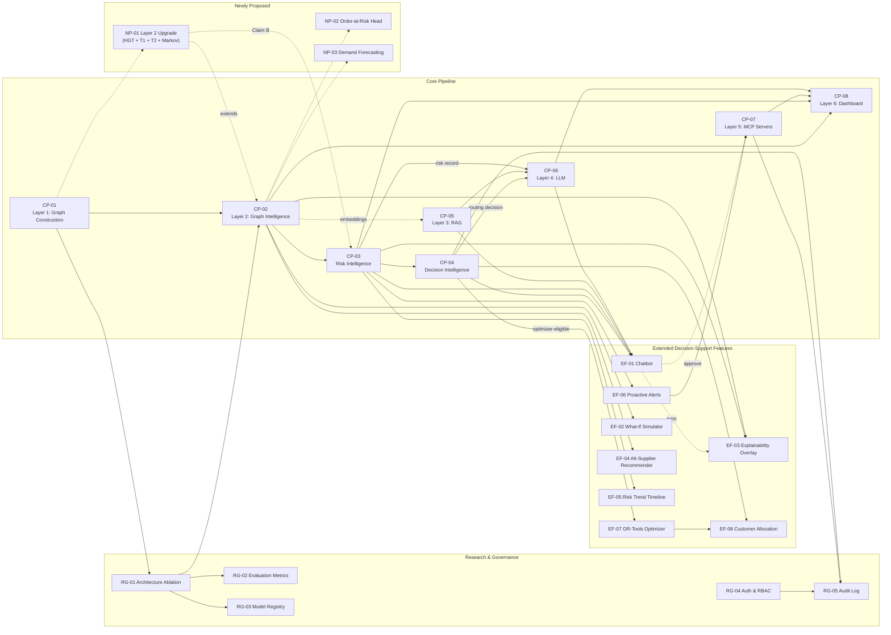

# Feature Inventory — Consolidated Catalogue

## Graph Neural Network and Generative AI-Based Supply Chain Risk Prediction System

Version: 1.0
Status: Reference Catalogue — Section 10.5's recommended rebalancing has now been adopted as the ratified baseline in Document 1 (§2.1–§2.3a) and Document 14 (§2, §5–§12, canonical date 2026-11-15); this catalogue remains non-normative (Section 1) but its rebalancing proposal is no longer merely proposed — see Section 1 for how this relates to the baseline.
Consistent with: Documents 1–14; `updates/Supplier_Risk_Prediction.md` (proposed Layer 2 amendment)

---

## 1. Purpose and Scope

This document is a **catalogue, not a design specification**: one consolidated inventory of every capability ChainPilot builds, has proposed, or has evaluated and set aside — with a status tag, a delivery phase, and a pointer back to whichever existing document actually specifies it. It exists because the requirements are currently spread across fourteen documents plus one standalone amendment, and there was no single place to see everything the system does at a glance, or to tell at a glance what's already committed versus what's still an idea.

**It does not replace any existing document.** Document 1 (PRD) remains the authoritative source for functional/non-functional requirements; Document 10 remains authoritative for ML design; `updates/Supplier_Risk_Prediction.md` remains the authoritative proposal for the Layer 2 upgrade. This catalogue only indexes and cross-references them, and adds one thing none of them currently states in one place: an honest, dated assessment of what the current compressed delivery timeline (Section 10) can actually support.

**Relationship to the baseline documentation set:**

- Sections 3–5 (Core Pipeline, Extended Decision-Support, Research & Governance) catalogue what is **already baselined** in Document 1 and downstream documents.
- Section 6 (Newly Proposed) catalogues what `updates/Supplier_Risk_Prediction.md` proposes, which is **not yet** in Document 1/10's baseline.
- Section 7 (Candidate Additions) catalogues ideas that were evaluated and **not committed** to any phase.
- Section 10 is the one place in the documentation set that directly confronts the current compressed timeline against the full feature list and says, plainly, what fits and what doesn't.

## 2. How to Read This Document

**Feature ID convention:** `<PREFIX>-##`, where the prefix identifies the catalogue section a feature belongs to:

| Prefix | Section | Meaning                                                                                  |
| ------ | ------- | ---------------------------------------------------------------------------------------- |
| `CP` | 3       | Core pipeline — one of the six architecture layers or two intelligence stages           |
| `EF` | 4       | Extended decision-support feature (the eight features layered on the core pipeline)      |
| `RG` | 5       | Research and governance capability (ablation, evaluation, registry, auth, audit)         |
| `NP` | 6       | Newly proposed — specified in`updates/Supplier_Risk_Prediction.md`, not yet baselined |
| `CA` | 7       | Candidate addition — evaluated, not committed to any phase                              |

**Status tags:**

- **Baselined** — present in Document 1's Functional Requirements and implemented/specified by at least one downstream document (5–13).
- **Proposed** — specified in a standalone document (`updates/`) awaiting review and merge into the baseline; not yet reflected in Document 1's FR list.
- **Candidate** — discussed and evaluated, but deliberately not committed to Phase 1 or Phase 2; listed so it isn't silently forgotten or silently smuggled in later.

**Delivery Phase tags:** this catalogue uses two parallel phase labels, because the plan itself has two layers right now:

- **As-baselined phase** — the `Phase 1` / `Phase 2` label the feature carries in Document 1 today.
- **Current plan** — the compressed single-phase delivery target (**2026-11-15**) that now absorbs nearly all of original Phase 1 and Phase 2. Demand forecasting is no longer treated as a committed Phase 2 delivery; it remains an uncommitted future extension. See Section 9.

Where the two disagree, both are shown; Section 10 explains why, and proposes a rebalancing.

## 3. Core Pipeline Features

### CP-01 — Layer 1: Graph Construction

| Field          | Value                                                                                                                                                                                                                                 |
| -------------- | ------------------------------------------------------------------------------------------------------------------------------------------------------------------------------------------------------------------------------------- |
| What it does   | Ingests, cleans, deduplicates, and normalizes structured supplier/shipment/order/inventory records, plus a lightweight LLM-based extraction step for occasional invoice/PO PDFs, and assembles the result into a heterogeneous graph. |
| Draws on       | PostgreSQL structured tables (Document 5); no upstream layer — this is the pipeline's entry point.                                                                                                                                   |
| Delivery Phase | Phase 1 (as-baselined and current plan)                                                                                                                                                                                               |
| Status         | Baselined                                                                                                                                                                                                                             |
| Dependencies   | PostgreSQL schema (Document 5); none downstream depend on anything but this.                                                                                                                                                          |
| Specified in   | Document 1 §8.2 (FR-GC-01–08), §2.1 items 2–4; Document 4 §6; Document 6 §5–6; Document 10 §5–7                                                                                                                              |
| Notes/risks    | The single-extraction-call design (FR-GC-05) is explicitly not a scaling solution — Document 1 §12 assumes unstructured volume stays small throughout.                                                                              |

### CP-02 — Layer 2: Graph Intelligence

| Field          | Value                                                                                                                                                                                                                                 |
| -------------- | ------------------------------------------------------------------------------------------------------------------------------------------------------------------------------------------------------------------------------------- |
| What it does   | GNN × Transformer hybrid trained via a GraphSAGE → GAT → HGT ablation, predicting delay probability, shortage risk, and disruption impact; produces explanation subgraphs and entity embeddings.                                   |
| Draws on       | The`HeteroData` graph (CP-01).                                                                                                                                                                                                      |
| Delivery Phase | Phase 1 (as-baselined and current plan)                                                                                                                                                                                               |
| Status         | Baselined                                                                                                                                                                                                                             |
| Dependencies   | CP-01.                                                                                                                                                                                                                                |
| Specified in   | Document 1 §8.3 (FR-GNN-01–08), §8.13 (FR-ABL-01/02); Document 10 §6–12; Document 4 §7                                                                                                                                          |
| Notes/risks    | The**protected** core research contribution of the project (Section 10) — this is what makes the artifact a research project rather than a labeled dashboard. See RG-01 for the ablation itself as a distinct governance item. |

### CP-03 — Risk Intelligence Layer

| Field          | Value                                                                                                                                                                                                                                                             |
| -------------- | ----------------------------------------------------------------------------------------------------------------------------------------------------------------------------------------------------------------------------------------------------------------- |
| What it does   | Turns raw GNN output into business-ready intelligence: confidence estimation, feature-attribution packaging, business aggregation (`gnn_native` or transparent `weighted_formula`), threshold evaluation, and risk categorization (low/medium/high/critical). |
| Draws on       | CP-02's raw prediction, confidence signal, and explanation subgraph.                                                                                                                                                                                              |
| Delivery Phase | Phase 1 (as-baselined and current plan)                                                                                                                                                                                                                           |
| Status         | Baselined                                                                                                                                                                                                                                                         |
| Dependencies   | CP-02.                                                                                                                                                                                                                                                            |
| Specified in   | Document 1 §8.14 (FR-RISK-01/02), §8.18 (FR-RISKINT-01–03), §8.20 (FR-CONF-01); Document 10 §16, §18; Document 5 §6.13                                                                                                                                     |
| Notes/risks    | Entirely deterministic and learned-parameter-free by design (Document 10 §18) — this is what makes it fully auditable, and it's why it's cheap enough to protect even under schedule pressure.                                                                  |

### CP-04 — Decision Intelligence Layer

| Field          | Value                                                                                                                                                                                                                                                   |
| -------------- | ------------------------------------------------------------------------------------------------------------------------------------------------------------------------------------------------------------------------------------------------------- |
| What it does   | Validates candidate recommendations against business rules/policy, routes flagged entities to the OR-Tools optimizer or the LLM depending on whether a closed-form decision type applies, and records a decision trace naming every contributing layer. |
| Draws on       | CP-03's risk record; feeds EF-07 (Optimizer) or CP-06 (LLM).                                                                                                                                                                                            |
| Delivery Phase | Phase 1 — foundation/schema only (as-baselined and current plan); Phase 2 — full routing (as-baselined)                                                                                                                                               |
| Status         | Baselined                                                                                                                                                                                                                                               |
| Dependencies   | CP-03.                                                                                                                                                                                                                                                  |
| Specified in   | Document 1 §8.19 (FR-DEC-01–03); Document 10 §19; Document 4 §21; Document 5 §6.17 (`decision_trace`)                                                                                                                                            |
| Notes/risks    | Full routing (Phase 2 as-baselined) has real schedule dependencies on both EF-07 (optimizer) and CP-06 (LLM) being functional first — see Section 10.                                                                                                  |

### CP-05 — Layer 3: RAG (Retrieval-Augmented Generation)

| Field          | Value                                                                                                                                                                                                            |
| -------------- | ---------------------------------------------------------------------------------------------------------------------------------------------------------------------------------------------------------------- |
| What it does   | Embeds and indexes historical incident reports, contract clauses, and supplier history in a vector store; retrieves top-k relevant evidence for a prediction or user query via hybrid (keyword + vector) search. |
| Draws on       | No graph/GNN output directly — a parallel evidence store; consumed by CP-06 (LLM) and EF-01 (Chatbot).                                                                                                          |
| Delivery Phase | Phase 2 (as-baselined); current plan folds this into the compressed single phase (Section 9)                                                                                                                     |
| Status         | Baselined                                                                                                                                                                                                        |
| Dependencies   | A curated evidence corpus (incident reports, contracts, supplier history) — not derived from the graph, must be separately sourced.                                                                             |
| Specified in   | Document 1 §8.4 (FR-RAG-01–04); Document 4 §8; Document 7                                                                                                                                                     |
| Notes/risks    | Entirely new infrastructure (vector DB, embedding pipeline, chunking) — none of it reuses Phase 1 work, unlike most other extended features.                                                                    |

### CP-06 — Layer 4: LLM Explanation

| Field          | Value                                                                                                                                                                                                                    |
| -------------- | ------------------------------------------------------------------------------------------------------------------------------------------------------------------------------------------------------------------------ |
| What it does   | Combines a risk score, explanation subgraph, and retrieved evidence into a plain-language explanation; proposes a qualitative action wherever Decision Intelligence (CP-04) finds no optimizer path; cites its evidence. |
| Draws on       | CP-03 (risk record), CP-02 (explanation subgraph), CP-05 (evidence), CP-04 (routing decision).                                                                                                                           |
| Delivery Phase | Phase 2 (as-baselined); current plan folds this into the compressed single phase (Section 9)                                                                                                                             |
| Status         | Baselined                                                                                                                                                                                                                |
| Dependencies   | CP-05 (evidence must exist to ground the explanation — NFR-13); CP-04 (must know whether an optimizer path exists before proposing an action).                                                                          |
| Specified in   | Document 1 §8.5 (FR-LLM-01–04); Document 4 §8–9; Document 12 §9                                                                                                                                                     |
| Notes/risks    | Never computes a numeric decision for optimizer-eligible cases (FR-OPT-03) — this boundary is load-bearing for trust in the whole Decision Intelligence design, not a style preference.                                 |

### CP-07 — Layer 5: MCP Servers

| Field          | Value                                                                                                                                                                                                                                                                                           |
| -------------- | ----------------------------------------------------------------------------------------------------------------------------------------------------------------------------------------------------------------------------------------------------------------------------------------------- |
| What it does   | Executes human-approved actions against connected ERP/procurement systems via Model Context Protocol servers, carries proactive alert notifications (Slack/email), and logs every execution outcome.                                                                                            |
| Draws on       | CP-04's routed, approved decision (via the approval workflow).                                                                                                                                                                                                                                  |
| Delivery Phase | Phase 2 (as-baselined); current plan folds this into the compressed single phase (Section 9)                                                                                                                                                                                                    |
| Status         | Baselined                                                                                                                                                                                                                                                                                       |
| Dependencies   | An ERP/procurement sandbox or mock (Document 1 §12 assumption); Slack/email API access; a functioning approval workflow.                                                                                                                                                                       |
| Specified in   | Document 1 §8.11 (FR-MCP-01–06); Document 4 §12–14; Document 12 §11; Document 5 §6.16–18, 6.21                                                                                                                                                                                           |
| Notes/risks    | **Live production ERP write access is out of reach for a student team on any realistic timeline** — Document 1 already scopes this to a sandbox/mock (§12 assumption, risk R-05); this catalogue reaffirms that scoping under the compressed plan rather than relaxing it (Section 10). |

### CP-08 — Layer 6: Frontend Dashboard

| Field          | Value                                                                                                                                                                                                      |
| -------------- | ---------------------------------------------------------------------------------------------------------------------------------------------------------------------------------------------------------- |
| What it does   | Risk-colored graph view, sortable risk table, entity screens, model metadata/confidence panels, decision-trace view, chatbot panel, what-if controls, trend timeline, and approval controls.               |
| Draws on       | CP-02 through CP-07 and every extended feature (EF-01–08) — the dashboard is the presentation layer for the entire system.                                                                               |
| Delivery Phase | Phase 1 — shell + graph view (as-baselined); extended through Phase 2 (as-baselined); current plan pulls most of the extension forward (Section 9)                                                        |
| Status         | Baselined                                                                                                                                                                                                  |
| Dependencies   | Every backend feature it surfaces — a dashboard panel can only ship once its backing feature is functional.                                                                                               |
| Specified in   | Document 1 §8.12 (FR-DASH-01–08); Document 3 (all screens); Document 9 (API contract)                                                                                                                    |
| Notes/risks    | Because it depends on nearly everything else, it's the feature most exposed to upstream slippage — a late optimizer or MCP feature delays its corresponding dashboard panel by definition, not by choice. |

## 4. Extended Decision-Support Features

### EF-01 — Interactive Chatbot

| Field          | Value                                                                                                                                                                                              |
| -------------- | -------------------------------------------------------------------------------------------------------------------------------------------------------------------------------------------------- |
| What it does   | Accepts natural-language questions about a supplier/order/shipment's risk status, classifies intent, answers via a retrieve-then-generate pipeline, and can route an approved action into Layer 5. |
| Draws on       | CP-05 (evidence), CP-06 (LLM), CP-03 (risk record), CP-04 (routing), CP-07 (execution, for in-chat approval).                                                                                      |
| Delivery Phase | Phase 2 (as-baselined); current plan folds this into the compressed single phase (Section 9)                                                                                                       |
| Status         | Baselined                                                                                                                                                                                          |
| Dependencies   | CP-05 and CP-06 must both be functional first; the in-chat approval path (FR-CHAT-04) additionally depends on CP-07.                                                                               |
| Specified in   | Document 1 §8.6 (FR-CHAT-01–05); Document 4 §9; Document 9 §10; Document 3 §6.11; Document 12 §9–10                                                                                         |
| Notes/risks    | The most visible "advanced AI" feature in the flagship demo (`team_plan.md` §Flagship Demonstration Scenarios) — high narrative value, but fully dependent on CP-05/CP-06 landing first.       |

### EF-02 — What-If Scenario Simulator

| Field          | Value                                                                                                                                                                                                                   |
| -------------- | ----------------------------------------------------------------------------------------------------------------------------------------------------------------------------------------------------------------------- |
| What it does   | Lets a user perturb a graph entity's feature(s), re-runs inference on the already-trained model against a temporary graph copy, and shows which downstream entities shift risk — no retraining, no persisted mutation. |
| Draws on       | CP-02's trained model and inference endpoint.                                                                                                                                                                           |
| Delivery Phase | Phase 2 (as-baselined); current plan folds this into the compressed single phase (Section 9)                                                                                                                            |
| Status         | Baselined                                                                                                                                                                                                               |
| Dependencies   | CP-02 only — this is one of the cheapest extended features because it reuses the trained model unmodified (Document 10 §11).                                                                                          |
| Specified in   | Document 1 §8.7 (FR-SIM-01–04); Document 3 §6.12; Document 9 §11; Document 10 §11                                                                                                                                  |
| Notes/risks    | Document 4 has no dedicated "Simulator Flow" section — a documentation gap worth closing (Section 11).                                                                                                                 |

### EF-03 — Visual Explainability Overlay

| Field          | Value                                                                                                                                                                                                                    |
| -------------- | ------------------------------------------------------------------------------------------------------------------------------------------------------------------------------------------------------------------------ |
| What it does   | Renders the GNNExplainer subgraph directly on the D3 graph view, colored by risk level, synchronized with chatbot "why" answers.                                                                                         |
| Draws on       | CP-02's explanation subgraph; CP-03's risk category (for coloring); EF-01 (for chat sync).                                                                                                                               |
| Delivery Phase | Phase 1 — basic highlight only (as-baselined); Phase 2 — full color-by-risk + chatbot sync (as-baselined)                                                                                                              |
| Status         | Baselined                                                                                                                                                                                                                |
| Dependencies   | CP-02 for the basic version; EF-01 for the full chatbot-synchronized version.                                                                                                                                            |
| Specified in   | Document 1 §8.8 (FR-EXP-01–03); Document 3 §6.3; Document 10 §12                                                                                                                                                     |
| Notes/risks    | The only extended feature with a Phase-1-shippable slice already baselined (basic highlighting) — a natural candidate to keep, even under compression, without pulling forward its full-sync dependency on the chatbot. |

### EF-04 — Alternative-Supplier Recommender

| Field          | Value                                                                                                                                                                                                  |
| -------------- | ------------------------------------------------------------------------------------------------------------------------------------------------------------------------------------------------------ |
| What it does   | Ranks plausible replacement suppliers for a flagged supplier using cosine similarity over the GNN's learned embeddings, filtered by matching component type.                                           |
| Draws on       | CP-02's entity embeddings.                                                                                                                                                                             |
| Delivery Phase | Phase 2 (as-baselined); current plan folds this into the compressed single phase (Section 9)                                                                                                           |
| Status         | Baselined                                                                                                                                                                                              |
| Dependencies   | CP-02 only — no new model, reuses Layer 2's embeddings as-is (Document 10 §13).                                                                                                                      |
| Specified in   | Document 1 §8.9 (FR-REC-01–04); Document 3 §6.13; Document 9 §12; Document 10 §13                                                                                                                 |
| Notes/risks    | Cheap to compute (a nearest-neighbor query), but its qualitative-plausibility evaluation (Document 10 §10) still requires real embeddings to be trustworthy, so it inherits every risk CP-02 carries. |

### EF-05 — Risk Trend Timeline

| Field          | Value                                                                                                                                                                                                         |
| -------------- | ------------------------------------------------------------------------------------------------------------------------------------------------------------------------------------------------------------- |
| What it does   | Time-series view of an entity's risk score across scoring runs, with multi-entity overlay comparison.                                                                                                         |
| Draws on       | CP-03's`risk_scores` history (append-only by construction, Document 5 §6.13).                                                                                                                              |
| Delivery Phase | Phase 2 (as-baselined); current plan folds this into the compressed single phase (Section 9)                                                                                                                  |
| Status         | Baselined                                                                                                                                                                                                     |
| Dependencies   | CP-03 only, and enough elapsed scoring runs to make a trend meaningful — a real dependency on*time*, not just on another feature.                                                                          |
| Specified in   | Document 1 §8.10 (FR-TREND-01–03); Document 3 §6.4 (sparkline column); Document 9 §9.3                                                                                                                    |
| Notes/risks    | The least code-intensive extended feature (it queries an already-populated table), but the*data* dependency — enough historical runs to show a trend — cannot be compressed by adding engineering effort. |

### EF-06 — Proactive Alerts via MCP

| Field          | Value                                                                                                                                                                       |
| -------------- | --------------------------------------------------------------------------------------------------------------------------------------------------------------------------- |
| What it does   | Sends a Slack/email notification, routed through MCP, when a risk score crosses an Admin-configured threshold.                                                              |
| Draws on       | CP-03's risk category/impact score; CP-07 for delivery.                                                                                                                     |
| Delivery Phase | Phase 2 (as-baselined); current plan folds this into the compressed single phase (Section 9)                                                                                |
| Status         | Baselined                                                                                                                                                                   |
| Dependencies   | CP-07 (MCP execution surface) and Slack/email API access.                                                                                                                   |
| Specified in   | Document 1 §8.11 (FR-MCP-05/06); Document 4 §11, §14; Document 3 §6.14, §6.15                                                                                          |
| Notes/risks    | Threshold tuning to avoid alert fatigue (NFR-18) needs real scoring-run volume to calibrate against — another feature with a time dependency, not just an engineering one. |

### EF-07 — OR-Tools Optimization Engine

| Field          | Value                                                                                                                                                                                                                                                                                                                                                                                                                                                                                                                                                                                                                                                               |
| -------------- | ------------------------------------------------------------------------------------------------------------------------------------------------------------------------------------------------------------------------------------------------------------------------------------------------------------------------------------------------------------------------------------------------------------------------------------------------------------------------------------------------------------------------------------------------------------------------------------------------------------------------------------------------------------------- |
| What it does   | Constraint-based solving (Google OR-Tools) for safety-stock sizing and purchase-order splitting; never delegates numeric optimization to the LLM.                                                                                                                                                                                                                                                                                                                                                                                                                                                                                                                   |
| Draws on       | CP-04's assembled constraint set (inventory, lead time, demand, capacity signals from Document 5).                                                                                                                                                                                                                                                                                                                                                                                                                                                                                                                                                                  |
| Delivery Phase | Phase 2 (as-baselined); current plan folds this into the compressed single phase (Section 9)                                                                                                                                                                                                                                                                                                                                                                                                                                                                                                                                                                        |
| Status         | Baselined                                                                                                                                                                                                                                                                                                                                                                                                                                                                                                                                                                                                                                                           |
| Dependencies   | CP-04; correct, pre-validated capacity data (`capacity_score`, `capacity_units`, `capacity_units_per_day`) already seeded in Phase 1 schema (`team_plan.md` risk RM-10).                                                                                                                                                                                                                                                                                                                                                                                                                                                                                    |
| Specified in   | Document 1 §8.16 (FR-OPT-01–03); Document 4 §19; Document 12 §18                                                                                                                                                                                                                                                                                                                                                                                                                                                                                                                                                                                                |
| Notes/risks    | Uses OR-Tools CP-SAT as the solver backend, with a weighted objective combining safety-stock, purchase-order split, and demand-signal penalties. That means the objective coefficients are a design choice, not an absolute measure of real-world risk — treat weights as a guidance signal, not a perfect risk currency, and expose that caution in any recommendation narrative. Only ever surfaces a recommendation when the solver returns a feasible solution (NFR-20) — a correctness guarantee that also means a broken constraint set produces*no* recommendation, not a bad one; still, that guarantee is only as good as the capacity data behind it. |

### EF-08 — Customer Allocation Under Shortage

| Field          | Value                                                                                                                                                                                                                                                      |
| -------------- | ---------------------------------------------------------------------------------------------------------------------------------------------------------------------------------------------------------------------------------------------------------- |
| What it does   | Solves allocation of constrained stock across competing orders as a constrained optimization problem, maximizing protected customer value (priority tier, SLA compliance, revenue, penalty avoidance) subject to inventory/capacity/lead-time constraints. |
| Draws on       | EF-07's solver, CP-04's routing,`customers` table (Document 5 §6.24, schema already Phase 1).                                                                                                                                                           |
| Delivery Phase | Phase 1 (schema only, as-baselined); Phase 2 (optimization logic, as-baselined); current plan folds the logic into the compressed single phase (Section 9)                                                                                                 |
| Status         | Baselined                                                                                                                                                                                                                                                  |
| Dependencies   | EF-07 directly — this is a specific application of the same solver, not a separate model.                                                                                                                                                                 |
| Specified in   | Document 1 §8.17 (FR-CUST-01–03); Document 4 §20; Document 12 §18                                                                                                                                                                                      |
| Notes/risks    | Degrades to a documented default (FIFO by order date, NFR-21) if priority/contract data is missing — a real fallback, not aspirational, but it does mean the "defensible allocation" story is weaker without real`contract_terms` data.                 |

## 5. Research and Governance Features

### RG-01 — Architecture Ablation (GraphSAGE → GAT → HGT)

| Field          | Value                                                                                                                                                                                                                                                                                       |
| -------------- | ------------------------------------------------------------------------------------------------------------------------------------------------------------------------------------------------------------------------------------------------------------------------------------------- |
| What it does   | Trains and evaluates all three architectures on the same held-out split, each stage justified by a documented limitation of the one before it, logged under distinct`model_version` tags.                                                                                                 |
| Draws on       | CP-01's graph; produces CP-02's final architecture choice.                                                                                                                                                                                                                                  |
| Delivery Phase | Phase 1 (as-baselined and current plan)                                                                                                                                                                                                                                                     |
| Status         | Baselined                                                                                                                                                                                                                                                                                   |
| Dependencies   | CP-01 only.                                                                                                                                                                                                                                                                                 |
| Specified in   | Document 1 §8.13 (FR-ABL-01/02); Document 10 §8.4;`problem_statement.md` §4                                                                                                                                                                                                            |
| Notes/risks    | **This is the feature to protect above all others under schedule pressure** (Section 10) — it is the project's evidence-based research narrative, not an implementation detail, and the whole documentation set is built around it being demonstrated honestly rather than asserted. |

### RG-02 — Persisted Evaluation Metrics

| Field          | Value                                                                                                                                                                                  |
| -------------- | -------------------------------------------------------------------------------------------------------------------------------------------------------------------------------------- |
| What it does   | Persists classification (Precision/Recall/F1/ROC-AUC) and regression (MAE/RMSE/MAPE) metrics for every training run, keyed by`model_version` and `architecture`, exposed via REST. |
| Draws on       | RG-01's training runs.                                                                                                                                                                 |
| Delivery Phase | Phase 1 (as-baselined and current plan)                                                                                                                                                |
| Status         | Baselined                                                                                                                                                                              |
| Dependencies   | RG-01.                                                                                                                                                                                 |
| Specified in   | Document 1 §8.15 (FR-EVAL-01/02); Document 5 §6.23; Document 10 §10                                                                                                                 |
| Notes/risks    | Immutable, append-only by design (NFR-19) — this is what makes RG-01's comparison trustworthy rather than editable after the fact.                                                    |

### RG-03 — Model Registry

| Field          | Value                                                                                                                                                                                                                |
| -------------- | -------------------------------------------------------------------------------------------------------------------------------------------------------------------------------------------------------------------- |
| What it does   | Persists per-trained-model governance metadata — dataset reference, timestamp, experiment ID, git commit, hyperparameters, parameter count, purpose, lifecycle status — and exposes the currently`active` model. |
| Draws on       | RG-01's training pipeline output.                                                                                                                                                                                    |
| Delivery Phase | Phase 1 (as-baselined and current plan)                                                                                                                                                                              |
| Status         | Baselined                                                                                                                                                                                                            |
| Dependencies   | RG-01.                                                                                                                                                                                                               |
| Specified in   | Document 1 §8.21 (FR-GOV-01/02); Document 5 §6.25; Document 10 §8.5                                                                                                                                               |
| Notes/risks    | Intentionally lightweight — not a full MLOps registry with automated promotion/rollback (Document 1 §12 assumption) — appropriate scope for a prototype, not a gap.                                               |

### RG-04 — Authentication & RBAC

| Field          | Value                                                                                                                                                                                                    |
| -------------- | -------------------------------------------------------------------------------------------------------------------------------------------------------------------------------------------------------- |
| What it does   | Login, JWT session management, role-based access control (Admin/Analyst/Approver), account lockout, and admin user management.                                                                           |
| Draws on       | Nothing upstream — a foundational, independent feature.                                                                                                                                                 |
| Delivery Phase | Phase 1 (as-baselined and current plan); Approver-role enforcement on approval endpoints is Phase 2 (as-baselined)                                                                                       |
| Status         | Baselined                                                                                                                                                                                                |
| Dependencies   | None.                                                                                                                                                                                                    |
| Specified in   | Document 1 §8.1 (FR-AUTH-01–07); Document 12 §5–6; Document 3 §6.1                                                                                                                                  |
| Notes/risks    | Cheap, well-understood, and blocking for every other screen — correctly sequenced first in the original sprint plan (`14_Project_Roadmap.md` S1) and should stay first regardless of any rebalancing. |

### RG-05 — Unified Audit Log

| Field          | Value                                                                                                                                               |
| -------------- | --------------------------------------------------------------------------------------------------------------------------------------------------- |
| What it does   | Immutable, cross-entity trail of authentication, approval, and execution events, with timestamp and actor identity.                                 |
| Draws on       | RG-04 (auth events); CP-04/CP-07 (approval/execution events, once those exist).                                                                     |
| Delivery Phase | Phase 1 — authentication events (as-baselined); Phase 2 — approval/execution events (as-baselined)                                                |
| Status         | Baselined                                                                                                                                           |
| Dependencies   | RG-04 for the Phase 1 slice; CP-04/CP-07 for the full slice.                                                                                        |
| Specified in   | Document 1 §8.1 (FR-AUTH-07), NFR-15; Document 5 §6.22; Document 12 §13                                                                          |
| Notes/risks    | The Phase 1 slice (auth events only) is fully independent and cheap; the full slice is only as complete as the approval/execution features it logs. |

## 6. Newly Proposed Additions (NOT Yet in the Baseline Documentation)

**These are proposed, not baselined.** They are fully specified in `updates/Supplier_Risk_Prediction.md` (NP-01) or introduced here for the first time (NP-02), and appear in no existing Document 1 functional requirement. None should be treated as committed scope until reviewed and merged into Document 1/10.

### NP-01 — Layer 2 Architecture Upgrade (HGT Deep Encoder + Dual Transformer + Markov Scoping)

| Field          | Value                                                                                                                                                                                                                                                                                                                                                                                                                                                                                                                       |
| -------------- | --------------------------------------------------------------------------------------------------------------------------------------------------------------------------------------------------------------------------------------------------------------------------------------------------------------------------------------------------------------------------------------------------------------------------------------------------------------------------------------------------------------------------- |
| What it does   | A 4-layer HGT encoder retaining all intermediate outputs; Transformer 1 (per-node depth attention, Jumping Knowledge style) whose weights empirically test the Markov depth-sufficiency hypothesis; Transformer 2 (type-constrained, same-type-only global attention) discovering correlated hidden dependencies between unconnected suppliers; and a Markov scoping principle separating depth sufficiency (tested) from dyadic risk (supplier–focal-firm relationship, scored in the Risk Intelligence Layer, not here). |
| Draws on       | CP-01's graph; replaces/extends CP-02's encoder; Claim B extends CP-03.                                                                                                                                                                                                                                                                                                                                                                                                                                                     |
| Delivery Phase | Not yet phased. Claim A (depth testing) proposed for Phase 1; Claim B (dyadic risk) proposed for Phase 2 — both per`updates/Supplier_Risk_Prediction.md` §2.                                                                                                                                                                                                                                                                                                                                                            |
| Status         | **Proposed**                                                                                                                                                                                                                                                                                                                                                                                                                                                                                                          |
| Dependencies   | CP-02 (this is an upgrade to, not a replacement of, the existing HGT-based encoder); schema additions (`suppliers.tier`/`is_frontier`, `node_depth_attention`, `hidden_dependency_links`, `supplier_dyadic_risk`, `supplier_relationships`).                                                                                                                                                                                                                                                                    |
| Specified in   | `updates/Supplier_Risk_Prediction.md` (full specification); not yet reflected in Document 1, 5, 6, or 10                                                                                                                                                                                                                                                                                                                                                                                                                  |
| Notes/risks    | **Highest schedule risk of anything in this catalogue if attempted inside the compressed window** (Section 10) — it is itself a dual-run-training, cross-validation-gated research methodology layered on top of RG-01, which must not be jeopardized. Treat as a stretch goal only after RG-01 is solid, or defer entirely to Phase 2.                                                                                                                                                                              |

### NP-02 — Order-at-Risk Readout Head

| Field          | Value                                                                                                                                                                                                                  |
| -------------- | ---------------------------------------------------------------------------------------------------------------------------------------------------------------------------------------------------------------------- |
| What it does   | A second readout head on Order/Customer nodes, computed from the same forward pass as the existing delay/shortage/impact heads, identifying which specific customer commitments a given supplier disruption endangers. |
| Draws on       | CP-02's node embeddings — reuses the existing forward pass, adds no new encoder.                                                                                                                                      |
| Delivery Phase | Not yet phased — proposed here for the first time.                                                                                                                                                                    |
| Status         | **Proposed**                                                                                                                                                                                                     |
| Dependencies   | CP-02 only; conceptually adjacent to CP-02's existing`FR-GNN-04` (affected-orders tracing) but as a learned readout rather than a graph-reachability trace.                                                          |
| Specified in   | Not previously documented anywhere in the repository — introduced in this catalogue. Requires its own specification document before implementation.                                                                   |
| Notes/risks    | Cheapest of the newly proposed items to add technically (same forward pass, one more linear head), but still net-new engineering, evaluation, and a schema addition (a persisted order-risk column) — not truly free. |

### NP-03 — Demand Forecasting

| Field          | Value                                                                                                                                                                                                                                                     |
| -------------- | --------------------------------------------------------------------------------------------------------------------------------------------------------------------------------------------------------------------------------------------------------- |
| What it does   | A spatio-temporal extension reusing the HGT backbone with an added temporal head and regression output, forecasting demand rather than scoring point-in-time risk.                                                                                        |
| Draws on       | CP-02's backbone; requires a new input — graph snapshots per period — that CP-01 does not currently produce.                                                                                                                                            |
| Delivery Phase | **Future extension only — not committed in the current plan.**                                                                                                                                                                                     |
| Status         | **Proposed**                                                                                                                                                                                                                                        |
| Dependencies   | CP-01 extended to snapshot-per-period graphs (a data-pipeline change, not just a model change); a separate historical-demand data pull not currently in scope for any other feature.                                                                      |
| Specified in   | `updates/Supplier_Risk_Prediction.md` §12 (Future Extension) — mentioned, not specified in implementation detail.                                                                                                                                     |
| Notes/risks    | The only feature in this catalogue with a genuinely separate data-acquisition requirement (historical demand series) beyond what the rest of the system already needs — plan its data sourcing independently of the industrial-dataset NDA (Section 10). |

## 7. Candidate Additions — Evaluated but Not Committed

**These have been discussed and evaluated on their merits, and deliberately not committed to Phase 1 or Phase 2.** They are listed here specifically so they are not silently forgotten (undercutting a legitimate future direction) or silently smuggled into scope later (undercutting the Delivery Phase discipline every other document in this set relies on).

### CA-01 — Survival-Analysis Prediction Head

| Field                     | Value                                                                                                                                                                                                                                                                                                   |
| ------------------------- | ------------------------------------------------------------------------------------------------------------------------------------------------------------------------------------------------------------------------------------------------------------------------------------------------------- |
| What it does              | Replaces or supplements binary delay/shortage classification with hazard modeling — natively handles buffer-then-cliff failure dynamics and censored data (suppliers that haven't failed*yet*), outputting "probability of failure within N weeks" instead of a single point estimate.               |
| Rationale considered      | Binary classification (CP-02) treats "will this fail" as a single yes/no with no notion of*when*, and treats every not-yet-failed supplier as a clean negative label rather than a right-censored observation — survival analysis is the standard statistical fix for exactly this shape of problem. |
| What it would fix         | Gives operations users a genuinely more actionable signal ("high risk within 4 weeks" vs. "high risk," unqualified) and a statistically correct treatment of censored data that the current binary framing quietly ignores.                                                                             |
| Status                    | **Candidate** — not committed                                                                                                                                                                                                                                                                    |
| Dependencies (if pursued) | CP-02's embeddings as input features; a labeled failure-time dataset, which is a stronger data requirement than binary labels and not confirmed available.                                                                                                                                              |
| Specified in              | Not documented elsewhere — evaluated in this catalogue only.                                                                                                                                                                                                                                           |
| Notes/risks               | Meaningfully more complex to train and evaluate correctly (concordance index, censoring-aware loss) than the existing classification heads — not a drop-in swap.                                                                                                                                       |

### CA-02 — External Risk Feeds (GDELT, Geographic/Seismic Data)

| Field                     | Value                                                                                                                                                                                                                                                                                         |
| ------------------------- | --------------------------------------------------------------------------------------------------------------------------------------------------------------------------------------------------------------------------------------------------------------------------------------------- |
| What it does              | Ingests GDELT event data plus geographic/seismic/flood-zone features on suppliers and factories, as an additional input signal.                                                                                                                                                               |
| Rationale considered      | Every architecture in this catalogue — baselined or proposed — learns only from the graph's own recorded history; none can predict an event it has never seen a precedent for.                                                                                                              |
| What it would fix         | **The only real answer to exogenous shock prediction** (earthquakes, sudden geopolitical events) — explicitly a data problem, not an architecture problem (`updates/Supplier_Risk_Prediction.md` §2, §11 ML-14). No amount of GNN/Transformer sophistication substitutes for this. |
| Status                    | **Candidate** — not committed                                                                                                                                                                                                                                                          |
| Dependencies (if pursued) | External API/data-feed access (GDELT is free; geographic/seismic data sources would need to be selected); a way to join geo/event data to`suppliers`/`factories` by location, which does not currently exist in the schema.                                                               |
| Specified in              | `updates/Supplier_Risk_Prediction.md` §12 (Future Extension)                                                                                                                                                                                                                               |
| Notes/risks               | Low technical risk relative to its honesty value — even a thin version (a handful of manually curated geographic risk flags) would materially improve the project's intellectual honesty about what it can and cannot predict, at low engineering cost.                                      |

### CA-03 — Monte Carlo Simulation

| Field                     | Value                                                                                                                                                                                                                                                                                                  |
| ------------------------- | ------------------------------------------------------------------------------------------------------------------------------------------------------------------------------------------------------------------------------------------------------------------------------------------------------ |
| What it does              | Probabilistic sampling over perturbation scenarios (shock exposure quantification, richer what-if outputs, safety-stock sizing under uncertainty), and — via MC dropout — a principled statistical source for the`risk_scores.confidence` field.                                                   |
| Rationale considered      | The current confidence signal (Document 10 §9) is a softmax-margin or single-pass heuristic; MC dropout is the standard, better-grounded alternative already named as an option in Document 1/10's technology stack.                                                                                  |
| What it would fix         | Would make`confidence` a genuinely calibrated-adjacent signal rather than a relative heuristic (though Document 1 §12 already correctly scopes confidence as comparative, not calibrated, either way), and would let EF-02 (What-If Simulator) report a distribution instead of one point estimate. |
| Status                    | **Candidate** — not committed                                                                                                                                                                                                                                                                   |
| Dependencies (if pursued) | CP-02's inference path (needs multiple stochastic forward passes per request — a latency cost against NFR-01); EF-02 for the richer simulator output.                                                                                                                                                 |
| Specified in              | Document 10 §9, §11 mention Monte Carlo as an available technique; not committed as a distinct feature anywhere.                                                                                                                                                                                     |
| Notes/risks               | Of the four candidates, the cheapest to trial (it's a few stochastic forward passes on an already-trained model, no new architecture) — the most plausible candidate to promote if any spare capacity exists.                                                                                         |

### CA-04 — Percolation / Structural Fragility Analysis

| Field                     | Value                                                                                                                                                                                                                                                                                               |
| ------------------------- | --------------------------------------------------------------------------------------------------------------------------------------------------------------------------------------------------------------------------------------------------------------------------------------------------- |
| What it does              | Graph-theoretic analysis (percolation theory) to identify single points of failure and geographic concentration risk across the supplier network, independent of any learned model.                                                                                                                 |
| Rationale considered      | CP-02's predictions are entity-level and learned; this is a network-level, purely structural question ("how much of the graph disconnects if this one node fails") that a classifier doesn't directly answer.                                                                                       |
| What it would fix         | Surfaces a different class of risk — structural fragility and concentration — that complements, rather than duplicates, the GNN's learned risk scores; useful for a "resilience" narrative alongside the "prediction" narrative.                                                                  |
| Status                    | **Candidate** — not committed                                                                                                                                                                                                                                                                |
| Dependencies (if pursued) | CP-01's graph structure only — no model dependency, which makes it unusually cheap relative to the other candidates.                                                                                                                                                                               |
| Specified in              | Not documented elsewhere — evaluated in this catalogue only.                                                                                                                                                                                                                                       |
| Notes/risks               | Conceptually the most distinct from everything else in this catalogue (no learned component at all) — lowest integration risk, but also the one furthest from the project's stated "GNN and Generative AI" framing, so its relevance to the core thesis is weaker than the other three candidates. |

## 8. Feature Dependency Map

## 9. Delivery Phasing Table — Current Plan (As Directed)

Reflects the compressed schedule now in force: nearly everything below is targeted for a single delivery on **2026-11-15**. Demand forecasting is noted here as a future extension, not as a committed delivery target in the current plan. This table states the plan as given; Section 10 evaluates whether it is achievable and proposes an alternative.

| Feature ID   | Name                               | Current Plan — Delivery Phase         | Target Date |
| ------------ | ---------------------------------- | -------------------------------------- | ----------- |
| CP-01        | Layer 1: Graph Construction        | Phase 1                                | 2026-11-15  |
| CP-02        | Layer 2: Graph Intelligence        | Phase 1                                | 2026-11-15  |
| CP-03        | Risk Intelligence Layer            | Phase 1                                | 2026-11-15  |
| CP-04        | Decision Intelligence Layer        | Phase 1                                | 2026-11-15  |
| CP-05        | Layer 3: RAG                       | Phase 1 (pulled forward)               | 2026-11-15  |
| CP-06        | Layer 4: LLM                       | Phase 1 (pulled forward)               | 2026-11-15  |
| CP-07        | Layer 5: MCP Servers               | Phase 1 (pulled forward)               | 2026-11-15  |
| CP-08        | Layer 6: Dashboard                 | Phase 1                                | 2026-11-15  |
| EF-01        | Interactive Chatbot                | Phase 1 (pulled forward)               | 2026-11-15  |
| EF-02        | What-If Simulator                  | Phase 1 (pulled forward)               | 2026-11-15  |
| EF-03        | Visual Explainability Overlay      | Phase 1 (pulled forward)               | 2026-11-15  |
| EF-04        | Alternative-Supplier Recommender   | Phase 1 (pulled forward)               | 2026-11-15  |
| EF-05        | Risk Trend Timeline                | Phase 1 (pulled forward)               | 2026-11-15  |
| EF-06        | Proactive Alerts via MCP           | Phase 1 (pulled forward)               | 2026-11-15  |
| EF-07        | OR-Tools Optimization Engine       | Phase 1 (pulled forward)               | 2026-11-15  |
| EF-08        | Customer Allocation Under Shortage | Phase 1 (pulled forward)               | 2026-11-15  |
| RG-01        | Architecture Ablation              | Phase 1                                | 2026-11-15  |
| RG-02        | Persisted Evaluation Metrics       | Phase 1                                | 2026-11-15  |
| RG-03        | Model Registry                     | Phase 1                                | 2026-11-15  |
| RG-04        | Authentication & RBAC              | Phase 1                                | 2026-11-15  |
| RG-05        | Unified Audit Log                  | Phase 1 (full slice pulled forward)    | 2026-11-15  |
| NP-01        | Layer 2 Architecture Upgrade       | Not committed by current plan          | —          |
| NP-02        | Order-at-Risk Readout Head         | Not committed by current plan          | —          |
| NP-03        | Demand Forecasting                 | Not committed — future extension only | —          |
| CA-01–CA-04 | Candidate additions                | Not committed                          | —          |

## 10. Scope Risk Assessment

**This section is an honest evaluation, not a status report.** It says plainly where the current plan is unrealistic and what the consequence of attempting it as-stated would likely be.

### 10.1 The arithmetic

The original plan (`14_Project_Roadmap.md`, `team_plan.md`) allocated **15 weeks** to Phase 1 (graph + GNN + dashboard) and **20 weeks** to Phase 2 (RAG, LLM, chatbot, MCP, optimizer, all eight extended features) — roughly **35 weeks** of planned engineering effort in total, delivered by the same 5-person team throughout.

The current plan compresses both into a single delivery due **2026-11-15**. From today (2026-08-02), that is **~15 weeks** — essentially the *original Phase 1 window alone*, now expected to also carry the entire ~20-week scope of the original Phase 2. Demand forecasting is not committed in the current plan and should be treated as a future extension beyond the 2026-11-15 horizon; it is not part of the compressed delivery target.

**The team did not get bigger. The available time for two phases' worth of work got roughly cut in half.** That is the central fact this section has to reckon with — no amount of prioritization changes the arithmetic, it only decides what gets dropped.

### 10.2 An aggravating factor: the dataset isn't in hand

The industrial dataset (Tier-1 automotive component manufacturer, multi-plant, multi-division) is still under NDA negotiation. Every feature in Section 3 downstream of CP-01 — the entire GNN ablation (RG-01), Risk Intelligence, and everything built on top of them — is blocked until real (or credible synthetic/fallback, per Document 1 §12 assumption and risk R-01) data is available. A compressed 15-week window that also absorbs a data-acquisition delay at the front is not a 15-week window; it's whatever's left after the NDA lands, which could be materially less.

### 10.3 What must be protected no matter what

**RG-01 (the GraphSAGE → GAT → HGT architecture ablation) is the project's core research contribution** and must not be sacrificed to make room for extended features. It is what turns this from "a dashboard with a model behind it" into a defensible research artifact — the evaluation panel's stated interest (Document 1 §6) is explicitly "technical soundness, novelty, adherence to scope." Everything in Sections 4 and 6 of this catalogue is, comparatively, decoration on top of that core result. If exactly one thing survives an aggressive schedule cut, it has to be this, along with its two direct dependents, RG-02 (persisted metrics) and RG-03 (model registry) — without those two, the ablation can't even be *shown* comparatively, which defeats its purpose.

### 10.4 Features most at risk under the compressed plan

Ranked roughly by how much of the original 20-week Phase 2 window they consumed, and therefore how implausible it is to compress them without cutting scope, not just schedule:

1. **CP-07 (MCP Servers) + EF-06 (Alerts) + the full approval workflow** — originally 4 weeks (S16–S17) at the *end* of a 35-week plan, deliberately sequenced last because it has the most external dependencies (ERP sandbox, Slack/email access) and the highest blast-radius if done carelessly (Document 1 risk R-04). Compressing this into a shared 15-week window with everything else is the single riskiest ask in the current plan.
2. **"Live ERP write access" specifically** — this was never realistic for a student team even under the original 35-week plan, which is exactly why Document 1 §12 already scopes it down to a sandbox or mock. The compressed timeline doesn't make this more achievable; it makes the case for scoping it down even more strongly, not for attempting the real thing "since we're already stretched."
3. **EF-07 (OR-Tools Optimizer) + EF-08 (Customer Allocation)** — the original plan explicitly flagged (`team_plan.md` risk RM-10) that this work cannot start until supplier/warehouse/factory capacity data is seeded and validated; in the compressed plan there is materially less buffer between "capacity data ready" and "solver must be demoable."
4. **CP-05/CP-06/EF-01 (RAG + LLM + Chatbot)** — originally 10 weeks (S9–S13) as a connected sequence (vector DB → retrieval → LLM orchestration → chatbot), each stage depending on the previous one actually working, not just existing in code.
5. **NP-01 (the proposed Layer 2 upgrade)** — not part of the baseline at all, but worth flagging explicitly: it is itself a research-grade addition (dual-run training, cross-validation stability gating) layered on top of RG-01. Attempting it inside an already-compressed core-ablation timeline risks the one feature this document says must be protected (Section 10.3). It should not be attempted until RG-01 is solid and only as a stretch goal, if at all, before 2026-11-15.

### 10.5 Recommended rebalancing

To still deliver a **coherent, complete story on 2026-11-15** — sensing (graph + GNN), understanding (risk intelligence), and *some* form of explaining (a thin RAG/LLM/chat slice) — rather than a wide set of half-finished features, this is the recommended reallocation:

| Feature ID          | Name                                           | Recommended Phase                                                                 | Rationale                                                                                                                                                                                                                                                  |
| ------------------- | ---------------------------------------------- | --------------------------------------------------------------------------------- | ---------------------------------------------------------------------------------------------------------------------------------------------------------------------------------------------------------------------------------------------------------- |
| RG-04               | Auth & RBAC                                    | Keep — Phase 1 (2026-11-15)                                                      | Foundational, cheap, blocking.                                                                                                                                                                                                                             |
| CP-01               | Graph Construction                             | Keep — Phase 1 (2026-11-15)                                                      | Everything else is blocked on it; no rebalancing changes this.                                                                                                                                                                                             |
| CP-02               | Graph Intelligence                             | Keep — Phase 1 (2026-11-15)                                                      | Core deliverable.                                                                                                                                                                                                                                          |
| RG-01               | Architecture Ablation                          | **Protect — Phase 1 (2026-11-15)**                                         | The project's core research contribution (Section 10.3); non-negotiable.                                                                                                                                                                                   |
| RG-02, RG-03        | Evaluation Metrics, Model Registry             | Keep — Phase 1 (2026-11-15)                                                      | Cheap, and required to*show* RG-01's result at all.                                                                                                                                                                                                      |
| CP-03               | Risk Intelligence Layer                        | Keep — Phase 1 (2026-11-15)                                                      | Deterministic, auditable, high demo value relative to cost.                                                                                                                                                                                                |
| CP-04               | Decision Intelligence Layer                    | Keep — foundation/schema only, Phase 1 (2026-11-15)                              | Matches original as-baselined scope; full routing waits for the optimizer/LLM it routes to.                                                                                                                                                                |
| CP-08               | Dashboard                                      | Keep — core screens only, Phase 1 (2026-11-15)                                   | Ships the shell, graph view, risk table, model comparison; extended panels ship as their backing features land.                                                                                                                                            |
| RG-05               | Audit Log                                      | Keep — auth-events slice, Phase 1 (2026-11-15)                                   | Matches original as-baselined scope.                                                                                                                                                                                                                       |
| EF-03               | Explainability Overlay                         | Keep — basic highlight only, Phase 1 (2026-11-15)                                | Matches original as-baselined scope; defer full color-sync-with-chat to Phase 2.                                                                                                                                                                           |
| CP-05, CP-06, EF-01 | RAG, LLM, Chatbot                              | **Scope down, not cut — thin vertical slice, Phase 1 (2026-11-15)**        | A single working example (one supplier, one grounded explanation, one-turn Q&A) preserves the "closed-loop" narrative without committing to the full production pipeline; defer multi-turn history, in-chat approval, and hybrid search tuning to Phase 2. |
| EF-02, EF-04, EF-05 | What-If Simulator, Recommender, Trend Timeline | **Defer — Phase 2 (early April 2027)**                                       | Genuinely extended features, not core to the research narrative; each is cheap individually but not free, and none is load-bearing for the Nov 15 story.                                                                                                   |
| CP-07, EF-06        | MCP Servers, Alerts                            | **Defer — Phase 2 (early April 2027)**, sandbox/mock only, never live ERP    | Highest external-dependency risk (Section 10.4); do not attempt live ERP integration in either phase.                                                                                                                                                      |
| EF-07, EF-08        | OR-Tools Optimizer, Customer Allocation        | **Defer — Phase 2 (early April 2027)**                                       | Blocked on validated capacity data and a stable Decision Intelligence routing layer; compressing this is the second-highest risk in the current plan.                                                                                                      |
| NP-01               | Layer 2 Upgrade                                | **Defer — Phase 2 (early April 2027) at earliest**, stretch-only before then | Protects RG-01 (Section 10.3); only attempt Claim A (depth testing) as a post-ablation stretch goal if Phase 1 core work finishes early.                                                                                                                   |
| NP-02               | Order-at-Risk Readout Head                     | Defer — Phase 2 (early April 2027) or later                                        | Low cost but not zero; no urgency relative to protected items.                                                                                                                                                                                             |
| NP-03               | Demand Forecasting                             | Defer — future extension only                                                    | Not committed in the current delivery horizon.                                                                                                                                                                                                             |
| CA-01–CA-04        | Candidate additions                            | No change — not committed                                                        | Correctly excluded from both plans.                                                                                                                                                                                                                        |

**If the NDA resolves later than roughly 2–3 weeks from now, even this rebalanced Phase 1 scope is at risk** — the fallback of synthetic/augmented data (already an existing Document 1 assumption, risk R-01) should be activated on a hard, pre-agreed trigger date, not discovered as a crisis in week 12.

## 11. Traceability Matrix

| Feature ID   | Specified In (existing docs)                                      | Needs Update?                                                                                                      |
| ------------ | ----------------------------------------------------------------- | ------------------------------------------------------------------------------------------------------------------ |
| CP-01        | Doc 1 §8.2, §2.1; Doc 4 §6; Doc 6 §5–6; Doc 10 §5–7        | No                                                                                                                 |
| CP-02        | Doc 1 §8.3, §8.13; Doc 10 §6–12; Doc 4 §7                    | Yes — Doc 10 §8.1/8.4 pending NP-01 merge decision                                                               |
| CP-03        | Doc 1 §8.14, §8.18, §8.20; Doc 10 §16, §18; Doc 5 §6.13     | Yes — Doc 10 §18 pending NP-01 Claim B merge decision                                                            |
| CP-04        | Doc 1 §8.19; Doc 10 §19; Doc 4 §21; Doc 5 §6.17               | No                                                                                                                 |
| CP-05        | Doc 1 §8.4; Doc 4 §8; Doc 7                                     | No                                                                                                                 |
| CP-06        | Doc 1 §8.5; Doc 4 §8–9; Doc 12 §9                             | No                                                                                                                 |
| CP-07        | Doc 1 §8.11; Doc 4 §12–14; Doc 12 §11; Doc 5 §6.16–18, 6.21 | No                                                                                                                 |
| CP-08        | Doc 1 §8.12; Doc 3 (all); Doc 9                                  | No                                                                                                                 |
| EF-01        | Doc 1 §8.6; Doc 4 §9; Doc 9 §10; Doc 3 §6.11; Doc 12 §9–10  | No                                                                                                                 |
| EF-02        | Doc 1 §8.7; Doc 3 §6.12; Doc 9 §11; Doc 10 §11                | **Yes — Doc 4 has no dedicated Simulator Flow section**                                                     |
| EF-03        | Doc 1 §8.8; Doc 3 §6.3; Doc 10 §12                             | No                                                                                                                 |
| EF-04        | Doc 1 §8.9; Doc 3 §6.13; Doc 9 §12; Doc 10 §13                | **Yes — Doc 4 has no dedicated Recommender Flow section**                                                   |
| EF-05        | Doc 1 §8.10; Doc 3 §6.4; Doc 9 §9.3                            | No (correctly documented as a query, not a flow)                                                                   |
| EF-06        | Doc 1 §8.11; Doc 4 §11, §14; Doc 3 §6.14–15                  | No                                                                                                                 |
| EF-07        | Doc 1 §8.16; Doc 4 §19; Doc 12 §18                             | No                                                                                                                 |
| EF-08        | Doc 1 §8.17; Doc 4 §20; Doc 12 §18                             | No                                                                                                                 |
| RG-01        | Doc 1 §8.13; Doc 10 §8.4;`problem_statement.md` §4           | Yes — pending fourth ablation stage from NP-01 (see`updates/Supplier_Risk_Prediction.md` §9)                   |
| RG-02        | Doc 1 §8.15; Doc 5 §6.23; Doc 10 §10                           | Yes — pending`run_type` column from NP-01 (§7.6)                                                               |
| RG-03        | Doc 1 §8.21; Doc 5 §6.25; Doc 10 §8.5                          | No                                                                                                                 |
| RG-04        | Doc 1 §8.1; Doc 12 §5–6; Doc 3 §6.1                           | No                                                                                                                 |
| RG-05        | Doc 1 §8.1, NFR-15; Doc 5 §6.22; Doc 12 §13                    | No                                                                                                                 |
| NP-01        | `updates/Supplier_Risk_Prediction.md` (full)                    | **Yes — not yet in Doc 1, 5, 6, or 10; pending review/merge**                                               |
| NP-02        | This catalogue only                                               | **Yes — needs its own specification document before implementation**                                        |
| NP-03        | `updates/Supplier_Risk_Prediction.md` §12 (mention only)       | No — out of scope, not being implemented; no further specification needed unless it is committed to a future plan |
| CA-01–CA-04 | This catalogue only                                               | No — intentionally uncommitted; revisit if promoted                                                               |

## 12. Document Control

- **Purpose and Scope:** Section 1. **How to Read This Document:** Section 2. **Core Pipeline:** Section 3. **Extended Decision-Support:** Section 4. **Research and Governance:** Section 5. **Newly Proposed:** Section 6. **Candidate Additions:** Section 7. **Feature Dependency Map:** Section 8. **Delivery Phasing:** Section 9. **Scope Risk Assessment:** Section 10. **Traceability Matrix:** Section 11.
- This catalogue is a reference index, not a normative source — where it and any of Documents 1–14 or `updates/Supplier_Risk_Prediction.md` disagree, the underlying baseline/proposal document governs, and this catalogue should be corrected to match, not the reverse.
- Recommended maintenance trigger: re-generate this catalogue's Sections 9–10 whenever the delivery plan changes, and its Sections 3–7 whenever Document 1's functional requirements list changes.
