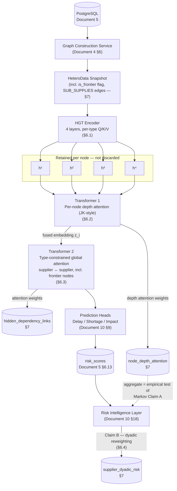

# Update — Layer 2 (Graph Intelligence) Architecture: HGT Deep Encoder, Dual Transformer Heads, and Markov Scoping

## Graph Neural Network and Generative AI-Based Supply Chain Risk Prediction System

Version: 1.0
Status: Partially merged — Documents 1 (§8.23 FR IDs), 5 (§6.23, 6.36–6.38 pending-amendment notes), 6 (§5–6 pending-amendment notes), 10 (§8.6, §8.7, §18.1 pointers) now cross-reference this document by name; the components themselves remain unbuilt and **Not committed — Phase 2 (early April 2027) or later; stretch-only before then, and only after RG-01 is solid** (Claim B is the one exception, tracked as Phase 2 in Document 10 §18.1). This document remains the sole full specification — the baseline documents summarize and point here, they do not duplicate its content.
Consistent with: Documents 1–14

---

## 1. Purpose

This document specifies an upgraded Layer 2 (Graph Intelligence) architecture for supplier risk prediction: a Heterogeneous Graph Transformer (HGT) encoder that retains all intermediate layer outputs, two purpose-built Transformer heads consuming those outputs differently, and a "Markov scoping" principle that splits what was previously one unstated assumption into two separately handled claims.

It **amends**:

- **Document 10 (AI/ML Documentation), Section 8.1** — replaces the single-sentence "HGT encoder → Transformer prediction head" description with the four-component decomposition specified here.
- **Document 10, Section 8.4** — adds a fourth ablation stage (Section 9 of this document) after the existing GraphSAGE → GAT → HGT progression.
- **Document 10, Section 18** — adds the dyadic risk-reweighting responsibility (Markov Claim B, Section 6.4) to the Risk Intelligence Layer's existing responsibilities.
- **Document 5 (Database Design)** and **Document 6 (Graph Database Design)** — schema and graph-representation additions (Section 7).

It does **not** replace any existing document; it is a standalone technical reference intended to be merged into the documents above once accepted. Everything not explicitly amended here (feature engineering, training infrastructure, inference serving contract, explainability mechanism, weighted-formula risk aggregation) is unchanged and continues to be governed by Document 10.

## 2. Scope

**In scope:**

- The HGT encoder's intermediate-layer retention behavior (Section 6.1).
- Transformer 1 — per-node depth attention / Jumping Knowledge fusion, including the dual-run training methodology and cross-validation stability check (Section 6.2).
- Transformer 2 — type-constrained global attention over supplier embeddings, including frontier-node coverage (Section 6.3).
- The Markov scoping principle's two claims: Claim A (depth sufficiency, tested inside Layer 2) and Claim B (dyadic risk, specified here but implemented in the Risk Intelligence Layer) (Section 6.4).
- Schema/graph additions required to support the above (Section 7).

**Out of scope:**

- Acquiring additional tier-2+ supplier data. The sparse/absent tier-2 edges (Section 3) are treated as a standing data condition this architecture works around, not a gap this document closes.
- Real-time or streaming graph updates — this remains a batch/offline training and snapshot-based inference design, consistent with Document 10, Section 8.2.
- Generalizing Markov Claim B to more than one focal firm (Section 11, risk ML-13; Section 12).
- Predicting exogenous shocks (earthquakes, sudden geopolitical events, sanctions). **This is explicitly a data problem, not an architecture problem** — no component specified here, nor any architecture change, can produce a signal the graph never recorded. It is addressed only by external data ingestion (Section 12).

| Item | Delivery Phase |
|---|---|
| HGT intermediate-layer retention (Section 6.1) | Not committed — Phase 2 (early April 2027) or later; stretch-only before then, and only after RG-01 is solid |
| Transformer 1 — depth attention, dual-run training, CV stability check (Section 6.2) | Not committed — Phase 2 (early April 2027) or later; stretch-only before then, and only after RG-01 is solid |
| Transformer 2 — type-constrained global attention, computation + persistence (Section 6.3) | Not committed — Phase 2 (early April 2027) or later; stretch-only before then, and only after RG-01 is solid |
| Transformer 2 — `hidden_dependency_links` dashboard surfacing | Phase 2 |
| Markov Claim A — depth-sufficiency test and report (Section 6.4) | Not committed — Phase 2 (early April 2027) or later; stretch-only before then, and only after RG-01 is solid |
| Markov Claim B — dyadic risk scoring (Section 6.4, Risk Intelligence Layer) | Phase 2 |
| Ablation Stage 4 (Section 9) | Not committed — Phase 2 (early April 2027) or later; stretch-only before then, and only after RG-01 is solid |

## 3. Assumptions

- **Sparse/absent tier-2 data:** supplier→supplier edges beyond tier-1 are sparse where recorded at all, and entirely absent for most suppliers. The graph has a **visibility frontier** — a boundary past which no structural data exists. This architecture is designed to partially compensate for that frontier (Transformer 2, Section 6.3) rather than assuming it will be closed by better data collection.
- **Class imbalance persists:** disruption labels (delay/shortage) remain a minority class, per Document 10, Section 8.2. Adding three new sets of learned parameters (HGT's per-type Q/K/V, Transformer 1, Transformer 2) on top of an already label-scarce problem increases overfitting risk (Section 11, ML-09) — the same class-weighted/focal loss and validation-based early stopping from Document 10 continue to apply unchanged.
- **Genuine supplier-to-supplier correlation exists in the data** at a level Transformer 2 can learn from — this is an untested assumption going in, and the ablation (Section 9) is the mechanism by which it is confirmed or falsified, not asserted upfront.
- **Latency budget can absorb two additional Transformer passes** at inference time without breaching Document 1's latency NFR; if evaluation shows otherwise, the shallow-regularized production variant (Section 6.2) is the intended mitigation, not a redesign.
- **The Markov Claim A test is only as good as the stability check behind it** (Section 6.2) — an unstable depth-weight measurement is treated as inconclusive, not as evidence either way.
- **The "focal firm" for Markov Claim B is singular** — the manufacturer operating this system — for the scope of this document. Multi-focal-firm generalization is out of scope (Section 11, ML-13; Section 12).
- **No new framework or infrastructure is introduced.** PyTorch and PyTorch Geometric (Document 2, Section 5) remain the implementation stack; nothing here requires a different serving path than Document 10, Section 9.
- **`entity_type` enum:** no component specified in this document requires adding `customer` to the existing ENUM (Document 5, Section 6.13) — `node_depth_attention`, `hidden_dependency_links`, and `supplier_dyadic_risk` (Section 7) all operate at `supplier` granularity. Flagged as a non-blocking future-proofing item only, in case a customer-level readout is ever added.

## 4. Dependencies

**Depends on:**

- Document 1 — FR-GNN-01–08, FR-ABL-01/02, FR-GOV-01/02, FR-EVAL-01/02, FR-RISKINT-01–03, FR-RISK-01/02. This document introduces new FR IDs (Section 6) that extend, rather than replace, these.
- Document 2, Section 5 — technology stack (PyTorch, PyTorch Geometric, GNNExplainer); unchanged.
- Document 5, Sections 6.2 (`suppliers`), 6.13 (`risk_scores`), 6.23 (`model_evaluation_runs`), 6.24 (`customers`), 6.25 (`model_registry`) — all amended per Section 7 below.
- Document 6, Sections 5 (node types), 6 (edge types) — amended per Section 7 below.
- Document 10, Sections 8.1 (model architecture), 8.2 (training procedure), 8.4 (ablation methodology), 16 (weighted risk formula precedent for auditable, non-learned business computation), 18 (Risk Intelligence Layer).

**Affects (should be updated on acceptance):**

- Document 10 — Sections 8.1, 8.4, and 18 should be rewritten to incorporate this document's content.
- Document 5 and Document 6 — schema/graph migrations per Section 7.
- Document 13 — new test cases: depth-weight stability check, dual-run methodology enforcement, same-type attention constraint (Fix A), hidden-dependency persistence.
- Document 14 — the roadmap's Model Trained milestone (M3) should account for the added ablation stage (Section 9).

## 5. Architecture Overview

Reading order: a `HeteroData` snapshot enters the HGT encoder, which produces four retained per-node embeddings instead of one. Transformer 1 fuses those four into a single embedding per node and records how much weight each node placed on each depth. Transformer 2 takes those fused embeddings — for suppliers only — and lets same-type nodes attend to each other regardless of recorded edges, surfacing hidden couplings. The prediction heads consume Transformer 2's output exactly as Document 10, Section 9 already describes. Everything downstream of `risk_scores` is unchanged **except** that the Risk Intelligence Layer gains one new responsibility: reweighting a supplier's global score into a dyadic score for this specific focal firm (Claim B).

## 6. Component Specifications

| Component | Role (one line) | Delivery Phase |
|---|---|---|
| HGT Encoder (§6.1) | Type-aware local structural encoding, retaining every hop | Not committed — Phase 2 (early April 2027) or later; stretch-only before then, and only after RG-01 is solid |
| Transformer 1 (§6.2) | Learns per-node how many hops actually matter | Not committed — Phase 2 (early April 2027) or later; stretch-only before then, and only after RG-01 is solid |
| Transformer 2 (§6.3) | Finds same-type nodes that behave together but aren't connected | Not committed — Phase 2 (early April 2027) or later; stretch-only before then, and only after RG-01 is solid |
| Markov Scoping (§6.4) | Tests the depth assumption; separates supplier fragility from this firm's exposure to it | Not committed — Phase 2 (early April 2027) or later; stretch-only before then, and only after RG-01 is solid |

### 6.1 HGT Encoder — the Local Structural Encoder

**Role:** learns type-aware local structure by message-passing over the heterogeneous graph, retaining every intermediate layer's output per node instead of only the last.

**Inputs:** the `HeteroData` snapshot — 8 node types, 10 edge types after Section 7's additions (Document 6, Sections 5–6) — and one set of per-node-type, per-edge-type Q/K/V projection parameters per layer.

**Outputs:** four per-node embeddings `h¹, h², h³, h⁴`, one per message-passing layer, for every node — none discarded.

**How it works:** HGT (Hu et al., 2020) computes attention per *meta-relation* — the (source node type, edge type, target node type) triple — using separate learnable projections for each. This is what lets the model treat a `SUPPLIES` edge (Supplier→Component) as semantically different from a `SHIPS_FROM` edge (Shipment→Supplier/Factory), rather than collapsing the graph into one homogeneous relation type the way GAT does (Document 10, Section 8.4, Stage 2). Standard practice stacks these layers and keeps only the final layer's output as "the" node embedding. This specification changes that default: every layer's output is kept, because a node's correct receptive field is not the same for every node (a single-product leaf supplier may only need its immediate neighbors; a multi-division hub supplier may need three hops of context) — and discarding the intermediate layers throws away the information needed to make that distinction, which is exactly what Transformer 1 (Section 6.2) is built to use.

**Step-by-step implementation:**

1. Configure the encoder with exactly 4 `HGTConv`-equivalent layers, each with its own per-node-type and per-edge-type Q/K/V parameter sets (Hu et al., 2020).
2. Run message passing layer-by-layer; after each layer, snapshot the output embedding tensor per node, keyed by node ID and layer index, rather than overwriting the previous layer's output.
3. Retain all four snapshots (`h¹`–`h⁴`) per node for the duration of the forward pass — they are consumed as a set by Transformer 1 (Section 6.2), not individually.
4. Do **not** apply a fixed final-layer readout or pooling at this stage. The conventional "use only `h⁴`" behavior is precisely what Transformer 1 replaces with a learned, per-node choice.
5. Persist nothing to the database from this component — `h¹`–`h⁴` are transient forward-pass tensors. Only Transformer 1's fused output and depth weights are persisted (Section 6.2, step 7).

**What it explicitly does NOT do:**

- Cannot reach beyond its fixed 4-hop receptive field.
- Has no notion of time or sequence — it sees a single graph snapshot, not an event history.
- Cannot connect two nodes that share no recorded edge path, however behaviorally similar they are (Transformer 2's job, Section 6.3).
- Does not decide which hop depth is relevant for a given node — it only produces the four candidates Transformer 1 chooses among.

**FR served:** FR-GNN-01/02/06 (existing); **FR-HGT-01** — the system shall retain all four intermediate HGT layer outputs per node rather than discarding all but the last (new); **FR-HGT-02** — the system shall use per-node-type, per-edge-type Q/K/V parameters across all 4 message-passing layers (new). **Delivery Phase:** Not committed — Phase 2 (early April 2027) or later; stretch-only before then, and only after RG-01 is solid.

### 6.2 Transformer 1 — Per-Node Depth Attention (Jumping Knowledge)

**Role:** learns, per node, how to weight its own `h¹`–`h⁴` into one fused embedding, replacing the fixed "always use the last layer" default.

**Inputs:** the 4-token sequence `[h¹, h², h³, h⁴]` per node, from Section 6.1.

**Outputs:** (a) a fused embedding `z_i` per node, consumed by Transformer 2 (Section 6.3); (b) per-node depth attention weights (4 values summing to 1), **persisted** (Section 7).

**How it works:** this is a small Transformer applying self-attention over each node's own 4-token depth sequence — a learned generalization of Jumping Knowledge aggregation (Xu et al., 2018), which originally proposed combining a GNN's per-layer outputs (via max-pooling or concatenation) instead of using only the last layer. Here the combination is a learned attention-weighted sum rather than a fixed pooling rule, so the model can express "this node needs mostly `h¹`" or "this node needs a blend of `h²` and `h³`" on a per-node basis. This has a useful side effect: because deep layers can be assigned near-zero weight rather than being mandatory, it acts as an over-smoothing mitigation — nodes that don't benefit from deep context are not forced to use it. It also produces something new: since the weights are learned without ever being told the "right" depth, their aggregate distribution across the evaluation set becomes the **empirical test of Markov Claim A** (Section 6.4) — whether tier-1-visible structure is actually sufficient, rather than an assumption baked into the architecture.

**Step-by-step implementation (Fix B embedded at steps 2–4):**

1. Implement a small Transformer (1–2 layers, a few attention heads) taking the 4-token per-node sequence as input and producing a single fused output `z_i` via learned attention-weighted combination (Xu et al., 2018's framing, generalized from fixed pooling to learned attention).
2. Initialize the attention projection weights with a standard **unbiased** scheme (e.g., Xavier/Glorot) — do not embed any prior favoring shallow or deep layers into the initial weights.
3. **Train two separate variants from identical initialization, data split, and loss function, differing only in one added term:**
   - **Unbiased run** — no regularization on the depth-attention distribution; trained purely to minimize the downstream task loss. *This run's depth weights are the reported experimental result for Markov Claim A.*
   - **Shallow-regularized run** — an added penalty (e.g., an entropy or L1 term) that biases attention mass toward `h¹`/`h²`, improving sample efficiency and inference latency. *This run is the one deployed to production.*
4. **Never report the shallow-regularized run's depth weights as evidence about the graph's structure.** Biasing the model toward shallow depth and then citing its shallow weights as "the model learned shallow is sufficient" is circular — the conclusion was engineered into the training objective. Only the unbiased run's weights count as the Claim A measurement (Fix B).
5. Run k-fold cross-validation (e.g., k=5) on the **unbiased** variant only, and compute a stability metric per node — e.g., mean pairwise cosine similarity of that node's depth-weight vector across folds.
6. Treat the aggregate depth-weight profile as reportable evidence only if the stability metric clears a documented threshold. Below threshold, report the result as **inconclusive** — unstable weights mean the model memorized fold-specific noise rather than learning a generalizable depth preference, and asserting a Markov finding from noise would be a second methodological error layered on the first.
7. Persist per-node depth weights from both runs to `node_depth_attention` (Section 7), tagged by `run_type` (`unbiased` / `shallow_regularized`) and, for the unbiased run, by cross-validation fold, so the stability check is reproducible and auditable rather than a one-time offline computation.

**What it explicitly does NOT do:**

- Does not modify the HGT encoder's parameters or receptive field (Section 6.1) — it only re-weights what the encoder already computed.
- Does not connect nodes with no recorded structural path — that is Transformer 2's job (Section 6.3).
- The production (shallow-regularized) variant's depth weights carry no scientific weight about the underlying graph — they exist purely for serving efficiency.

**FR served:** **FR-JKT-01** (fused embedding via learned depth attention), **FR-JKT-02** (persist per-node depth weights), **FR-JKT-03** (dual-run training methodology), **FR-JKT-04** (cross-validation stability gate before reporting) — all new; extends FR-GNN-06 (embeddings) and FR-EVAL-01 (persisted evaluation metrics, extended with a stability score, Section 8). **Delivery Phase:** Not committed — Phase 2 (early April 2027) or later; stretch-only before then, and only after RG-01 is solid.

### 6.3 Transformer 2 — Type-Constrained Global Attention Head

**Role:** discovers correlated hidden dependencies between same-type nodes — specifically supplier↔supplier — that share no recorded graph edge, by attending over embeddings rather than over graph connectivity.

**Inputs:** fused embeddings `z_i` (Section 6.2) for all nodes of a given type. This document's initial scope is **Supplier nodes only**, including nodes flagged `is_frontier = true` (Section 7).

**Outputs:** globally-refined supplier embeddings feeding the prediction heads; persisted attention weights identifying the strongest node pairs (`hidden_dependency_links`, Section 7).

**How it works:** this is a standard multi-head self-attention block computed directly over the embedding matrix — query, key, and value all derive from `z_i`, with **no adjacency mask** restricting attention to graph neighbors. Because it operates on embeddings rather than edges, two suppliers with no recorded connection can still attend strongly to each other if their learned embeddings are similar in ways correlated with historical co-failure — e.g., two tier-1 suppliers that fail together because they share an unrecorded upstream source beyond the visibility frontier. This also closes a reach gap the encoder cannot: the BOM path Supplier→Component→Product→Order→Customer is 4 hops, at the edge of what a 4-layer encoder reliably propagates end-to-end (Section 6.1); gathering embeddings globally sidesteps needing a 5th message-passing hop.

**Step-by-step implementation (Fix A embedded at step 2):**

1. Collect the fused embeddings `z_i` (Section 6.2 output) for every node, tagged with node type.
2. **Partition the attention computation by node type before applying self-attention — restrict Transformer 2's attention exclusively to same-type pairs (Supplier↔Supplier only, per this document's initial scope). Never compute attention across types (e.g., never Supplier↔Product).** This is a required constraint, not an optional filter: HGT (Section 6.1) works specifically to keep each node type's embedding space distinct via type-specific parameters; an unconstrained global attention head recombines all node types into one shared space, partially undoing that work. Restricting to same-type attention also matches the actual goal — the correlated-hidden-dependency problem this component exists to solve is specifically supplier-to-supplier coupling, not supplier-to-product coupling (Fix A).
3. Include frontier-flagged nodes (`is_frontier = true`, Section 7) in the same-type attention pool on equal footing with fully-observed suppliers — frontier nodes are exactly the ones this component exists to connect.
4. Apply multi-head self-attention within the type-partitioned group; use its output as the globally-refined supplier embedding that feeds the prediction heads (Document 10, Section 9).
5. Extract the top-k attention weight pairs per supplier (by magnitude, above a documented threshold) and persist them to `hidden_dependency_links` (Section 7), tagged by `model_version`, so a discovered dependency is traceable and reviewable rather than implicit inside a weight matrix.
6. Do not feed Transformer 2's output back into the HGT encoder or Transformer 1 — it is a one-directional downstream refinement step, preserving the layered pipeline (Section 5).

**What it explicitly does NOT do:**

- Does not attend across node types (Fix A) — a Supplier cannot directly attend to a Product or Order inside this component.
- Does not require, or use, a recorded edge between two nodes it couples.
- Does not itself judge whether a discovered correlation is causal versus spurious — that judgment belongs to a human reviewer or the LLM explanation layer downstream (Document 10, Section 12; see also Section 11, ML-12 of this document).

**FR served:** **FR-XGA-01** (embedding-based global attention including frontier nodes), **FR-XGA-02** (same-type attention constraint, Fix A), **FR-XGA-03** (persist/expose attention weights for explainability) — all new; extends FR-GNN-04/05 (affected-entity tracing, explanation subgraphs). **Delivery Phase:** Not committed — Phase 2 (early April 2027) or later; stretch-only before then, and only after RG-01 is solid (computation + persistence); Phase 2 (`hidden_dependency_links` dashboard surfacing, matching the existing explainability compute-then-visualize pattern of Document 10, Section 12).

### 6.4 Markov Scoping Principle

**Role:** separates one previously bundled, unstated assumption ("tier-1 visibility is enough") into two distinct claims — a depth-sufficiency hypothesis tested inside Layer 2 (Claim A), and a risk-attribution principle specified here but implemented in the Risk Intelligence Layer (Claim B).

**Inputs:** Claim A — Transformer 1's aggregated, stability-checked depth attention weights (Section 6.2) across the evaluation set. Claim B — a supplier's existing Layer 2 node-level `risk_scores` row (Document 5, Section 6.13), plus order-volume share, contract priority tier, and historical fulfilment-preference signals derived from `customers` (Document 5, Section 6.24).

**Outputs:** Claim A — a reported, evidenced finding (supported / not supported / inconclusive) on whether capping the HGT encoder at 4 layers is justified. Claim B — a `supplier_dyadic_risk` row (Section 7) reweighting the global score for this firm's specific relationship with that supplier.

**How it works:**

- **Claim A (depth sufficiency):** the hypothesis that a supplier's tier-1-observable state summarizes the risk-relevant stress propagating from its own upstream, so 4 hops of message passing is enough and going further would add cost without adding signal. This document does not assert Claim A — it makes it a *tested hypothesis*: Section 6.2's dual-run methodology produces an unbiased, stability-checked measurement of how much attention weight nodes actually place on deeper hops. If that measurement is concentrated on shallow layers and stable across folds, it is evidence *for* Claim A; if it is not, that is reported honestly as a limitation of the `L=4` design choice, not suppressed.
- **Claim B (dyadic risk):** a node-level risk score (e.g., "Supplier X: 80% failure probability") conflates the supplier's own global fragility with how exposed *this firm specifically* is to that fragility. A globally fragile supplier for whom the focal firm is a small, low-priority customer poses less realized risk than the raw score implies; a moderately risky supplier who is a sole-source for a strategic, high-volume customer poses more. Claim B reweights the global score by order-volume share, contract priority, and historical fulfilment preference to produce a relationship-specific score. This is deliberately implemented **outside Layer 2**, inside the Risk Intelligence Layer (Document 10, Section 18) — it is a business-relationship computation over an already-produced score, not a graph representation-learning problem, and mixing it into the GNN would make an auditable business rule opaque for no representational benefit (consistent with the precedent set by the transparent weighted risk formula, Document 10, Section 16).

**Step-by-step implementation:**

1. *(Claim A)* After Section 6.2, step 6 clears the stability gate on the unbiased run, compute the evaluation-set-wide average depth-weight profile (mean weight per layer, 1–4).
2. *(Claim A)* Persist this profile alongside its stability metric to `model_evaluation_runs` (Section 7) as the documented evidence for — or against — capping the HGT encoder at `L=4` (Section 6.1, step 1). This is the artifact that would justify revisiting the layer count if the evidence came out against it.
3. *(Claim B, in the Risk Intelligence Layer, not this document's component)* Take each supplier's existing `risk_scores` row (Document 5, Section 6.13) as the global/node-level input, unmodified.
4. *(Claim B)* Compute `order_volume_share` (this firm's share of the supplier's total recorded order volume), `contract_priority_weight` (from `customers.priority_tier` / `contract_terms`), and `fulfilment_preference_weight` (from historical fulfilment-order patterns); combine with the global score via a documented, deterministic formula — not learned, consistent with the existing weighted-formula precedent (Document 10, Section 16).
5. *(Claim B)* Persist both the reference to the global score and the dyadic result to `supplier_dyadic_risk` (Section 7), so the two are never conflated — mirroring the `scoring_method` traceability pattern already established for `risk_scores` (Document 5, Section 6.13; FR-RISK-02).
6. *(Claim B)* Surface both figures side by side on the dashboard (a supplier's raw global fragility vs. this firm's actual exposure to it) rather than replacing one with the other — collapsing them back into a single number loses exactly the information the reweighting exists to surface.

**What it explicitly does NOT do:**

- Claim A does not retrain or resize the HGT encoder by itself — it only validates or challenges the already-fixed `L=4` choice (Section 6.1); an unfavorable result is reported as a limitation (Section 10), not silently patched around.
- Claim B does not alter, override, or replace the Layer 2 node-level `risk_scores` row — it produces a separate, additional record.
- Claim B does not generalize to multiple focal firms in this scope (Section 11, ML-13; Section 12).

**FR served:** **FR-MKV-01** (Claim A — depth-sufficiency test methodology), **FR-MKV-02** (Claim B — dyadic risk computation in the Risk Intelligence Layer) — both new; extends FR-RISKINT-01–03 and FR-RISK-01/02. **Delivery Phase:** Not committed — Phase 2 (early April 2027) or later; stretch-only before then, and only after RG-01 is solid (Claim A, entirely within this document's scope); Phase 2 (Claim B — gated on `customers`/`contract_terms` consumption, already Phase-2-scoped per Document 5, Section 6.24).

### 6.5 Implementation Note — OR-Tools CP-SAT for Claim B's Downstream Consumer (Customer Allocation)

Claim B's dyadic risk score (Section 6.4) is designed to feed the customer-allocation optimizer as one of its objective-weight inputs (Document 1, FR-CUST-02; Document 10, Section 17). That optimizer is specified elsewhere (Document 10, Section 17; `updates/Other_Tools.md`, EF-07/EF-08) as "the OR-Tools engine" without committing to a specific solver — this note fills that gap for the specific consumer this document creates.

- **Solver: OR-Tools CP-SAT, not the LP/MIP solver.** Allocation units are discrete integers (units of product shipped to an order), not continuous quantities. CP-SAT (Constraint Programming — SAT) natively handles integer decision variables and the combinatorial, discrete-capacity structure of this problem; a pure LP solver would require relaxing to continuous values and rounding afterward, which can produce infeasible or non-integral "solutions" needing post-hoc repair — exactly the kind of forced, non-guaranteed result NFR-20 (Document 1) rules out.
- **Decision-variable structure:** `x_ij` = integer number of units of product `i` allocated to order `j`. Constraints: `Σ_j x_ij ≤ available_inventory_i` (`inventory.stock_level`, Document 5, Section 6.8); `x_ij ≤ quantity_ordered_ij` (`order_items.quantity`, Document 5, Section 6.10); `x_ij ≥ 0`. Objective: maximize `Σ_ij x_ij · weight_ij`, where `weight_ij` combines customer priority tier, order value, and SLA-penalty avoidance (Document 1, FR-CUST-02) and, where the constrained product traces to a specific at-risk supplier, may additionally incorporate that supplier's `supplier_dyadic_risk.dyadic_risk_score` (Section 7.5) — using the dyadic score here, not the supplier's raw global risk, is the entire point of Claim B: it reweights allocation urgency by *this firm's* exposure to a supplier's fragility, not the supplier's fragility in the abstract.
- **The optimality guarantee is only as good as the weights, and the weights are a business judgment, not a derived quantity.** CP-SAT's feasible-or-infeasible guarantee (NFR-20) is a guarantee about the arithmetic given `weight_ij` — it says nothing about whether those weights are the *right* ones. Priority-tier weight, order-value weight, SLA-penalty weight, and any Claim-B dyadic-risk weight must be sourced from real negotiated contract data and stakeholder input (Document 1, Section 12 assumption on `contract_terms` availability), never invented or silently defaulted — the same caution Document 10, Section 16 already applies to the weighted risk formula's starting weights, restated here because it applies with equal force to this optimizer's objective.
- **Delivery Phase:** Phase 2 — this note describes a consumer of Claim B, which is itself Phase 2 (Section 2); it does not change the phasing of the optimizer itself (Document 1, FR-OPT-01/FR-CUST-02, already Phase 2).

## 7. Data Model Changes

Format follows Document 5, Section 6: Purpose, Columns/Datatype/Constraints, Indexes, Relationships, Delivery Phase.

### 7.1 `suppliers` (amendment)

**Purpose:** add tier and frontier-visibility metadata needed by Transformer 2 (Section 6.3) and Markov Claim A/B (Section 6.4).

| Column | Datatype | Constraints |
|---|---|---|
| tier | SMALLINT | NOT NULL, default `1`, CHECK (`tier >= 1`) — 1 = directly observed (tier-1); 2+ = a partially-observed supplier reached only via a `supplier_relationships` row (Section 7.2) |
| is_frontier | BOOLEAN | NOT NULL, default `false` — `true` when this node's further-upstream suppliers are not recorded in the graph at all; set for every tier-1 supplier with zero outgoing `SUB_SUPPLIES` edges, and for every tier-2+ stub node |

- **Migration:** both columns are additive with defaults; existing rows default to `tier=1`, `is_frontier` computed once at migration time from existing `supplier_relationships` (Section 7.2) data, then maintained incrementally by the Graph Construction Service.
- **Delivery Phase:** Not committed — Phase 2 (early April 2027) or later; stretch-only before then, and only after RG-01 is solid

### 7.2 `supplier_relationships` (new)

**Purpose:** persists the sparse, sometimes-available tier-2+ supplier edges — the relational backing for the new `SUB_SUPPLIES` graph edge type (Section 7.7).

| Column | Datatype | Constraints |
|---|---|---|
| id | UUID | PK, default `gen_random_uuid()` |
| upstream_supplier_id | UUID | NOT NULL, FK → `suppliers(id)` |
| downstream_supplier_id | UUID | NOT NULL, FK → `suppliers(id)`, CHECK (`downstream_supplier_id <> upstream_supplier_id`) |
| tier | SMALLINT | NOT NULL, CHECK (`tier >= 2`) — the downstream supplier's tier relative to the focal firm |
| source | VARCHAR(50) | NULL — how this edge was recorded (e.g. `self_reported`, `audit_disclosure`), since tier-2 sourcing is inherently less systematic than tier-1 master data |
| confidence | NUMERIC(5,4) | NULL, CHECK (0 <= confidence <= 1) — data-quality confidence, reflecting that sparse tier-2 sourcing is less reliable than directly-administered tier-1 records |
| created_at | TIMESTAMPTZ | NOT NULL, default `now()` |

- **Indexes:** index on `upstream_supplier_id`; index on `downstream_supplier_id`.
- **Relationships:** links `suppliers` to `suppliers`; source of the `SUB_SUPPLIES` graph edge (Section 7.7).
- **Delivery Phase:** Not committed — Phase 2 (early April 2027) or later; stretch-only before then, and only after RG-01 is solid

### 7.3 `node_depth_attention` (new)

**Purpose:** persists Transformer 1's per-node depth attention weights (Section 6.2), across both training-run variants and cross-validation folds — the source of the Markov Claim A evidence.

| Column | Datatype | Constraints |
|---|---|---|
| id | UUID | PK, default `gen_random_uuid()` |
| entity_type | entity_type ENUM | NOT NULL — reuses Document 5, Section 6.13's `entity_type` enum, scoped to `supplier` in this document's initial scope |
| entity_id | UUID | NOT NULL |
| model_version | VARCHAR(50) | NOT NULL |
| run_type | run_type ENUM(`unbiased`,`shallow_regularized`) | NOT NULL |
| depth_weights | JSONB | NOT NULL — array of 4 floats `[w1, w2, w3, w4]` summing to 1, one per HGT layer (Section 6.1) |
| cv_fold | SMALLINT | NULL — cross-validation fold this measurement came from; NULL for a non-CV production run |
| created_at | TIMESTAMPTZ | NOT NULL, default `now()` |

- **Indexes:** composite index on (`entity_type`, `entity_id`, `model_version`, `run_type`); index on `run_type` — only `unbiased` rows are eligible to be cited as the Claim A result (Section 6.2, step 4).
- **Relationships:** loosely joined to `risk_scores.model_version` (Document 5, Section 6.13), same polymorphic-by-convention pattern used throughout the schema.
- **Delivery Phase:** Not committed — Phase 2 (early April 2027) or later; stretch-only before then, and only after RG-01 is solid

### 7.4 `hidden_dependency_links` (new)

**Purpose:** persists Transformer 2's discovered supplier-pair attention weights (Section 6.3) — the source of the "correlated hidden dependency" surfaced to reviewers.

| Column | Datatype | Constraints |
|---|---|---|
| id | UUID | PK, default `gen_random_uuid()` |
| supplier_a_id | UUID | NOT NULL, FK → `suppliers(id)` |
| supplier_b_id | UUID | NOT NULL, FK → `suppliers(id)`, CHECK (`supplier_b_id <> supplier_a_id`) |
| attention_weight | NUMERIC(6,5) | NOT NULL — Transformer 2's cross-attention weight between the pair |
| model_version | VARCHAR(50) | NOT NULL |
| detected_at | TIMESTAMPTZ | NOT NULL, default `now()` |

- **Indexes:** UNIQUE composite index on (`supplier_a_id`, `supplier_b_id`, `model_version`); index on `attention_weight` DESC (top-dependency surfacing, Section 6.3 step 5).
- **Relationships:** links `suppliers` to `suppliers`.
- **Delivery Phase:** Not committed — Phase 2 (early April 2027) or later; stretch-only before then, and only after RG-01 is solid (computation + persistence); Phase 2 (dashboard surfacing)

### 7.5 `supplier_dyadic_risk` (new)

**Purpose:** persists Markov Claim B's relationship-specific reweighting (Section 6.4) — kept separate from the global `risk_scores` row so the two are never conflated.

| Column | Datatype | Constraints |
|---|---|---|
| id | UUID | PK, default `gen_random_uuid()` |
| supplier_id | UUID | NOT NULL, FK → `suppliers(id)` |
| risk_score_id | UUID | NOT NULL, FK → `risk_scores(id)` — the Layer 2 global/node-level score this row reweights, unmodified |
| order_volume_share | NUMERIC(5,4) | NULL, CHECK (0 <= order_volume_share <= 1) |
| contract_priority_weight | NUMERIC(5,4) | NULL, CHECK (0 <= contract_priority_weight <= 1) — derived from `customers.priority_tier`/`contract_terms` |
| fulfilment_preference_weight | NUMERIC(5,4) | NULL, CHECK (0 <= fulfilment_preference_weight <= 1) |
| dyadic_risk_score | NUMERIC(5,4) | NOT NULL, CHECK (0 <= dyadic_risk_score <= 1) |
| scored_at | TIMESTAMPTZ | NOT NULL, default `now()` |

- **Indexes:** composite index on (`supplier_id`, `scored_at` DESC).
- **Relationships:** child of `suppliers` and `risk_scores`.
- **Audit:** immutable, append-only, mirroring `risk_scores`' own audit behavior (Document 5, Section 6.13).
- **Delivery Phase:** Phase 2

### 7.6 `model_evaluation_runs` (amendment)

**Purpose:** extend the existing evaluation-metrics table (Document 5, Section 6.23) to carry dual-run tagging and the new Markov/attention-related metrics.

| Column | Datatype | Constraints |
|---|---|---|
| run_type | run_type ENUM(`unbiased`,`shallow_regularized`) | NULL — NULL for pre-existing ablation rows (GraphSAGE/GAT/HGT) that predate this distinction; required for any row logged for the components in this document |

- New `metric_name` values (no schema change needed, `metric_name` is already `VARCHAR`): `depth_weight_stability_score`, `mean_depth_layer`, `hidden_dependency_count`.
- **Migration:** additive, nullable column; no backfill required.
- **Delivery Phase:** Not committed — Phase 2 (early April 2027) or later; stretch-only before then, and only after RG-01 is solid

### 7.7 Document 6 (Graph Database Design) amendments

- **Node type amendment** — `Supplier`: add `tier`, `is_frontier` to Key Properties (Document 6, Section 5), sourced from Section 7.1 above.
- **New edge type:**

| Edge Type | Source (from → to) | Derivation | Properties | Delivery Phase |
|---|---|---|---|---|
| `SUB_SUPPLIES` | `Supplier → Supplier` | `supplier_relationships` (Section 7.2) | `tier`, `source`, `confidence` | Not committed — Phase 2 (early April 2027) or later; stretch-only before then, and only after RG-01 is solid |

- This edge type is sparse by construction (Section 3) — most suppliers have zero outgoing `SUB_SUPPLIES` edges, which is precisely the condition `is_frontier` flags and Transformer 2 (Section 6.3) is designed to partially compensate for.

## 8. Training and Evaluation Protocol

Extends Document 10, Section 8.2 (unchanged for the base GraphSAGE/GAT/HGT ablation); the following applies specifically to Transformer 1's dual-run methodology (Section 6.2) and its evaluation:

| Step | Detail |
|---|---|
| Data split | Same time-based split as Document 10, Section 8.2 — both the unbiased and shallow-regularized runs use the identical split so results are comparable. |
| Shared config | Both runs share architecture, learning rate, optimizer (Adam/AdamW), and base loss function — the **only** difference between them is the shallow-regularized run's added depth-attention penalty term (Section 6.2, step 3). This isolates the effect of that one term. |
| Cross-validation | k-fold (e.g., k=5) applied to the **unbiased** run only. Per-node depth-weight vectors are compared across folds via a stability metric (e.g., mean pairwise cosine similarity); a documented threshold (set during initial experimentation, not assumed in advance) determines whether the aggregate result is reportable (Section 6.2, step 6). |
| What NOT to cross-validate for reporting | The shallow-regularized run is never cross-validated for the purpose of a Markov Claim A report — it is only evaluated on standard task metrics (AUC-ROC, Precision/Recall) as a production-candidate model, per Document 10, Section 10. |

**Persisted to `model_evaluation_runs` (Section 7.6):**

- Standard classification metrics (Precision, Recall, F1, ROC-AUC — Document 10, Section 10) for **both** `run_type` values, so the production (shallow) model's task performance is tracked like any other model.
- `depth_weight_stability_score` — the cross-validation stability metric, logged only for `run_type = 'unbiased'`.
- `mean_depth_layer` — the evaluation-set-wide weighted-average hop index (`Σ i·w_i` across layers 1–4), the headline Claim A statistic, logged only for `run_type = 'unbiased'`.
- `hidden_dependency_count` — the number of `hidden_dependency_links` rows (Section 7.4) exceeding the persistence threshold for a given `model_version`, giving a coarse, comparable signal of how much Transformer 2 is actually finding per training run.

Governance metadata (`model_registry`, Document 10, Section 8.5) additionally records the shallow-regularization coefficient in `hyperparameters` for the `shallow_regularized` run, so the production model's training configuration remains fully reproducible.

## 9. Ablation Design

Extends Document 10, Section 8.4's GraphSAGE → GAT → HGT progression with a fourth stage, following the same principle: each stage is justified by a documented limitation of the one before it, not assumed as an improvement.

| Stage | Architecture | `model_version` (example) | Why this stage was run | Documented limitation motivating the next stage |
|---|---|---|---|---|
| 1 | HGT alone (final-layer output only, Document 10 §8.4 Stage 3 baseline) | `hgt-v1` | Establishes the type-aware local-structure baseline this document builds on | Cannot connect nodes with no recorded edge path; the Supplier→Component→Product→Order→Customer BOM path (4 hops) sits at the edge of reliable message-passing reach; tier-2+ suppliers beyond the visibility frontier are invisible regardless of layer count |
| 2 | + Transformer 2 (type-constrained global attention, §6.3) | `hgt-xga-v1` | Directly tests whether embedding-based, same-type global attention recovers signal Stage 1's edge-bound message passing cannot reach | Every node is still forced through a single, fixed-depth (`h⁴`-only) representation regardless of whether that depth is appropriate for it — over-smoothing risk remains, and there is no way yet to test whether 4 hops was even the right depth to fix on |
| 3 | + Transformer 1 (depth attention / JK, §6.2) | `hgt-xga-jkt-v1` | Adds the per-node depth choice Stage 2 lacked, and for the first time produces the depth-weight measurement needed to empirically test Markov Claim A | The architecture now produces a node-level risk score, but that score conflates a supplier's own global fragility with how exposed this specific firm is to it — no distinction yet between "this supplier is at risk" and "this supplier's risk is my risk" |
| 4 | + Markov scoping (Claim B — dyadic reweighting, §6.4) | n/a — Claim B is a Risk Intelligence Layer computation, not a distinct `model_version` | Closes Stage 3's gap by reweighting the already-produced global score per (supplier, focal-firm) relationship, using order-volume share, contract priority, and fulfilment preference | Documented as a residual limitation, not a further stage: the reweighting formula is scoped to a single focal firm (Section 11, ML-13) and cannot itself resolve exogenous shocks (Section 11, ML-14) |

- Stages 1–3 are trained and evaluated on the same held-out test set and data split as the base ablation (Document 10, Section 8.4), so the comparison isolates each added component's effect.
- Stage 4 is not a trainable variant — it is evaluated qualitatively (does dyadic reweighting produce sensible, reviewer-plausible reorderings of risk priority) rather than via a held-out AUC, since it is a deterministic downstream computation, not a learned model (consistent with Document 10, Section 16's precedent for the weighted risk formula).
- Each of Stages 1–3's metrics are persisted to `model_evaluation_runs` (Section 7.6) under its own `model_version`, exactly as Document 10, Section 8.4 already requires for the base ablation.
- **Delivery Phase:** Not committed — Phase 2 (early April 2027) or later; stretch-only before then, and only after RG-01 is solid.

## 10. Pros and Cons

### Why the four components combine well

- **Blind-spot complementarity:** each component covers a gap the others cannot. HGT sees local, typed structure but not depth choice or unconnected nodes; Transformer 1 fixes the depth-choice blind spot; Transformer 2 fixes the unconnected-node blind spot; Markov scoping fixes the "supplier risk ≠ my risk" blind spot. None of the four is individually sufficient, but together they cover a wider slice of the problem than any single-model alternative.
- **Distinct information types:** HGT encodes *structure*, Transformer 1 encodes *how much structure matters per node*, Transformer 2 encodes *unstructured statistical correlation*, and Markov scoping encodes *business relationship context*. These are genuinely different signal types, not four ways of re-deriving the same thing.
- **Layered explainability:** because each component's output is separately persisted (depth weights, hidden-dependency links, dyadic scores), a reviewer can inspect *why* a prediction looks the way it does at each stage, rather than facing one opaque end-to-end score.
- **Graceful degradation:** if Transformer 2 finds nothing (e.g., tier-2 correlation genuinely doesn't exist in this dataset), the pipeline still functions as HGT + Transformer 1 alone — no component's failure is fatal to the others, by construction of the layered design (Section 5).

### Where they genuinely conflict

- **Type-flattening (structural):** left unconstrained, Transformer 2's global attention would recombine HGT's carefully separated per-type embedding spaces back into one homogeneous space — mitigated, not eliminated, by the same-type constraint (Fix A, Section 6.3), which limits Transformer 2 to Supplier↔Supplier only rather than removing the tension entirely.
- **Methodological contamination (training):** any regularization that biases Transformer 1 toward a particular depth invalidates using that same run's weights as a Markov Claim A measurement — the dual-run split (Fix B, Section 6.2) manages this by never letting the production model's weights double as the scientific claim, at the cost of training two models instead of one.
- **Transformer 1 / Transformer 2 functional overlap:** both are attention mechanisms operating on the same underlying `z_i`-adjacent representations, and it is plausible that Transformer 2, given enough capacity, could partially learn to approximate what depth-selection is doing, making the two harder to cleanly attribute credit between in practice than the clean division of labor in Section 6 suggests on paper.
- **Dyadic-risk vs. node-level prediction mismatch:** Layer 2 produces one node-level score per supplier; Claim B's dyadic reweighting produces a different score per (supplier, focal-firm) pair. In a single-focal-firm deployment this is a clean 1:1 remapping, but it means the "risk score" a user sees depends on which of two numbers they're looking at — the raw prediction or the reweighted one — which requires the same kind of `scoring_method`-style disambiguation Document 10, Section 16 already established for `gnn_native` vs. `weighted_formula`, applied again here.
- **Counterintuitive explanations eroding trust:** Transformer 2's hidden-dependency findings are, by design, non-obvious — a user who cannot see *why* two seemingly unrelated suppliers were coupled may distrust the prediction more than they would trust a purely structural explanation, even when the coupling is real (Section 11, ML-12).
- **Stacked-attention training instability:** three attention mechanisms in series (HGT, Transformer 1, Transformer 2) is a deeper, more attention-heavy stack than the base HGT-alone ablation, with correspondingly higher risk of training instability — vanishing gradients through the stack, attention collapse in any one component — that a single-encoder model does not face (Section 11, ML-10).

### Overall system pros and cons

**Pros:** each added component is independently justified by a specific, named limitation of what came before (Section 9); the design is honest about what's proven (structure, per Documents 6/10) versus tested-not-assumed (depth sufficiency, Section 6.4) versus genuinely unproven going in (supplier-to-supplier correlation existing at all, Section 3); every component's output is persisted and auditable rather than buried inside a single forward pass.

**Cons:** substantially more parameters and moving parts than the current HGT + Transformer prediction head (Document 10, Section 8.1) for a disruption-label-scarce problem (Section 11, ML-09); two of the four components (Transformer 2, Markov Claim B) rest on assumptions — genuine hidden correlation exists, a single-focal-firm reweighting is adequate — that this document flags but cannot itself confirm without running the ablation (Section 9) and the Phase 2 deployment; and, as stated throughout, none of this can compensate for information the graph never captured — an exogenous shock is invisible to every component described here (Section 11, ML-14).

## 11. Risks

| ID | Risk | Mitigation | Delivery Phase |
|---|---|---|---|
| ML-09 | Added parameter count (HGT's per-type Q/K/V across 4 layers, plus two Transformer heads) increases overfitting risk against an already sparse, imbalanced set of disruption labels (Document 10, Section 8.2) | Same class-weighted/focal loss and validation-based early stopping as the base ablation; `parameter_count` logged per `model_registry` row so the cost is visible in the ablation comparison (Section 9), not hidden | Not committed — Phase 2 (early April 2027) or later; stretch-only before then, and only after RG-01 is solid |
| ML-10 | Stacking three attention mechanisms in series (HGT → Transformer 1 → Transformer 2) risks training instability — vanishing/exploding gradients, attention collapse in any one component | Layer normalization and residual connections at each stage; gradient clipping; the incremental ablation (Section 9) trains each addition on top of a working prior stage, so instability is attributable to a specific newly-added component rather than the whole stack at once | Not committed — Phase 2 (early April 2027) or later; stretch-only before then, and only after RG-01 is solid |
| ML-11 | On thin/sparse tier-2 data, Transformer 1's depth attention weights may reflect training noise rather than a genuine learned depth preference | The cross-validation stability check (Section 6.2, steps 5–6) is a required gate — a Markov Claim A finding is only reported if weights clear the stability threshold; otherwise the result is reported as inconclusive, not asserted | Not committed — Phase 2 (early April 2027) or later; stretch-only before then, and only after RG-01 is solid |
| ML-12 | Transformer 2's discovered "hidden dependencies" (Section 6.3) may be spurious correlations rather than real shared upstream exposure, and — being genuinely non-obvious by design — could read as counterintuitive and erode user trust even when correct | `hidden_dependency_links` are surfaced with their attention weight and `model_version` for scrutiny, never asserted as causal; qualitative reviewer check before Phase 2 dashboard surfacing, mirroring the explanation-fidelity review already used for GNNExplainer output (Document 10, Section 10) | Not committed — Phase 2 (early April 2027) or later; stretch-only before then, and only after RG-01 is solid (compute), Phase 2 (surfacing) |
| ML-13 | Markov Claim B's dyadic risk formula (Section 6.4) is scoped to a single focal firm; extending the system to serve multiple focal firms would require re-deriving order-volume-share and contract-priority semantics per firm, which this design does not support as-is | Explicitly scoped out (Section 2) rather than silently assumed away; flagged here as a known limitation; Future Extension (Section 12) notes the re-design a multi-focal deployment would require | Phase 2 |
| ML-14 | This architecture cannot predict exogenous shocks (earthquakes, sudden geopolitical events, sanctions) — it only learns from historical structural and relational patterns already present in the recorded graph | Not addressed by any architecture change described here; addressed only by ingesting external risk feeds (Section 12) — explicitly a data problem, not an architecture problem | Phase 2+ (Future Extension) |

## 12. Future Extension

- **External risk feeds (GDELT, geographic/seismic data):** the direct mitigation for ML-14 (Section 11) — supplements the graph's purely historical/relational signal with real-time event and hazard data the current architecture structurally cannot produce on its own, since it has never observed an exogenous shock in training.
- **Survival-analysis prediction head:** replacing or supplementing the binary delay/shortage classification heads (Document 10, Section 9) with a time-to-failure formulation, giving a "when," not just an "if."
- **Link prediction for hidden tier discovery:** using the graph's existing structure to predict likely `SUB_SUPPLIES` edges (Section 7.7) beyond what's directly recorded, incrementally shrinking the visibility frontier (Section 3) over time rather than only compensating for it via Transformer 2 (Section 6.3).
- **Temporal extension for demand forecasting:** extending the current single-snapshot `HeteroData` design (Document 10, Section 6) to a sequence of snapshots, enabling genuine demand forecasting rather than point-in-time risk scoring.
- **Multi-focal-firm generalization of Markov Claim B:** revisiting the dyadic risk formula (Section 6.4) to support more than one focal firm, directly addressing ML-13 (Section 11) if the system is ever deployed to serve multiple manufacturers against a shared supplier graph.

---

## Document Control

- **Purpose:** Section 1. **Scope:** Section 2. **Assumptions:** Section 3. **Dependencies:** Section 4. **Architecture Overview:** Section 5. **Component Specifications:** Section 6. **Data Model Changes:** Section 7. **Training and Evaluation Protocol:** Section 8. **Ablation Design:** Section 9. **Pros and Cons:** Section 10. **Risks:** Section 11. **Future Extension:** Section 12.
- **Citations:** HGT — Hu et al., 2020 ("Heterogeneous Graph Transformer"); Jumping Knowledge — Xu et al., 2018 ("Representation Learning on Graphs with Jumping Knowledge Networks"); GraphSAGE — Hamilton et al., 2017; GAT — Veličković et al., 2018.
- On acceptance, this document's content is to be merged into Document 10 (Sections 8.1, 8.4, 18) and its schema/graph changes (Section 7) into Documents 5 and 6, after which this file is superseded and should be marked historical rather than maintained in parallel.
